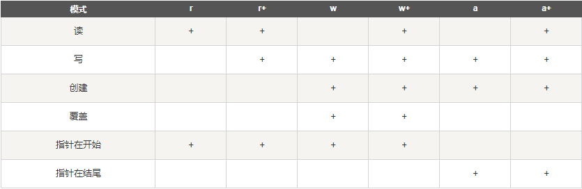
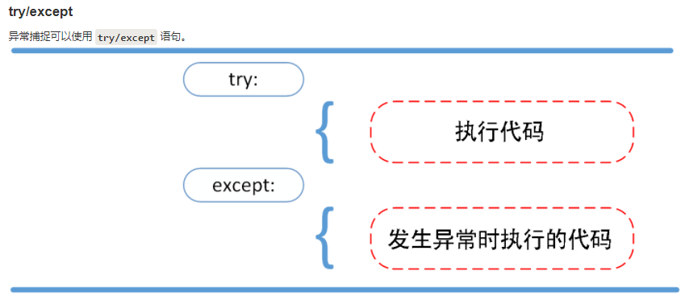
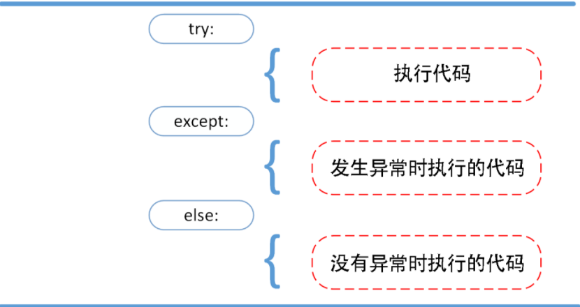
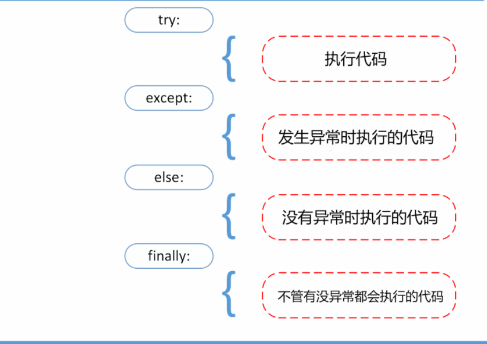
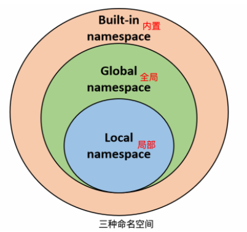
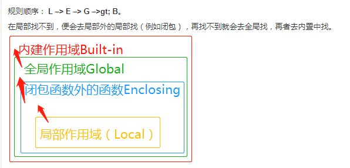

### 1.Python3基础语法

#### 1.1数字类型(Number)

```python
python中数字有四种类型：整数、布尔型、浮点数和复数
1.int(整数)，如1，只有一种整数类型int，没有Python2中的Long
2.bool(布尔)，如True
3.float(浮点数)，如1.23、3E-2
4.complex(复数)，如1+2j 、1.1+1.2j
```

#### 1.2字符串(String)

```python
1.python中单引号和双引号使用完全相同。
2.使用三引号('''或""")可以指定一个多行字符串。        """ '''
3.转义符 '\'           
4.反斜杠可以用来转义，使用r可以让反斜杠不发生转义。。 如 r"this is a line with \n" 则\n会显示，并不是换行。
5.按字面意义级联字符串，如"this " "is " "string"会被自动转换为this is string。
6.字符串可以用 + 运算符连接在一起，用 * 运算符重复。
7.Python 中的字符串有两种索引方式，从左往右以 0 开始，从右往左以 -1 开始。
8.Python中的字符串不能改变。
9.Python 没有单独的字符类型，一个字符就是长度为 1 的字符串。
10.字符串的截取的语法格式如下：变量[头下标:尾下标:步长]
        
#实例
#!/usr/bin/python3
 
str='Runoob'
 
print(str)                 # 输出字符串
print(str[0:-1])           # 输出第一个到倒数第二个的所有字符
print(str[0])              # 输出字符串第一个字符
print(str[2:5])            # 输出从第三个开始到第五个的字符
print(str[2:])             # 输出从第三个开始后的所有字符
print(str * 2)             # 输出字符串两次
print(str + '你好')        # 连接字符串
 
print('------------------------------')
 
print('hello\nrunoob')      # 使用反斜杠(\)+n转义特殊字符
print(r'hello\nrunoob')     # 在字符串前面添加一个 r，表示原始字符串，不会发生转义
```

#### 1.3空行

```
函数之间或类的方法之间用空行分隔，表示一段新的代码的开始。类和函数入口之间也用一行空行分隔，以突出函数入口的开始。

空行与代码缩进不同，空行并不是Python语法的一部分。书写时不插入空行，Python解释器运行也不会出错。但是空行的作用在于分隔两段不同功能或含义的代码，便于日后代码的维护或重构。

记住：空行也是程序代码的一部分。
```

#### 1.4等待用户输入

```Python
#!/usr/bin/python3
 
input("\n\n按下 enter 键后退出。")
```

#### 1.5同一行显示多条语句

```Python
Python可以在同一行中使用多条语句，语句之间使用分号(;)分割，以下是一个简单的实例：
#!/usr/bin/python3
 
import sys; x = 'runoob'; sys.stdout.write(x + '\n')
```

#### 1.6多个语句构成代码组

```Python
缩进相同的一组语句构成一个代码块，我们称之代码组。
像if、while、def和class这样的复合语句，首行以关键字开始，以冒号( : )结束，该行之后的一行或多行代码构成代码组。
我们将首行及后面的代码组称为一个子句(clause)。
如下实例：

if expression : 
   suite
elif expression : 
   suite 
else : 
   suite
```

#### 1.7print输出

```python
print 默认输出是换行的，如果要实现不换行需要在变量末尾加上 end=""：

实例：
#!/usr/bin/python3
 
x="a"
y="b"
# 换行输出
print( x )
print( y )
 
print('---------')
# 不换行输出
print( x, end=" " )
print( y, end=" " )
print()
```

#### 1.8import和from...import

```python
在 python 用 import 或者 from...import 来导入相应的模块。
将整个模块(somemodule)导入，格式为： import somemodule
从某个模块中导入某个函数,格式为： from somemodule import somefunction
从某个模块中导入多个函数,格式为： from somemodule import firstfunc, secondfunc, thirdfunc
将某个模块中的全部函数导入，格式为： from somemodule import *
```

### 2.Python3基本数据类型

python中的变量不需要声明。每个变量在使用前必须赋值，变量赋值以后该变量才会被创建。

python中可以同时为多个变量赋值：

```python 
a=b=c=1
a,b,c = 1, 1.2, "fangyan"
```

**标准数据类型**

```
Python3 中有六个标准的数据类型：
Number（数字）
String（字符串）
List（列表）
Tuple（元组）
Set（集合）
Dictionary（字典）

Python3 的六个标准数据类型中：
不可变数据（3 个）：Number（数字）、String（字符串）、Tuple（元组）；
可变数据（3 个）：List（列表）、Dictionary（字典）、Set（集合）。
```

#### 2.1Number(数字)

Python3 支持 **int、float、bool、complex（复数）**。 

```Python
1.type()和isinstance()的区别：
    type()不会认为子类是一种父类类型。
    isinstance()会认为子类是一种父类类型。
2.del 删除对象引用
	del var  #删除一个对象
	del var_a, var_b  #删除多个对象
```

**数值运算**

```Python
>>> 5 + 4  # 加法
9
>>> 4.3 - 2 # 减法
2.3
>>> 3 * 7  # 乘法
21
>>> 2 / 4  # 除法，得到一个浮点数
0.5
>>> 2 // 4 # 除法，得到一个整数
0
>>> 17 % 3 # 取余
2
>>> 2 ** 5 # 乘方
32

注意：
1、Python可以同时为多个变量赋值，如a, b = 1, 2。
2、一个变量可以通过赋值指向不同类型的对象。
3、数值的除法包含两个运算符：/ 返回一个浮点数，// 返回一个整数。
4、在混合计算时，Python会把整型转换成为浮点数。
```

#### 2.2String(字符串)

```
注意：

1、反斜杠可以用来转义，使用r可以让反斜杠不发生转义。
2、字符串可以用+运算符连接在一起，用*运算符重复。
3、Python中的字符串有两种索引方式，从左往右以0开始，从右往左以-1开始。
4、Python中的字符串不能改变。

具体实例见 1.2
```

#### 2.3List(列表)

```Python
1.List（列表） 是 Python 中使用最频繁的数据类型。
2.列表可以完成大多数集合类的数据结构实现。列表中元素的类型可以不相同，它支持数字，字符串甚至可以包含列表（所谓嵌套）。
3.列表是写在方括号 [] 之间、用逗号分隔开的元素列表。
4.和字符串一样，列表同样可以被索引和截取，列表被截取后返回一个包含所需元素的新列表。
5.列表截取的语法格式如下：
	变量[头下标:尾下标]
	索引值以 0 为开始值，-1 为从末尾的开始位置。
6.加号 + 是列表连接运算符，星号 * 是重复操作。如下实例：
#!/usr/bin/python3
list = [ 'abcd', 786 , 2.23, 'runoob', 70.2 ]
tinylist = [123, 'runoob']
print (list)            # 输出完整列表
print (list[0])         # 输出列表第一个元素
print (list[1:3])       # 从第二个开始输出到第三个元素
print (list[2:])        # 输出从第三个元素开始的所有元素
print (tinylist * 2)    # 输出两次列表
print (list + tinylist) # 连接列表

7.与Python字符串不一样的是，列表中的元素是可以改变的：
	>>> a = [1, 2, 3, 4, 5, 6]
    >>> a[0] = 9
    >>> a[2:5] = [13, 14, 15]
    >>> a
    [9, 2, 13, 14, 15, 6]
    >>> a[2:5] = []   # 将对应的元素值设置为 []
    >>> a
    [9, 2, 6]

8.Python 列表截取可以接收第三个参数，参数作用是截取的步长，以下实例在索引 1 到索引 4 的位置并设置为步长为 2（间隔一个位置）来截取字符串：
```

#### 2.4Tuple(元组)

```Python
1.元组（tuple）与列表类似，不同之处在于元组的元素不能修改。元组写在小括号 () 里，元素之间用逗号隔开。
元组中的元素类型也可以不相同：
#!/usr/bin/python3
tuple = ( 'abcd', 786 , 2.23, 'runoob', 70.2  )
tinytuple = (123, 'runoob')
print (tuple)             # 输出完整元组
print (tuple[0])          # 输出元组的第一个元素
print (tuple[1:3])        # 输出从第二个元素开始到第三个元素
print (tuple[2:])         # 输出从第三个元素开始的所有元素
print (tinytuple * 2)     # 输出两次元组
print (tuple + tinytuple) # 连接元组

2.元组与字符串类似，可以被索引且下标索引从0开始，-1 为从末尾开始的位置。也可以进行截取（看上面，这里不再赘述）
3.其实，可以把字符串看作一种特殊的元组。
4.虽然tuple的元素不可改变，但它可以包含可变的对象，比如list列表。
5.构造包含 0 个或 1 个元素的元组比较特殊，所以有一些额外的语法规则：
	tup1 = ()    # 空元组
	tup2 = (20,) # 一个元素，需要在元素后添加逗号
6.string、list 和 tuple 都属于 sequence（序列）。
```

#### 2.5Set(集合)

```Python
1.集合（set）是由一个或数个形态各异的大小整体组成的，构成集合的事物或对象称作元素或是成员。
2.基本功能是进行成员关系测试和删除重复元素。
3.可以使用大括号 { } 或者 set() 函数创建集合，注意：创建一个空集合必须用 set() 而不是 { }，因为 { } 是用来创建一个空字典。
创建格式：
	parame = {value01,value02,...}
    或者
    set(value)
实例
#!/usr/bin/python3
sites = {'Google', 'Taobao', 'Runoob', 'Facebook', 'Zhihu', 'Baidu'}
print(sites)   # 输出集合，重复的元素被自动去掉

# 成员测试
if 'Runoob' in sites :
    print('Runoob 在集合中')
else :
    print('Runoob 不在集合中')

# set可以进行集合运算
a = set('abracadabra')
b = set('alacazam')
print(a)
print(a - b)     # a 和 b 的差集
print(a | b)     # a 和 b 的并集
print(a & b)     # a 和 b 的交集
print(a ^ b)     # a 和 b 中不同时存在的元素
```

#### 2.6Dictionary(字典)

```python 
1.字典（dictionary）是Python中另一个非常有用的内置数据类型。
2.列表是有序的对象集合，字典是无序的对象集合。两者之间的区别在于：字典当中的元素是通过键来存取的，而不是通过偏移存取。
3.字典是一种映射类型，字典用 { } 标识，它是一个无序的 键(key) : 值(value) 的集合。
4.键(key)必须使用不可变类型。
5.在同一个字典中，键(key)必须是唯一的。

    #实例：
    #!/usr/bin/python3
    dict = {}
    dict['one'] = "1 - 菜鸟教程"
    dict[2]     = "2 - 菜鸟工具"
    tinydict = {'name': 'runoob','code':1, 'site': 'www.runoob.com'}
    print (dict['one'])       # 输出键为 'one' 的值
    print (dict[2])           # 输出键为 2 的值
    print (tinydict)          # 输出完整的字典
    print (tinydict.keys())   # 输出所有键
    print (tinydict.values()) # 输出所有值
    #===========================输出结果=================================
    1 - 菜鸟教程
    2 - 菜鸟工具
    {'name': 'runoob', 'code': 1, 'site': 'www.runoob.com'}
    dict_keys(['name', 'code', 'site'])
    dict_values(['runoob', 1, 'www.runoob.com'])

6.构造函数 dict() 可以直接从键值对序列中构建字典如下：
    >>> dict([('Runoob', 1), ('Google', 2), ('Taobao', 3)])
    {'Runoob': 1, 'Google': 2, 'Taobao': 3}
    >>> {x: x**2 for x in (2, 4, 6)}
    {2: 4, 4: 16, 6: 36}
    >>> dict(Runoob=1, Google=2, Taobao=3)
    {'Runoob': 1, 'Google': 2, 'Taobao': 3}
    >>>
    
7.注意：
    1)字典是一种映射类型，它的元素是键值对。
    2)字典的关键字必须为不可变类型，且不能重复。
    3)创建空字典使用 { }。
```

#### 2.7python数据类型转换

有时候，我们需要对数据内置的类型进行转换，数据类型的转换，你只需要将数据类型作为函数名即可。

以下几个内置的函数可以执行数据类型之间的转换。这些函数返回一个新的对象，表示转换的值。

| 函数                                                         | 描述                                                |
| ------------------------------------------------------------ | --------------------------------------------------- |
| [int(x [,base\])](https://www.runoob.com/python3/python-func-int.html) | 将x转换为一个整数                                   |
| [float(x)](https://www.runoob.com/python3/python-func-float.html) | 将x转换到一个浮点数                                 |
| [complex(real [,imag\])](https://www.runoob.com/python3/python-func-complex.html) | 创建一个复数                                        |
| [str(x)](https://www.runoob.com/python3/python-func-str.html) | 将对象 x 转换为字符串                               |
| [repr(x)](https://www.runoob.com/python3/python-func-repr.html) | 将对象 x 转换为表达式字符串                         |
| [eval(str)](https://www.runoob.com/python3/python-func-eval.html) | 用来计算在字符串中的有效Python表达式,并返回一个对象 |
| [tuple(s)](https://www.runoob.com/python3/python3-func-tuple.html) | 将序列 s 转换为一个元组                             |
| [list(s)](https://www.runoob.com/python3/python3-att-list-list.html) | 将序列 s 转换为一个列表                             |
| [set(s)](https://www.runoob.com/python3/python-func-set.html) | 转换为可变集合                                      |
| [dict(d)](https://www.runoob.com/python3/python-func-dict.html) | 创建一个字典。d 必须是一个 (key, value)元组序列。   |
| [frozenset(s)](https://www.runoob.com/python3/python-func-frozenset.html) | 转换为不可变集合                                    |
| [chr(x)](https://www.runoob.com/python3/python-func-chr.html) | 将一个整数转换为一个字符                            |
| [ord(x)](https://www.runoob.com/python3/python-func-ord.html) | 将一个字符转换为它的整数值                          |
| [hex(x)](https://www.runoob.com/python3/python-func-hex.html) | 将一个整数转换为一个十六进制字符串                  |
| [oct(x)](https://www.runoob.com/python3/python-func-oct.html) | 将一个整数转换为一个八进制字符串                    |

### 3.条件控制、循环

#### 3.1if

```python
Python中if语句的一般形式如下所示：
    if condition_1:
        statement_block_1
    elif condition_2:
        statement_block_2
    else:
        statement_block_3
        
注意：
1、每个条件后面要使用冒号 :，表示接下来是满足条件后要执行的语句块。
2、使用缩进来划分语句块，相同缩进数的语句在一起组成一个语句块。
3、在Python中没有switch – case语句。
```

#### 3.2while循环

```Python
1.Python中while语句一般形式：
	while 判断条件(condition)：
    	执行语句(statements)……
        
2.while循环使用else语句：
	在 while … else 在条件语句为 false 时执行 else 的语句块。
	语法格式如下：
    
    while <expr>:
        <statement(s)>
    else:
    	<additional_statement(s)>

3.类似if语句的语法，如果你的while循环体中只有一条语句，你可以将该语句与while写在同一行中， 如下所示：
    #!/usr/bin/python
    flag = 1
    while (flag): print ('欢迎访问菜鸟教程!')
	print ("Good bye!")
```

#### 3.3for语句

```Python
Python for循环可以遍历任何序列的项目，如一个列表或者一个字符串。
for循环的一般格式如下：
    for <variable> in <sequence>:
        <statements>
    else:
        <statements>
```

#### 3.4range()函数

```python 
1.如果你需要遍历数字序列，可以使用内置range()函数。它会生成数列，例如:
    for i in range(5):
    	print(i, end=",")
    #输出结果：0,1,2,3,4,
2.你也可以使用range指定区间的值：
    for i in range(5,9) :
        print(i)
3.也可以使range以指定数字开始并指定不同的增量(甚至可以是负数，有时这也叫做'步长'):
    for i in range(0, 10, 3) :
   		print(i)
 4.您可以结合range()和len()函数以遍历一个序列的索引,如下所示:
    a = ['Google', 'Baidu', 'Runoob', 'Taobao', 'QQ']
    for i in range(len(a)) :
        print("索引", i, "值", a[i])
    #结果如下：
    索引 0 值 Google
    索引 1 值 Baidu
    索引 2 值 Runoob
    索引 3 值 Taobao
    索引 4 值 QQ
5.还可以使用range()函数来创建一个列表：
	list(range(5))
	[0, 1, 2, 3, 4]
```

#### 3.5break和continue语句（略，和java类似）

#### 3.6pass语句

```Python
Python pass是空语句，是为了保持程序结构的完整性。
pass 不做任何事情，一般用做占位语句，如下实例
    while 1 :
        pass
```

### 4.迭代器与生成器

#### 4.1迭代器

```Python
1.迭代是Python最强大的功能之一，是访问集合元素的一种方式。
    迭代器是一个可以记住遍历的位置的对象。
    迭代器对象从集合的第一个元素开始访问，直到所有的元素被访问完结束。迭代器只能往前不会后退。
    迭代器有两个基本的方法：iter() 和 next()。
    字符串，列表或元组对象都可用于创建迭代器：
    a = [1, 2, 3, 4, 5]
    it = iter(a)	#创建迭代器对象
    print(next(it))		#输出迭代器下一个元素
2.迭代器对象可以使用常规for语句进行遍历：
	a = [1, 2, 3, 4, 5]
    it = iter(a)
    for i in it :
        print(i, end=" ")
    #输出结果 ： 1 2 3 4 5 
3.也可以使用next()函数：
    a = [1, 2, 3, 4, 5]
    it = iter(a)
    while True :
        try:
            print(next(it))
        except StopIteration:
            sys.exit()
```

#### 4.2生成器yield

```python 
在 Python 中，使用了 yield 的函数被称为生成器（generator）。
跟普通函数不同的是，生成器是一个返回迭代器的函数，只能用于迭代操作，更简单点理解生成器就是一个迭代器。
在调用生成器运行的过程中，每次遇到 yield 时函数会暂停并保存当前所有的运行信息，返回 yield 的值, 并在下一次执行 next() 方法时从当前位置继续运行。
调用一个生成器函数，返回的是一个迭代器对象。
以下实例使用 yield 实现斐波那契数列：

import sys

def fibonacci(n) :		#生成器函数
    a, b, counter = 0, 1, 0
    while True :
        if counter > n :
            return
        yield a
        a, b = b, a + b
        counter += 1

f = fibonacci(10)    #f是一个迭代器，由生成器生成返回
while True :
    try:
        print(next(f), end=" ")
    except StopIteration :
        sys.exit()
```

### 5.函数

#### 5.1语法

```Python
1.Python 定义函数使用 def 关键字，一般格式如下：
	def 函数名（参数列表）:
    	函数体
2.函数调用示例：
    #!/usr/bin/python3
    # 定义函数
    def printme( str ):
       # 打印任何传入的字符串
       print (str)
       return
    # 调用函数
    printme("我要调用用户自定义函数!")
    printme("再次调用同一函数")
```

#### 5.2参数传递

```python
1.在Python中，类型属于对象，变量是没有类型的。
    a=[1,2,3]
    a="Runoob"
    以上代码中，[1,2,3] 是 List 类型，"Runoob" 是 String 类型，而变量 a 是没有类型，她仅仅是一个对象的引用（一个指针），可以是指向 List 类型对象，也可以是指向 String 类型对象。
    
2.可更改(mutable)与不可更改(immutable)对象
	在 python 中，strings, tuples, 和 numbers 是不可更改的对象，而 list,dict，set 等则是可以修改的对象
    1)不可变类型：变量赋值 a=5 后再赋值 a=10，这里实际是新生成一个 int 值对象 10，再让 a 指向它，而 5 被丢弃，不是改变 a 的值，相当于新生成了 a。
	2)可变类型：变量赋值 la=[1,2,3,4] 后再赋值 la[2]=5 则是将 list la 的第三个元素值更改，本身la没有动，只是其内部的一部分值被修改了。

	python 函数的参数传递：
	1)不可变类型：类似 C++ 的值传递，如 整数、字符串、元组。如 fun(a)，传递的只是 a 的值，没有影响 a 对象本身。如果在 fun(a)）内部修改 a 的值，则是新生成来一个 a。
	2)可变类型：类似 C++ 的引用传递，如 列表，字典。如 fun(la)，则是将 la 真正的传过去，修改后 fun 外部的 la 也会受影响
    
#和java中的 基本数据类型进行值传递， 引用数据类型进行引用传递 类似。
#注意：python 中一切都是对象，严格意义我们不能说值传递还是引用传递，我们应该说传不可变对象和传可变对象。

3.Python传不可变对象实例：
    def change(a):
        print(id(a))   # 指向的是同一个对象
        a=10
        print(id(a))   # 一个新对象

    a=1
    print(id(a))
    change(a)
    #可以看见在调用函数前后，形参和实参指向的是同一个对象（对象 id 相同），在函数内部修改形参后，形参指向的是不同的 id。
    
4.传可变对象实例
    #!/usr/bin/python3
    # 可写函数说明
    def changeme( mylist ):
       "修改传入的列表"
       mylist.append([1,2,3,4])
       print ("函数内取值: ", mylist)
       return
    # 调用changeme函数
    mylist = [10,20,30]
    changeme( mylist )
    print ("函数外取值: ", mylist)
    
    #可变对象在函数里修改了参数，那么在调用这个函数的函数里，原始的参数也被改变了
```

##### 5.2.1必须参数

```Python
必需参数须以正确的顺序传入函数。调用时的数量必须和声明时的一样。
    #!/usr/bin/python3
    #可写函数说明
    def printme( str ):
       "打印任何传入的字符串"
       print (str)
       return

    # 调用 printme 函数，不加参数会报错
    printme()
```

##### 5.2.2关键字参数

```Python
使用关键字参数允许函数调用时参数的顺序与声明时不一致，因为 Python 解释器能够用参数名匹配参数值。
    #!/usr/bin/python3

    #可写函数说明
    def printinfo( name, age ):
       "打印任何传入的字符串"
       print ("名字: ", name)
       print ("年龄: ", age)
       return

    #调用printinfo函数
    printinfo( age=50, name="runoob" )
```

##### 5.2.3默认参数

```Python
调用函数时，如果没有传递参数，则会使用默认参数。以下实例中如果没有传入 age 参数，则使用默认值：
    #!/usr/bin/python3

    #可写函数说明
    def printinfo( name, age = 35 ):
       "打印任何传入的字符串"
       print ("名字: ", name)
       print ("年龄: ", age)
       return

    #调用printinfo函数
    printinfo( age=50, name="runoob" )
    print ("------------------------")
    printinfo( name="runoob" )
```

##### 5.2.4不定长参数

```Python
你可能需要一个函数能处理比当初声明时更多的参数。这些参数叫做不定长参数，和上述 2 种参数不同，声明时不会命名。基本语法如下：
def functionname([formal_args,] *var_args_tuple ):
   "函数_文档字符串"
   function_suite
   return [expression]

1.加了星号 * 的参数会以元组(tuple)的形式导入，存放所有未命名的变量参数。
    #!/usr/bin/python3
    # 可写函数说明
    def printinfo( arg1, *vartuple ):
       "打印任何传入的参数"
       print ("输出: ")
       print (arg1)
       print (vartuple)

    # 调用printinfo 函数
    printinfo( 70, 60, 50 )
    
    #输出=====================================
    输出: 
    70
    (60, 50)
    
 如果在函数调用时没有指定参数，它就是一个空元组。我们也可以不向函数传递未命名的变量

2.还有一种就是参数带两个星号 **基本语法如下：
    def test(a, **b):  #加了两个星号 ** 的参数会以字典的形式导入。
        print(a)
        print(b)

    test(1, g = 2, j = 3)
    #输出结果========================================
    1
	{'g': 2, 'j': 3}
    
3.声明函数时，参数中星号 * 可以单独出现，例如:
    def f(a,b,*,c):
    	return a+b+c
    #如果单独出现星号 * 后的参数必须用关键字传入。
    f(1,2,c=3) # 正常
    f(1,2,3) #报错
```

#### 5.3匿名函数

```Python
Python使用lambda来创建匿名函数：
lambda 只是一个表达式，函数体比 def 简单很多。
lambda的主体是一个表达式，而不是一个代码块。仅仅能在lambda表达式中封装有限的逻辑进去。
lambda 函数拥有自己的命名空间，且不能访问自己参数列表之外或全局命名空间里的参数。
虽然lambda函数看起来只能写一行，却不等同于C或C++的内联函数，后者的目的是调用小函数时不占用栈内存从而增加运行效率。

1.语法：
	lambda函数的语法只包含一个语句，如下：
    lambda [arg1 [,arg2,.....argn]]:expression
2.实例：
    sum = lambda a,b,c:a+b+c   #sum为函数名
    print("相加后的值为：", sum(10,20,30))
```

#### 5.4return语句

```Python
return [表达式] 语句用于退出函数，选择性地向调用方返回一个表达式。不带参数值的return语句返回None。之前的例子都没有示范如何返回数值，以下实例演示了 return 语句的用法：
    def test(a, b):
        return a * b

    c = test(10, 20)
    print(c)
```

#### 5.5强制位置参数

```Python
Python3.8 新增了一个函数形参语法 / 用来指明函数形参必须使用指定位置参数，不能使用关键字参数的形式。
在以下的例子中，形参 a 和 b 必须使用指定位置参数，c 或 d 可以是位置形参或关键字形参，而 e 或 f 要求为关键字形参:
    def f(a, b, /, c, d, *, e, f):
    	print(a, b, c, d, e, f)
        
    #以下使用方法是正确的:
    f(10, 20, 30, d=40, e=50, f=60)
```

### 6.数据结构

#### 6.1列表

```Python
Python中列表是可变的，这是它区别于字符串和元组的最重要的特点，一句话概括即：列表可以修改，而字符串和元组不能。
以下是 Python 中列表的方法实例：
>>> a = [66.25, 333, 333, 1, 1234.5]
>>> print(a.count(333), a.count(66.25), a.count('x'))
2 1 0
>>> a.insert(2, -1)
>>> a.append(333)
>>> a
[66.25, 333, -1, 333, 1, 1234.5, 333]
>>> a.index(333)
1
>>> a.remove(333)
>>> a
[66.25, -1, 333, 1, 1234.5, 333]
>>> a.reverse()
>>> a
[333, 1234.5, 1, 333, -1, 66.25]
>>> a.sort()
>>> a
[-1, 1, 66.25, 333, 333, 1234.5]
```

#### 6.2将列表当做堆栈使用

```Python
列表方法使得列表可以很方便的作为一个堆栈来使用，堆栈作为特定的数据结构，最先进入的元素最后一个被释放（后进先出）。用 append() 方法可以把一个元素添加到堆栈顶。用不指定索引的 pop() 方法可以把一个元素从堆栈顶释放出来。例如：
>>> stack = [3, 4, 5]
>>> stack.append(6)
>>> stack.append(7)
>>> stack
[3, 4, 5, 6, 7]
>>> stack.pop()
7
>>> stack
[3, 4, 5, 6]
>>> stack.pop()
6
>>> stack.pop()
5
>>> stack
[3, 4]
```

#### 6.3将列表当做队列使用

```Python
也可以把列表当做队列用，只是在队列里第一加入的元素，第一个取出来；但是拿列表用作这样的目的效率不高。在列表的最后添加或者弹出元素速度快，然而在列表里插入或者从头部弹出速度却不快（因为所有其他的元素都得一个一个地移动）。
    from collections import deque

    queue = deque(['fangyan', 'zhangsiyu', 'zhangyingying'])
    queue.append('zgd')
    queue.append('zyj')
    print(queue.popleft())
    print(queue)
    #==========================结果====================
    fangyan
	deque(['zhangsiyu', 'zhangyingying', 'zgd', 'zyj'])
```

#### 6.4列表推导式

```Python
列表推导式提供了从序列创建列表的简单途径。通常应用程序将一些操作应用于某个序列的每个元素，用其获得的结果作为生成新列表的元素，或者根据确定的判定条件创建子序列。
1.实例1，将列表中每个元素乘以3生成新的列表
    vec = [2, 4, 6]
    newVec = [3 * x for x in vec]   #将列表每个元素乘以3生成新列表
    newVec2 = [[x, x**2] for x in vec]  #
    print(newVec)
    print(newVec2)
    #-----------------------------------------------
    [6, 12, 18]
    [[2, 4], [4, 16], [6, 36]]
    
2.实例2，
    vec = [' 宋江 ', ' 卢俊义  ', '吴用']
    print([x.strip() for x in vec])  #对列表中每个元素都调用strip()去除空格方法
    #--------------------------------------------
    ['宋江', '卢俊义', '吴用']

3.实例3，可以使用if语句作为过滤条件
	vec = [1, 5, 3, 8, 2]
	print([x*2 for x in vec if x > 3])
    #---------------------------------------------------
    [10, 16]

4.实例4，循环的一些技巧
    vec1 = [2, 4, 6]
    vec2 = [4, 3, -9]
    result = [x*y for x in vec1 for y in vec2]
    result2 = [vec1[i]*vec2[i] for i in range(len(vec1))]
    print(result)
    print(result2)
    #------------------------------------------------
    [8, 6, -18, 16, 12, -36, 24, 18, -54]
	[8, 12, -54]
    
5.列表推导式可以使用复杂表达式或嵌套函数
    list = [round(355/113, i) for i in range(1, 6)]
    print(list)
    #-------------------------------------
    [3.1, 3.14, 3.142, 3.1416, 3.14159]
```

#### 6.5嵌套列表解析

```Python
1.将3*4矩阵转为4*3矩阵
    vec = [
        [1,2,3,4],
        [5,6,7,8],
        [9,10,11,12]
    ]
    result = [[row[i] for row in vec] for i in range(4)]
    print(result)
    #------------------------------------------
    [[1, 5, 9], [2, 6, 10], [3, 7, 11], [4, 8, 12]]
  
#也可以使用以下方式实现：
    vec = [
        [1,2,3,4],
        [5,6,7,8],
        [9,10,11,12]
    ]
    result = []
    for i in range(4):
        result.append([rowData[i] for rowData in vec])
    print(result)
```

#### 6.6del语句

```Python
使用 del 语句可以从一个列表中依索引而不是值来删除一个元素。这与使用 pop() 返回一个值不同。可以用 del 语句从列表中删除一个切割，或清空整个列表（我们以前介绍的方法是给该切割赋一个空列表）。例如：
    a = [-1, 1, 66.25, 333, 333, 1234.5]
    del a[0]
    print(a)
    del a[2:4]   #左闭右开
    print(a)
    del a[:]
    print(a)
    #------------------------------
    [1, 66.25, 333, 333, 1234.5]
    [1, 66.25, 1234.5]
    []
```

#### 6.7元组和序列

```Python
t = 12345, 54321, 'hello'
print(t)
u = t, 'fangyan', 'love', 'you'
print(u)
print(list(u))

#如你所见，元组在输出时总是有括号的，以便于正确表达嵌套结构。在输入时可能有或没有括号， 不过括号通常是必须的（如果元组是更大的表达式的一部分）。
```

#### 6.8集合

```Python
1.集合是一个无序不重复元素的集。基本功能包括关系测试和消除重复元素。
2.可以用大括号({})创建集合。注意：如果要创建一个空集合，你必须用 set() 而不是 {} ；后者创建一个空的字典
3.简单示例：
    basket = {'apple', 'orange', 'apple', 'pear', 'orange', 'banana'}
    print(basket)   #去除重复元素
    print('apple' in basket)  #Ture 检测元素

    #两个集合之间的操作，交集、并集、异或等操作，这些在列表、字符串、元组中是不可以操作的
    #因此如果想对列表、字符串、元组等进行操作，需要转为set集合，如下：
    a = set('abracadabra')
    b = set('alacazam')
    print(a-b)  #a中存在，b中不存在
    print(a|b)  #a或b中的字母，并集
    print(a&b)  #a/b中同时存在，交集
    print(a^b)  #在a中或b中但不同时存在的字母
    #---------------------------------------------------
    {'orange', 'banana', 'pear', 'apple'}
    True
    {'b', 'r', 'd'}
    {'d', 'z', 'b', 'l', 'm', 'c', 'a', 'r'}
    {'c', 'a'}
    {'m', 'r', 'd', 'z', 'b', 'l'}
4.集合也支持推导式
    a = {x for x in 'abracadabra' if x not in 'abc'}
    print(a)
    #-----------------------------------------
	{'r', 'd'}
```

#### 6.9字典

```Python
1.另一个非常有用的 Python 内建数据类型是字典。
2.序列是以连续的整数为索引，与此不同的是，字典以关键字为索引，关键字可以是任意不可变类型，通常用字符串或数值。
3.理解字典的最佳方式是把它看做无序的键=>值对集合。在同一个字典之内，关键字必须是互不相同。
4.一对大括号创建一个空的字典：{}。
5.这是一个字典运用的简单例子：
    >>> tel = {'jack': 4098, 'sape': 4139}
    >>> tel['guido'] = 4127
    >>> tel
    {'sape': 4139, 'guido': 4127, 'jack': 4098}
    >>> tel['jack']
    4098
    >>> del tel['sape']
    >>> tel['irv'] = 4127
    >>> tel
    {'guido': 4127, 'irv': 4127, 'jack': 4098}
    >>> list(tel.keys())
    ['irv', 'guido', 'jack']
    >>> sorted(tel.keys())
    ['guido', 'irv', 'jack']
    >>> 'guido' in tel
    True
    >>> 'jack' not in tel
	False
6.构造函数 dict() 直接从键值对元组列表中构建字典。如果有固定的模式，列表推导式指定特定的键值对：
    a = dict([('sape', 4139), ('guido', 4127), ('jack', 4098)])
    print(a)
    #--------------------------------
    {'sape': 4139, 'guido': 4127, 'jack': 4098}
7.字典推导可以用来创建任意键和值的表达式词典：
    a = {x:x*2 for x in (2,4,6)}
    print(a)
    #----------------------------------
    {2: 4, 4: 8, 6: 12}
8.如果关键字只是简单的字符串，使用关键字参数指定键值对有时候更方便：
	a = dict(sape=4139, guido=4127, jack=4098)
	print(a)	
    #---------------------------------------
    {'sape': 4139, 'guido': 4127, 'jack': 4098}
```

#### 6.10遍历技巧

```Python
1.在字典中遍历时，关键字和对应的值可以使用 items() 方法同时解读出来：
    knights = {'gallahad': 'the pure', 'robin': 'the brave'}
    for k,v in knights.items():
        print(k, v)
    #-------------------------------------------
    gallahad the pure
	robin the brave
2.在序列中遍历时，索引位置和对应值可以使用 enumerate() 函数同时得到：
	for i, v in enumerate(['i', 'love', 'you']):
    	print(i, v)
    #-----------------------------------
    0 i
    1 love
    2 you
3.同时遍历两个或更多的序列，可以使用 zip() 组合：
    questions = ['name', 'quest', 'favorite color']
    answers = ['lancelot', 'the holy grail', 'blue']
    for a,b in zip(questions, answers):
        print(a,b)
    #----------------------------------
    name lancelot
    quest the holy grail
    favorite color blue
4.要反向遍历一个序列，首先指定这个序列，然后调用 reversed() 函数：
    for i in reversed(range(1, 10, 2)):
        print(i)
    #-----------------------------
    9
    7
    5
    3
    1
5.要按顺序遍历一个序列，使用 sorted() 函数返回一个已排序的序列，并不修改原值：
    basket = ['apple', 'orange', 'apple', 'pear', 'orange', 'banana']
    for f in sorted(set(basket)):
        print(f)
    #---------------------------------------
    apple
    banana
    orange
    pear
```

### 7.模块

#### 7.1Python模块

```Python
Python 模块(Module)，是一个 Python 文件，以 .py 结尾，包含了 Python 对象定义和Python语句。
模块让你能够有逻辑地组织你的 Python 代码段。
把相关的代码分配到一个模块里能让你的代码更好用，更易懂。
模块能定义函数，类和变量，模块里也能包含可执行的代码。
#说明：Python模块类似于java中的类
```

#### 7.2import语句

```Python
1.模块定义好后，我们可以使用 import 语句来引入模块，语法如下：
	import module1[, module2[,... moduleN]]
2.比如要引用模块 math，就可以在文件最开始的地方用 import math 来引入。在调用 math 模块中的函数时，必须这样引用：
	模块名.函数名
3.当解释器遇到 import 语句，如果模块在当前的搜索路径就会被导入。搜索路径是一个解释器会先进行搜索的所有目录的列表。如想要导入模块 support.py，需要把命令放在脚本的顶端：
    #!/usr/bin/python
    # -*- coding: UTF-8 -*-

    # 导入模块
    import support

    # 现在可以调用模块里包含的函数了
    support.print_func("Runoob")
```

#### 7.3from...import语句

```Python
1.Python 的 from 语句让你从模块中导入一个指定的部分到当前命名空间中。语法如下：
	from modname import name1[, name2[, ... nameN]]
    
    例如，要导入模块 fib 的 fibonacci 函数，使用如下语句：
    from fib import fibonacci
    
2.from…import* 语句
	把一个模块的所有内容全都导入到当前的命名空间也是可行的，只需使用如下声明：
    from modname import *
```

#### 7.4搜索路径

```Python
当你导入一个模块，Python 解析器对模块位置的搜索顺序是：
1、当前目录
2、如果不在当前目录，Python 则搜索在 shell 变量 PYTHONPATH 下的每个目录。
3、如果都找不到，Python会察看默认路径。UNIX下，默认路径一般为/usr/local/lib/python/。
模块搜索路径存储在 system 模块的 sys.path 变量中。变量里包含当前目录，PYTHONPATH和由安装过程决定的默认目录。
```

#### 7.5PYTHONPATH 变量

```Python
1.作为环境变量，PYTHONPATH 由装在一个列表里的许多目录组成。PYTHONPATH 的语法和 shell 变量 PATH 的一样。
在 Windows 系统，典型的 PYTHONPATH 如下：
	set PYTHONPATH=c:\python27\lib;
2.在 UNIX 系统，典型的 PYTHONPATH 如下：
	set PYTHONPATH=/usr/local/lib/python
```

#### 7.6命名空间和作用域

```Python
1.变量是拥有匹配对象的名字（标识符）。命名空间是一个包含了变量名称们（键）和它们各自相应的对象们（值）的字典。
2.一个 Python 表达式可以访问局部命名空间和全局命名空间里的变量。如果一个局部变量和一个全局变量重名，则局部变量会覆盖全局变量。
3.每个函数都有自己的命名空间。类的方法的作用域规则和通常函数的一样。
4.Python 会智能地猜测一个变量是局部的还是全局的，它假设任何在函数内赋值的变量都是局部的。
5.因此，如果要给函数内的全局变量赋值，必须使用 global 语句。
6.global VarName 的表达式会告诉 Python， VarName 是一个全局变量，这样 Python 就不会在局部命名空间里寻找这个变量了。
7.例如，我们在全局命名空间里定义一个变量 Money。我们再在函数内给变量 Money 赋值，然后 Python 会假定 Money 是一个局部变量。然而，我们并没有在访问前声明一个局部变量 Money，结果就是会出现一个 UnboundLocalError 的错误。取消 global 语句前的注释符就能解决这个问题。

    #!/usr/bin/python
    # -*- coding: UTF-8 -*-

    Money = 2000
    def AddMoney():
       # 想改正代码就取消以下注释:
       # global Money
       Money = Money + 1

    print Money
    AddMoney()
    print Money
```

#### 7.7dir()函数

```Python
1.dir() 函数一个排好序的字符串列表，内容是一个模块里定义过的名字。
返回的列表容纳了在一个模块里定义的所有模块，变量和函数。如下一个简单的实例：
    #!/usr/bin/python
    # -*- coding: UTF-8 -*-
    # 导入内置math模块
    import math
    content = dir(math)
    print content;
    #-----------------------------------------
    ['__doc__', '__file__', '__name__', 'acos', 'asin', 'atan', 
    'atan2', 'ceil', 'cos', 'cosh', 'degrees', 'e', 'exp', 
    'fabs', 'floor', 'fmod', 'frexp', 'hypot', 'ldexp', 'log',
    'log10', 'modf', 'pi', 'pow', 'radians', 'sin', 'sinh', 
    'sqrt', 'tan', 'tanh']	
    
    #在这里，特殊字符串变量__name__指向模块的名字，__file__指向该模块的导入文件名。
```

#### 7.8globals() 和 locals() 函数

```Python
1.根据调用地方的不同，globals() 和 locals() 函数可被用来返回全局和局部命名空间里的名字。
2.如果在函数内部调用 locals()，返回的是所有能在该函数里访问的命名。
3.如果在函数内部调用 globals()，返回的是所有在该函数里能访问的全局名字。
4.两个函数的返回类型都是字典。所以名字们能用 keys() 函数摘取。
```

#### 7.9reload() 函数

```Python
1.当一个模块被导入到一个脚本，模块顶层部分的代码只会被执行一次。
因此，如果你想重新执行模块里顶层部分的代码，可以用 reload() 函数。该函数会重新导入之前导入过的模块。语法如下：
	reload(module_name)
2.在这里，module_name要直接放模块的名字，而不是一个字符串形式。比如想重载 hello 模块，如下：
	reload(hello)
```

#### 7.10Python中的包

```Python
1.包是一个分层次的文件目录结构，它定义了一个由模块及子包，和子包下的子包等组成的 Python 的应用环境。
2.简单来说，包就是文件夹，但该文件夹下必须存在 __init__.py 文件, 该文件的内容可以为空。__init__.py 用于标识当前文件夹是一个包。

#和java中的包概念类似
```

### 8.输入和输出

#### 8.1输出格式美化

```Python
1.str.format() 的基本使用如下: 
	print('{}的年龄是{}'.format('方岩', 26))
2.在括号中的数字用于指向传入对象在 format() 中的位置，如下所示：
	print('{1} 和 {0}'.format('Google', 'Runoob'))
    #-----------------------------------------
    Runoob 和 Google
3.如果在 format() 中使用了关键字参数, 那么它们的值会指向使用该名字的参数。
	print('{name}网址： {site}'.format(name='菜鸟教程', site='www.runoob.com'))
    #---------------------------------------------
    菜鸟教程网址： www.runoob.com
4.位置及关键字参数可以任意的结合:
    print('站点列表 {0}, {1}, 和 {other}。'.format('Google', 'Runoob', other='Taobao'))
    #----------------------------------
    站点列表 Google, Runoob, 和 Taobao。
```

#### 8.2读取键盘输入

```Python
Python提供了 input() 内置函数从标准输入读入一行文本，默认的标准输入是键盘。
input 可以接收一个Python表达式作为输入，并将运算结果返回。
	str = input("请输入：")
	print(str)
    #------------------------------
    请输入：fangyan
	fangyan
```

#### 8.3读和写文件

```Python
1.open() 将会返回一个 file 对象，基本语法格式如下:
    open(filename, mode)
    #filename：包含了你要访问的文件名称的字符串值。
    #mode：决定了打开文件的模式：只读，写入，追加等。所有可取值见如下的完全列表。这个参数是非强制的，默认文件访问模式为只读(r)
```



```Python
2.将字符串写入到文件中
	f = open("E://testpy.text", "w")  #以写模式打开文件
    f.write("python是一门非常好的语言。\n是的\t的确非常的好啊\n")  #向文件中写入数据
    f.close()   #关闭文件
```

#### 8.4文件对象的方法

##### 8.4.1f.read()

```Python
#本节中剩下的例子假设已经创建了一个称为 f 的文件对象。
1.f.read()
	为了读取一个文件的内容，调用 f.read(size), 这将读取一定数目的数据, 然后作为字符串或字节对象返回。
	size 是一个可选的数字类型的参数。 当 size 被忽略了或者为负, 那么该文件的所有内容都将被读取并且返回。
    #实例：
    f = open("E://testpy.text", "r")  #以写模式打开文件
    str = f.read()  #读取全部内容
    print(str)
    f.close()  #关闭文件
    #-----------------------------------------
    python是一门非常好的语言。
	是的	的确非常的好啊
2.f.readline()
	f.readline() 会从文件中读取单独的一行。换行符为 '\n'。f.readline() 如果返回一个空字符串, 说明已经已经读取到最后一行。
3.f.readlines()
	f.readlines() 将返回该文件中包含的所有行。
	如果设置可选参数 sizehint, 则读取指定长度的字节, 并且将这些字节按行分割。
    #实例：
    f = open("E://testpy.text", "r")  #以写模式打开文件
    str = f.readlines()  #读取全部内容
    print(str)
    f.close()  #关闭文件
    #------------------------------------------
    ['python是一门非常好的语言。\n', '是的\t的确非常的好啊\n']
4.另一种方式是迭代一个文件对象然后读取每行
	#实例：
    f = open("E://testpy.text", "r")  #以写模式打开文件
    for line in f:
        print(line, end='')
    f.close()
    #--------------------------------------
    python是一门非常好的语言。
	是的	的确非常的好啊
```

##### 8.4.2f.write()

```python 
1.f.write(string) 将 string 写入到文件中, 然后返回写入的字符数。
	#实例：
    #!/usr/bin/python3
    # 打开一个文件
    f = open("/tmp/foo.txt", "w")

    num = f.write( "Python 是一个非常好的语言。\n是的，的确非常好!!\n" )
    print(num)
    # 关闭打开的文件
    f.close()
2.如果要写入一些不是字符串的东西, 那么将需要先进行转换:
    #实例：
    #!/usr/bin/python3
    # 打开一个文件
    f = open("/tmp/foo1.txt", "w")
    value = ('www.runoob.com', 14)
    s = str(value)
    f.write(s)
    # 关闭打开的文件
    f.close()
```

##### 8.4.3f.tell()

```python 
f.tell() 返回文件对象当前所处的位置, 它是从文件开头开始算起的字节数。
```

##### 8.4.4f.seek()

```python
如果要改变文件当前的位置, 可以使用 f.seek(offset, from_what) 函数。
from_what 的值, 如果是 0 表示开头, 如果是 1 表示当前位置, 2 表示文件的结尾，例如：
	seek(x,0) ： 从起始位置即文件首行首字符开始移动 x 个字符
	seek(x,1) ： 表示从当前位置往后移动x个字符
	seek(-x,2)：表示从文件的结尾往前移动x个字符
from_what 值为默认为0，即文件开头。下面给出一个完整的例子：
>>> f = open('/tmp/foo.txt', 'rb+')
>>> f.write(b'0123456789abcdef')
16
>>> f.seek(5)     # 移动到文件的第六个字节
5
>>> f.read(1)
b'5'
>>> f.seek(-3, 2) # 移动到文件的倒数第三字节
13
>>> f.read(1)
b'd'
```

##### 8.4.5f.close()

```python 
当处理一个文件对象时, 使用 with 关键字是非常好的方式。在结束后, 它会帮你正确的关闭文件。 而且写起来也比 try - finally 语句块要简短:
with open('e://testpy.text', 'r') as f:
    str = f.read()
print(str)
print(f.closed)
#-----------------------------------
python是一门非常好的语言。
是的	的确非常的好啊

True
```

##### 8.4.6pickle模块

```Python
python的pickle模块实现了基本的数据序列和反序列化。
通过pickle模块的序列化操作我们能够将程序中运行的对象信息保存到文件中去，永久存储。
通过pickle模块的反序列化操作，我们能够从文件中创建上一次程序保存的对象。
基本接口：
pickle.dump(obj, file, [,protocol])
1.对 file 以读取的形式打开:
    x = pickle.load(file)
```

### 9.OS文件/目录方法

**os** 模块提供了非常丰富的方法用来处理文件和目录。常用的方法如下表所示：

 详见：<https://www.runoob.com/python3/python3-os-file-methods.html> 

### 10.异常

和java类似

#### 10.1异常处理

**1.try/except**



```python 
最后一个except子句可以忽略异常的名称，它将被当作通配符使用。你可以使用这种方法打印一个错误信息，然后再次把异常抛出。
#实例：
import sys

try:
    f = open('myfile.txt')
    s = f.readline()
    i = int(s.strip())
except OSError as err:
    print("OS error: {0}".format(err))
except ValueError:
    print("Could not convert data to an integer.")
except:
    print("Unexpected error:", sys.exc_info()[0])
    raise #抛出异常
```

**2.try/except...else**



```Python
try/except 语句还有一个可选的 else 子句，如果使用这个子句，那么必须放在所有的 except 子句之后。
else 子句将在 try 子句没有发生任何异常的时候执行。
以下实例在 try 语句中判断文件是否可以打开，如果打开文件时正常的没有发生异常则执行 else 部分的语句，读取文件内容：
for arg in sys.argv[1:]:
    try:
        f = open(arg, 'r')
    except IOError:
        print('cannot open', arg)
    else:
        print(arg, 'has', len(f.readlines()), 'lines')
        f.close()
```

**3.try-finally语句**



```Python
以下实例中 finally 语句无论异常是否发生都会执行：
try:
    runoob()
except AssertionError as error:
    print(error)
else:
    try:
        with open('file.log') as file:
            read_data = file.read()
    except FileNotFoundError as fnf_error:
        print(fnf_error)
finally:
    print('这句话，无论异常是否发生都会执行。')
```

#### 10.2抛出异常

```Python
1.Python 使用 raise 语句抛出一个指定的异常。
    raise语法格式如下：
    raise [Exception [, args [, traceback]]]

    #实例：
    x = 10
    if x > 5:
        raise Exception('x不能大于5， x的值是{}'.format(x))
    #---------------------------------------------
    Traceback (most recent call last):
      File "E:/PyCharmProject/bay.py", line 3, in <module>
        raise Exception('x不能大于5， x的值是{}'.format(x))
    Exception: x不能大于5， x的值是10
2.raise 唯一的一个参数指定了要被抛出的异常。它必须是一个异常的实例或者是异常的类（也就是 Exception 的子类）。
如果你只想知道这是否抛出了一个异常，并不想去处理它，那么一个简单的 raise 语句就可以再次把它抛出。
try:
    raise NameError('HiThere')
except NameError:
    print('An exception flew by!')
    raise
#-----------------------------------
An exception flew by!
Traceback (most recent call last):
  File "<stdin>", line 2, in ?
NameError: HiThere
```

### 11.面向对象

#### 11.1类定义

```Python
#语法格式如下：
class ClassName:
    <statement-1>
    .
    .
    .
    <statement-N>
    
#类实例化后，可以使用其属性，实际上，创建一个类之后，可以通过类名访问其属性。
```

#### 11.2类对象

```Python
1.类对象支持两种操作：属性引用和实例化。
属性引用使用和 Python 中所有的属性引用一样的标准语法：obj.name。
类对象创建后，类命名空间中所有的命名都是有效属性名。所以如果类定义是这样:
    #!/usr/bin/python3
 
    class MyClass:
        """一个简单的类实例"""
        i = 12345
        def f(self):
            return 'hello world'

    # 实例化类
    x = MyClass()

    # 访问类的属性和方法
    print("MyClass 类的属性 i 为：", x.i)
    print("MyClass 类的方法 f 输出为：", x.f())
    
2.类有一个名为__init__()的特殊方法(构造方法)，该方法在类实例化时会自动调用，像下面这样：
	class MyClass:
        i = 123456
        def __init__(self):
            print('构造函数被调用了')
        def f(self):
            return 'hello world'

    #实例化
    x = MyClass()
    print(x.i)
    print(x.f())
    #-------------------------------------------------
    构造函数被调用了
    123456
    hello world
    
3.当然，__init__()方法可以有参数，参数通过__init__()传递到类的实例化操作上。例如：
    #!/usr/bin/python3
    class Complex:
        def __init__(self, realpart, imagpart):
            self.r = realpart
            self.i = imagpart
    x = Complex(3.0, -4.5)
    print(x.r, x.i)   # 输出结果：3.0 -4.5

4.self代表的是类的实例，而非类。
```

#### 11.3类的方法

```Python
在类的内部，使用 def 关键字来定义一个方法，与一般函数定义不同，类方法必须包含参数 self, 且为第一个参数，self 代表的是类的实例。
#实例：
#!/usr/bin/python3
 
#类定义
class people:
    #定义基本属性
    name = ''
    age = 0
    #定义私有属性,私有属性在类外部无法直接进行访问
    __weight = 0
    #定义构造方法
    def __init__(self,n,a,w):
        self.name = n
        self.age = a
        self.__weight = w
    def speak(self):
        print("%s 说: 我 %d 岁。" %(self.name,self.age))
 
# 实例化类
p = people('runoob',10,30)
p.speak()

#--------------------------------------------
runoob 说: 我 10 岁。
```

#### 11.4继承

**单继承：**

```Python
Python同样支持继承，如果一种语言不支持继承，类就没有什么意义。派生类的定义如下：
class DerivedClassName(BaseClassName1):
    <statement-1>
    .
    .
    .
    <statement-N>
```

```Python
class people:
    name = ''
    age = 0
    __weight = 0    #定义一个私有变量
    def __init__(self, n, a, w):
        self.name = n
        self.age = a
        self.__weight = w
    def speak(self):
        print('{}说：我{}岁。'.format(self.name, self.age))

#单继承实例
class student(people):
    grade = ''
    def __init__(self, n, a, w, g):
        people.__init__(self, n, a, w)
        self.grade = g
    #重写父类的方法
    def speak(self):
        print('{}说：我{}岁了，我在读{}年级'.format(self.name, self.age, self.grade))

#测试
s = student('方岩', 10, 70, 3)
s.speak()

#---------------------------------------------------
方岩说：我10岁了，我在读3年级
```

**多继承：**

```Python
1.Python同样支持多继承形式。多继承类定义如下例：
class DerivedClassName(Base1, Base2, Base3):
    <statement-1>
    .
    .
    .
    <statement-N>
    
2.需要注意圆括号中父类的顺序，若是父类中有相同的方法名，而在子类使用时未指定，python从左至右搜索 即方法在子类中未找到时，从左到右查找父类中是否包含方法。
```

```Python
class people:
    name = ''
    age = 0
    __weight = 0
    def __init__(self, n, a, w):
        self.name = n
        self.age = a
        self.__weight = w
        print('people的构造方法被调用')
    def speak(self):
        print('{}说：我{}岁。'.format(self.name, self.age))

class speaker:
    topic = ''
    name = ''
    def __init__(self, t, n):
        self.topic = t
        self.name = n
        print('speaker的构造方法被调用')
    def speak(self):
        print('我叫{},是一个演说家，我演讲的主题叫{}'.format(self.name, self.topic))

#多继承实例：
class simple(speaker, people):
    def __init__(self, n, a, w, t):
        people.__init__(self, n, a, w)
        speaker.__init__(self, t, n)

#测试
simple = simple('fangyan', 25, 70, '人类的起源')
simple.speak()   #方法名相同，默认调用的是括号中排在前面的父类的方法

#---------------------------------------------------
people的构造方法被调用
speaker的构造方法被调用
我叫fangyan,是一个演说家，我演讲的主题叫人类的起源
```

#### 11.5方法重写

```Python
如果你的父类方法功能不能满足你的需求， 你可以在子类重写你父类的方法，实例：
class Parent:
    def __init__(self):
        print('父类构造方法被调用')
    def myMethod(self):
        print('调用父类方法')

class Child(Parent):
    def myMethod(self):
        print('调用子类方法')

c = Child() #默认调用了父类的无参构造方法
c.myMethod()    #子类调用重写的方法
super(Child, c).myMethod()    #用子类对象调用父类已经被覆盖的方法

#-----------------------------------------
父类构造方法被调用
调用子类方法
调用父类方法
```

#### 11.6类属性与方法

```Python
1.类的私有属性
__private_attrs：两个下划线开头，声明该属性为私有，不能在类的外部被使用或直接访问。在类内部的方法中使用时 self.__private_attrs。

2.类的方法：
在类的内部，使用 def 关键字来定义一个方法，与一般函数定义不同，类方法必须包含参数 self，且为第一个参数，self 代表的是类的实例。
self 的名字并不是规定死的，也可以使用 this，但是最好还是按照约定是用 self。

3.类的私有方法：
__private_method：两个下划线开头，声明该方法为私有方法，只能在类的内部调用 ，不能在类的外部调用。self.__private_methods。

4.访问类的属性、私有属性、方法、私有方法实例：
    class JustCounter:
        __privateCount = 0  #私有变量
        publicCount = 0 #公共变量
        def count(self):
            self.__privateCount += 1	#类的内部可以调用私有方法和私有属性，类的实例不能
            self.publicCount += 1
            print(self.__privateCount)
        def __count(self):
            self.count()

    #访问变量
    counter = JustCounter()
    counter.count()
    counter.count()
    print(counter.publicCount)
    print(counter.__privateCount)   #访问私有变量报错
    #访问私有方法
    counter.__count()   #访问私有变量报错
```

#### 11.7类的专有方法

```Python
__init__ : 构造函数，在生成对象时调用
__del__ : 析构函数，释放对象时使用
__repr__ : 打印，转换
__setitem__ : 按照索引赋值
__getitem__: 按照索引获取值
__len__: 获得长度
__cmp__: 比较运算
__call__: 函数调用
__add__: 加运算
__sub__: 减运算
__mul__: 乘运算
__truediv__: 除运算
__mod__: 求余运算
__pow__: 乘方
```

### 12.命名空间和作用域

#### 12.1命名空间

```Python
1.内置名称：Python 语言内置的名称，比如函数名 abs、char 和异常名称 BaseException、Exception 等等。
2.全局名称：模块中定义的名称，记录了模块的变量，包括函数、类、其它导入的模块、模块级的变量和常量。
3.局部名称：函数中定义的名称，记录了函数的变量，包括函数的参数和局部定义的变量。（类中定义的也是）
```



```Python
1.命名空间的查找顺序：
	局部命名空间->全局命名空间->内置命名空间
2.命名空间的生命周期：
	命名空间的生命周期取决于对象作用域，如果对象执行完成，则该命名空间的生命周期就结束。
    因此我们无法从外部命名空间访问内部命名空间的对象。
    
    #实例：
    # var1 是全局名称
    var1 = 5
    def some_func():

        # var2 是局部名称
        var2 = 6
        def some_inner_func():

            # var3 是内嵌的局部名称
            var3 = 7
```

#### 12.2作用域

```Python
1.Python中有4种作用域：
	1）L（Local）：最内层，包含局部变量，比如一个函数/方法内部。
    2）E（Enclosing）：包含了非局部(non-local)也非全局(non-global)的变量。比如两个嵌套函数，一个函数（或类） A 里面又包含了一个函数 B ，那么对于 B 中的名称来说 A 中的作用域就为 nonlocal。
    3）G（Global）：当前脚本的最外层，比如当前模块的全局变量。
    4）B（Built-in）： 包含了内建的变量/关键字等。，最后被搜索
```



```Python
2.Python中只有模块、类、及函数（def、lambda）,才会引入新的作用域，其他的代码块（如if/elif/else、try/except、for/while等）是不会引入新的作用域的，也就是说这些语句内定义的变量，外部也可以访问。

#实例：
class Test:
    def myFunction(self):
        if True:
            msg = '我是局部变量'
        print(msg)

#测试if语句定义的变量，在外层访问
test = Test()
test.myFunction()
#--------------------------------------------------------
我是局部变量

#说明：和java不同，java的if等代码块也会引入新作用域，而Python的方法级以下共享局部作用域
```

#### 12.3全局变量和局部变量

```Python
1.定义在函数内部的变量拥有一个局部作用域，定义在函数外的拥有全局作用域。
	局部变量只能在被声明的函数内部访问，而全局变量可以在整个程序范围内访问。调用函数时，所有函数内声明的变量名称都将被加到作用域中。
    #!/usr/bin/python3
 
    total = 0 # 这是一个全局变量
    # 可写函数说明
    def sum( arg1, arg2 ):
        #返回2个参数的和."
        total = arg1 + arg2 # total在这里是局部变量.
        print ("函数内是局部变量 : ", total)
        return total

    #调用sum函数
    sum( 10, 20 )
    print ("函数外是全局变量 : ", total)
```

#### 12.4global 和 nonlocal关键字

```Python
1.当内部作用域想修改外部作用域的变量时，就要用到global和nonlocal关键字了。
	以下实例修改全局变量 num：
    #!/usr/bin/python3
    num = 1
    def fun1():
        global num  # 需要使用 global 关键字声明
        print(num) 
        num = 123
        print(num)
    fun1()
	print(num)
    
2.如果要修改嵌套作用域（enclosing 作用域，外层非全局作用域）中的变量则需要 nonlocal 关键字了，如下实例：
    #!/usr/bin/python3

    def outer():
        num = 10
        def inner():
            nonlocal num   # nonlocal关键字声明
            num = 100
            print(num)
        inner()
        print(num)
    outer()
```

