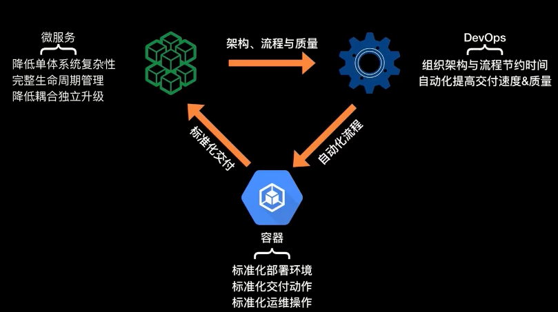
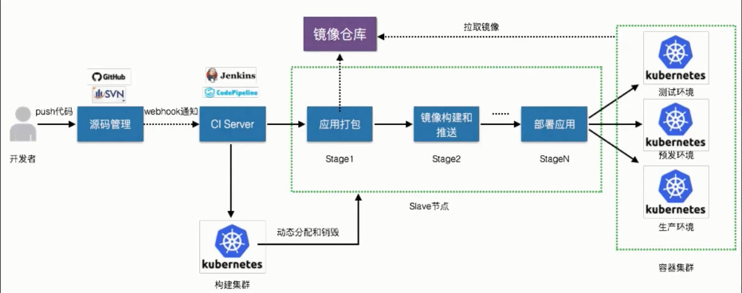
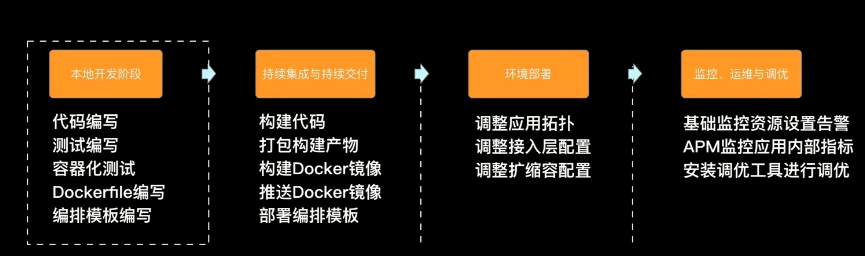
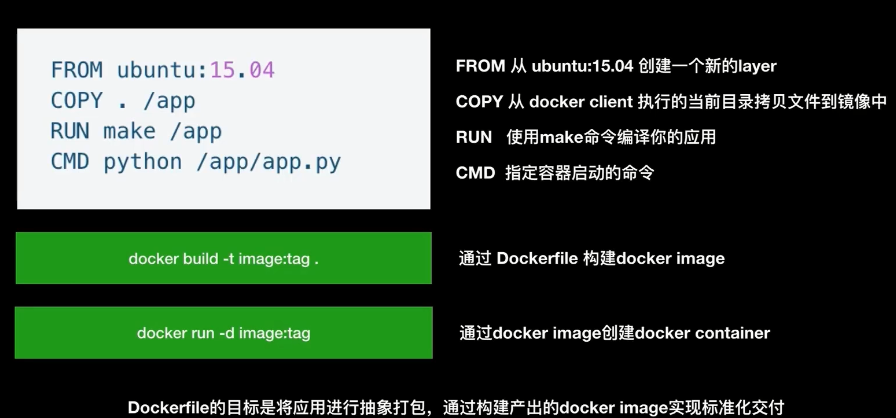
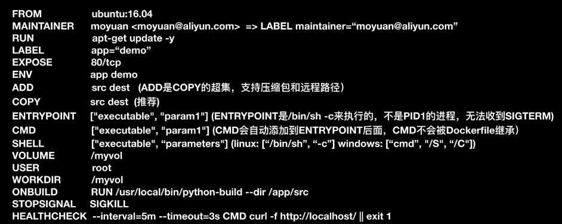
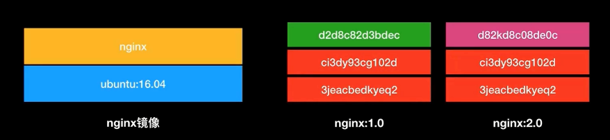
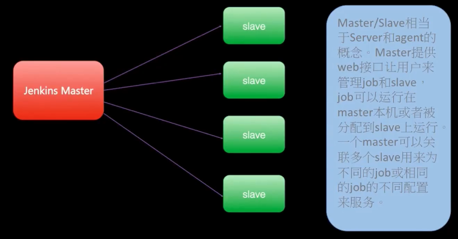

### 一、DevOps的概念

> 概念模型

> 典型的容器交付流程

> 容器交付流程的划分

### 二、如何快速高质量的应用容器化迁移

#### 1.初识Dockerfile

> 鸟瞰Dockerfile语法

> 从Dockerfile到Docker Image

Dockerfile中的每一条指令都是一个layer，而Docker Image就是一个由多个Layer组成的文件，相较于普通的ISO系统镜像来说，分层存储会带来两个优点，一个是分层存储的镜像比较容易扩展，另外可以优化镜像存储空间。

### 三、从零搭建CI/CD系统标准化交付流程

> 什么是CICD

* 持续集成（Continuous Integration, CI）:

  它是一种软件项目管理方法，==依据资产库（源码，类库等）的变更自动完成编译、测试、部署和反馈==。要求：自动构建，自动检测变更，反馈机制，纯净的构建环境等。

* 持续交付（Continuous Delivery, CD）:

  频繁的将软件新版本，交付给质量团队或用户，以供评审尽早发现生产环境中存在的问题。

* 持续部署（Continuous Deployment, CD）:

  使代码尽快向可运行的开发/测试节交付，以便尽早测试；是持续交付的下一步，指的是代码通过评审以后，自动部署到生产环境。

> Jenkins CI介绍

**Jenkins特征：**

* 在开源界多年，认知广泛，1000+插件体系
* 能够集成端到端的持续交付工具链
* java开发工具调查占比60%
* 中国开发者白皮书调查占比70%以上，CI市场占比70%以上
* 2017技术趋势预测中最受欢迎持续继承工具第一
* 社区活跃度高

**Jenkins体系架构**

