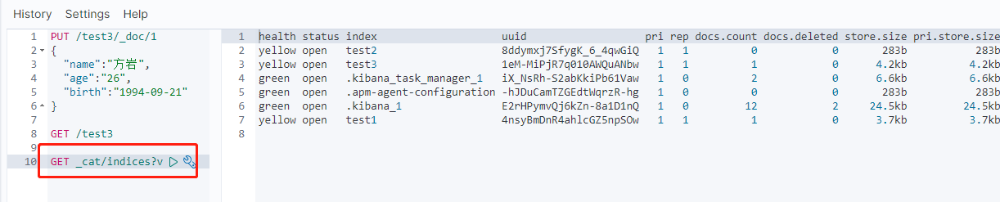

### 一、ElasticSearch概述

ElasticSearch,简称es,es是一个开源的==高扩展==的==分布式全文检索引擎==，它可以近乎==实时的存储、检索数据==；本身扩展性很好，可以扩展到上百台服务器，处理PB级别(大数据时代)的数据。es也是使用java开发并使用Lucene作为其核心来实现所有索引和搜索的功能，但是他的目的是通过简单的==RESTful API==来隐藏Lucene的复杂性，从而让全文搜索变得简单。

### 二、ElasticSearch和solr的差别


ElasticSearch vs Solr 总结

1. es基本是开箱即用(解压即可以用)，非常简单。solr安装稍微复杂一点；
2. solr利用zookeeper进行分布式管理，而ElasticSearch自身带有分布式协调管理功能；
3. solr支持更多的数据，比如JSON、XML、CSV，而ElasticSearch仅支持json文件格式；
4. solr官方提供的功能更多，而ElasticSearch本身更注重于核心功能，高级功能多有第三方插件提供，例如图形化界面需要kibana友好支撑；
5. solr查询快，但更新索引时慢(即插入删除慢)，用于电商等查询多的应用；
   - es建立索引快(即查询慢)，即==实时性查询==快，用于Facebook、新浪的搜索；
   - solr是传统搜索应用的有力解决方案，但ElasticSearch更适用于新兴的实时搜索应用。
6. solr比较成熟，有一个更大，更成熟的用户、开发和贡献者社区，而ElasticSearch相对开发维护者较少，更新太快。学习使用成本较高。

### 三、ElasticSearch的安装

#### 3.1ElasticSearch安装

> windows下安装

1. 解压就可以使用了


2. 熟悉目录

```
bin		启动文件
config	配置文件
	log4j2	日志配置文件
	jvm.options	java虚拟机相关配置
	elasticsearch.yml	elasticsearch的配置文件  默认端口：9200
lib		 相关jar包
modules	 功能模块
plugins	 插件  如ik分词器
```

3. 启动：访问9200


4. 访问测试


#### 3.2es head安装

> 安装可视化界面es head插件

前提是要有node.js环境

1. 下载地址：https://github.com/mobz/elasticsearch-head

2. 启动

```bash
npm install
npm run start
```

3. 连接测试发现，存在跨域问题：配置es

```yaml
http.cors.enabled: true
http.cors.allow-origin: "*"
```

4. 重启es服务，再次连接


初学时可以把es当做一个数据库！(可以建立索引（库），文档（库中的数据）)

这个head我们就把他当做数据展示工具！我们后面所有的查询，使用kibana去做

#### 3.3安装Kibana

> 了解ELK

ELK是ElasticSearch、Logstash、Kibana三大开源框架首字母大写简称。市面上也被称为Elastic Stack。其中ElasticSearch是一个基于Lucene、分布式、通过Restful方式进行交互的近实时搜索平台框架。像类似百度、谷歌这种大数据全文搜索引擎的场景都可以使用ElasticSearch作为底层支持框架，可见ElasticSearch提供的搜索能力确实强大，市面上很多时候，我们简称es。Logstash是ELK中央数据流引擎，用于从不同目标(文件、数据存储、MQ)收集的不同格式数据，经过过滤后支持输出到不同目的地(文件、MQ、redis、elasticsearch、kafka等)。Kibana可以将elasticsearch的数据通过友好的页面展示出来，提供实时分析的功能。

市面上很多开发只要提到ELK能够一致说出它是一个日志分析架构技术栈总称，但实际上ELK不仅仅适用于日志分析，他还可以支持其他任何数据分析和收集场景，日志分析和收集只是更具有代表性。并非唯一性。


> 安装Kibana

Kibana是一个针对ElasticSearch的开源分析及可视化平台，用来搜索、查看交互存储在ElasticSearch索引中的数据。使用Kibana,可以通过图表进行高级数据分析及展示。Kibana让海量数据更容易理解。它操作简单，基于浏览器的用户界面可以快速创建仪表板(dashboard)实时显示ElasticSearch查询动态。设置Kibana非常简单。无需编码或者额外的基础架构，几分钟内就可以完成Kibana的安装并启动ElasticSearch索引监测。

官网：https://www.elastic.co/cn/kibana

Kibana的版本要和es的版本保持一致。

ELK基本上都是开箱即用的，下载完成后解压即可使用；


1. 解压后的目录


2. 在bin中找到启动文件，启动


3. 访问测试


4. 汉化！修改Kibana的配置即可  zh-CN

### 四、ES核心概念

1. 索引
2. 字段类型（mapping）
3. 文档（documents）

> 概述

在前面的学习中，我们已经掌握了es是什么，同时也把es的服务已经安装启动，那么es是如何存储数据的，数据结构是什么，又是如何实现搜索的呢？我们先来看看ElasticSearch的相关概念吧！

==集群、节点、索引、类型、文档、分片、映射是什么？==

> ElasticSearch是面向文档的  关系型数据库 和 elasticsearch客观对比

| Relation DB      | ElasticSearch |
| ---------------- | ------------- |
| 数据库(database) | 索引（index） |
| 表（tables）     | types         |
| 行（rows）       | documents     |
| 字段（columns）  | fields        |

elasticsearch(集群)中可以包含多个索引（数据库），每个索引中可以包含多个类型（表）， 每个类型下又包含多个文档（行）， 每个文档中又包含多个列（字段）

**物理设计：**

elasticsearch在后台把每个**索引划分为多个分片**，每份分片可以在集群中不同服务器间迁移

**逻辑设计：**

一个索引类型中，包含多个文档，比如文档1、文档2。当我们索引一篇文档时，可以通过这样一个顺序找到它： 索引->类型->文档ID，通过这个组合我们就能索引到某个具体的文档。注意：ID不必须是整数，实际上他是一个字符串。

> 文档

就是我们的一条条数据！

之前说elasticsearch是面向文档的，那么就意味着索引和搜索数据的最小单位是文档，elasticsearch中，文档有几个重要属性：

- 自我包含：一篇文档同时包含字段和对应的值，也就是同时包含key:value
- 可以是层次型的：一个文档包含自文档，复杂逻辑实体就是这么来的
- 灵活的结构：文档不依赖预先定义的模式。 不同于关系型数据库要提前定义字段才能使用。在elasticsearch中，对于字段是非常灵活的，有时候我们可以忽略该字段，或者动态添加一个新字段

尽管我们可以随意新增或忽略字段，但是每个字段的类型非常重要，比如一个年龄字段类型，可以是字符串，也可以是整型。因为elasticsearch会保存字段和类型之间的映射及其他设置。这种映射具体到每个映射的每种类型，这也是为什么在elasticsearch中，类型有时候也称为映射类型。

> 类型

类型时文档的逻辑容器，就像关系型数据库一样， 表格是行的容器。类型中对于字段的定义称为映射，比如name映射为字符串类型。我们说文档时无模式的，他们不需要拥有映射中所定义的所有字段，比如新增一个字段，那么elasticsearch是怎么做的呢？ elasticsearch会自动将新字段加入到映射，但是这个字段不确定它是什么类型，elasticsearch就开始猜，如果这个值是18，那么elasticsearch会认为它是整型。但是elasticsearch也可能猜不对，所以最安全的方式就是提前定义好所需要的映射，这跟关系型数据库殊途同归，先定义好字段，然后在使用。

> 索引

就是数据库！

索引时映射类型的容器，elasticsearch中的索引是一个非常大的文档集合。索引映射了映射类型的字段和其他设置。然后他们被存储到各个分片上了。我们来看下分片是如何工作的。


**物理设计：节点和分片 如何工作**

一个集群至少有一个节点，而一个节点就是一个elasticsearch进程，节点可以有多个默认的索引。如果你想创建索引，那么索引将会有5个分片(primary shard, 又称主分片)构成的，每一个主分片会有一个副本（replica	shard,又称复制分片）


上图是一个有3个节点的集群，可以看到主分片和对应的复制分片都不会在同一节点内，这样有利于某个节点挂掉了，数据也不至于丢失。实际上，一个分片是一个Lucene索引，一个包含==倒排索引==的文件目录，倒排索引的结构使得elasticsearch在不扫描全部文档的情况下，就能告诉你哪些文档包含特定的关键字。

> 倒排索引


两个文档都匹配，但是第一个文档比第二个文档匹配程度更高。如果没有别的条件，现在，这两个包含关键字的文档都将返回。


### 五、IK分词器插件

#### 5.1介绍和安装

> 什么是IK分词器？

分词：即把一段中文或者别的划分成一个个关键字，我们再搜索的时候会把自己的信息进行分词，会把数据库中或者索引库中的数据进行分词，然后进行一个匹配操作，默认的中文分词是将每个字看成一个词，比如“我爱方岩”，会被分为“我“”爱“”方““岩”，这显然是不符合要求的，所以我们需要安装中文分词器ik来解决这个问题。

如果需要使用中文，建议使用ik分词器！

ik提供了两个分词算法：ik_smart和ik_max_word,其中ik_smart为最少切分，ik_max_word为最细粒度划分。

> 安装

1. https://github.com/medcl/elasticsearch-analysis-ik

2. 下载完成后放入我们的elasticsearch中的plugins/ik下即可 。 注意下载的版本和elasticsearch的版本要保持一致！


3. 重启观察elasticsearch，  可以看到分词器ik被加载了


4. elasticsearc-plugin  可以通过这个命令查看加载进来的插件


5. 使用Kibana测试

> 查看不同的分词效果

其中ik_smart为最少切分


ik_max_word为最细粒度切分


#### 5.2自定义字典

1. 在ik分词器插件的目录下的config中增加自定义字典文件，如:mywords.dic,并在配置文件中配置


2. 重启es,使用Kibana测试   可以看到加入到自定义字典中的"方岩"也会被拆分成一个词


### 六、REST风格操作

> REST风格操作es说明


> 基础测试

#### 6.1新增操作

1. 创建一个索引：

```
PUT /索引名/类型名/文档id
{请求体}
```


2. 可以手动指定数据类型
   - 字符串类型  *text*、 *keyword*
   - 数值类型  *long, integer, short, byte, double, float, half float, scaled float*
   - 日期类型  *date*
   - 布尔类型  *boolean*
   - 二进制类型  *binary*
3. 创建索引时指定字段的类型（相当于建表）


4. 通过GET请求获取具体的信息


5. 查看默认的信息


如果自己的文档字段没有指定，那么es就会给我们默认配置字段类型！

> 扩展：通过命令get  _cat/ 可以获取es的当前很多信息！




#### 6.2修改操作

第一种： 


第二种（推荐）


#### 6.3删除操作

> 删除索引  通过DELETE命令实现删除，根据请求来判断是删除索引还是索引文档记录！


#### 6.4关于文档的操作

##### 6.4.1基本操作

> 基本操作

1. 添加数据 PUT


2. 获取数据 GET


3. 更新数据 POST   _update

```json
POST /fangyan/user/1/_update
{
  "doc": {
    "name":"方岩"
  }
}
```

4. 简单的搜索操作

```
1.根据id查询
	GET /fangyan/user/1
2.条件查询
GET /fangyan/user/_search?q=name:方
```

##### 6.4.2复杂操作

> 复杂搜索操作

1. 基本查询  query

```
GET /fangyan/user/_search
{
  "query": {
    "match": {
      "name": "方岩"
    }
  }
}
```


2. 对结果字段进行过滤 _source


3. 排序 sort

根据age字段降序排列

```json 
GET /fangyan/user/_search
{
  "query": {
    "match": {
      "name": "方岩"
    }
  },
  "sort": [
    {
      "age": {
        "order": "desc"
      }
    }
  ]
}
```

4. 分页 from  size

```json
GET /fangyan/user/_search
{
  "query": {
    "match": {
      "name": "方岩"
    }
  },
  "from": 0,
  "size": 1
}
```

5. 布尔值查询

- must  (等同于and)  ，所有条件都要符合 where name="方岩" and age=20


- should (等同于or)  ，其中一个条件符合 where name="方岩" or age=20


- must not  (等同于not)  


- filter


```
range范围符号：
gt: 大于  gte: 大于等于  lt: 小于  lte: 小于等于
```

6. 多条件查询


7. 精确查询

term查询是直接通过倒排索引指定的词条进行精确查找的；

**关于分词：**

- term，直接查找精确的
- match，会使用分词器解析！（先分析文档，然后通过分析的文档进行查询）

**两个类型：**

字符串的两个类型: text和keyword   

text会被分词器解析从而达到模糊匹配，而keyword不会被分词器解析只能精确匹配

8. 高亮查询

- 基本操作，会默认在高亮词加<em>标签


- 自定义高亮标签


### 七、集成springboot

#### 7.1环境搭建

查阅elasticsearch官方文档


1. 查找原生的依赖

```
<dependency>
    <groupId>org.elasticsearch.client</groupId>
    <artifactId>elasticsearch-rest-high-level-client</artifactId>
    <version>7.6.2</version>
</dependency>
```

2. 找对象


3. 分析这个类中的方法即可

> 配置基本项目！

==问题：一定要保证我们导入的依赖和我们的es的版本一致==


```java
@Configuration
public class config {
    @Bean
    public RestHighLevelClient restHighLevelClient() {
        RestHighLevelClient restHighLevelClient = new RestHighLevelClient(
                RestClient.builder(
                        new HttpHost("localhost", 9200, "http")
                )
        );
        return restHighLevelClient;
    }
}
```

> 源码分析


虽然导入了三个类（静态内部类）， 但核心类就这一个RestClientConfigurations

```java 
class RestClientConfigurations {

	@Configuration(proxyBeanMethods = false)
	static class RestClientBuilderConfiguration {
		// RestClientBuilder
		@Bean
		@ConditionalOnMissingBean
		RestClientBuilder elasticsearchRestClientBuilder(RestClientProperties properties,
				ObjectProvider<RestClientBuilderCustomizer> builderCustomizers) {
			HttpHost[] hosts = properties.getUris().stream().map(HttpHost::create).toArray(HttpHost[]::new);
			RestClientBuilder builder = RestClient.builder(hosts);
			PropertyMapper map = PropertyMapper.get();
			map.from(properties::getUsername).whenHasText().to((username) -> {
				CredentialsProvider credentialsProvider = new BasicCredentialsProvider();
				Credentials credentials = new UsernamePasswordCredentials(properties.getUsername(),
						properties.getPassword());
				credentialsProvider.setCredentials(AuthScope.ANY, credentials);
				builder.setHttpClientConfigCallback(
						(httpClientBuilder) -> httpClientBuilder.setDefaultCredentialsProvider(credentialsProvider));
			});
			builder.setRequestConfigCallback((requestConfigBuilder) -> {
				map.from(properties::getConnectionTimeout).whenNonNull().asInt(Duration::toMillis)
						.to(requestConfigBuilder::setConnectTimeout);
				map.from(properties::getReadTimeout).whenNonNull().asInt(Duration::toMillis)
						.to(requestConfigBuilder::setSocketTimeout);
				return requestConfigBuilder;
			});
			builderCustomizers.orderedStream().forEach((customizer) -> customizer.customize(builder));
			return builder;
		}

	}

	@Configuration(proxyBeanMethods = false)
	@ConditionalOnClass(RestHighLevelClient.class)
	static class RestHighLevelClientConfiguration {
		// RestHighLevelClient 高级客户端，也是我们项目中要用的客户端
		@Bean
		@ConditionalOnMissingBean
		RestHighLevelClient elasticsearchRestHighLevelClient(RestClientBuilder restClientBuilder) {
			return new RestHighLevelClient(restClientBuilder);
		}
		
		@Bean
		@ConditionalOnMissingBean
		RestClient elasticsearchRestClient(RestClientBuilder builder,
				ObjectProvider<RestHighLevelClient> restHighLevelClient) {
			RestHighLevelClient client = restHighLevelClient.getIfUnique();
			if (client != null) {
				return client.getLowLevelClient();
			}
			return builder.build();
		}

	}

	@Configuration(proxyBeanMethods = false)
	static class RestClientFallbackConfiguration {
		// RestClient 普通的客户端
		@Bean
		@ConditionalOnMissingBean
		RestClient elasticsearchRestClient(RestClientBuilder builder) {
			return builder.build();
		}

	}

}

```

#### 7.2API操作

##### 7.2.1关于索引的操作

```java
@SpringBootTest
class ElasticsearchApiApplicationTests {

    @Autowired
    private RestHighLevelClient restHighLevelClient;

    //测试创建索引
    @Test
    void contextLoads() throws IOException {
        // 1.创建索引请求
        CreateIndexRequest request = new CreateIndexRequest("fangyan_index");
        // 2. 客户端执行请求 IndicesClient, 请求后获取响应
        CreateIndexResponse createIndexResponse = restHighLevelClient.indices().create(request, RequestOptions.DEFAULT);
        System.out.println(createIndexResponse);
    }

    //测试获取索引  判断其是否存在
    @Test
    void getIndex() throws IOException {
        // 1.获取索引请求
        GetIndexRequest request = new GetIndexRequest("fangyan_index");
        // 2.客户端执行请求
        boolean exists = restHighLevelClient.indices().exists(request, RequestOptions.DEFAULT);
        System.out.println(exists);
    }

    // 测试删除索引
    @Test
    void deleteIndex() throws IOException {
        DeleteIndexRequest request = new DeleteIndexRequest("fangyan_index");
        AcknowledgedResponse delete = restHighLevelClient.indices().delete(request, RequestOptions.DEFAULT);
        System.out.println(delete.isAcknowledged());
    }

}
```

##### 7.2.2关于文档的操作

```java
@SpringBootTest
class ElasticsearchApiApplicationTests {

    @Autowired
    private RestHighLevelClient restHighLevelClient;

    //测试添加文档
    @Test
    void addDoc() throws IOException {
        // 1.创建请求
        IndexRequest request = new IndexRequest("fangyan_index");
        // 2.规则： put /fangyan_index/doc/1
        request.id("1");
        // 3.创建数据并放入请求
        User user = new User("方岩", 26);
        request.source(JSON.toJSONString(user), XContentType.JSON);
        // 4.向客户端发送请求
        IndexResponse index = restHighLevelClient.index(request, RequestOptions.DEFAULT);

        System.out.println(index.toString());
        System.out.println(index.status());
    }

    //获取文档， 判断是否存在  get /index/doc/1
    @Test
    void testExists() throws IOException {
        GetRequest request = new GetRequest("fangyan_index", "1");
        boolean exists = restHighLevelClient.exists(request, RequestOptions.DEFAULT);
        System.out.println(exists);
    }

    // 获取文档信息
    @Test
    void getDoc() throws IOException {
        GetRequest request = new GetRequest("fangyan_index", "1");
        GetResponse response = restHighLevelClient.get(request, RequestOptions.DEFAULT);

        System.out.println(response.getSourceAsString());
        System.out.println(response);
    }

    // 更新文档信息
    @Test
    void updateDoc() throws IOException {
        UpdateRequest request = new UpdateRequest("fangyan_index", "1");
        request.timeout("3s");
        User user = new User("方岩帅哥", 16);
        request.doc(JSON.toJSONString(user), XContentType.JSON);
        UpdateResponse update = restHighLevelClient.update(request, RequestOptions.DEFAULT);
        System.out.println(update.status());
    }

    // 删除文档
    @Test
    void delDoc() throws IOException {
        DeleteRequest request = new DeleteRequest("fangyan_index", "1");
        request.timeout("3s");
        DeleteResponse delete = restHighLevelClient.delete(request, RequestOptions.DEFAULT);
        System.out.println(delete.status());
    }

    //批量插入数据
    @Test
    void batchAdd() throws IOException {
        BulkRequest bulkRequest = new BulkRequest("fangyan_index");
        ArrayList<User> users = new ArrayList<>();
        users.add(new User("fangyan1", 11));
        users.add(new User("fangyan2", 12));
        users.add(new User("fangyan3", 13));
        users.add(new User("fangyan4", 14));
        users.add(new User("fangyan5", 15));
        users.add(new User("fangyan6", 16));
        for (int i = 0; i < users.size(); i++) {
            bulkRequest.add(
                    new IndexRequest("fangyan_index")
                    .id("" + i + 1)
                    .source(JSON.toJSONString(users.get(i)), XContentType.JSON)
            );
        }
        BulkResponse bulkResponse = restHighLevelClient.bulk(bulkRequest, RequestOptions.DEFAULT);
        System.out.println(bulkResponse.status());
    }

    // 查询
    //说明：
    // SearchRequest    搜索请求
    // SearchSourceBuilder  条件构造
    //      TermQueryBuilder    精确查询
    //      MatchQueryBuilder   模糊查询
    //      HighlightBuilder    构建高亮
    //      MatchAllQueryBuilder
    //      xxxQueryBuilder     对应我们刚才看到的所有查询命令
    @Test
    void query() throws IOException {
        SearchRequest searchRequest = new SearchRequest("fangyan_index");
        // 构建搜索条件
        SearchSourceBuilder searchSourceBuilder = new SearchSourceBuilder();
        // 查询条件，我们可以使用 QueryBuilders 工具类来实现
        TermQueryBuilder termQueryBuilder = QueryBuilders.termQuery("name.keyword", "fangyan1");
        searchSourceBuilder.query(termQueryBuilder);
        searchSourceBuilder.timeout(TimeValue.timeValueSeconds(1));

        searchRequest.source(searchSourceBuilder);

        SearchResponse search = restHighLevelClient.search(searchRequest, RequestOptions.DEFAULT);
        System.out.println(JSON.toJSONString(search.getHits()));

        //===================遍历获取返回值============================
        for (SearchHit documentFields : search.getHits().getHits()) {
            System.out.println(documentFields.getSourceAsMap());
        }
    }

}

```

### 八、实战

#### 8.1项目搭建

见第七章

#### 8.2爬虫工具类

```java 
/**
 * @program: elasticsearch_demo->HtmlParseUtil
 * @description: java爬虫工具类
 * @author: fangyan
 * @create: 2020-12-08 00:02
 **/
@Component
public class HtmlParseUtil {
//    public static void main(String[] args) throws IOException {
//        new HtmlParseUtil().parseJd("秋裤").forEach(System.out::println);
//    }

    /**
     * 根据搜索名称爬取京东商品信息
     * @param searchName 搜索名称
     */
    public List<Content> parseJd(String searchName) throws IOException {
        String url = "https://search.jd.com/Search?keyword=" + searchName;
        // 1.解析网页
        Document document = Jsoup.parse(new URL(url), 30000);
        Element divElement = document.getElementById("J_goodsList");
        Elements liElements = divElement.getElementsByTag("li");

        List<Content> contents = new ArrayList<>();
        for (Element li : liElements) {
            String img = li.getElementsByTag("img").eq(0).attr("data-lazy-img");
            String price = li.getElementsByClass("p-price").eq(0).text();
            String pName = li.getElementsByClass("p-name").eq(0).text();
            Content content = new Content(img, pName, price);
            contents.add(content);
        }
        return contents;
    }
}

```

#### 8.3从es中查询数据

```java
//从es中查询数据并进行高亮显示

public List<Map<String, Object>> search(String keyword, int pageNo, int pageSize) throws IOException {
        //1.构建搜索请求
        SearchRequest searchRequest = new SearchRequest("jd_index");
        // 2.构建搜索条件
        SearchSourceBuilder searchSourceBuilder = new SearchSourceBuilder();
        //3.查询条件
        MatchQueryBuilder matchQueryBuilder = QueryBuilders.matchQuery("title", keyword);
        searchSourceBuilder.query(matchQueryBuilder);
        //分页
        searchSourceBuilder.from(pageNo).size(pageSize);

        //高亮
        HighlightBuilder highlightBuilder = new HighlightBuilder();
        highlightBuilder.field("title");
        highlightBuilder.requireFieldMatch(false);
        highlightBuilder.preTags("<span style='color:red'>");
        highlightBuilder.postTags("</span>");
        searchSourceBuilder.highlighter(highlightBuilder);

        //执行搜索
        searchRequest.source(searchSourceBuilder);
        SearchResponse search = restHighLevelClient.search(searchRequest, RequestOptions.DEFAULT);

        //封装结果
        ArrayList<Map<String, Object>> list = new ArrayList<>();
        for (SearchHit hit : search.getHits().getHits()) {
            //获取搜索结果
            Map<String, Object> sourceAsMap = hit.getSourceAsMap();
            //获取高亮字段
            Map<String, HighlightField> highlightFields = hit.getHighlightFields();
            HighlightField title = highlightFields.get("title");

            //解析高亮字段，将查询出的字段用高亮字段替换
            if (title != null) {
                Text[] fragments = title.getFragments();
                String newTitle = "";
                for (Text fragment : fragments) {
                    newTitle += fragment;
                }
                sourceAsMap.put("title", newTitle);
            }
            list.add(sourceAsMap);
        }
        return list;
    }
```

