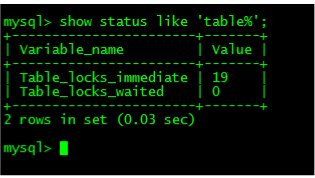

###1.MySQL在linux系统的安装

详见\javaReview\后端框架\springboot路径下MySQL的安装；

### 2.MySQL的配置文件

```java
1.二进制日志文件：log-bin //主要用作主从复制
2.错误日志文件：log-error //默认关闭，记录严重的警告和错误信息
3.查询日志log://默认关闭，记录查询的SQL语句，如果开启会减低MySQL的整体性能，以为记录日志也是需要消耗系统资源的。   
4.数据文件：
	1）linux下默认存放路径是/var/lib/mysql   //可在my.cnf中配置，也可以通过ps -ef|grep mysql 查看--datadir=/data/mysql
	2)frm文件：存放表结构
	3）myd文件（mysql data）：存放表数据
	4）myi文件(mysql index)：存放表索引
```

my.cnf中配置的一些日志文件存放路径：


数据文件夹下存放的数据文件：


### 3.MySQL逻辑架构简介

```properties
	和其他数据库相比，MySQL有点与众不同，它的架构可以在多种不同场景中应用并发挥良好作用。主要体现在存储引擎的架构上，插件式的存储引擎架构将查询处理和其他的系统任务以及数据的存储提取相分离。这种架构可以根据业务的需求和实际需要选择合适的存储引擎。
1.连接层：
	最上层是一些客户端和连接服务，包含本地的socket通信和大多数基于客户端/服务端工具实现的类似于tcp/ip的通信。主要完成一些类似于连接处理、授权认证、及相关的安全方案。在该层上引入了线程池的概念，为通过认证安全接入的客户端提供线程。同样在该层上可以实现基于ssl的安全连接。服务器也会为安全接入的每个客户端验证它所具有的操作权限。
2.服务层：
	第二层架构主要完成大多数的核心服务功能，如SQL接口，并完成缓存的查询，SQL的分析和优化及部分内置函数执行。所有跨存储引擎的功能也在这一层实现，如过程、函数等。在该层服务器会解析查询并创建相应的内部解析树，并对其完成相应的优化如确定查询表的顺序，是否利于索引等，最后生成相应的执行操作。如果是select语句，服务器还会查询内部的缓存。如果缓存空间足够大，这样在解决大量读操作的环境中能够很好的提升系统的性能。
3.引擎层：
	存储引擎层，存储引擎真正的负责了MySQL中数据的存储和提取，服务器通过api与存储引擎进行通信。不同的存储引擎具有的功能不同，这样我们可以根据自己的实际需要选取。后面详细介绍MyISAM和InnoDB.
4.存储层：
	数据存储层，主要是将数据存储在运行于裸设备的文件系统之上，并完成与存储引擎的交互。
```


### 4.MySQL存储引擎简介

```properties
MySQL安装目录下，mysql/bin  执行mysql -uroot -p 连接MySQL
```

1.查看MySQL现在提供了什么存储引擎

$ show engines;


2.查看MySQL当前默认的存储引擎

$ show variables like '%storage_engine%';


3.mysql最常用的存储引擎是MyISAM和INNODB，下图给出两种存储引擎的对比


### 5.MySQL性能下降原因

```properties
1.查询语句写的烂
2.索引失效
3.关联查询太多join（设计缺陷或不得已的要求）
4服务器调优及各参数设置（缓冲、线程数等）
```

#### 5.1MySQL执行顺序

1.手写顺序：

select->from->join->on->where->group by->having->order by->limit

2.机读顺序：

from->on->join->where->group by->having->select->order by->limit


#### 5.2七种join理论


```sql
-- 注意：对于上图第6和7，在MySQL中是不支持FULL关键字的，可以在Oracle中使用，因此在MySQL中对于6和7的写法如下：
-- 6.全连接取全部
select * from a left join b on a.key=b.key
union 
select * from a right join b on a.key=b.key
-- 7.全连接取非交集部分
select * from a left join b on a.key=b.key where b.key is null
union
select * from a right join b on a.key=b.key where a.key is null
```

### 6.MySQL索引

#### 6.1索引简介

```java
1.定义：索引（Index）世邦之MySQL高效获取数据的数据结构；
	索引的本质是一种数据结构；
	可以简单的理解为“排好序的快速查找数据结构”；
2.总结：数据本身之外，数据库还维护着一个满足特定查找算法的数据结构，这些数据结构以某种方式指向数据，这样就可以在这些数据结构的基础上实现高级查找算法，这种数据结构就是索引。
3.我们平时说的索引，如果没有特别指明，都是B树结构组织索引。
```

#### 6.2索引的优劣势

```java
优势：
	1）提高数据检索效率，降低数据库的IO成本。
	2）通过索引列对数据进行排序，降低数据排序成本，降低了CPU的消耗。
劣势：
	1）索引实际上是一张表，该表保存了主键与索引字段，并执行实体表的记录，所以索引也是占用空间的。
	2）虽然索引提高了查询效率，但是同时降低了增删改的效率，更新表时，MySQL不仅要保存数据，还要保存一下索引文件每次更新添加了索引列的字段。
```

#### 6.3索引分类

```java
1.单值索引：一个索引只包含单个列，一个表可以有多个单列索引。
2.唯一索引：索引列的值必须唯一，但是允许有空值。
3.复合索引：即一个索引包含多个列。
```

#### 6.4基本语法

```sql
--创建索引
CREATE [UNIQUE] INDEX indexName ON mytable(columnname(length));
ALTER mytable ADD [UNIQUE] INDEX [indexname] ON(columnname(length));
--删除索引
DROP INDEX [indexName] ON mytable;
--查看索引
SHOW INDEX FROM tableName;
```

#### 6.5mysql索引结构

```java
1）btree索引	2）Hash索引	3）full-text全文索引		4）R-Tree索引
//说明：Btree树的高度即是要查找的次数，一般三层的btree数可以存储百万级的数据，也就是只需要发生3次IO；如果没有索引。将进行全表扫描，发生百万次IO。
```

#### 6.6索引的适用和不适用场景

```java
//需要建索引的场景：
1）主键自动创建唯一索引；
2）频繁作为查询条件的字段应该创建索引；
3）查询中与其他表关联的字段，外键关系建立索引；
4）单键/组合索引的选择：在高并发下倾向建立组合索引；
5）查询中排序的字段，排序字段若通过索引去访问将大大提高排序效率；
6）查询中统计或者分组字段；

//不需要创建索引的场景：
1）表记录太少；
2）经常增删改的字段；
3）如果某个字段包含许多重复的内容，建立索引没有太大的实际效果。
```

### 7.MySQL性能分析之explain

#### 7.1是什么？（执行计划）

```properties
使用explain关键字可以模拟优化器执行SQL查询语句，从而知道MySQL是如何处理你的SQL语句的。分析你的查询语句或是表结构的性能瓶颈。
```

#### 7.2能干嘛？

```java
1.表的读取顺序； id
2.数据读取操作的操作类型；
3.哪些索引可以使用；
4.表之间的引用；
5.每张表有多少行被优化器查询；
```

#### 7.3怎么玩？

```
1.语法：explain+SQL语句；
2.执行计划包含的信息：id、select_type、table、type、possible_keys、key、key_len、ref、rows、Extra

如下对执行计划表头字段的解释：
```

##### 7.3.1id详解

1.概念：select查询的序列号，包含一组数字，表示查询中执行select子句或操作表的顺序。

2.三种情况：

​	1）id相同，执行顺序由上至下；

​	2）id不同，如果是子查询，id的序号会递增，id值越大优先级越高，越先被执行。

​	3）id相同不同同时存在，id值大的优先被执行，id相同的执行顺序由上至下。


##### 7.3.2select_type详解（查询类型）

1. 有哪些值？

   

2. 说明：

```java
//查询的类型，主要用于区别普通查询、联合查询、子查询等复杂查询。
1.simple：简单的select查询，查询中不包含子查询或者union；
2.primary：查询中若包含任何复杂的子部分，最外层查询则被标记为primary；
3.subquery:在select或where列表中包含了子查询；
4.derived:在from列表中包含的子查询被标记为derived(衍生)，MySQL会递归执行这些子查询，把结果放在临时表里；
5.union:若第二个select出现在union之后，则被标记为union；若union包含在from子句的子查询中，外层select将被标记为：derived；
6.union result：从union表获取结果的select；
```

1）

2、3）

4）

5、6）


##### 7.3.3table详解

显示这一行数据时关于哪张表的；

##### 7.3.4type详解（访问类型）

1. 有哪些值？


2. 说明：

```java 
//显示查询使用了何种类型？最好到最差依次是system>const>eq_ref>ref>range>index>all
1.system：表只有一行记录（等于系统表），这是const类型的特例，平时不会出现，可以忽略不计；
2.const:表示通过索引一次就找到了，const用于比较primary key或者unique索引。因为只匹配一行数据，所以很快。
		如：将主键置于where列表中，MySQL就能将该查询转换为一个常量。
3.eq_ref:唯一索引扫描，对于每个索引键，表中只有一条记录与之匹配。常见于主键或唯一索引扫描。
4.ref:非唯一性索引扫描，返回匹配某个单独值的所有行。  本质上也是一种索引访问，他返回所有匹配某个单独值的所有行，然而可能会找到多个符合条件的行，所以他应该属于查找和扫描的混合体。
5.range：只检索给定范围的行，使用一个索引来选择行。key列显示使用了哪个索引。  一般就是你在where语句出现between、<、>、in等的查询。   这种范围扫描索引比全表扫描要好，因为他只需要开始于索引的某一点，而结束于另一点，不用扫描全部索引。
6.index：Full Index Scan,index与all区别为index类型只遍历索引树。这通常比all快，因为索引文件通常比数据文件小。  （也就是说虽然all和index都是读全表，但是index是从索引中读取的，而all是从硬盘中读取的。）
7.all：Full Table Scan,将遍历全表找到匹配的行。

备注：一般来说得保证查询至少达到range级别，最好能达到ref。
```

2）


3）

4）

5）

6）

7）


##### 7.3.5possible_key和key详解

```java
//1.possible_key
显示可能应用在这张表中的索引，一个或多个。
查询涉及到的字段上若存在索引，则该索引将被列出，但不一定被查询实际使用。
//2.key
实际使用的索引。如果为NULL则没有使用索引。
查询中若使用了覆盖索引，则该索引和查询的select字段重叠。
```


##### 7.3.6key_len详解

```java
表示索引中使用的字节数，可通过该列计算查询出使用的索引长度。在不损失精度的情况下，长度越短越好。
key_len显示的值为索引字段最大可能长度，并非实际使用长度，即key_len是根据表定义计算而得，不是通过表内检索出的。
```


##### 7.3.7ref详解

```java
说明：显示索引的哪一列被使用。
	如果可能的话，是一个常数。哪些列或常量被用于查找索引列上的值
```


##### 7.3.8rows详解

```java
根据表统计信息及索引选用情况，大致估算出找到所需记录所需读取的行数。
```


##### 7.3.9Extra详解

```java
包含不适合在其他列显示但是十分重要的额外信息。
1.Using filesort:(重要)说明MySQL会对数据使用一个外部的索引排序，而不是按照表内的索引顺序进行读取。
				MySQL中无法利用索引完成的排序操作称为“文件排序”。
2.Using temporary:(重要)使用了临时表保存中间结果，MySQL在对查询结果排序时使用临时表。常见排序和分组查询。
3.using index：（重要，且性能最好）表示相应的select操作中使用了覆盖索引，避免访问了表的数据行，效率不错！
				如果同时出现using where，表明索引被用来执行索引键值的查找。
				如果没有同时出现using where，表明索引用来读取数据而非执行查找动作。
		//覆盖索引：select数据列只从索引中就能获取到，不必读取数据行，MySQL可以利用索引返回select列表的字段，而不必根据索引再次读取数据文件。换句话说查询列要被所建的索引覆盖。
******************以下几个值不常用，仅作为了解***************************************
4.using where：表名使用了where过滤；
5.using join buffer：使用了连接缓存；
6.impossible where：where子句的值总是false，不能用来获取任何元组；
7.select tables optimized away:在没有group by子句的情况下，基于索引优化MIN/MAX操作或者对于MyISAM存储引擎优化COUNT(*)操作，不必等到执行阶段在进行计算，查询执行计划生成的阶段即完成优化。
8.distinct:优化distinct操作，在找到第一匹配的元组后即停止找同样值的动作。
```

1）

2）

##### 7.3.10热身case


执行顺序详解


### 8.索引优化

#### 8.1索引分析

##### 8.1.1单表

1. 建表SQL


2.分析

```sql
-- 查询category_id为1且comments大于1的情况下，view最多的article_id;
explain  select id,author_id from article where categoray_id=1 and comments>1 order by view desc limit 1;
-- 结论：很显然type是all，即最坏的情况。Extra里还出现了Using filesort,也是最坏的情况。优化是必须的。

--开始优化
--1.1新建索引+删除索引
create index idx_article_ccv on article('categoray_id','comments','view');
--执行执行计划看到type变为了range，Extra里面还是由Using filesort
--总结：我们已经建立的索引，为啥没用呢？
--这是因为按照BTree索引的工作原理
--先排序category_id，如果遇到相同的category_id则再排序comments，如果遇到相同的comments则再排序view.
--当comments字段在联合索引里处于中间位置时，因comments>1条件是一个范围值（所谓range）
--MySQL无法利用索引再对后面的views部分进行检索，即range类型查询字段后面的索引无效。
drop index idx_article_ccv on article;

--1.2第二次新建索引
create index idx_article_cv on article(category_id,views);
--结论：可以看到type变为了ref,Extra中的Using filesort也消失了，结果非常理想。
```

##### 8.1.2两表

```sql
1.建表：
现有class表id,card字段；book表id,card字段；两表通过card字段关联；
2.索引分析：
-- explain分析
explain select * from class left join book on class.card=book.card;
--结论：type有all
 
--添加索引优化
alter table book add index Y ('card');
--第二次explain
explain select * from class left join book on class.card=book.card;
-- 可以看出第二行的type变为了ref,rows也优化比较明显；
-- 这是由左连接特性决定的。left join条件用于确定如何从右表搜索行，左边一定都有，
-- 所以右边是我们的关键点，一定需要建立索引。

--同样的如果是右连接，则左表加索引。
```

##### 8.1.3三表

```sql
1.建表
class表id,card字段；book表id,card字段；phone表id,card字段；
关联关系：class.card=book.card，phone.card=book.card
2.索引分析：
--explain分析
explain select * from class left join book on class.card=book.card left join phone on book.card=phohne.card;
--通过下图可知，三个表都进行了全表扫描
--添加索引优化,按照左连接建右表索引原则，在book.card和phone.card建立索引
alter table phone add index z('card');
alter table book add index Y('card');
--explain分析--后两行的type都是ref且总rows优化效果良好，效果不错。因此索引最好设置在需要经常查询的字段中。

【结论】
join语句的优化：
尽可能减少join语句中的NestedLoop的循环总次数；“永远用小结果集驱动大结果集”。
优先优化NestedLoop的内层循环；保证join语句中被驱动表上join条件字段已经被索引。
当无法保证被驱动表的join条件字段被索引且内存资源充足的前提下，不要太吝啬JoinBuffer的设置。	
```

优化前


优化后


#### 8.2索引失效（应该避免）

1.建表

现有表staffs,字段id,name,age,pos，add_time

2.建立复合索引

alter table staffs add index idx_staffs_nameAgePos(name,age,pos);

##### 8.2.1全值匹配我最爱

当建立了复合索引时，复合索引全部用到，效率最好；


##### 8.2.2最佳左前缀法则

```java 
解释：如果索引了多列，要遵循最佳左前缀法则。指的是查询从索引的最左前列开始并且不跳过索引的中间列。

例：
1.explain select * from staffs where age=20; //索引失效，进行全表扫描
2.explain select * from staffs where name='tom'; //利用了最左索引列，索引不失效
3.explain select * from staffs where name='tom' and age=20; //没有跳过索引中间列，name和age都用到了索引
4.explain select * from staffs where name='tom' and pos='java工程师'; //跳过中间索引列，只用到了name列索引，pos列索引失效；   注意：实际上2和4的key都是用到了复合索引，但是、key_len是一样的，因此可以判断只用到了name列的索引，而pos列的索引失效：如下图：
```


##### 8.2.3不在索引列上做任何操作

```java
解释：如果在索引列上操作如 计算、函数、（自动or手动）类型转换，会导致索引失效而转向全表扫描；
```


##### 8.2.4范围之后全失效

```java
存储引擎不能使用索引中范围条件右边的列；
```


##### 8.2.5尽量使用覆盖索引

```
只访问索引的查询（索引列和查询列一致），减少select *
```


##### 8.2.6使用不等于!=  <>会导致索引失效


##### 8.2.7is null和is not null也会导致索引失效


##### 8.2.8like以通配符%开头索引会失效

```sql
如下图：如果where条件后使用like并且%在前时索引会失效！
-- 解决like '%字符串%'时索引失效问题？
-- 答：使用覆盖索引
alter table staffs add index idx_staffs_nameAgePos('name','age','pos');
select name,age,pos from staffs where name like '%July%';
--如下第二张图，索引不会失效；   由于id是主键也是索引，因此在查询列出现也没有影响。
```


##### 8.2.9字符串查询不加单引号索引会失效

```sql
对于字符串查询不加单引号，在SQL底层会对查询字符串有个隐式转换的过程，违反了8.2.3不在索引列做任何操作的原则，则索引会失效。
```

##### 8.2.10少用or，用它连接索引会失效

##### 8.2.11小总结


*注意：like后%在前的索引失效，如果%在后或中间（即以常量开头），虽然也是范围查询，但是不会导致后面的索引列失效*

##### 8.2.12面试题分析

```sql
1.建表：
	现有表test03,字段c1,c2,c3,c4,c5;
	联合索引 alter table test03 add index idx_c1234(c1,c2,c3,c4);
2.分析以下SQL使用索引情况？
	1）explain select * from test03 where c1='a1' and c2='a2' and c3='a3' and c4='a4';
		--索引全部使用
	2）explain select * from test03 where c1='a1' and c2='a2' and c4='a4' and c3='a3';
		--索引全部使用，MySQL底层优化时会根据索引顺序查询where条件；
	3）explain select * from test03 where c1='a1' and c2='a2' and c3>'a3' and c4='a4';
		--c4索引失效（范围之后全失效）
	4）explain select * from test03 where c1='a1' and c2='a2' and c4>'a4' and c3='a3';
		--索引全部使用，首先根据索引顺序优化查询，其次c4已经是最后一个索引列
	5）explain select * from test03 where c1='a1' and c2='a2' and c4='a4' order by c3;
		--c1,c2用于查找，c3用于排序，C4没有用到索引
	6）explain select * from test03 where c1='a1' and c2='a2' order by c3;
		--同5）
	7）explain select * from test03 where c1='a1' and c2='a2' order by c4;
		--产生了filesort,c1c2索引用于查找，c4断开了不能用C4的索引进行排序了
	8）
	8.1 explain select * from test03 where c1='a1' and c5='a5' order by c2,c3;
		--c1用于查询，c2 c3用于排序
	8.2 explain select * from test03 where c1='a1' and c5='a5' order by c3,c2;
		--出现了filesort，我们键的索引是1234，排序顺序没有按照索引来
	9）
	9.1 explain select * from test03 where c1='a1' and c2='a2' order by c2,c3;
		--C1,c2用于索引，c2,c3用于排序
	8.2 explain select * from test03 where c1='a1' and c2='a2' order by c3,c2;
		--没有filesort，与8.2对比，因为本例有常量c2的情况
	10）
	10.1 explain select * from test03 where c1='a1' and c4='a4' group by c2,c3;
		--c1用于索引，c2,c3用于分组（分组之前必排序）
	10.2 explain select * from test03 where c1='a1' and c4='a4' group by c3,c2;
		--using where, using filesort, using temporary
```

##### 8.2.12索引优化一般性建议

```properties
1.对于单值索引，尽量选择针对当前query过滤性更好的索引。
2.在选择组合索引时，当前query中过滤性最好的字段在索引字段顺序中，位置越靠前越好；
3.在选择组合索引时，尽量选择能够包含当前query中where子句中更多字段的索引；
4.尽肯能通过分析统计信息和调整query的写法来达到选择合适索引的目的；
```

### 9.查询优化


#### 9.1永远小表驱动大表


```sql
* exists
select * from table where exists(subquery);
该语法可理解为：将主查询的数据，放到子查询中做条件验证，根据验证结果（true或者false）来决定主查询的数据结果是否得以保留
*提示：
1.exists(subquery)只返回true或false，因此子查询中select *也可以是select 1，官方说法是实际执行会忽略select清单，因此没有区别；
2.exists子查询的实际执行过程可能经历了优化而不是我们理解上的逐条比对，如果担忧效率问题，可进行实际检验以确定是否有效率问题；
3.exists子查询往往也可以用条件表达式、其他子查询或者join俩替代，何种最优需要具体问题分析；
```

#### 9.2order by关键字优化

##### 9.2.1order by子句尽量使用index方式排序，避免使用filesort方式排序

```java
1.MySQL支持两种方式的排序，filesort和index，index效率高，它指MySQL扫描索引本身完成排序。filesort方式效率低。
2.order by 满足两种情况会使用index方式排序：
	1）order by语句使用索引最左前列；
	2）使用where子句与order by子句条件列组合满足索引最左前列；
```

##### 9.2.2尽可能在索引列上完成排序操作，遵照索引建的最佳左前缀

##### 9.2.3如果不在索引列上，filesort有两种算法

```java
1.双路排序：
	MySQL4.1之前使用双路排序，字面意思就是两次扫描磁盘，最终得到数据。读取行指针和order by列，对他们进行排序，然后扫描已经排序好的列表，按照列表中的值重新列表中读取对应数据输出。
	从磁盘读取排序字段，在buffer进行排序，再从磁盘读取其他字段。
2.单路排序：
	从磁盘读取插叙需要的所有列，按照order by列在buffer对他们进行排序，然后扫描排序后的列表进行输出。
	它的效率更快一些，避免了第二次读取数据。并且把随机io变成了顺序io，但是他会使用更多的空间，因为它把每一行都保存在内存中了。
3.结论及引申的问题：
	由于单路排序是后出的，总体而言好过双路。
	//单路排序的问题：
		在sort_buffer中，方法B比方法A要多占用很多空间，因为方法B是把所有字段都取出所以取出的数据总大小超过了sort_buffer的容量，导致每次只能取出sort_buffer容量大小的数据，进行排序（创建tmp文件，多路合并），排完再取sort_buffer容量大小，再排。。。从而多次I/O。
	//优化策略
	增大sort_buffer_size参数设置；
	增加max_length_for_sort_data参数设置；
```

##### 9.2.4小总结


#### 9.3group by关键字优化

```java
1.group by实际是先排序后进行分组，遵照索引的最佳左前缀。
2.当无法使用索引列时，增大max_length_for_sort_data参数设置+增大sort_buffer_size参数的设置。
3.where高于having，能写在where限定的条件就不要去having限定了。
```

### 10.慢查询日志

#### 10.1怎么玩？

```sql
1.说明：MySQL慢查询日志是MySQL提供的一种日志记录，它用来记录在MySQL中响应时间超过阈值的语句，具体指运行时间超过long_query_time值的SQL，则会被记录到慢查询日志中。long_query_time默认值为10；
2.查看是否开启（默认不开启）：show variables like '%slow_query_log%';
	开启：set global slow_query_log=1;
3.查看多少秒算慢SQL(默认10)：show variables like 'long_query_time%';
	设置慢的阈值时间：set global long_query_time = 3;
	--为什么设置完阈值在执行show variables...看不出修改后的值？ 需要重新连接或执行命令show global variables like 'long_query_time';
4.执行SQL：select sleep(4);模拟慢SQL查询，则会在日志文件中记录。提取后即可对该SQL进行分析；

----==以上命令行方式设置针对当前数据库有效，且MySQL重启后即失效，如果想永久有效可以设置配置文件（不建议）
【mysqld】下配置：
slow_query_log=1;
slow_query_log_file=/var/lib/mysql/slowquery.log;
long_query_time=3;
log_output=FILE;
```

#### 10.2日志分析工具mysqldumpslow

```sql
--在生产环境中，如果手工分析日志，查找、分析SQL，显然是个体力活，MySQL提供了日志分析工具mysqldumpslow.
1.查看mysqldumpslow的帮助信息：
命令：mysqldumpslow --help
参数说明：
	s:表示按何种方式排序
	c:访问次数
	l:锁定时间
	r:返回记录
	t:查询时间
	al:平均锁定时间
	ar:平均返回记录数
	at:平均查询时间
	t:返回前面多少条的数据
	g:后边搭配一个正则匹配模式，大小写不敏感的
```

工作常用参考：


### 11.批量数据脚本（创建调用函数和存储过程）

#### 11.1建表


#### 11.2设置参数log_bin_trust_function_creators


#### 11.3创建函数保证每条数据都不同

随机产生字符串


随机产生部门编号


#### 11.4创建存储过程

创建往emp表中插入数据的存储过程


创建往dept表中插入数据的存储过程


#### 11.5调用存储过程


### 12.show profile

```java 
1.是什么？
	是mysql提供可以用来分析当前会话中语句执行的资源消耗情况。可以用于SQL的调优测量。
	默认情况下，参数处于关闭状态，并保存最近15次运行结果。
```

#### 12.1分析步骤

```SQL
1.查看是否开启(默认是关闭的)
show variables like 'profiling';
2.开启功能
set profiling=on;
3.运行SQL
	select * from emp group by id%10 limit 150000;
	select * from emp group by id%20 order by 5;
4.查看结果：
	show profiles;
5.诊断SQL：
	show profile cpu,block io for query 上一步前面的问题SQL数字号码（Query_ID）;
	--show参数备注
	ALL	--显示所有的开销信息；
	BLOCK IO	--显示块IO相关开销；
	CONTEXT SWITCHES	--上下文切换相关开销；
	CPU		--显示跟CPU相关开销信息；
	IPC		--显示发送和接收相关开销信息；
	MEMORY	--显示内存相关开销信息；
	PAGE FAULTS		--显示页面错误相关开销信息；
	SOURCE	--显示和source_function,source_file,source_line相关的开销信息；
	SWAPS	--显示交换次数相关开销信息；
6.开发日常需要注意的结论：show profile cpu,block io for query Query_ID;后status列不能出现如下4个值：
	1）converting HEAP to MyISAM	查询结果太大，内存都不够用了往磁盘上搬了。
	2）creating tmp table	创建临时表（拷贝数据到临时表，用完再删除）；
	3）copying to tmp table on disk	把内存中临时表复制到磁盘，危险！！！
	4）locked
```


### 13.全局查询日志（了解）

1.启动的两种方式

1）.配置启用


2）.编码启动


**注意：永远不要在生产环境开启这个功能**

### 14.mysql锁机制

#### 14.1概述

```java
1.定义：
	锁是计算机协调多个进程或线程并发访问某一资源的机制；
	在数据库中，除传统的计算资源（如CPU、RAM、I/O等）的争用外，数据也是一种供许多用户共享的资源。如何保证数据并发访问的一致性、有效性是所有数据库必须解决的一个问题。锁冲突也是影响数据库并发访问性能的一个重要因素。从这个角度来说，锁对数据库而言显得尤其重要，也更加复杂。
2.锁的分类
	1）对数据库的操作类型（读/写）分：
		读锁（共享锁）：针对同一份数据，多个读操作可以同时进行而不会互相影响。
		写锁（排它锁）：当前写操作没有完成前，它会阻断其他写锁和读锁。
	2）对数据的操作粒度分：
		表锁
		行锁
		
```

#### 14.2表锁（偏读）

```SQL
1.特点：偏向MyISAM存储引擎，开销小，加锁快；无死锁；锁定粒度大，发生锁冲突的概率最高，并发度最低。
2.加读锁：
	--手动增加表锁
	lock table 表名 read(write),表名2 read(write),其他；
	--查看表上加过的锁
	show open tables;
3.释放表锁：
	unlock tables;
```


##### 14.2.1读锁案例分析

```SQL
现已有mylock表，字段id和name;
```

| session_1                                     | session_2                                       |
| --------------------------------------------- | ----------------------------------------------- |
| 获得表mylock的READ锁                          | 连接终端                                        |
| 当前session可以查询该表记录                   | 其他session可以查询该表记录                     |
| 当前session不能查询其他没有锁定的表           | 其他session可以查询或者更新未锁定的表           |
| 当前session中插入或者更新锁定的表都会提示错误 | 其他session插入或者更新锁定的表会一直等待获得锁 |
| 释放锁                                        | session_2获得锁，插入操作完成                   |

总结：session1给mylock加读锁，session1只能读mylock；不能写mylock；不能读和写其他表；

​							session2可以读mylock；写mylock会阻塞；可以读和写其他表；

##### 14.2.2写锁案例分析

| session_1                                   | session_2                                               |
| ------------------------------------------- | ------------------------------------------------------- |
| 获得mylock的WRITE锁                         | 待session1开启写锁后，session2再连接终端                |
| 当前session对锁定的表增删改查操作都可以执行 | 其他session对锁定表的增删改查被阻塞，需要等待锁被释放； |
| 释放锁                                      | session2获得锁，查询返回                                |

##### 14.2.3案例结论

```java
MyISAM在执行查询（select）前，会自动给所有涉及到的表加读锁，在执行增删改操作之前，会自动给涉及的表加写锁。
//结论：
读锁会阻塞写，但不会阻塞读；而写锁则会把读和写都阻塞。
```

##### 14.2.4表锁分析

```SQL
1.看看那些表被加了锁：
 	show open tables;
 2.如何分析表锁定：
 	可以通过检查table_locks_waited和table_locks_immediate状态变量来分析系统上的表锁定。
 	show status like 'table%';
 	--两个变量的说明：
 	table_locks_waited:出现表级锁定争用而发生等待的次数，此值高则说明存在着较严重的表级锁争用情况。
 	table_locks_immediate:产生表级锁定的次数。
3.结论：MyISAM的读写锁调度是写优先，这也是myisam不适合做些为主表的引擎。因为写锁后，其他进程不能做任何操作，大量的更新会使查询很难得到锁，从而造成永远阻塞。
```



#### 14.3行锁（偏写）

```java
偏向InnoDB存储引擎，开销大，加锁慢。会出现死锁；锁定粒度最小，发生锁冲突概率最低，并发度也最高。
InnoDB与MyISAM最大的两点不同：1）支持事务；2）采用了行级锁。
```

##### 14.3.1行锁支持事务，复习事务知识

```java
1.事务（Transaction）及ACID属性：
	事务是由一组SQL语句组成的逻辑处理单元，事务具体有以下4个属性，通常简称事务的ACID属性。
	1）原子性（Atomicity）:事务是一个原子操作，其对数据的修改，要么全部执行，要么全部不执行。
	2）一致性（Consistent）:在事务开始和完成时，数据都必须保持一致状态。
	3）隔离性（Isolation）:事务处理过程的中间状态对外部是不可见的，反之亦然。
	4）持久性（Durable）:事务完成后，他对于数据的修改是永久的，即使出现系统故障也能够保持。
2.并发事物处理带来的问题：
	1)更新丢失（lost update）：当两个或多个事务选择同一行，然后基于最初选定的值更新该行时，由于每个事务都不知道其他事务的存在，就会发生更新丢失问题。
	2）脏读（dirty read）：事务A读取到事务B已修改但尚未提交的数据。
    3）不可重复读（non-repeatable reads）:一个事务在读取某些数据后某个时间，再次读取以前读过的数据，却发现其读出的数据已经发生改变、或某些记录已经被删除了。这种现象叫做“不可重复读”。
    4）幻读（phantom reads）：一个事务按照相同的查询条件重新读取以前检索过的数据，却发现其他事务插入了满足其查询条件的新数据，这种现象称为“幻读”。
    幻读和不可重读的区别：脏读是事务B里修改了数据，幻读是事务B里新增了数据。
3.事务的隔离级别：如下图
```


##### 14.3.2行锁定基本演示


一号会话更新a=1，二号会话更新a=9，即使一号会话没有提交，二号会话也能更新成功，因为只锁定一行。

##### 14.3.3无索引，行锁变表锁

如果where后没有使用索引或者索引失效，则会锁住整张表。

##### 14.3.4间隙锁的危害

如下，表中本没有a=2的记录


```java
1.什么是间隙锁？
	我们使用范围条件而不是相等条件检索数据，并请求共享或排它锁时，InnoDB会给符合条件的已有数据记录的索引项加锁；对于键值在条件范围内但不存在的记录，叫做“间隙”。
	InnoDB也会对这个间隙加锁，这种锁机制就是所谓的间隙锁。
2.危害？
	当锁定一个范围键值之后，即使某些不存在的键值也会被无辜锁定，而造成在锁定的时候无法插入锁定键值范围内的任何数据。在某些场景下这可能会对性能造成很大的危害。
```

##### 14.3.5面试题：如何锁定一行？


##### 14.3.6行锁总结

```java
1.InnoDB存储引擎由于实现了行级锁定，虽然在锁机制的方面所带来的性能损耗可能比表级锁会更高一些，但是在整体并发处理能力方面要远远优于MyISAM的表级锁。当系统并发量较高时，InnoDB的整体性能和MyISAM相比就会有比较明显的优势了。
	但是InnoDB的行级锁同样有其脆弱的一面，当我们使用不当时，可能会让InnoDB的整体性能表现不仅不能比MyISAM高，甚至可能更差。
```

##### 14.3.7行锁分析


##### 14.3.8优化建议

```java
1.尽肯能让所有数据检索都通过索引来完成，避免无索引行锁升级为表锁；
2.合理设计索引，尽量缩小锁的范围；
3.尽可能较少检索条件，避免间隙锁；
4.尽量控制事务大小，减少锁定资源量和时间长度；
5.尽肯能低级别事务隔离；
```


##### 14.3.9页锁

```
开销和加锁时间介于表锁和行锁之间，会出现死锁；锁定粒度介于表锁和行锁之间。并发度一般。
```

### 15主从复制

#### 15.1复制的基本思想

```java
//一、复制的基本原理
1.slave会从master读取binlog来进行数据同步；
2.步骤：
	1）master将改变记录到二进制日志（binary log）。这些记录过程叫做二进制日志事件，binary log events。
	2）slave将master的binary log events拷贝到他的中继日志（relay log）.
    3)slave重做中继日志中事件，将改变应用到自己的数据库中。mysql的复制是异步的且串行化的。
//二、复制的基本原则
1.每个slave只有一个master；
2.每个slave只能有一个唯一的服务器ID；
3.每个master可以有多个slave；
//三、复制最大的问题：延时。
```

#### 15.2一主一从常见配置

```sql
--主机在Windows上，从机在linux上
1.mysql版本一致且后台以服务运行；
2.主从都配置在[mysqld]节点下，都是小写；
3.主机修改my.ini配置文件：
	1）【必须】主服务器唯一ID：	server-id=1
	2)【必须】启用二进制日志：	log-bin=自己本地的路径/mysqlbin
	3)【可选】启用错误日志：	log-err=自己本地的路径/mysqlerr
	4)【可选】根目录：	basedir="自己本地路径"
	5）【临时目录】：tmpdir="自己本地路径"
	6)【可选】数据目录：datadir="自己本地路径/Data"
	7)【可选】主机读写都可以：	read-only=0
	8）【可选】设置不需要复制的数据库：	binlog-ignore-db=mysql
	9)【可选】设置需要复制的数据库：	binlog-do-db=需要复制的主数据库名字
4.从机修改my.conf配置文件：
	1）【必须】从服务器唯一ID
	2）【可选】启用二进制日志
5.因修改过配置文件，请主机+从机都重启后台mysql服务；
6.主机、从机都关闭防火墙；
7.在Windows主机上建立账户并授权slave：
	1）GRANT REPLICATION SLAVE ON *.* TO 'zhangsan'@'从机数据库ip' IDENTIFIED BY '123456';
	2)flush privileges;
	3)查询master的状态：	show master status;    --注意：记录下File和Position的值。
	4）执行完此步骤后不要再操作主服务器mysql，防止服务器状态值发生变化；
8.在linux从机上配置需要复制的主机：
	0）CHANGE MASTER TO MASTER_HOST='主机ip',MASTER_USER='zhangsan',MASTER_PASSWORD='123456',
		MASTER_LOG_FILE='FILE名字',MASTER_LOG_POS=Position数字;
		--注意：MASTER_LOG_FILE和MASTER_LOG_POS对应7中的3）
	1）启动从机复制功能：	start slave;
	2)show slave status\G;
		下面两个参数都是YES，则说明主从配置成功！
		Slave_IO_Running:YES;
		Slave_SQL_Running:YES;
9.主机新建库、新建表、insert记录，从机复制；
10：如何停止从服务复制功能：	stop slave；
```

