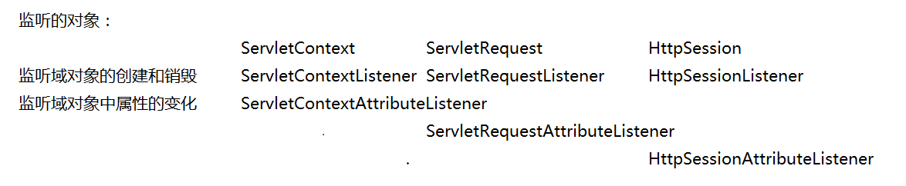

### 1.filter

```java 
1.作用：访问目标资源时进行过滤；
2.创建filter； 
	1）创建一个类实现filter接口，重写核心方法：
	doFilter(ServletRequest request, ServletResponse response, FilterChain chain)
    2）在web.xml中配置拦截路径<url-pattern>
    	<filter>
        <display-name>Filter1</display-name>
        <filter-name>Filter1</filter-name>
        <filter-class>com.fy.filter.Filter1</filter-class>
      </filter>
      <filter-mapping>
        <filter-name>Filter1</filter-name>
        <url-pattern>/ServletDemo</url-pattern>
      </filter-mapping>
    //说明：用法和servlet类似；
3.如何过滤：
	chain.doFilter(request, response);
	//执行该方法就放行，不执行就是拦截；  如果有下一个过滤器则放行到下一个过滤器，没有的话就放行到目标资源；
示例：
    String username = request.getParameter("username");
    if(username.equals("方岩")) {
        chain.doFilter(request, response);
    }
4.FilterChian（过滤器链）的顺序；
	由web.xml中的FilterMapping的顺序决定；
5.filter的过滤方式
	<filter-mapping>
    <filter-name>filter2</filter-name>
    <url-pattern>/*</url-pattern>
    <dispatcher>FORWARD</dispatcher>
  	</filter-mapping>
  	//过滤方式在<dispatcher>标签中设置  REQUEST、FORWARD、INCLUDE、ERROR
  	1)request的过滤方式（默认）：只对一次请求进行过滤，如果请求进行了转发也是一次请求所以不再对转发资源过滤；
  	2）forward过滤方式：只对请求转发的资源进行过滤；
  	3）include：在发生页面包含时进行过滤； error：在发生页面错误时进行过滤；
```

### 2.listener

#### 2.1概述

```
1.servlet四大域对象：pageContext、servletContext、session、request
2.监听器种类：总共有八种监听器，分别对servletContext、session、request域对象的生命周期（创建和销毁）、属性变化的监听；
```

3.监听域对象的创建和销毁和属性变化（6个）



4.另外两个监听器（对象感知监听器）

```java
1.HttpSessionBindingListener(对象绑定/解绑 监听)
    该监听器主要是监听对象被绑定session和从session中移除；
    //被监听的对象实现HttpSessionBindingListener接口，重写valueBound和valueUnbound方法；
    public class User implements HttpSessionBindingListener {
    public void valueBound(HttpSessionBindingEvent arg0)  { 
         System.out.println("我被绑了");
    }
    public void valueUnbound(HttpSessionBindingEvent arg0)  { 
         System.out.println("我解绑了");
    }
	
}

2.HttpSessionActivationListener(监听对象在session中钝化和活化)
```


#### 2.2监听器的创建

通过eclipse组件创建，右键new->filter->输入类名点击next->选择要创建的监听器

注意：web.xml中只生成<listener-class> ，没有<listener-mapping>

<listener>
    <listener-class>com.fy.listener.Mylistener</listener-class>
  </listener>