主要内容

```
1.Lambda表达式
2.函数式接口
3.方法引用与构造器引用
4.Stream API
5.接口中的默认方法与静态方法
6.新时间日期API
7.其他新特性
```

java8新特性简介

```
 速度更快
 代码更少（增加了新的语法 Lambda  表达式）
 强大的 Stream API
 便于并行
 最大化减少空指针异常 Optional
其中最为核心的为Lambda表达式与Stream API
```

### 1.Lambda表达式

#### 1.1Lambda表达式初体验

```java
/**
 * 定义一个函数式接口
 * @param <T>
 */
public interface MyPredicate<T> {
    boolean test(T t);
}

/**
 * @description: 测试lambda表达式
 * @author: fangyan
 * @create: 2020-05-20 00:43
 **/
public class TestDemo {
    //需求：根据集合中对象的年龄过滤

    //定义过滤方法
    public List<Student> filter(List<Student> list, MyPredicate<Student> myPredicate){
        ArrayList<Student> students = new ArrayList<>();
        for (Student student : list) {
            if (myPredicate.test(student)) { //其实就是把比较规则剥离出来到接口方法中，然后手动实现
                students.add(student);
            }
        }
        return students;
    }

    List<Student> students = Arrays.asList(
            new Student("张三", 18, 98),
            new Student("李四", 23, 23),
            new Student("王五", 15, 56),
            new Student("陈留", 32, 100)
    );

    /**
     * 使用传统内部类，在内部类实现test()方法
     */
    @Test
    public void test() {
        List<Student> list = filter(students, new MyPredicate<Student>() {
            @Override
            public boolean test(Student student) {
                return student.getAge() > 20;
            }
        });
        list.forEach(System.out::println);
    }

    /**
     * 使用lambda表达式
     */
    @Test
    public void test2() {
        List<Student> list = filter(students, e -> e.getScore() > 80);
        list.forEach(System.out::println);
    }
}

```

#### 1.2Lambda表达式语法

```java
1.概述：
Lambda表达式在java语言中引入了一个新的语法元素和操作符。这个操作符为"->",该操作符被称为Lambda操作符或箭头操作符。他将Lambda分为两个部分：
左侧：指定了Lambda表达式需要的所有参数
右侧：指定了Lambda体，即Lambda表达式要执行的功能。

2.语法：
//语法格式一：无参无返回值，Lambda体中只有一条语句
Runnable r1 = () -> System.out.println("Hello Lambda!");
//语法格式二：Lambda需要一个参数(一个参数时，参数的小括号可以省略)
Consumer<String> fun = (args) -> System.out.println(args);
//语法格式三：Lambda需要两个参数，并且有返回值
BinaryOperator<Long> bo = (x, y) -> {
    System.out.println("实现函数式接口");
    return x + y;
}
//语法格式四：当Lambda体中只有一条语句时，return和大括号可以省略
BinaryOperator<Long> bo = (x, y) -> x + y;

3.类型推断：
上述Lambda表达式中的参数类型都是由编译器推断得出的。Lambda表达式中无需指定类型，程序依然可以编译，这是因为javac根据程序上下文，在后台推断出了参数的类型。Lambda表达式的类型依赖于上下文环境，是由编译器推断出来的。这就是所谓的“类型推断”。

4.函数式接口：
	Lambda表达式需要函数式接口的支持！
	1）只包含一个抽象方法的接口，称为函数式接口。
	2）你可以通过Lambda表达式来创建该接口的对象。（若Lambda表达式抛出一个受检异常，那么该异常需要在目标接口的抽象方法上进行声明）。
	3）我们可在任意一个接口上使用@FunctionalInterface注解，这样做可以检查它是否是一个函数式接口，同时javadoc也会包含一条声明，说明这个接口是一个函数式接口。
	
//示例：
/**
 * 声明一个函数式接口
 * @param <T>
 */
@FunctionalInterface
public interface MyFun<T> {
    Integer getValue(T t);
}

//处理方法
    public Integer jisuan(int a, MyFun<Integer> fun) {
        return fun.getValue(a);
    }

    //Lambda表达式实现接口中抽象方法
    public void test3() {
        System.out.println(jisuan(100, x -> x * x));
    }
```

### 2.函数式接口

java内置四大核心函数式接口：

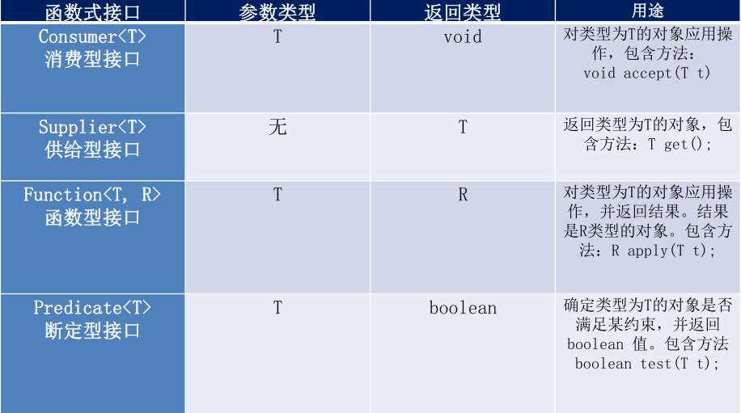

java内置其他函数式接口介绍：

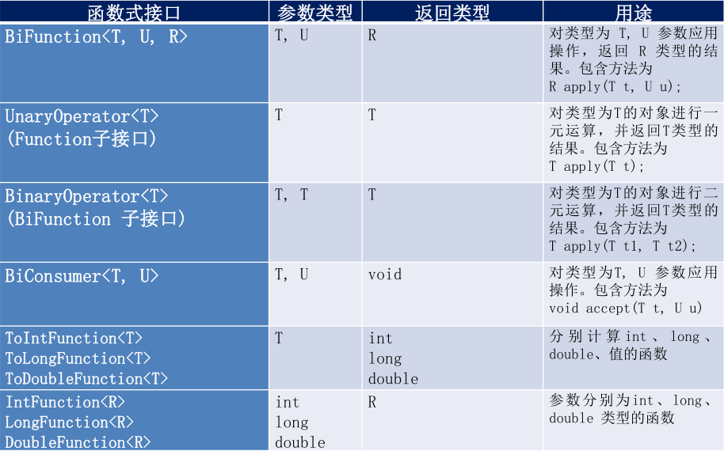

### 3.方法引用和构造器引用

```java
1.方法引用：
当要传递给Lambda体的操作，已经有了实现方法了，可以使用方法引用！（实现抽象方法的参数列表，必须与方法引用方法的参数列表保持一致！）
方法引用：使用操作符“::”将方法名和对象或类的名字分隔开来。
如下三种主要使用情况：
// 对象::实例方法
// 类::静态方法
// 类::实例方法
例如：
(x) -> System.out.println(x);
等同于 System.out::println;
例如：
BinaryOperator<Double> bo = (x, y) -> Math.pow(x, y);
等同于 BinaryOperator<Double> bo = Math::pow;
例如： //注意当需要引用的方法的第一个参数是调用对象，并且第二个参数是需要引用方法的第二个参数(或无参数)时：ClassName::methodName;
compare((x, y) -> x.equals(y), "abc", "abc");
等同于 compare(String::equals, "abc", "abc");

2.构造器引用：
//格式：ClassName::new
与函数式接口相结合，自动与函数式接口中方法兼容。可以把构造器引用赋值给定义的方法，与构造器参数列表要与接口中抽象方法的参数列表一致！
例如：
Function<Integer, MyClass> fun = (n) -> new MyClass(n);
等同于 Function<Integer, MyClass> fun = MyClass::new;

3.数组引用：
//格式：type[]::new
例如：
Function<Integer, Integer[]> fun = (n) -> new Integer[n];
等同于 Function<Integer, Integer[]> fun = Integer[]::new;
```

### 4.Stream API

```java
1.概念
java8中有两个最重要的改变。第一个是Lambda表达式；另外一个则是Stream API(java.util.stream.*).
Stream是java8中处理集合的关键抽象概念，它可以指定你希望对集合进行的操作，可以执行非常复杂的查找、过滤、映射数据等操作。使用stream API 对集合数据进行操作，就类似于使用SQLzhixing的数据库查询。也可以使用stream API 来并行执行操作。简而言之，Stream API 提供一种高效且易于使用的处理数据的方式。
2.流(stream)到底是什么呢?
    是数据渠道，用于操作数据源（集合、数组等）所生成的元素序列。“集合讲的是数据，流讲的是计算！”。
    注意：1）stream自己不会存储元素；
    	 2）stream不会改变原对象。相反他们会返回一个持有结果的新stream。
    	 3）stream操作是延迟执行的。这意味着他们会等到需要结果的时候执行。
3.stream操作的三个步骤：
	1）创建stream；
		一个数据源（如：集合、数组），获取一个流
	2）中间操作；
		一个中间操作链，对数据源的数据进行处理；
	3）终止操作（终端操作）；
		一个终止操作，执行中间操作链，并产生结果；
```

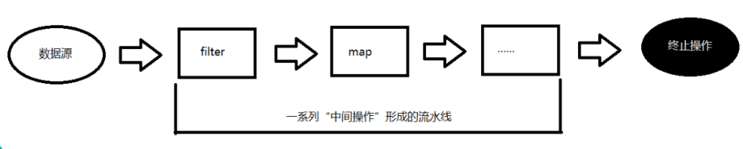

#### 4.1创建stream

```java
//java8中Collection接口被扩展，提供了两个获取流的方法：
default Stream<E> stream() //返回一个顺序流
default Stream<E> parallelStream() //返回一个并行流

由数组创建流
java8中Arrays的静态方法stream()可以获取数组流：
static <T> Stream<T> stream(T[] array): 返回一个流

由值创建流
可以使用静态方法Stream.of(),通过显示值创建一个流。它可以接收任意数量的参数。
public static<T> Stream<T> of(T... values) //返回一个流

由函数创建流
可以使用静态方法Stream.iterate()和Stream.generate(),创建无限流。
	//迭代
	public static<T> Stream<T> iterate(final T seed, final
UnaryOperator<T> f)
    //生成
    public static<T> Stream<T> generate(Supplier<T> s)
```

#### 4.2stream的中间操作

```
多个中间操作可以连接起来形成一个流水线，除非流水线上触发终止操作，否则中间操作不会执行任何的处理！而在终止操作时一次性全部处理，称为“惰性求值”。
```

**1.筛选与切片**

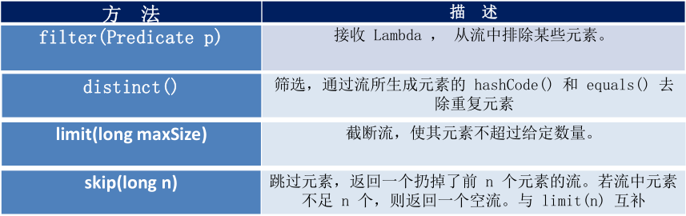

**2.映射**

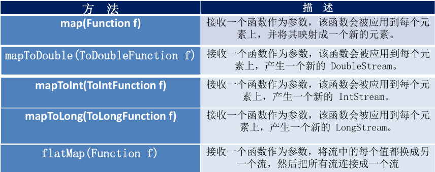

**3.排序**

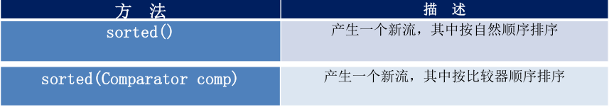

#### 4.3Stream的终止操作

```
终端操作会从流的流水线生成结果。其结果可以是任何不是流的值，例如：List、Integer,甚至是void。
```

**查找与匹配**

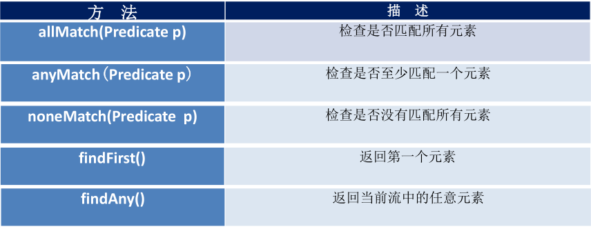

**统计与遍历**

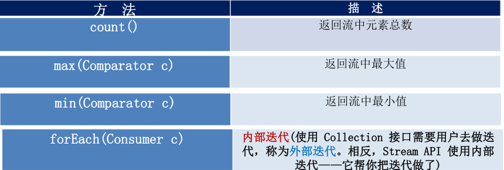

**归约**

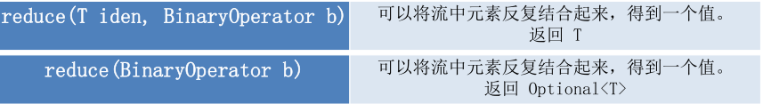

```java
//示例
 @Test
    public void test2() {
        Integer reduce = students.stream()
                .map(Student::getAge)
                .reduce(0, (s1, s2) -> s1 + s2);
        System.out.println(reduce);

        Optional<Integer> op = students.stream()
                .map(Student::getScore)
                .reduce(Integer::sum);
        System.out.println(op.get());
    }
```

**收集**

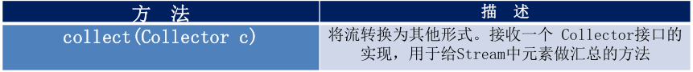

```java
Collector接口中方法的实现决定了如何对流执行收集操作（如收集到List、Set、Map）.但是Collections实用类提供了很多静态方法，可以方便地创建常见收集器实例，具体方法与实例如下表：
```

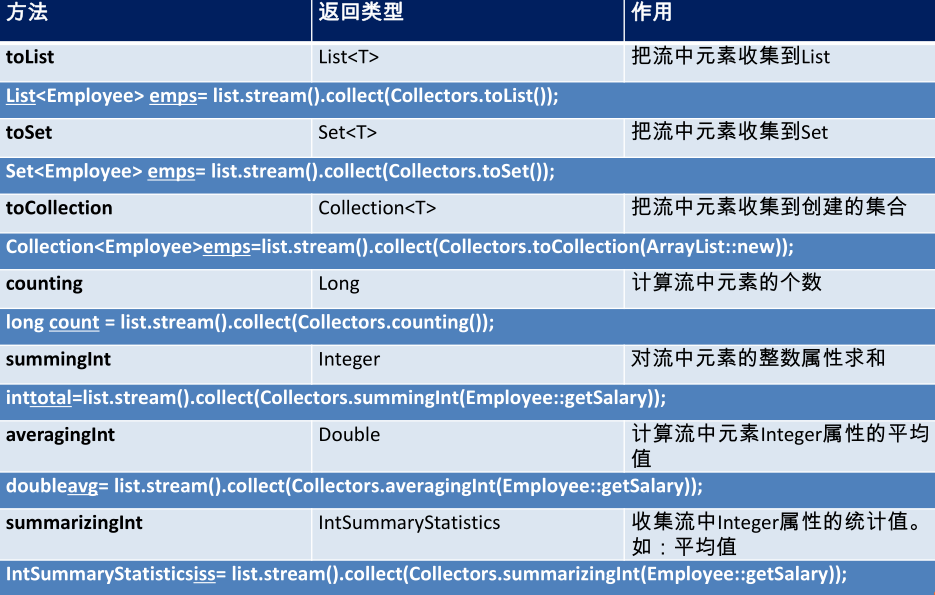

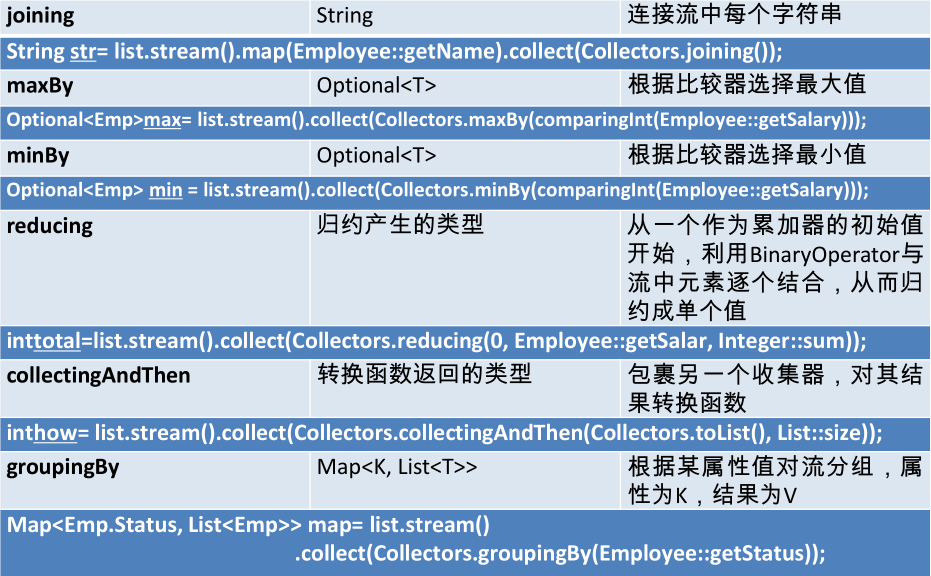

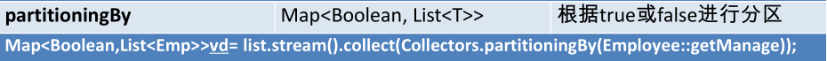

### 5.并行流与串行流

```java
	并行流就是把一个内容分成多个数据块，并用不同的线程分别处理每个数据块的流。
	java8中将并行进行了优化，我们可以很容易的对数据进行并行操作。Stream API可以声明性的通过parallel()与sequential()在并行流与顺序流切换。
	
//test
@Test
    public void test4() {
        Instant start = Instant.now();

        long num = LongStream.rangeClosed(0, 100000000000L)
                .parallel()
                .reduce(0, Long::sum);
        System.out.println("总和是" + num);
        
        Instant end = Instant.now();
        System.out.println("耗费时间是：" + Duration.between(start, end).toMillis());
    }
```

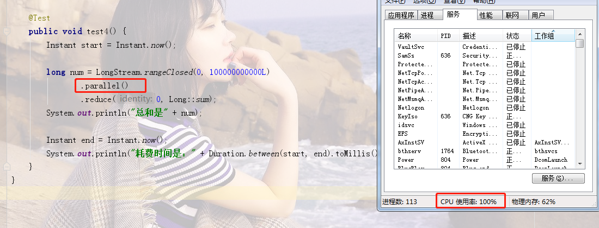

如上图，使用并行流CPU使用率为100%

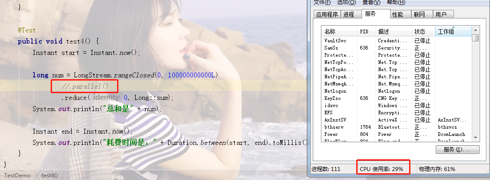

如上图，使用串行流CPU使用率为30%左右

```java
//了解Fork/Join框架
Fork/Join框架：就是在必要的情况下，将一个大任务，进行拆分（fork）成若干个小任务（拆到不可再拆分时），再将一个个的小任务运算的结果进行join汇总。

//串行流底层使用的就是fork/join框架

//fork/join框架与传统线程池的区别
采用“工作窃取”模式（work-stealing）:
当执行新的任务时它可以将其拆分成更小的任务执行，并将小任务加到线程队列中，然后再从一个随机的线程的队列中偷一个并把它放在自己的队列中。
相对于一般线程池的实现，fork/join 框架的优势体现在对其中包含的任务的处理方式上。在一般的线程池中，如果一个线程正在执行的任务由于某些原因无法继续运行，那么该线程会处于等待状态。而在fork/join框架实现中，如果某个子问题由于等待另外一个子问题的完成而无法继续运行，那么处理该子问题的线程会主动寻找其他尚未运行的子问题来执行。这种方式减少l线程的等待时间，提高了性能。
```

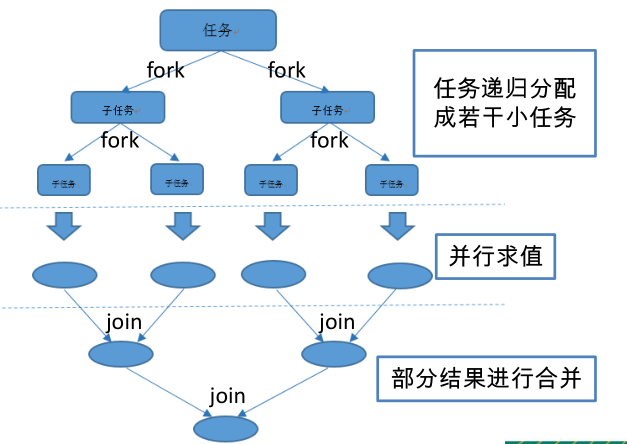

### 6.Optional类

```java
Optional<T>类（java.util.Optional）是一个容器类，代表一个值存在或不存在，原来是null表示一个值不存在，现在Optional可以更好的表达这个概念。并且可以避免空指针异常。
//常用方法：
Optional.of(T t):创建一个Optional实例
Optional.empty():创建一个空的Optional实例
Optional.ofNullable(T t)：若T不为null，创建Optional实例，否者创建空实例
isPresent():判断是否包含值
orElse(T t):如果调用对象包含值，返回该值，否则返回t
orElseGet(Supplier s):如果调用对象包含值，返回该值，否则返回s获取的值
map(Function f):如果有值对其处理，并返回处理后的optional,否则返回Optional.empty()
flatMap(Function mapper):与map类似，要求返回值必须是Optional
```

### 7.接口中的默认方法和静态方法

**接口中的默认方法**

```java
java8中允许接口中包含具有具体实现的方法，该方法称为"默认方法"，默认方法使用default关键字修饰。
//例如：
interface MyFunc<T>{
	T func(int a);
    default String getName(){
    	return "Hello java8";
    }
}

//接口中默认方法的“类优先”原则
一个子类继承了一个父类且实现了一个接口如下1），一个子类同时实现了两个接口，如下2）
1）选择父类中的方法。如果一个父类提供了具体的实现，那么接口中具有相同名称和参数的默认方法会被忽略
2）接口冲突。如果一个父接口提供了一个默认方法，而另一个接口也提供了一个具有相同名称和参数列表的方法（不管方法是否是默认方法），那么必须覆盖该方法来解决冲突。
```

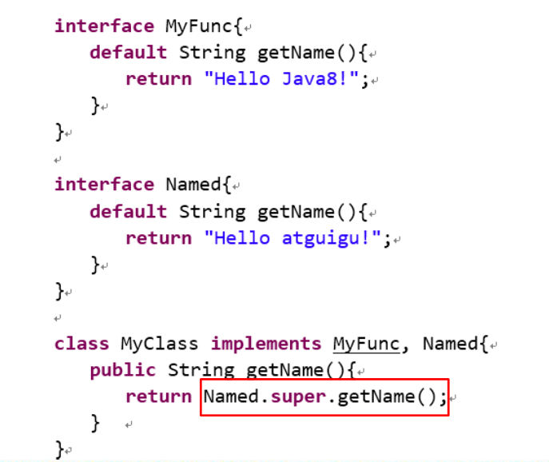

**接口中的静态方法**

```java
java8中，接口中允许添加静态方法。
//例如：
interface Named {
	public Integer myFun();
    default String getName() {
    	return "Hello world";
    }
    
    static void show() {
    	System.out.println("Hello static");
    }
}

//调用方式和普通静态方法一样
Named.show();
```

