### 1.数据结构和算法概述

#### 1.1数据结构和算法的关系

```java
1.程序 = 数据结构 + 算法
2.数据结构是算法的基础，想要学好算法，必须要把数据结构学到位。
3.数据结构主要分为 线性结构 和 非线性结构。
```

#### 1.2线性结构和非线性结构

```java
1.线性结构
	1）线性结构是最常用的数据结构，特点是数据元素之间存在一对一的线性关系。
	2）线性结构的两种不同存储结构，即顺序存储结构(数组)和链式存储结构（链表）。顺序存储结构中存储元素是连续的，链表中的存储元素不一定是连续的（元素节点中存放数据元素以及相邻元素的地址信息）
	3）线性结构常见的有：数组、队列、链表和栈。

2.非线性结构
	非线性结构包括：二维数组、多维数组、广义表、数据结构、图结构。
```

### 2.稀疏数组和队列

#### 2.1稀疏数组sparsearray

##### 2.1.1需求

* 编写的五子棋程序中，有存盘退出和续上盘的功能。


* 分析问题： 因为该二维数组的很多值是默认值0，因此记录了很多没有意义的数据->稀疏数组

##### 2.1.2稀疏数组的处理方法

1）记录数组一共几行几列，有多少个不同的值

2）把具有不同值的元素的行列及值记录在一个小规模的数组中，从而缩小程序规模。


##### 2.1.3应用实例

1）使用稀疏数组来保留类似前面的二维数组；

2）把稀疏数组存盘，并且可以重新恢复为原来的二维数组；

3）思路分析，如下

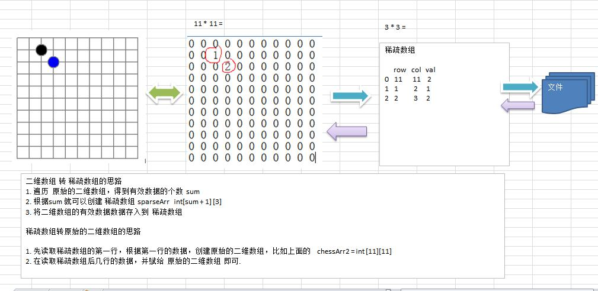

4）代码实现

```java
public class ParsearrayDemo {
    public static void main(String[] args) {
        //1.初始化二位数组
        int[][] chess = new int[11][11];
        chess[1][2] = 1;
        chess[2][3] = 2;
        //打印二维数组
        System.out.println("打印二位数组");
        for (int i = 0; i<11; i++){
            for (int j = 0; j<11; j++){
                System.out.printf("%d\t", chess[i][j]);
            }
            System.out.println();
        }
        //2.二维数组转稀疏数组
        int sum = 0; //记录二位数组总共有多少个不同的值
        for (int i = 0; i<11; i++){
            for (int j = 0; j<11; j++){
                if(chess[i][j] != 0){
                    sum++;
                }
            }
        }
        int[][] parsearray = new int[sum + 1][3];
        parsearray[0][0] = 11;
        parsearray[0][1] = 11;
        parsearray[0][2] = sum;
        int n = 0;
        for (int i = 0;i<11;i++){
            for (int j = 0;j<11;j++){
                if(chess[i][j]!=0){
                    n++;
                    parsearray[n][0] = i;
                    parsearray[n][1] = j;
                    parsearray[n][2] = chess[i][j];
                }
            }
        }
        //打印稀疏数组
        System.out.println("打印稀疏数组");
        for (int i = 0; i<parsearray.length; i++){
            for (int j = 0; j<3;j++){
                System.out.printf("%d\t", parsearray[i][j]);
            }
            System.out.println();
        }

        //3.稀疏数组转二维数组
        int[][] chess2 = new int[parsearray[0][0]][parsearray[0][1]];
        for (int i = 1; i<parsearray.length; i++){
            chess2[parsearray[i][0]][parsearray[i][1]] = parsearray[i][2];
        }
        //打印还原后的二维数组
        System.out.println("打印还原后的二位数组");
        for (int[] ches : chess2){
            for (int data : ches){
                System.out.printf("%d\t", data);
            }
            System.out.println();
        }
    }
}

```

#### 2.2队列

##### 2.2.1队列介绍

```java
1.队列是一个有序列表，可以用数组或链表实现；
2.遵循先入先出的原则；
3.示意图如下（使用数组模拟队列示意图）：
```

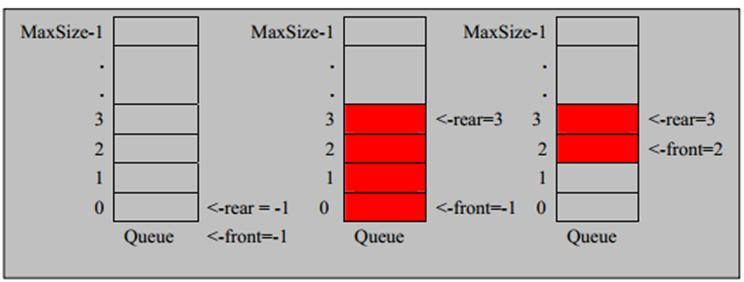

##### 2.2.2数组模拟队列思路

```java
1.数组模拟队列，数组的初始长度即为队列的最大容量；
2.队列的输入和输出是从尾和头来处理，因此需要两个变量rear,front分别记录队列尾和头的下标；front随着数据的输出而改变，rear随着数据的输入而改变；
3.当我们存数据到队列时有两个步骤：
	1）将尾指针向后移：rear+1,当rear==front(空)
    2）若尾指针小于maxSize-1,则将数据存入rear所指的数组元素中，否则无法存入数据；rear == maxSize-1(满)；
4.注意：front指向头部数据的前一个位置，rear指向尾部数据的位置；上图第三个front应该为1
```

代码实现：

```java
public class ArrayQueueDemo {
    public static void main(String[] args) {
        //测试
        //创建一个队列
        ArrayQueen queue = new ArrayQueen(3);
        char key = ' '; //接收用户输入
        Scanner scanner = new Scanner(System.in);
        boolean loop = true;
        //输出一个菜单
        while (loop){
            System.out.println("s,显示队列");
            System.out.println("e,退出程序");
            System.out.println("a,添加数据");
            System.out.println("g,从队列取出数据");
            System.out.println("h,查看头部数据");
            key = scanner.next().charAt(0); //接收一个字符
            switch (key){
                case 's':
                    queue.showQueue();
                    break;
                case 'a':
                    try {
                        System.out.println("请输入要添加的数据");
                        int i = scanner.nextInt();
                        queue.addQueue(i);
                    }catch (Exception e){
                        System.out.println(e.getMessage());
                    }
                    break;
                case 'g':
                    try {
                        int res = queue.getQueue();
                        System.out.println("取出的数据是" + res);
                    }catch (Exception e){
                        System.out.println(e.getMessage());
                    }
                    break;
                case 'h':
                    try {
                        int n = queue.headQueue();
                        System.out.println("头数据是"+n);
                    }catch (Exception e){
                        System.out.println(e.getMessage());
                    }
                    break;
                case 'e':
                    scanner.close();
                    loop = false;
                    break;
                    default:
                        break;
            }
        }
        System.out.println("程序退出~");
    }
}

//使用数组模拟队列-编写一个ArrayQueue类
class ArrayQueen{
    private int maxSize; //数组最大容量
    private int front; //队列头
    private int rear; //队列尾
    private int[] arr; //该数组用于存放数据，模拟队列

    //创建队列的构造器
    public ArrayQueen(int arryMaxSize){
        maxSize = arryMaxSize;
        arr = new int[maxSize];
        front = -1; //指向队列的头部前一个位置
        rear = -1; //指向队列尾的数据
    }

    //判断队列是否已满
    public boolean isFull(){
        return rear == maxSize - 1;
    }

    //判断判断队列是否为空
    public boolean isEmpty(){
        return rear == front;
    }

    //添加数据到队列
    public void addQueue(int a){
        if(isFull()){
            throw new RuntimeException("队列已满，不能添加数据");
        }
        rear ++;
        arr[rear] = a;
    }

    //获取队列数据，出队列
    public int getQueue(){
        if(isEmpty()){
            throw new RuntimeException("队列已空，不能取数据");
        }
        front ++;
        return arr[front];
    }

    //显示队列所有数据
    public void showQueue(){
        if(isEmpty()){
            System.out.println("队列是空的，没有数据~");
            return;
        }
        for (int i = 0; i<arr.length; i++){
            System.out.printf("arr[%d]=%d\n", i, arr[i]);
        }
    }

    //显示队列的头部,注意不是出队列
    public int headQueue(){
        if(isEmpty()){
            throw new RuntimeException("队列是空的，没有头部数据");
        }
        return arr[front+1];
    }
}
```

问题分析及优化：

​	1）目前的数组使用一次就不能用了，没有达到复用的效果；

​	2）将这个队列使用算法，改造成一个环形队列   取模 %

##### 2.2.3数组模拟环形队列

对前面的数组模拟队列优化，充分利用数组，因此将数组看作是一个环形的。（通过取模的方式实现即可）。

分析说明：

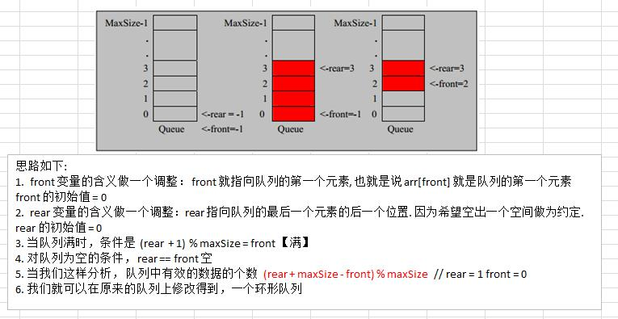

代码实现：

```java
public class CircleQueueDemo {
    public static void main(String[] args) {
        //测试
        //创建一个队列
        CircleArrayQueue queue = new CircleArrayQueue(4);
        char key = ' '; //接收用户输入
        Scanner scanner = new Scanner(System.in);
        boolean loop = true;
        //输出一个菜单
        while (loop){
            System.out.println("s,显示队列");
            System.out.println("e,退出程序");
            System.out.println("a,添加数据");
            System.out.println("g,从队列取出数据");
            System.out.println("h,查看头部数据");
            key = scanner.next().charAt(0); //接收一个字符
            switch (key){
                case 's':
                    queue.showQueue();
                    break;
                case 'a':
                    try {
                        System.out.println("请输入要添加的数据");
                        int i = scanner.nextInt();
                        queue.addQueue(i);
                    }catch (Exception e){
                        System.out.println(e.getMessage());
                    }
                    break;
                case 'g':
                    try {
                        int res = queue.getQueue();
                        System.out.println("取出的数据是" + res);
                    }catch (Exception e){
                        System.out.println(e.getMessage());
                    }
                    break;
                case 'h':
                    try {
                        int n = queue.headQueue();
                        System.out.println("头数据是"+n);
                    }catch (Exception e){
                        System.out.println(e.getMessage());
                    }
                    break;
                case 'e':
                    scanner.close();
                    loop = false;
                    break;
                default:
                    break;
            }
        }
        System.out.println("程序退出~");
    }
}

//用数组创建一个环形队列
class CircleArrayQueue{
    private int maxSize;
    private int front;
    private int rear;
    private int[] arr;

    public CircleArrayQueue(int arrMaxSize){
        maxSize = arrMaxSize;
        arr = new int[maxSize];
    }

    //判断队列是否已满
    public boolean isFull(){
        return (rear + 1) % maxSize == front;
    }
    //判断队列是否已空
    public boolean isEmpty(){
        return rear == front;
    }
    //添加数据到队列
    public void addQueue(int a){
        if(isFull()){
            System.out.println("队列已满，不能添加数据~");
            return;
        }
        arr[rear] = a;
        rear = (rear + 1) % maxSize;
    }
    //获取队列数据
    public int getQueue(){
        if(isEmpty()){
            throw new RuntimeException("队列已空，不能取数据~");
        }
        int value = arr[front];
        front = (front + 1) % maxSize;
        return value;
    }
    //显示队列所有数据
    public void showQueue(){
        if(isEmpty()){
            System.out.println("队列时空的，没法显示数据~");
            return;
        }
        for(int i = front; i < front + size(); i++){
            System.out.printf("arr[%d]=%d\n", i%maxSize, arr[i%maxSize]);
        }
    }
    //显示队列的头，注意不是取数据
    public int headQueue(){
        if(isEmpty()){
            throw new RuntimeException("队列时空的，没有头数据~");
        }
        return arr[front];
    }


    //当前队列有多少有效数据
    public int size(){
        return (rear + maxSize - front) % maxSize;
    }
}

```

### 3.链表

#### 3.1链表（Linked List）介绍

链表是有序的的列表，但是每个节点在内存中是不连续的


```java
1.链表是以节点方式来存储，是链式存储；
2.每个节点包含data域，next域：指向下一个节点；
3.链表的各个节点不一定是连续存储；
4.链表分为带头结点的链表和不带头节点的链表，根据实际需求来确定；
```

#### 3.2单链表的实例应用

```java
问题：
使用带head头的单向链表实现水浒英雄排行榜管理完成对英雄人物的增删改查操作。
1）第一种添加方式，添加英雄时直接在链表尾添加；
2）第二种添加方式，根据排名，将英雄添加到指定的位置，如果有这个排名则添加失败且给出提示信息；
3）修改节点
4）删除节点
```

代码实现：

```java
public class SingleLinkedListDemo {
    public static void main(String[] args) {
        //测试单向链表
        HeroNode heroNode = new HeroNode(1, "宋江", "及时雨");
        HeroNode heroNode1 = new HeroNode(2, "卢俊义", "玉麒麟");
        HeroNode heroNode2 = new HeroNode(3, "吴用", "智多星");
        HeroNode heroNode3 = new HeroNode(4, "公孙胜", "入云龙");

        SingleLinkedList singleLinkedList = new SingleLinkedList();
        /*singleLinkedList.addNode(heroNode);
        singleLinkedList.addNode(heroNode1);
        singleLinkedList.addNode(heroNode2);
        singleLinkedList.addNode(heroNode3);*/
        //带编号添加
        singleLinkedList.addNodeByOrder(heroNode);
        singleLinkedList.addNodeByOrder(heroNode3);
        singleLinkedList.addNodeByOrder(heroNode2);
        singleLinkedList.addNodeByOrder(heroNode1);
        singleLinkedList.addNodeByOrder(heroNode2);

        singleLinkedList.showSingleLinkedList();
        
        //测试修改
        HeroNode node = new HeroNode(2, "卢员外", "玉麒麟~~");
        singleLinkedList.update(node);
        System.out.println("修改以后的链表如下：");
        singleLinkedList.showSingleLinkedList();
        
        //测试删除节点
        singleLinkedList.delete(1);
        singleLinkedList.delete(4);
        singleLinkedList.delete(2);
        System.out.println("删除以后的链表如下：~");
        singleLinkedList.showSingleLinkedList();
    }
}

class SingleLinkedList{
    //初始化一个头结点,头节点不存储数据
    private HeroNode head = new HeroNode(0, "", "");

    //添加节点（不考虑编号）
    //1.找到当前链表的最后节点
    //2.将最后节点的next指向新的节点
    public void addNode(HeroNode heroNode){
        //因为head节点不能动，因此我们需要一个辅助遍历temp
        HeroNode temp = head;
        while (true){
            if(temp.next == null){
                break;
            }
            temp = temp.next;
        }
        temp.next = heroNode;
    }
    
    //添加节点（考虑编号，若编号存在提示添加不进去）
    public void addNodeByOrder(HeroNode heroNode){
        //遍历辅助变量
        HeroNode temp = head;
        //是否有相同的编号
        boolean flag = false;
        while(true){
            if(temp.next == null){
                break;
            }
            if(temp.next.no > heroNode.no){
                break;
            }else if(temp.next.no == heroNode.no){
                flag = true;
            }
            temp = temp.next;  //指针后移
        }

        if(flag){
            System.out.printf("编号%d已经存在，无法添加~", heroNode.no);
        }else{
            heroNode.next = temp.next;
            temp.next = heroNode;
        }
    }
    
    //修改节点
    public void update(HeroNode heroNode){
        HeroNode temp = head;
        //是否找到相同的节点供修改
        boolean flag = false;
        while (true){
            if(temp.next == null){
                break;
            }
            if(temp.next.no == heroNode.no){
                flag = true;
                break;
            }
            temp = temp.next;
        }
        if(flag){
            temp.next.name = heroNode.name;
            temp.next.nickName = heroNode.nickName;
        }else{
            System.out.printf("没有找到编号为%d的节点\n,不能修改~", heroNode.no);
        }

    }
    
    //删除节点
    public void delete(int no){
        HeroNode temp = head;
        boolean flag = false;
        while(true){
            if(temp.next == null){
                break;
            }
            if(temp.next.no == no){
                flag = true;
                break;
            }
            temp = temp.next;
        }
        if(flag){
            temp.next = temp.next.next;
        }else{
            System.out.printf("没有找到编号为%d的节点，不能删除\n", no);
        }
    }
    

    //显示链表
    public void showSingleLinkedList(){
        HeroNode temp = head;
        while(true){
            if(temp.next == null){
                break;
            }
            System.out.println(temp.next.toString());
            temp = temp.next;
        }
    }
}

//创建HeroNode,每一个HeroNode对象就是一个节点
class HeroNode{
    public int no;
    public String name;
    public String nickName;
    public HeroNode next;

    public HeroNode(int no, String name, String nickName){
        this.no = no;
        this.name = name;
        this.nickName = nickName;
    }
    @Override
    public String toString() {
        return "HeroNode{" +
                "no=" + no +
                ", name='" + name + '\'' +
                ", nickName='" + nickName + '\'' +
                '}';
    }
}

```

#### 3.3单链表面试题（新浪、百度、腾讯）

1）求单链表中有效节点个数

```java
//单链表中有效节点个数（不能统计头节点）
    public int getLength(HeroNode head){
        HeroNode cur = head.next;
        int i = 0;
        while(cur != null){
            cur = cur.next;
            i++;
        }
        return i;
    }
```

2）查找单链表中倒数第k个节点

```java
//查找单链表中倒数第k个节点
    //1.先遍历查出链表的有效节点个数length
    //2.倒数第K个就是正数第length-k个
    public static HeroNode findLastIndexNode(HeroNode head, int index){
        int length = getLength(head);
        if(index <= 0 || index > length){
            return null;
        }
        HeroNode cur = head.next; //length=3,index=1, 从第一个到第三个需要遍历两次，3-1正确
        for(int i = 0; i < length-index; i++){
            cur = cur.next;
        }
        return cur;
    }
```

3）单链表反转（腾讯面试题）

思路分析：

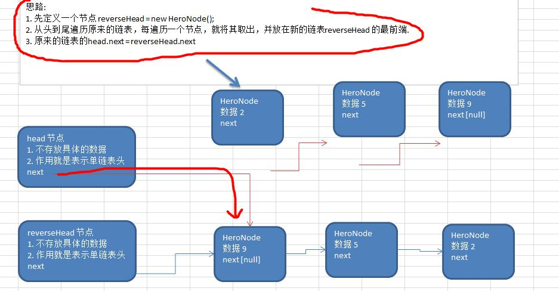

代码实现：

```java
//腾讯面试题：单链表的反转
    //思路：1.新建一个单链表的头节点ReverseHead  2.遍历原来的链表，每取出一个节点都放在新链表的最前面 3.将原来的链表头的下一个节点指向新链表头的第一个节点
    public static HeroNode reverseList(HeroNode head){
        if(head.next == null || head.next.next == null){
            return head;   //空链表或只有一个节点的链表直接返回
        }
        HeroNode reverseHead = new HeroNode(0, "", "");
        HeroNode cur = head.next; //辅助变量（循环指针）
        HeroNode next = null; //指向当前节点的下一个节点
        while (cur != null){
            next = cur.next; //注意：把当前节点及后面的节点保存,供后面指针后移使用
            cur.next = reverseHead.next;
            reverseHead.next = cur;
            cur = next;
        }
        head.next = reverseHead.next;
        return head;
    }
```

4）从尾到头打印链表（百度面试题，推荐用栈实现)

代码实现：

```java
 //百度面试题：从尾到头打印单链表(使用栈)
    public static void reversePrint(HeroNode head){
        if(head.next == null){
            return; //链表为空
        }
        //创建一个栈，将链表各个节点顺序压入栈中，先进后出完成倒序
        Stack<HeroNode> stack = new Stack<>();
        HeroNode cur = head.next;
        while (cur != null){
            stack.push(cur);
            cur = cur.next;
        }
        while (stack.size() > 0){
            System.out.println(stack.pop().toString());
        }
    }
```

#### 3.4双向链表应用实例

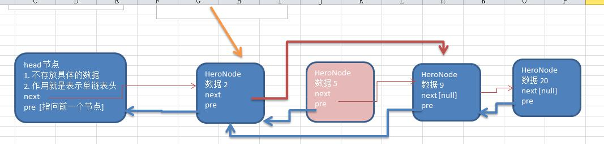

**对上图说明：**

1.*遍历：*方法和单链表一样，只是可以向前也可以向后查找；

2.*添加（默认添加到双向链表的最后）*：

​	1）先找到双向链表的最后这个节点

​	2）temp.next = newHeroNode

​	3)newHeroNode.pre = temp

3.*修改：*思路和原来单链表一样

4.*删除*

​	1）因为是双链表，因此可以实现自我删除某个节点；

​	2）直接找要删除的节点，比如temp

​	3）temp.pre.next = temp.next

​	4)temp.next.pre = temp.pre

**双向链表代码实现：**

```java
public class DoubleLinkedListDemo {
    public static void main(String[] args) {
        //测试双向链表
        System.out.println("双向链表的测试~");

        HeroNode2 heroNode = new HeroNode2(1, "宋江", "及时雨");
        HeroNode2 heroNode1 = new HeroNode2(2, "卢俊义", "玉麒麟");
        HeroNode2 heroNode2 = new HeroNode2(3, "吴用", "智多星");
        HeroNode2 heroNode3 = new HeroNode2(4, "公孙胜", "入云龙");

        //创建一个双向链表
        DoubleLinkedList doubleLinkedList = new DoubleLinkedList();
        doubleLinkedList.addNode(heroNode);
        doubleLinkedList.addNode(heroNode1);
        doubleLinkedList.addNode(heroNode2);
        doubleLinkedList.addNode(heroNode3);
        doubleLinkedList.showDoubleLinkedList();

        HeroNode2 newNode = new HeroNode2(3, "wu用", "智多星~");
        doubleLinkedList.update(newNode);
        System.out.println("测试修改~");
        doubleLinkedList.showDoubleLinkedList();

        doubleLinkedList.delete(3);
        doubleLinkedList.delete(4);
        System.out.println("测试删除~");
        doubleLinkedList.showDoubleLinkedList();
    }


}


class DoubleLinkedList{
    //初始化一个头结点,头节点不存储数据
    private HeroNode2 head = new HeroNode2(0, "", "");

    public HeroNode2 getHead() {
        return head;
    }

    //添加节点（默认添加到链表的最后）
    //1.找到当前链表的最后节点
    //2.将最后节点的next指向新的节点
    //3.将新节点的pre指向原最后一个节点
    public void addNode(HeroNode2 heroNode){
        //因为head节点不能动，因此我们需要一个辅助遍历temp
        HeroNode2 temp = head;
        while (true){
            if(temp.next == null){
                break;
            }
            temp = temp.next;
        }
        temp.next = heroNode;
        heroNode.pre = temp;
    }

    //修改节点
    public void update(HeroNode2 heroNode){
        HeroNode2 temp = head;
        //是否找到相同的节点供修改
        boolean flag = false;
        while (true){
            if(temp.next == null){
                break;
            }
            if(temp.next.no == heroNode.no){
                flag = true;
                break;
            }
            temp = temp.next;
        }
        if(flag){
            temp.next.name = heroNode.name;
            temp.next.nickName = heroNode.nickName;
        }else{
            System.out.printf("没有找到编号为%d的节点\n,不能修改~", heroNode.no);
        }

    }

    //删除节点(双链表可以实现自我删除)
    public void delete(int no){
        HeroNode2 temp = head.next;
        boolean flag = false;
        while(true){
            if(temp == null){
                break;
            }
            if(temp.no == no){
                flag = true;
                break;
            }
            temp = temp.next;
        }
        if(flag){
            if(temp.next != null){ //如果是删除最后一个节点
                temp.next.pre = temp.pre;
            }
            temp.pre.next = temp.next;
        }else{
            System.out.printf("没有找到编号为%d的节点，不能删除\n", no);
        }
    }


    //显示链表
    public void showDoubleLinkedList(){
        HeroNode2 temp = head;
        while(true){
            if(temp.next == null){
                break;
            }
            System.out.println(temp.next.toString());
            temp = temp.next;
        }
    }
}

//创建HeroNode,每一个HeroNode对象就是一个节点
class HeroNode2{
    public int no;
    public String name;
    public String nickName;
    public HeroNode2 pre;
    public HeroNode2 next;

    public HeroNode2(int no, String name, String nickName){
        this.no = no;
        this.name = name;
        this.nickName = nickName;
    }
    @Override
    public String toString() {
        return "HeroNode{" +
                "no=" + no +
                ", name='" + name + '\'' +
                ", nickName='" + nickName + '\'' +
                '}';
    }
}
```

#### 3.5单向环形链表（约瑟夫环）

1. 约瑟夫（Josephu）问题概要：

   ```java
   问题：
   	设编号为1,2，...,n的n个人围坐一圈，约定编号为k（1<=k<=n）的人从1开始报数，数到m的那个人出列，它的下一位又从1开始报数，数到m的那个人又出列，以此类推，直到所有人出列为止，由此产生一个出队编号的序列。
   提示：
   	用一个不带头节点的循环链表来处理josephu问题：先构建一个有n个节点的单循环链表，然后由k点起从1开始计数，记到m时，对应节点从链表中删除，然后再从被删除节点的下一个节点又从1开始计数，直到最后一个节点从链表中删除，算法结束。
   ```

   思路分析：

   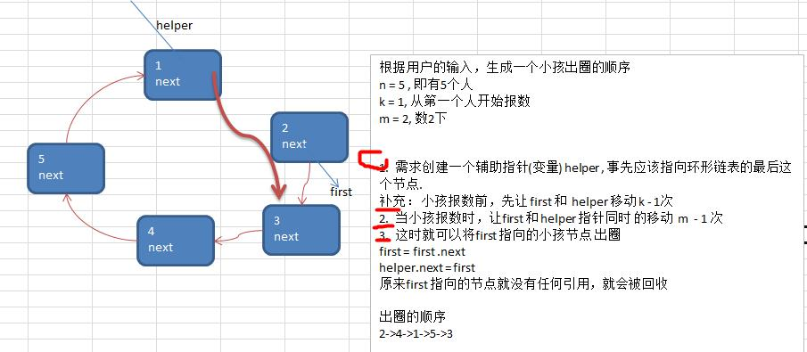

   

   代码示例：

   ```java
   public class Josephu {
       public static void main(String[] args) {
           //测试环形链表
           CircleSingleLinkedList circleSingleLinkedList = new CircleSingleLinkedList();
           circleSingleLinkedList.addBoys(5);
           circleSingleLinkedList.list();
   
           //测试约瑟夫问题
           circleSingleLinkedList.countBoy(1,2,5);
       }
   }
   
   //构建一个单向链表环
   class CircleSingleLinkedList{
       //一个辅助变量，该变量指向第一个节点，因为每增加一个节点都需要指向第一个节点，有变量指向第一个节点才可以操作
       Boy first = null;
   
       //添加节点
       public void addBoys(int count){
           if(count < 1){
               System.out.println("输入参数有误~");
               return;
           }
           //辅助变量（指针），作用类似first，帮助构建环形链表
           Boy curBoy = null;
           for(int i = 1; i<=count; i++){
               Boy boy = new Boy(i);
               if(i == 1){
                   first = boy;
                   curBoy = boy;
                   first.setNext(first);
               }else{
                   curBoy.setNext(boy);
                   curBoy = boy;
                   curBoy.setNext(first);
               }
           }
       }
   
       //遍历环形链表
       public void list(){
           if(first == null){
               System.out.println("链表是空的~");
               return;
           }else {
               //遍历指针
               Boy curBoy = first;
               while(true){
                   System.out.printf("当前小孩编号是%d \n", curBoy.getNo());
                   curBoy = curBoy.getNext();
                   if(curBoy == first)
                       return;
               }
           }
       }
   
   
   
       /**
        * //约瑟夫问题，根据用户输入打印出小孩出圈顺序
        * 说明：数到的小孩要出圈，相当于删除节点，由于是单向链表，因此需要一个辅助指针指在first的前一个节点，帮助删除first到达的节点
        * @param startNo 第几个小孩开始数数
        * @param countNum 数几下
        * @param nums 最初有几个小孩在圈中
        */
       public void countBoy(int startNo, int countNum, int nums){
           //参数校验
           if(first == null || countNum < 1 || startNo < 1 || startNo > nums){
               System.out.println("参数输入有误~");
               return;
           }
           //创建helper指针，指在最后一个节点，辅助删除节点
           Boy helper = first;
           while (true){
               if(helper.getNext() == first){
                   break;
               }
               helper = helper.getNext();
           }
           //将指针移向开始位置k-1
           for(int j = 0; j<startNo-1;j++){
               first = first.getNext();
               helper = helper.getNext();
           }
           //开始数数，first和helper同时移动，到第m个删除
           while(first != helper){
               for(int i = 0; i<countNum-1; i++){
                   first = first.getNext();
                   helper = helper.getNext();
               }
               //first到达第m个数，删除
               System.out.printf("该次出圈的是编号%d \n", first.getNo());
               first = first.getNext();
               helper.setNext(first);
           }
           System.out.println("最后一位是编号"+first.getNo());
       }
   }
   
   //构建一个小孩类
   class Boy{
       private int no;
       private Boy next;
   
       public Boy(int no){
           this.no = no;
       }
       public int getNo() {
           return no;
       }
   
       public void setNo(int no) {
           this.no = no;
       }
   
       public Boy getNext() {
           return next;
       }
   
       public void setNext(Boy next) {
           this.next = next;
       }
   }
   
   ```

   

### 4.栈

#### 4.1栈的介绍

```java
1.栈是一个先入后出的有序列表。
2.栈是限制线性表中元素的插入和删除只能在线性表的同一端进行的一种特殊线性表。允许插入和删除的一端为变化的一端，称为栈顶（top），另一端为固定的一端，称为栈底（Bottom）。
3.出栈和入栈如下图所示：
```

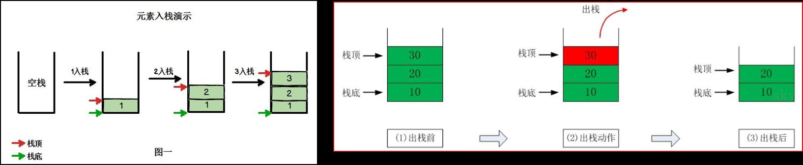

#### 4.2栈的快速入门

1.实现思路：


2.代码实现：

```java
public class ArrayStackDemo {
    public static void main(String[] args) {
        //测试栈
        ArrayStack arrayStack = new ArrayStack(4);
        Scanner scanner = new Scanner(System.in);
        String key = ""; //接收键盘录入数据
        boolean loop = true; //控制程序是否退出
        while(loop){
            System.out.println("show:显示栈");
            System.out.println("exist:退出程序");
            System.out.println("push:压栈");
            System.out.println("pop:弹栈");
            System.out.println("请输入你的选择");
            key = scanner.next();
            switch (key){
                case "show":
                    try {
                        arrayStack.list();
                    }catch (Exception e){
                        //TODO handler
                        System.out.println(e.getMessage());
                    }
                    break;
                case "exist":
                    scanner.close();
                    loop = false;
                    break;
                case "push":
                    System.out.println("请输入一个数：");
                    int i = scanner.nextInt();
                    arrayStack.push(i);
                    break;
                case "pop":
                    try{
                        int value = arrayStack.pop();
                        System.out.printf("弹出数据是%d \n", value);
                    }catch (Exception e){
                        System.out.println(e.getMessage());
                    }
                    break;
                default:
                    break;
            }
        }
        System.out.println("程序退出~");
    }
}

//模拟栈
class ArrayStack{
    private int top = -1;  //栈顶
    private int[] stack; //数组模拟栈
    private int maxSize; //长度

    public ArrayStack(int maxSize){
        this.maxSize = maxSize;
        stack = new int[maxSize];
    }

    //判断栈为空
    public boolean isEmpty(){
        return top == -1;
    }
    //判断栈满
    public boolean isFull(){
        return top == maxSize - 1;
    }
    //压栈
    public void push(int value){
        if(isFull()){
            System.out.println("栈满，无法添加数据~");
            return;
        }
        top ++;
        stack[top] = value;
    }
    //弹栈
    public int pop(){
        if(isEmpty()){
            throw new RuntimeException("栈空，没有数据可取~");
        }
        int value = stack[top];
        top--;
        return value;
    }
    //遍历栈 从栈顶开始显示数据
    public void list(){
        if(isEmpty()){
            throw new RuntimeException("栈空，没有数据遍历~");
        }
        for(int i = top; i >= 0; i--){
            System.out.printf("stack[%d]=%d \n", i, stack[i]);
        }
//        while (top != -1) { //错误：如果用top遍历，遍历完栈也就空了，top不能动
//            System.out.printf("stack[%d]=%d \n", top, stack[top]);
//            top--;
//        };
    }
}

```

#### 4.3栈实现综合计算器（中缀表达式）

* 思路分析

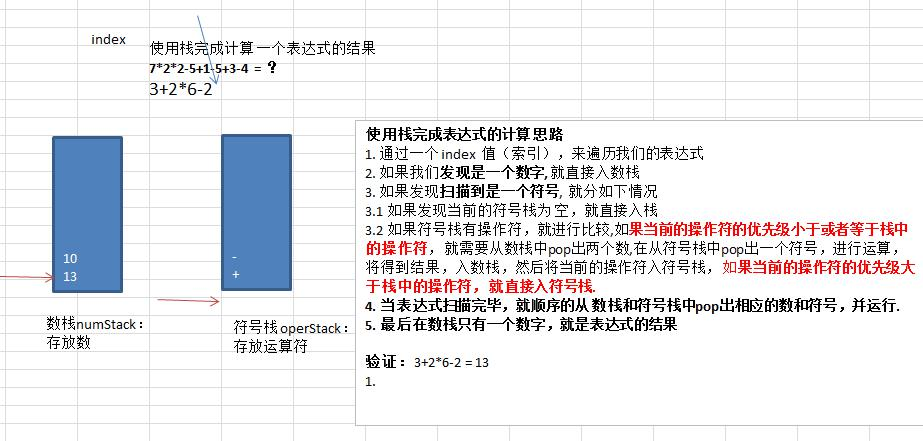

* 代码实现

```java
public class ArrayStackDemo {
    public static void main(String[] args) {
        //栈模拟综合计算器
        String expression = "7*2*2-5+1-5+3*41";
        ArrayStack numStack = new ArrayStack(10);
        ArrayStack operStack = new ArrayStack(10);
        int index = 0;  //索引，用来遍历表达式
        int num1 = 0;
        int num2 = 0;
        int oper = 0;
        int res = 0;
        char ch = ' '; //每次扫描的结果
        String keepNum = ""; //拼接多位数
        while (true){
            ch = expression.substring(index, index + 1).charAt(0);
            //如果ch是运算符
            if(operStack.isOper(ch)){
                if(operStack.isEmpty()){ //如果运算符栈为空直接放入
                    operStack.push(ch);
                }else { //如果不为空，与栈顶运算符比较，如果优先级高于栈顶直接放入，优先级低于或等于栈顶，则弹出栈顶运算符和数据栈的两个数据进行计算
                    if(operStack.priority(ch) > operStack.priority(operStack.peek())){
                        operStack.push(ch);
                    }else {
                        num1 = numStack.pop();
                        num2 = numStack.pop();
                        oper = operStack.pop();
                        res = operStack.cal(num1, num2, oper);
                        numStack.push(res);
                        operStack.push(ch);
                    }
                }
            }else { //如果不是运算符则直接放入numStack
                //numStack.push(ch - 48);
                //多位数处理
                keepNum += ch;
                if(index == expression.length() - 1){
                    numStack.push(Integer.parseInt(keepNum));
                }else {
                    //判断下一位字符是运算符的话，将keepNum直接入栈
                    if(operStack.isOper(expression.substring(index + 1, index + 2).charAt(0))){
                        numStack.push(Integer.parseInt(keepNum));
                        keepNum = "";
                    }
                }
            }
            index++;
            if(index == expression.length()){
                break;
            }
        }

        //表达式扫描完后，此时运算符栈中的栈顶运算优先级肯定大于等于下面的优先级，因此顺序弹出数据和运算符进行运算
        while (true) {
            num1 = numStack.pop();
            num2 = numStack.pop();
            oper = operStack.pop();
            res = operStack.cal(num1, num2, oper);
            numStack.push(res);
            if(operStack.isEmpty()){
                break;
            }
        }
        System.out.printf("%s=%d", expression, numStack.pop());

    }
}

//模拟栈
class ArrayStack{
    private int top = -1;  //栈顶
    private int[] stack; //数组模拟栈
    private int maxSize; //长度

    public ArrayStack(int maxSize){
        this.maxSize = maxSize;
        stack = new int[maxSize];
    }

    //判断栈为空
    public boolean isEmpty(){
        return top == -1;
    }
    //判断栈满
    public boolean isFull(){
        return top == maxSize - 1;
    }
    //压栈
    public void push(int value){
        if(isFull()){
            System.out.println("栈满，无法添加数据~");
            return;
        }
        top ++;
        stack[top] = value;
    }
    //弹栈
    public int pop(){
        if(isEmpty()){
            throw new RuntimeException("栈空，没有数据可取~");
        }
        int value = stack[top];
        top--;
        return value;
    }
    //遍历栈 从栈顶开始显示数据
    public void list(){
        if(isEmpty()){
            throw new RuntimeException("栈空，没有数据遍历~");
        }
        for(int i = top; i >= 0; i--){
            System.out.printf("stack[%d]=%d \n", i, stack[i]);
        }
//        while (top != -1) { //错误：如果用top遍历，遍历完栈也就空了，top不能动
//            System.out.printf("stack[%d]=%d \n", top, stack[top]);
//            top--;
//        };
    }


    //*************************栈实现综合计算器用到的方法*********************************
    //判断取出的字符是否是运算符+-*/
    public boolean isOper(char ch){
        return ch == '+' || ch == '-' || ch == '*' || ch == '/';
    }
    //查看栈顶的元素
    public int peek(){
        return stack[top];
    }
    //当前运算符的优先级
    public int priority(int oper){
        if(oper == '*' || oper == '/'){
            return 1;
        }else if(oper == '+' || oper == '-'){
            return 0;
        }else{
            return -1;
        }
    }
    //计算结果
    public int cal(int num1, int num2, int oper){
        int res = 0; //计算结果
        switch (oper){
            case '+':
                res = num1 + num2;
                break;
            case '-':
                res = num2 - num1;
                break;
            case '*':
                res = num1 * num2;
                break;
            case '/':
                res = num2 / num1;
                break;
            default:
                break;
        }
        return res;
    }
}

```

#### 4.4逆波兰计算器

```java
要求：
	已知一个逆波兰表达式计算其值？
解题思路：
	1.创建一个栈用于存放计算过程的数字和符号；
	2.遍历表达式，1）如果是数字则直接入栈 2）如果是运算符，则弹出栈顶和次栈顶数据进行运算，并将运算结果入栈
	3.遍历完成后栈中的数字就是计算结果。
```

代码实现：

```java
public class PolandNotation {
    public static void main(String[] args) {
        String suffixExpression = "4 5 * 8 - 60 + 8 2 / +";
        //思路：1.先将表达式放入list中
        //      2.将list传给一个方法，配合栈完成计算
        List<String> list = getListString(suffixExpression);
        int result = calculate(list);
        System.out.println("4 5 * 8 - 60 + 8 2 / + 的结果是：" + result);
    }

    //将表达式字符串转为ArrayList
    public static List<String> getListString(String suffixExpression){
        String[] s = suffixExpression.split(" ");
        List<String> list = Arrays.asList(s);
        return list;
    }

    //对波兰表达式转成的list进行计算
    public static int calculate(List<String> list){
        Stack<String> stack = new Stack<>();
        for (String item : list) {
            if(item.matches("\\d+")){ //匹配的是数字，直接入栈
                stack.push(item);
            }else{ //匹配的是运算符则弹出两个数进行计算
                int num2 = Integer.parseInt(stack.pop());
                int num1 = Integer.parseInt(stack.pop());
                int res = 0;
                if(item.equals("+")){
                    res = num1 + num2;
                }else if(item.equals("-")){
                    res = num1 - num2;
                }else if(item.equals("*")){
                    res = num1 * num2;
                }else if (item.equals("/")){
                    res = num1 / num2;
                }else{
                    throw new RuntimeException("输入的运算符有误！");
                }
                stack.push(res + "");
            }
        }
        //遍历完成，最后留在栈中的数就是表达式结果
        return Integer.parseInt(stack.pop());
    }
}

```

#### 4.5中缀表达式转后缀表达式（逆波兰表达式）

1. 具体步骤如下

```properties
1.初始化两个栈s1和s2,s1用来存放运算符，s2用来存放数值；
2.从左向右扫描中缀表达式；
3.遇到数值，直接入栈s2；
4.遇到运算符时：
	1）如果s1为空，或者栈顶运算符为“（”，或者当前运算符优先级比栈顶优先级高，  则直接入栈s1；
	2）如果当前运算符优先级小于或等于栈顶运算符优先级，将s1栈顶运算符弹出压入s2中。 重复步骤4
5.遇到括号时：
	1）如果是左括号“（”，直接压入s1;
	2)如果是右括号“）”,则依次弹出s1栈顶的运算符并压入s2，直至遇到“（”为止，并把这一对括号舍弃；
6.重复步骤2-5，直到表达式最右边；
7.将s1中剩余的运算符依次弹出并压入s2;
8.依次弹出s2中的元素，结果的逆序即是中缀表达式对应的后缀表达式；
```

代码实现：

```java
public class PolandNotation {
    public static void main(String[] args) {
        String expression = "1+((2+3)*4)-5";
        //将表达式转为list
        List<String> list = toInfixExpression(expression);
        System.out.println(list);
        //中缀表达式对应的list转为后缀表达式
        List<String> suffixList = toSuffixExpression(list);
        System.out.println(suffixList);
        //将后缀表达式计算结果
        int res = calculate(suffixList);
        System.out.println("计算结果是：" + res);
    }

    //将表达式转为ArrayList
    public static List<String> toInfixExpression(String expression){
        int index = 0; //遍历指针
        String str = ""; //从表达式中取出的字符
        String num = ""; //处理多位数
        ArrayList<String> list = new ArrayList<>();
        while(index < expression.length()){
            str = expression.substring(index,index+1);
            if(!str.matches("\\d+")){ //如果是符号直接加入到list
                list.add(str);
                index++;
            }else{ //如果是数据，判断是否多位数
                num = ""; //每次添加数据之前置空
                while(index < expression.length() && (str = expression.substring(index,index+1)).matches("\\d+")){
                    num += str;
                    index++;
                }
                list.add(num);
            }
        }
        return list;
    }
    
    //将中缀表达式转为逆波兰表达式
    public static List<String> toSuffixExpression(List<String> list){
        //定义两个栈s1存放操作符，s2存放后缀表达式
        Stack<String> s1 = new Stack<>();
        List<String> s2 = new ArrayList<>();
        //遍历中缀表达式的list
        for(String item : list){
            if(item.matches("\\d+")){ //1.如果是数据直接入s2
                s2.add(item);
            }else if(item.equals("(")){ //2.如果是左括号直接入S1
                s1.push(item);
            }else if(item.equals(")")){ //3.如果是右括号，则依次将s1中的符号弹出压入到s2中直至遇到小括号，并舍弃
                while(!s1.peek().equals("(")){
                    s2.add(s1.pop());
                }
                s1.pop(); //弹出小括号
            }else{ //4.如果是运算符,1)s1为空或栈顶为"("或当前符号优先级高于栈顶符号，则直接入栈；否则弹出栈顶符号到s2,继续比
                while(s1.size() > 0 && !s1.peek().equals("(") && Operation.getValue(s1.peek()) >= Operation.getValue(item)){
                    s2.add(s1.pop());
                }
                s1.add(item);
            }
        }
        //将s1中剩余的符号依次弹出到S2中
        while(s1.size()>0){
            s2.add(s1.pop());
        }
        return s2;
    }

    //对波兰表达式转成的list进行计算
    public static int calculate(List<String> list){
        Stack<String> stack = new Stack<>();
        for (String item : list) {
            if(item.matches("\\d+")){ //匹配的是数字，直接入栈
                stack.push(item);
            }else{ //匹配的是运算符则弹出两个数进行计算
                int num2 = Integer.parseInt(stack.pop());
                int num1 = Integer.parseInt(stack.pop());
                int res = 0;
                if(item.equals("+")){
                    res = num1 + num2;
                }else if(item.equals("-")){
                    res = num1 - num2;
                }else if(item.equals("*")){
                    res = num1 * num2;
                }else if (item.equals("/")){
                    res = num1 / num2;
                }else{
                    throw new RuntimeException("输入的运算符有误！");
                }
                stack.push(res + "");
            }
        }
        //遍历完成，最后留在栈中的数就是表达式结果
        return Integer.parseInt(stack.pop());
    }
}


//判断符号优先级工具类
class Operation{
    private static int ADD = 1;
    private static int SUB = 1;
    private static int MUL = 2;
    private static int DIV = 2;
	//传入运算符，返回优先级
    public static int getValue(String str){
        int res = 0;
        switch (str){
            case "+":
                res = ADD;
                break;
            case "-":
                res = SUB;
                break;
            case "*":
                res = MUL;
                break;
            case "/":
                res = DIV;
                break;
            default:
                System.out.println("非运算符");
                break;
        }
        return res;
    }
}

```

### 5.递归

#### 5.1递归需要准守的重要规则

```properties
1）执行一个方法时就会创建一个新的受保护的独立空间（棧空间）；
2）方法的局部变量是独立的，不会相互影响；
3）如果方法中使用的是引用数据类型变量（比如数组），就会共享该引用类型的数据；
4）递归必须向递归退出条件逼近，否则就是无限递归，出现StackOverFlowError;
5)当一个方法执行完毕或者遇到return就会返回，准守谁调用就将结果返回给谁，同时当方法执行完毕或者返回时，该方法也就执行完毕；
```

#### 5.2递归-迷宫问题

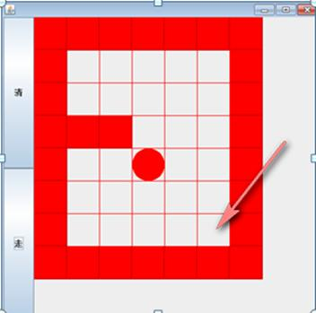

代码实现：

```java
public class MiGong {
    public static void main(String[] args) {
        //用二维数组创建一个迷宫
        int[][] map = new int[8][7];
        //1代表墙和挡板
        for (int i = 0; i < 7; i++){
            map[0][i] = 1;
            map[7][i] = 1;
        }
        for(int i = 0; i < 8; i++){
            map[i][0] = 1;
            map[i][6] = 1;
        }
        map[3][1] = 1;
        map[3][2] = 1;

        //调用获取路线方法
        setWay(map, 1, 1);
        //打印地图
        for(int i = 0; i < 8; i++){
            for(int j = 0; j < 7; j++){
                System.out.print(map[i][j]+"  ");
            }
            System.out.println();
        }

    }

    /**
     * 说明：0：没走过  1：墙或挡板  2：走过 3：走过但是是死路
     * @param map
     * @param i
     * @param j
     * @return
     */
    public static boolean setWay(int[][] map, int i, int j){
        if(map[6][5] == 2){ //通路已找到，结束方法
            return true;
        }
        if(map[i][j] == 0){ //该点没被走过
            map[i][j] = 2; //走该点
            if(setWay(map, i + 1, j)){ //判断向下走是否是通的
                return true;
            }else if(setWay(map, i, j + 1)){//判断向右走是否是通的
                return true;
            }else if(setWay(map, i - 1, j)){//判断向上走是否是通的
                return true;
            }else if(setWay(map, i, j-1)){//判断向左走是否是通的
                return true;
            }else{ //上下左右都不通，就是死路
                map[i][j] = 3;
                return false;
            }
        }else { //该点是墙或者走过
            return false;
        }
    }
}

```

#### 5.3递归-八皇后问题（回溯算法）

问题介绍：

​	*在8×8的国际象棋上摆放8个皇后，使其不能相互攻击，即：任意两个皇后不处于同一行、同一列或同一斜线上，总共有多少种摆法。（92种）*

问题示意图：

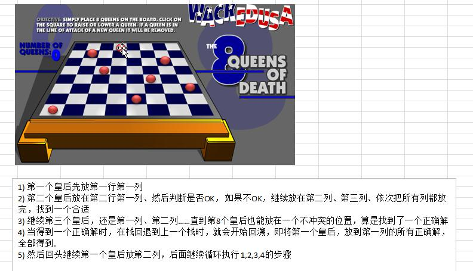

代码实现：

```java
public class Queue8 {
    int max = 8;    //定义一共8个皇后
    int[] arr = new int[max];   //定义数组，保存皇后放置位置的结果
    public static void main(String[] args) {
        Queue8 queue8 = new Queue8();
        queue8.check(0);
    }

    //放置第n个皇后
    public void check(int n){
        if(n == max){ //开始放置第九个皇后，结束
            print();
            return;
        }
        for(int i = 0; i < max; i++){
            arr[n] = i;
            if(judge(n)){   //满足条件后并没有终止循环，因此可以把所有的结果输出
                check(n + 1);
            }
        }

    }
    //判断摆放第n个皇后时是否跟前面所有的皇后冲突
    public boolean judge(int n) {
        for(int i = 0; i < n; i++){
            if(arr[i] == arr[n] || Math.abs(n - i) == Math.abs(arr[n] - arr[i])){
                return false;
            }
        }
        //和前面的所有皇后都没冲突就返回true
        return true;
    }

    public void print(){
        for(int i = 0; i < max; i++){
            System.out.print(arr[i]+" ");
        }
        System.out.println();
    }
}

```

### 6.排序算法

#### 6.1排序算法的介绍和分类

1. 定义：排序是将一组数组，以指定的顺序进行排列的过程。

2. 分类：

   1）内部排序：将需要处理的数据加载到内存中进行排序。

   2）外部排序：数据量过大，无法全部加载到内存中，需要借助外部存储（文件等）进行排序。

   3）常见的排序算法分类：

   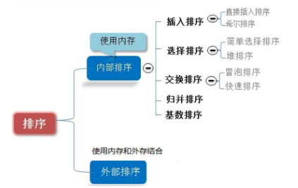

   

#### 6.2算法的时间复杂度

##### 6.2.1度量一个算法执行时间的两种方法

1）事后统计方法：

这种方法可行，但是有两个问题：一是想对算法的运行性能进行评测，需要实际运行该程序；二是所得时间的统计量依赖于计算机的硬件、软件等环境因素，这种方式要在同一台计算机相同的状态下运行，才能比较出哪个算法速度更快。

2）事前估算方法：

通过分析某个算法的时间复杂度来判断那个算法更优。

##### 6.2.2时间频度

* 基本介绍

  时间频度：一个算法花费的时间与算法中语句的执行次数成正比，哪个算法中语句执行次数多，它花费时间就越多。一个算法中语句执行次数称为时间频度。即为T（n）

  

* 举例说明-基本案例

  比如计算1-100所有数字之和，我们设计两种算法：

  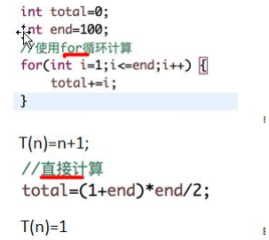

  * 计算时间频次时，随着n加大，可以忽略常数项、低次项、和高次项系数。

##### 6.2.3时间复杂度

```java
1.一般情况下，算法中的基本操作语句的执行次数是问题规模n的某个函数，用T（n）表示，若有某个辅助函数f(n),使得当n趋近于无穷大时，T(n)/f(n)的极限值为不等于零的常数，则称f(n)是T(n)的同数量级函数。记做T(n)=O(f(n)),称O(f(n))为算法的渐进时间复杂度，简称时间复杂度。
2.T(n)不同，但时间复杂度可能相同。如：T(n)=n2+7n+6和T(n)=3n2+2n+2他们的T(n)不同，但时间复杂度相同，都为O(n2)。
3.计算时间复杂度的方法：
	1）省去常数阶T(n)=n2+7n+6 => T(n)=n2+7n
	2)保留n的最高阶项 T(n)=n2+7n => T(n)=n2
	3)去除最高阶项的系数： T(n)=n2 => T(n)=n2
```

##### 6.3.4常见的时间复杂度

```
1.常数阶：O(1)
2.对数阶：O(log2n)
3.线性阶：O(n)
4.线性对数阶：O(nlog2n)
5.平方阶：O(n^2)
6.立方阶：O(n^3)
7.k次方阶：O(n^k)
8.指数阶：O(2^n)
```

常见时间复杂度对应图：

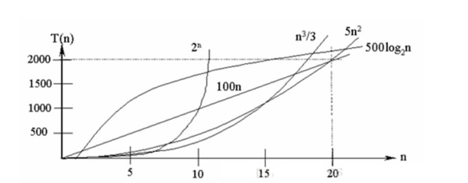

说明：

1）常见的算法时间复杂度有小到大依次为：O(1)<O(log2^n)<O(n)<O(nlog2^n)<O(n^2)<O(n^3)<O(n^k)<O(2^n)，随着问题规模n逐渐增大，上述时间复杂度不断增大，算法的执行效率越低。

2）从图中可知，我们应尽量避免使用指数阶算法。

##### 6.3.5常用排序算法的平均时间复杂度和最坏时间复杂度

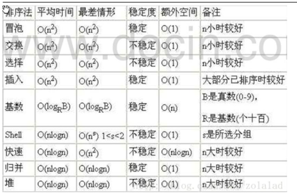

#### 6.3算法的空间复杂度简介

```java
1.类似于时间复杂度讨论，一个算法的空间复杂度定义为该算法所耗费的存储空间，他也是问题规模n的函数。
2.空间复杂度是对一个算法在运行过程中临时占用储存空间大小的度量。有的算法需要占用的临时工作单元数与解决问题的规模n有关，它随着n的增大而增大，当n较大时将占用较多的储存单元，例如快速排序的归并排序算法，基数排序算法就属于这种情况。
3.在做算法分析时，主要讨论的是时间复杂度。从用户使用体验上看，更看重的是程序执行速度。一些缓存产品（redis,memcache）和算法本质就是空间换时间。
```

#### 6.4冒泡排序

```java
1.冒泡排序的基本思想：通过对待排序序列从前向后，依次比较相邻元素的值，若发生逆序则交换，使值较大的元素逐渐从前移向后部，就像水底的气泡一样逐渐向上冒。
2.优化：因为排序过程中，各元素不断接近自己的位置，如果一趟比较下来没有元素进行交换就说明当前序列是有序的。因此要在排序过程中设置一个标志flag判断元素是否进行交换，从而减少不必要的比较。
3.冒泡排序的时间复杂度是O(n^2)
```

代码实现：

```java
public class BubbleSort {
    public static void main(String[] args) {
        int[] arr = {3, 9, -1, 10, 20};
        bubbleSort(arr);
        System.out.println(Arrays.toString(arr));
    }

    //冒泡排序算法
    public static int[] bubbleSort(int[] arr){
        int temp = 0; //临时变量
        boolean flag = false; //优化算法，如果某次循环没有发生位置交换，则证明数组已经有序，就退出循环
        for(int i = 0; i < arr.length - 1; i++) {
            for (int j = 0; j < arr.length - 1 - i; j++) {
                if (arr[j] > arr[j + 1]) {
                    flag = true;
                    temp = arr[j];
                    arr[j] = arr[j + 1];
                    arr[j + 1] = temp;
                }
            }
            if(!flag){
                break;
            }else{
                flag = false;
            }
        }
        return arr;
    }
}

```

#### 6.5选择排序

```
1.选择排序思想：
	第一次从arr[0]~arr[n-1]中选取最小值，与arr[0]交换，第二次从arr[1]~arr[n-1]中选取最小值，与arr[1]交换，第三次从arr[2]~arr[n-1]中选取最小值，与arr[2]交换，...，第i次从arr[i-1]~arr[n-1]中选取最小值与arr[i-1]交换，总共通过n-1次得到一个按排序码从小到达排序的有序序列。
```

代码实现：

```java
public class SelectSort {
    public static void main(String[] args) {
        int[] arr = {101, 34, 119, 1, -1, 90, 123};
        selectSort(arr);
        System.out.println(Arrays.toString(arr));
    }

    //选择排序算法
    public static int[] selectSort(int[] arr){
        int min = 0;
        int minIndex = 0;
        for(int i = 0; i < arr.length - 1; i++) {
            //假设当前元素时最小元素
            minIndex = i; 
            min = arr[i];
            for (int j = i + 1; j < arr.length; j++) {
                if (arr[j] < min) {
                    min = arr[j];
                    minIndex = j;
                }
            }
            //每一轮循环找到最小的元素和对应的角标，然后交换
            if(minIndex != i) {
                arr[minIndex] = arr[i];
                arr[i] = min;
            }
        }
        return arr;
    }
}

```

#### 6.6插入排序

##### 6.6.1插入排序算法介绍

```java
1.插入排序属于内部排序，是对于欲排序的元素以插入的方式寻找该元素的位置，以达到排序的目的。
2.插入排序法思想：把n个待排序的元素看成为一个有序表和一个无序表，开始时有序表中只包含一个元素，无序表中包含n-1个元素，排序过程中每次从无序表中取出第一个元素，把它的排序码依次与有序元素表中排序码进行比较，将它插入有序表中适当位置，使之成为新的有序表。
```

##### 6.6.2代码实现

```java
public class InsertSort {
    public static void main(String[] args) {
        int[] arr = {101, 34, 119, 1, -1, 89};
        insertSort(arr);
        System.out.println(Arrays.toString(arr));
    }

    //插入排序算法
    public static int[] insertSort(int[] arr){
        for(int i = 1; i < arr.length; i++) {
            int insertValue = arr[i];
            int insertIndex = i - 1;
            while (insertIndex >= 0 && insertValue < arr[insertIndex]) {
                //insertVlue与前一位交换
                arr[insertIndex + 1] = arr[insertIndex];
                arr[insertIndex] = insertValue;
                insertIndex--;
            }
        }
        return arr;
    }
}

```

#### 6.7希尔排序

##### 6.7.1插入排序存在的问题

```java
对于数组[2,3,4,5,6,1],当插入最小的数在最后时，要移动整个数组的元素，因而对效率有影响。
```

##### 6.7.2希尔排序法基本思想

```java
	希尔排序是把记录按下标的一定增量分组，对每组使用直接插入排序算法排序；随着增量逐渐减小，每组包含的关键词越来越多，当增量减至1时，整个文件恰被分成一组，算法便终止；
```

##### 6.7.3希尔排序法示意图：

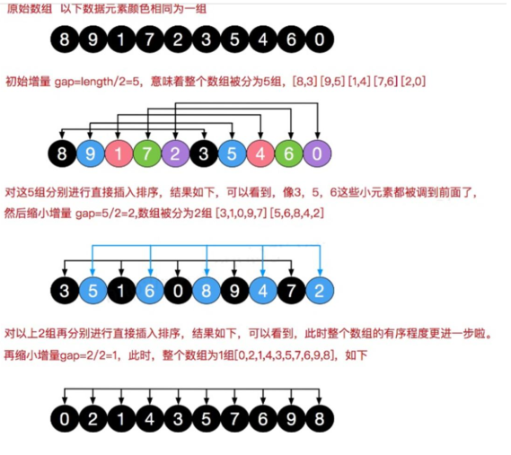

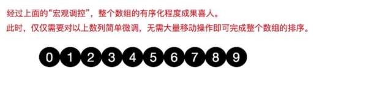

##### 6.7.4希尔排序法代码实现

```java
public class ShellSort {
    public static void main(String[] args) {
        int[] arr = {8, 9, 1, 7, 2, 3, 5, 4, 6, 0};
        shellSort(arr);
        System.out.println(Arrays.toString(arr));
    }

    //希尔排序算法（交换法）
    public static int[] shellSort(int[] arr) {
        int temp = 0;
        for(int gap = arr.length/2; gap > 0; gap /= 2) {
            for (int i = gap; i < arr.length; i++) {
                for (int j = i - gap; j >= 0; j -= gap) {
                    if (arr[j] > arr[j + gap]) {
                        temp = arr[j];
                        arr[j] = arr[j + gap];
                        arr[j + gap] = temp;
                    }
                }
            }
        }
        return arr;
    }
    
    //说明：交换法比插入排序效率慢的多，因此使用希尔排序的移位法，效率要比插入排序快很多
    //希尔排序（移位法）
    public static int[] shellSort2(int[] arr) {
        for (int gap = arr.length / 2; gap > 0; gap /= 2) {
            //从第gap个起，逐个对其所在的组直接进行插入排序
            for (int i = gap; i < arr.length; i++) {
                int j = i;
                int temp = arr[j];
                if (arr[j] < arr[j - gap]) {
                    while (j - gap >= 0 && temp < arr[j - gap]) {
                        arr[j] = arr[j - gap];
                        j -= gap;
                    }
                    //当退出循环时，就给temp找到了插入位置
                    arr[j] = temp;
                }
            }
        }
        return arr;
    }
}

```

#### 6.8快速排序

##### 6.8.1快速排序介绍

```java
	快速排序是对冒泡排序的一种改进。基本思想是：通过一趟排序将要排序的数据分割成独立的两部分，其中一部分的所有数据都比另外一部分的所有数据要小，然后再按此方法对这两部分数据分别进行快速排序，整个排序过程可以递归进行，以此达到整个数据变成有序序列。
	注意：测试发现 快速排序比 希尔排序效率要高；
```

##### 6.8.2代码实现：

```java
public class QuickSort {
    public static void main(String[] args) {
        int[] arr = {0,1,2,7,8,3,12};
        quickSort(arr, 0, arr.length-1);
        System.out.println(Arrays.toString(arr));
    }

    //快速排序算法
    public static int[] quickSort(int[] arr, int left, int right){
        int l = left;
        int r = right;
        int pivot = arr[(left + right) / 2];
        int temp = 0;
        while(l < r){
            //左边向右一直找直到找到比中值大的，退出
            while(arr[l] < pivot){
                l++;
            }
            //右边一直找直到找到比中值小的，退出
            while(arr[r] > pivot){
                r--;
            }
            //l>=r说明pivot两边的值已经全部按照左边的小，右边的大分好组
            if(l >= r){
                break;
            }
            //交换
            temp = arr[l];
            arr[l] = arr[r];
            arr[r] = temp;

            if(arr[l] == pivot){
                r--;
            }
            if(arr[r] == pivot){
                l++;
            }
        }
        if(l == r){
            l++;
            r--;
        }

        //向左递归
        if(left < r){
            quickSort(arr, left, r);
        }
        //向右递归
        if(right > l){
            quickSort(arr, l, right);
        }
        return arr;
    }
}

```

#### 6.9归并排序

##### 6.9.1归并排序介绍

```java
	归并排序是利用归并的思想实现的排序方法，该算法采用经典的分治策略（分治法将问题分成一些小的问题然后递归求解，而治的阶段将分的阶段得到的答案修补在一起，即分而治之）。
```

归并排序示意图：

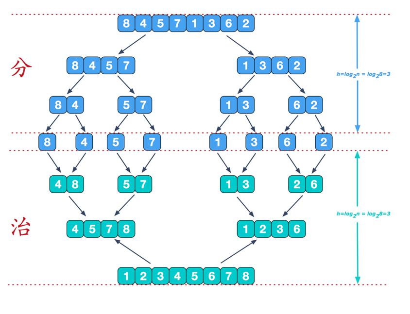

##### 6.9.2代码演示

```java
public class MergetSort {
    public static void main(String[] args) {
        int[] arr = {9, 5, 3, 1, 2, 4, 7, 6};
        int[] temp = new int[arr.length];
        mergeSort(arr, 0, arr.length - 1, temp);
        System.out.println(Arrays.toString(arr));
    }


    public static void mergeSort(int[] arr, int left, int right, int[] temp) {
        if (left < right) {
            int mid = (left + right) / 2;
            mergeSort(arr, left, mid, temp); //向左递归分解
            mergeSort(arr, mid + 1, right, temp); //向右递归分解
            merge(arr, left, mid, right, temp);
        }
    }

    public static void merge(int[] arr, int left, int mid, int right, int[] temp) {
        int i = left;
        int j = mid + 1;
        int t = 0;

        //先把左右两边(有序)数据按照规则填充到temp中
        while (i <= mid && j <= right) {
            if (arr[i] <= arr[j]) {
                temp[t++] = arr[i++];
            } else {
                temp[t++] = arr[j++];
            }
        }
        //把剩余的依次填充进temp
        while (i <= mid) {
            temp[t++] = arr[i++];
        }
        while (j <= right) {
            temp[t++] = arr[j++];
        }

        //把temp数组元素拷贝到arr,此时对于局部arr来说是有序的
        t = 0; //temp从下标为0开始
        int tempLeft = left;
        while (tempLeft <= right) {
            arr[tempLeft++] = temp[t++];
        }
    }
}
```

#### 6.10基数排序

##### 6.10.1基数排序（桶排序）介绍

```java
1.将所有比较数值统一为同样的数位长度，数位较短的数前面补0.然后从最低位开始，依次进行一次排序，这样从低位到高位排序完成后，数列就变成了有序序列。
2.基数排序法属于稳定性排序，基数排序法是高效的稳定性排序法。
```

##### 6.10.2代码演示

```java
public class RedixSort {
    public static void main(String[] args) {
        int[] arr = {53, 3, 542, 748, 14, 214};
        redixSort(arr);
        System.out.println("排序后的结果：" + Arrays.toString(arr));
    }

    public static void redixSort(int[] arr){
        int[][] bucket = new int[10][arr.length]; //定义十个桶
        int[] buketElementCounts = new int[10]; //每个桶中装入元素个数

        //得到数组里最大数的位数，就是要循环放入桶中和取出的次数
        int max = arr[0];
        for(int i = 1; i < arr.length; i++){
            if(arr[i] > max){
                max = arr[i];
            }
        }
        int maxLength = (max + "").length();

        //j代表循环次数，n：每次循环位数arr[i] / n % 10
        for(int k = 0, n = 1; k < maxLength; k++, n *= 10){
            //将arr元素依次放入桶中
            for(int i = 0; i < arr.length; i++){
                int digitOfElement = arr[i] / n % 10;   //计算出arr[i]的个位数，
                bucket[digitOfElement][buketElementCounts[digitOfElement]] = arr[i];
                buketElementCounts[digitOfElement]++;
            }
            //从桶中取出元素依次放入arr中
            int a = 0;
            for(int i = 0; i<buketElementCounts.length; i++){
                if(buketElementCounts[i] != 0){
                    for(int j = 0; j < buketElementCounts[i]; j++){
                        arr[a++] = bucket[i][j];
                    }
                }
                //每次取完后，将buketElementCounts[i]置零
                buketElementCounts[i] = 0;
            }
        }
    }
}

```

##### 6.10.3基数排序的说明

```java
1.基数排序是对传统桶排序的扩展，速度很快。
2.基数排序是经典的空间换时间的方式，占用内存很大，当对海量数据排序时，容易造成OutOfMemoryError.
3.基数排序是稳定性排序。（稳定性指：数组中两个值相同的元素，靠前的那个排序完成后还是靠前的）
4.有负数的数组，我们不用基数排序。
```

#### 6.11常用排序算法总结和对比

##### 6.11.1一张排序算法对比图

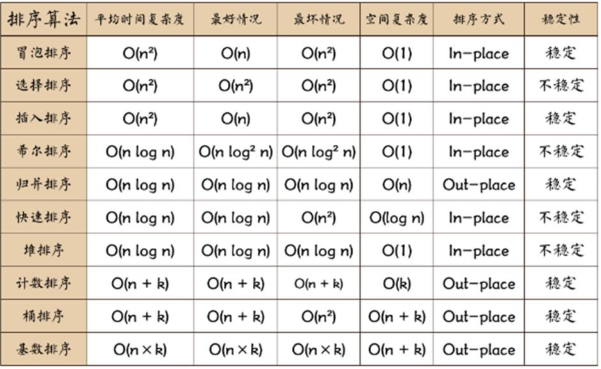

相关术语解释：

```
1.稳定：如果a原本在b前面，而a=b，排序后a仍然在b前面；
2.不稳定：如上，排序完后，a可能会在b后面；
3.内排序：所有排序操作都在内存中完成；
4.外排序：由于数据太大，因此把数据放在磁盘中，而排序通过磁盘和内存的数据传输才能进行；
5.时间复杂度：一个算法执行所消耗的时间；
6.空间复杂度：运行完一个程序所需内存大小；
7.n:数据规模；
8.k:桶的个数；
9.in-place:不占额外内存；
10：out-place:占用额外内存；
```

### 7.查找算法

#### 7.1查找算法介绍

```
在java中，我们常用的查找有四种：
1）顺序（线性）查找；
2）二分查找/折半查找；
3）插值查找；
4）裴波那契查找；
```

#### 7.2线性查找算法

```java
public class SeqSearch {
    public static void main(String[] args) {
        int[] arr = {1, 9, 11, -1, 34, 89};
        int i = seqSearch(arr, -1);
        System.out.println("找到值的下标为：" + i);
    }

    //线性查找算法，找到就返回下标，没有就返回-1
    public static int seqSearch(int[] arr, int value){
        for(int i = 0; i < arr.length; i++){
            if(arr[i] == value){
                return i;
            }
        }
        return -1;
    }
}

```

#### 7.3二分查找

返回一个下标

```java
//注意：使用二分查找的前提是  该数组是有序的
public class BinarySearch {
    public static void main(String[] args) {
        int[] arr = {1, 8 ,10, 89, 123, 586, 896, 1023};
        int i = binarySearch(arr, 0, arr.length, 86);
        System.out.println("找到下标为：" + i);
    }


    /**
     *  //二分查找算法，查找到返回下标，找不到返回-1
     * @param arr 要查找到额数组
     * @param left 左边的索引
     * @param right 右边的索引
     * @param value 要查找的值
     * @return 找到的值的下标，没有找到返回-1
     */
    public static int binarySearch(int[] arr, int left, int right, int value){
        if(left > right){//查找完后仍然没有找到
            return -1;
        }
        //数组中间角标
        int mid = (left + right) / 2;
        //中间值
        int midValue = arr[mid];
        if(value < midValue){ //向左递归
            mid = binarySearch(arr, left, mid - 1, value);
        }else if(value > midValue){//向右递归
            mid = binarySearch(arr, mid + 1, right, value);
        }
        return mid;
    }
}

```

返回找到的所有的下标

```java
public class BinarySearch {
    public static void main(String[] args) {
        int[] arr = {1, 8 ,10, 89, 123, 586, 586, 586, 896, 1023};
        List<Integer> list = binarySearchAll(arr, 0, arr.length, 586);
        System.out.println("找到下标为：" + list);
    }

    /**
     * 问题：如果查找的值在数组中有多个，返回多个下标值
     * 解决：找到mid值之后不要立马返回，由于是有序数组，可以向前和向后遍历找到相同的值角标放入集合中返回
     * @param arr
     * @param left
     * @param right
     * @param value
     * @return 找到的值的下标集合，没有找到返回空集合
     */
    public static List<Integer> binarySearchAll(int[] arr, int left, int right, int value){
        if(left > right){//查找完后仍然没有找到
            return new ArrayList<Integer>();
        }
        //数组中间角标
        int mid = (left + right) / 2;
        //中间值
        int midValue = arr[mid];
        if(value < midValue){ //向左递归
            mid = binarySearch(arr, left, mid - 1, value);
        }else if(value > midValue){//向右递归
            mid = binarySearch(arr, mid + 1, right, value);
        }

        //向前和向后遍历看有没有相同的值
        ArrayList<Integer> indexs = new ArrayList<>();
        //向左遍历
        int temp = mid - 1;
        while (true){
            if(temp < 0 || arr[temp] != value){
                break;
            }
            indexs.add(temp);
            temp--;
        }
        indexs.add(mid);
        //向右遍历
        temp = mid + 1;
        while(true){
            if(temp > arr.length - 1 || arr[temp] != value){
                break;
            }
            indexs.add(temp);
            temp++;
        }
        return indexs;
    }
}

```

#### 7.4插值查找

##### 7.4.1插值查找算法介绍

```java
1.插值查找原理：插值查找类似于二分查找，不同的是插值查找每次从自适应mid处开始查找；
2.将折半查找中的求mid索引的公式改变如下：
	折半查找mid = (left + right) / 2
    插值查找mid = left + (right - left) * (value - arr[left]) / (arr[right] - arr[left])
3.这种自适应mid公式能很快定位到要找的值value，其余算法和二分查找一样；
```

##### 7.4.2插值查找算法注意事项

```
1.对于数据量较大，关键字分布比较均匀的查找来说，采用插值查找，速度较快；
2.关键字分布不均匀的情况下，该方法不一定比折半查找要好；
```

##### 7.4.3代码实现

```java
public class InsertValueSearch {
    public static void main(String[] args) {
        int[] arr = {1, 8 ,10, 89, 123, 586, 586, 586, 896, 1023};
        int i = insertValueSearch(arr, 0, arr.length - 1, 1);
        System.out.println("找到角标为" + i);
    }

    public static int insertValueSearch(int[] arr, int left, int right, int value){
        //注意：value < arr[0] || value > arr[arr.length - 1] 必须加上，否则可能引起角标越界
        if(left > right || value < arr[0] || value > arr[arr.length - 1]){
            return -1;
        }
        //插值查找自适应中间角标公式
        int mid = left + (right - left) * (value - arr[left]) / (arr[right] - arr[left]);
        int midValue = arr[mid];
        if(value < midValue){
            mid = insertValueSearch(arr, left, mid - 1, value);
        }else if(value > midValue){
            mid = insertValueSearch(arr, mid + 1, right, value);
        }
        return mid;
    }
}

```

#### 7.5斐波那契（黄金分割法）查找算法

##### 7.5.1斐波那契查找算法原理

```java 
	斐波那契查找原理与前两种类似，仅仅改变了中间节点（mid）的位置，mid不再是中间值或插值得到，而是位于黄金分割点附近，即mid=low+F(k-1)-1(F代表斐波那契数列)；
	
	对F（k-1）-1的理解：
	1）由斐波那契数列F[k] = F[k-1] + F[k-2]的性质，可以得到(F[k] - 1) = (F[k-1] - 1) + (F[k-2] - 1)+1。该式说明只要顺序表的长度为F[k]-1,则可以将该表分为长度为F[k-1]-1和F[k-2]-1的两段，从而中间位置为mid=low + F[k-1]-1
    2)类似的每一子段也可以用相同的方式分割；
    3）但顺序表长度n不一定刚好等于F[k]-1,所以需要将原来顺序长度n增加至F[k]-1,这里的k值只要能使得F[k]-1恰好大于或等于n即可，由以下代码得到，顺序表长度增加后，新增的位置（从n+1到F[k]-1位置），都都赋为n位置的值即可。
    	while(n>fib(k)-1)
    		k++;

//具体算法代码详见学习资料
```

### 8.哈希表

#### 8.1哈希表的基本介绍

```java
	散列表（Hash table,也叫哈希表），是根据关键码值而直接进行访问的数据结构。也就是说，它通过把关键码值映射到表中一个位置来访问记录，以加快查找速度。这个映射函数叫做散列函数，存放记录的数据叫做散列表。
```

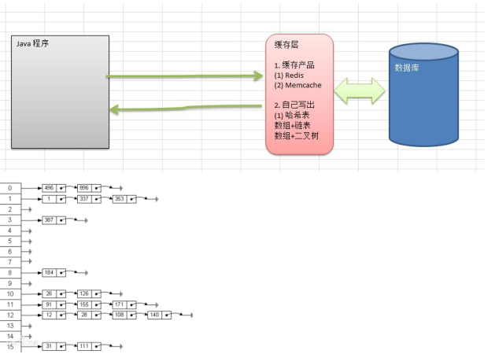

#### 8.2实际应用（谷歌上机题）

```
	有一个公司，当有新员工来报道时，要求将该员工的信息加入（id,name...）,当输入该员工的id时，要求查找到该员工的所有信息。
	要求：
	1）不使用数据库，速度越快越好=>哈希表（散列）
	2）添加时，保证按照id从低到高插入；
	3）使用链表来实现哈希表，该链表不带头[即链表的第一个节点就存放雇员信息]
```

代码实现：

```java
public class HashTableDemo {
    public static void main(String[] args) {
        HashTable hashTable = new HashTable(7);
        Scanner scanner = new Scanner(System.in);
        String key = "";
        while(true){
            System.out.println("add:添加");
            System.out.println("list:显示");
            System.out.println("find:查找");
            System.out.println("exit:退出");
            key = scanner.next();
            switch (key){
                case "add":
                    System.out.println("输入id");
                    int id = scanner.nextInt();
                    System.out.println("输入name");
                    String name = scanner.next();
                    Employer employer = new Employer(id, name);
                    hashTable.add(employer);
                    break;
                case "list":
                    hashTable.list();
                    break;
                case "find":
                    System.out.println("请输入id");
                    int i = scanner.nextInt();
                    hashTable.find(i);
                    break;
                case "exit":
                    System.out.println("程序已退出");
                    scanner.close();
                    System.exit(0);
                default:
                    break;
            }
        }
    }
}

/**
 * 创建hashtable管理多条链表
 */
class HashTable{
    private int size;
    private EmployerLinkedList[] employerLinkedListArray;

    /**
     * 构造函数
     * @param size
     */
    public HashTable(int size){
        this.size = size;
        employerLinkedListArray = new EmployerLinkedList[size];
        //注意：此时只是初始化了一个数组，数组里面每个链表也要初始化
        for(int i = 0; i < size; i++){
            employerLinkedListArray[i] = new EmployerLinkedList();
        }
    }

    /**
     * 添加雇员
     * @param employer
     */
    public void add(Employer employer){
        int i = hashFun(employer.getId());
        employerLinkedListArray[i].add(employer);
    }

    /**
     * 遍历
     */
    public void list(){
        for(int i = 0; i < size; i++){
            employerLinkedListArray[i].list(i);
        }
    }

    /**
     * 根据id找到雇员
     * @param id
     * @return
     */
    public void find(int id){
        int i = hashFun(id); //在数组下标为i的链表中找
        Employer emp = employerLinkedListArray[i].findEmp(id);
        if(emp != null){
            System.out.printf("在第%d条链表中找到雇员 id=%d\n", (i+1), id);
        }else{
            System.out.println("在哈希表中没有找到该雇员~");
        }
    }

    /**
     * 编写一个散列函数，根据id算出放到哪个链表
     * @param id
     * @return
     */
    public int hashFun(int id){
        return id % size;
    }
}

/**
 * 链表
 */
class EmployerLinkedList{
    private Employer head; //头节点

    /**
     * 添加节点
     * @param employer
     */
    public void add(Employer employer){
        if(head == null){ //添加第一个节点
            head = employer;
        }else{ //不是第一个节点,遍历添加到链表最后
            Employer temp = head;
            while(true){
                if(temp.getNext() == null){
                    temp.setNext(employer);
                    break;
                }
                temp = temp.getNext();
            }
        }
    }

    /**
     * 遍历链表
     * @param no
     */
    public void list(int no){
        if(head == null){
            System.out.println("第" + (no + 1) + "条链表是空的~");
            return;
        }
        System.out.print("第" + (no + 1) + "条链表的信息是");
        Employer temp = head; // 辅助指针
        while (true){
            if(temp != null){
                System.out.print("  ==>id=" + temp.getId() + ",name=" + temp.getName());
            }else {
                break;
            }
            temp = temp.getNext();
        }
        System.out.println();
    }

    /**
     * 查找雇员,如果查找到返回employer，没有查找到返回null
     * @param id
     * @return
     */
    public Employer findEmp(int id){
        //判断链表是否为空
        if(head == null){
            System.out.println("链表为空~");
            return null;
        }
        Employer temp = head;
        while (true){
            if(temp == null){ //遍历到最后没有找到
                break;
            }
            if(temp.getId() == id){ //找到了
                break;
            }
            temp = temp.getNext();
        }
        return temp;
    }
}

/**
 * 雇员类
 */
class Employer{
    private int id;
    private String name;
    private Employer next;
    public Employer(int id, String name){
        this.id = id;
        this.name = name;
    }

    public int getId() {
        return id;
    }

    public void setId(int id) {
        this.id = id;
    }

    public String getName() {
        return name;
    }

    public void setName(String name) {
        this.name = name;
    }

    public Employer getNext() {
        return next;
    }

    public void setNext(Employer next) {
        this.next = next;
    }
}


```

### 9.树结构的基础部分

#### 9.1二叉树

##### 9.1.1为什么需要数这种数据结构

```java
1.数组储存方式的分析：
	优点：通过下标方式访问元素，速度快。对于有序数组，还可以使用二分查找提高检索速度。
	缺点：如果要检索具体某个值，或者插入值（按一定顺序）会整体移动，效率较低。
	补充：ArrayList底层使用的就是数组，构造方法初始化一个空数组，当添加元素时首先判断是否需要扩容，如果需要，就会扩充1.5倍。
2.链式储存方式分析：
	优点：在一定程度上对数组储存方式有优化（比如：插入一个数值节点，只需要将插入节点，连接到链表中即可，删除效率也很好）。
	缺点：在进行检索时效率仍然较低，比如 检索某个值需要从头节点开始遍历。
3.树储存方式分析：
	能提高数据储存，读取的效率，比如利用二叉排序树（Binary Sort Tree）,既可以保证数据的检索速度，同时也可以保证数据的插入，删除，修改的速度。   如下图所示：
```

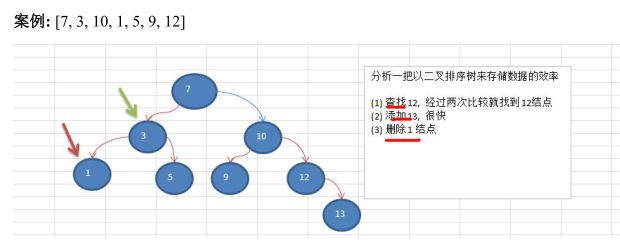

##### 9.1.2树示意图

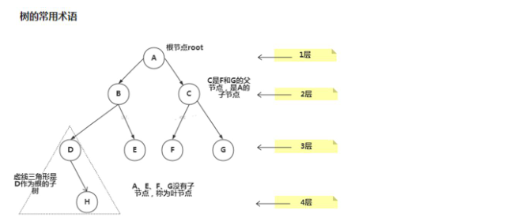

```java
树的常用术语（结合示意图理解）：
1.节点
2.根节点
3.父节点
4.子节点
5.叶子节点（没有子节点的节点）
6.节点的权（节点值）
7.路径（从root节点找到该节点的路线）
8.层
9.子树
10.数的高度（最大层数）
11.森林：多棵子树构成森林
```

##### 9.1.3二叉树的概念

1）树有很多种，每个节点最多只能有两个子节点的一种形式称为二叉树。

2）二叉树的子节点分为左节点和右节点

3）示意图：

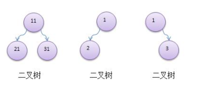

4）如果该二叉树的所有叶子节点都在最后一层，并且节点总数=2^n-1,n为层数，则我们称为满二叉树；

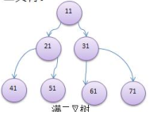

5）如果该二叉树的所有叶子节点都在最后一层或者倒数第二层，而且最后一层的叶子节点在左边连续，倒数第二层的叶子节点在右边连续，我们称为完全二叉树

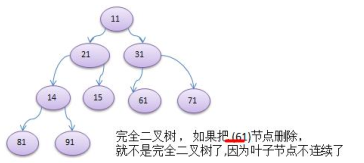

##### 9.1.4二叉树遍历说明

```java
1.前序遍历：先输出父节点，再遍历左子树和右子树
2.中序遍历：先遍历左子树，再输出父节点，再遍历右子树；
3.后序遍历：先遍历左子树，再遍历右子树，再输出父节点；
4.小结：看输出父节点的顺序，就确定是前序、中序还是后序；
```

##### 9.1.5二叉树遍历实例

```java
//说明：类似于链表节点，，但是遍历的方法是在每个节点中写的，前序中序后序是针对于父节点的输出顺序

public class BinaryTreeDemo {
    public static void main(String[] args) {
        //创建需要的节点
        HeroNode root = new HeroNode(1, "宋江");
        HeroNode node2 = new HeroNode(2, "吴用");
        HeroNode node3 = new HeroNode(3, "卢俊义");
        HeroNode node4 = new HeroNode(4, "林冲");
        HeroNode node5 = new HeroNode(5, "关胜");
        //说明：手动创建二叉树，后面学习如何用递归创建二叉树
        root.setLeft(node2);
        root.setRight(node3);
        node3.setRight(node4);
        node3.setLeft(node5);
        //创建一颗二叉树
        BinaryTree binaryTree = new BinaryTree(root);

        //测试
        System.out.println("前序遍历");
        binaryTree.preOrder();  //1,2,3,5,4

        //中序遍历
        System.out.println("中序遍历");
        binaryTree.infixOrder(); //2,1,5,3,4

        //后序遍历
        System.out.println("后序遍历");
        binaryTree.postOrder(); //25431
    }
}

class BinaryTree{
    private HeroNode root;
    public BinaryTree(HeroNode root){
        this.root = root;
    }

    //前序遍历
    public void preOrder(){
        if(root != null){
            root.preOrder();
        }else{
            System.out.println("二叉树为空，无法遍历");
        }
    }

    //中序遍历
    public void infixOrder(){
        if(root != null){
            root.infixOrder();
        }else{
            System.out.println("二叉树为空，无法遍历");
        }
    }

    //后序遍历
    public void postOrder(){
        if(root != null){
            root.postOrder();
        }else{
            System.out.println("二叉树为空，无法遍历");
        }
    }
}

/**
 * 节点类
 */
class HeroNode{
    private int no;
    private String name;
    private HeroNode left; //默认null
    private HeroNode right; //默认null
    public HeroNode(int no, String name){
        this.no = no;
        this.name = name;
    }

    public int getNo() {
        return no;
    }

    public void setNo(int no) {
        this.no = no;
    }

    public String getName() {
        return name;
    }

    public void setName(String name) {
        this.name = name;
    }

    public HeroNode getLeft() {
        return left;
    }

    public void setLeft(HeroNode left) {
        this.left = left;
    }

    public HeroNode getRight() {
        return right;
    }

    public void setRight(HeroNode right) {
        this.right = right;
    }

    @Override
    public String toString() {
        return "HeroNode{" +
                "no=" + no +
                ", name='" + name + '\'' +
                '}';
    }

    //编写前序遍历的方法
    public void preOrder(){
        System.out.println(this); //先输出父节点
        //递归向左子树前序遍历
        if (this.left != null){
            this.left.preOrder();
        }
        //递归向右子树前序遍历
        if(this.right != null){
            this.right.preOrder();
        }
    }


    //中序遍历
    public void infixOrder(){
        //递归向左子树中序遍历
        if(this.left != null){
            this.left.infixOrder();
        }
        //输出父节点
        System.out.println(this);
        //递归向右子树中序遍历
        if(this.right != null){
            this.right.infixOrder();
        }
    }

    //后序遍历
    public void postOrder(){
        //递归向左子树后序遍历
        if(this.left != null){
            this.left.postOrder();
        }
        //递归向右子树后序遍历
        if(this.right != null){
            this.right.postOrder();
        }
        //输出父节点
        System.out.println(this);
    }
}

```

##### 9.1.6二叉树查找指定节点

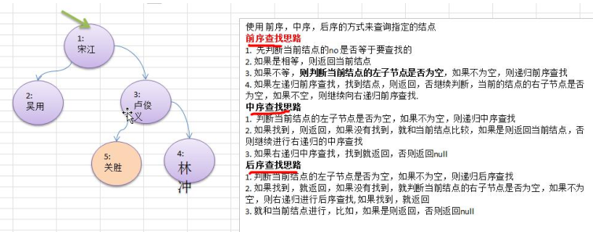

代码实现：

```java
package com.fy.tree;

/**
 * @program: algorithm->BinaryTreeDemo
 * @description: 二叉树遍历（前序、中序、后序）
 * @author: fangyan
 * @create: 2020-03-26 22:32
 **/
public class BinaryTreeDemo {
    public static void main(String[] args) {
        //创建需要的节点
        HeroNode root = new HeroNode(1, "宋江");
        HeroNode node2 = new HeroNode(2, "吴用");
        HeroNode node3 = new HeroNode(3, "卢俊义");
        HeroNode node4 = new HeroNode(4, "林冲");
        HeroNode node5 = new HeroNode(5, "关胜");
        //说明：手动创建二叉树，后面学习如何用递归创建二叉树
        root.setLeft(node2);
        root.setRight(node3);
        node3.setLeft(node4);
        node3.setRight(node5);
        //创建一颗二叉树
        BinaryTree binaryTree = new BinaryTree(root);
        //前序查找
        System.out.println("前序查找~");
        HeroNode resNode = binaryTree.preOrderSearch(2);
        if(resNode != null){
            System.out.printf("找到了信息为no=%d,name=%s \n", resNode.getNo(), resNode.getName());
        }else{
            System.out.println("没有找到节点为4的");
        }
        //中序、后序 略。。。
    }
}

class BinaryTree{
    private HeroNode root;
    public BinaryTree(HeroNode root){
        this.root = root;
    }

    //前序查找
    public HeroNode preOrderSearch(int no){
        if(root != null){
            return root.preOrderSearch(no);
        }else{
            return null;
        }
    }

    //中序查找
    public HeroNode infixOrderSearch(int no){
        if(root != null){
            return root.infixOrderSearch(no);
        }else{
            return null;
        }
    }

    //后序查找
    public HeroNode postOrderSearch(int no){
        if(root != null){
            return root.postOrderSearch(no);
        }else{
            return null;
        }
    }
}

/**
 * 节点类
 */
class HeroNode{
    private int no;
    private String name;
    private HeroNode left; //默认null
    private HeroNode right; //默认null
    public HeroNode(int no, String name){
        this.no = no;
        this.name = name;
    }

    public int getNo() {
        return no;
    }

    public void setNo(int no) {
        this.no = no;
    }

    public String getName() {
        return name;
    }

    public void setName(String name) {
        this.name = name;
    }

    public HeroNode getLeft() {
        return left;
    }

    public void setLeft(HeroNode left) {
        this.left = left;
    }

    public HeroNode getRight() {
        return right;
    }

    public void setRight(HeroNode right) {
        this.right = right;
    }

    @Override
    public String toString() {
        return "HeroNode{" +
                "no=" + no +
                ", name='" + name + '\'' +
                '}';
    }
    /**
     * 前序、中序、后序  查找
     * @param no
     * @return
     */
    //前序查找
    public HeroNode preOrderSearch(int no){
        //比较当前节点是不是
        if(this.no == no){
            return this;
        }
        //判断当前节点的左子节点是否为空，不为空就遍历查找
        HeroNode resNode = null;
        if(this.left != null){
            resNode = this.left.preOrderSearch(no);
        }
        if(resNode != null) { //说明在左子树上找到了，直接返回
            return resNode;
        }
        //判断当前节点的右子节点是否为空，不为空就遍历查找
        if(this.right != null){
            resNode = this.right.preOrderSearch(no);
        }
        return resNode;
    }

    //中序查找
    public HeroNode infixOrderSearch(int no){
        //左子节点查找
        HeroNode resNode = null;
        if(this.left != null){
            resNode = this.left.infixOrderSearch(no);
        }
        if(resNode != null){ //左子节点找到，直接返回
            return resNode;
        }
        //判断当前节点是否满足
        if (this.no == no){
            return this;
        }
        //右子节点查找
        if(this.right != null){
            resNode = this.right.infixOrderSearch(no);
        }
        return resNode; //最后的右子树查找，找到找不到都要返回
    }

    //后序查找
    public HeroNode postOrderSearch(int no){
        HeroNode resNode = null;
        //判断左子树
        if(this.left != null){
            resNode = this.left.postOrderSearch(no);
        }
        if(resNode != null){
            return resNode;
        }
        //右子树查找
        if(this.right != null){
            resNode = this.right.postOrderSearch(no);
        }
        if(resNode != null){
            return  resNode;
        }
        //判断当前节点是否满足
        if(this.no == no){
            return this;
        }
        return resNode;
    }
}

```

##### 9.1.7二叉树删除指定节点

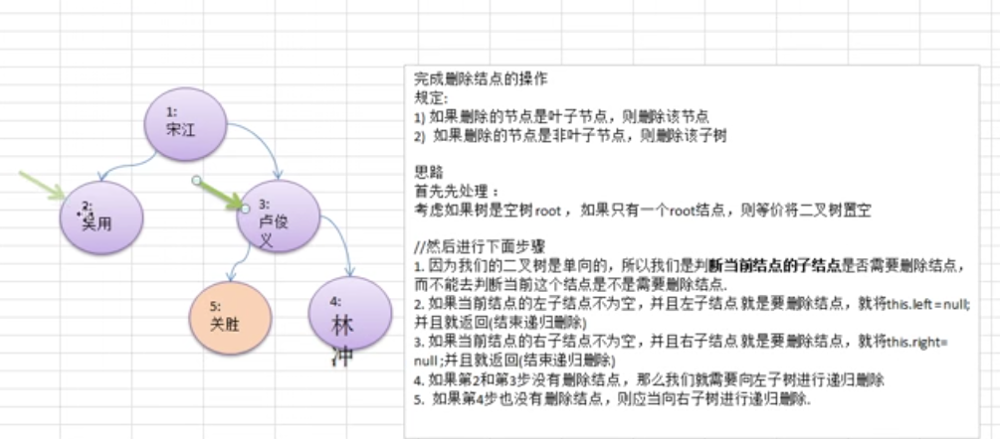

```java
public class BinaryTreeDemo {
    public static void main(String[] args) {
        //创建需要的节点
        HeroNode root = new HeroNode(1, "宋江");
        HeroNode node2 = new HeroNode(2, "吴用");
        HeroNode node3 = new HeroNode(3, "卢俊义");
        HeroNode node4 = new HeroNode(4, "林冲");
        HeroNode node5 = new HeroNode(5, "关胜");
        //说明：手动创建二叉树，后面学习如何用递归创建二叉树
        root.setLeft(node2);
        root.setRight(node3);
        node3.setLeft(node4);
        node3.setRight(node5);
        //创建一颗二叉树
        BinaryTree binaryTree = new BinaryTree(root);
        //删除指定节点
        System.out.println("删除前的二叉树");
        binaryTree.preOrder();
        binaryTree.delNode(3);
        System.out.println("删除后的二叉树");
        binaryTree.preOrder();
    }
}

class BinaryTree{
    private HeroNode root;
    public BinaryTree(HeroNode root){
        this.root = root;
    }

    //前序遍历
    public void preOrder(){
        if(root != null){
            root.preOrder();
        }else{
            System.out.println("二叉树为空，无法遍历");
        }
    }
    
    //删除指定节点
    public void delNode(int no) {
        if (root != null) {
            if (root.getNo() == no) {
                root = null;
            } else {
                root.delNode(no);
            }
        } else {
            System.out.println("空树，无法删除");
        }
    }
}

/**
 * 节点类
 */
class HeroNode{
    private int no;
    private String name;
    private HeroNode left; //默认null
    private HeroNode right; //默认null
    public HeroNode(int no, String name){
        this.no = no;
        this.name = name;
    }

   //getter & setter & tostring ...

    //编写前序遍历的方法
    public void preOrder(){
        System.out.println(this); //先输出父节点
        //递归向左子树前序遍历
        if (this.left != null){
            this.left.preOrder();
        }
        //递归向右子树前序遍历
        if(this.right != null){
            this.right.preOrder();
        }
    }

    //删除指定节点
    public void delNode(int no) {
        //判断左子树是否为待删除节点
        if (this.left != null && this.left.no == no) {
            this.left = null;
            return;
        }
        //判断右子树是否为待删除节点
        if (this.right != null && this.right.no == no) {
            this.right = null;
            return;
        }
        //递归左子树
        if (this.left != null) {
            this.left.delNode(no);
        }
        //递归右子树
        if (this.right != null) {
            this.right.delNode(no);
        }
    }
}

```

#### 9.2顺序存储二叉树

##### 9.2.1特点


```java
顺序存储二叉树的特点：
1）顺序二叉树通常只考虑完全二叉树；
2）第n个元素的左子节点为 2*n+1
3）第n个元素的右子节点为 2*n+2
4）第n个元素的父节点为 (n-1)/2
5）n:表示二叉树中第几个元素，按0开始编号，如上图所示：
```

##### 9.2.2代码实现

```java
public class ArrayBinaryTreeDemo {
    public static void main(String[] args) {
        int[] arr = {1, 2, 3, 4, 5, 6, 7};
        ArrayBinaryTree arrayBinaryTree = new ArrayBinaryTree(arr);
        arrayBinaryTree.preOrder(); //1 2 4 5 3 6 7
    }
}

class ArrayBinaryTree{
    private int[] arr;
    public ArrayBinaryTree(int[] arr) {
        this.arr = arr;
    }

    //方法重载，默认从根节点开始遍历
    public void preOrder() {
        preOrder(0);
    }
    //前序遍历
    public void preOrder(int index) {
        if (arr == null || arr.length == 0) {
            System.out.println("数组为空，不能按照二叉树进行遍历");
        }
        //输出当前节点
        System.out.println(arr[index]);
        //向左递归
        if ((index * 2 + 1) < arr.length) {
            preOrder(index * 2 + 1);
        }
        //向右递归
        if ((index * 2 + 2) < arr.length) {
            preOrder(index * 2 + 2);
        }
    }
}

```

#### 9.3线索化二叉树

##### 9.3.1线索化二叉树（ThreadedBinaryTree）介绍

```java
1.n个节点的二叉链表中含有n+1【公式2n-(n-1)=n+1】个空指针域。利用二叉链表中的空指针域，存放指向该节点在某种遍历次序下的前驱和后继节点的指针（这种附加的指针称为“线索”）。
2.这种加上了线索的二叉链表称为线索链表，相应的二叉树称为“线索二叉树”，根据线索性质的不同，线索二叉树可分为前序线索二叉树、中序线索二叉树和后序线索二叉树三种。
3.一个节点的前一个节点，称为前驱节点；
4.一个节点的后一个节点，称为后继节点；
```

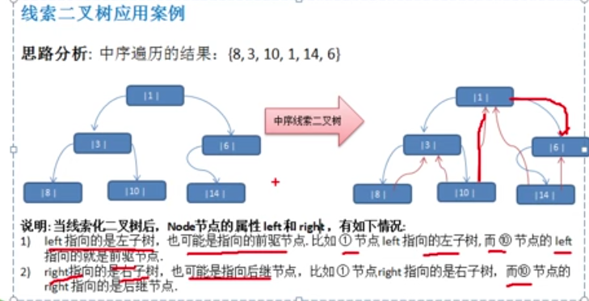

##### 9.3.2代码实现

```java
//已上图二叉树为例
public class ThreadedBinaryTreeDemo {
    public static void main(String[] args) {
        HeroNode root = new HeroNode(1, "tom");
        HeroNode node2 = new HeroNode(3, "jack");
        HeroNode node3 = new HeroNode(6, "suny");
        HeroNode node4 = new HeroNode(8, "ammy");
        HeroNode node5 = new HeroNode(10, "davi");
        HeroNode node6 = new HeroNode(14, "rucky");
        root.setLeft(node2);
        root.setRight(node3);
        node2.setLeft(node4);
        node2.setRight(node5);
        node3.setLeft(node6);
        //创建二叉树
        ThreadedBinaryTree threadedBinaryTree = new ThreadedBinaryTree(root);
        //线索化二叉树
        threadedBinaryTree.threadedBinary();
        //测试，正常情况下，node5的前驱节点是node2,后继节点是root
        System.out.println("node5的前驱节点是" + node5.getLeft());
        System.out.println("node5的后继节点是" + node5.getRight());
    }
}

/**
 * 中序线索化二叉树
 */
class ThreadedBinaryTree {
    private HeroNode root; //根节点
    private HeroNode pre;  //前驱节点
    public ThreadedBinaryTree (HeroNode root) {
        this.root = root;
    }

    //方法重载
    public void threadedBinary () {
        threadedBinary(root);
    }
    
    //线索化(核心：其实还是二叉树，只不过二叉树里面提供了线索化方法即该方法)
    public void threadedBinary (HeroNode node) {
        if (node == null) {
            return;
        }

        //向左递归
        if (node.getLeft() != null) {
            threadedBinary(node.getLeft());
        }

        //线索化当前节点
        //处理前驱节点
        if (node.getLeft() == null) {
            node.setLeft(pre);
        }
        //处理后继节点，注意:当指针移到后继节点后，后继节点的pre 就是当前节点。因为二叉树是单向的，当前节点并不知道后继节点是谁
        if (pre != null && pre.getRight() == null) {
            pre.setRight(node);
        }
        //！！！每处理完每一个节点后，让当前节点成为下一个节点的前驱节点
        pre = node;

        // 向右递归
        if (node.getRight() != null) {
            threadedBinary(node.getRight());
        }
    }
}

/**
 * 节点类
 */
class HeroNode{
    private int no;
    private String name;
    private HeroNode left; //默认null
    private HeroNode right; //默认null
    public HeroNode(int no, String name){
        this.no = no;
        this.name = name;
    }

    //getter & setter & tostring
}

```

##### 9.3.3线索化二叉树遍历

```java
//分析：因为线索化后，各个节点指向有变化，因此原来的遍历方式不能用，这时需要使用新的方式遍历线索化二叉树，各个节点可以通过线型方式遍历，因此无需使用递归方式，这样也提高了遍历效率。		遍历的次序应该和中序遍历保持一致。

/**
*注意：节点类中添加leftType和rightType区分是否有 前驱节点和后继节点
*      遍历核心：1）循环向左找到没有前驱节点的节点
*			   2）输出当前节点和后继节点
*			   3）将当前节点 = 后继节点的后继节点
		自己总结：线索化，其实就是用right（后继节点）将所有节点串联为一条线
*/
public class ThreadedBinaryTreeDemo {
    public static void main(String[] args) {
        HeroNode root = new HeroNode(1, "tom");
        HeroNode node2 = new HeroNode(3, "jack");
        HeroNode node3 = new HeroNode(6, "suny");
        HeroNode node4 = new HeroNode(8, "ammy");
        HeroNode node5 = new HeroNode(10, "davi");
        HeroNode node6 = new HeroNode(14, "rucky");
        root.setLeft(node2);
        root.setRight(node3);
        node2.setLeft(node4);
        node2.setRight(node5);
        node3.setLeft(node6);
        //创建二叉树
        ThreadedBinaryTree threadedBinaryTree = new ThreadedBinaryTree(root);
        //线索化二叉树
        threadedBinaryTree.threadedBinary();

        //测试线索化二叉树遍历
        System.out.println("线索化二叉树遍历结果：");
        threadedBinaryTree.threadedList();
    }
}

/**
 * 中序线索化二叉树
 */
class ThreadedBinaryTree {
    private HeroNode root; //根节点
    private HeroNode pre;  //前驱节点
    public ThreadedBinaryTree (HeroNode root) {
        this.root = root;
    }

    //方法重载
    public void threadedBinary () {
        threadedBinary(root);
    }
    //线索化
    public void threadedBinary (HeroNode node) {
        if (node == null) {
            return;
        }

        //向左递归
        if (node.getLeft() != null) {
            threadedBinary(node.getLeft());
        }

        //线索化当前节点
        //处理前驱节点
        if (node.getLeft() == null) {
            node.setLeft(pre);
            node.setLeftType(1);
        }
        //处理后继节点，注意:当指针移到后继节点后，后继节点的pre 就是当前节点。因为二叉树是单向的，当前节点并不知道父节点是谁
        if (pre != null && pre.getRight() == null) {
            pre.setRight(node);
            pre.setRightType(1);
        }
        //！！！每处理一个节点，让当前节点称为下一个节点的前驱节点
        pre = node;

        // 向右递归
        if (node.getRight() != null) {
            threadedBinary(node.getRight());
        }
    }

    /**
     * 中序遍历线索化二叉树
     */
    public void threadedList () {
        if (root == null) {
            System.out.println("空树，无法遍历！");
            return;
        }
        HeroNode node = root;
        while (node != null) {
            while (node.getLeftType() == 0) {
                node = node.getLeft();
            }
            System.out.println(node);
            while (node.getRightType() == 1) {
                node = node.getRight();
                System.out.println(node);
            }
            node = node.getRight();
        }
    }
}

/**
 * 节点类
 */
class HeroNode{
    private int no;
    private String name;
    private HeroNode left; //默认null
    private HeroNode right; //默认null
    private int leftType = 0; //当前节点有没有前驱节点，0有 1没有
    private int rightType = 0; //当前节点有没有后继节点 0有  1没有
    public HeroNode(int no, String name){
        this.no = no;
        this.name = name;
    }

    public int getNo() {
        return no;
    }

    public void setNo(int no) {
        this.no = no;
    }

    public String getName() {
        return name;
    }

    public void setName(String name) {
        this.name = name;
    }

    public HeroNode getLeft() {
        return left;
    }

    public void setLeft(HeroNode left) {
        this.left = left;
    }

    public HeroNode getRight() {
        return right;
    }

    public void setRight(HeroNode right) {
        this.right = right;
    }

    public int getLeftType() {
        return leftType;
    }

    public void setLeftType(int leftType) {
        this.leftType = leftType;
    }

    public int getRightType() {
        return rightType;
    }

    public void setRightType(int rightType) {
        this.rightType = rightType;
    }

    @Override
    public String toString() {
        return "HeroNode{" +
                "no=" + no +
                ", name='" + name + '\'' +
                '}';
    }
}

```

#### 9.4堆排序

##### 9.4.1堆排序的基本介绍（大顶堆和小顶堆）

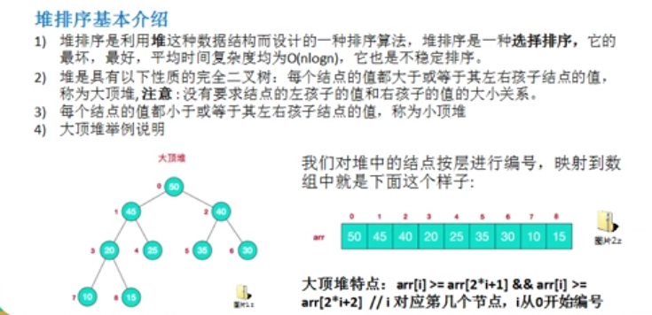

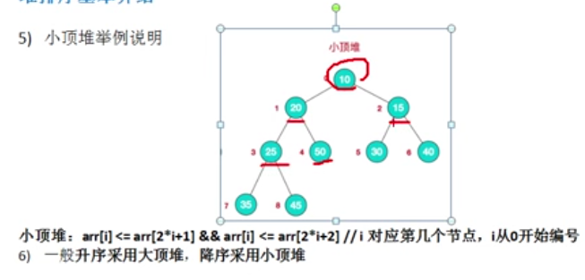

##### 9.4.2堆排序思路

```java
1.将无序序列构建成一个堆，根据升序降序需求选择大顶堆或小顶堆；
2.将堆顶元素与末尾元素交换，将最大元素沉到数组末端；
3.重新调整结构，使其满足堆定义，然后继续交换堆顶元素与当前末尾元素，反复执行调整+交换 步骤，直到整个序列有序。
```

##### 9.4.3堆排序代码实现（难）

```java
public class HeapSort {
    public static void main(String[] args) {
        int[] arr = {4, 6, 8, 5, 9};
        heapSort(arr);
        System.out.println(Arrays.toString(arr));
    }

    public static void heapSort(int arr[]) {
        System.out.println("堆排序！");
        int temp = 0;
       /* //分步骤
        adjustHeap(arr, 1, arr.length);
        System.out.println(Arrays.toString(arr)); //4,9,8,5,6
        adjustHeap(arr, 0, arr.length);
        System.out.println(Arrays.toString(arr)); //9,6,8,5,4*/

       //从最后一个非叶子节点开始arry.length/2-1  将无序数组构建成一个堆
        for (int i = arr.length/2-1; i >= 0; i--) {
            adjustHeap(arr, i, arr.length);
        }

        //将堆顶元素与数组末端交换
        for (int i = arr.length - 1; i > 0; i--) {
            temp = arr[i];
            arr[i] = arr[0];
            arr[0] = temp;
            adjustHeap(arr, 0, i); //这一步意思是将此时堆顶元素往下放到合适的位置
        }
        System.out.println(Arrays.toString(arr));
    }

    /**
     * 调整数组顺序，和冒泡排序思路相似，每次将最大的数放到堆顶
     * 思路：根据传入的i值，先比较左右子树的大小，大的那个和 arr[i]交换
     *         顺序是从左至右，从下至上 调整
     *         该方法将要调整的节点逐层往下放到合适的位置
     * @param arr
     * @param i
     * @param length
     */
    public static void adjustHeap(int[] arr, int i, int length) {
        int temp = arr[i]; //先取出当前元素的值保存在临时变量
        for (int k = i * 2 + 1; k < length; k = k * 2 + 1) {
            if (k+1<length && arr[k] < arr[k+1]) {
                k++;
            }
            if (arr[k] > temp) {
                arr[i] = arr[k];
                i=k;
            }else {
                break;
            }
        }
        //当for循环结束后，我们已经将以i为父节点的树的最大值，放在了最顶（局部）
        arr[i] = temp; //将temp值放在调整后的位置
    }
}

```

#### 9.5赫夫曼树

##### 9.5.1赫夫曼树基本介绍

```java
1.给定n个权值作为n个叶子节点，构造一颗二叉树，若该树的带权路径长度（wpl）达到最小，称这样的二叉树为最优二叉树，也称赫夫曼树。
2.赫夫曼树是带权路径长度最短的树，权值较大的节点离根较近。
3.路径和路径长度：在一颗树中，从一个节点往下可以达到的孩子或孙子节点之间的通路，称为路径。通路中分支的数目称为路径长度。若规定根节点的层数为1，则从根节点到第L层节点的路径长度为L-1；
4.节点的权及带权路径长度：若将树中节点赋给一个有着某种含义的数值，则这个数值称为该节点的权。节点的带权路径长度为：从根节点到该节点之间的路径长度与该节点的权的乘积。
5.树的带权路径长度：树的带权路径长度规定为所有/*叶子节点*/的带权路径长度之和。即为WPL(weight path length)，权值越大的节点离根节点越近的二叉树才是最优二叉树。
6.WPL最小的就是赫夫曼树。
```

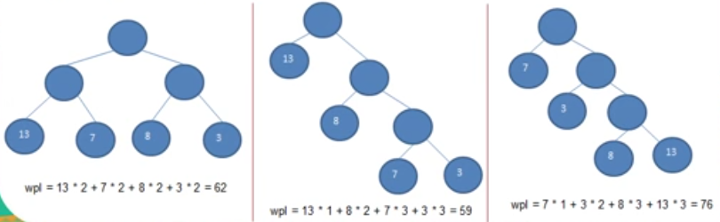

##### 9.5.2赫夫曼树创建步骤图解

```java
给你一个数组{13,7,8,3,29,6,1},要求转成一个赫夫曼树。
思路分析：
1）从小到大进行排序，将每一个数据，每个数据就是一个节点，每个节点可以看成一颗最简单的二叉树。
2）取出根节点权值最小的两颗二叉树；
3）组成一颗新的二叉树，该新的二叉树的根节点的权值是前面两颗二叉树根节点权值的和；
4)再将这颗新的二叉树，以根节点的权值大小再次排序。不断重复1-2-3-4的步骤，直到数列中，所有的数据都被处理，就得到一颗赫夫曼树。
```

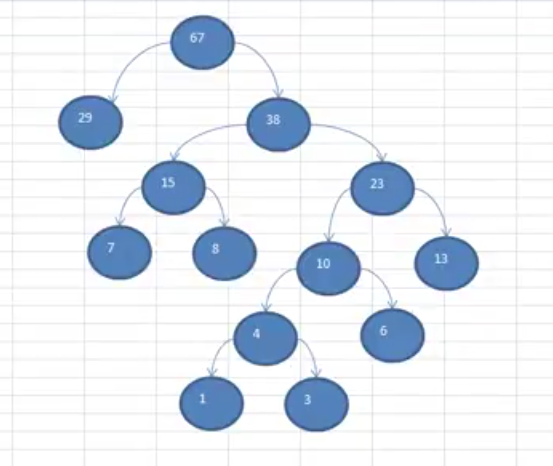

##### 9.5.3创建赫夫曼树代码实现

```java
//以上图的实例数据为例，代码如下：

public class HuffmanTree {
    public static void main(String[] args) {
        int [] arr = {13,7,8,3,29,6,1};
        //调用构建赫夫曼树的方法
        Node root = initHuffmanTree(arr);
        //测试
        preOrder(root);
    }

    /**
     * 根据传入的数组构建赫夫曼树
     * @param arr
     * @return 赫夫曼树的根节点
     */
    public static Node initHuffmanTree(int[] arr) {
        //1.将数组中的元素放到Node节点，并放入list，并排序
        List<Node> nodes = new ArrayList<>();
        for (int i : arr) {
            Node node = new Node(i);
            nodes.add(node);
        }
        //4.遍历，直到集合中剩余一个元素，该元素就是赫夫曼树的根节点
        while (nodes.size() > 1) {
            nodes.sort(((o1, o2) -> o1.getValue() - o2.getValue()));
            //2.取出最小的两个节点，组成二叉树
            Node leftNode = nodes.get(0);
            Node rightNode = nodes.get(1);
            Node rootNode = new Node(leftNode.getValue() + rightNode.getValue());
            rootNode.setLeftNode(leftNode);
            rootNode.setRightNode(rightNode);
            //3.将集合中处理过的数据删除，将生成的根节点添加
            nodes.remove(leftNode);
            nodes.remove(rightNode);
            nodes.add(rootNode);
        }
        return nodes.get(0);
    }

    /**
     * 前序遍历
     * @param node
     */
    public static void preOrder(Node node) {
        if (node == null) {
            System.out.println("空树，不能遍历");
            return;
        }
        node.preOrder();
    }
}

/**
 * 节点类
 */
class Node {
    private int value;
    private Node leftNode;
    private Node rightNode;

    public Node(int value) {
        this.value = value;
    }

    public int getValue() {
        return value;
    }

    public void setValue(int value) {
        this.value = value;
    }

    public Node getLeftNode() {
        return leftNode;
    }

    public void setLeftNode(Node leftNode) {
        this.leftNode = leftNode;
    }

    public Node getRightNode() {
        return rightNode;
    }

    public void setRightNode(Node rightNode) {
        this.rightNode = rightNode;
    }

    @Override
    public String toString() {
        return "Node{" +
                "value=" + value +
                '}';
    }

    /**
     * 前序遍历方法
     */
    public void preOrder() {
        System.out.println(this.value);
        if (this.getLeftNode() != null) {
            this.getLeftNode().preOrder();
        }
        if (this.getRightNode() != null) {
            this.getRightNode().preOrder();
        }
    }
}

```

#### 9.6赫夫曼编码

```java
//基本介绍
1.赫夫曼编码是一种编码方式，属于一种程序算法；
2.赫夫曼编码是赫夫曼树在电信通讯中的经典应用之一；
3.赫夫曼编码广泛的应用于数据文件压缩。其压缩率通常在20%-90%之间；
4.赫夫曼码是可变字长编码（VLC）的一种。Huffman于1952年提出一种编码方法，称之为最佳编码。
```

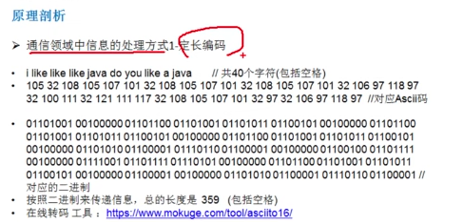

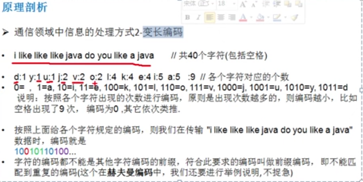

##### 9.6.1通信领域中信息的处理方式3-赫夫曼编码

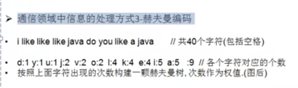

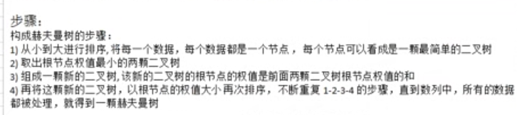

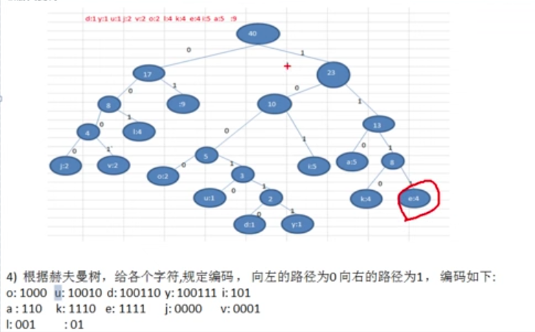

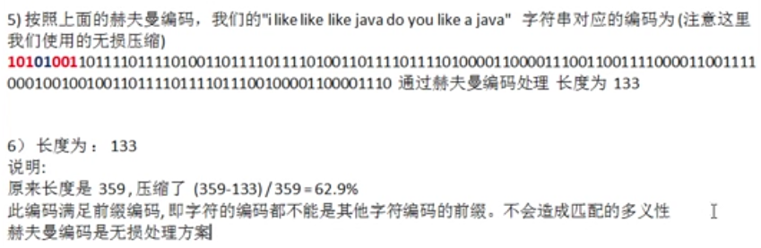

##### 9.6.2赫夫曼编码压缩数据原理

```java
功能：根据赫夫曼编码压缩数据的原理，需要创建"i like like like java do you like a java"对应赫夫曼树。
思路：
1）Node{data{存放数据}, weight(权值), left和right}
2）得到"i like like like java do you like a java"对应的byte[]数组；
3）编写一个方法，将准备构建赫夫曼树的Node节点放到list，形式[Node{data=97,weight=5},Node{data=32,weight=9}]
4)可以通过list创建对应的赫夫曼树。
```

##### 9.6.3根据赫夫曼编码进行数据压缩和解压

```java
/**
 * @program: algorithm->HuffmanCode
 * @description: 赫夫曼编码
 * @author: fangyan
 * @create: 2020-08-06 00:52
 **/
public class HuffmanCode {
    public static void main(String[] args) {
        String content = "i like like like java do you like java";
        byte[] contentBytes = content.getBytes();
        System.out.println(contentBytes.length); //40

       /* //获取nodes集合
        List<Node> nodes = getNodes(contentBytes);
        System.out.println("nodes=" + nodes);

        //根据nodes集合构建赫夫曼树
        Node root = createHuffmanTree(nodes);
        root.preOrder();

        //测试，传入根节点，获取赫夫曼编码
        getCodes(root);
        System.out.println("生成的赫夫曼编码如下：" + huffmanCodes); //length = 17   压缩率超过50%

        //测试，获取按照赫夫曼编码压缩后的字节数组
        byte[] zip = zip(contentBytes, huffmanCodes);
        System.out.println("压缩后的字节数组：" + Arrays.toString(zip));*/

       //测试：使用封装后的方法压缩字节数组
        byte[] zip = huffmanZip(contentBytes);
        System.out.println("压缩后的字节数组：" + Arrays.toString(zip));

        //测试：根据压缩后的字节数组和赫夫曼编码表进行解码
        byte[] decode = decode(huffmanCodes, zip);
        System.out.println("解压之后的字符串：" + new String(decode));

        //测试：文件压缩
        /*String sourceFile = "E://测试.txt";
        String dstFile = "E://测试.zip";
        zipFile(sourceFile, dstFile);
        System.out.println("压缩完成！");*/

       /* //测试：文件解压
        String srcFile = "E://测试.zip";
        String dstFile = "E://测试1.txt";
        unZip(srcFile, dstFile);
        System.out.println("解压完成！");*/
    }

    //*************************压缩文件和解压文件*******************************************************************

    /**
     * 文件压缩
     * @param sourceFile 源文件全路径
     * @param dstFile 压缩后的文件全路径
     */
    private static void zipFile (String sourceFile, String dstFile) {
        FileInputStream fis = null;
        FileOutputStream fos = null;
        ObjectOutputStream oos = null;
        try {
            //创建文件输入流
            fis = new FileInputStream(sourceFile);
            //创建一个和源文件大小一样的byte[]
            byte[] b = new byte[fis.available()];
            //读取文件
            fis.read(b);
            //利用赫夫曼编码进行压缩
            byte[] huffmanBytes = huffmanZip(b);
            //创建文件输出流存放压缩文件
            fos = new FileOutputStream(dstFile);
            //创建一个和文件输出流对应的ObjectOutputStream
            oos = new ObjectOutputStream(fos);
            //将赫夫曼编码后的字节数组写入压缩文件
            oos.write(huffmanBytes);
            //把赫夫曼编码表写入压缩文件
            oos.writeObject(huffmanCodes);
        } catch (Exception e) {
            e.printStackTrace();
        } finally {
            try {
                //注意：流关闭顺序最好和创建顺序相反
                oos.close();
                fos.close();
                fis.close();
            } catch (IOException e) {
                e.printStackTrace();
            }
        }
    }

    /**
     * 解压缩
     * @param srcFile
     * @param dstFile
     */
    private static void unZip (String srcFile, String dstFile) {
        InputStream is = null;
        ObjectInputStream ois = null;
        FileOutputStream fos = null;
        try {
            //创建文件输入流
            is = new FileInputStream(srcFile);
            //创建一个和is相关联的对象输入流
            ois = new ObjectInputStream(is);
            //读取压缩文件的字节数组
            byte[] zipBytes = (byte[]) ois.readObject();
            //读取压缩文件的赫夫曼编码表
            Map<Byte, String> huffmanCode = (Map<Byte, String>) ois.readObject();
            //解码
            byte[] srcBytes = decode(huffmanCode, zipBytes);
            //创建文件输入流
            fos = new FileOutputStream(dstFile);
            fos.write(srcBytes);
        } catch (Exception e) {
            e.printStackTrace();
        } finally {
            try {
                fos.close();
                ois.close();
                is.close();
            }catch (Exception e) {
                e.printStackTrace();
            }
        }


    }


    //**************************赫夫曼编码***************************************************************************

    /**
     * 将上述所有方法封装，使得直接传入原始字节数组，就可以返回压缩后的字节数组
     * @param bytes 原始字符串对应的字节数组
     * @return 压缩后的字节数组
     */
    public static byte[] huffmanZip(byte[] bytes) {
        //1.将原始字节数组转为nodes集合
        List<Node> nodes = getNodes(bytes);
        //2.根据nodes集合构建赫夫曼树
        Node root = createHuffmanTree(nodes);
        //3.传入根节点，获取赫夫曼编码
        getCodes(root);
        //4.获取按照赫夫曼编码压缩后的字节数组
        byte[] zip = zip(bytes, huffmanCodes);
        return zip;
    }

    /**
     * 将准备构建赫夫曼树的Node节点存放到list中
     * @param contentBytes
     * @return
     */
    private static List<Node> getNodes (byte[] contentBytes) {
        //构建map统计不同字符出现的次数
        Map<Byte, Integer> map = new HashMap<>();
        for (byte b : contentBytes) {
            Integer weight = map.get(b);
            if (weight == null) {
                map.put(b, 1);
            } else {
                map.put(b, weight + 1);
            }
        }
        //构建list，将map里面的键值对封装成Node存放到list集合中
        List<Node> nodes = new ArrayList<>();
        for (Map.Entry<Byte, Integer> entry : map.entrySet()) {
            nodes.add(new Node(entry.getKey(), entry.getValue()));
        }
        return nodes;
    }

    /**
     * 前序遍历
     * @param node
     */
    private static void preOrder(Node node) {
        if (node != null) {
            node.preOrder();
        } else {
            System.out.println("空树，无法遍历");
        }
    }

    /**
     * 根据集合中Node元素构建赫夫曼树
     * @param nodes
     * @return
     */
    private static Node createHuffmanTree(List<Node> nodes) {
        while (nodes.size() > 1) {
            //将集合从小到大排序
            nodes.sort(((o1, o2) -> o1.getWeight() - o2.getWeight()));
            //取出最小的两个树
            Node leftNode = nodes.get(0);
            Node rightNode = nodes.get(1);
            //构建父节点:注意 父节点没有具体的数据
            Node parent = new Node(null, leftNode.getWeight() + rightNode.getWeight());
            parent.setLeft(leftNode);
            parent.setRight(rightNode);
            //将处理过的树移除，将新构建的树加入
            nodes.remove(leftNode);
            nodes.remove(rightNode);
            nodes.add(parent);
        }
        //最后集合中剩余的一位元素就是整个赫夫曼树的根节点
        return nodes.get(0);
    }


    static Map<Byte, String> huffmanCodes = new HashMap<Byte, String>(); //存放赫夫曼编码
    static StringBuilder stringBuilder = new StringBuilder();  //储存某个叶子节点的路径
    /**
     * 功能：将传入的node节点的所有叶子节点的赫夫曼编码得到，并放入huffmanCodes集合中
     * @param node 传入的节点
     * @param code 路径，左子节点为0，右子节点为1
     * @param stringBuilder 用于拼接路径
     */
    private static void getCodes(Node node, String code, StringBuilder stringBuilder) {
        StringBuilder stringBuilder1 = new StringBuilder(stringBuilder);
        stringBuilder1.append(code);
        if (node != null) { //如果node为空不处理
            if (node.getData() == null) { //非叶子节点，递归处理
                getCodes(node.getLeft(), "0", stringBuilder1);
                getCodes(node.getRight(), "1", stringBuilder1);
            } else { //叶子节点
                huffmanCodes.put(node.getData(), stringBuilder1.toString());
            }
        }
    }
    //为了调用方便，进行方法重载
    private static void getCodes(Node node) {
        getCodes(node, "", stringBuilder);
    }

    /**
     * 按照赫夫曼编码表将字符串对应的字节数组进行压缩
     * @param bytes 字符串对应的原始字节数组
     * @param huffmanCodes 赫夫曼编码表
     */
    private static byte[] zip(byte[] bytes, Map<Byte, String> huffmanCodes) {
        //1.利用huffmanCodes将bytes转成赫夫曼编码对应点的字符串
        StringBuilder stringBuilder = new StringBuilder();
        for (byte b : bytes) {
            stringBuilder.append(huffmanCodes.get(b));
        }
        //2.创建字节数组，存放压缩后的byte数组，每8位对应一个byte
        int len;
        if (stringBuilder.length() % 8 == 0) {
            len = stringBuilder.length() / 8;
        } else {
            len = stringBuilder.length() / 8 + 1;
        }
        byte[] huffmanCodeBytes = new byte[len];
        //3.将stringBuilder每八位切割并转为十进制放入huffmanCodeBytes
        int index = 0;
        for (int i = 0; i < stringBuilder.length(); i+=8) {
            if (i + 8 > stringBuilder.length() -1) { //将stringBuilder每8位截取并转化为10进制存放到字节数组
                huffmanCodeBytes[index] = (byte) Integer.parseInt(stringBuilder.substring(i), 2);
            } else {
                huffmanCodeBytes[index] = (byte) Integer.parseInt(stringBuilder.substring(i, i + 8), 2);
            }
            index++;
        }
        return huffmanCodeBytes;
    }

    //********************************赫夫曼解码*********************************************************************

    /**
     * 完成对数组的解码
     * @param huffmanCodes  赫夫曼编码表map
     * @param huffmanBytes  赫夫曼编码得到的字节数组
     * @return  原来字符串对应的数组
     */
    public static byte[] decode(Map<Byte, String> huffmanCodes, byte[] huffmanBytes) {
        //1.先得到原来huffmanBytes对应的二进制字符串，形式如1010100010111...
        StringBuilder stringBuilder = new StringBuilder();
        for (int i = 0; i < huffmanBytes.length; i++) {
            byte b = huffmanBytes[i];
            boolean flag = (i == huffmanBytes.length - 1);
            String s = byteToBitString(!flag, b);
            stringBuilder.append(s);
        }
        //2.把字符串按照指定的赫夫曼编码表进行解码
        //2.1把赫夫曼编码表kv进行调换，需要根据编码查询出对应的原字符
        Map<String, Byte> map = new HashMap<String, Byte>();
        for (Map.Entry<Byte, String> entry : huffmanCodes.entrySet()) {
            map.put(entry.getValue(), entry.getKey());
        }
        //2.1解码
        ArrayList<Byte> list = new ArrayList<>();
        for (int i = 0; i < stringBuilder.length();) {
            int count = 1; //小计数器
            boolean flag = true;
            Byte b = null;
            while (flag) {
                String key = stringBuilder.substring(i, i + count);
                b = map.get(key);
                if (b == null) {
                    count++;
                } else {
                    flag = false;
                }
            }
            list.add(b);
            i += count;
        }
        //3.将list转为byte[]
        byte[] bytes = new byte[list.size()];
        for (int i = 0; i < list.size(); i ++) {
            bytes[i] = list.get(i);
        }
        return bytes;
    }

    /**
     * 将一个byte转为一个二进制的字符串
     * @param flag 标志是否需要补位，true表示需要补高位，false表示不需要
     * @param b
     * @return
     */
    private static String byteToBitString(boolean flag, byte b) {
        //使用变量保存b
        int temp = b;
        //如果是负数变为int对应的二进制是16位，如果是正数还需要补高位至16位，然后截取后8位才是byte
        if (flag) {
            temp |= 256;
        }
        String str = Integer.toBinaryString(temp);
        if (flag) {
            return str.substring(str.length() - 8);
        } else {
            return str;
        }
    }
}

/**
 * 节点类，包括data,weight,left,right
 */
class Node {
    //存放数据
    private Byte data;
    //数据的权值
    private Integer weight;
    private Node left;
    private Node right;

    public Node(Byte data, Integer weight) {
        this.data = data;
        this.weight = weight;
    }

    /**
     * 前序遍历
     */
    public void preOrder() {
        System.out.println(this.toString());
        if (this.left != null) {
            this.left.preOrder();
        }
        if (this.right != null) {
            this.right.preOrder();
        }
    }

    public Byte getData() {
        return data;
    }

    public void setData(byte data) {
        this.data = data;
    }

    public Integer getWeight() {
        return weight;
    }

    public void setWeight(Integer weight) {
        this.weight = weight;
    }

    public Node getLeft() {
        return left;
    }

    public void setLeft(Node left) {
        this.left = left;
    }

    public Node getRight() {
        return right;
    }

    public void setRight(Node right) {
        this.right = right;
    }

    @Override
    public String toString() {
        return "Node{" +
                "data=" + data +
                ", weight=" + weight +
                '}';
    }
}

```

##### 9.6.4使用赫夫曼编码压缩文件和解压文件

```java
如上代码
//仍然优点问题，思路可做参考，问题还待排查
```

##### 9.6.5赫夫曼压缩注意事项

```java
1.如果文件本身就是经过压缩处理的，那么使用赫夫曼再去压缩效率不会有明显变化。比如视屏，PPT等文件。
2.赫夫曼编码是按字节来处理的，因此可以处理所有文件（二进制文件、文本文件等）
3.如果一个文件中的内容，重复数据不多，压缩效果也不会很明显。
```

#### 9.7二叉排序树（BST树）

```java
需求：
	给你一个数列{7, 3, 10, 12, 5, 1, 9},要求能够高效的完成对数据的查询和添加。
	
解决方案分析：
	1.使用数组：
	1）数组未排序，优点：直接在数组尾添加，速度快。缺点：查找慢。
	2）数组排序，优点：可以使用二分查找，查找速度快。缺点：为了保证数组有序，在添加新数据时，找到插入位置后，后面的数据需要整体移动，速度慢。
	2.使用链式存储：
	不管链表是否有序，查找速度都慢，添加数据速度比数组快，不需要数据整体移动。
	
	3.使用二叉排序树：
		如下图：
```

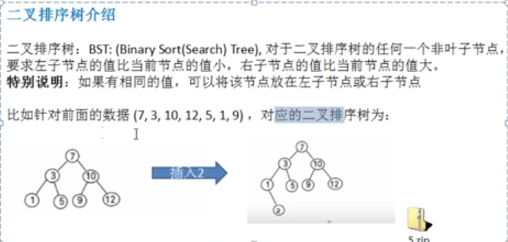

##### 9.7.1二叉排序树的创建和遍历和删除代码实现

```java
/**
 * @program: algorithm->BinarySortTree
 * @description: 二叉排序树   
 * @author: fangyan
 * @create: 2020-08-12 00:00
 **/
public class BinarySortTreeDemo {
    public static void main(String[] args) {
        int[] nums = {7, 3, 10, 12, 5, 1, 9, 2};
        //测试创建二叉排序树
        BinarySortTree binarySortTree = new BinarySortTree();
        for (int i = 0; i < nums.length; i++) {
            binarySortTree.addNode(new Node(nums[i]));
        }
        //中序遍历
        binarySortTree.infixOrder();

        //测试删除叶子节点
        binarySortTree.delNode(2);
        binarySortTree.delNode(5);
        binarySortTree.delNode(9);
        binarySortTree.delNode(12);
        binarySortTree.delNode(7);
        binarySortTree.delNode(3);
        binarySortTree.delNode(10);
        binarySortTree.delNode(1);
        System.out.println("删除叶子结点");
        binarySortTree.infixOrder();
    }
}

/**
 * 二叉排序树类
 */
class BinarySortTree {
    private Node root;
    /**
     * 添加节点的方法
     * @param node
     */
    public void addNode(Node node) {
        if (root == null) {
            root = node;
        } else {
            root.addNode(node);
        }
    }

    /**
     * 查找删除的节点
     * @param value
     * @return
     */
    public Node searcher(int value) {
        if (root == null) {
            return null;
        } else {
            return root.search(value);
        }
    }

    /**
     * 查找删除节点的父节点
     * @param value
     * @return
     */
    public Node searcherParent(int value) {
        if (root == null) {
            return null;
        } else {
            return root.searchParent(value);
        }
    }

    /**
     * 删除给定节点的右子树最小节点，并返回最小节点值
     * @param node
     * @return 给定节点的右子树最小节点
     */
    public Node delRightMinNode(Node node) {
        Node minNode = null;
        //一直向节点的右子节点查找就能找到最小值
        while (node.getLeft() != null) {
            node = node.getLeft();
        }
        minNode = node;
        delNode(node.getValue());
        return minNode;
    }

    /**
     * 删除节点
     * @param value
     */
    public void delNode(int value) {
        Node targetNode = searcher(value); //要删除的节点
        Node parent = searcherParent(value); //要删除节点的父节点
        //没有找到要删除的节点
        if (targetNode == null) {
            return;
        }
        //如果当前这颗二叉树只有一个节点
        if (root.getLeft() == null && root.getRight() == null) {
            root = null;
            return;
        }
        //1.如果待删除的节点是叶子节点
        if (targetNode.getLeft() == null && targetNode.getRight() == null) {
            if (parent.getLeft() != null && parent.getLeft() == targetNode) {
                parent.setLeft(null);
            } else if (parent.getRight() != null && parent.getRight() == targetNode) {
                parent.setRight(null);
            }
        } if (targetNode.getLeft() != null && targetNode.getRight() != null) { //2.如果待删除的节点是有两颗子树的节点
            Node minNode = delRightMinNode(targetNode.getRight());
            targetNode.setValue(minNode.getValue());
        } else { //3.如果待删除的节点是只有一颗子树的节点
            if (targetNode.getLeft() != null) { //如果待删除节点只有左子节点
                if (parent != null) { //如果parent==null 说明此时要删除的是root节点
                    if (parent.getLeft() != null && parent.getLeft() == targetNode) {
                        parent.setLeft(targetNode.getLeft());
                    } else {
                        parent.setRight(targetNode.getLeft());
                    }
                } else {
                    root = targetNode.getLeft();
                }
            } else { //如果待删除的节点只有右子树
                if (parent != null) {
                    if (parent.getLeft() != null && parent.getLeft() == targetNode) {
                        parent.setLeft(targetNode.getRight());
                    } else {
                        parent.setRight(targetNode.getRight());
                    }
                } else {
                    root = targetNode.getRight();
                }
            }
        }
    }

    /**
     * 中序遍历
     */
    public void infixOrder() {
        if (root != null) {
            root.infixOrder();
        } else {
            System.out.println("空树，无法遍历！");
        }
    }
}

/**
 * 节点类
 */
class Node {
    private int value;
    private Node left;
    private Node right;

    public Node(int value) {
        this.value = value;
    }

    /**
     * 添加节点的方法
     * @param node
     */
    public void addNode(Node node) {
        if (node != null) {
            if (this.value > node.value) {
                if (this.left == null) {
                    this.left = node;
                } else {
                    this.left.addNode(node);
                }
            } else {
                if (this.right == null) {
                    this.right = node;
                } else {
                    this.right.addNode(node);
                }
            }
        }
    }

    /**
     * 找到要删除的节点
     * @param value 希望删除的节点的值
     * @return 如果找到返回该节点，没有则返回null
     */
    public Node search(int value) {
        if (this.value == value) {
            return this;
        } else if (value < this.value) { //往当前节点的左子树递归查找
            if (this.left == null) {
                return null;
            }
            return this.left.search(value);
        } else { //往当前节点的右子树递归查找
            if (this.right == null) {
                return null;
            }
            return this.right.search(value);
        }
    }

    /**
     * 查找要删除节点的父节点
     * @param value
     * @return
     */
    public Node searchParent(int value) {
        if ((this.left != null && this.left.value == value) ||
                (this.right != null && this.right.value == value)){
            return this;
        } else if (this.value > value && this.left != null) {
            return this.left.searchParent(value);
        } else if (this.value <= value && this.right != null) {
            return this.right.searchParent(value);
        } else {
            return null;
        }
    }

    /**
     * 中序遍历
     */
    public void infixOrder() {
        if (this.left != null) {
            this.left.infixOrder();
        }
        System.out.println(this.value);
        if (this.right != null) {
            this.right.infixOrder();
        }
    }

    public int getValue() {
        return value;
    }

    public void setValue(int value) {
        this.value = value;
    }

    public Node getLeft() {
        return left;
    }

    public void setLeft(Node left) {
        this.left = left;
    }

    public Node getRight() {
        return right;
    }

    public void setRight(Node right) {
        this.right = right;
    }

    @Override
    public String toString() {
        return "Node{" +
                "value=" + value +
                '}';
    }
}

```

##### 9.7.2二叉排序树的删除

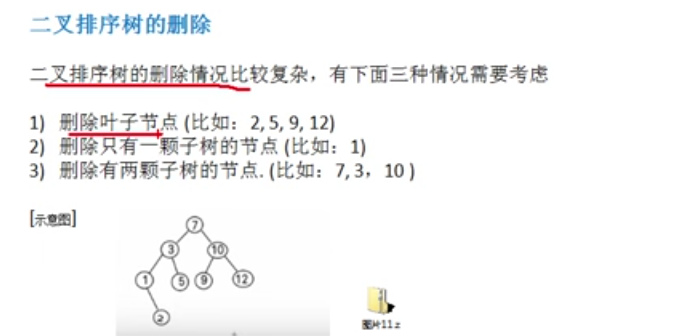

**二叉排序树删除节点的三种情况分析**

```java
一.第一种情况：
删除叶子节点（比如：2,5,9,12）
思路：
	1.先去找到要删除的节点targetNode
	2.找到targetNode的父节点parent
	3.确定targetNode是parent的左子节点还是右子节点
	4.根据前面的情况来对应删除
		左子节点parent.left=null
    	右子节点parent.right=null
    
二、第二种情况：
删除只有一棵树的节点 比如 1
思路：
	1.先去找到要删除的节点targetNode
	2.找到targetNode的父节点parent
	3.确定targetNode是parent的左子节点还是右子节点
	4.targetNode是parent的左子节点还是右子节点
	5.如果targetNode有左子节点
		5.1如果targetNode是parent的左子节点
		parent.left = targetNode.left
		5.2如果targetNode是parent的右子节点
		prent.right = targetNode.left
	6.如果targetNode有右子节点
		6.1如果targetNode是parent的左子节点
		parent.left = targetNode.right
		6.2如果targetNode是parent的右子节点
		parent.right = targetNode.right
		
三、第三种情况
删除有两棵树的节点 比如 7,3,10
思路：
	1.先去找到要删除的节点targetNode
	2.找到targetNode的父节点parent
	3.从targetNode的右子树找到最小节点
	4.用一个临时变量，将最小节点的值保存在temp
	5.删除该最小节点
	6.targetNode.value = temp
	
//删除节点代码见9.7.1代码
```

#### 9.8平衡二叉树（AVL树）

给定一个数列{1,2,3,4,5,6}，创建一颗二叉排序树（BST）并分析问题所在。

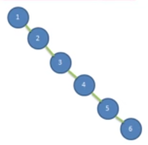

```java
//问题分析
1.左子树全部为空，从形式上看，更像一个单链表。
2.插入速度没有影响
3.查询速度明显降低(因为需要依次比较)，不能发挥BST的优势，因为每次还需要比较左子树，其查询速度比单链表还慢。
4.解决方案：平衡二叉树。
```

##### 9.8.1基本介绍

```java
1.平衡二叉树也叫平衡二叉搜索树，又被称为AVL树，可以保证查询效率较高。
2.具有以下特点：
	它是一颗空树或它的左右两颗子树的高度差的绝对值不超过1，并且左右两个子树都是一颗平衡二叉树。平衡二叉树的常用实现方法有 红黑树、AVL、替罪羊树、Treap、伸展树 等。
```

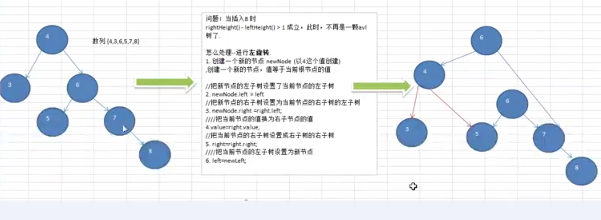

##### 9.8.2AVL树左旋转思路图解

```java
问题：当数列{4,3,6,5,7，8} 构建二叉排序树时，如下图：
	当插入8时 rightHeight() - leftHeight() > 1 成立，此时，不再是一棵avl树了
	
怎么处理？  进行左旋转
1.创建一个新的节点newNode(以4这个值创建)，创建一个新的节点，值等于当前根节点的值。
	//把新节点的左子树设置为了当前节点的左子树
2.newNode.left = left
	//把新节点的右子树设置为当前节点的右子树的左子树
3.newNode.right = right.left
	//把当前节点的值换为右子节点的值
4.value = right.value
	//把当前节点的右子树设置为右子树的右子树
5.right = right.right
	//把当前节点的左子树设置为新节点
6.left = newLeft

结果如下图2
```

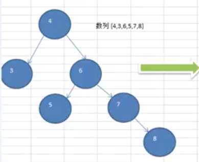

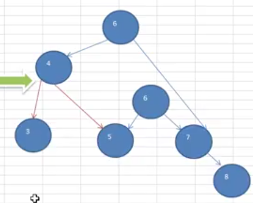

##### 9.8.3AVL树右旋转思路图解

```java
数列{10,12,8,9,7,6}
问题：如下图1，当插入6时 leftHeight()-rightHeight()>1成立，此时，不再是一棵avl树了。
	怎么处理-进行右旋转（就是降低左子树的高度），这里将9这个节点通过右旋转到右子树

1.以根节点的值创建一个新的节点newNode(value)
//把新节点的右子树设置为当前节点的右子树
2.newNode.right=right
//把新节点的左子树设置为当前节点的左子树的右子树
3.newNode.left=left.right;
//把当前节点的值替换为左子节点的值
4.value=left;
//把当前节点的左子树设置成左子树的左子树
5.left=left.left
//把当前节点的右子树设置为新节点
6.right=newLeft

右旋转前后树结构如下：
```

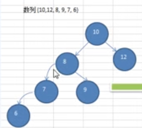

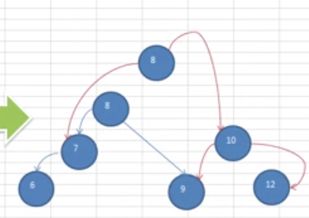

##### 9.8.4AVL树双旋转图解

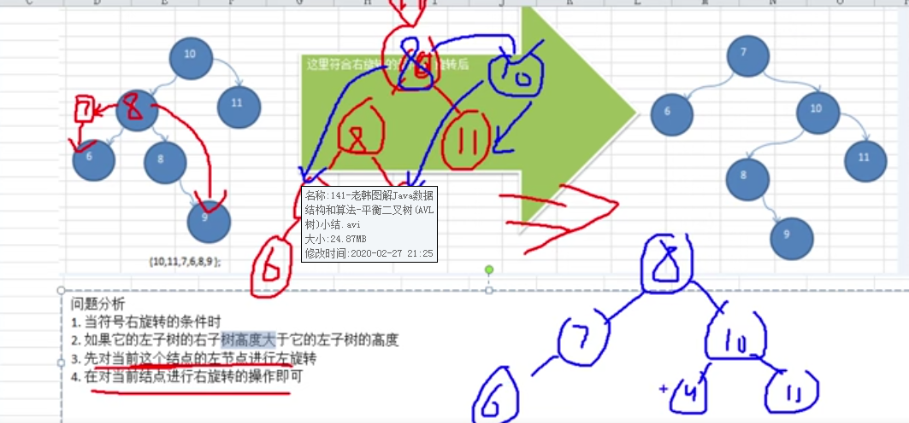

##### 9.8.5平衡二叉树代码实现

```java
public class AvlTreeDemo {
    public static void main(String[] args) {
        //int[] arr = {4,3,6,5,7,8};
        //int[] arr = {10,12,8,9,7,6};
        int[] arr = {10,11,7,6,8,9};
        AvlTree avlTree = new AvlTree();
        //添加节点
        for (int i = 0; i < arr.length; i++) {
            avlTree.addNode(new Node(arr[i]));
        }
        //中序遍历
        System.out.println("中序遍历");
        avlTree.infixOrder();
        //没有经过平衡处理前树的高度
        //System.out.println("没有经过平衡处理前树的高度:" + avlTree.getRoot().height());
        System.out.println("树的左子树的高度:" + avlTree.getRoot().leftHeight());
        System.out.println("树的右子树的高度:" + avlTree.getRoot().rightHeight());
    }
}

class AvlTree{
    private Node root;

    /**
     * 返回根节点
     * @return
     */
    public Node getRoot() {
        return root;
    }
    /**
     * 添加节点的方法
     * @param node
     */
    public void addNode(Node node) {
        if (root == null) {
            root = node;
        } else {
            root.addNode(node);
        }
    }

    /**
     * 查找删除的节点
     * @param value
     * @return
     */
    public Node searcher(int value) {
        if (root == null) {
            return null;
        } else {
            return root.search(value);
        }
    }

    /**
     * 查找删除节点的父节点
     * @param value
     * @return
     */
    public Node searcherParent(int value) {
        if (root == null) {
            return null;
        } else {
            return root.searchParent(value);
        }
    }

    /**
     * 删除给定节点的右子树最小节点，并返回最小节点值
     * @param node
     * @return 给定节点的右子树最小节点
     */
    public Node delRightMinNode(Node node) {
        Node minNode = null;
        //一直向节点的右子节点查找就能找到最小值
        while (node.getLeft() != null) {
            node = node.getLeft();
        }
        minNode = node;
        delNode(node.getValue());
        return minNode;
    }

    /**
     * 删除节点
     * @param value
     */
    public void delNode(int value) {
        Node targetNode = searcher(value); //要删除的节点
        Node parent = searcherParent(value); //要删除节点的父节点
        //没有找到要删除的节点
        if (targetNode == null) {
            return;
        }
        //如果当前这颗二叉树只有一个节点
        if (root.getLeft() == null && root.getRight() == null) {
            root = null;
            return;
        }
        //1.如果待删除的节点是叶子节点
        if (targetNode.getLeft() == null && targetNode.getRight() == null) {
            if (parent.getLeft() != null && parent.getLeft() == targetNode) {
                parent.setLeft(null);
            } else if (parent.getRight() != null && parent.getRight() == targetNode) {
                parent.setRight(null);
            }
        } if (targetNode.getLeft() != null && targetNode.getRight() != null) { //2.如果待删除的节点是有两颗子树的节点
            Node minNode = delRightMinNode(targetNode.getRight());
            targetNode.setValue(minNode.getValue());
        } else { //3.如果待删除的节点是只有一颗子树的节点
            if (targetNode.getLeft() != null) { //如果待删除节点只有左子节点
                if (parent != null) { //如果parent==null 说明此时要删除的是root节点
                    if (parent.getLeft() != null && parent.getLeft() == targetNode) {
                        parent.setLeft(targetNode.getLeft());
                    } else {
                        parent.setRight(targetNode.getLeft());
                    }
                } else {
                    root = targetNode.getLeft();
                }
            } else { //如果待删除的节点只有右子树
                if (parent != null) {
                    if (parent.getLeft() != null && parent.getLeft() == targetNode) {
                        parent.setLeft(targetNode.getRight());
                    } else {
                        parent.setRight(targetNode.getRight());
                    }
                } else {
                    root = targetNode.getRight();
                }
            }
        }
    }

    /**
     * 中序遍历
     */
    public void infixOrder() {
        if (root != null) {
            root.infixOrder();
        } else {
            System.out.println("空树，无法遍历！");
        }
    }
}


/**
 * 节点类
 */
class Node {
    private int value;
    private Node left;
    private Node right;

    public Node(int value) {
        this.value = value;
    }

    /**
     * 求当前节点左子树的高度
     * @return
     */
    public int leftHeight() {
        if (left == null) {
            return 0;
        } else {
            return left.height();
        }
    }

    /**
     * 左旋转方法
     */
    private void leftRotate() {
        //以当前根节点的值创建新的节点
        Node newNode = new Node(value);
        //把新的节点的左子树设置为当前节点的左子树
        newNode.left = left;
        //把新的节点的右子树设置为当前节点的右子树的左子树
        newNode.right = right.left;
        //把当前节点的值替换成右子节点的值
        value = right.value;
        //把当前节点的右子树设置为当前节点的右子树的右子树
        right = right.right;
        //把当前节点的左子树设置为新的节点
        left = newNode;
    }

    /**
     * 右旋转方法
     */
    public void rightRotate() {
        Node newNode = new Node(value);
        newNode.right = right;
        newNode.left = left.right;
        value = left.value;
        left = left.left;
        right = newNode;
    }

    /**
     * 求当前节点的右子树高度
     * @return
     */
    public int rightHeight() {
        if (right == null) {
            return 0;
        } else {
            return right.height();
        }
    }

    /**
     * 返回以当前节点为根节点的树的高度
     * @return
     */
    public int height() {
        return Math.max(left == null ? 0 : left.height(), right == null ? 0 : right.height()) + 1;
    }

    /**
     * 添加节点的方法
     * @param node
     */
    public void addNode(Node node) {
        if (node != null) {
            if (this.value > node.value) {
                if (this.left == null) {
                    this.left = node;
                } else {
                    this.left.addNode(node);
                }
            } else {
                if (this.right == null) {
                    this.right = node;
                } else {
                    this.right.addNode(node);
                }
            }
        }
        //当添加完一个节点后，如果：(右子树的高度-左子树的高度) > 1,左旋转
        if (rightHeight() - leftHeight() > 1) {
            //如果它的右子树的左子树的高度大于它的右子树的右子树的高度
            if (right != null && right.leftHeight() > right.rightHeight()) {
                //先对右子树进行右旋转
                right.rightRotate();
                //然后再对当前节点进行左旋转
                leftRotate();
            } else {
                leftRotate();
            }
            return;
        }
        //当添加完一个节点后，如果：(左子树的高度-右子树的高度) > 1,右旋转
        if (leftHeight() - rightHeight() > 1) {
            //如果它的左子树的右子树高度大于它的左子树高度
            if (left != null && left.rightHeight() > left.leftHeight()) {
                //先对当前节点的左节点进行左旋转
                left.leftRotate();
                //在对当前节点进行右旋转
                rightRotate();
            } else {
                rightRotate();
            }
        }
    }

    /**
     * 找到要删除的节点
     * @param value 希望删除的节点的值
     * @return 如果找到返回该节点，没有则返回null
     */
    public Node search(int value) {
        if (this.value == value) {
            return this;
        } else if (value < this.value) { //往当前节点的左子树递归查找
            if (this.left == null) {
                return null;
            }
            return this.left.search(value);
        } else { //往当前节点的右子树递归查找
            if (this.right == null) {
                return null;
            }
            return this.right.search(value);
        }
    }

    /**
     * 查找要删除节点的父节点
     * @param value
     * @return
     */
    public Node searchParent(int value) {
        if ((this.left != null && this.left.value == value) ||
                (this.right != null && this.right.value == value)){
            return this;
        } else if (this.value > value && this.left != null) {
            return this.left.searchParent(value);
        } else if (this.value <= value && this.right != null) {
            return this.right.searchParent(value);
        } else {
            return null;
        }
    }

    /**
     * 中序遍历
     */
    public void infixOrder() {
        if (this.left != null) {
            this.left.infixOrder();
        }
        System.out.println(this.value);
        if (this.right != null) {
            this.right.infixOrder();
        }
    }

    public int getValue() {
        return value;
    }

    public void setValue(int value) {
        this.value = value;
    }

    public Node getLeft() {
        return left;
    }

    public void setLeft(Node left) {
        this.left = left;
    }

    public Node getRight() {
        return right;
    }

    public void setRight(Node right) {
        this.right = right;
    }

    @Override
    public String toString() {
        return "Node{" +
                "value=" + value +
                '}';
    }
}

```

#### 9.9多叉树原理

##### 9.9.1二叉树与B树

**二叉树问题分析**

```java
二叉树操作效率较高，但是也存在问题。
1二叉树需要加载到内存的，如果二叉树的节点少，没有什么问题，但是如果二叉树的节点很多（比如1亿），就存在如下问题：
	1）在构建二叉树时，需要多次进行I/O操作（海量数据存在数据库或文件中），节点海量，构建二叉树时，速度有影响。
	2）节点海量也会造成二叉树的高度很大，会降低操作速度。
```

**多叉树**

```java
1.在二叉树中，每个节点有数据项，最多有两个子节点。如果允许每个节点可以有更多的数据项和更多子节点，就是多叉树
2.2-3树，2-3-4树就是多叉树，多叉树通过重新组织节点，减少树的高度，能对二叉树进行优化。
3.如下就是一棵2-3树。
```

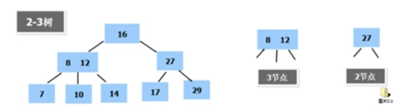

**B树的基本介绍**

```java
B树通过重新组织节点，降低树的高度，并减少I/O读写次数来提升效率。
1.如图B树通过重新组织节点，降低了树的高度。
2.文件系统及数据库系统的设计者利用了磁盘预读原理，将一个节点的大小设为等于一个页（页的大小通常等于4k），这样每个节点只需要一次I/O就可以完全载入。
3.将树的度M设置为1024，在600亿个元素中最多只需要4次I/O操作就可以读取到想要的元素，B树（B+树）广泛应用于文件存储系统以及数据库系统中。

B-tree树即B树，B即Balanced,平衡的意思。
```

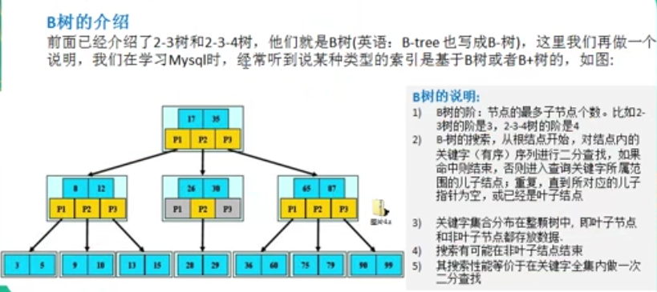

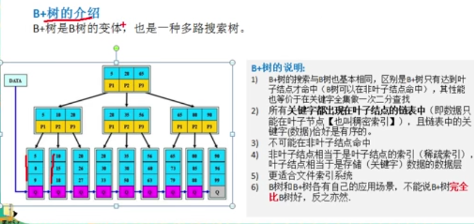

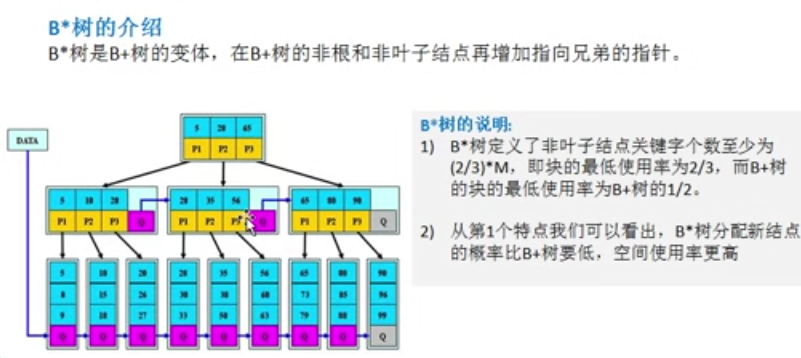

### 10.图

#### 10.1图的基本介绍

```java
为什么要有图？
1.前面我们学习了线性表和树
2.线性表局限于一个直接前驱和一个直接后驱。
3.树也只能有一个直接前驱也就是父节点
4.当我们需要表示多对多关系时，这里我们就用到了图。
```

#### 10.2图的常用概念

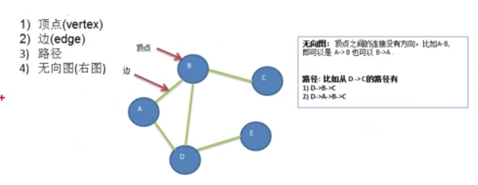

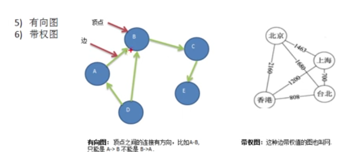

#### 10.3图的表示方式

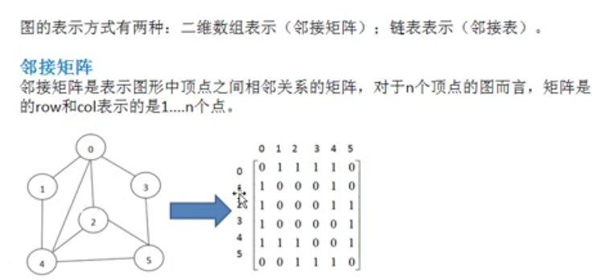

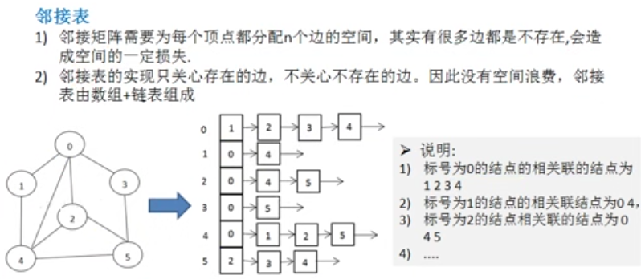

#### 10.4图创建代码实现

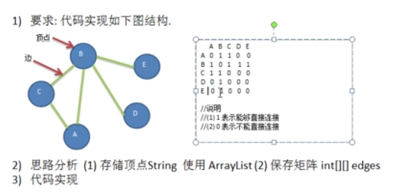

**代码实现**

```java
//图的创建、深度优先遍历、广度优先遍历
public class Graph {

    //存储顶点集合
    private List<String> vertextList;
    //存储图对应的邻结矩阵
    private int[][] edges;
    //表示边的数目
    private int numOfEdges;
    //标识顶点已经被访问过
    boolean[] isVisited;

    public static void main(String[] args) {
        //测试图的创建
        int n = 5;  //节点的个数
        String[] vertexs = {"A", "B", "C", "D", "E"};
        //创建图对象
        Graph graph = new Graph(n);
        //循环添加顶点
        for (String vertex : vertexs) {
            graph.insertVertex(vertex);
        }
        //添加边 A-B A-C B-C B-D B-E
        graph.insertEdge(0, 1, 1);
        graph.insertEdge(0, 2, 1);
        graph.insertEdge(1, 2, 1);
        graph.insertEdge(1, 3, 1);
        graph.insertEdge(1, 4, 1);
        //显示linjiejuzhen
        graph.showGraph();

        //测试一把dfs算法
        System.out.println("深度遍历");
        graph.dfs();

        System.out.println();
        //测试一把bfs算法
        System.out.println("广度优先遍历");
        graph.bfs();
    }


    //构造器，初始化n个顶点
    public Graph(int n) {
        //初始化矩阵和vertextList
        edges = new int[n][n];
        vertextList = new ArrayList<>(n);
        numOfEdges = 0;
    }

    /**
     * 得到第一个邻节点的下标w
     * @param index 第一个领节点的下标
     * @return 如果存在就返回对应的下标，否则返回-1
     */
    public int getFirstNeighbor(int index) {
        for (int j = 0; j < vertextList.size(); j++) {
            if (edges[index][j] > 0) {
                return j;
            }
        }
        return -1;
    }

    /**
     * 根据前一个邻接节点的下标获取下一个邻接节点
     * @param v1
     * @param v2
     * @return
     */
    public int getNextNeighbor(int v1, int v2) {
        for (int j = v2 + 1; j < vertextList.size(); j++) {
            if (edges[v1][j] > 0) {
                return j;
            }
        }
        return -1;
    }

    /**
     * 深度优先遍历算法
     * @param isVisited 判断节点是否已被访问
     * @param i 当前访问的节点
     */
    public void dfs(boolean[] isVisited, int i) {
        //首先我们访问该节点，输出
        System.out.print(getValueByIndex(i) + "->");
        //将节点设置为已经访问
        isVisited[i] = true;
        //查找节点i的第一个邻接节点w
        int w = getFirstNeighbor(i);
        while(w != -1) {
            if (!isVisited[i]) {
                dfs(isVisited, w);
            }
            //如果w节点已经被访问了
            w = getNextNeighbor(i, w);
        }
    }

    /**
     * 对dfs进行重载，遍历所有的节点，并进行dfs
     */
    private void dfs() {
        isVisited = new boolean[vertextList.size()];
        //遍历所有的节点，进行dfs[回溯]
        for (int i = 0; i < getNumOfVertex(); i++) {
            if (!isVisited[i]) {
                dfs(isVisited, i);
            }
        }
    }

    /**
     * 广度优先算法
     * @param isVisited
     * @param i 当前节点下标
     */
    public void bfs(boolean[] isVisited, int i) {
        int u; //表示队列的头节点对应的下标
        int w; //邻节点
        //队列，记录节点访问顺序
        LinkedList queue = new LinkedList();
        //访问节点，输出节点信息
        System.out.print(getValueByIndex(i) + "=>");
        //标记为已访问
        isVisited[i] = true;
        //将节点下标加入队列
        queue.addLast(i);

        while(!queue.isEmpty()) {
            //取出队列的头节点下标
            u = (Integer) queue.removeFirst();
            //得到第一个邻节点下标
            w = getFirstNeighbor(u);
            while(w != -1) {
                //是否访问过
                if (!isVisited[w]) {
                    System.out.print(getValueByIndex(w) + "=>");
                    //标记已访问
                    isVisited[w] = true;
                    //入队列
                    queue.addLast(w);
                }
                //访问过了,以u为前驱点，找w后面的下一个节点
                w = getNextNeighbor(u, w);  //体现出广度优先
            }
        }
    }

    /**
     * 广度优先方法重载
     */
    public void bfs() {
        isVisited = new boolean[vertextList.size()];
        for (int i = 0; i < getNumOfVertex(); i++) {
            if (!isVisited[i]) {
                bfs(isVisited, i);
            }
        }
    }

     //*********************创建图的方法**********************************
    /**
     * 插入节点
     * @param vertex
     */
    public void insertVertex(String vertex) {
        vertextList.add(vertex);
    }

    /**
     * 添加顶点之间的边
     * @param v1 第一个顶点的下标
     * @param v2 第二个顶点的下标
     * @param weight 权值
     */
    public void insertEdge(int v1, int v2, int weight) {
        edges[v1][v2] = weight;
        edges[v2][v1] = weight;
        numOfEdges++;
    }

    //*********************常用方法**********************************

    /**
     * 获取顶点的个数
     * @return
     */
    public int getNumOfVertex() {
        return vertextList.size();
    }

    /**
     * 获取边的个数
     * @return
     */
    public int getNumOfEdges() {
        return numOfEdges;
    }

    /**
     * 返回索引i对应的数据
     * @param i
     * @return
     */
    public String getValueByIndex(int i) {
        return vertextList.get(i);
    }

    /**
     * 返回两个顶点之间边的权重
     * @param v1
     * @param v2
     * @return
     */
    public int getWeight(int v1, int v2) {
        return edges[v1][v2];
    }

    /**
     * 显示图对应的矩阵
     */
    public void showGraph() {
        for (int[] link : edges) {
            System.out.println(Arrays.toString(link));
        }
    }

}

```

#### 10.5图的深度优先遍历

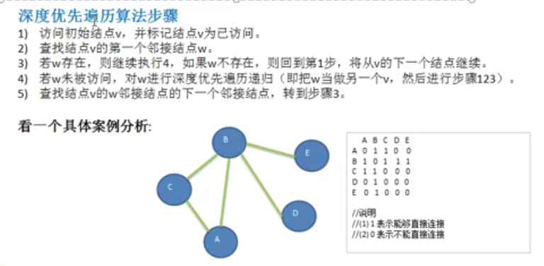

代码见10.4

#### 10.6图的广度优先遍历

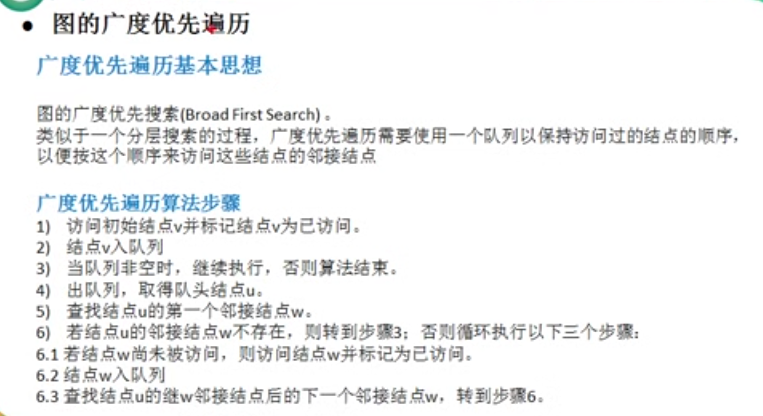

代码见10.4

#### 10.7DFS和BFS比较

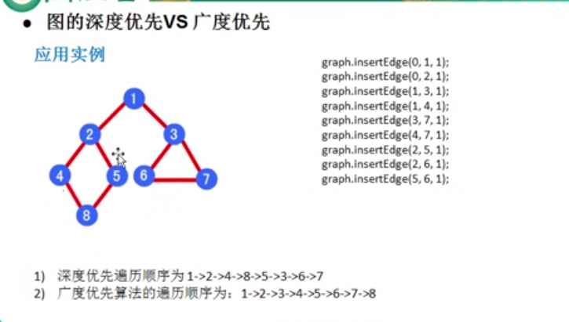

### 11.程序员常用十大算法

#### 11.1二分查找非递归方式

```java
public class BinarySearchNoRecur {
    public static void main(String[] args) {
        int[] a = {1,2,3,4,5,6,7,8,9};
        int i = binarySearch(a, 8);
        System.out.println(i);
    }

    public static int binarySearch(int[] arr, int value) {
        if (arr.length == 0) {
            System.out.println("空数组~");
        }

        int start = 0;
        int end = arr.length - 1;
        while (start <= end) {
            int mid = (start + end) / 2;
            int midValue = arr[mid];
            if (midValue == value) {
                return mid;
            } else if (midValue < value) {
                start = mid + 1;
            } else {
                end = mid - 1;
            }
        }
        return -1;
    }

}

```

#### 11.2分治算法(汉诺塔)

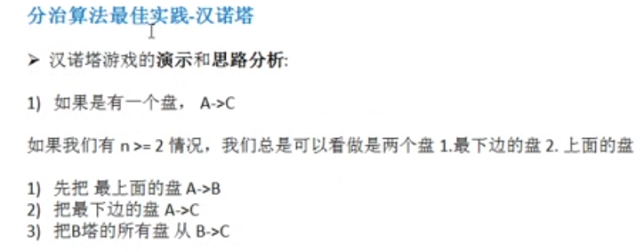

```java
public class Hanoitower {
    public static void main(String[] args) {
        hanoitower(3, 'A', 'B', 'C');
    }

    public static void hanoitower(int num, char a, char b, char c) {
        //如果只有一个盘
        if (num == 1) {
            System.out.println("第1个盘从 " + a + "->" + c);
        } else {
            //如果我们有 num >= 2个盘，我们总是可以看作两个盘，1.最下面一个盘 2.上面的所有盘
            //1.先把最上面的所有盘A->B,移动过程会使用到C
            hanoitower(num - 1, a, c, b);
            //2.把最下面的盘A->C
            System.out.println("第" + num + "个盘从 " + a + "->" + c);
            //3.把B上面的所有盘移动到C
            hanoitower(num - 1, b, a, c);
        }

    }
}

```

#### 11.3动态规划算法(背包)

```java
1.动态规划算法的核心思想是：将大问题划分为小问题进行解决，从而一步步获取最优解的处理算法；
2.动态规划算法与分治算法类似，其基本思想也是将待求解问题分解成若干个子问题，先求解子问题，然后从这些子问题的解得到原问题的解；
3.与分治算法不同的是，适用于动态规划算法的问题，经分解得到的子问题往往不是相互独立的。（即下一个子阶段的求解是建立在上一个子阶段的解的基础上，进行进一步求解）
4.动态规划可以通过填表的方式来逐步推进，得到最优解。
```

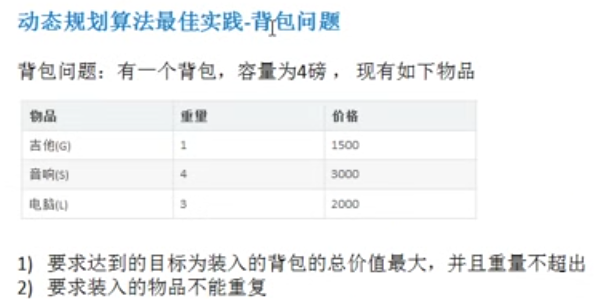

解题思路图解

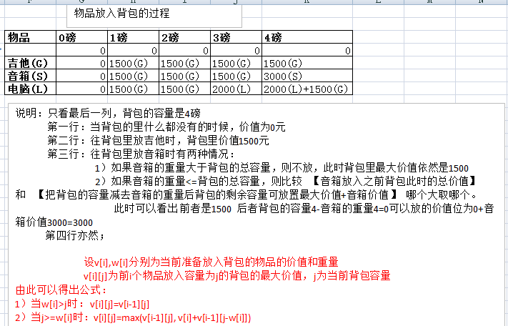

**代码示例**

```java
public class KnapsackProblem {
    public static void main(String[] args) {
        int[] w = {1, 4, 3};  // 物品的重量
        int[] val = {1500, 3000, 2000};  // 物品的价值
        int m = 4;  //背包的容量
        int n = val.length;  //物品的个数

        // v[i][j]  前i个物品放入到容量为j的背包的最大价值
        int[][] v = new int[n + 1][m + 1];

        // 记录放入背包的物品
        int[][] path = new int[n + 1][m + 1];

        // 初始化第一行和第一列
        for (int i = 0; i < v.length; i++) {
            v[i][0] = 0;
        }
        for (int i = 0; i < v[0].length; i++) {
            v[0][i] = 0;
        }

        // 遍历放入物品
        for (int j = 1; j <= m; j++) {  // 背包容量
            for (int i = 1; i <= n; i++) {  // 遍历物品
                if (w[i - 1] > j) {
                    v[i][j] = v[i - 1][j];
                } else {
//                    v[i][j] = Math.max(v[i-1][j], val[i-1] + v[i-1][j-w[i-1]]);
                    // 要记录放入物品的路径，就不能直接使用上面的公式
                    if (v[i - 1][j] < val[i - 1] + v[i - 1][j - w[i - 1]]) {
                        v[i][j] = val[i - 1] + v[i - 1][j - w[i - 1]];
                        path[i][j] = 1;   //此时是最优解，记录物品放入
                    } else {
                        v[i][j] = v[i - 1][j];
                    }
                }
            }
        }

        // 输出放入的结果
        for (int i = 0; i < v.length; i++) {
            for (int j = 0; j < v[0].length; j++) {
                System.out.print(v[i][j] + "    ");
            }
            System.out.println();
        }

        int i = n; // 物品个数最大下标
        int j = m;  //背包容量最大下标
        while (i > 0 && j > 0) {
            if (path[i][j] == 1) {
                System.out.printf("第%d个物品放入背包\n", i);
                j -= w[i - 1];
            }
            i--;
        }
    }
}

```

#### 11.4KMP算法(字符串匹配)

> 应用场景：字符串匹配问题

1）有一个字符串str1 = "方岩你好 方岩好 方岩你好呀你好",和一个字串str2 = "岩你好呀";

2)现在要判断str1是否含有str2，如果存在就返回第一次出现的位置，如果没有，就返回-1.

##### 11.4.1暴力匹配字符串

上述问题，如果用暴力匹配的思路，并假设现在str1匹配到i的位置，字串str2匹配到j位置，则有：

· 如果当前字符串匹配成功(即str1[i] == str2[j]),则i++,j++，继续匹配下一个字符；

· 如果失配，令i=i-(j-1), j=0,相当于每次匹配失败时，i回溯，j被置为0.

· 用暴力匹配的haul会有大量的回溯，每次只移动一位，若是不匹配，移动端奥下一位接着判断。浪费大量的事件。（不可行）

**暴力匹配算法如下：**

```java
public class VoilenceMatch {
    public static void main(String[] args) {
        String s1 = "方岩你好 方岩好 方岩你好呀你好";
        String s2 = "岩你好呀";
        int i = voilenceMatch(s1, s2);
        System.out.println("i = " + i);
    }

    public static int voilenceMatch(String s1, String s2) {
        char[] array1 = s1.toCharArray();
        char[] array2 = s2.toCharArray();
        int i = 0;
        int j = 0;
        while(i < array1.length && j < array2.length) {
            if (array1[i] == array2[j]) {
                i++;
                j++;
            } else {
                i = i - (j - 1);
                j = 0;
            }
        }

        if (j == array2.length) { //匹配到了
            return i - j;
        } else {
            return -1;
        }
    }
}

```

##### 11.4.2KMP算法

```java 
public class KpmMatch {
    public static void main(String[] args) {
        String str = "aabadcc";
        String pattern = "dc";
        int i = kmpSearch(str, pattern);
        System.out.println(i);
    }

    public static int kmpSearch(String str, String pattern) {
        // 1. 获取模式串的next数组
        int[] next = getNext(pattern);
        for (int i = 0, j = 0; i < str.length(); i++) {
            while(j > 0 && str.charAt(i) != pattern.charAt(j)) {
                j = next[j - 1];
            }
            if (str.charAt(i) == pattern.charAt(j)) {
                j++;
            }
            if (j == pattern.length()) { // 匹配完成
                return i - j + 1;
            }
        }
        return -1;
    }
    /**
     * 获取模式串的next数组
     * @param pattern 模式串
     * @return next数组
     */
    public static int[] getNext(String pattern) {
        int[] next = new int[pattern.length()];
        next[0] = 0;
        for (int i = 1,j = 0; i < pattern.length(); i ++) {
            while(j > 0 && pattern.charAt(i) != pattern.charAt(j)) {
                j = next[j - 1];  // 这一步是关键点
            }
            if (pattern.charAt(i) == pattern.charAt(j)) {
                j++;
            }
            next[i] = j;
        }
        return next;
    }
}

```

KMP算法详解及最长公共前后缀的解释：https://blog.csdn.net/qq_45162113/article/details/105492249?utm_medium=distribute.pc_relevant.none-task-blog-baidulandingword-13&spm=1001.2101.3001.4242


#### 11.5贪心算法(集合覆盖)

> 贪心算法说明

1. 贪心算法是指在对问题求解时，在每一步选择中都采取最好或者最优的选择，从而导致结果是最好或者最优的算法。
2. 贪婪算法所得到的的结果不一定是最优的结果（有时候会是最优解），但是都是相对近似最优结果。

> 应用场景-集合覆盖问题

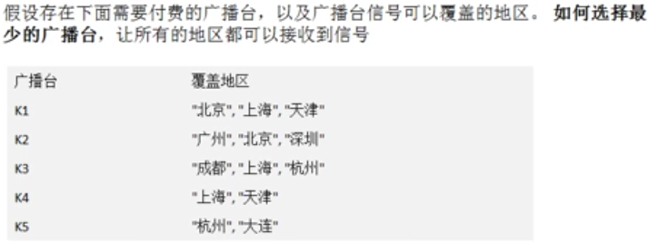

> 思路分析

1. 遍历所有广播电台，找到一个覆盖最多未覆盖的地区的电台（此电台肯能包含了一些已经覆盖的地区，但是没关系）
2. 将这些电台加入到一个集合中，想办法把该电台覆盖的地区在下次比较时去掉。
3. 重复第一步直到覆盖了全部地区。

> 代码实现

```java
public class GreedyAlgorithm {
    public static void main(String[] args) {
        // 1.定义所有电台存放的map
        HashMap<String, HashSet<String>> broadcasts = new HashMap<>();
        // 初始化k1电台
        String[] s1 = {"北京", "上海", "天津"};
        HashSet<String> set1 = new HashSet<>();
        set1.addAll(Arrays.asList(s1));
        // 初始化k2电台
        String[] s2 = {"广州", "北京", "深圳"};
        HashSet<String> set2 = new HashSet<>();
        set2.addAll(Arrays.asList(s2));
        // 初始化k3电台
        String[] s3 = {"成都", "上海", "杭州"};
        HashSet<String> set3 = new HashSet<>();
        set3.addAll(Arrays.asList(s3));
        // 初始化k4电台
        String[] s4 = {"上海", "天津"};
        HashSet<String> set4 = new HashSet<>();
        set4.addAll(Arrays.asList(s4));
        // 初始化k5电台
        String[] s5 = {"杭州", "大连"};
        HashSet<String> set5 = new HashSet<>();
        set5.addAll(Arrays.asList(s5));
        broadcasts.put("k1", set1);
        broadcasts.put("k2", set2);
        broadcasts.put("k3", set3);
        broadcasts.put("k4", set4);
        broadcasts.put("k5", set5);

        // 2.所有的区域集合
        HashSet<String> allAreas = new HashSet<>();
        String[] areas = {"北京", "上海", "天津", "广州", "深圳", "成都", "杭州", "大连"};
        allAreas.addAll(Arrays.asList(areas));

        ArrayList<String> broadList = new ArrayList<>(); //存放每次覆盖最多区域的电台

        // 3.计算覆盖全部地区的电台集合（贪心算法）
        HashSet<String> tmpSet = new HashSet<>();  //存放临时区域交集
        String maxKey = null;  // 临时覆盖区域最多的电台
        Set<String> keySet = broadcasts.keySet();
        while(allAreas.size() > 0) {
            maxKey = null;  // 每一次while循环需将maxKey置空
            for (String key : keySet) {
                tmpSet.clear();  // 每一次for循环需将tmpSet清空
                HashSet<String> areaSet = broadcasts.get(key);
                tmpSet = areaSet;
                tmpSet.retainAll(allAreas);
                if (tmpSet.size() > 0 && (maxKey == null || broadcasts.get(maxKey).size() < tmpSet.size())) {
                    maxKey = key;
                }
            }
            if (maxKey != null) {
                broadList.add(maxKey);
                allAreas.removeAll(broadcasts.get(maxKey));
            }
        }

        System.out.println(broadList);
    }
}
```

#### 11.6普利姆算法(修路)

> 应用场景-修路问题


> 最小生成树

修路问题本质问题就是==最小生成树问题==，先介绍一下最小生成树，==简称MST==

1. 给定一个带权的无向连通图，如何选取一颗生成树，使树上所有==边上权的总和最小==，这就是最小生成树
2. N个顶点，一定有N-1条边
3. 包含全部顶点
4. N-1条边都在图中
5. 举例说明，如下图：
6. 求最小生成树的算法主要是==普利姆算法==和==克鲁斯卡尔算法==


> 普利姆算法思路图解


> 代码实现

```java
public class PrimAlgorithm {
    public static void main(String[] args) {
        // 测试
        char[] data = {'A', 'B', 'C', 'D', 'E', 'F', 'G'};
        int verxs = data.length;
        // 邻接矩阵的关系使用二维数组表示, 10000这个大数，表示两个点之间不连通
        int[][] weight = new int[][]{
                {10000, 5, 7, 10000, 10000, 10000, 2},
                {5, 10000, 10000, 9, 10000, 10000, 3},
                {7, 10000, 10000, 10000, 8, 10000, 10000},
                {10000, 9, 10000, 10000, 10000, 4, 10000},
                {10000, 10000, 8, 10000, 10000, 5, 4},
                {10000, 10000, 10000, 4, 5, 10000, 6},
                {2, 3, 10000, 10000, 4, 6, 10000}
        };
        // 创建MGraph对象
        MGraph mGraph = new MGraph(verxs);
        // 创建MinTree对象
        MinTree minTree = new MinTree();
        minTree.createGraph(mGraph, verxs, data, weight);
        minTree.showGraph(mGraph);

        // 测试prim算法
        minTree.prim(mGraph, 1);

    }
}

/**
 * 创建最小生成树-> 村庄的图
 */
class MinTree {
    /**
     * 创建图对象
     * @param graph 图对象
     * @param verxs 图的顶点个数
     * @param data 图的顶点数据存放的数组
     * @param weight  图的边->邻接矩阵
     */
    public void createGraph(MGraph graph, int verxs, char[] data, int[][] weight) {
        int i, j;
        for (i = 0; i < verxs; i++) {
            graph.data[i] = data[i];
            for (j = 0; j < verxs; j++) {
                graph.weight[i][j] = weight[i][j];
            }
        }
    }

    /**
     * 显示图的邻接矩阵
     * @param graph 图对象
     */
    public void showGraph(MGraph graph) {
        for (int[] link : graph.weight) {
            System.out.println(Arrays.toString(link));
        }
    }

    /**
     * 普利姆算法
     * @param graph 图对象
     * @param v 表示从哪个节点开始  v表示节点的下标
     */
    public void prim(MGraph graph, int v) {
        int[] visited = new int[graph.verxs];
        visited[v] = 1;
        int minWeight = 10000;
        int h1 = -1;
        int h2 = -1;
        // verxs个节点，普利姆算法结束以后就会有verxs-1条边  k每循环一次就会生成一条边
        for (int k = 1; k < graph.verxs; k++) {

            for (int i = 0; i < graph.verxs; i++) { // i表示已经访问过的节点
                for (int j = 0; j < graph.verxs; j++) {  // j表示没有被访问过的节点
                    if (visited[i] == 1 && visited[j] == 0 && graph.weight[i][j] < minWeight) {
                        minWeight = graph.weight[i][j];
                        h1 = i;
                        h2 = j;
                    }
                }
            }
            minWeight = 10000;
            visited[h2] = 1;
            System.out.println("<" + graph.data[h1] + "," + graph.data[h2] + "> 边的权值是：" + graph.weight[h1][h2]);
        }
    }
}


/**
 * 图类
 */
class MGraph {
    int verxs;  // 表示图的节点个数
    char[] data;  // 表示图节点数据
    int[][] weight;  // 存放边，就是图的邻接矩阵
    public MGraph(int verxs) {
        this.verxs = verxs;
        data = new char[verxs];
        weight = new int[verxs][verxs];
    }
}

```

