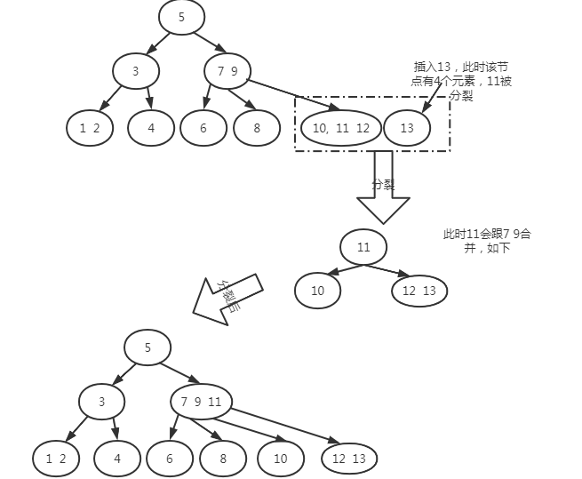

### 一、二叉查找树

> 定义

树的概念

**二叉树**：每个子节点只有两个节点的树

**二叉查找树**（二叉搜索树）：就是一棵二叉树，它的左节点比父节点要小，右节点比父节点要大。它的高度决定查找效率。


**常见操作**

**查找**（红黑树通用）：查找每个节点我们从根节点开始查找

* 查找值比当前值大，则搜索右子树
* 查找值等于当前值，停止查找，返回当前节点
* 查找值比当前值小，则搜索左子树

**插入**：要插入节点必须找到插入节点的位置。依然是从根节点开始比较，小于根节点的话就跟左子树比较，反之与右子树比较，直到左子树为空或者右子树为空，则插入到相应位置。

**遍历（红黑树通用）**：

* 前序遍历：中->左->右
* 中序遍历：左->中->右
* 后序遍历：左->右->中

**查找最小值（红黑树通用）**:沿着左子树一路查找，直到叶子节点即为最小值

**查找最大值（红黑树通用）：**沿着右子树一路查找，直到叶子节点为最大值

**查找前驱节点(红黑树通用)**：小于当前节点最大值

**查找后继节点（红黑树通用）**：大于当前节点最小值

**删除：**==本质上找前驱节点或后继节点来替代==

* 叶子节点直接删除（没有前驱节点或后继节点）
* 只有一个子节点的用子节点替代（本质上就是找到前驱节点或者后继节点，左节点就是前驱节点，右节点就是后继节点）
* 有两个子节点的，需要找到替代节点（替代节点就是前驱节点或者后继节点）

==删除操作和红黑树一样，只不过红黑树多了着色和旋转过程==

### 二、平衡查找二叉树（BBST）

二叉查找树（BST）存在的问题是，树在插入的时候会导致倾斜，不同的插入顺序会导致树的高度不一样，而树的高度直接影响了树的查询效率。最坏的情况所有的节点都在一条斜线上，这样树的高度为N。

基于二叉查找树存在的问题，==平衡查找二叉树==（BBST）产生了。平衡树的插入和删除的时候，会通过旋转操作将高度保持在logN。其中两款具有代表性的平衡树分别是==AVL树==高度平衡树，具备二叉搜索树的全部特性，而且左右子树高度差不超过1）和==红黑树==。

**avl树如何实现平衡？**

通过左旋或者右旋

> 面试题：有了avl树为什么还要红黑树呢？？

avl树由于实现比较复杂，而且插入和删除性能差（为什么？），在实际环境中应用不如红黑树。

红黑树的实际应用非常广泛，如java中的HashMap和TreeSet，java8中HashMap的实现因为用RBTree代替链表（链表长度>8时），性能有所提升。


由上图可以看出，avl树要求树的左子树和右子树的高度差不超过1，因此在插入的时候需要多次旋转操作，在增删操作的时候性能会比较低；

而红黑树只要求黑节点高度差不超过1，这样就减少了增删时的旋转操作。因此对于增删操作来说性能比avl树要高。而对于查找操作来说性能稍微比avl低一点。

### 三、2-3-4树

> 定义

2-3-4树是四阶的B树（Banlance Tree）,他属于一种多路查找树，它的结构有以下限制：

* 所有叶子节点都拥有相同深度
* 节点只能是2节点、3节点、4节点之一
  * 2节点：包含1个元素的节点，有2个子节点；
  * 3节点：包含两个元素的节点，有3个子节点；
  * 4节点：包含3个元素的节点，有4个子节点；
  * 所有节点必须包含至少1个元素。
* 元素始终保持排列顺序，整体上保持二叉查找树性质，即父节点大于左子节点，小于右子节点；而且节点有多个元素时，每个元素必须大于它左边和它的左子树中元素


2-3-4树的查询操作像普通的二叉搜索树一样，非常简单，但由于其节点元素树不确定，在一些编程语言中实现起来不方便，实现一般使用它的等同--红黑树。

> **2-3-4树的插入操作：**

1. 满足二叉查找树的规则，左边小，右边大
2. 找到要合并的节点（一定在叶子节点）进行合并，合并之后如果该节点元素数大于3，就分裂中间的一个，往上生长。该特点保证了==2-3-4树一定是一个满二叉树==
3. 如下，在上图的基础上插入13

   

### 四、2-3-4树转变为红黑树

**红黑树的本质其实就是2-3-4树**

> 2-3-4树与红黑树的等价关系


> 2-3-4树转为红黑树


==因为3-节点可以左倾或者右倾，因此一个2-3-4树可能会生成多个不同形态的红黑树==

### 五、红黑树

> 定义

红黑树是一种节点带颜色属性的二叉查找树，但它在二叉查找树之外，还有5大性质：

1. 节点是黑色或者红色
2. 根节点是黑色
3. 所有叶子都是黑色（叶子是nil节点，这类节点不可以忽略，否则代码会看不懂）
4. 每个红色节点必须有两个黑色的子节点。（从每个叶子到跟上不能有两个连续的红色节点）
5. 从任意节点到其每个每个叶子的所有简单路径都包含相同数目的黑色节点（黑色平衡）


一般情况下省略其中的nil节点，如下图：


> 常见操作

**变色：**节点的颜色由黑变红或由红变黑

**左旋：**==以某个节点为旋转点，其右子节点变为旋转节点的父节点，右子节点的左子节点变为旋转节点的右子节点，左子节点保持不变==

**右旋：**以某个节点为旋转点，其左子节点变为旋转节点的父节点，左子节点的右子节点变为旋转节点的左子节点，右子节点保持不变


> 左旋、右旋代码实现

```java
/**
 * @description: 红黑树（节点之间的指针是双线的）
 **/
public class RBTree {
    private boolean RED = false;
    private boolean BLACK = true;
    private RBNode root;    // 根节点

    /**
     * 围绕p节点左旋
     *             pf                           pf
     *           /                            /
     *          p                           pr(r)
     *         / \                         / \
     *        pl  pr(r)        ====>      p   rr
     *           / \                    /  \
     *          rl  rr                 pl   rl
     * @param p
     */
    private void leftRotate(RBNode p) {
        if (p != null) {
            RBNode r = p.right;
            p.right = r.left;
            if (r.left != null) {
                r.left.parent = p;
            }
            r.left = p;
            r.parent = p.parent;
            if (p.parent == null) {
                root = r;
            }else if (p.parent.left == p) {
                p.parent.left = r;
            }else if (p.parent.right == p) {
                p.parent.right = r;
            }
            p.parent = r;
        }
    }

    /**
     * 围绕p节点的右旋操作
     * @param p
     */
    private void rightRotate(RBNode p) {
        if (p != null) {
            RBNode l = p.left;
            p.left = l.right;
            if (l.right != null) {
                l.right.parent = p;
            }
            l.right = p;
            l.parent = p.parent;
            if (p.parent == null) {
                root = l;
            }else if (p.parent.right == p) {
                p.parent.right = l;
            }else if (p.parent.left == p) {
                p.parent.left = l;
            }
            p.parent = l;
        }
    }

    /**
     * 节点类
     * @param <K>
     * @param <V>
     */
    static class RBNode<K extends Comparable<K>, V> {
        private RBNode parent;
        private RBNode left;
        private RBNode right;
        private boolean color;
        private K k;
        private V v;

        public RBNode() {
        }

        public RBNode(RBNode parent, RBNode left, RBNode right, boolean color, K k, V v) {
            this.parent = parent;
            this.left = left;
            this.right = right;
            this.color = color;
            this.k = k;
            this.v = v;
        }

        public RBNode getParent() {
            return parent;
        }

        public void setParent(RBNode parent) {
            this.parent = parent;
        }

        public RBNode getLeft() {
            return left;
        }

        public void setLeft(RBNode left) {
            this.left = left;
        }

        public RBNode getRight() {
            return right;
        }

        public void setRight(RBNode right) {
            this.right = right;
        }

        public boolean isColor() {
            return color;
        }

        public void setColor(boolean color) {
            this.color = color;
        }

        public K getK() {
            return k;
        }

        public void setK(K k) {
            this.k = k;
        }

        public V getV() {
            return v;
        }

        public void setV(V v) {
            this.v = v;
        }
    }
}
```

