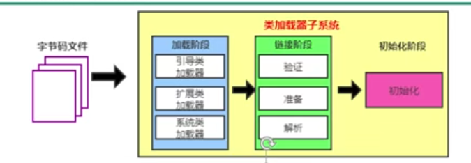
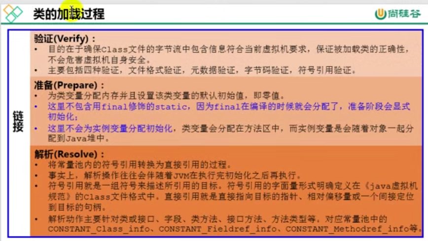
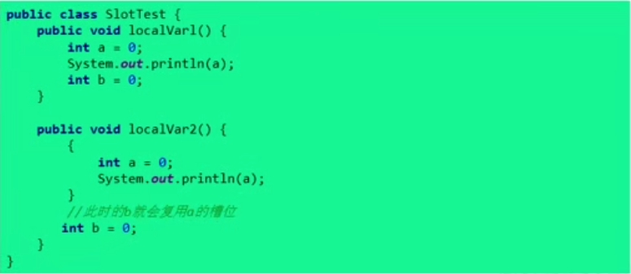

### 一、jvm概述

#### 1.1为什么要学习jvm

```java
1.面试需要；
2.中高级程序员必备技能
	项目管理、调优的需要；
3.追求极客的精神
	比如：垃圾回收算法、JIT（即时编译器）、底层原理。
```

#### 1.2java vs C++


```java 
	垃圾收集机制为我们打理了很多繁琐的工作，大大提高了开发的效率，但是垃圾收集也不是万能的，懂得JVM内部的内存结构、工作机制，是设计搞扩展性应用和诊断运行时问题的基础，也是java工程师进阶的必备技能。
```

#### 1.3JVM：跨语言的平台


```java
* 随着java7的正式发布，java虚拟机的设计者们通过JSR-292规范基本实现在java虚拟机平台上运行非java语言编写的程序。
* java虚拟机根本不关心运行在其内部的程序到底是使用何种编程语言编写的，它只关心“字节码”文件。也就是说java虚拟机具有语言无关性，并不会单纯的与java语言“终身绑定”，只要其他编程语言的编译结果满足并包含java虚拟机的内部指令集、符号表以及其他信息，他就是一个有效的字节码文件，就能够被虚拟机所识别并装载运行。

//总结：java不是最强大的语言，但是JVM是最强大的虚拟机。
```

#### 1.4字节码

```
1.我们平时说的java字节码，指的是用java语言编译成的字节码。准确的说任何能在jvm平台上执行的字节码格式都是一样的。所以应该统称为：jvm字节码。
2.不同的编译器，可以编译出相同的字节码文件，字节码文件也可以在不同的jvm上运行。
3.java虚拟机与java语言并没有必然的联系，它只与特定的二进制文件格式-class文件格式所关联，class文件中包含了java虚拟机指令集（或者称为字节码、Bytecodes）和符号表，还有一些其他辅助信息。
```

#### 1.5多语言混合编程

```java
	//java平台上的多语言混合编程正成为主流，通过特定领域的语言去解决特定领域的问题是当前软件开发应对日趋复杂的项目需求的一个方向。
	试想一下，在一个项目中，并行处理用Clojure语言编写，展示层使用JRuby/Rails,中间层则是用java，每个应用层都将使用不同的编程语言来完成，而且，接口对每一层的开发者都是透明的，//各种语言之间的交互不存在任何困难，就像使用自己语言的原生API一样方便，因为他们最终都运行在一个虚拟机之上。
	对于运行于java虚拟机之上、java之外的语言，来自系统级的、底层的支持正在迅速增强，以JSR-292为核心的一系列项目和功能改进（如DaVinci Machine项目、Nashorn引擎、InvokeDynamic指令、java.lang.invoke包等），//推动java虚拟机从“java语言的虚拟机”向“多语言虚拟机”的方向发展。
```

#### 1.6虚拟机与java虚拟机介绍

```java
1.所谓虚拟机（Virtual Machine）,就是一台虚拟的计算机。它是一款软件，用来执行一系列虚拟计算机指令。大体上，虚拟机可以分为/*系统虚拟机*/ 和 /*程序虚拟机*/。
	大名鼎鼎的Visual Box,VMWare就属于系统虚拟机，他们完全是对物理计算机的仿真，提供了一个可运行完整操作系统的软件平台。
	程序虚拟机的典型代表就是java虚拟机，它专门为执行单个计算机程序而设计，在java虚拟机中执行的指令我们称为java字节码指令。
2.无论是系统虚拟机还是程序虚拟机，在上面运行的软件都被限制于虚拟机提供的资源中。

3.java虚拟机
	1）java虚拟机是一台执行java字节码的虚拟机计算机，他拥有独立的运行机制，其运行的java字节码也未必由java语言编译而成。
	2）JVM平台的各种语言可以共享java虚拟机带来的跨平台性、优秀的垃圾回收器，以及可靠的即时编译器。
	3）/*java技术的核心就是java虚拟机（java virtual machine）*/，因为所有java程序都运行在java虚拟机内部。
	4）作用：java虚拟机就是二进制字节码的运行环境，负责装载字节码到齐内部，解释/编译为对应平台上机器指令执行。每一条java指令，java虚拟机规范中都有详细定义，如怎么取操作数，怎么处理操作数，处理结果放在哪。
	5）特点：  
		a)一次编译，到处运行；
		b)自动内存管理；
		c）自动垃圾回收功能；
```

#### 1.7JVM的整体结构


#### 1.8java代码执行流程


#### 1.9JVM的架构模型

```java
java编译器输入的指令流基本上是一种基于/*栈的指令集架构*/，另一种指令集架构则是基于/*寄存器的指令集架构*/。
具体来说：这两种架构之间的区别：
	1.基于栈式架构的特点：
		1）设计和实现更简单，适用于资源受限的系统；
		2）避开了寄存器的分配难题：使用了零地址指令方式分配；
		3）指令流中的指令大部分是零地址指令，其执行过程依赖于操作栈。指令集更小，编译器容易实现。
		4）不需要硬件支持，可移植性更好，更好实现跨平台。
	2.基于寄存器架构的特点：
		1）典型的应用是x86的二进制指令集：比如传统的pc以及Android的davlik虚拟机；
		2）/*指令集架构则完全依赖硬件，可移植性差*/；
		3）/*性能优秀，执行更高效*/；
		4）花费更少的指令去完成一项操作；
		5）在大部分情况下，基于寄存器架构的指令集往往都是以一地址指令、二地址指令和三地址指令为主，而基于栈式架构的指令集却是以零地址指令集为主。
```


**总结**

```java
/*由于跨平台性的设计，java的指令都是根据栈来设计的。*/不同平台CPU架构不同，所以不能设计为基于寄存器的。
优点是：跨平台、指令集小，编译器容易实现；
缺点是：性能下降，实现同样的功能需要更多的指令；
```

#### 1.10.JVM的生命周期

```java
1.虚拟机的启动：
	java虚拟机的启动是通过引导类加载器（bootstrap class loader）创建一个初始类（initial class）来完成的，这个类是由虚拟机的具体实现指定的。
2.虚拟机的执行：
	*一个运行中的java虚拟机有着一个清晰的任务：执行java程序；
	*程序开始执行时它才运行，程序结束时它就停止；
	*/*执行一个所谓的java程序的时候，真真正正在执行的是一个叫做java虚拟机的进程*/
3.虚拟机的退出：
	有如下几种情况：
	*程序正常执行结束；
	*程序在执行中遇到了异常或错误而异常终止；
	*由于操作系统出现错误而导致java虚拟机进程终止；
	*某线程调用Runtime类或System类的exit方法，或Runtime类的halt方法，并且java安全管理器也允许这次exit或halt操作；
	*除此之外，JNI(Java Native Interface)规范描述了用JNI Invocation API来加载或卸载java虚拟机时，java虚拟机的退出情况。
```

#### 1.11JVM发展历程

##### 1.11.1Sun Classic VM

```java 
1.早在1996年java1.0版本的时候，Sun公司发布了一款名为Sun Classic VM的java虚拟机，它同时也是/*世界上第一款商用java虚拟机*/，jdk1.4时完全淘汰。
2.这款虚拟机内部只提供解释器，而没有即时编译器。
3.如果使用JIT编译器，就需要进行外挂。但是一旦使用JIT编译器，JIT就会接管虚拟机的执行系统。解释器就不再工作。解释器和即时编译器不能配合工作。
4.现在hotspot内置了此虚拟机。

/*注：解释器：逐行解释代码，开启快，执行慢；
	 即时编译器：把所有代码预编译好，开启慢，执行快；
	 一般需要将热点代码采用即时编译器，非热点代码使用解释器，解释器和即时编译器配合工作效率最高*/
```

##### 1.11.2Exact VM

```java 
1.为了解决上一个虚拟机问题，jdk1.2时，sun提供了此虚拟机。
2.Exact Memory Management:准确式内存管理
	虚拟机可以知道内存中某个位置的数据具体是什么类型。
3.具备现代高性能虚拟机的雏形：
	热点探测；
	编译器与解释器混合工作模式；
4.只在Solaris平台短暂使用，其他平台上还是classic VM
	英雄气短，终被hotspot虚拟机替换。
```

##### **1.11.3HotSpot VM**

```java 
1.HotSpot VM历史：
	1）最初由一家名为"Longview Technologies"的小公司设计；
	2）1997年，此公司被sun公司收购；2009年，sun公司被甲骨文收购；
	3）jdk1.3时，HotSpot VM称为默认虚拟机；
2./*目前HotSpot占有绝对市场地位，称霸武林。*/
	1）不管是现在仍在广泛使用的jdk6，还是使用比例比较多的jdk8中，默认的虚拟机都是Hotspot
	2）sun/oracle jkd和openjdk的默认虚拟机
	3）因此本资料默认介绍的虚拟机都是Hotspot，相关机制也主要指Hotspot的GC机制。
3.从服务器、桌面到移动端、嵌入式都有应用。
4.名称中的Hotspot指的就是它的热点代码探测技术。
	1）通过计数器找到最具价值编译代码，触发即时编译或栈上替换；
	2）通过编译器与解释器协同工作，在最优化的程序响应时间与最佳执行性能中取得平衡。
```

##### **1.11.4BEA的JRockit**

```java 
1./*专注于服务器端应用：*/
	它可以不太关注程序启动速度，因此JRockit内部不包含解析器实现，全部代码都靠即时编译器编译后执行。
2.大量的行业基准测试显示，//JRockit JVM是世界上最快的JVM。
	使用JRockit产品，客户已经体验到了显著的性能提高（一般超过70%）和硬件成本的减少（达50%）；
3.优势：全面的java运行时解决方案组合
	JRockit面向延迟敏感性应用的解决方案JRockit Real Time提供以毫秒或微秒级的JVM响应时间，适合财务、军事指挥、电信网络的需要。
	MissionControl服务套件，它是一组以极低的开销来监控、管理和分析生产环境中的应用程序的工具。
4.2008年，BEA被Oracle收购。
5.Oracle表达了整合两大优秀虚拟机的工作，大致在jdk8中完成。整合的方式是在Hotspot的基础上，移植JRockit的优秀特性。
```

##### **1.11.5IBM的J9**

```java
1.全称：IBM Technology for Java Virtual Machine,简称IT4J，内部代码：J9
2.市场定位与Hotspot接近，服务器端、桌面应用、嵌入式等多用途VM
3.广泛应用于IBM的各种java产品。
4.目前，/*有影响力的三大商用虚拟机之一（Hotspot、JRockit、J9）*/，也号称是世界上最快的java虚拟机。
5.2017年左右，IBM发布了开源J9 VM，命名为OpenJ9,交给eclipse基金会管理，也称为eclipse OpenJ9.
```

### 二、类加载子系统

#### 2.1内存结构概述


#### 2.2类加载器与类的加载过程



```java
1.类加载器子系统负责从文件系统或网络中加载class文件，class文件在文件开头有特定文件标识。
2.ClassLoader只负责class文件的加载，至于它是否可以运行，则由Execution Engine决定。
3.加载的类信息存放于一块称为方法区的内存空间。除了类的信息外，方法区中还会存放运行时常量池信息，可能还包括字符串字面量和数字常量（这部分常量信息是class文件中常量池部分的内存映射）
```

**类加载器ClassLoader角色**


```java
1.class file存在于本地硬盘上，可以理解为设计师画在纸上的模板，而最终这个模板在执行的时候是要加载到JVM当中来根据这个文件实例化出n个一模一样的实例。
2.class file 加载到JVM中，被称为DNA元数据模板，此过程就要一个运输工具（类装载器 class loader），扮演一个快递员的角色。
```

**类的加载过程**


​	假设现在有一个类HelloLoader,它的加载过程如下图：


##### 2.2.1类的加载过程一：loading

```java
加载：
	1.通过一个类的全限定名获取定义此类的二进制字节流；
	2.将这个字节流所代表的静态存储结构转化为方法区的运行时数据结构；
	3./*在内存中生成一个代表这个类的java.lang.Class对象*/，作为方法区这个类的各种数据访问入口。
补充：（可以从哪些地方进行加载）
	从本地系统中直接加载；
	通过网络获取，典型场景是：Web Applet
	从zip压缩包中读取，称为日后jar、war格式的基础
	运行时计算生成，使用最多的是动态代理技术
	由其他文件生成，典型的场景是：jsp应用
	从专有数据库中提取.class文件，比较少见
	从加密文件中获取，典型的防Class文件被反编译的保护措施。
```

##### 2.2.2类的加载过程二：linking



##### 2.2.3类加载过程三：Initialization


##### 2.2.4类加载器


```java
//代码示例
 public static void main(String[] args) {
        //获取系统类加载器
        ClassLoader systemClassLoader = ClassLoader.getSystemClassLoader();
        System.out.println(systemClassLoader); //sun.misc.Launcher$AppClassLoader@18b4aac2
        
        //获取其上层，扩展类加载器
        ClassLoader extClassLoader = systemClassLoader.getParent();
        System.out.println(extClassLoader); //sun.misc.Launcher$ExtClassLoader@4554617c

        //获取其上层，获取不到引导类加载器
        ClassLoader bootstrapClassLoader = extClassLoader.getParent();
        System.out.println(bootstrapClassLoader); //null

        //获取自定义类的类加载器(对于用户自定义类来说，默认使用系统类加载器进行加载)
        ClassLoader classLoader = ClassLoaderTest.class.getClassLoader();
        System.out.println(classLoader); //sun.misc.Launcher$AppClassLoader@18b4aac2

        //String类使用引导类加载器进行加载的（java的核心类库都是使用引导类加载器加载的）
        System.out.println(String.class.getClassLoader()); //null
    }


//注：引导类加载器（bootstrap ClassLoader是C++语言编写的）
```

**类加载器的分类**

```java
1.启动类加载器（引导类加载器，Bootstrap ClassLoader）
	1)/*这个类加载使用C/C++语言实现的，嵌套在JVM内部。*/
	2）/*它用来加载java的核心类库*/（JAVA_HOME/jre/lib/rt.jar、resource.jar或sun.boot.class.path路径下的内容），用于提供JVM自身需要的类。
	3）/*并不继承自java.lang.ClassLoader,没有父加载器。*/
	4）加载扩展类和应用程序类加载器，并指定为他们的父类加载器。
	5）处于安全考虑，Bootstrap启动类加载器只加载包名为java、javax、sun等开头的类。
    
2.扩展类加载器（Extension ClassLoader）
	1)/*java语言编写，*/由sun.misc.Launcher$ExtClassLoader实现；
	2）//派生于ClassLoader类；
	3）父类加载器为启动类加载器；
	4）从java.ext.dirs系统属性所指定的目录中加载类库，或从JDK的安装目录的jre/lib/ext子目录（扩展目录）下加载类库。/*如果用户创建的jar凡在此目录下，也会自动有扩展类加载器加载*/
	
3.应用程序类加载器（系统类加载器，AppClassLoader）
	1)/*java语言编写，*/由sun.misc.Launcher$ExtClassLoader实现；
	2）//派生于ClassLoader类；
	3）父类加载器为扩展类加载器；
	4）他负责加载环境变量classpath或系统属性java.class.path指定路径下的类库；
	5）/*该类加载器是程序中默认的类加载器，*/一般来说，java应用中的类都是由他完成加载；
	6）通过ClassLoader.getSystemClassLoader()方法可以获取到该类加载器；
	
//对于引导类加载器和扩展类加载器的代码示例如下图：
```


```java
4.用户自定义类加载器
	在java的日常应用程序开发中，类的加载几乎是由上述3种类加载器相互配合执行的，在必要时，我们还可以自定义类加载器，来定制类的加载方式。
	为什么要自定义类加载器？
		1）隔离加载类；
		2）修改类加载的方式；
		3）扩展加载源；
		4）防止源码泄漏；
	用户自定义类加载器实现步骤：
		1）开发人员可以通过继承抽象类java.lang.ClassLoader类的方式，实现自己的类加载器，以满足一些特殊的需求；
		2）在JDK1.2之前，在自定义类加载器时，总会去继承ClassLoader类并重写loaderClass（）方法，从而实现自定义的类加载器，但是在JDK1.2之后已不再建议用户去覆盖loadClass()方法，而是建议把自定义的类加载逻辑写在findClass()方法中；
		3）在编写自定义类加载器时，如果没有太过于复杂需求，可以直接继承URLClassLoader类，这样就可以避免自己去写findClass()方法及其获取字节码流的方式，使自定义类加载器编写更加简洁；
```

**ClassLoader的常用方法及获取方法**

```java
ClassLoader类，它是一个抽象类，其后所有的类加载器都继承自ClassLoader(不包括启动类加载器)
```


**获取ClassLoader的途径**


```java
//方式一
ClassLoader classLoader = Class.forName("java.lang.String").getClassLoader();
System.out.println(classLoader); //null

//方式二
ClassLoader contextClassLoader = Thread.currentThread().getContextClassLoader();
System.out.println(contextClassLoader); //sun.misc.Launcher$AppClassLoader@18b4aac2

//方式三
ClassLoader systemClassLoader = ClassLoader.getSystemClassLoader();
System.out.println(systemClassLoader); //sun.misc.Launcher$AppClassLoader@18b4aac2
```

#### 2.3双亲委派机制

```java
java虚拟机对class文件采用的是/*按需加载*/的方式，也就是说当需要使用该类时才会将它的class文件加载到内存生成class对象。而且加载某个类的class文件时，java虚拟机采用的是/*双亲委派模式*/，即把请求交由父类处理，它是一种任务委派模式。
```

##### **2.3.1工作原理**

```java
1.如果一个类加载器收到了类加载请求，它并不会自己先去加载，而是把这个请求委托给父类的加载器去执行；
2.如果父类加载器还存在其父类加载器，则进一步向上委托，依次递归，请求最终将到达顶层的启动类加载器；
3.如果父类加载器可以完成类加载任务，就成功返回，倘若父类加载器无法完成此加载任务，子加载器才会尝试自己去加载，这就是双亲委派模式；
```


**代码示例**


```java
如图自己定义一个java.lang.String类，在String类里定义一个main方法，执行main方法，会报错；
//原因分析；
因为自定义的String在java.lang包下，则会交由系统类加载器，然后系统类加载器将加载请求委派给扩展类加载器，扩展类加载器又将加载请求委派给引导类加载器；  引导类加载器可以加载java/javax/sun开头的类，因此这个加载请求就由引导类加载器去加载，但是java核心类库中的类没有main方法，此自定义String中的main方法就会报错；
```

##### 2.3.2双亲委派机制的优势

```java
1.避免类的重复加载；
2.保护程序安全，防止核心API被随意篡改，
	1）自定义类：java.lang.String;
	2)自定义类：java.lang.Fangyan;
	//以上两个自定义类均会报错，因为使用java开头的包，由引导类加载器加载，出于安全考虑，自定义的包名不能以java开头，不然可能带来安全隐患，比如自定义的java....类破坏引导类加载器。
```

#### 2.4沙箱安全机制

```java
自定义java.lang.String类，但是在加载自定义String类的时候会率先使用引导类加载器加载，而引导类加载器在加载过程中会先加载jdk自带的文件(rt.jar包中java.lang.String.class),报错信息说没有main方法，就是因为加载的是rt.jar包中的String类。这样可以保证对java核心源代码的保护，这就是沙箱安全机制。
```

#### 2.5其他

```java
1.在jvm中表示两个class对象是否为同一个类存在两个必要条件：
	1）类的完整类名必须一致；
	2）加载这个类的ClassLoader(指ClassLoader实例对象)必须相同；
2.换句话说，在jvm中，即使这两个类对象（class对象）来源同一个class文件，被同一个虚拟机所加载，但加载他们的ClassLoader实例对象不同，那么这两个类对象也是不相等的。

3.对类加载器的引用：
	JVM必须知道一个类型是由启动类加载器加载还是由用户类加载器加载的。如果一个类型是由用户类加载器加载的，那么JVM会/*将这个类加载器的一个引用作为类型信息的一部分保存在方法区中。*/当解析一个类型到另一个类型的引用的时候，JVM需要保证这两个类型的类加载器是相同的。
	
4.类的主动使用和被动使用：
	java程序对类的使用方式分为：主动使用和被动使用：
	主动使用又分为七种情况：
		1）创建类的实例；
		2）访问某个类或接口的静态变量，或对该静态变量赋值；
		3）调用类的静态方法；
		4）反射（比如：Class.forName("com.fy.Test")）;
		5)初始化一个类的子类；
		6）java虚拟机启动时被标明为启动类的类；
		7）jdk7开始提供的动态语言支持：
			java.lang.invoke.MethodHandle实例的解析结果REF_getStatic、REF_putStatic、REF_invokeStatic句柄对应的类没有初始化，则初始化；
	除了以上七种情况，//其他使用java类的方式都被看作是对类的被动使用，都不会导致类的初始化；
```

### 三、运行时数据区概述及线程


```java
	内存是非常重要的系统资源，是硬盘和CPU的中间仓库和桥梁，承载着操作系统和应用程序的实时运行。JVM内存布局规定了java在运行过程中内存的申请、分配、管理的策略，保证了JVM的高效稳定运行。/*不同的JVM对于内存的划分方式和管理机制存在着部分差异。*/结合JVM虚拟机规范，来探讨一下经典的JVM内存布局。
```

#### 3.1运行时数据区内部结构


```java
JAVA虚拟机定义了若干种程序运行期间会使用到的运行时数据区，其中有一些会随着虚拟机启动而创建，随着虚拟机退出而销毁。另外一些则是与线程一一对应的，这些与线程对应的数据区域会随着线程开始和结束而创建和销毁。
	灰色的为单线程私有的，红色的为多个线程共享的。即：
	1）每个线程：独立包括程序计数器、栈、本地栈；
	2）线程间共享：堆、堆外内存（永久代或元空间、代码缓存）
```

#### 3.2线程

```java
1.线程是一个程序的运行单元。JVM允许一个应用有多个线程并行执行。
2.在HotSpot JVM里，每个线程都与操作系统的本地线程直接映射；
	当一个java线程准备好执行以后，此时一个操作系统的本地线程也同时创建。java线程执行终止后，本地线程也会回收。
3.操作系统负责所有线程的安排调度到任何一个可用的CPU上。一旦本地线程初始化成功，他就会调用java线程中的run()方法。
```

**JVM系统线程**


### 四、程序计数器（PC寄存器）

#### 4.1程序计数器概述


```java
1.它是一块很小的内存空间，几乎可以忽略不计。也是运行速度最快的存储区域。
2.在JVM规范中，每个线程都有它自己的程序计数器，是线程私有的，生命周期与线程的生命周期保持一致。
3.任何时间一个线程都只有一个方法在执行，也就是所谓的/*当前方法*/。程序计数器会存储当前线程正在执行的java方法的JVM指令地址；或者，如果是在执行native方法，则是未指定值（undefined）。
4.它是程序控制流的指示器，分支、循环、跳转、异常处理、线程恢复等基础功能都需要依赖这个计数器来完成。
5.字节码解释器工作时就是通过改变这个计数器的值来选取下一条需要执行的字节码指令。
6.它是唯一一个在java虚拟机规范中没有规定任何OutOfMemoryError情况的区域。
```

#### 4.2程序计数器使用举例


#### 4.3两个面试题

```java
1.为什么使用PC寄存器记录当前线程执行地址呢？
	因为CPU需要不停的切换各个线程，这时候切换回来以后，就得直到接着从哪开始继续执行；
	JVM的字节码解释器就需要通过改变PC寄存器的值来明确下一条应该执行什么样的字节码指令。
	
2.PC寄存器为什么会被设定为线程私有？
	我们都知道所谓的多线程在一个特定的时间段内只会执行其中某一个线程的方法，CPU会不停的做任务切换，这样必然导致经常中断或恢复，如何保证分毫无差呢？/*为了能够准确的记录各个线程正在执行的当前字节码指令地址，最好的办法自然是为每一个线程都分配一个PC寄存器*/这样一来各个线程之间便可以进行独立运算，从而不会出现相互干扰的情况。
```

### 五、虚拟机栈

#### 5.1虚拟机栈概述

```java
1.虚拟机栈出现的背景：
	由于跨平台性设计，java的指令都是根据栈来设计的。不同平台CPU架构不同，所以不能设计为基于寄存器的。
	//优点是跨平台，指令集小，编译器容易实现，缺点是性能下降，实现同样的功能需要更多的指令。
2.内存中的栈与堆：
	//栈是运行时的单位，而堆是储存的单位。
	即：栈解决程序的运行问题，即程序如何执行，或者说如何处理数据。堆解决的是数据存储问题，即数据怎么放、放在哪？
```

**虚拟机栈基本内容**

```java
1.java虚拟机栈是什么？
	java虚拟机栈（java virtual machine stack），早期也叫java栈。每个线程在创建时都会创建一个虚拟机栈，其内部保存一个个的栈帧（stack frame），对应着一次次的java方法调用。
	是线程私有的。
2.生命周期：   和线程一致；
3.作用：
	主管java程序的运行，它保存方法的局部变量、部分结果，并参与方法的调用和返回。
```

**栈的特点（优点）**

```java
1.栈是一种快速有效的分配存储方式，访问速度仅次于程序计数器；
2.JVM直接对java栈的操作只有两个：
	每个方法执行，伴随着进栈（入栈、压栈）
	执行结束后的出栈工作；
3.对于栈来说不存在垃圾回收问题；
```

##### **5.1.1虚拟机栈中常见异常与如何设置栈大小**

```java
java虚拟机允许/*java栈的大小是动态的或者是固定不变的*/
    如果采用固定大小的java虚拟机栈，那每一个线程的java虚拟机栈容量可以在线程创建的时候独立选定。如果线程请求分配的栈容量超过java虚拟机栈允许的最大容量，java虚拟机将会抛出一个/*StackOverFlowError*/异常。（例：递归的时候没有终止就会无限调用自身方法，出现栈溢出）
    
    如果java虚拟机栈可以动态扩展，并且在尝试扩展的时候无法申请到足够的内存，或者在创建新的线程时没有足够的内存去创建对应的虚拟机栈，那java虚拟机将会抛出一个/*OutOfMemoryError*/异常。
```

**设置栈内存大小**

```java
我们可以使用参数-Xss选项来设置线程的最大栈空间，栈的大小直接决定了函数调用的最大可达深度。
默认是单位是byte，也可以指定单位为k/m/g：  -Xss256k

//测试
public class StackOverFlowErrorTest {

    private static int num = 1;

    public static void main(String[] args) {
        System.out.println(num);
        num++;
        main(args); //自身不断的调用自身，会报StackOverflowError异常
        //使用默认的栈大小最后打印的结果是11416
        //设置-Xss256k后最后打印的结果是2462
    }
}
```

#### 5.2栈的存储单位

##### 5.2.1栈中存储什么？

```java
1.每个线程都有自己的栈，//栈中的数据都是以栈帧（stack frame）的格式存在。
2.在这个线程上正在执行的每个方法都各自对应一个栈帧（stack frame）。
3.栈帧是一个内存区块，是一个数据集，维系着方法执行过程中的各种数据信息。
```

##### 5.2.2栈运行原理

```java
1.JVM直接对java栈的操作只有两个，就是对栈帧的/*压栈*/和/*出栈*/，遵循“先进后出”原则；
2.在一条活动线程中，一个时间点上，只会有一个活动的栈帧。即只有当前执行的方法的栈帧（栈顶栈帧）是有效的，这个栈帧被称为/*当前栈帧*/，与当前栈帧对应的方法就是/*当前方法*/，定义这个方法的类就是/*当前类*/。
3.执行引擎运行的所有字节码指令只针对当前栈帧进行操作。
4.如果在该方法中调用了其他方法，对应的新的栈帧会被创建出来，放在栈的顶端，称为新的当前栈帧。
5.不同线程中所包含的栈帧是不允许存在相互引用的，即不可能在一个栈帧之中引用另外一个线程的栈帧。
6.如果当前方法调用了其他方法，方法返回之际，当前栈帧会传回此方法的执行结果给前一个栈帧，接着，虚拟机会丢弃当前栈帧，使得前一个栈帧重新成为当前栈帧。
7.java方法有两种返回函数的方式，//一种是正常函数返回，使用return指令；另外一种是抛出异常。不管使用哪种方式，都会导致栈帧被弹出。
```

##### 5.2.3栈帧的内部结构

```java
每个栈帧中存储着：
1）局部变量表（local variables）
2)操作数栈（operand stack）(或表达式栈)
3）动态链接（Dynamic Linking）(或指向运行时常量池的方法引用)
4）方法返回地址（return address） (或方法正常退出或者异常退出的定义)
5）一些附加信息
```


#### 5.3局部变量表（Local Variables）

```java 
1.局部变量表也被称为局部变量数组或本地变量表；
2./*定义一个数字数组，主要用于存储方法参数和定义在方法体内的局部变量*/这些数据类型包括各类基本数据类型、对象引用（reference）,以及returnAddress类型。
3.由于局部变量表是建立在线程的栈上，是线程私有数据，因此//不存在数据安全问题。
4./*局部变量表所需的容量大小是在编译器确定下来的*/并保存在方法的code属性的maximum local variables数据项中。在方法运行期间是不会改变局部变量表的大小的。
5./*方法嵌套调用的次数由栈的大小决定。*/一般来说，/*栈越大，方法嵌套调用次数越多*/
6./*局部变量表中的变量只在当前方法调用中有效。*/在方法执行时，虚拟机通过使用局部变量表完成参数值到参数变量列表的传递过程。//当方法调用结束后，随着方法栈帧的销毁，局部变量表也会随之销毁。
```

##### 5.3.1关于slot（变量槽）的理解

```java
1.参数的值存放总是在局部变量数组的index0开始，到数组长度-1的索引结束；
2.局部变量表，/*最基本的存储单元是slot(变量槽)*/
3.局部变量表中存放编译期可知的各种基本数据类型（8种），引用类型（reference），returnAddress类型的变量；
4.在局部变量表中，/*32位以内的类型只占用一个slot(包括returnAddress类型)，64位的类型（long和double）占用两个slot*/
	1）byte、short、char在存储前被转换为int，boolean也被转换为int，0表示false，非0表示true。
	2）long和double则占据两个slot。
5.JVM会为局部变量表中的每一个slot都分配一个访问索引，通过这个索引即可成功访问到局部变量表中指定的局部变量值（如果是占据两个slot的，则访问其实索引即可）
6.当一个实例方法被调用时，它的方法参数和方法体内部定义的局部变量将会/*按照顺序被复制*/到局部变量表中的每一个slot上。
7.//如果需要访问局部变量表中一个64bit的局部变量值时，只需要使用前一个索引即可。（比如访问long和double型的变量）
8.如果当前帧是由构造方法或者实例方法创建的，那么/*该对象引用this将会存放在index为0的slot处*/，其余参数按照参数表顺序继续排列。
```


第8点演示：（使用glib插件）


```java
9.slot的重复利用：
	/*栈帧zhogn的局部变量表中的槽位是可以重复的*/，如果一个局部变量过了其作用域，那么在其作用域之后声明的新的局部变量就很有可能会复用过期局部变量的槽位，从而达到节省资源的目的。
```



##### 5.3.3静态变量与局部变量的对比

```java
1.参数表分配完毕后，再根据方法体内定义的变量顺序和作用域分配；
2.我们知道类变量有两次初始化机会，第一次是在“准备阶段”，执行系统初始化，对类变量设置零值，另一次是在“初始化”阶段，赋予程序员在代码中定义的初始值；
3.和类变量初始化不同的是，局部变量不存在系统初始化的过程，这意味着一旦定义了局部变量则必须人为的初始化，否则无法使用。
```


##### 5.3.4补充说明

```java
1.在栈帧中，与性能调优关系最为密切的部分就是局部变量表。在方法执行时，虚拟机使用局部变量表完成方法传递。
2.//局部变量表中的变量也是重要的垃圾回收根节点，只要被局部变量表中直接或间接引用的对象都不会被回收。
```

#### 5.4操作数栈（Operand Stack）

```java 
1.每一个独立的栈帧中除了包含局部变量表以外，还包含一个后进先出的操作数栈，也可以称之为表达式栈(Expression Stack).
2.操作数栈，在方法执行过程中，根据字节码指令，往栈中写入数据或提取数据，即入栈/出栈。
	1）某些字节码指令将值压入操作数栈，其余的字节码指令将操作数去出栈。使用他们后再把结果压入栈。
	2）比如：执行复制、交换、求和等操作。
```


```java
3.操作数栈，//主要用于保存计算过程的中间结果，同时作为计算过程中变量临时存储空间。
4.操作数栈就是JVM执行引擎的一个工作区，当一个方法刚开始执行的时候，一个新的栈帧也会随之被创建出来，//这个方法的操作数栈是空的。
5.每一个操作数栈都会拥有一个明确的栈深度用于存储数值，其所需的最大深度在编译期就定义好了，保存在方法的code属性中，为max_stack的值。
6.栈中的任何一个元素都是可以任意的java数据类型。
	32bit的类型占用一个栈单位深度；
	64bit的类型占用两个栈单位深度；
7.操作数栈/*并非采用访问索引的方式来进行数据访问的*/而是只能通过标准的入栈(push)和出栈(pop)操作来完成一次数据访问。
8./*如果被调用的方法带有返回值的话，其返回值将会被压入当前栈帧的操作数栈中*/，并更新PC寄存器中下一条需要执行的字节码指令。
9.操作数栈中的元素的数据类型必须与字节码指令的序列严格匹配，这由编译器在编译期间进行验证，同时在类加载过程中类检验阶段的数据流分析阶段要再次验证。
10.另外，我们说java虚拟机的/*解释引擎是基于栈的执行引擎*/，其中的栈指的就是操作数栈。
```

#### 5.5栈顶缓存技术

```java
前面提过，基于栈式架构的虚拟机使用的零地址指令更加紧凑，但完成一项操作的时候必然需要使用更多的入栈和出栈指令，者同时也就意味着将需要更多的指令分派(instruction dispatch)次数和内存读/写次数。

由于操作数时存储在内存中的，因此频繁的执行内存读/写操作必然会影响执行速度。为了解决这个问题，HotSpot JVM的设计者们提出了栈顶缓存技术，将栈顶元素全部缓存在物理CPU的寄存器中，以此降低对内存的读/写次数，提升执行引擎的执行效率。
```

#### 5.6动态链接（或指向运行时常量池的方法引用）

```java
1.每一个栈帧内部都包含一个指向运行时常量池中该栈帧所属方法的引用。包含这个引用的目的就是为了支持当前方法的代码能够实现动态链接（Dynamic Linking）.比如：invokedynamic指令。
2.在java源文件被编译到字节码文件中时，所有的变量和方法引用都作为符号引用保存在class文件的常量池里。
	比如：描述一个方法调用另外的其他方法时，就是通过常量池中指向方法的符号引用来表示的，那么//动态链接的作用就是为了将这些符号引用转换为调用方法的直接引用。
```

#### 5.7方法的调用

```java
在JVM中，将符号引用转换为调用方法的直接引用与方法的绑定机制相关。
1.静态链接：
	当一个字节码文件被装载进JVM内部时，如果被调用的目标方法在编译期可知，且运行期保持不变时。这种情况下调用方法的符号引用转换为直接引用的过程称之为静态链接。
2.动态链接：
	如果被调用的方法在编译期无法被确定下来，也就是说，只能够在程序运行期将调用方法的符号引用转换为直接引用，由于这种引用转换过程具备动态性，因此也就被称为动态链接。
	
对应的方法的绑定机制为：早期绑定和晚期绑定。  绑定是一个字段、方法或者类在符号引用被替换为直接引用的过程，这仅仅发生一次。
1.早期绑定：
	早期绑定就是指被调用的目标方法如果在编译期可知，且运行期保持不变时，即可将这个方法与所属的类型进行绑定，这样一来，由于明确了被调用的目标方法究竟是哪一个，因此也就可以使用静态链接的方式将符号引用转换为直接引用。
2.晚期绑定：
	如果被调用方法在编译期无法被确定下来，只能够在程序运行期根据实际的类型绑定相关的方法，这种绑定方式也就被称之为晚期绑定。
```

```java
随着高级语言的横空出世，类似于java一样的基于面向对象的编程语言如今越来越多，尽管这类编程语言在语法风格上存在一定差别，但是它们彼此之间始终保持一个共性，那就是支持封装、继承和多态等面向对象特性。既然//这一类的编程语言具备多态特性，那么自然也就具备早起绑定和晚期绑定两种绑定方式。
    java中任何一个普通方法其实都具备虚函数特征，它们相当于C++语言中的虚函数（C++中则需要使用关键字virtual来显示定义）。如果在java中不希望某个方法拥有虚函数的特征时，则可以使用关键字final来标记这个方法。
```

##### 5.7.1虚方法和非虚方法

```java
1.非虚方法：
	如果方法在编译期就确定了具体的调用版本，这个版本在运行时是不可变的。这样的方法称为//非虚方法。
	静态方法、私有方法、final方法、实例构造器、父类方法都是非虚方法。
	其他方法称为虚方法。
子类对象的多态性的使用前提：①类的继承关系	②方法的重写。

2.虚拟机中提供了以下几条方法调用指令：
	普通调用指令：
	1）invokestatic调用静态方法，解析阶段确定唯一方法版本。
	2）invokespecial:调用<init>方法、私有及父类方法，解析阶段确定唯一版本。
	3）invokevirtual：调用所有虚方法。
	4）invokeinterface：调用接口方法。
	动态调用指令：
	5）invokedynamic:动态解析出需要调用的方法，然后执行。
	前四条指令固化在虚拟机内部，方法的调用执行不可人为干预，而invokedynamic指令则支持由用户确定方法版本。其中invokestatic指令和invokespecial指令调用的方法称为非虚方法，其余的（final修饰的除外）称为虚方法。
```

##### 5.7.2关于invokedynamic指令

```java
1.JVM指令集一直比较稳定，一直到java7中才增加一个invokedynamic指令，这是//java为了实现动态类型语言支持而做的一种改进。
2.但是在java7中并没有提供直接生成invokedynamic指令的方法，需要借助ASM这种底层字节码工具来产生invokedynamic指令。//直到java8的Lambda表达式的出现，invokedynamic指令的生成，在java中才有了直接的生成方式。
3.java7中增加的动态语言类型支持的本质是对java虚拟机规范的修改，而不是对java语言规范的修改，这一块相对来讲比较复杂，增加了虚拟机中的方法调用，最直接的受益者就是运行在java平台的动态语言的编译器。
```

##### 5.7.3动态语言和静态语言

```java
1.动态类型语言和静态类型语言两者的区别就在于对类型的检查是在编译期还是在运行期，满足前者就是静态类型语言，反之是动态类型语言。
2.说的直白一点就是，//静态类型语言是判断变量自身的类型信息；动态类型语言是判断变量值的类型信息，变量没有类型信息，变量值才有类型信息。
举例：
java：String info = "fangyan"; //静态类型语言
JS: var name = "fangyan";      //动态类型语言
```

##### 5.7.4方法重写的本质

```java
java语言中，方法重写的本质：
1.找到操作数栈顶的第一个元素所执行的对象的实际类型，记做C。
2.如果在类型C中找到与常量中的描述符合简单名称都相符的方法，则进行访问权限校验，如果通过则返回这个方法的直接引用，查找过程结束；如果不通过则返回java.lang.IllegalAccessError异常。
3.否则，按照继承关系从下往上依次对C的各父类进行第2步的搜索和验证过程。
4.如果始终没有找到合适的方法，则抛出java.lang.AbstractMethodError异常。

IllegalAccessError介绍：
程序试图访问或修改一个属性或调用一个方法，这个属性或方法，你没有权限访问。一般的，这个会引起编译期异常。这个错误如果发生在运行时，就说明一个类发生了不兼容的改变。
```

##### 5.7.5虚方法表

```java
1.在面向对象编程中，会很频繁的使用动态分派，如果在每次动态分派的过程中都要重新在类的方法元数据中搜索合适的目标的话就可能影响到执行效率。因此为了提高性能，JVM采用在类的方法区建立一个虚方法表(virtual method table)(非虚方法不会出现在表中)来实现。使用索引表来代替查找。
2.每个类中都有一个虚方法表，表中存放着各个方法的实际入口。
3.那么虚方法表什么时候被创建？
	虚方法表会在类加载的连接阶段被创建并开始初始化，类的变量初始值准备完成之后，JVM会把该类的方法表也初始化完毕。
```

#### 5.8方法返回地址

```java
1.存放调用该方法的PC寄存器的值。
2.一个方法的结束，有两种方式：
	1）正常执行完成；
	2）出现未处理的异常，非正常退出；
3.无论通过哪种方式退出，在方法退出后都返回到该方法被调用的位置。方法正常退出时，/*调用者的PC计数器的值作为返回地址，即调用该方法的指令的下一条指令的地址。*/而通过异常退出的，返回地址要通过异常表来确定，栈帧中一般不会保存这部分信息。
4.本质上，方法的退出就是当前栈帧出栈的过程。此时，需要恢复上层方法的局部变量表、操作数栈、将返回值压入调用者栈帧的操作数栈、设置PC寄存器值等，让调用者方法继续执行下去。
5.正常完成出口和异常完成出口的区别在于：通过异常完成出口退出的不会给它的上层调用者产生任何返回值。	

当一个方法开始执行后，只有两种方式可以退出这个方法：
1.执行引擎遇到任意一个方法返回的字节码指令(return),会有返回值传递给上层的方法调用者，简称//正常完成出口；
	1）一个方法在正常调用完成之后究竟需要使用哪一个返回指令还需要根据方法返回值的实际数据类型而定。
	2）在字节码指令中，返回指令包含ireturn(当返回值是boolean、byte、char、short和int类型时使用)、lreturn、freturn、dreturn及areturn（引用类型的返回），另外还一个return指令供声明为void的方法、实例初始化方法、类和接口的初始化方法使用。
2.在方法执行的过程中遇到了异常（exception），并且这个异常没有在方法内进行处理，也就是只要在本方法的异常表中没有搜索到匹配的异常处理器，就会导致方法退出。简称//异常完成出口。
方法执行过程中抛出异常时的异常处理，存储在一个异常处理表，方便在发生异常的时候找到处理异常代码。
```


#### 5.9虚拟机栈的5道面试题？

```java
1.举例栈溢出的情况？（StackOverflowError）
	递归没有出口，会导致方法无限调用导致栈溢出。
	通过-Xss设置栈的大小。
2.调整栈的大小，就能保证不出现栈溢出吗？
	不能。
3.垃圾回收会设计到虚拟机栈吗？
	不会的。
4.分配的栈内存越大越好吗？
	不是。内存空间有限。某一个栈的内存大了就占用其他的内存空间了。
5.方法局部变量是线程安全的吗？
	视情况而定。
	1）如果该变量在方法内部定义，并且不作为返回值return出去，就是线程安全的。因为每个线程都会有一个单独的虚拟机栈，而方法作为栈帧，方法内部定义的变量是线程安全的。
	2）如果该变量是公共变量，作为方法形参传入到方法的话，该变量是线程不安全的。
	3）如果该变量是方法内部定义的，但是该变量作为方法的返回值return出去了，则可能产生线程安全问题。
```


### 六、本地方法接口

```java
简单的讲,/*一个native method就是一个java调用非java代码的接口*/。一个native method是这样一个java方法：该方法的实现由非java语言实现，比如C。这个特征并非java所特有，很多其他编程语言都有这一机制，比如在C++中，亦可以用extend "c"告知C++编译器去调用一个C的函数。
"a native method is a java method whose implementation is provided by non-java code";
在定义一个native method时，并不提供实现体（有点像定义一个java interface），因为其实现体是由非Java语言在外面实现的。
本地接口的作用是融合不同的编程语言为java所用，它的初衷是融合C/C++程序。
```


**为什么要使用native method？**

```java
java使用起来非常方便，然而有些层次的任务用java实现起来不容易，或者我们对程序的效率很在意时，问题就来了。

*与java环境外交互：
	/*有时java应用需要与java外面的环境交互，这是本地方法存在的主要原因。*/
	java需要与一些底层系统，如操作系统或某些硬件交换信息时的情况。本地方法正式这样一种交流机制：它为我们提供了一个非常简洁的接口，而且我们无需去了解java应用之外的繁琐细节。
	
//现状：
/*目前该方法使用的越来越少了，除非是与硬件有关的应用，*/比如通过java程序驱动打印机或者java系统管理生产设备，在企业级应用已经比较少见。因为现在异构领域间的通信很发达，比如可以使用socket通信，也可以使用web service等等，不多做介绍。
```

### 七、本地方法栈（Native Method Stack）

```java
1.//java虚拟机栈用于管理java方法的调用，而本地方法栈用于管理本地方法的调用。
2.本地方法栈，也是线程私有的。
3.允许被实现成固定或可动态扩展的内存大小。（在内存溢出方面是相同的）
	1）如果线程请求分配的栈容量超过本地方法栈允许的最大容量，java虚拟机将会抛出一个StackOverflowError异常。
	2）如果本地方法栈可以动态扩展，并且在尝试扩展的时候无法申请到足够内存，或者在创建新的线程时没有足够的内存去创建对应的本地方法栈，那么java虚拟机将会抛出一个OutOfMemoryError异常。
4.本地方法是使用C语言实现的。
5.它的具体做法是Native Method Stack中登记native方法，在Execution Engine执行时加载本地方法库。
```


```java
6.//当某个线程调用本地方法时，它就进入了一个全新的并且不再受虚拟机界限的世界。它和虚拟机拥有同样的权限。
    1）本地方法可以通过本地方法接口来//访问虚拟机内部的运行时数据区。
    2）它甚至可以直接使用本地处理器中的寄存器。
    3）直接从本地内存的堆中分配任意数量的内存。
7.//并不是所有的JVM都支持本地方法。因为java虚拟机规范并没有明确要求本地方法栈的使用语言、具体实现方式、数据结构等。
8.//在Hotspot JVM中，直接将本地方法栈和虚拟机栈合二为一。
```

