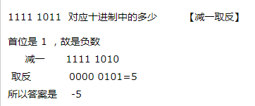
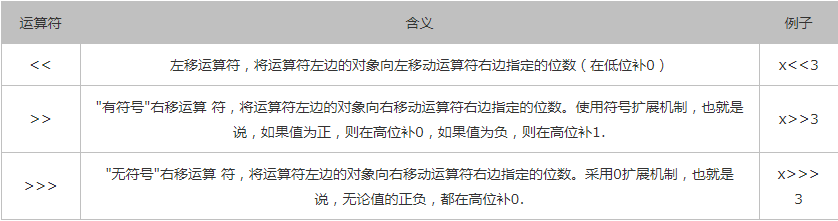

### 一、十进制与二进制转换

#### 1.1十进制转二进制

##### 1.正整数转二进制

要点：除2取余，倒序排列，高位补零

 

计算机内部表示数的字节单位是定长的，如8位、16位、32位。所以位数不够时，高位补零，所以上图中42转成二进制就是00101010

##### 2.负整数转二进制

要点：将对应的正整数转换为二进制后，对二进制取反，然后对结果+1.

 

##### 3.小数转二进制

要点：对小数点以后的数乘以2，取结果的整数部分，然后再用小数部分再乘以2，再取结果的整数部分……以此类推，直到小数部分为0或者位数已经够了就OK了 。然后把取得的整数部分按先后顺序排列。

 

如果小数的整数部分有大于0的整数，就将整数转为二进制，小数转为二进制，然后相加即可

 

#### 1.2二进制转十进制

##### 1.整数二进制转十进制

要点：将二进制补齐位数，首位如果是零代表正数，如果首位为1代表负数。

二进制首位为0代表整数，如下运算转换

 

##### 2.负整数二进制转十进制

要点：减1取反，转为十进制，加负号



##### 3.小数二进制转换为十进制

 

### 二、位运算

#### 2.1与运算符&

```java
//规则：两个操作数中位都为1，结果才为1，否则结果为0

例： 129 & 128 = 128
//分析：129 转为二进制是 10000001
       128  转为二进制是 10000000
    根据规则：129&128 = 128
    
//总结：可以类比为1为true
```

#### 2.2或运算符|

```java
//规则：两个位只要有一个为1，结果就为1，否则就为0
例： 129 | 128 = 129
```

#### 2.3非运算符~

```java
//规则：如果位为0，结果是1。 如果位为1，结果是0
例： ~42 = -43
    
//分析： 42 转为二进制是  00101010
    	~42 是		  11010101  减一取反加负号  -00101011 = -42
```

#### 2.4异或运算符^

```java 
//规则：两个操作数的位中，相同结果为0，不同结果为1
例： 15 ^ 3 = 12
//分析： 15 转为二进制是   00001111
    	3  转为二进制是   00000011
    	15^3             00001100 = 12
```

#### 2.5移位运算符

移位运算符操作的对象就是二进制的位，可以单独用移位运算符来处理int型整数；



```java
举例：
System.out.println(15<<2);  //60
 
解析： 15的二进制是 00001111 << 2 = 00111100 = 60
    
/*  注意：x<<y 相当于 x*2y（注：y代表次方） ；x>>y相当于x/2y（注：y代表次方）
    从计算速度上讲，移位运算要比算术运算快。
    如果x是负数，那么x>>>3没有什么算术意义，只有逻辑意义。
 */
```

