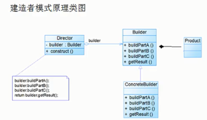
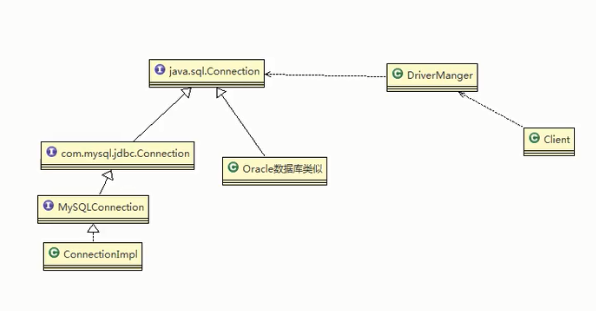
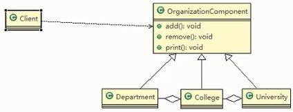
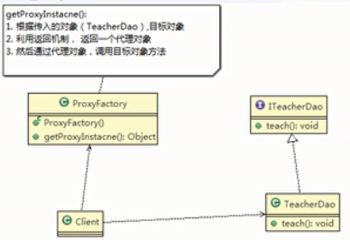

## 一、设计模式的分类

```java
总体来说设计模式分为三大类：
1.创建型模式：（共五种）
	工厂方法模式、抽象工厂模式、单例模式、建造者模式、原型模式。
2.结构型模式：（共七种）
	适配器模式、装饰器模式、代理模式、外观模式、桥接模式、组合模式、享元模式。
3.行为型模式：（共十一种）
	策略模式、模板方法模式、观察者模式、迭代子模式、责任链模式、命令模式、备忘录模式、状态模式、访问者模式、中介者模式、解释器模式。
	
//一般比较常用需要掌握的有：
	单例模式	工厂模式	抽象工厂模式	建造者模式	适配器模式	装饰器模式	策略模式	代理模式
```

## 二、设计模式的七大原则

```java
1.单一职责原则
	对类来说，即一个类应该只负责一项职责。
2.接口隔离原则（Interface Segregation Principle）
	/*使用多个隔离的接口，比使用单个接口要好。还是一个降低类之间的耦合度的意思，*/从这我们可以看出，其实设计模式就是一个软件的设计思想，从大型软件架构出发，为了升级和维护方便。所以上文中多次出现：降低依赖，降低耦合。
3.依赖倒转原则（Dependence Inversion Principle）
	这个是开闭原则的基础，具体内容：/*针对接口编程，依赖于抽象而不依赖于具体。*/
4.里氏代换原则（Liskov Subsitution Principle）
	里氏代换原则（Liskov Subsitution Principle LSP）是面向对象设计的基本原则之一。里氏代换原则中说，/*任何基类可以出现的地方，子类一定可以出现*/。LSP是集成复用的基石，只有当衍生类可以替换调基类，软件单位的功能不受到影响时，基类才能真正被复用，而衍生类也能够在基类的基础上增加新的行为。里氏代换原则是对“开闭原则”的补充。实现“开闭原则”的关键步骤就是抽象化。而基类与子类的继承关系就是抽象化的具体实现，所以里氏代换原则是对抽象化的具体步骤的规范。
5.开闭原则（open close principle）
	开闭原则就是说 /*对外扩展开发，对内修改关闭*/。在程序需要进行拓展的时候，不能去修改原有的代码，实现一个 热插拔的效果。所以一句话概括就是：为了使程序的扩展性好，易于维护和升级。想要达到这样的效果，我们需要使用接口和抽象类。
6.迪米特法则（最少知道原则）（Demeter Principle）
	为什么叫最少知道原则，就是说：/*一个实体应当尽量少的与其他实体之间发生相互作用，使得系统功能模块相对独立。*/
7.合成复用原则（Composite Reuse Principle）
	原则是尽量使用合成/聚合的方式，而不是使用继承。
```

#### 2.1单一职责原则

> 基本介绍

对类来说，即一个类应该只负责一项职责。如果A负责两个不同的职责：职责1，职责2。当职责1需求变更而改变A时，可能造成职责2执行错误，所以需要将类A的粒度分解为A1，A2。

> 单一职责原则注意事项和细节

1. 降低类的复杂度，一个类只负责一项职责
2. 提高类的可读性，可维护性
3. 降低变更引起的风险
4. 通常情况下，我们应当遵守单一职责原则，只有逻辑足够简单，才可以在代码级别违反单一职责原则；只有类中方法数量足够少，可以在方法级别保持单一职责原则

#### 2.2接口隔离原则

> 基本介绍

1. 客户端不应该依赖它不需要的接口，即一个类对另一个类的依赖应该建立在最小接口上

2. 类A通过接口interface1依赖类B，类C通过接口interface1依赖类D，如果接口interface1对于类A和类C不是最小接口，那么类B和类D必须实现他们不需要的方法

3. 按隔离原则应该这样处理：

   ​	将接口interface1拆分为独立的几个接口，类A和类C分别于他们需要的接口建立依赖关系。也就是采用接口隔离原则。

#### 2.3依赖倒转原则

> 基本介绍

依赖倒转原则是指：

1. 高层模块不应该依赖底层模块，二者都应该依赖其抽象
2. 抽象不应该依赖细节，细节应该依赖抽象
3. 依赖倒转的中心思想是面向接口编程
4. 依赖倒转原则是基于这样的设计理念：相对于细节的多变性，抽象的东西要稳定的多。在java中抽象指接口或抽象类，细节就是具体的实现类
5. 使用接口或抽象类的目的是制定好规范，而不涉及任何具体的操作，把展现细节的任务交给他们的实现类去做

> 依赖倒转原则的注意事项和细节

1. 底层模块尽量都要有抽象类或接口，或者两者都有，程序稳定性更好
2. 变量的声明类型尽量是抽象类或接口，这样我们的变量引用和实际对象间，就存在一个缓冲层，利于程序扩展和优化
3. 继承时遵守里氏替换原则

> 代码示例

```java 
public class TestDemo {
    public static void main(String[] args) {
        Person person = new Person();
        Java java = new Java();
        person.read(java);
    }
}

interface Book {
    String getName();
}

class Java implements Book{
    public String getName() {
        return "java";
    }
}

class Person {
    // 细节依赖抽象  Book   而不是具体的Java
    public void read(Book book) {
        System.out.println("我在读" + book.getName());
    }
}
```

#### 2.4里式替换原则

> OO中的继承性的思考和说明

1. 继承包含这样一层含义：父类中凡是已经实现好的方法，实际上是在设定规范和契约，虽然他不强制要求所有的子类必须遵守这些契约，但是如果子类对这些已经实现的方法任意修改，就会对整个继承体系造成破坏。
2. 继承在给程序带来便利的同时，也带来弊端，比如使用继承会给程序带来侵入性，程序的可移植性降低，增加对象间的耦合性，如果一个类被其他类所继承，则当这个类需要修改时，必须考虑到所有的子类，并且父类修改后，所有涉及到的子类功能都有可能产生故障。
3. 问题提出：在编程中，如何正确使用继承？=> ==里式替换原则==

> 基本介绍

1. 里式替换原则在1988年，由麻省理工学院的一位姓里的女士提出的。
2. 如果对每个类型为T1的对象o1，都有类型为T2的对象o2，使得以T1定义的所有程序P在所有对象o1都替换成o2时，程序P的行为没有发生变化，那么类型T2是类型T1的子类型。换句话说，所有引用基类的地方必须能透明的使用其子类的对象。
3. 在使用继承时，遵循里氏替换原则，在子类中尽量不要重写父类的方法
4. 里氏替换原则告诉我们，继承实际上让两个类耦合性增强了。==在适当的情况下可以通过聚合，组合，依赖来解决问题。==

#### 2.5开闭原则

> 基本介绍

1. 开闭原则是编程中最基础、最重要的设计原则
2. 一个软件实体如类，模块和函数应该对扩展开放，对修改关闭。 用抽象构建框架，用实现扩展细节
3. 当软件需要变化时，尽量通过扩展软件实体的行为来实现变化，而不是通过修改已有的代码来实现变化
4. 编程中遵循其他原则，以及使用设计模式的目的就是遵循开闭原则。

> 示例1

```java 
public class TestDemo {
    public static void main(String[] args) {
        ShapeEditor shapeEditor = new ShapeEditor();
        Circle circle = new Circle();
        shapeEditor.drawShape(circle);
        Square square = new Square();
        shapeEditor.drawShape(square);
    }
}

// 图形类，基类
class Shape{
    int type;
}
//圆形
class Circle extends Shape{
    Circle() {
        super.type = 1;
    }
}
//正方形
class Square extends Shape {
    Square() {
        super.type = 2;
    }
}

//绘制图形的方法
class ShapeEditor{
    public void drawShape(Shape s) {
        if (s.type == 1) {
            drawCircle(s);
        } if (s.type == 2) {
            drawSquare(s);
        }
    }

    private void drawSquare(Shape s) {
        System.out.println("正方形");
    }

    private void drawCircle(Shape s) {
        System.out.println("圆形");
    }
}
```

该方法的优缺点：

1. 优点是比较好理解，简单易操作
2. 缺点是违反了设计模式的ocp原则，即==对扩展开放，对修改关闭==
3. 比如我们这时要增加一个图形种类 三角形，我们需要修改的地方比较多

> 使用开闭原则改进

**思路**： 把创建Shape类做成抽象类，并提供一个抽象的draw方法，让子类去实现即可，这样我们有新的图形种类时，只需要要新的图形类继承Shape，并实现draw方法即可

```java 
public class TestDemo {
    public static void main(String[] args) {
        ShapeEditor shapeEditor = new ShapeEditor();
        Circle circle = new Circle();
        shapeEditor.drawShape(circle);
        Square square = new Square();
        shapeEditor.drawShape(square);
    }
}

// 图形类，基类
abstract class Shape{
    abstract void draw();  //抽象方法
}
//圆形
class Circle extends Shape{
    @Override
    void draw() {
        System.out.println("圆形");
    }
}
//正方形
class Square extends Shape {
    @Override
    void draw() {
        System.out.println("正方形");
    }
}

//绘制图形的方法
class ShapeEditor{
    public void drawShape(Shape s) {
        s.draw();
    }
}
```

#### 2.6迪米特法则

> 基本介绍

1. 一个对象应该对其他对象保持最少了解
2. 类与类的关系越密切，耦合度越大
3. 迪米特法则又称==最少知道原则==，即==一个类对自己依赖的类知道的越少越好==。也就是说，对于被依赖的类不管多么复杂，都尽量将逻辑封装在内部。对外除了提供public方法，不对外泄漏任何信息
4. 迪米特法则还有个简单的定义：只与直接的朋友通信
5. ==直接的朋友：==每个对象都会与其他对象有耦合关系，只要两个对象之间有耦合关系。耦合的方式很多，依赖、关联、组合、聚合等。其中我们称成员变量、方法参数、方法返回值中的类为直接朋友，而出现在局部变量中的类不是直接朋友。也就是说，陌生的类最好不要以局部变量的方式出现在类的内部。

> 迪米特法则注意事项和细节

1. 迪米特法则的核心是降低类之间的耦合
2. 但是注意：由于每个类都减少了不必要的依赖，因此迪米特法则只是要求降低类间（对象间）耦合关系，并不是要求完全没有依赖关系

#### 2.7合成复用原则

> 基本介绍

原则是尽量使用合成/聚合的方式，而不是继承

> 设计原则核心思想

1. 找出应用中可能需要变化之处，把他们独立出来，不要和那些不需要变化的代码混合在一起
2. 针对接口编程，而不是针对实现编程
3. 为了交互对象之间的松耦合设计而努力

### 三、UML类图

#### 3.1UML基本介绍

1. UML--Unified modeling language UML(统一建模语言)，是一种用于软件系统分析和设计的语言工具，它用于帮助软件开发人员进行思考和记录思考的结果
2. UML本身是一套符号的规定，就像数学符合和化学符号一样，这些符号用于描述软件模型中各个元素和他们之间的关系。有==依赖、泛化(继承)、实现、关联、聚合和组合==。
3. 使用UML来建模，常用的工具有Rational Rose,也可以使用一些插件来建模。


#### 3.2类图-依赖关系（Dependence）

只要在==类中用到了对方==，那么他们之间就存在依赖关系。如果没有对方，连编译都通过不了。

```java
public class PersonServiceBean {
    private PersonDao personDao;
    public void save(Person person){}
    public IDCard getIDCard(Integer personid){
        return null;
    }
    public void medify(){
        Department department = new Department();
    }
}

class PersonDao{}
class IDCard{}
class Person{}
class Department{}
```

> 对应的UML类图


> 依赖关系总结

类中用到了对方：

* 类中的成员属性
* 方法的返回类型
* 方法接收的参数类型
* 方法中使用到

#### 3.3类图-泛化关系(generalization)

泛化关系实际上就是继承关系，它是==依赖关系的特例==

```java
public abstract class DaoSupport {
    public void save(Object o){}
    public void delete(Object o){}
}

class PersonServiceBean extends DaoSupport{}
```


> 泛化关系总结

* 泛化关系实际就是继承关系
* 如果A类继承B类，我们就说A和B存在泛化的关系

#### 3.4实现关系

实现关系实际就是A类实现B类，它是==依赖关系的特例==

````java
public interface PersonService {
    void delete(int id);
}

class PersonServiceBean2 implements PersonService{
    @Override
    public void delete(int id) {
    }
}
````


#### 3.5关联关系（association）

关联关系实际就是类与类之间的联系，它是==依赖关系的特例==

关联具有导航性：即双向关联关系和单向关联关系

```java 
//单向一对一关系
public class Person{
    private IDCard card;
}
public class IDCard{}

//双向一对一关系
public class Person{
    private IDCard card;
}
public class IDCard{
    private Person person;
}
```


#### 3.6类图-聚合关系（Aggregation）

聚合关系表示的是整体和部分的关系，==整体与部分可以分开==。==聚合关系是关联关系的特例==，所以他具有关联关系的导航性与多重性。

如：一台电脑由键盘(keyboard)、显示器（monitor），鼠标等组成；组成电脑的各个配件是可以从电脑上分离出来的，使用带空心菱形的实线来表示；

```java
public class Computer {
    private Mouse mouse;  //鼠标可以和Computer分离
    private Monitor monitor;  //显示器可以和Computer分离

    public void setMouse(Mouse mouse) {
        this.mouse = mouse;
    }

    public void setMonitor(Monitor monitor) {
        this.monitor = monitor;
    }
}

class Mouse{
}
class Monitor{}
```


#### 3.7组合关系（Composition）

组合关系：也是整体与部分的关系，但是==整体与部分不可以分开==

> 案例

在程序中我们定义一个实体：Person与IDCard、Head,那么Head和Person就是组合，IDCard和Person就是聚合。

但是如果在程序中Person实体中定义了对IDCard进行==级联删除==，即删除Person时连同IDCard一起删除,那么IDCard和Person就是组合了。

```java
public class Person{
    private IDCard card;
    private Head head = new Head();
    public void setIDCard(IDCard card){
        this.mouse = mouse;
    }
    public void setHead(Head head){
        this.head = head;
    }
}

public class IDCard{}
public class Head{}
```

类图用实心菱形表示


## 四、java中23中设计模式

#### 4.1单例模式

> 单例模式介绍

所谓类的单例模式，就是采取一定的方法保证在整个的软件系统中，对某个类==只能存在一个对象实例==，并且该类只提供一个取得其对象实例的方法（静态方法）。

比如Hibernate的SessionFactory，它充当数据存储源的代理，并负责创建Session对象。SessionFactory并不是轻量级的，一般情况下，一个项目通常只需要一个SessionFactory就够了，这时就会使用到单例模式。

> 单例模式常用写法	 

1. ==饿汉式（静态常量）==
2. ==饿汉式（静态代码块）==
3. 懒汉式（线程不安全）
4. 懒汉式（线程安全，同步方法）
5. 懒汉式（线程安全，同步代码块）
6. ==双重检查==
7. ==静态内部类==
8. ==枚举==

> 代码示例

##### 4.1.1饿汉式（静态常量）

```java
class Singleton {
    //1.私有化构造器
    private Singleton(){}
    //2.静态常量创建实例
    private final static Singleton singleton = new Singleton();
    //3.提供返回实例的公共静态方法
    public static Singleton getInstance(){
        return singleton;
    }
}
```

优缺点分析：

1. 优点：这种写法比较简单，就是在类装载的时候就完成了实例化。避免了线程同步问题。
2. 缺点：在类装载的时候就完成实例化，没有达到懒加载的效果。如果从始至终从未使用这个实例。就会造成内存的浪费。
3. 结论：这种单例模式可用，==可能==造成内存浪费。

##### 4.1.2饿汉式（静态代码块）

```java
class Singleton {
    //1.私有化构造器
    private Singleton(){}
    //2.静态常量创建实例
    private static Singleton singleton;
    //在静态代码块中创建实例
    static {
        singleton = new Singleton();
    }
    //3.提供返回实例的公共方法
    public static Singleton getInstance(){
        return singleton;
    }
}
```

优缺点分析：

和4.1.1一样

##### 4.1.3懒汉式（线程不安全）

```java
class Singleton {
    //1.私有化构造器
    private Singleton(){}
    //2.静态常量创建实例
    private static Singleton singleton;
    //3.提供返回实例的公共方法
    public static Singleton getInstance(){
        if (singleton == null) {
            singleton = new Singleton();
        }
        return singleton;
    }
}
```

优缺点分析：

1. 起到了懒加载效果，但是只能在单线程下使用；
2. 结论：在实际开发中不要使用这种方式。

##### 4.1.4懒汉式（线程安全）

```java
class Singleton {
    //1.私有化构造器
    private Singleton(){}
    //2.静态常量创建实例
    private static Singleton singleton;
    //3.提供返回实例的静态公共方法（加入同步处理，解决线程安全问题）
    public static synchronized Singleton getInstance(){
        if (singleton == null) {
            singleton = new Singleton();
        }
        return singleton;
    }
}
```

优缺点分析：

1. 解决了线程安全问题
2. 效率太低，每个线程在想获得类的实例的时候，执行getInstance()方法都要进行同步。而其实这个方法只执行一次实例化代码就够了，后面的想获得该类的实例，直接return就可以了。方法进行同步效率太低了。
3. 结论：在实际开发中，不推荐使用这种。

##### 4.1.5懒汉式（同步代码块）

```java
class Singleton {
    //1.私有化构造器
    private Singleton(){}
    //2.静态常量创建实例
    private static Singleton singleton;
    //3.提供返回实例的静态公共方法
    public static Singleton getInstance(){
        if (singleton == null) {
            synchronized (Singleton.class) {
                singleton = new Singleton();
            }
        }
        return singleton;
    }
}
```

优缺点分析：

1. 这种方式，本意是想对第四种实现方式的改进，因为前面同步方法效率太低，改为同步产生实例化的代码块

2. ==但这种同步方式并不能起到线程同步作用。==

3. 结论：在实际开发中，不能使用这种方式。

   

##### 4.1.6双重检查

```java
class Singleton {
    //1.私有化构造器
    private Singleton(){}
    //2.静态常量创建实例(volatile保证内存可见性)
    private static volatile Singleton singleton;
    //3.提供返回实例的静态公共方法,加入双重检查代码，解决线程安全问题，同时解决懒加载问题
    public static Singleton getInstance(){
        if (singleton == null) {
            synchronized (Singleton.class) {
                if (singleton == null) {
                    singleton = new Singleton();
                }
            }
        }
        return singleton;
    }
}
```

优缺点分析:

1. double-check概念是多线程开发中常使用的。如代码中所示，我们进行了两次if(singleton == null)检查，这样就可以保证线程安全了
2. 这样，实例化代码只用执行一次，后面在访问时，判断if(singleton == null),直接return实例化对象，也避免了反复进行方法同步
3. 线程安全；延迟加载；效率较高
4. 结论：在实际开发中，推荐使用这种单例设计模式

##### 4.1.7静态内部类

```java
class Singleton {
    //1.私有化构造器
    private Singleton(){}
    //2.静态内部类
    private static class SingletonInstance {
        private static final Singleton INSTANCE = new Singleton();
    }
    //3.提供返回实例的静态公共方法,直接调用静态内部类
    public static Singleton getInstance(){
        return SingletonInstance.INSTANCE;
    }
}
```

1. 这种方式采用了类装载的机制来保证初始化实例时只有一个线程
2. 静态内部类方式在Singleton类被装载时不会立即初始化，而是需要实例化时， 调用getInstance方法，才会装载SingletonInstance类，从而完成instance的实例化
3. 类的静态属性只会在第一次加载类的时候初始化，所以在这里，JVM帮我们保证了线程的安全性，在类初始化时，别的线程是无法进入的
4. 优点：避免了线程不安全，利用静态内部类特点实现延迟加载，效率高
5. 结论：推荐使用。

##### 4.1.8枚举

```java
enum Singleton{
    INSTANCE;
    public void whateverMethod(){
    }
}
```

优缺点分析：

1. 这借助了JDK1.5中新增的枚举来实现单例模式。不仅能避免多线程同步问题，而且还能防止反序列化重新创建新的对象。
2. 结论：推荐使用。

##### 单例模式总结：

> 单例模式在jdk应用的源码分析

在java.lang.Runtime就是经典的单例模式(饿汉式-静态常量)

```java
public class Runtime {
    private static Runtime currentRuntime = new Runtime();
    public static Runtime getRuntime() {
        return currentRuntime;
    }
    /** Don't let anyone else instantiate this class */
    private Runtime() {}
```

> 单例模式注意事项和细节说明

1. 单例模式保证了系统内存中该类只存在一个对象，节省了系统资源，对于一些需要频繁创建和销毁的对象，使用单例模式可以提高系统性能
2. 当想实现一个单例类的时候，必须要记住使用相应的获取对象的方法，而不是使用new
3. 单例模式使用场景：需要频繁的创建和销毁对象、创建对象时耗时过多或耗费资源过多（即：重量级对象），但又经常用的到的对象、工具类对象、频繁访问数据库或文件的对象（比如数据源、session工厂等）。

#### 4.2工厂模式

> 看一个具体的需求

看一个披萨订购项目：要便于披萨种类扩展，要便于维护

1）披萨种类很多（比如GreekPizza、CheesePizza等）

2）披萨制作有prepare,bake,cue,box

3）完成披萨店订购功能

> 不使用工厂模式的写法

```java
// Pizza接口
public interface Pizza {
    void prepare(); // 准备
}

// cheese披萨
public class CheesePizza implements Pizza {
    @Override
    public void prepare() {
        System.out.println(" CheesePizza准备 ");
    }
}

// greek披萨
public class GreekPizza implements Pizza {
    @Override
    public void prepare() {
        System.out.println(" GreekPizza准备 ");
    }
}

// 披萨订单
public class OrderPizza {
    public OrderPizza() {
        Pizza pizza = null;
        String orderType; //订购披萨的类型
        while(true) {
            orderType = getType();
            if (orderType.equals("greek")) {
                pizza = new GreekPizza();
            } else if (orderType.equals("cheese")) {
                pizza = new CheesePizza();
            } else {
                break;
            }
            pizza.prepare();
        }
    }

    /**
     * 获取订购pizza的类型
     * @return
     */
    private String getType() {
        try {
        BufferedReader bufferedReader = new BufferedReader(new InputStreamReader(System.in));
        System.out.println("input pizza type:");
        String s = bufferedReader.readLine();
        return s;
        } catch (IOException e) {
            e.printStackTrace();
            return "";
        }
    }
}
```


> 传统方式优缺点分析

==分析：==修改代码可以接受，但是如果我们在其他的地方也有创建Pizza代码，就意味着，也需要修改，而创建Pizza的代码，==往往有多处==

==思路：==把创建Pizza对象封装到一个类中，这样我们有新的Pizza种类时，只需要修改该类即可，==其他有创建到Pizza对象的代码就不需要修改了==。->简单工厂模式。

##### 4.2.1简单工厂模式

> 基本介绍

1. 简单工厂模式属于创建型模式，是工厂模式的一种。==简单工厂模式是由一个工厂对象决定创建出哪一种产品类的实例==。简单工厂模式是工厂模式家族中最简单实用的模式。
2. 简单工厂模式：定义了一个创建对象的类，由==这个类来封装实例化对象的行为==。
3. 在软件开发中，我们会用到大量的创建某种、某类或者某批对象时，就会使用工厂模式。


```java
//简单工厂，用来创建Pizza实例
public class SimpleFactory {
    public Pizza createPizza(String orderType) {
        Pizza pizza = null;
        if (orderType.equals("greek")) {
            pizza = new GreekPizza();
        } else if (orderType.equals("cheese")) {
            pizza = new CheesePizza();
        }
        return pizza;
    }
}

//订购披萨的类
public class OrderPizza {
    SimpleFactory simpleFactory;
    Pizza pizza;
    public OrderPizza(SimpleFactory simpleFactory) {
        setFactory(simpleFactory);
    }

    public void setFactory(SimpleFactory simpleFactory) {
        String orderType = "";
        this.simpleFactory = simpleFactory;
        while (true) {
            orderType = getType();
            pizza = simpleFactory.createPizza(orderType);
            if (pizza != null) {
                pizza.prepare();
            } else {
                System.out.println("订购pizza失败");
                break;
            }
        }

    }
    /**
     * 获取订购pizza的类型
     * @return
     */
    private String getType() {
        try {
        BufferedReader bufferedReader = new BufferedReader(new InputStreamReader(System.in));
        System.out.println("input pizza type:");
        String s = bufferedReader.readLine();
        return s;
        } catch (IOException e) {
            e.printStackTrace();
            return "";
        }
    }
}
```

##### 4.2.2工厂方法模式

> 看一个新需求

披萨项目新需求：客户在点披萨时，可以点不同口味的披萨，比如 北京的奶酪披萨、北京的胡椒披萨或者伦敦的奶酪披萨、伦敦的胡椒披萨。

**思路1：**

使用简单工厂模式，创建不同的简单工厂类，比如BJPizzaSimpleFactory、LDPizzaSimpleFactory等等，从当前这个案例来说，也是可以的。但是考虑到项目的规模，以及软件的可维护性、可扩展性并不是特别好。

**思路2：**

使用工厂方法模式

> 工厂方法模式介绍

**工厂方法模式设计方案：**将披萨项目的实例化功能抽象成抽象方法，在不同的口味点餐子类中具体实现

**工厂方法模式**：定义了一个创建对象的抽象方法，由子类决定要实例化的类。工厂方法模式将==对象的实例化推迟到子类==。


> 代码示例

```java
// 1. 创建披萨的抽象类
public interface Pizza {
    void prepare(); // 准备
}

// 2.北京口味的奶酪披萨
public class BJCheesePizza implements Pizza {
    @Override
    public void prepare() {
        System.out.println(" 准备北京奶酪披萨 ");
    }
}

//3.北京口味的椒盐披萨
public class BJPepeerPizza implements Pizza {
    @Override
    public void prepare() {
        System.out.println(" 准备北京椒盐披萨 ");
    }
}

//4.伦敦口味的奶酪披萨
public class LDCheesePizza implements Pizza {
    @Override
    public void prepare() {
        System.out.println(" 准备伦敦奶酪披萨 ");
    }
}

// 5. 伦敦口味的椒盐披萨
public class LDPepperPizza implements Pizza {
    @Override
    public void prepare() {
        System.out.println(" 准备伦敦椒盐披萨 ");
    }
}

// 6. 订购披萨的抽象类
public abstract class OrderPizza {
    //创建pizza的抽象方法
    public abstract Pizza createPizza(String type);
    public OrderPizza() {
        String type = getType();
        Pizza pizza = createPizza(type);
        pizza.prepare();
    }
    /**
     * 获取订购pizza的类型
     * @return
     */
    private String getType() {
        try {
            BufferedReader bufferedReader = new BufferedReader(new InputStreamReader(System.in));
            System.out.println("input pizza type:");
            String s = bufferedReader.readLine();
            return s;
        } catch (IOException e) {
            e.printStackTrace();
            return "";
        }
    }
}

// 7.北京订购，重写抽象方法，创建对应的北京各口味披萨
public class BJOrderPizza extends OrderPizza {
    @Override
    public Pizza createPizza(String type) {
        Pizza pizza = null;
        if (type.equals("cheese")) {
            pizza = new BJCheesePizza();
        } else if (type.equals("pepeer")) {
            pizza = new BJPepeerPizza();
        }
        return pizza;
    }
}

// 8.伦敦订购，重写抽象方法，创建对应的伦敦各口味披萨
public class LDOrderPizza extends OrderPizza {
    @Override
    public Pizza createPizza(String type) {
        Pizza pizza = null;
        if (type.equals("cheese")) {
            pizza = new LDCheesePizza();
        } else if (type.equals("pepeer")) {
            pizza = new LDPepperPizza();
        }
        return pizza;
    }
}

// 9.测试类
public class TestDemo {
    public static void main(String[] args) {
        // 创建北京各口味披萨
        new BJOrderPizza();

        // 创建伦敦各口味披萨
        new LDOrderPizza();
    }
}
```

##### 4.2.3抽象工厂模式

> 基本介绍

1. 抽象工厂模式：定义了一个interface用于创建相关或有依赖关系的对象簇，而无需指明具体的类
2. 抽象工厂模式可以将==简单工厂模式==和==工厂方法模式==进行整合
3. 从设计层面看，抽象工厂模式就是对简单工厂模式的改进（或者称为进一步抽象）
4. 将工厂抽象成两层，AbsFactory(抽象工厂)和具体实现的工厂子类。程序员可以根据创建对象类型使用对应的工厂子类。这样将单个的简单工厂类变成了==工厂簇==，更利于代码维护和扩展。

> 类图


> 代码示例

```java
//1. 披萨接口和实现类见4.2.2
    
//2.抽象工厂
public interface AbsFactory {
    Pizza createPizza(String type);
}

//3. 北京工厂
public class BJFactory implements AbsFactory {
    @Override
    public Pizza createPizza(String type) {
        Pizza pizza = null;
        if (type.equals("cheese")) {
            pizza = new BJCheesePizza();
        } else if (type.equals("pepeer")) {
            pizza = new BJPepeerPizza();
        }
        return pizza;
    }
}

//4. 伦敦工厂
public class LDFactory implements AbsFactory {
    @Override
    public Pizza createPizza(String type) {
        Pizza pizza = null;
        if (type.equals("cheese")) {
            pizza = new LDCheesePizza();
        } else if (type.equals("pepeer")) {
            pizza = new LDPepperPizza();
        }
        return pizza;
    }
}

// 5. 订购披萨
public class OrderPizza {
    //引用抽象工厂
    AbsFactory absFactory;

    public OrderPizza(AbsFactory absFactory) {
        this.absFactory = absFactory;
        String type = getType();
        Pizza pizza = absFactory.createPizza(type);
        pizza.prepare();
    }

    /**
     * 获取订购pizza的类型
     * @return
     */
    private String getType() {
        try {
            BufferedReader bufferedReader = new BufferedReader(new InputStreamReader(System.in));
            System.out.println("input pizza type:");
            String s = bufferedReader.readLine();
            return s;
        } catch (IOException e) {
            e.printStackTrace();
            return "";
        }
    }
}

// 6.测试类
public class TestDemo {
    public static void main(String[] args) {
        // 订购北京口味的披萨
        new OrderPizza(new BJFactory());

        // 订购伦敦口味的披萨
        new OrderPizza(new LDFactory());
    }
}
```

##### 4.2.4工厂模式总结

1. 工厂模式的意义：

   将实例化对象的代码提取出来，放到一个类中统一管理和维护，达到和主项目的依赖关系的解耦。从而提高项目的扩展和维护性。

2. 三种工厂模式

3. 设计模式的==依赖抽象（依赖倒转）==原则

* 创建对象实例时，不要直接new类，而是把这个new类的动作放到一个工厂的方法中，并返回。
* 不要让类继承具体类，而是继承抽象类或者是实现interface（接口）
* 不要覆盖基类中已经实现的方法

#### 4.3原型模式

> 问题引入

**克隆羊问题：**

现在有一只羊tom,姓名为tom， 年龄为1，颜色为white, 请编写程序创建和tom羊属性完全相同的羊。

```java
// 1.羊实体类
public class Sheep {
    private String name;
    private int age;
    private String color;
}

// 2.测试传统方式
public class Client {
    public static void main(String[] args) {
        // 传统的方法
        Sheep sheep = new Sheep("tom", 1, "white");
        Sheep sheep1 = new Sheep(sheep.getName(), sheep.getAge(), sheep.getColor());
    }
}
```

> 传统方式优缺点

1. 优点是比较好理解，简单易操作
2. 在创建新对象时，总是需要获取原始对象的属性，如果创建的对象比较复杂时，效率较低
3. 总是需要重新初始化对对象，而不是动态的获取对象运行时状态，不够灵活


##### 4.3.1原型模式浅拷贝

> 改进思路分析

**思路**：

java中Object类是所有类的根类，Object类提供了一个clone()方法，该方法可以将一个java类复制一份，但是需要实现clone的java类必须要实现一个接口Cloneable,该接口表示该类能够复制且具有复制的能力=> 原型模式。


> 代码示例

```java
// 1. 羊实例，实现Cloneable接口，重写clone()方法
public class Sheep implements Cloneable{
    private String name;
    private int age;
    private String color;

    @Override
    protected Sheep clone() throws CloneNotSupportedException {
        Sheep sheep = (Sheep) super.clone();
        return sheep;
    }
}

// 2.测试类
public class Client {
    public static void main(String[] args) throws CloneNotSupportedException {
        // 克隆方法
        Sheep sheep = new Sheep("tom", 1, "white");
        Sheep sheep1 = sheep.clone();
        System.out.println(sheep.toString());
        System.out.println(sheep1.toString());
    }
}
```

> 原型模式优点

使用原型模式，让程序具有更高的效率和扩展性。

##### 4.3.2原型模式在spring源码中的使用

1. 进入getBean()方法
2. getBean()方法内部创建BeanFactory并调用BeanFactory的getBean()方法
3. getBean()方法内部调用doGetBean()方法，此方法为创建bean的核心方法
4. 方法内部拿到bean的定义信息mbd，从bean定义信息判断是否是原型模式，如果是执行下面的代码

、


##### 4.3.3原型模式深拷贝

> 浅拷贝基本介绍

1. 对于数据类型是基本数据类型的成员变量，浅拷贝会直接进行值传递，也就是将该属性值复制一份给新对象
2. 对于数据类型时引用数据类型的成员变量，那么浅拷贝会进行引用传递，也就是将该成员变量的引用值(内存地址)复制一份给新对象。因为实际上两个对象的该成员变量都指向同一个实例。在这种情况下，在一个对象中修改该成员变量会影响到另一个对象的该成员变量值
3. 浅拷贝使用默认的clone()方法来实现

> 深拷贝基本介绍

1. 复制对象的所有基本数据类型的成员变量值
2. 为所有引用数据类型的成员变量申请存储空间，并复制每个引用数据类型成员变量所引用的对象，直到该对象所有的可达对象。也就是说，==对象进行深拷贝要对整个对象进行拷贝==。
3. 深拷贝实现方式一：==重写clone方法来实现深拷贝==
4. 深拷贝实现方式二（**推荐**）：==通过对象序列化实现深拷贝==

**深拷贝实现方式一**


**深拷贝实现方式二**


说明：该方法实体类要实现Serializable接口，使对象可以被序列化，然后以对象流的方式输出，再以对象流的方式写入为copyObj，最后返回copyObj即可。


> 原型模式的注意事项和细节

1. 创建新的对象比较复杂时，可以利用原型模式简化对象的创建过程，同时也能够提高效率
2. 不用重新初始化对象，而是动态的获取对象的运行时状态
3. 如果原始对象发生变化（增加或减少属性），其他克隆对象也会发生相应的变化，无需修改代码
4. 在实现深克隆的时候可能需要比较复杂的代码
5. ==缺点==：需要为每一个类配备一个克隆方法，这对全新的类来说不是很难，但对已有的类进行改造时，需要修改其源码，违背了OCP原则。

#### 4.4建造者模式

> 盖房项目需求

1. 需要建房子：这一过程为打桩、砌墙、封顶。
2. 房子有各种各样的，比如普通房，高楼，别墅，各种房子的过程虽然一样，但是要求不要相同的。
3. 编写程序完成需求。

> 传统方式实现


```java
// 1.抽象房子
public abstract class AbstractHouse {
    // 打地基
    public abstract void buildBasic();
    // 砌墙
    public abstract void buildWalls();
    // 封顶
    public abstract void roofed();

    public void build() {
        buildBasic();
        buildWalls();
        roofed();
    }
}

// 2.普通房子
public class CommonHouse extends AbstractHouse{
    @Override
    public void buildBasic() {
        System.out.println("普通房子打地基");
    }
    @Override
    public void buildWalls() {
        System.out.println("普通房子砌墙");
    }
    @Override
    public void roofed() {
        System.out.println("普通房子封顶");
    }
}

// 3.测试
public class Client {
    public static void main(String[] args) {
        CommonHouse commonHouse = new CommonHouse();
        commonHouse.build();
    }
}
```

> 传统方式优缺点

1. 优点是比较好理解，简单易操作
2. 设计的程序结构过于简单，没有设计缓存层对象，程序的扩展和维护不好。也就是说，这种设计方案，把产品和创建产品的过程封装在一起，耦合性增强了。
3. 解决方案：将产品和产品的建造过程解耦=>建造者模式

##### 4.4.1建造者模式

> 建造者模式基本介绍

1. **建造者模式**又叫生成器模式，是一种对象构建模式。它可以将复杂对象的建造过程抽象出来（抽象类别），使这个抽象过程的不同实现方法可以构造出不同表现（属性）的对象。
2. 建造者模式是一步一步创建一个复杂对象，它允许用户只通过指定复杂对象的类型和内容就可以构建他们，用户不需要知道内部的具体构建细节。

> 建造者模式的四个角色

1. product（产品角色）：一个具体的产品对象
2. builder（抽象建造者）：创建一个product对象的各个部件指定的接口/抽象类
3. concreteBuilder(具体建造者)：实现接口，构建和装配各个部件
4. director（指挥者）：构建一个使用Builder接口的对象。它主要用于创建一个复杂对象。它主要有两个作用，一是：隔离的客户与对象的生产过程，二是：负责控制产品对象的生产过程。

> 建造者模式类图



> 建造者模式代码实现


```java
// 1. 房子实体类
public class House {
    private String basic;
    private String wall;
    private String roofed;
}

//2.建房子的抽象类（抽象建造者）
public abstract class HouseBuilder {
    protected House house = new House();
    // 建造房子的过程
    public abstract void buildBasic();
    public abstract void buildWalls();
    public abstract void roofed();
    //建造房子
    public House buildHouse() {
        return house;
    }
}

//3.建普通盖房子的过程（具体建造者）
public class CommonHouseBuilder extends HouseBuilder {
    @Override
    public void buildBasic() {
        System.out.println("给普通房子打地基");
    }

    @Override
    public void buildWalls() {
        System.out.println("给普通房子砌墙");
    }

    @Override
    public void roofed() {
        System.out.println("给普通房子盖屋顶");
    }
}

//4.建高楼的过程（具体建造者）
public class HighBuildingBuilder extends HouseBuilder {
    @Override
    public void buildBasic() {
        System.out.println("给高楼打地基");
    }

    @Override
    public void buildWalls() {
        System.out.println("给高楼砌墙");
    }

    @Override
    public void roofed() {
        System.out.println("给高楼修屋顶");
    }
}

//5.指挥者
public class HouseDirector {
    HouseBuilder houseBuilder = null;

    // 构造器传入houseBuilder
    public HouseDirector(HouseBuilder houseBuilder) {
        this.houseBuilder = houseBuilder;
    }

    public void setHouseBuilder(HouseBuilder houseBuilder) {
        this.houseBuilder = houseBuilder;
    }

    // 处理建房子的流程，交给指挥者
    public House construtHouse() {
        houseBuilder.buildBasic();
        houseBuilder.buildWalls();
        houseBuilder.roofed();
        return houseBuilder.buildHouse();
    }
}

//6.测试
public class Client {
    public static void main(String[] args) {
        // 盖普通房子
        CommonHouseBuilder commonHouseBuilder = new CommonHouseBuilder();
        HouseDirector houseDirector = new HouseDirector(commonHouseBuilder);
        houseDirector.construtHouse();

        // 盖高楼
        HighBuildingBuilder highBuildingBuilder = new HighBuildingBuilder();
        HouseDirector houseDirector1= new HouseDirector(highBuildingBuilder);
        houseDirector1.construtHouse();
    }
}
```

##### 4.4.2建造者模式在jdk源码中的使用

```java
StringBuilder extends AbstractStringBuilder
AbstractStringBuilder implements Appendable
```


> 建造者模式注意事项和细节

1. 客户端（使用程序）不必知道产品内部组成细节，将==产品本身与产品的创建过程解耦==，使得相同的创建过程可以创建不同的产品对象
2. 每一个具体建造者都相对独立，而与其他具体建造者无关，因此可以很方便的替换具体建造者或增加新的具体建造者，用户使用不同的具体建造者可以得到不同的产品对象。
3. 可以更加精细的控制产品的创建过程。将复杂产品的创建步骤分解在不同方法中，使得创建过程更加清晰，也更方便使用程序来控制创建过程
4. 增加新的具体建造者无需修改原有类库代码，==指挥者类针对抽象建造者类编程==，系统扩展更方便，符合“开闭原则”

#### 4.5适配器模式

==一句话概括：让适配器类实现目标接口，同时聚合被适配者类对象。使适配器类拥有被适配类的功能并且还属于目标接口类型==

> 问题引入

去泰国旅游，泰国插座是两孔的（欧标），可以买个多功能转换插头（适配器），这样就可以使用了。

> 适配器模式基本介绍

1. 适配器模式（Adapter Pattern）将某个类的接口转换成客户端期望的另一个接口表示，主要目的是兼容性，让原本因接口不匹配不能在一起工作的两个类协同工作。其别名为包装器（Wrapper）
2. 适配器属于结构性模式
3. 主要分为三类：==类适配器模式、对象适配器模式、接口适配器模式==。

> 适配器模式工作原理

1. 适配器模式：将一个类的接口转换成另一种接口，让==原本接口不兼容的类可以兼容==。
2. 从用户的角度看不到被适配者，是解耦的。
3. 用户调用适配器转化出来的目标接口方法，适配器再调用被适配者的相关接口方法
4. 用户收到反馈结果，感觉只是和目标接口交互，如图：


##### 4.5.1类适配器模式

> 类适配器模式介绍

基本介绍：Adapter类，通过继承src类，实现dst类接口，完成src->dst的适配

> 类适配器模式应用实例

1. 应用实例说明

   以生活中充电器的例子来讲解适配器，充电器本身相当于Adapter，220V交流电相当于src（即被适配者）。我们的目标dst是5V直流电

> 类图


> 类适配器模式代码实现

```java
// 1.被适配类  220v电压输出
public class Voltage220V {
    public int out220v() {
        int src = 220;
        return src;
    }
}

// 2.目标接口  5v电压输出
public interface IVoltage5V {
    int out5v();
}

// 3.适配器
public class VoltageAadapter extends Voltage220V implements IVoltage5V {
    @Override
    public int out5v() {
        int src = out220v();  //被适配者的电压
        int dst = src / 44;  // 进行降压处理
        return dst;
    }
}

// 4.手机充电的方法
public class Phone {
    public void charging(IVoltage5V iVoltage5V){
        int dst = iVoltage5V.out5v();
        if (dst == 5) {
            System.out.println("输出的电压是5v， 可以充电");
        } else if (dst > 5) {
            System.out.println("输出的电压大于5v，不能充电");
        }
    }
}

// 5.测试类
public class Client {
    public static void main(String[] args) {
        Phone phone = new Phone();
        // 传入适配器，此时适配器已经实现了5V接口
        phone.charging(new VoltageAadapter());
    }
}
```

> 类适配器模式的注意事项和细节

1. java是单继承机制，所以类适配器需要继承src类这一点算是一个缺点，因为这要求dst必须是接口，有一定局限性。
2. src类的方法在Adapter中会暴露出来，也增加了使用成本。
3. 由于其继承了src类，所以它可以根据需求重写src类的方法，使得Adapter的灵活性增强了。

##### 4.5.2对象适配器模式（*）

> 对象适配器模式应用实例

1. 生活中充电器的例子，充电器本身相当于adapter，220V交流电相当于src（即被适配者），我们的目标dst是5V直流电，==使用对象适配器模式完成==。
2. 思路分析：只需要修改适配器即可，如下

```java
public class VoltageAdapter2 implements Voltage5{
    private Voltage220 voltage220;   // 持有Voltage220对象，而不是继承Voltage220类了
}
```

> 代码实现


```java
// 1.被适配者  输出220v电压
public class Voltage220V {
    public int out220v() {
        int src = 220;
        return src;
    }
}

// 2.目标接口 输出5v电压
public interface IVoltage5V {
    int out5v();
}

// 3. 适配器，实现目标接口，聚合被适配者对象
public class VoltageAadapter implements IVoltage5V {
    private Voltage220V voltage220V;

    public VoltageAadapter(Voltage220V voltage220V) {
        this.voltage220V = voltage220V;
    }

    @Override
    public int out5v() {
        int dst = 0;
        if (voltage220V != null) {
            int src = voltage220V.out220v();
            dst = src / 44;
        }
        return dst;
    }
}

// 4.手机充电  需要目标接口类的实现类
public class Phone {
    public void charging(IVoltage5V iVoltage5V){
        int dst = iVoltage5V.out5v();
        if (dst == 5) {
            System.out.println("输出的电压是5v， 可以充电");
        } else if (dst > 5) {
            System.out.println("输出的电压大于5v，不能充电");
        }
    }
}

// 5.测试，  给手机充电，使用适配器就可以了，因为适配器已经实现了目标接口
public class Client {
    public static void main(String[] args) {
        Phone phone = new Phone();
        phone.charging(new VoltageAadapter(new Voltage220V()));
    }
}
```

> 对象适配器模式注意事项和细节

1. 对象适配器和类适配器其实算同一种思想，只不过实现方式不同。

   根据合成复用原则，使用聚合替代继承，所以它解决了类适配器必须继承src的局限性问题，也不再要求dst必须是接口。

2. 使用成本低， 更灵活。

##### 4.5.3接口适配器模式

> 接口适配器模式介绍

1. 一些书籍称为：适配器模式(default adapter pattern)或缺省适配器模式。
2. 当不需要全部实现接口提供的方法时，可先设计一个抽象类实现接口，并为接口中每一个方法提供一个默认实现（空方法），那么该抽象类的子类可以有选择地覆盖父类的某些方法来实现需求
3. 使用与一个接口不想使用其所有方法的情况。

> 代码实现

```java
// 1.目标接口
public interface Interfacename {
    void m1();
    void m2();
    void m3();
    void m4();
}


// 2.抽象适配器类，实现接口的所有默认方法
public abstract class AbsAdapter implements Interfacename {
    public void m1() {
    }
    public void m2() {
    }
    public void m3() {
    }
    public void m4() {
    }
}

// 3.使用适配器，只重写需要实现的方法
public class Client {
    public static void main(String[] args) {
        // 注意：抽象类中的抽象方法可以选择性实现，，而实现接口的话必须重写接口的所有方法
        AbsAdapter adapter = new AbsAdapter() {
            public void m1() {
                System.out.println("m1方法执行");
            }
        };
        adapter.m1();
    }
}
```

##### 4.5.4适配器模式在springMVC框架中的应用

> HandlerAdapter源码分析


> 动手写springMVC通过适配器设计模式获取到对应的Controller

说明：

* spring定义了一个适配接口，使得每一种controller有一种对应的适配器实现类
* 适配器代替controller执行相应方法
* 扩展controller时，只需要增加一个适配器类就能完成SpringMVC的扩展了，这就是设计模式的力量。

类图如下：


==类图说明==：

1. 在DispatchServlet中依赖了Controller接口和聚合了HandlerAdapter接口
2. DispatchServlet通过handlerMappeing根据HttpServletRequest请求信息找到可以处理的handler（controller），然后controller在找到对应类型的适配器进行统一调用。
3. 最后将handler执行的结果ModelAndView返回给DispatchServlet，DispatcherServlet再将ModelAndView交由viewResolve进行解析，返回真正的视图。

##### 4.5.5适配器模式的注意细节

1. 三种命名方式，是根据src是以怎么样的形式给到Adapter（在Adapter里的形式）来命名的。

2. 类适配器：以类给到，在Adapter里，就是将src当做类，继承

   对象适配器：以对象给到，在Adapter里，将src作为一个对象，持有

   接口适配器：以接口给到，在Adapter里，将src作为一个接口，实现

3. Adapter模式最大的作用还是将原本不兼容的接口融合到一起工作

#### 4.6桥接模式

> 问题引入：手机操作问题


**传统方案解决手机操作问题分析：**

1. 扩展性问题（类爆炸），如果我们再增加手机的样式（旋转式），就需要增加各个品牌手机的类，同样如果我们增加一个手机品牌，也要在各个手机样式类下增加
2. 违反了单一职责原则，当我们增加手机样式时，要同时增加所有品牌的手机，这样增加了代码维护成本
3. 解决方案：使用==桥接模式==

> 桥接模式的基本介绍

1. 桥接模式（Bridge模式）是指：将实现与抽象放在两个不同类层次中，使两个层次可以独立改变
2. 是一种结构型设计模式
3. Bridge模式基于==类的最小设计原则==，通过使用封装、聚合及继承等行为让不同的类承担不同的职责。它的主要特点是把抽象（Abstaction）与行为实现（Implementation）分离开来，从而可以保持各部位的独立性以及应对他们的功能扩展。

> 桥接模式原理类图


> 代码类图


```java
// 1. 手机品牌接口
public interface Brand {
    void open();
    void close();
    void call();
}

// 2.手机品牌实现类  小米
public class XiaoMiBrand implements Brand {
    @Override
    public void open() {
        System.out.println("小米手机开机了");
    }

    @Override
    public void close() {
        System.out.println("小米手机关机了");
    }

    @Override
    public void call() {
        System.out.println("小米手机打电话");
    }
}

// 3. 手机品牌实现类  vivo
public class VivoBrand implements Brand {
    @Override
    public void open() {
        System.out.println(" vivo手机开机了 ");
    }

    @Override
    public void close() {
        System.out.println("vivo手机关机了");
    }

    @Override
    public void call() {
        System.out.println("vivo手机打电话");
    }
}

// 4.桥接类（抽象类），将手机品牌聚合到桥接类中
public abstract class Phone {

    private Brand brand;

    public Phone(Brand brand) {
        this.brand = brand;
    }

    public void open() {
        brand.open();
    }

    public void close() {
        brand.close();
    }

    public void call() {
        brand.call();
    }
}

// 5. 桥接类的子类 折叠手机FoldedPhone 因为桥接了品牌的抽象 可以使用任意品牌
public class FoldedPhone extends Phone {
    public FoldedPhone(Brand brand) {
        super(brand);
    }

    @Override
    public void open() {
        super.open();
        System.out.println(" 折叠式手机 ");
    }

    @Override
    public void close() {
        super.close();
        System.out.println(" 折叠式手机 ");
    }

    @Override
    public void call() {
        super.call();
        System.out.println(" 折叠式手机 ");
    }
}

// 6.桥接类的子类 直立式手机 UpRightPhone 因为桥接了品牌的抽象 可以使用任意品牌
public class UpRightPhone extends Phone {
    public UpRightPhone(Brand brand) {
        super(brand);
    }

    @Override
    public void open() {
        super.open();
        System.out.println(" 直立式手机 ");
    }

    @Override
    public void close() {
        super.close();
        System.out.println(" 直立式手机 ");
    }

    @Override
    public void call() {
        super.call();
        System.out.println(" 直立式手机 ");
    }
}

// 7.测试类
public class Client {
    public static void main(String[] args) {
        // 折叠式小米手机
        FoldedPhone foldedPhone = new FoldedPhone(new XiaoMiBrand());
        foldedPhone.open();
        foldedPhone.close();
        foldedPhone.call();

        // 直板式vivo手机
        UpRightPhone upRightPhone = new UpRightPhone(new VivoBrand());
        upRightPhone.open();
        upRightPhone.call();
        upRightPhone.close();
    }
}

// 说明：这样如果扩展一个品牌只需要增加一个类实现Brand接口即可
//  	如果扩展一个手机样式也只需要增加一个类继承Phone桥接类即可。
```

##### 4.6.1桥接模式在JDBC源码中的使用

> JDBC的驱动类图



说明：

这里用的并不是标准的桥接模式，类图中DriverManger就是桥，但他不是抽象类，当我们使用DriverManger时，内部会通过判断传入的驱动类去找对应的Connection。


#####   4.6.2桥接模式的注意事项和细节

1. 实现了抽象和实现部分的分离，从而极大的提高了系统的灵活性，让==抽象部分和实现部分独立开来==，这有助于系统进行分层设计，从而产生更好的结构化系统。
2. 对于系统的高层部分，只需要知道抽象部分和实现部分的接口就可以了，其他的部分由具体的业务来完成。
3. 桥接模式替代多层继承方案，可以==减少子类的个数，降低系统的管理和维护成本==。
4. 桥接模式的引入增加了系统的理解和设计难度，由于==聚合关联关系建立在抽象层==，要求开发者针对抽象进行设计和编程。
5. ==桥接模式要求正确识别出系统中两个独立变化的维度==，因此其使用范围有一定局限性，即需要有这样的应用场景。

> 桥接模式其他应用场景


#### 4.7装饰者模式

##### 4.7.1问题引入

> 星巴克咖啡订单项目

1. 咖啡种类/单品咖啡：Espresso(意大利浓咖啡)、ShortBlack、LongBlack(美式咖啡)、Decaf(无因咖啡)
2. 调料：Milk、Soy(豆浆)、Chocolate
3. 要求在扩展新的咖啡种类时，具有良好的扩展性、改动方便、维护方便
4. 使用OO来计算不同种类咖啡的费用：客户端可以点单品咖啡，也可以单品咖啡+调料组合

> 方案一


**方案一分析**

1. Drink是一个抽象类，表示饮料
2. des就是对咖啡的描述，比如咖啡的名字
3. cost()方法就是计算费用，Drink类中做成一个抽象方法
4. Decaf就是单品咖啡，继承Drink,并实现cost
5. Espresso&&Milk就是单品咖啡+调料，这个组合很多
6. 问题：这样设计，会有很多类，当我们增加一个单品咖啡，或者一个新的调料，类的数量就会倍增，就会出现类爆炸

> 方案二


**方案二分析**

1. 方案二可以控制类的数量，不至于造成很多的类
2. 在增加或者删除调料种类时，代码维护量很大
3. 考虑到用户可以添加多份调料时，可以将hasMilk，返回一个对应的int
4. 考虑使用==装饰者模式==

##### 4.7.2装饰者模式

> 装饰者模式定义

1. 装饰者模式：==动态的将新功能附加到对象上==，在对象功能扩展方面，他比继承更有弹性，装饰者模式也体现了==开闭原则==。


==个人理解：装饰者Decorator与被装饰者Coffe有相同的父类Drink,装饰者持有被装饰者的实例（用父类Drink对被装饰者引用），当创建完成一个装饰者实例时，此实例因为属于Drink类，因此该实例仍然可以作为被装饰者继续被装饰者装饰==

==装饰者模式中装饰类的继承+聚合是核心思想==

```java
// 1.装饰者和被装饰者共同的父类Drink
public abstract class Drink {
    private String des; // 描述
    private float price = 0.0f;
    public String getDes() {
        return des;
    }
    public void setDes(String des) {
        this.des = des;
    }
    public float getPrice() {
        return price;
    }
    public void setPrice(float price) {
        this.price = price;
    }
    // 计算费用的抽象方法
    // 子类来实现
    public abstract float cost();
}

// 2. 被装饰类的父类 Coffee
public class Coffee extends Drink {
    @Override
    public float cost() {
        return super.getPrice();
    }
}

// 3.被装饰类 LongBlack
public class LongBlack extends Coffee {
    public LongBlack() {
        setDes("美式咖啡");
        setPrice(5.0f);
    }
}

// 4.被装饰类 ShortBlack
public class ShortBlack extends Coffee {
    public ShortBlack() {
        setDes("ShortBlack");
        setPrice(4.0f);
    }
}

// 5.被装饰类Espresso
public class Espresso extends Coffee {
    public Espresso() {
        setDes("意大利咖啡");
        setPrice(6.0f);
    }
}

// 6. 装饰者类父类 Decorator 聚合被装饰类 
public class Decorator extends Drink {
    private Drink drink;
    public Decorator(Drink drink) {
        this.drink = drink;
    }
    @Override
    public float cost() {
        // 自身的价格(装饰类价格) + 被装饰者的价格
        return getPrice() + drink.cost();
    }
    @Override
    public String getDes() {
        return super.getDes() + " " + super.getPrice() + " &&" + drink.getDes();
    }
}

// 7.被装饰类子类 Chocolate
public class Chocolate extends Decorator {
    public Chocolate(Drink drink) {
        super(drink);
        setDes(" 巧克力 ");
        setPrice(3.0f);
    }
}

//8.被装饰类子类Milk
public class Milk extends Decorator {
    public Milk(Drink drink) {
        super(drink);
        setDes("牛奶");
        setPrice(2.0f);
    }
}

//9.被装饰类子类Soy
public class Soy extends Decorator {
    public Soy(Drink drink) {
        super(drink);
        setDes("豆浆");
        setPrice(1.5f);
    }
}

// 10.测试类  咖啡店
public class CoffeBar {
    public static void main(String[] args) {
        // 装饰者模式下的订单 一份美式咖啡+一份牛奶+两份巧克力

        // 1. 点一份LongBlack （被装饰类）
        Drink drink = new LongBlack();
        System.out.println("费用： " + drink.cost());
        System.out.println("描述=" + drink.getDes());

        // 2.加入一份牛奶  （牛奶是装饰类，也可以是被装饰类，下同）
        drink = new Milk(drink);
        System.out.println("费用： " + drink.cost());
        System.out.println("描述=" + drink.getDes());

        // 3.加入一份巧克力
        drink = new Chocolate(drink);
        System.out.println("费用： " + drink.cost());
        System.out.println("描述=" + drink.getDes());

        //4.再加入一份巧克力
        drink = new Chocolate(drink);
        System.out.println("费用： " + drink.cost());
        System.out.println("描述=" + drink.getDes());
    }
}

```

##### 4.7.3装饰者模式在io流中的使用


#### 4.8组合模式

> 问题引入


> 传统方案解决学校院系展示


**传统方案解决学校院系展示问题分析**

1. 将学院看成是学校的子类，系是学院的子类，这样实际上是站在组织大小来进行分层的
2. 实际上我们要求是：在一个页面中展示学校的院系组成，一个学校有多个学院，一个学院有多个系，因此这种方案，不能很好实现管理的操作，比如对学院、系的添加、删除、遍历等
3. 解决方案：把学校、院、系都看作是组织结构，他们之间没有继承关系，而是一个树形结构，可以更好的实现管理操作。=>==组合模式==

#####    4.8.1组合模式

> 基本介绍

1. 组合模式（Composite Pattern）,又叫部分整体模式，它创建了对象组的树形结构，将对象组合成树状结构以表示“整体-部分”层次关系
2. 组合模式依据树形结构来组合对象，用来表示部分以及整体层次
3. 这种类型的设计模式属于结构型模式
4. 组合模式使得用户对单个对象和组合对象的访问具有一致性，即：组合能让客户以一致的方式处理个别对象以及组合对象。

> 组合模式原理类图


> 组合模式解决的问题


> 代码示例



```java
// 1.父类抽象类
public abstract class OrganizationComponent {
    private String name;
    private String des;

    // 构造器
    public OrganizationComponent(String name, String des) {
        this.name = name;
        this.des = des;
    }

    // 新增子节点
    protected void add(OrganizationComponent organizationComponent) {
        // 默认实现, 如果不实现，直接调用此类的这个方法就会抛出如下异常
        throw new UnsupportedOperationException();
    }
    // 删除子节点
    protected void remove(OrganizationComponent organizationComponent) {
        //默认实现
        throw new UnsupportedOperationException();
    }

    public String getName() {
        return name;
    }

    public void setName(String name) {
        this.name = name;
    }

    public String getDes() {
        return des;
    }

    public void setDes(String des) {
        this.des = des;
    }

    // 打印方法
    protected abstract void print();
}

// 2.大学（非叶子子节点）
public class University extends OrganizationComponent {
	//组合学院
    List<OrganizationComponent> organizationComponents = new ArrayList<OrganizationComponent>();

    //构造器
    public University(String name, String des) {
        super(name, des);
    }

    @Override
    protected void add(OrganizationComponent organizationComponent) {
        organizationComponents.add(organizationComponent);
    }

    @Override
    protected void remove(OrganizationComponent organizationComponent) {
        organizationComponents.remove(organizationComponent);
    }

    //print方法，输出College包含的系
    @Override
    protected void print() {
        System.out.println("================" + getName() + "===================");
        organizationComponents.forEach(e -> e.print());
    }
}

// 3.学院（非叶子子节点）
public class College extends OrganizationComponent {
	//组合系
    List<OrganizationComponent> organizationComponents = new ArrayList<OrganizationComponent>();

    //构造器
    public College(String name, String des) {
        super(name, des);
    }

    @Override
    protected void add(OrganizationComponent organizationComponent) {
        organizationComponents.add(organizationComponent);
    }

    @Override
    protected void remove(OrganizationComponent organizationComponent) {
        organizationComponents.remove(organizationComponent);
    }

    //print方法，输出university包含的学院
    @Override
    protected void print() {
        System.out.println("================" + getName() + "===================");
        organizationComponents.forEach(e -> e.print());
    }
}

// 4.系（叶子节点）
public class Department extends OrganizationComponent {

    public Department(String name, String des) {
        super(name, des);
    }

    //叶子节点不需要add/remove方法

    @Override
    protected void print() {
        System.out.println(getName());
    }
}

// 5.测试类
public class Client {
    public static void main(String[] args) {
        //创建学校
        OrganizationComponent university = new University("清华大学", "世界顶级大学");

        // 创建学院
        OrganizationComponent computerCollege = new College("计算机学院", "计算机学院");
        OrganizationComponent informationCollege = new College("信息工程学院", "信息工程学院");

        // 创建系
        computerCollege.add(new Department("软件工程", "软件工程不错"));
        computerCollege.add(new Department("网络工程", "网络工程也不错"));
        computerCollege.add(new Department("计算机科学", "计算机科学是老牌专业"));

        informationCollege.add(new Department("通信工程", "通信工程不好学"));
        informationCollege.add(new Department("信息工程", "信息工程很好学"));

        // 将学院加到大学下
        university.add(computerCollege);
        university.add(informationCollege);

//        university.print();
//        computerCollege.print();
    }
}

//=========================result=======================================
================清华大学===================
================计算机学院===================
软件工程
网络工程
计算机科学
================信息工程学院===================
通信工程
信息工程
```


##### 4.8.2组合模式在HashMap中的使用


##### 4.8.3组合模式注意事项和细节

1. 简化客户端操作。客户端只需要面对一致的对象而不用考虑整体部分或者节点叶子的问题
2. 具有较强的扩展性。当我们要更改组合对象时，我们只需要调整内部的层次关系，客户端不用做出任何改动
3. 方便创建出复杂的层次结构。客户端不用理会组合里面的组成细节，容易添加节点或者叶子从而创建出复杂的树形结构
4. 需要遍历组织机构，或者处理的对象具有树形结构时，非常适合使用组合模式
5. 要求较高的抽象类，如果==节点和叶子节点有很多差异性的话==，比如很多方法和属性都不一样，==不适合组合模式==。

#### 4.9外观模式

> 问题引入


> 传统方式解决


**传统方式问题分析**

1. 在ClientTest的main方法中，创建各个子系统的对象，并直接调用子系统（对象）相关方法，会造成调用过程混乱，没有清晰的过程
2. 不利用在ClientTest中，对维护对子系统的操作
3. 解决思路：定义一个高层接口，给子系统的一组接口提供一个一致的界面（比如在高层接口提供四个方法read、play、pause、end），用来访问子系统的一群接口
4. 也就是说通过定义一个一致的接口（界面类），用以屏蔽内部子系统的细节，使得调用端只需跟这个接口发生调用，而无需关心这个子系统的内部细节=>==外观模式==

##### 4.9.1外观模式

> 外观模式的基本介绍

1. 外观模式（Facade）,也叫过程模式：外观模式为子系统中一组接口提供一个一致的界面，此模式定义了一个高层接口，这个接口使得这一子系统更加容易使用
2. 外观模式通过定义一个一致接口，用于屏蔽内部子系统细节，使得调用端只需跟这个接口发生调用，而无需关系这个子系统内部细节

> 外观模式原理类图


**原理类图说明**

1. 外观类（Facade）：为调用端提供统一的接口，外观类直到哪些子系统负责处理请求，从而将调用端的请求代理给适当子系统对象
2. 调用者（Client）:外观接口调用者
3. 子系统的集合：指模块或子系统，处理Facade对象指派的任务，它是功能的提供者

> 代码示例


```java
// 1.DVD系统
public class DVDPlayer {
    //使用单例模式创建对象
    private static DVDPlayer instance = new DVDPlayer();
    public static DVDPlayer getInstance() {
        return instance;
    }

    public void on() {
        System.out.println(" dvd on ");
    }
    public void off() {
        System.out.println(" dvd off ");
    }
    public void player() {
        System.out.println(" dvd playing ");
    }
    public void pause() {
        System.out.println(" dvd pause... ");
    }
}

// 2.爆米花机
public class Popcorn {
    private static Popcorn instance = new Popcorn();
    public static Popcorn getInstance() {
        return instance;
    }

    public void on() {
        System.out.println(" popcorn on ");
    }
    public void off() {
        System.out.println(" popcorn off ");
    }
    public void pop() {
        System.out.println(" popcorn poping ");
    }
}

// 3.放映机
public class Projector {
    private static Projector instance = new Projector();
    public static Projector getInstance() {
        return instance;
    }
    public void on() {
        System.out.println(" Projector on ");
    }
    public void off() {
        System.out.println(" Projector off ");
    }
    public void focus() {
        System.out.println(" Projector focus ");
    }
}

// 4.屏幕
public class Screen {
    private static Screen instance = new Screen();
    public static Screen getInstance() {
        return instance;
    }
    public void up() {
        System.out.println(" Screen up ");
    }
    public void down() {
        System.out.println(" Screen down ");
    }
}

// 5.立体声音箱
public class Stereo {
    private static Stereo instance = new Stereo();
    public static Stereo getInstance() {
        return instance;
    }
    public void on() {
        System.out.println(" Stereo on ");
    }
    public void off() {
        System.out.println(" Stereo off ");
    }
    public void up() {
        System.out.println(" screen up ");
    }
}

// 6.灯光
public class TheaterLight {
    private static TheaterLight instance = new TheaterLight();
    public static TheaterLight getInstance() {
        return instance;
    }
    public void on() {
        System.out.println(" TheaterLight on ");
    }
    public void off() {
        System.out.println(" TheaterLight off ");
    }
    public void dim() {
        System.out.println(" TheaterLight dim ");
    }
    public void bright() {
        System.out.println(" TheaterLight bright ");
    }
}

// 7.家庭影院 即 外观类
public class HomeTheaterFacade {
    private DVDPlayer dvdPlayer;
    private Popcorn popcorn;
    private Projector projector;
    private Screen screen;
    private Stereo stereo;
    private TheaterLight theaterLight;

    public HomeTheaterFacade() {
        this.dvdPlayer = DVDPlayer.getInstance();
        this.popcorn = Popcorn.getInstance();
        this.projector = Projector.getInstance();
        this.screen = Screen.getInstance();
        this.stereo = Stereo.getInstance();
        this.theaterLight = TheaterLight.getInstance();
    }

    // 分成四步
    public void ready(){
        popcorn.on();
        popcorn.pop();
        screen.down();
        projector.on();
        stereo.on();
        dvdPlayer.on();
        theaterLight.dim();
    }

    public void player() {
        dvdPlayer.player();
    }

    public void pause() {
        dvdPlayer.pause();
    }

    public void end() {
        popcorn.off();
        theaterLight.bright();
        screen.up();
        projector.off();
        stereo.off();
        dvdPlayer.off();
    }
}

// 8.客户端
public class Client {
    public static void main(String[] args) {
        HomeTheaterFacade homeTheaterFacade = new HomeTheaterFacade();
        System.out.println("  家庭影院开启===============================");
        homeTheaterFacade.ready();
        System.out.println(" 家庭影院播放==============================");
        homeTheaterFacade.player();
        System.out.println(" 家庭影院关闭 =================================");
        homeTheaterFacade.end();
    }
}
```

##### 4.9.2外观模式在mybatis框架的源码分析


##### 4.9.3外观模式的注意事项和细节

1. 外观模式对外屏蔽了子系统的细节，因此外观模式降低了客户端对子系统使用的复杂性
2. 外观模式对客户端与子系统的耦合关系，让子系统内部的模块更易维护和扩展
3. 通过合理的使用外观模式，可以帮我们更好的划分访问的层次
4. 当系统需要进行分层设计时，可以考虑使用Facade模式
5. 在维护一个遗留的大型时，可能这个系统已经变的非常难以维护和扩展，此时可以考虑为新系统开发一个Facade类，来提供遗留系统的比较清晰简单的接口，让新系统与Facade类交互，提高复用性
6. 不能过多的或者不合理的使用外观模式，使用外观模式好还是直接调用模块好。要以让系统有层次，利于维护为目的。

#### 4.10享元模式

> 问题引入

小型的外包项目，给客户A做一个产品展示网站，客户A的朋友感觉效果不错，也希望做一个这样的产品展示网站，但是要求都有些不同：

1. 有客户要求以新闻的形式发布
2. 有客户要求以博客的形式发布
3. 有客户希望以公众号的形式发布


**传统方案问题分析**

1. 需要的网站结构相似度很高，而且都不是高访问量网站，如果分成多个虚拟空间来处理，相当于一个相同网站的实例对象很多，造成服务器的资源浪费
2. 解决思路：整合到一个网站中，共享其相关的代码和数据，对于硬盘、内存、CPU、数据空间等服务器资源都可以达成共享，减少服务器资源
3. 对于代码来说，由于是一份实例，维护和扩展都更加容易
4. 上面解决思路就可以使用==享元模式==来解决

> 享元模式基本介绍

1. 享元模式（Flyweight Pattern）也叫蝇量模式：运用共享技术有效的支持大量细粒度对象
2. 常用于系统底层开发，解决系统的性能问题。像==数据库连接池==，里面都是创建好的连接对象，在这些连接对象中有我们需要的直接拿来用，避免重新创建，如果没有我们需要的，则创建一个
3. 享元模式能够==解决重复对象的内存浪费问题==，当系统中有大量相似对象，需要缓冲池时。不需要总是创建新对象，可以从缓冲池里拿。这样可以降低系统内存，同时提高效率
4. ==享元模式经典应用场景就是池技术了==，String常量池、数据库连接池、缓冲池等等都是享元模式的应用，享元模式是池技术的重要实现方式 

> 享元模式原理类图


> 内部状态 和外部状态说明


##### 4.10.1享元模式

> 类图


```java
// 1.抽象类WebSite
public abstract class WebSite {
    public abstract void use(User user);
}

// 2.实现类
public class ConcreteWebSite extends WebSite{
    //内部状态
    private String type = "";   //网站发布形式

    public ConcreteWebSite(String type) {
        this.type = type;
    }

    @Override
    public void use(User user) {
        System.out.println("网站的发布形式为："+ type + " " + user.getName() + "正在使用");
    }
}

// 3.使用者  外部状态
public class User {
    private String name;

    public User(String name) {
        this.name = name;
    }

    public String getName() {
        return name;
    }

    public void setName(String name) {
        this.name = name;
    }
}

// 4.网站工厂类
// 网站工厂类，根据需求返回一个网站
public class WebSiteFactory {
    // 一个缓冲池
    private HashMap<String, WebSite> pool = new HashMap<>();

    // 根据网站的类型，返回一个网站，如果没有就创建一个网站，并放入到池中，并返回
    public WebSite getWebSiteCategory(String type) {
        if (!pool.containsKey(type)) {
            pool.put(type, new ConcreteWebSite(type));
        }
        return pool.get(type);
    }

    //获取网站分类的总数（池中有多少个网站类型）
    public int getWebSiteCount() {
        return pool.size();
    }
}

// 5.客户端
public class Client {
    public static void main(String[] args) {
        //创建一个工厂类
        WebSiteFactory factory = new WebSiteFactory();

        //客户要一个以新闻形式发布的网站
        WebSite webSite1 = factory.getWebSiteCategory("新闻");
        webSite1.use(new User("tim"));
        //客户要一个以博客形式发布的网站
        WebSite webSite2 = factory.getWebSiteCategory("博客");
        webSite2.use(new User("jack"));
        //客户要一个以博客形式发布的网站
        WebSite webSite3 = factory.getWebSiteCategory("博客");
        webSite3.use(new User("jimmy"));
        //客户要一个以博客形式发布的网站
        WebSite webSite4 = factory.getWebSiteCategory("博客");
        webSite4.use(new User("king"));

        System.out.println("共有" + factory.getWebSiteCount() + "个网站");
    }
}
```

##### 4.10.2享元模式在Integer类中的使用


**源码解析**


##### 4.10.3享元模式注意事项和细节

1. 在享元模式可以这样理解，“享”就表示共享， “元”表示对象
2. 系统中有大量对象，这些对象消耗大量内存，并且对象的状态大部分可以外部化时，我们可以考虑使用享元模式
3. 用唯一标识码判断，如果在内存中有，则返回这个唯一标识码表示的对象，用HashMap/HashTable存储
4. 享元模式大大减少了对象的创建，降低了内存程序的占用，提高效率
5. 享元模式提高系统的复杂度。需要分离出内部状态和外部状态，而外部状态具有固话特性，不应该随着内部状态的改变而改变，这是我们使用享元模式需要注意的地方。
6. 使用享元模式时，注意划分内部状态和外部状态，并且需要有一个工厂类加以控制。
7. 享元模式经典的应用场景是需要缓冲池的场景，比如String常量池、数据库连接池。

#### 4.11代理模式

> 基本介绍

1. 代理模式：为一个对象提供一个替身，以控制对这个对象的访问。即通过代理对象访问目标对象。这样做的好处是：可以在目标对象实现的基础上，增强额外的功能操作，即扩展目标对象的功能。
2. 被代理的对象可以是远程对象、创建开销大的对象或需要安全控制的对象
3. 代理模式有三种不同的形式，==静态代理==、==动态代理==和==cglib代理==
4. 示意图：


##### 4.11.1静态代理

> 静态代理模式的基本介绍

静态代理在使用时，需要定义接口或者父类，被代理对象（即目标对象）与代理对象一起实现相同的接口或者继承父类

**具体要求**

1. 定义一个接口ITeacherDao
2. 目标对象TeacherDao实现接口ITeacherDao
3. 使用静态代理方式，就需要在代理对象TeacherDaoProxy中也实现ITheacherDao
4. 调用的时候通过调用代理对象方法来调用目标对象
5. 特别提醒：==代理对象与目标对象要实现相同的接口，然后通过调用相同的方法来调用目标对象的方法==

> 类图


> 代码示例

```java
//1.代理对象和被代理对象共同接口
public interface ITeacherDao {
    void teach();
}

//2.被代理类
public class TeacherDao implements ITeacherDao {
    @Override
    public void teach() {
        System.out.println(" 老师正在授课。。。");
    }
}

//3.代理类
public class TeacherDaoProxy implements ITeacherDao {
    //持有被代理对象实例
    private ITeacherDao target;

    public TeacherDaoProxy(ITeacherDao target) {
        this.target = target;
    }

    @Override
    public void teach() {
        System.out.println(" 开始代理。。。");
        target.teach();
        System.out.println("提交。。。");
    }
}

//4.客户端
public class Client {
    public static void main(String[] args) {
        //创建目标对象（被代理对象）
        TeacherDao teacherDao = new TeacherDao();
        //创建代理对象，传入被代理对象
        TeacherDaoProxy teacherDaoProxy = new TeacherDaoProxy(teacherDao);
        //通过代理对象，调用被代理对象的方法
        teacherDaoProxy.teach();
    }
}
```

**静态代理优缺点**

1. 优点：在不修改目标对象功能的前提下，能通过代理对象对目标功能扩展
2. 缺点：因为代理对象需要与目标对象实现一样的接口，所有会有很多代理类
3. 一旦接口增加方法，目标对象和代理对象都要维护

##### 4.11.2动态代理

> 动态代理基本介绍

1. 代理对象不需要实现接口，但是目标对象要实现接口，否则不能动态代理
2. 代理对象的生成，是利用JDK的API，动态的在内存中构建代理对象
3. 动态代理也叫作：JDK代理、接口代理

> JDK中生成代理对象的API

1. 代理类所在包：java.lang.reflect.Proxy

2. JDK实现代理只需要使用newProxyInstance方法，但是该方法需要接受三个参数，完成写法是：

   ```java
   static Object newProxyInstance(ClassLoader loader, Class<?>[] interfaces, InvocationHandler h)
   ```

> 代码示例




```java
//1.目标类实现的接口
public interface ITeacherDao {
    void teach();
}

// 2.目标类（被代理类）
public class TeacherDao implements ITeacherDao {
    @Override
    public void teach() {
        System.out.println(" 老师正在授课。。。");
    }
}

//3.动态代理工厂
public class ProxyFactory {
    //维护一个目标对象
    private Object target;

    public ProxyFactory(Object object) {
        this.target = object;
    }

    public Object getProxyInstance() {
        /**
         * public static Object newProxyInstance(ClassLoader loader,
         *                                           Class<?>[] interfaces,
         *                                           InvocationHandler h)
         * 1.ClassLoader loader:指定当前目标对象使用的类加载器，获取加载器的方法固定
         * 2.Class<?>[] interfaces：目标对象实现的接口类型，使用泛型方式确认类型
         * 3.InvocationHandler h： 事件处理，执行目标对象方法时，会触发事件处理器方法
         */
        return Proxy.newProxyInstance(target.getClass().getClassLoader(),
                target.getClass().getInterfaces(),
                new InvocationHandler() {
                    @Override
                    public Object invoke(Object proxy, Method method, Object[] args) throws Throwable {
                        System.out.println("jdk代理开始~");
                        //反射机制调用目标对象方法
                        Object invoke = method.invoke(target, args);
                        System.out.println("jdk代理提交。。。");
                        //invoke为目标方法的返回值
                        return invoke;
                    }
                });
    }
}

// 4.客户端
public class Client {
    public static void main(String[] args) {
        //创建目标对象
        TeacherDao target = new TeacherDao();
        //给目标对象创建代理对象，可以转成ITeacherDao
        ITeacherDao proxyInstance = (ITeacherDao) new ProxyFactory(target).getProxyInstance();

        //proxyInstance=class com.sun.proxy.$Proxy0 内存中动态生成了代理对象
        System.out.println("proxyInstance=" + proxyInstance.getClass());

        // 调用代理对象方法
        proxyInstance.teach();
    }
}
```


> 源码分析


jdk动态代理会在你调用目标类方法时自动使用代理对象的方法，参数method自动识别被代理的方法，将方法包装成一个Method类型的对象。   再用反射机制调用目标类方法。

##### 4.11.3cglib代理

> cglib代理基本介绍

1. 静态代理和jdk代理模式都要求目标对象是实现一个接口，但是有时候目标对象只是一个单独的对象，并没有实现任何接口，这个时候可以使用目标对象子类来实现代理-这就是cglib代理
2. cglib代理也叫作子类代理，它是在内存中构建一个子类对象从而实现对目标对象功能扩展，有些书也将cglib代理归属到动态代理。
3. cglib是一个高性能的代码生成包，它可以在运行期扩展java类与实现java接口，它广泛的被许多AOP的框架使用，例如spring AOP，实现方法拦截
4. 在AOP编程中如何选择代理模式：

* 目标对象需要实现接口，使用jdk代理
* 目标对象不需要实现接口，使用cglib代理

5. cglib包的底层是通过使用字节码处理框架ASM来转换字节码并生成新的类


```java
// 代理工厂
ublic class ProxyFactory implements MethodIntercepter {
    //维护一个目标对象
    private Object target;
    //构造器，传入一个被代理对象
    public ProxyFactory(Object target) {
        this.target = target;
    }

    //返回一个代理对象，是target对象的代理对象
    public Object getProxyInstance() {
        // 1.创建一个工具类
        Enhancer enhancer = new Enhancer();
        // 2.设置父类
        enhancer.setSuperclass(target.getClass());
        // 3.设置回调函数
        enhancer.setCallback(this);
        // 4.创建子类对象，即代理对象
        return enhancer.create();
    }

    // 重写intercepter方法，会调用目标对象方法
    @Override
    public Object interceper(Object arg0, Method method, Object[] args, MethodProxy arg3) throws InvocationTargetException, IllegalAccessException {
        System.out.println("cglib代理模式开始。。。");
        Object returnVal = method.invoke(target, args);
        System.out.println("cglib代理提交。。");
        return returnVal;
    }
}
```

##### 4.11.4代理模式（Proxy）的变体

1. **防火墙代理**：内网通过代理穿透防火墙，实现对公网的访问
2. **缓存代理**：当请求图片文件等资源时，先到缓存代理取，如果取到资源则OK，如果取不到资源，再到公网或者数据库取，然后缓存
3. **远程代理**：远程对象的本地代表，通过它可以将远程对象当做本地对象来调用。远程代理通过网络和真正的远程对象沟通信息。
4. **同步代理**：主要使用在多线程编程中，完成多线程间同步工作