### 1.分布式锁

> 示例代码

```java
@RestController
public class IndexController {
    @Autowired
    private StringRedisTemplate stringRedisTemplate;

    @RequestMapping("/deduct_stock")
    public String deductStock() {
        int stock = Integer.parseInt(stringRedisTemplate.opsForValue().get("stock"));
        if (stock > 0) {
            int realStock = stock - 1;
            stringRedisTemplate.opsForValue().set("stock", realStock + "");
            System.out.println("扣减库存成功，剩余库存" + realStock);
        } else {
            System.out.println("扣减失败，库存不足");
        }
        return "end";
    }
}
```

以上代码在==单体服务==中，如果并发访问的话会出现线程安全问题，两个线程同时读到库存为100，然后都进行减一操作后，实际库存为98，然而，都将99作为剩余库存保存。

解决方法：用sychronized对减库存操作上锁。代码如下：

```java
@RequestMapping("/deduct_stock")
    public String deductStock() {
        synchronized (this) {
            int stock = Integer.parseInt(stringRedisTemplate.opsForValue().get("stock"));
            if (stock > 0) {
                int realStock = stock - 1;
                stringRedisTemplate.opsForValue().set("stock", realStock + "");
                System.out.println("扣减库存成功，剩余库存" + realStock);
            } else {
                System.out.println("扣减失败，库存不足");
            }
        }
        return "end";
    }
```

如果服务进行分布式集群部署的话，上述代码仍然存在问题，因为synchronized只针对同一个jvm进程保证线程安全。如果分布式集群部署的话，我们要保证同一个时间只能有集群中的一个服务上述代码执行。因此需要使用分布式锁。

#### 1.1分布式锁实现方式一：setnx

1. redis的setnx命令`setnx key value `的作用是，当且仅当key不存在时才能set成功，返回1，否则返回0

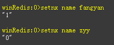

2. redis是单线程模型，即使多个线程同时到达redis，redis也会将线程进行串行化操作（底层基于队列实现）。

```java
@RequestMapping("/deduct_stock")
    public String deductStock() {
        try{
            // 1.加锁，setIfAbsent对应redis的setnx命令，多个线程同时进入此代码，也只有一个能set成功，因为redis是单线程模型
            Boolean absent = stringRedisTemplate.opsForValue().setIfAbsent("product", "lock");
            if (!absent) {
                return "erro";
            }

            int stock = Integer.parseInt(stringRedisTemplate.opsForValue().get("stock"));
            if (stock > 0) {
                int realStock = stock - 1;
                stringRedisTemplate.opsForValue().set("stock", realStock + "");
                System.out.println("扣减库存成功，剩余库存" + realStock);
            } else {
                System.out.println("扣减失败，库存不足");
            }
        }finally{
			//2.释放锁，删除掉redis中的key后，其他线程可以set成功，拿到锁
        	stringRedisTemplate.delete("produce");
        }
        return "end";
```

**代码分析：**

==上述代码容易出现死锁现象==，如果某个线程拿到锁后，执行代码的时候，出现了异常或者改台服务器挂机，那么锁就释放不掉，其他线程就永远获取不到锁。

**解决办法：给锁加个超时时间`expire`**

```java
@RequestMapping("/deduct_stock")
    public String deductStock() {
        try{
            // 加锁，并发设置超时时间，防止死锁后无法释放锁
            Boolean absent = stringRedisTemplate.opsForValue().setIfAbsent("product", "lock", 10, TimeUnit.SECONDS);
            if (!absent) {
                return "erro";
            }

            int stock = Integer.parseInt(stringRedisTemplate.opsForValue().get("stock"));
            if (stock > 0) {
                int realStock = stock - 1;
                stringRedisTemplate.opsForValue().set("stock", realStock + "");
                System.out.println("扣减库存成功，剩余库存" + realStock);
            } else {
                System.out.println("扣减失败，库存不足");
            }
        }finally{
             //释放锁，删除掉redis中的key后，其他线程可以set成功，拿到锁
        	stringRedisTemplate.delete("produce");
        }
        return "end";
    }
```

==上述代码容易出现锁失效问题：==如果第一个线程在设定的超时时间内没有执行完try代码块的代码，第一个线程上的锁会被自动释放，第二个线程也可以获取到锁，当第一个线程执行finally代码块代码释放锁时释放的是第二个线程的锁。因此导致锁失效问题。

**解决办法：给每个线程一个唯一的value值，这样在finally块中判断是否是本线程的锁，如果是才释放**

```java
@RequestMapping("/deduct_stock")
    public String deductStock() {
        //1.每个线程的唯一标识
        String value = UUID.randomUUID().toString();
        try {
            Boolean absent = stringRedisTemplate.opsForValue().setIfAbsent("product", value, 10, TimeUnit.SECONDS);
            if (!absent) {
                return "erro";
            }

            int stock = Integer.parseInt(stringRedisTemplate.opsForValue().get("stock"));
            if (stock > 0) {
                int realStock = stock - 1;
                stringRedisTemplate.opsForValue().set("stock", realStock + "");
                System.out.println("扣减库存成功，剩余库存" + realStock);
            } else {
                System.out.println("扣减失败，库存不足");
            }
        }finally {
            //2.判断如果是该线程加的锁，才进行释放
            if (stringRedisTemplate.opsForValue().get("product").equals(value)) {
                stringRedisTemplate.delete("produce");
            }
        }
        return "end";
    }
}
```

==上述代码仍然有问题，就是超时时间设置的问题，因为不知道try中的代码到底有执行多久，设置太小代码执行不完，try代码就会并行执行。设置太大，程序发生异常时，锁不能及时释放。==

**解决办法：每个线程进入try块中开启一个分线程，使用timer定时查看redis中该线程加的锁是否还存在，存在的话就重新设置超时时间，直至锁被finally中释放。  timer定时时间一般是超时时间的三分之一**

==从上面可以看出如果自己用redis实现分布式锁要考虑的因素太多。因此redis提供了一个分布式锁的框架redisson==

#### 1.2redisson分布式锁实现原理：

```xml
<dependency>
    <groupId>org.redisson</groupId>
    <artifactId>redisson</artifactId>
    <version>3.6.5</version>
</dependency>
```

```java
@Configuration
public class RedissonConfig {
    @Bean
    public Redisson redisson() {
        Config config = new Config();
        config.useSingleServer().setAddress("redis://127.0.0.1:6379").setDatabase(0);
        return (Redisson) Redisson.create(config);
    }
}
```

```java
@RestController
public class IndexController {
    @Autowired
    private StringRedisTemplate stringRedisTemplate;
    @Autowired
    private Redisson redisson;

    @RequestMapping("/deduct_stock")
    public String deductStock() {
        //1.获取锁
        RLock redissonLock = redisson.getLock("product");
        try {
            //2.设置超时时间
            redissonLock.lock(30, TimeUnit.SECONDS);

            int stock = Integer.parseInt(stringRedisTemplate.opsForValue().get("stock"));
            if (stock > 0) {
                int realStock = stock - 1;
                stringRedisTemplate.opsForValue().set("stock", realStock + "");
                System.out.println("扣减库存成功，剩余库存" + realStock);
            } else {
                System.out.println("扣减失败，库存不足");
            }
        }finally {
            //3.释放锁
            redissonLock.unlock();
        }
        return "end";
    }
}
```

> Redisson分布式锁实现原理图

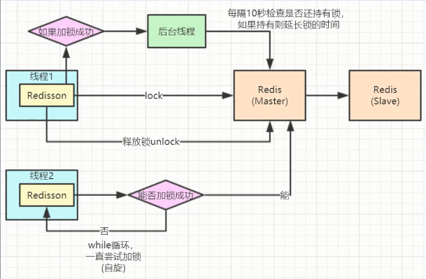


### 2.分布式事务

#### 2.1分布式事务产生的场景

> 1.典型的场景就是微服务架构

微服务之间通过远程调用完成事务操作。

比如：订单微服务和库存微服务，下单的同时订单微服务请求库存微服务减库存。

简言之：跨jvm进程产生的事务。

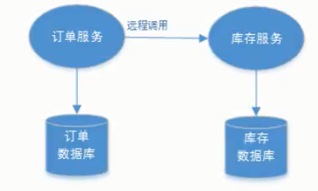

> 2.单体系统访问多个数据库实例

当单体系统访问多个数据库（实例）时会产生分布式事务。

简言之：跨数据库实例产生的分布式事务。

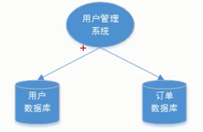

> 3.多服务访问同一个数据库实例

比如：订单微服务和库存微服务即使访问同一个数据库也会产生分布式事务，原因就是跨jvm进程，两个微服务持有了不同的数据库连接进行数据库操作，此时产生分布式事务。

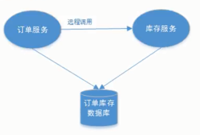

#### 2.2CAP理论

CAP是consitency、availability、partition tolerance三个词语的缩写，分别表示==一致性、可用性、分区容错性==。

为了方便对CAP理论的理解，我们结合电商系统中一些业务场景来理解CAP。

如下图是商品信息管理的执行流程：

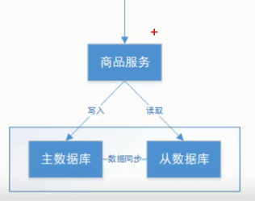

整体执行流程如下：

1. 商品服务请求主数据库写入商品信息
2. 主数据库向商品服务响应写入成功
3. 商品服务请求从数据库读取商品信息

> C-Consistency

​	==一致性是指写操作后的读操作可以读取到最新的数据状态==。当数据分布到多个节点上，从任意节点读取到数据都是最新的状态。

​	上图中，商品信息的读写要满足一致性要求要实现以下目标：

​	1.商品服务写入主数据库成功，则向从数据库查询新数据也成功

​	2.商品服务写入主数据库失败，则向从数据库查询新数据也失败

​	**如何实现一致性？**

​	1.写入主数据库后要将数据同步到从数据库。

​	2.写入主数据库后，在向从数据库同步期间将从数据库锁定，待同步完成后再释放锁，以免在新数据写入成功后，向重数据库查询到旧数据。

> A-Availability

​	==可用性是指任何事务操作都可以得到响应结果，且不会出现响应超时或响应错误==。

​	上图中，商品信息读取满足可用性要实现以下目标：

​	1.从数据库接收到数据查询的请求则立即能够响应数据查询结果

​	2.从数据库不允许出现响应超时或响应错误

​	**如何实现可用性？**

​	1.写入主数据库后将数据同步到从数据库

​	2.由于要保证从数据库的可用性，不可将从数据库中的资源进行锁定

​	3.即使数据还没有同步过来，从数据库也要返回要查询的数据，哪怕是旧数据，如果连旧数据也没有则可以按照约定返回一个默认信息，但不能返回错误或响应超时。

​	**分布式系统可用性的特点：**

​	所有请求都有响应，且不会出现响应超时或响应错误。

> P-Partition tolerance

​	==通常分布式系统的各个节点部署到不同的子网，这就是网络分区，不可避免的会出现由于网络问题而导致的节点间通信失败，此时仍可对外提供服务，这叫分区容错性==。

​	上图中，商品信息读写满足分区容错性就是要实现以下目标;

​	1.主数据库向从数据库同步数据失败不影响读写操作。

​	2.其中一个节点挂掉不影响另外一个节点对外提供服务。

​	**如何实现分区容错性？**

​	1.尽量使用异步取代同步操作，例如使用异步方式将数据从主数据库同步到从数据库，这样节点之间能有效的实现松耦合。

​	2.添加从数据库节点，其中一个节点挂掉其他从节点提供服务。

​	**分区容错性的特点？**

​	==分区容错性是分布式系统具备的基本能力。一定要满足的！！！==

##### 2.2.1CAP组合方式

==在所有分布式事务场景中不会同时具备CAP三个特性，因为在具备了P的前提下C和A是不能共存的。==由上面的定义可以看出C和A是相互矛盾的。

所以在生产中对分布式事务处理时要根据需求来确定满足CAP的哪两方面。

1. AP:

   放弃一致性，追求分区容错性和可用性。这是很多分布式系统设计时的选择。

   例如：

   上面的商品管理，完全可以实现AP，前提是只要用户可以接受所查询的数据在一定时间内不是最新的即可。

   通常实现AP都会保证最终一致性，后面的BASE理论就是根据AP来扩展的。一些业务场景 比如：订单退款，今日退款成功，明日账户到账，只要用户可以接受在一定时间内到账即可。

2. CP：

   放弃可用性，追求一致性和分区容错性，我们的zookeeper其实就是追求的强一致性。又比如跨行转账，一次转账请求要等待双方银行系统都完成整个事务才算完成。

3. CA:

   放弃分区容错性，即不进行分区，不考虑由于网络不通或节点挂掉的问题，则可以实现一致性和可用性。那么系统将不是一个标准的分布式系统。我们最常用的关系型数据库就满足了CA。

   上面的商品管理，如果实现CA则架构如下：

   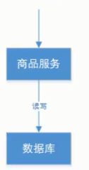

   ​	主数据库和从数据库中间不再进行数据同步，数据库可以响应每次的查询请求，通过事务隔离级别实现每个请求都可以返回最新的数据。

   

#### 2.3BASE理论

1. 理解**强一致性**和**最终一致性**

   CAP理论告诉我们一个分布式系统最多只能同时满足一致性、可用性和分区容错性中的两个。其中AP在实际应用中最多。AP即舍弃一致性，保证可用性和分区容错性。但是实际生产中很多场景都要实现一致性，比如前面我们举的例子主数据库向从数据库同步数据，即使不要一致性，但是也要保证最终数据的一致性。这种一致性和CAP中的一致性不同，**CAP中的一致性要求在任何时间查询每个节点的数据都必须一致，它是强调强一致性。**但是**最终一致性是允许在一段时间内每个节点的数据不一致，但是经过一段时间后每个节点的数据必须一致**，他强调的是最终一致性。

2. BASE理论介绍：

   BASE是Basically Available(基本可用)、Soft state(软状态)和Eventually consistence(最终一致性)。BASE理论是对AP的一个扩展，**通过牺牲强一致性来获取可用性，当出现故障允许部分不可用但要保证核心功能可用，允许数据在一段时间内是不一致的，但是最终达到一致状态**。满足BASE理论的事务，我们称之为“**柔性事物**”。

   * 基本可用：分布式系统在出现故障时，允许损失部分可用功能，保证核心功能可用。如：电商网站交易付款出现问题了，商品依然可以正常浏览。
   * 软状态：由于不要求强一致性，所以BASE允许系统中存在中间状态（也叫**软状态**），这个状态不影响系统可用性，如订单的“支付中”、“数据同步中”等状态，待数据最终一致性后状态改为“成功”状态“。
   * 最终一致：最终一致是指经过一段时间后，所有节点数据都将会达到一致。如订单的“支付中”状态，最终会变为“支付成功”或者“支付失败”，使订单状态与实际交易结果达成一致，但需要一定时间的延迟、等待。


#### 2.4分布式事务解决方案之2PC(两阶段提交)

​	前面已经学习了分布式事务的基础理论，以理论为基础，针对不同的分布式场景业界常见的解决方案有==2PC、TCC、可靠消息最终一致性、最大努力通知==这几种。

> 什么是2PC

​	2PC即指两阶段提交协议，是指整个事务流程分为两个阶段，**准备阶段**（Prepare phase）、**提交阶段**（Commit phase）。

​	整个事务过程由==事务管理器==和==参与者==组成，事务管理器负责决策整个分布式事务的提交和回滚，事务参与者负责自己本地事务的提交和回滚。

​	在计算机中部分关系型数据库如Oracle、MySQL支持两阶段提交协议。

1. 准备阶段：事务管理器给每个参与者发送prepare消息，每个数据库参与者在本地执行事务，并写入本地的Undo/Redo日志，此时事务没有提交。
2. 提交阶段：如果事务管理器收到了参与者的执行失败或者超时消息时，直接给每个参与者发送回滚消息；否则发送提交消息；参与者根据事务管理器的指令执行提交或者回滚操作，并释放事务处理过程中使用的锁资源。


下图展示了2PC的两个阶段，分成功和失败两个情况说明：
**成功情况**

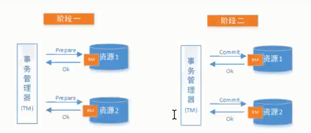

**失败情况**

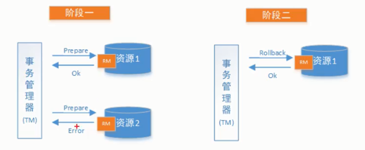

> 解决方案

**1.XA方案**

​	2PC的传统方案是在数据库层面实现的，如Oracle、MySQL都支持2PC协议，为了统一标准减少行业内不必要的对接成本需要指定标准化的处理模型及接口标准，国际开放标准组织定义了分布式事务处理模型DTP.

下面以新用户注册送积分为例说明：

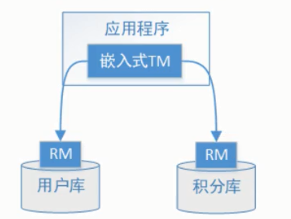

执行流程如下：

1. 应用程序（AP）持有用户库和积分库两个数据源。
2. 应用程序（AP）通过TM通知用户库RM新增用户，同时通知积分库RM为为该用户新增积分，RM此时并未提交事务，此时用户和积分资源锁定。
3. TM收到执行回复，只要有一方失败则分别向RM发起回滚事务，回滚完毕，资源锁释放。
4. TM收到执行回复，全部成功，此时向所有RM发起提交事务，提交完毕，资源锁释放。

DTP模型定义如下角色：

* **AP:**应用程序；

* **RM**：即资源管理器，可以理解为事务的参与者，一般情况下是指一个数据库实例。

* **TM**:事务管理器，负责协调和管理事务，事务管理器控制全局事务，管理事务生命周期，并协调各个RM.

* DTP模型定义TM和RM之间的通讯接口规范叫**XA**,简单理解为数据库提供的2PC接口协议，**基于数据库的XA协议来实现2PC又称为XA方案。**

* 以上三个角色之间的交互方式如下：

  1）TM向AP提供应用程序编程接口，AP通过TM提交及回滚事务。

  2）TM交易中间件通过XA接口来通知RM数据库事务的开始、结束以及提交和回滚等。


总结：

==整个2PC的事务流程涉及三个角色AP、TM、RM。AP指的是使用2PC分布式事务的应用程序；RM是指资源管理器，它控制着分支事务；TM指的是事务管理器，它控制着全局事务。==


**2.Seata方案**

Seata方案的设计思想如下：

​	Seata的设计目的其一是对业务无入侵，因此从业务无入侵的2PC方案着手，在传统2PC的基础上演进，并解决2PC方案面临的问题。

​	Seata把一个分布式事务理解成一个包含了若干**分支事务**的**全局事务**。全局事务的职责是协调其下管辖的分支事务达成一致，要么一起成功提交，要么一起失败回滚。此外，通常分支事务本身就是一个关系数据库的本地事务，下图是全局事务与分支事务的关系图：

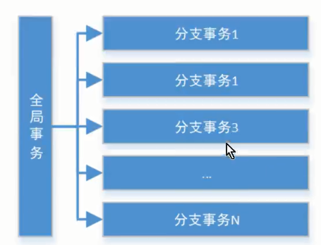

与传统2PC的模型类似，Seata定义了3个组件来协议分布式事务的处理过程：

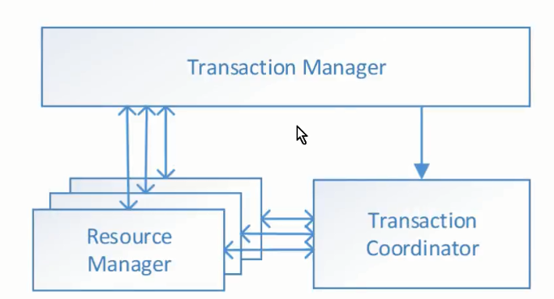

* **Transaction Coordinator(TC)**:==事务协调器==，==它是独立的中间件==，需要独立部署运行，它维护全局事务的运行状态，接收TM指令发起全局事务的提交与回滚，负责与RM通信协调各分支事务的提交或回滚。
* **Transation Manager(TM)**:==事务管理器==，==TM需要嵌入应用程序中工作==，它负责开启一个全局事务，并最终向TC发起全局提交或全局回滚的指令。
* **Resource Manager(RM)**:控制分支事务，负责分支注册、状态汇报，并接收事务协调器TC的指令，驱动分支事务的提交和回滚。


还拿新用户注册送积分举例Seata的分布式事务过程：

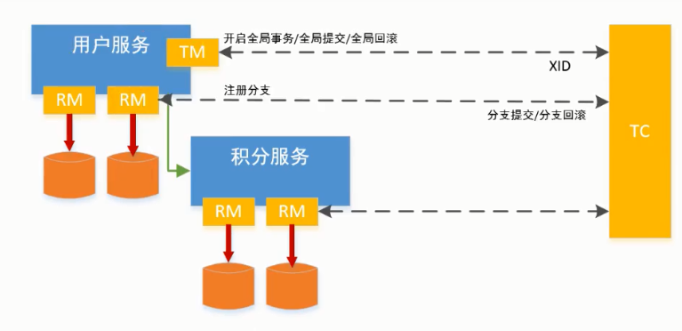

具体流程如下：

​	1.用户服务的TM向TC申请开启一个全局事务，全局事务创建成功并生成一个全局唯一的XID.

​	2.用户服务的RM向TC注册分支事务，该分支事务在用户服务执行新增用户逻辑，并将其纳入XID，并将其纳入XID对应全局事务的管辖。

​	3.用户服务执行分支事务，向用户表插入一条记录。

​	4.逻辑执行到远程调用积分服务时（XID在微服务调用链路的上下文中传播）。积分服务的RM向TC注册分支事务，该分支事务执行增加积分的逻辑，并将其纳入XID对应的全局事务的管辖。

​	5.积分服务执行分支事务，向积分记录表插入一条数据，执行完毕后，返回用户服务。

​	6.用户服务分支事务执行完毕。

​	7.TM向TC发起针对XID的全局提交或回滚决议。

​	8.TC调用XID下管辖的全部分支事务完成提交或回滚的请求。


**Seata实现2PC与传统2PC的差别：**

​	架构层次方面：传统2PC方案的RM实际上是数据库层，RM本质上就是数据库本身，通过XA协议实现，而==Seata的RM是以jar包的形式作为中间件层部署在应用程序这一侧==。

​	两阶段提交方面：传统2PC无论第二阶段的决议是commit还是rollback，事务性资源的锁都要保持到Phase2完成才能释放。而==Seata的做法是在Phase1就将本地事务提交，这样就可以省去Phase2持锁时间，整体提高效率==。

##### 2.4.1Seata实现2PC事务

> 业务说明

本实例通过Seata中间件实现分布式事务，模拟两个账户的转账交易过程。

两个账户在三个不同的银行卡（张三在bank1、李四在bank2），bank1和bank2是两个微服务。交易过程是张三给李四转账指定金额。

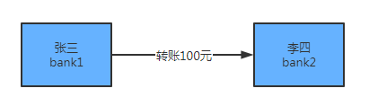

**本示例程序技术架构如下：**

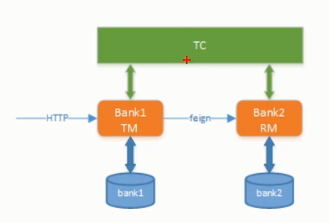

**交互流程如下：**

1. 请求bank1进行转账，传入转账金额
2. bank1减少转账金额，调用bank2，传入转账金额

**程序组成部分：**

* 数据库：mysql包括bank1和bank2两个数据库
* 微服务框架：spring-boot-2.1.3、spring-cloud-Greenwich.RELEASE
* Seata客户端（RM、TM）:spring-cloud-alibaba-seata-2.1.0.RELEASE
* Seata服务端（TC）:seata-server-0.7.1
* 服务注册中心：Eureka->discover-server

> 案例实现

1. 创建数据库bank1和bank2，并创建对应的account_info和undo_log表

2. 启动TC事务协调器

   1. 下载地址：https://github.com/seata/seata/releases/download/v0.7.1/seata-server-0.7.1.zip

   2. 解压并启动：[seata服务端解压路径]/bin/seata-server.bat -p 8888 -m file

      注：其中8888为服务端口号；file为启动模式，这里指seata服务将采用文件的方式存储信息。

      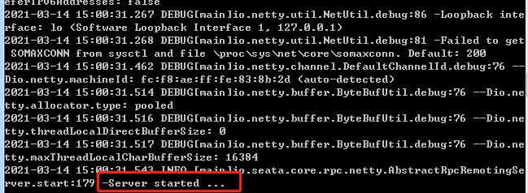

3. discover-server

   discover-server 是服务注册中心，基于Eureka实现。

   **。。。。其余步骤参考教程**

> Seata实现2PC小结：

Seata的0侵入性解决了传统2PC长期锁资源的问题。

Seata实现2PC要点：

1. 全局事务开始使用@GlobalTransational标识；
2. 每个本地事务方案仍然使用@Transational标识；
3. 每个数据库都要创建undo_log表，此表是Seata保证全局事务一致性的关键。