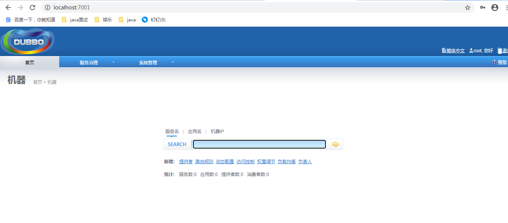

### 一、基础知识

#### 1.1分布式基础理论

##### 1.1.1是什么是分布式系统？

```java
《分布式系统原理与规范》定义：
	分布式系统是若干独立计算机的集合，这些计算机对于用户来说就像单个相关系统。
	分布式系统是建立在网络之上的软件系统。
随着互联网的发展，网站应用的规模不断扩大，常规的垂直应用架构已无法应对。分布式服务架构以及流动计算架构势在必行，需要一个治理系统确保架构有条不紊的演进。
```

##### 1.1.2发展演变


**1.单一应用架构**

```java
当网站流量很小时，只需要一个应用，将所有功能都部署到一起，以减少部署节点和成本。此时用于简化增删改查工作量的数据访问框架（ORM）是关键。

适用于小型网站，小型管理系统，将所有功能都部署到一个功能里，简单易用。
缺点：1.性能扩展比较难
	 2.协同开发问题
	 3.不利于升级维护
```


**2.垂直应用架构**

```
当访问量逐渐增大，单一应用增加机器带来的加速度越来越小，将应用拆成互不相关的几个应用，以提升效率。此时用于加速前端页面开发的web框架（MVC）是关键。

通过切分业务来实现各个模块独立部署，降低了维护和部署的难度，团队各司其职更易管理，性能扩展也更方便，更有针对性。
缺点：共用模块无法重复利用，开发性的浪费。
```


**3.分布式服务架构**

```java
当垂直应用越来越多，应用之间交互不可避免，将核心业务抽取出来，作为独立的服务，逐渐形成稳定的服务中心，使前端应用能更快速的响应多变的市场需求。此时，用于提高业务复用及整合的分布式服务框架（RPC）是关键。
```


**4.流动计算框架**

```java
当服务越来越多，容量的评估，小服务资源的浪费等问题逐渐显现，此时需增加一个调度中心基于访问压力实时管理集群容量，提高集群利用率。此时，用于提高机器利用率的资源调度和治理中心（SOA）【Service Oriented Architecture】是关键。
```


##### 1.1.3RPC

```java
RPC（Remote Procedure Call）是指远程过程调用，是一种进程间通信方式，它是一种技术的思想，而不是规范。它允许程序调用另一个地址空间（通常是共享网络的另一条机器上）的过程或函数，而不是程序员显式编码这个远程调用细节。即程序员无论是调用本地还是远程的函数，本质上编写的调用代码基本相同。
```


#### 1.2dubbo核心概念

##### 1.2.1简介

```java
Apache Dubbo是一款高性能、轻量级的开源Java RPC框架，它提供了三大核心能力：
	1）面向接口的远程方法调用；
	2）智能容错和负载均衡；
	3）服务自动注册和发现；
官网：http://dubbo.apache.org/
```

##### 1.2.2基本概念


```java
1.服务提供者（provider）：暴露服务的服务提供方，服务提供者在启动时，向注册中心注册自己提供的服务。
2.服务消费者（consumer）：调用远程服务的服务消费方，服务消费者在启动时，向注册中心订阅自己所需的服务。服务   消费者从提供者地址列表中，基于软负载均衡算法，选一台提供者进行调用，如果调用失败，再选另一台调用。
3.注册中心（registry）：注册中心返回服务提供者地址列表给消费者，如果有变更，注册中心将基于长连接推送变更数   据给消费者。
4.监控中心（monitor）：服务消费者和提供者，在内存中累计调用次数和调用时间，定时每分钟发送一次统计数据到监控   中心。

//调用关系说明
* 服务容器负责启动，加载，运行服务提供者。
* 服务提供者在启动时，向注册中心注册自己提供的服务。
* 服务消费者在启动时，向注册中心订阅自己所需要的服务。
* 注册中心返回服务提供者地址列表给消费者，如果有变更，注册中心将基于长连接推送变更数据给消费者。
* 服务消费者，从提供者地址列表中，基于软负载均衡算法，选一台提供者进行调用，如果调用失败，再选另一台调用。
* 服务消费者和提供者，在内存中累计调用次数和调用时间，定时每分钟发送一次统计数据到监控中心 。
```

#### 1.3dubbo环境搭建

##### 1.3.1windows安装zookeeper

```java
1.下载zookeeper
	网址 https://archive.apache.org/dist/zookeeper/zookeeper-3.4.13/
2.解压zookeeper	
	解压后在bin目录下运行zkServer.cmd,初次运行会报错，没有zoo.cfg配置文件
3.修改zoo.cfg配置文件
	1）将cnf下zoo_sample.cfg复制一份改名为zoo.cfg即可。
	2）注意几个重要的位置：
		dataDir=./data		//临时数据存储目录（可写相对路径）
		clientPort=2181		//zookeeper的端口号
4.使用zkCli.cmd测试
	ls/:	//列出zookeeper根下保存的所有节点
	create -e /fangyan 9527		//创建一个fangyan节点的，值为9527
	get /fangyan		//获取/fangyan节点的值
```

##### 1.3.2Windows下安装dubbo-admin管理控制台

```java
//dubbo本身并不是一个服务软件。他其实就是一个jar包能够帮助你的java程序连接到zookeeper，并利用zookeeper消费、提供服务。
所以你不用在Linux上启动什么dubbo服务。
但是为了让用户更好的管理监控众多的dubbo服务，官方提供了一个可视化的监控程序，不过这个监控即使不装也不影响使用。

1.下载dubbo-admin
	https://github.com/apache/incubator-dubbo-ops 
2.进入目录修改dubbo-admin配置
	dubbo-admin是一个springboot项目，修改application.properties，指定zookeeper地址；
	dubbo.registry.address=zookeeper://127.0.0.1:2181
3.进入dubbo-admin目录下pom.xml所在目录，打开cmd窗口，运行mvn clean package 将dubbo-admin打成jar包；//前提是配置文件配置的zookeeper已启动
4.进入dubbo-admin打成的jar包所在目录，打开cmd窗口，启动jar包
5.启动成功后，浏览器输入dubbo-admin的地址（默认端口7001，用户名root密码root）
```



##### 1.3.3linux环境下安装zookeeper和dubbo-admin

```java
和Windows类似，详见课件
```

#### 1.4dubbo-helloworld

##### 1.4.1提出需求

```
某个电商系统，订单服务需要调用户服务获取某个用户的所有地址；
我们现在需要创建两个服务模块进行测试：如下表格

测试预期结果：
	订单服务web模块在A服务器，用户服务模块子B服务器，A可以远程调用B的功能。
```

| 模块                | 功能           |
| ------------------- | -------------- |
| 订单服务模块        | 创建订单等     |
| 用户服务service模块 | 查询用户地址等 |

##### 1.4.2工程架构

根据dubbo《服务化最佳实践》

```java
1.分包
	建议将服务接口，服务模型，服务异常等均放在API包中，因为服务模型及异常也是API一部分，同时，这样做也符合分包原则：重用发布等价原则（REP），共同重用原则（CRP）。
	如果需要，也可以考虑在API包中放置一份spring的引用配置，这样适用方只需要在spring加载过程中引用此配置即可，配置建议放在模块的包目录下，以免冲突，如：
	com/alibaba/china/xxx/dubbo-reference.xml
	
2.粒度
	服务接口尽可能大粒度，每个服务方法应代表一个功能，而不是某个功能的步骤，否则将面临分布式事务问题，dubbo暂时未提供分布式事务支持。
	服务接口建议以业务场景为单位划分，并对相近业务做抽象，防止接口数量爆炸。
	不建议使用过于抽象的通用接口，如 Map query(Map map) ,这样接口没有明确语义，会给后期维护带来不便。
```


##### 1.4.3创建模块

**1.gmall-interface:公共接口层（model，service，exception...）**

```java 
//1.Bean模型
public class UserAddress implements Serializable{ //注意进行远程调用，bean传输时必须序列化
    private Integer id;
    private String userAddress;
    private String userId;
    private String consignee;
    private String phoneNumber;
    private String isDefault;
    ...
}

//2.service接口
public interface UserService {
    List<UserAddress> getUserAddressList(String userId);
}
```

**2.gmall-user:用户模块（对用户接口的实现）**

```xml
<!--1.pom.xml引入gall-interface-->
  <dependencies>
        <dependency>
            <groupId>com.fy.dubbo</groupId>
            <artifactId>gmall-interface</artifactId>
            <version>1.0-SNAPSHOT</version>
        </dependency>
    </dependencies>
```

```java
//2.service接口实现类
public class UserServiceImpl implements UserService {
    @Override
    public List<UserAddress> getUserAddressList(String userId) {
        //todo: something
        UserAddress address1 = new UserAddress(1, "北京市昌平区宏福科技园综合楼3层", "1", "李老师", "010-56253825", "Y");
        UserAddress address2 = new UserAddress(2, "深圳市宝安区西部硅谷大厦B座3层（深圳分校）", "1", "王老师", "010-56253825", "N");
        return Arrays.asList(address1, address2);
    }
}
```

**3.gmall-order-web:订单模块（调用用户模块）**

```xml
 <dependencies>
        <dependency>
            <groupId>com.fy.dubbo</groupId>
            <artifactId>gmall-interface</artifactId>
            <version>1.0-SNAPSHOT</version>
        </dependency>
    </dependencies>
```

```java 
public class OrderService {
    UserService userService;

    /**
     * 初始化订单，查询用户所有地址并返回
     * @param userId
     * @return
     */
    public List<UserAddress> initOrder(String userId) {
        return userService.getUserAddressList(userId);
    }
}

//说明:现在这样是无法进行调用的。我们gmall-order-web引入了gmall-interface,但是interface的实现是gmall-user，我们并没有引入，而且实际他可能还在别的服务器中。
```

##### 1.4.4使用dubbo改造

###### **1.改造gmall-user作为服务提供者**

1）引入dubbo依赖和zk客户端依赖

```xml
	   <!-- 引入dubbo -->
        <dependency>
            <groupId>com.alibaba</groupId>
            <artifactId>dubbo</artifactId>
            <version>2.6.2</version>
        </dependency>

        <!-- 由于我们使用zookeeper作为注册中心，所以需要操作zookeeper
        dubbo 2.6以前的版本引入zkclient操作zookeeper
        dubbo 2.6及以后的版本引入curator操作zookeeper
        下面两个zk客户端根据dubbo版本2选1即可
        -->
        <!--<dependency>
            <groupId>com.101tec</groupId>
            <artifactId>zkclient</artifactId>
            <version>0.10</version>
        </dependency>-->
        <dependency>
            <groupId>org.apache.curator</groupId>
            <artifactId>curator-framework</artifactId>
            <version>2.12.0</version>
        </dependency>
```

2）配置提供者

```xml
<!--provider.xml-->

<beans xmlns:xsi="http://www.w3.org/2001/XMLSchema-instance"
       xmlns:dubbo="http://dubbo.apache.org/schema/dubbo"
       xmlns="http://www.springframework.org/schema/beans"
       xsi:schemaLocation="http://www.springframework.org/schema/beans http://www.springframework.org/schema/beans/spring-beans-4.3.xsd
       http://dubbo.apache.org/schema/dubbo http://dubbo.apache.org/schema/dubbo/dubbo.xsd">

    <!-- 当前应用的名字 -->
    <dubbo:application name="gmall-user"/>
    <!-- 注册中心的地址 -->
    <dubbo:registry address="zookeeper://127.0.0.1:2181"/>
    <!-- 使用dubbo协议，将服务暴露在20880端口 -->
    <dubbo:protocol name="dubbo" port="20880"/>
    <!-- 指定需要暴露的服务接口，并指定接口实现类 -->
    <dubbo:service interface="com.fy.service.UserService" ref="demoService"/>
    <!-- 接口实现类 -->
    <bean id="demoService" class="com.fy.dubbo.service.serviceImpl.UserServiceImpl"/>
</beans>
```

3)启动服务并测试

```java
public class TestDemo {
    public static void main(String[] args) throws IOException {
        ClassPathXmlApplicationContext context = new ClassPathXmlApplicationContext("classpath:provider.xml");
        context.start();
        System.out.println("provider is start");
        System.in.read();
    }
}
```


###### **2.改造gmall-order-web作为服务消费者**

```xml
<!-- 引入dubbo -->
        <dependency>
            <groupId>com.alibaba</groupId>
            <artifactId>dubbo</artifactId>
            <version>2.6.2</version>
        </dependency>

        <!-- 由于我们使用zookeeper作为注册中心，所以需要操作zookeeper
        dubbo 2.6以前的版本引入zkclient操作zookeeper
        dubbo 2.6及以后的版本引入curator操作zookeeper
        下面两个zk客户端根据dubbo版本2选1即可
        -->
        <!--<dependency>
            <groupId>com.101tec</groupId>
            <artifactId>zkclient</artifactId>
            <version>0.10</version>
        </dependency>-->
        <dependency>
            <groupId>org.apache.curator</groupId>
            <artifactId>curator-framework</artifactId>
            <version>2.12.0</version>
        </dependency>
```

consumer.xml

```xml
<?xml version="1.0" encoding="UTF-8"?>
<beans xmlns:xsi="http://www.w3.org/2001/XMLSchema-instance"
       xmlns:dubbo="http://dubbo.apache.org/schema/dubbo"
       xmlns="http://www.springframework.org/schema/beans" xmlns:context="http://www.springframework.org/schema/context"
       xsi:schemaLocation="http://www.springframework.org/schema/beans http://www.springframework.org/schema/beans/spring-beans-4.3.xsd
       http://dubbo.apache.org/schema/dubbo http://dubbo.apache.org/schema/dubbo/dubbo.xsd http://www.springframework.org/schema/context http://www.springframework.org/schema/context/spring-context.xsd">
    <!--开启包扫描-->
    <context:component-scan base-package="com.fy.dubbo.service"/>

    <!-- 应用名 -->
    <dubbo:application name="gmall-order-web"/>
    <!-- 指定注册中心地址 -->
    <dubbo:registry address="zookeeper://127.0.0.1:2181"/>
    <!-- 生成远程服务代理，可以和本地bean一样使用userService -->
    <dubbo:reference id="userService" interface="com.fy.service.UserService"/>
</beans>
```

测试远程调用

```java
public class ApplicationDemo {
    public static void main(String[] args) throws IOException {
        ClassPathXmlApplicationContext con = new ClassPathXmlApplicationContext("classpath:consumer.xml");
        OrderService orderService = (OrderService) con.getBean("orderService");
        List<UserAddress> userAddresses = orderService.initOrder("1");
        for (UserAddress userAddress : userAddresses) {
            System.out.println(userAddress.toString());
        }
        System.in.read();
    }
}
```


###### 3.注解版


#### 1.5监控中心

##### 1.5.1dubbo-admin

```java
图形化服务管理页面；
安装时需要指定注册中心地址，即可从注册中心获取到所有提供者/消费者进行配置管理。
//详见1.3.2
```

##### 1.5.2dubbo-monitor-simple

###### 1.5.2.1监控中心安装启动

```java
1.下载
	https://github.com/apache/incubator-dubbo-ops
2.修改配置指定注册中心地址
进入 dubbo-monitor-simple\src\main\resources\conf
修改 dubbo.properties文件
```


```java 
3.打包dubbo-monitor-simple
	mvn clean package -Dmaven.test.skip=true
4.解压tar.gz文件，并运行start.bat
	//如果缺少servlet-api，自行导入servlet-api再访问监控中心
```


5.启动访问8080端口


###### 1.52.2监控中心配置

```xml
<!--监控中心配置-->
<!--所有服务配置连接监控中心，进行监控统计-->

<!-- 监控中心协议，如果为protocol="registry"，表示从注册中心发现监控中心地址，否则直连监控中心 -->
	<dubbo:monitor protocol="registry"></dubbo:monitor>


<!--
Simple Monitor挂掉不会影响到Consumer和Provider之间的调用，所以用于生产环境不会有风险。Simple Monitor采用磁盘存储统计信息，请注意安装机器的磁盘限制，如果要集群，建议用mount 共享磁盘。
-->
```

#### 1.6整合springboot

###### 1.6.1用springboot创建提供者和消费者服务，引入dubbo和curator

```xml
 <!--引入dubbo启动器,dubbo-start已经依赖了curator不用单独引入-->
        <dependency>
            <groupId>com.alibaba.boot</groupId>
            <artifactId>dubbo-spring-boot-starter</artifactId>
            <version>0.2.0</version>
        </dependency>
        <!--引入公共接口-->
        <dependency>
            <groupId>com.fy.dubbo</groupId>
            <artifactId>gmall-interface</artifactId>
            <version>1.0-SNAPSHOT</version>
        </dependency>
```

注意start版本适配


###### 1.6.2配置application.properties

```properties
#服务提供者配置
dubbo.application.name=boot-user
dubbo.registry.address=127.0.0.1:2181
dubbo.registry.protocol=zookeeper
dubbo.protocol.name=dubbo
dubbo.scan.base-packages=com.fy.dubbo.bootuser.serviceImpl

#服务消费者配置
dubbo.application.name=boot-order-web
dubbo.registry.address=127.0.0.1:2181
dubbo.registry.protocol=zookeeper
dubbo.protocol.name=dubbo

#参数说明
#application.name就是服务名，不能跟别的dubbo提供端重复
#registry.protocol 是指定注册中心协议
#registry.address 是注册中心的地址加端口号
#protocol.name 是分布式固定是dubbo,不要改。
#base-package  注解方式要扫描的包 如果不配置可以在启动类上添加@EnableDubbo注解，也可以在需要暴露的接口上使用@Service
注意：此处不同于spring的配置没有配置要暴露的服务接口，可以直接在要暴露的接口上添加@Service注解
```

##### 1.6.3服务提供者代码（@Service）

```java
@Service //在要暴露的服务接口上添加dubbo的@Service注解
public class UserServiceImpl implements UserService {
    @Override
    public List<UserAddress> getUserAddressList(String userId) {
        //todo: something
        UserAddress address1 = new UserAddress(1, "北京市昌平区宏福科技园综合楼3层", "1", "李老师", "010-56253825", "Y");
        UserAddress address2 = new UserAddress(2, "深圳市宝安区西部硅谷大厦B座3层（深圳分校）", "1", "王老师", "010-56253825", "N");
        return Arrays.asList(address1, address2);
    }
}
```

##### 1.6.4服务消费者代码（@Reference）

```java 
@Service
public class OrderService {
    @Reference //远程调用userService
    UserService userService;

    public List<UserAddress> initOrder(String userId) {
        return userService.getUserAddressList(userId);
    }
}

//controller层直接调用service，如图，调用成功
```


### 二、dubbo配置

#### 2.1配置加载顺序


```java
JVM启动 -D参数优先，这样可以使用用户在部署和启动时进行参数重写，比如在启动时需改变协议的端口。
XML次之，如果在xml中配置，则dubbo.properties中相应配置无效。
properties配置最后，相当于缺省值，只有xml中没有配置时，dubbo.properties的相应配置项才会生效，通常用于共享公共配置，比如应用名。
```

#### 2.2启动时检查

```
Dubbo 缺省会在启动时检查依赖的服务是否可用，不可用时会抛出异常，阻止 Spring 初始化完成，以便上线时，能及早发现问题，默认 check="true"。
可以通过 check="false" 关闭检查，比如，测试时，有些服务不关心，或者出现了循环依赖，必须有一方先启动。
另外，如果你的 Spring 容器是懒加载的，或者通过 API 编程延迟引用服务，请关闭 check，否则服务临时不可用时，会抛出异常，拿到 null 引用，如果 check="false"，总是会返回引用，当服务恢复时，能自动连上。
```

以下参数都可以通过spring的xml或springboot的properties、dubbo.propertes、JVM的-D参数配置，加载顺序遵循2.1原则

以spring的xml配置为例：

```xml
关闭某个服务的启动时检查 (没有提供者时报错)：
<dubbo:reference interface="com.foo.BarService" check="false" />
关闭所有服务的启动时检查 (没有提供者时报错)：
<dubbo:consumer check="false" />
关闭注册中心启动时检查 (注册订阅失败时报错)：
<dubbo:registry check="false" />
```

#### 2.3重试次数

```xml
失败自动切换，当出现失败，重试其它服务器，但重试会带来更长延迟。可通过 retries="2" 来设置重试次数(不含第一次)。  一般配置timeout使用
配置如下：
<dubbo:service retries="2" />
或
<dubbo:reference retries="2" />
或
<dubbo:reference>
    <dubbo:method name="findFoo" retries="2" />
</dubbo:reference>
```

#### 2.4超时时间和覆盖规则

```xml
由于网络或服务端不可靠，会导致调用出现一种不确定的中间状态（超时）。为了避免超时导致客户端资源（线程）挂起耗尽，必须设置超时时间。

1.dubbo消费端
	全局超时配置
    <dubbo:consumer timeout="5000" />

    指定接口以及特定方法超时配置
    <dubbo:reference interface="com.foo.BarService" timeout="2000">
        <dubbo:method name="sayHello" timeout="3000" />
    </dubbo:reference>

2.dubbo服务端
	全局超时配置
    <dubbo:provider timeout="5000" />

    指定接口以及特定方法超时配置
    <dubbo:provider interface="com.foo.BarService" timeout="2000">
        <dubbo:method name="sayHello" timeout="3000" />
    </dubbo:provider>

3.配置原则
	dubbo推荐在Provider上尽量多配置Consumer端属性：
	1）作服务的提供者，比服务使用方更清楚服务性能参数，如调用的超时时间，合理的重试次数，等等
    2）在Provider配置后，Consumer不配置则会使用Provider的配置值，即Provider配置可以作为Consumer的缺省		值。否则，Consumer会使用Consumer端的全局设置，这对于Provider不可控的，并且往往是不合理的
```

**配置的覆盖规则**

```
1) 方法级配置别优于接口级别，即小Scope优先 
2) Consumer端配置 优于 Provider配置 优于 全局配置，
3) 最后是Dubbo Hard Code的配置值（见配置文档）
```


#### 2.5多版本

```
当一个接口实现，出现不兼容升级时，可以用版本号过渡，版本号不同的服务相互间不引用。
可以按照以下的步骤进行版本迁移：
1.在低压力时间段，先升级一半提供者为新版本
2.再将所有消费者升级为新版本
3.然后将剩下的一半提供者升级为新版本
```

```xml
老版本服务提供者配置：
<dubbo:service interface="com.foo.BarService" version="1.0.0" />

新版本服务提供者配置：
<dubbo:service interface="com.foo.BarService" version="2.0.0" />

老版本服务消费者配置：
<dubbo:reference id="barService" interface="com.foo.BarService" version="1.0.0" />

新版本服务消费者配置：
<dubbo:reference id="barService" interface="com.foo.BarService" version="2.0.0" />

如果不需要区分版本，可以按照以下的方式配置 （随机访问不同版本的提供者接口）：
<dubbo:reference id="barService" interface="com.foo.BarService" version="*" />
```

#### 2.6本地存根

```
远程服务后，客户端通常只剩下接口，而实现全在服务器端，但提供方有些时候想在客户端也执行部分逻辑，比如：做 ThreadLocal 缓存，提前验证参数，调用失败后伪造容错数据等等，此时就需要在 API 中带上 Stub，客户端生成 Proxy 实例，会把 Proxy 通过构造函数传给 Stub [1]，然后把 Stub 暴露给用户，Stub 可以决定要不要去调 Proxy。
```

```xml
在 spring 配置文件中按以下方式配置：
<dubbo:service interface="com.foo.BarService" stub="true" />
或
<dubbo:service interface="com.foo.BarService" stub="com.foo.BarServiceStub" />
```

```java
//提供 Stub 的实现 [2]：
public class BarServiceStub implements BarService {
    private final BarService barService;
    
    // 构造函数传入真正的远程代理对象
    public BarServiceStub(BarService barService){
        this.barService = barService;
    }
 
    public String sayHello(String name) {
        // 此代码在客户端执行, 你可以在客户端做ThreadLocal本地缓存，或预先验证参数是否合法，等等
        try {
            return barService.sayHello(name);
        } catch (Exception e) {
            // 你可以容错，可以做任何AOP拦截事项
            return "容错数据";
        }
    }
}

//注意：1.Stub 必须有可传入 Proxy 的构造函数。 ↩︎
	//2.在 interface 旁边放一个 Stub 实现，它实现 BarService 接口，并有一个传入远程 BarService 实例的构造函数 ↩︎
```

#### 2.7dubbo配置与springboot整合的三种方式

```java
//1.导入dubbo-starter,在application.properties配置属性，使用@Service暴露服务，使用@Reference发现服务。

//2.保留dubbo.xml配置文件；
	导入dubbo-starter，在启动类使用@ImportResource导入dubbo.xml配置文件即可。
	
//3.使用注解API方式（就是springboot的配置类）
	将每一个组件手动创建到容器中
	在启动类开启@EnableDubbo(scanBasePackage="com.fy.gmall") //开启并配置扫描包
	在需要暴露的服务使用@Service注解
```

```java
//API配置详解
参考官网：http://dubbo.apache.org/en-us/docs/user/configuration/api.html

所有API属性在XML中都有对应的属性，有关详细信息，请参见XML参考。例如ApplicationConfig.setName("xxx")等于 <dubbo:application name="xxx" />
```


### 三、高可用

#### 3.1zookeeper宕机与dubbo直连

现象：zookeeper注册中心宕机，还可以消费dubbo暴露的服务。

```java
健壮性
	监控中心宕掉不影响使用，只是丢失部分采样数据
	数据库宕掉后，注册中心仍能通过缓存提供服务列表查询，但不能注册新服务
	注册中心对等集群，任意一台宕掉后，将自动切换到另一台
// 注册中心全部宕掉后，服务提供者和服务消费者仍能通过本地缓存通讯
	服务提供者无状态，任意一台宕掉后，不影响使用
	服务提供者全部宕掉后，服务消费者应用将无法使用，并无限次重连等待服务提供者恢复
```

dubbo直连，绕过注册中心


#### 3.2集群下dubbo负载均衡配置

```java
//在集群负载均衡时，Dubbo 提供了多种均衡策略，缺省为 random 随机调用。

dubbo的负载均衡策略：
1.Random LoadBalance ：随机，按权重设置随机概率。
2.RoundRobin LoadBalance：轮询，按公约后的权重设置轮询比率。
3.LeastActive LoadBalance：最少活跃调用数，相同活跃数的随机，活跃数指调用前后计数差。
4.ConsistentHash LoadBalance：一致性 Hash，相同参数的请求总是发到同一提供者。

//配置
服务端服务级别
<dubbo:service interface="..." loadbalance="roundrobin" />
客户端服务级别
<dubbo:reference interface="..." loadbalance="roundrobin" />
服务端方法级别
<dubbo:service interface="...">
    <dubbo:method name="..." loadbalance="roundrobin"/>
</dubbo:service>
客户端方法级别
<dubbo:reference interface="...">
    <dubbo:method name="..." loadbalance="roundrobin"/>
</dubbo:reference>
```

#### 3.3服务降级

```java
当服务器压力剧增的情况下，根据实际业务情况及流量，对一些服务和页面有策略的不处理或换作简单的方式处理，从而释放服务器资源以保证核心交易正常运作或高效运作。

//可以通过服务降级功能临时屏蔽某个出错的非关键业务，并定义降级后的返回策略。
向注册中心写入动态配置覆盖规则：
RegistryFactory registryFactory = ExtensionLoader.getExtensionLoader(RegistryFactory.class).getAdaptiveExtension();
Registry registry = registryFactory.getRegistry(URL.valueOf("zookeeper://10.20.153.10:2181"));
registry.register(URL.valueOf("override://0.0.0.0/com.foo.BarService?category=configurators&dynamic=false&application=foo&mock=force:return+null"));

/*其中：
	mock=force:return+null 表示消费方对该服务的方法调用都直接返回 null 值，不发起远程调用。用来屏蔽不重要服务不可用时对调用方的影响。
	还可以改为 mock=fail:return+null 表示消费方对该服务的方法调用在失败后，再返回 null 值，不抛异常。用来容忍不重要服务不稳定时对调用方的影响。
*/

也可以通过dubbo的控制台来控制服务降级
“屏蔽”相当于mock=force:return+null
“容错”相当于mock=fail:return+null
```


#### 3.4集群容错和服务熔断（hystrix）

1. 集群容错

```java
在集群调用失败时，Dubbo 提供了多种容错方案，缺省为 failover 重试。
1. Failover Cluster
失败自动切换，当出现失败，重试其它服务器。通常用于读操作，但重试会带来更长延迟。可通过 retries="2" 来设置重试次数(不含第一次)。

重试次数配置如下：
<dubbo:service retries="2" />
或
<dubbo:reference retries="2" />
或
<dubbo:reference>
    <dubbo:method name="findFoo" retries="2" />
</dubbo:reference>

2. Failfast Cluster
快速失败，只发起一次调用，失败立即报错。通常用于非幂等性的写操作，比如新增记录。

3. Failsafe Cluster
失败安全，出现异常时，直接忽略。通常用于写入审计日志等操作。

4. Failback Cluster
失败自动恢复，后台记录失败请求，定时重发。通常用于消息通知操作。

5. Forking Cluster
并行调用多个服务器，只要一个成功即返回。通常用于实时性要求较高的读操作，但需要浪费更多服务资源。可通过 forks="2" 来设置最大并行数。

6. Broadcast Cluster
广播调用所有提供者，逐个调用，任意一台报错则报错 [2]。通常用于通知所有提供者更新缓存或日志等本地资源信息。

集群模式配置
按照以下示例在服务提供方和消费方配置集群模式
<dubbo:service cluster="failsafe" />
或
<dubbo:reference cluster="failsafe" />
```

2. 整合hystrix

```java
Hystrix 旨在通过控制那些访问远程系统、服务和第三方库的节点，从而对延迟和故障提供更强大的容错能力。Hystrix具备拥有回退机制和断路器功能的线程和信号隔离，请求缓存和请求打包，以及监控和配置等功能
```

1）配置spring-cloud-starter-netflix-hystrix

```xml
<dependency>
    <groupId>org.springframework.cloud</groupId>
    <artifactId>spring-cloud-starter-netflix-hystrix</artifactId>
    <version>1.4.4.RELEASE</version>
</dependency>
```

```java 
//在启动类开启hystrix，  @EnableHystrix
@SpringBootApplication
@EnableHystrix
public class ProviderApplication {
```

2）配置provider端

```java
//在dubbo的provider上增加@HystrixCommand配置，这样调用就会经过hystrix代理

@Service(version = "1.0.0")
public class HelloServiceImpl implements HelloService {
    @HystrixCommand(commandProperties = {
     @HystrixProperty(name = "circuitBreaker.requestVolumeThreshold", value = "10"),
     @HystrixProperty(name = "execution.isolation.thread.timeoutInMilliseconds", value = "2000") })
    @Override
    public String sayHello(String name) {
        // System.out.println("async provider received: " + name);
        // return "annotation: hello, " + name;
        throw new RuntimeException("Exception to show hystrix enabled.");
    }
}
```

3）配置consumer端

```java
//对于consumer端，则可以增加一层method调用，并在method上配置@HystrixCommand.当调用出错时，会走fallbackMethod="reliable"的调用

@Reference(version = "1.0.0")
    private HelloService demoService;

    @HystrixCommand(fallbackMethod = "reliable")
    public String doSayHello(String name) {
        return demoService.sayHello(name);
    }
    public String reliable(String name) {
        return "hystrix fallback value";
    }
```

### 四、dubbo原理（参见课件）	