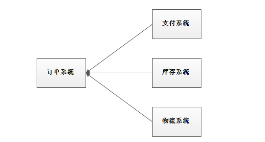
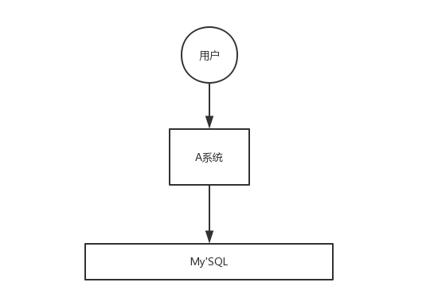
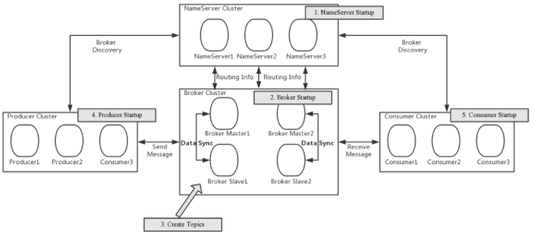

### 1.MQ介绍

#### 1.1为什么使用MQ

消息队列是一种先进先出的数据结构


其应用场景主要包含以下3个方面

* 应用解耦

系统的耦合性越高，容错性就越低。以电商应用为例，用户创建订单后，如果耦合调用库存系统、物流系统、支付系统，任何一个子系统出了故障或者因为升级等原因暂时不可用，都会造成下单操作异常，影响用户使用体验。



使用消息队列解耦合，系统的耦合性就会降低了。比如物流系统发生故障，需要几分钟才能来修复，在这段时间内，物流系统要处理的数据被缓存到消息队列中，用户的下单操作正常完成。当物流系统回复后，补充处理存在消息队列中的订单消息即可，终端系统感知不到物流系统发生过几分钟故障。


* 流量削峰



应用系统如果遇到系统请求流量的瞬间猛增，有可能会将系统压垮。有了消息队列可以将大量请求缓存起来，分散到很长一段时间处理，这样可以大大提到系统的稳定性和用户体验。


一般情况，为了保证系统的稳定性，如果系统负载超过阈值，就会阻止用户请求，这会影响用户体验，而如果使用消息队列将请求缓存起来，等待系统处理完毕后通知用户下单完毕，这样总不能下单体验要好。

<u>处于经济考量目的：</u>

业务系统正常时段的QPS如果是1000，流量最高峰是10000，为了应对流量高峰配置高性能的服务器显然不划算，这时可以使用消息队列对峰值流量削峰

* 异步


通过消息队列可以让数据在多个系统更加之间进行流通。数据的产生方不需要关心谁来使用数据，只需要将数据发送到消息队列，数据使用方直接在消息队列中直接获取数据即可


#### 1.2MQ的优缺点

**优点：**==解耦==、==削峰==、==异步==

**缺点：**

* 系统可用性降低

  系统引入的外部依赖越多，系统稳定性越差。一旦MQ宕机，就会对业务造成影响

  如何保证MQ的高可用？

* 系统复杂度提高

  MQ的加入大大增加了系统的复杂度，以前系统间是同步的远程调用，现在是通过MQ进行异步调用。

  如何保证消息没有被重复消费？怎么处理消息丢失情况？如何保证消息传递的顺序性？

* 一致性问题

  A系统处理完业务，通过MQ给B/C/D三个系统发消息数据，如果B系统、C系统处理成功，D系统处理失败。

  如何保证消息处理的一致性。

#### 1.3各种MQ产品的比较

常见的MQ产品包括kafka/ActiveMQ/RabbitMQ/RocketMQ.


### 2.RocketMQ安装

#### 2.1安装步骤

1. 解压安装包
2. 进入安装目录

#### 2.2目录介绍

* bin：启动脚本，包括shell脚本和CMD脚本
* conf：实例配置文件，包括broker配置文件、logback配置文件等
* lib: 依赖jar包，包括Netty、Commons-lang、FastJSON等

#### 2.3启动RocketMQ

1. 启动NameServer

```shell
# 1.启动NameServer
nohup sh bin/mqnamesrv &
# 2.查看启动日志
tail -f ~/logs/rocketmqlogs/namesrv.log
```

2. 启动Broker

```shell
# 1.启动Broker
nohup sh bin/mqbroker -n localhost:9876 &
# 2.查看启动日志
tail -f ~/logs/rocketmqlogs/broker.log 
```

注意：RocketMQ默认的虚拟机内存较大，启动Broker如果因为内存不足失败，需要编辑如下两个配置文件，修改JVM内存大小

```shell
# 编辑runbroker.sh和runserver.sh修改默认JVM大小
vi runbroker.sh
vi runserver.sh
```

* 参考设置

```shell
JAVA_OPT="${JAVA_OPT} -server -Xms256m -Xmx256m -Xmn128m -XX:MetaspaceSize=128m
-XX:MaxMetaspaceSize=320m"
```

#### 2.4测试RocketMQ

1. 发送消息

```shell
# 1.设置环境变量
export NAMESRV_ADDR=localhost:9876
# 2.使用安装包的Demo发送消息
sh bin/tools.sh org.apache.rocketmq.example.quickstart.Producer
```

2. 接收消息

```shell
# 1.设置环境变量
export NAMESRV_ADDR=localhost:9876
# 2.接收消息
sh bin/tools.sh org.apache.rocketmq.example.quickstart.Consumer
```

3. 关闭RocketMQ

```shell
# 1.关闭NameServer
sh bin/mqshutdown namesrv
# 2.关闭Broker
sh bin/mqshutdown broker
```

### 3.RocketMQ集群搭建

#### 3.1各角色介绍

* Producer:消息的发送者；举例：发信者
* Consumer:消息接收者；举例：收信者
* Broker:暂存和传输消息；举例：邮局
* NameServer:管理Broker; 举例：各个邮局的管理机构
* Topic：区分消息的种类；一个发送者可以发送消息给一个或者多个Topic；一个消息的接收者可以订阅一个或多个Topic消息
* Message Queue:相当于多个Topic的区分；用于并行发送和接收消息


#### 3.2集群搭建方式

> 集群特点

* NameServer是一个几乎无状态节点，可集群部署，节点之间无任何信息同步。
* Broker部署相对复杂，Broker分为Master与Slave，一个Master可以对应多个Slave，但是一个Slave只能对应一个Master，Master与Slave的对应关系通过指定相同的BrokerName，不同的BrokerId来定义，BrokerId为0表示Master，非0表示Slave。Master也可以部署多个。每个Broker与NameServer集群中的所有节点建立长连接，定时注册Topic信息到所有NameServer。
* Producer与NameServer集群中的其中一个节点（随机选择）建立长连接，定期从NameServer取Topic路由信息，并向提供Topic服务的Master建立长连接，且定时向Master发送心跳。Producer完全无状态，可集群部署。
* Consumer与NameServer集群中的其中一个节点（随机选择）建立长连接，定期从NameServer取Topic路由信息，并向提供Topic服务的Master、Slave建立长连接，且定时向Master、Slave发送心跳。Consumer既可以从Master订阅消息，也可以从Slave订阅消息，订阅规则由Broker配置决定。

> 集群模式

1. **单Master模式**

这种方式风险较大，一旦Broker重启或者宕机时，会导致整个服务不可用。不建议线上环境使用,可以用于本地测试。

2. **多Master模式**

一个集群无Slave，全是Master，例如2个Master或者3个Master，这种模式的优缺点如下：

- 优点：配置简单，单个Master宕机或重启维护对应用无影响，在磁盘配置为RAID10时，即使机器宕机不可恢复情况下，由于RAID10磁盘非常可靠，消息也不会丢（异步刷盘丢失少量消息，同步刷盘一条不丢），性能最高；
- 缺点：单台机器宕机期间，这台机器上未被消费的消息在机器恢复之前不可订阅，消息实时性会受到影响。

3. **多Master多Slave模式（异步）**

每个Master配置一个Slave，有多对Master-Slave，HA采用异步复制方式，主备有短暂消息延迟（毫秒级），这种模式的优缺点如下：

- 优点：即使磁盘损坏，消息丢失的非常少，且消息实时性不会受影响，同时Master宕机后，消费者仍然可以从Slave消费，而且此过程对应用透明，不需要人工干预，性能同多Master模式几乎一样；
- 缺点：Master宕机，磁盘损坏情况下会丢失少量消息。

4. **多Master多Slave模式（同步）**

每个Master配置一个Slave，有多对Master-Slave，HA采用同步双写方式，即只有主备都写成功，才向应用返回成功，这种模式的优缺点如下：

- 优点：数据与服务都无单点故障，Master宕机情况下，消息无延迟，服务可用性与数据可用性都非常高；
- 缺点：性能比异步复制模式略低（大约低10%左右），发送单个消息的RT会略高，且目前版本在主节点宕机后，备机不能自动切换为主机。

#### 3.3双主双重集群搭建

##### 3.3.1总体架构

消息高可用可采用2m-2s（同步双写）方式



##### 3.3.2集群工作流程

1. 启动NameServer，NameServer起来后监听端口，等待Broker、Producer、Consumer连上来，相当于一个路由控制中心。
2. Broker启动，跟所有的NameServer保持长连接，定时发送心跳包。心跳包中包含当前Broker信息(IP+端口等)以及存储所有Topic信息。注册成功后，NameServer集群中就有Topic跟Broker的映射关系。
3. 收发消息前，先创建Topic，创建Topic时需要指定该Topic要存储在哪些Broker上，也可以在发送消息时自动创建Topic。
4. Producer发送消息，启动时先跟NameServer集群中的其中一台建立长连接，并从NameServer中获取当前发送的Topic存在哪些Broker上，轮询从队列列表中选择一个队列，然后与队列所在的Broker建立长连接从而向Broker发消息。
5. Consumer跟Producer类似，跟其中一台NameServer建立长连接，获取当前订阅Topic存在哪些Broker上，然后直接跟Broker建立连接通道，开始消费消息。

##### 3.3.3服务器环境

| **序号** | **IP**         | **角色**                 | **架构模式**    |
| -------- | -------------- | ------------------------ | --------------- |
| 1        | 192.168.25.135 | nameserver、brokerserver | Master1、Slave2 |
| 2        | 192.168.25.138 | nameserver、brokerserver | Master2、Slave1 |

##### 3.3.4Hosts添加信息

```bash
vim /etc/hosts
```

配置如下

```bash
# nameserver
192.168.25.135 rocketmq-nameserver1
192.168.25.138 rocketmq-nameserver2
# broker
192.168.25.135 rocketmq-master1
192.168.25.135 rocketmq-slave2
192.168.25.138 rocketmq-master2
192.168.25.138 rocketmq-slave1
```

配置完成后，重启网卡

```bash
systemctl restart network
```

##### 3.3.5防火墙配置

宿主机需要远程访问虚拟机的rocketmq服务和web服务，需要开放相关的端口号，简单粗暴的方式是直接关闭防火墙

```bash
# 关闭防火墙
systemctl stop firewalld.service 
# 查看防火墙的状态
firewall-cmd --state 
# 禁止firewall开机启动
systemctl disable firewalld.service
```

或者为了安全，只开放特定的端口号，RocketMQ默认使用3个端口：9876 、10911 、11011 。如果防火墙没有关闭的话，那么防火墙就必须开放这些端口：

- `nameserver` 默认使用 9876 端口
- `master` 默认使用 10911 端口
- `slave` 默认使用11011 端口

执行以下命令

```bash
# 开放name server默认端口
firewall-cmd --remove-port=9876/tcp --permanent
# 开放master默认端口
firewall-cmd --remove-port=10911/tcp --permanent
# 开放slave默认端口 (当前集群模式可不开启)
firewall-cmd --remove-port=11011/tcp --permanent 
# 重启防火墙
firewall-cmd --reload
```

##### 3.3.6环境变量配置

```bash
vim /etc/profile
```

在profile文件的末尾加入如下命令

```bash
#set rocketmq
ROCKETMQ_HOME=/usr/local/rocketmq/rocketmq-all-4.4.0-bin-release
PATH=$PATH:$ROCKETMQ_HOME/bin
export ROCKETMQ_HOME PATH
```

输入:wq! 保存并退出， 并使得配置立刻生效：

```bash
source /etc/profile
```

##### 3.3.7创建消息存储路径**

注意：此处路径创建略有不同，具体需要根据3.3.8中store路径来创建

```bash
mkdir /usr/local/rocketmq/store
mkdir /usr/local/rocketmq/store/commitlog
mkdir /usr/local/rocketmq/store/consumequeue
mkdir /usr/local/rocketmq/store/index
```

##### 3.3.8broker配置文件**

**1.master1**

服务器：192.168.25.135

```sh
vi /usr/soft/rocketmq/conf/2m-2s-sync/broker-a.properties
```

修改配置如下：

```bash
#暴露外网的ip,不然会rocketmq-console或者是rocketmq-client会连接不上
brokerIP1=192.168.25.135
brokerIP2=192.168.25.135
#所属集群名字
brokerClusterName=rocketmq-cluster
#broker名字，注意此处不同的配置文件填写的不一样
brokerName=broker-a
#0 表示 Master，>0 表示 Slave
brokerId=0
#nameServer地址，分号分割
namesrvAddr=rocketmq-nameserver1:9876;rocketmq-nameserver2:9876
#在发送消息时，自动创建服务器不存在的topic，默认创建的队列数
defaultTopicQueueNums=4
#是否允许 Broker 自动创建Topic，建议线下开启，线上关闭
autoCreateTopicEnable=true
#是否允许 Broker 自动创建订阅组，建议线下开启，线上关闭
autoCreateSubscriptionGroup=true
#Broker 对外服务的监听端口
listenPort=10911
#删除文件时间点，默认凌晨 4点
deleteWhen=04
#文件保留时间，默认 48 小时
fileReservedTime=120
#commitLog每个文件的大小默认1G
mapedFileSizeCommitLog=1073741824
#ConsumeQueue每个文件默认存30W条，根据业务情况调整
mapedFileSizeConsumeQueue=300000
#destroyMapedFileIntervalForcibly=120000
#redeleteHangedFileInterval=120000
#检测物理文件磁盘空间
diskMaxUsedSpaceRatio=88
#存储路径
storePathRootDir=/usr/local/rocketmq/store/broker-a
#commitLog 存储路径
storePathCommitLog=/usr/local/rocketmq/store/broker-a/commitlog
#消费队列存储路径存储路径
storePathConsumeQueue=/usr/local/rocketmq/store/broker-a/consumequeue
#消息索引存储路径
storePathIndex=/usr/local/rocketmq/store/broker-a/index
#checkpoint 文件存储路径
storeCheckpoint=/usr/local/rocketmq/store/broker-a/checkpoint
#abort 文件存储路径
abortFile=/usr/local/rocketmq/store/broker-a/abort
#限制的消息大小
maxMessageSize=65536
#flushCommitLogLeastPages=4
#flushConsumeQueueLeastPages=2
#flushCommitLogThoroughInterval=10000
#flushConsumeQueueThoroughInterval=60000
#Broker 的角色
#- ASYNC_MASTER 异步复制Master
#- SYNC_MASTER 同步双写Master
#- SLAVE
brokerRole=SYNC_MASTER
#刷盘方式
#- ASYNC_FLUSH 异步刷盘
#- SYNC_FLUSH 同步刷盘
flushDiskType=SYNC_FLUSH
#checkTransactionMessageEnable=false
#发消息线程池数量
#sendMessageThreadPoolNums=128
#拉消息线程池数量
#pullMessageThreadPoolNums=128
```

**2）slave2**

服务器：192.168.25.135

```sh
vi /usr/soft/rocketmq/conf/2m-2s-sync/broker-b-s.properties
```

修改配置如下：

```bash
#暴露外网的ip,不然会rocketmq-console或者是rocketmq-client会连接不上
brokerIP1=192.168.25.135
brokerIP2=192.168.25.135
#所属集群名字
brokerClusterName=rocketmq-cluster
#broker名字，注意此处不同的配置文件填写的不一样
brokerName=broker-b
#0 表示 Master，>0 表示 Slave
brokerId=1
#nameServer地址，分号分割
namesrvAddr=rocketmq-nameserver1:9876;rocketmq-nameserver2:9876
#在发送消息时，自动创建服务器不存在的topic，默认创建的队列数
defaultTopicQueueNums=4
#是否允许 Broker 自动创建Topic，建议线下开启，线上关闭
autoCreateTopicEnable=true
#是否允许 Broker 自动创建订阅组，建议线下开启，线上关闭
autoCreateSubscriptionGroup=true
#Broker 对外服务的监听端口
listenPort=11011
#删除文件时间点，默认凌晨 4点
deleteWhen=04
#文件保留时间，默认 48 小时
fileReservedTime=120
#commitLog每个文件的大小默认1G
mapedFileSizeCommitLog=1073741824
#ConsumeQueue每个文件默认存30W条，根据业务情况调整
mapedFileSizeConsumeQueue=300000
#destroyMapedFileIntervalForcibly=120000
#redeleteHangedFileInterval=120000
#检测物理文件磁盘空间
diskMaxUsedSpaceRatio=88
#存储路径
storePathRootDir=/usr/local/rocketmq/store/broker-b-s
#commitLog 存储路径
storePathCommitLog=/usr/local/rocketmq/store/broker-b-s/commitlog
#消费队列存储路径存储路径
storePathConsumeQueue=/usr/local/rocketmq/store/broker-b-s/consumequeue
#消息索引存储路径
storePathIndex=/usr/local/rocketmq/store/broker-b-s/index
#checkpoint 文件存储路径
storeCheckpoint=/usr/local/rocketmq/store/broker-b-s/checkpoint
#abort 文件存储路径
abortFile=/usr/local/rocketmq/store/broker-b-s/abort
#限制的消息大小
maxMessageSize=65536
#flushCommitLogLeastPages=4
#flushConsumeQueueLeastPages=2
#flushCommitLogThoroughInterval=10000
#flushConsumeQueueThoroughInterval=60000
#Broker 的角色
#- ASYNC_MASTER 异步复制Master
#- SYNC_MASTER 同步双写Master
#- SLAVE
brokerRole=SLAVE
#刷盘方式
#- ASYNC_FLUSH 异步刷盘
#- SYNC_FLUSH 同步刷盘
flushDiskType=ASYNC_FLUSH
#checkTransactionMessageEnable=false
#发消息线程池数量
#sendMessageThreadPoolNums=128
#拉消息线程池数量
#pullMessageThreadPoolNums=128
```

**3）master2**

服务器：192.168.25.138

```sh
vi /usr/soft/rocketmq/conf/2m-2s-sync/broker-b.properties
```

修改配置如下：

```bash
#暴露外网的ip,不然会rocketmq-console或者是rocketmq-client会连接不上
brokerIP1=192.168.25.138
brokerIP2=192.168.25.138
#所属集群名字
brokerClusterName=rocketmq-cluster
#broker名字，注意此处不同的配置文件填写的不一样
brokerName=broker-b
#0 表示 Master，>0 表示 Slave
brokerId=0
#nameServer地址，分号分割
namesrvAddr=rocketmq-nameserver1:9876;rocketmq-nameserver2:9876
#在发送消息时，自动创建服务器不存在的topic，默认创建的队列数
defaultTopicQueueNums=4
#是否允许 Broker 自动创建Topic，建议线下开启，线上关闭
autoCreateTopicEnable=true
#是否允许 Broker 自动创建订阅组，建议线下开启，线上关闭
autoCreateSubscriptionGroup=true
#Broker 对外服务的监听端口
listenPort=10911
#删除文件时间点，默认凌晨 4点
deleteWhen=04
#文件保留时间，默认 48 小时
fileReservedTime=120
#commitLog每个文件的大小默认1G
mapedFileSizeCommitLog=1073741824
#ConsumeQueue每个文件默认存30W条，根据业务情况调整
mapedFileSizeConsumeQueue=300000
#destroyMapedFileIntervalForcibly=120000
#redeleteHangedFileInterval=120000
#检测物理文件磁盘空间
diskMaxUsedSpaceRatio=88
#存储路径
storePathRootDir=/usr/local/rocketmq/store/broker-b
#commitLog 存储路径
storePathCommitLog=/usr/local/rocketmq/store/broker-b/commitlog
#消费队列存储路径存储路径
storePathConsumeQueue=/usr/local/rocketmq/store/broker-b/consumequeue
#消息索引存储路径
storePathIndex=/usr/local/rocketmq/store/broker-b/index
#checkpoint 文件存储路径
storeCheckpoint=/usr/local/rocketmq/store/broker-b/checkpoint
#abort 文件存储路径
abortFile=/usr/local/rocketmq/store/broker-b/abort
#限制的消息大小
maxMessageSize=65536
#flushCommitLogLeastPages=4
#flushConsumeQueueLeastPages=2
#flushCommitLogThoroughInterval=10000
#flushConsumeQueueThoroughInterval=60000
#Broker 的角色
#- ASYNC_MASTER 异步复制Master
#- SYNC_MASTER 同步双写Master
#- SLAVE
brokerRole=SYNC_MASTER
#刷盘方式
#- ASYNC_FLUSH 异步刷盘
#- SYNC_FLUSH 同步刷盘
flushDiskType=SYNC_FLUSH
#checkTransactionMessageEnable=false
#发消息线程池数量
#sendMessageThreadPoolNums=128
#拉消息线程池数量
#pullMessageThreadPoolNums=128
```

**4）slave1**

服务器：192.168.25.138

```sh
vi /usr/soft/rocketmq/conf/2m-2s-sync/broker-a-s.properties
```

修改配置如下：

```bash
#暴露外网的ip,不然会rocketmq-console或者是rocketmq-client会连接不上
brokerIP1=192.168.25.138
brokerIP2=192.168.25.138
#所属集群名字
brokerClusterName=rocketmq-cluster
#broker名字，注意此处不同的配置文件填写的不一样
brokerName=broker-a
#0 表示 Master，>0 表示 Slave
brokerId=1
#nameServer地址，分号分割
namesrvAddr=rocketmq-nameserver1:9876;rocketmq-nameserver2:9876
#在发送消息时，自动创建服务器不存在的topic，默认创建的队列数
defaultTopicQueueNums=4
#是否允许 Broker 自动创建Topic，建议线下开启，线上关闭
autoCreateTopicEnable=true
#是否允许 Broker 自动创建订阅组，建议线下开启，线上关闭
autoCreateSubscriptionGroup=true
#Broker 对外服务的监听端口
listenPort=11011
#删除文件时间点，默认凌晨 4点
deleteWhen=04
#文件保留时间，默认 48 小时
fileReservedTime=120
#commitLog每个文件的大小默认1G
mapedFileSizeCommitLog=1073741824
#ConsumeQueue每个文件默认存30W条，根据业务情况调整
mapedFileSizeConsumeQueue=300000
#destroyMapedFileIntervalForcibly=120000
#redeleteHangedFileInterval=120000
#检测物理文件磁盘空间
diskMaxUsedSpaceRatio=88
#存储路径
storePathRootDir=/usr/local/rocketmq/store/broker-a-s
#commitLog 存储路径
storePathCommitLog=/usr/local/rocketmq/store/broker-a-s/commitlog
#消费队列存储路径存储路径
storePathConsumeQueue=/usr/local/rocketmq/store/broker-a-s/consumequeue
#消息索引存储路径
storePathIndex=/usr/local/rocketmq/store/broker-a-s/index
#checkpoint 文件存储路径
storeCheckpoint=/usr/local/rocketmq/store/broker-a-s/checkpoint
#abort 文件存储路径
abortFile=/usr/local/rocketmq/store/broker-a-s/abort
#限制的消息大小
maxMessageSize=65536
#flushCommitLogLeastPages=4
#flushConsumeQueueLeastPages=2
#flushCommitLogThoroughInterval=10000
#flushConsumeQueueThoroughInterval=60000
#Broker 的角色
#- ASYNC_MASTER 异步复制Master
#- SYNC_MASTER 同步双写Master
#- SLAVE
brokerRole=SLAVE
#刷盘方式
#- ASYNC_FLUSH 异步刷盘
#- SYNC_FLUSH 同步刷盘
flushDiskType=ASYNC_FLUSH
#checkTransactionMessageEnable=false
#发消息线程池数量
#sendMessageThreadPoolNums=128
#拉消息线程池数量
#pullMessageThreadPoolNums=128
```

##### 3.3.9修改启动脚本文件**

**1.runbroker.sh**

```bash
vi /usr/local/rocketmq/bin/runbroker.sh
```

需要根据内存大小进行适当的对JVM参数进行调整：

```bash
#===================================================
# 开发环境配置 JVM Configuration
JAVA_OPT="${JAVA_OPT} -server -Xms256m -Xmx256m -Xmn128m"
```

**2.runserver.sh**

```sh
vim /usr/local/rocketmq/bin/runserver.sh
```

```bash
JAVA_OPT="${JAVA_OPT} -server -Xms256m -Xmx256m -Xmn128m -XX:MetaspaceSize=128m -XX:MaxMetaspaceSize=320m"
```

##### 3.3.10服务启动**

**1.启动NameServer集群**

分别在192.168.25.135和192.168.25.138启动NameServer

```bash
cd /usr/local/rocketmq/bin
nohup sh mqnamesrv &
```

**2.启动Broker集群**

- 在192.168.25.135上启动master1和slave2

master1：

```bash
cd /usr/local/rocketmq/bin
nohup sh mqbroker -c /usr/local/rocketmq/conf/2m-2s-sync/broker-a.properties &
```

slave2：

```sh
cd /usr/local/rocketmq/bin
nohup sh mqbroker -c /usr/local/rocketmq/conf/2m-2s-sync/broker-b-s.properties &
```

- 在192.168.25.138上启动master2和slave2

master2

```sh
cd /usr/local/rocketmq/bin
nohup sh mqbroker -c /usr/local/rocketmq/conf/2m-2s-sync/broker-b.properties &
```

slave1

```sh
cd /usr/local/rocketmq/bin
nohup sh mqbroker -c /usr/local/rocketmq/conf/2m-2s-sync/broker-a-s.properties &
```

==注意：两台服务器上各自只部署了一台rocketmq，启动Msater和Slave分别用的不同的配置文件，指定的不同的端口，一个rocketmq启动了两个实例!!!==

##### 3.3.11查看进程状态

##### 启动后通过JPS查看启动进程


##### 3.3.12查看日志

```sh
# 查看nameServer日志
tail -500f ~/logs/rocketmqlogs/namesrv.log
# 查看broker日志
tail -500f ~/logs/rocketmqlogs/broker.log
```

#### 3.4集群监控平台搭建

##### 3.4.1概述

`RocketMQ`有一个对其扩展的开源项目[incubator-rocketmq-externals](https://github.com/apache/rocketmq-externals)，这个项目中有一个子模块叫`rocketmq-console`，这个便是管理控制台项目了，先将[incubator-rocketmq-externals](https://github.com/apache/rocketmq-externals)拉到本地，因为我们需要自己对`rocketmq-console`进行编译打包运行。

`RocketMQ`有一个对其扩展的开源项目[incubator-rocketmq-externals](https://github.com/apache/rocketmq-externals)，这个项目中有一个子模块叫`rocketmq-console`，这个便是管理控制台项目了，先将[incubator-rocketmq-externals](https://github.com/apache/rocketmq-externals)拉到本地，因为我们需要自己对`rocketmq-console`进行编译打包运行。


##### 3.4.2下载并编译打包

```sh
git clone https://github.com/apache/rocketmq-externals
cd rocketmq-console
mvn clean package -Dmaven.test.skip=true
```

注意：在打包前在`rocketmq-console`中配置`namesrv`集群地址：

```sh
rocketmq.config.namesrvAddr=192.168.25.135:9876;192.168.25.138:9876
```

启动rocketmq-console:

```sh
java -jar rocketmq-console-ng-1.0.0.jar
```

启动成功后，我们就可以通过浏览器访问`http://localhost:8080`进入控制台界面了，如下图：


集群状态：


#### 采坑记

1. ==如果console报错connect 172.17.0.3:10909 failed?==

   解决:在conf/broker.conf文件增加配置项`brokerIP1 = xxx.xxx.xxx.xxx`。这里的ip地址指定为外网地址。 

2. 在一台服务器上启动两个broker实例，store路径要不同，例如store1，store2... ，且listenPort要配置不同的端口；

   ==注意：需要注意的是 存储路径 storeCheckpoint ，abortFile 不需要创建且一定不能创建文件夹，会自动创建checkpoint 文件 和 abort 文件，但是需要创建 commitlog ,consumequeue,index 文件夹, 这点需要特别注意。    否则会启动失败（启动后立刻自动关闭）==

### 4.消息发送样例

> 导入MQ客户端依赖

```xml
<dependency>
    <groupId>org.apache.rocketmq</groupId>
    <artifactId>rocketmq-client</artifactId>
    <version>4.4.0</version>
</dependency>
```

> 消息发送者步骤分析

```tex
1.创建消息生产者producer，并制定生产者组名
2.指定Nameserver地址
3.启动producer
4.创建消息对象，指定主题Topic、Tag和消息体
5.发送消息
6.关闭生产者producer
```

> 消息消费者步骤分析

```tex
1.创建消费者Consumer，制定消费者组名
2.指定Nameserver地址
3.订阅主题Topic和Tag
4.设置回调函数，处理消息
5.启动消费者consumer
```

#### 4.1基本样例

##### 4.1.1消息发送

> ==发送同步消息==
>
> 这种可靠性同步发送方式使用比较广泛，比如：重要消息通知，短信通知
>
> send(Message msg): SendResult

```java
public class SyncProducer {
    public static void main(String[] args) throws MQClientException, RemotingException, InterruptedException, MQBrokerException {
        DefaultMQProducer producer = new DefaultMQProducer("group1");
        producer.setNamesrvAddr("192.168.1.102:9876");
        producer.start();

        for (int i = 0; i < 10; i++) {
            // 创建消息
            Message message = new Message("base", "tag1", ("helloworld" + i).getBytes());
            //发送同步消息到其中的一个broker
            SendResult result = producer.send(message);
            System.out.println("result：" + result);

            // 睡一秒
            TimeUnit.SECONDS.sleep(1);
        }

        // 关闭生产者
        producer.shutdown();
    }
}
```

> ==发送异步消息==
>
> 异步消息通常用在对响应时间敏感的业务场景，即发送端不能容忍长时间的等待Broker的响应
>
> send(Message msg, SendCallback sendCallback): void

```java
public class AsyncProducer {
    public static void main(String[] args) throws Exception {
        DefaultMQProducer producer = new DefaultMQProducer("group1");
        producer.setNamesrvAddr("192.168.1.102:9876");
        producer.start();

        for (int i = 0; i < 10; i++) {
            // 创建消息
            Message message = new Message("base", "tag1", ("helloworld" + i).getBytes());
            //发送异步消息
            producer.send(message, new SendCallback() {
                /**
                 * 消息发送成功的回调函数
                 * @param sendResult
                 */
                @Override
                public void onSuccess(SendResult sendResult) {
                    System.out.println("发送结果：" + sendResult);
                }
				/**
                 * 消息发送失败的回调函数
                 * @param e
                 */
                @Override
                public void onException(Throwable e) {
                    System.out.println("消息发送异常：" + e);
                }
            });

            // 睡一秒
            TimeUnit.SECONDS.sleep(1);
        }

        // 关闭生产者
        producer.shutdown();
    }
}
```

> ==发送单向消息==
>
> 这种方式主要用在不特别关心发送结果的场景，例如日志发送
>
> sendOneway(Message msg): void

```java
public class OneWayProducer {
    public static void main(String[] args) throws Exception {
        DefaultMQProducer producer = new DefaultMQProducer("group1");
        producer.setNamesrvAddr("192.168.1.102:9876");
        producer.start();

        for (int i = 0; i < 10; i++) {
            // 创建消息
            Message message = new Message("base", "tag3", ("hello rocketmq 单向消息" + i).getBytes());
            //发送单向消息到其中的一个broker
            producer.sendOneway(message);

            // 睡一秒
            TimeUnit.SECONDS.sleep(1);
        }

        // 关闭生产者
        producer.shutdown();
    }
}
```

##### 4.1.2消息消费

> 消费消息基本流程

```java
public class CousumerBase {
    public static void main(String[] args) throws MQClientException {
//        1.创建消费者Consumer，制定消费者组名
        DefaultMQPushConsumer consumer = new DefaultMQPushConsumer("group1");
//        2.指定Nameserver地址
        consumer.setNamesrvAddr("192.168.1.102:9876");
//        3.订阅主题Topic和Tag
        consumer.subscribe("base", "tag1");
//        4.设置回调函数，处理消息
        consumer.registerMessageListener(new MessageListenerConcurrently() {
            @Override
            public ConsumeConcurrentlyStatus consumeMessage(List<MessageExt> list, ConsumeConcurrentlyContext consumeConcurrentlyContext) {
                for (MessageExt messageExt : list) {
                    System.out.println("接收消息：" + new String(messageExt.getBody()));
                }
                return ConsumeConcurrentlyStatus.CONSUME_SUCCESS;
            }
        });
//        5.启动消费者consumer
        consumer.start();
    }
}
```

> 负载均衡模式 和 广播模式
>
> setMessageModel(MessageModel messageModel)： void

**负载均衡模式：**消费者采用负载均衡方式消费消息，多个消费者共同消费队列消息，每个消费者处理的消息不同

**广播模式：**消费者采用广播的方式消费消息，每个消费者消费的消息都是相同的

```java
public class CousumerBase {
    public static void main(String[] args) throws MQClientException {
//        1.创建消费者Consumer，制定消费者组名
        DefaultMQPushConsumer consumer = new DefaultMQPushConsumer("group1");
//        2.指定Nameserver地址
        consumer.setNamesrvAddr("192.168.1.102:9876");
//        3.订阅主题Topic和Tag
        consumer.subscribe("base", "tag1");
        // 设置消费方式 MessageModel.CLUSTERING 负载均衡方式（默认） MessageModel.BROADCASTING 广播模式
        consumer.setMessageModel(MessageModel.BROADCASTING);
//        4.设置回调函数，处理消息
        consumer.registerMessageListener(new MessageListenerConcurrently() {
            @Override
            public ConsumeConcurrentlyStatus consumeMessage(List<MessageExt> list, ConsumeConcurrentlyContext consumeConcurrentlyContext) {
                for (MessageExt messageExt : list) {
                    System.out.println("接收消息：" + new String(messageExt.getBody()));
                }
                return ConsumeConcurrentlyStatus.CONSUME_SUCCESS;
            }
        });
//        5.启动消费者consumer
        consumer.start();
    }
}
```

#### 4.2顺序消息

消息有序指的是可以按照消息的发送顺序来消费（FIFO）。RocketMQ可以严格的保证消息有序，可以分为==分区有序==和==全局有序==。

顺序消费的原理解析，在默认情况下消息发送会采取Round Robin轮训方式把消息发送到不同的queue(分区队列)；而消费消息的时候从多个queue上拉取消息，这种情况发送和消费时不能保证有序的。但是如果控制发送的顺序消息只依次发送到同一个queue中，消费的时候只从这一个queue上依次拉取，则就保证了顺序。当发送和消费参与的queue只有一个，则是全局有序；如果多个queue参与，则为分区有序，即相对每个queue，消息都是有序的。

下面用订单进行分区有序的示例。一个订单的顺序流程是：创建、付款、推送、完成。订单号相同的消息会被先后发送到同一队列中， 消费时，同一个OrderId获取到的肯定是同一个队列。


##### 4.2.1顺序消息发送者

==顺序消息发送的核心是根据业务唯一标识选择固定消息队列，使此业务的操作有序进入这个队列中==

```java
send(Message msg, MessageQueueSelector selector, Object arg): SendResult
```

> 顺序消息发送者代码

```java
public class Producer {
    public static void main(String[] args) throws Exception {
        DefaultMQProducer producer = new DefaultMQProducer("goup1");
        producer.setNamesrvAddr("192.168.1.102:9876");
        producer.start();

        //构建消息集合
        List<OrderStep> orderSteps = buildOrders();
        //发送消息
        for (int i = 0; i < orderSteps.size(); i++) {
            String body = JSON.toJSONString(orderSteps.get(i));
            Message message = new Message("OderTopic", "Order", "i" + i, body.getBytes());
            /**
             * 参数一：消息对象
             * 参数二：消息队列的选择器
             * 参数三：选择队列的业务标识（订单id）
             */
            SendResult sendResult = producer.send(message, new MessageQueueSelector() {
                /**
                 *
                 * @param mqs 队列集合
                 * @param message 消息对象
                 * @param o 业务标识参数
                 * @return
                 */
                @Override
                public MessageQueue select(List<MessageQueue> mqs, Message message, Object o) {
                    Long orderId = (Long) o;
                    long index = orderId % mqs.size();
                    return mqs.get((int) index);
                }
            }, orderSteps.get(i).getOrderId());
            System.out.println("发送结果：" + sendResult);
        }

        producer.shutdown();
    }

    /**
     * 订单的步骤
     */
    private static class OrderStep {
        private long orderId;
        private String desc;

        public long getOrderId() {
            return orderId;
        }

        public void setOrderId(long orderId) {
            this.orderId = orderId;
        }

        public String getDesc() {
            return desc;
        }

        public void setDesc(String desc) {
            this.desc = desc;
        }

        @Override
        public String toString() {
            return "OrderStep{" +
                    "orderId=" + orderId +
                    ", desc='" + desc + '\'' +
                    '}';
        }
    }

    /**
     * 生成模拟订单数据
     */
    public static List<OrderStep> buildOrders() {
        List<OrderStep> orderList = new ArrayList<OrderStep>();

        OrderStep orderDemo = new OrderStep();
        orderDemo.setOrderId(15103111039L);
        orderDemo.setDesc("创建");
        orderList.add(orderDemo);

        orderDemo = new OrderStep();
        orderDemo.setOrderId(15103111065L);
        orderDemo.setDesc("创建");
        orderList.add(orderDemo);

        orderDemo = new OrderStep();
        orderDemo.setOrderId(15103111039L);
        orderDemo.setDesc("付款");
        orderList.add(orderDemo);

        orderDemo = new OrderStep();
        orderDemo.setOrderId(15103117235L);
        orderDemo.setDesc("创建");
        orderList.add(orderDemo);

        orderDemo = new OrderStep();
        orderDemo.setOrderId(15103111065L);
        orderDemo.setDesc("付款");
        orderList.add(orderDemo);

        orderDemo = new OrderStep();
        orderDemo.setOrderId(15103117235L);
        orderDemo.setDesc("付款");
        orderList.add(orderDemo);

        orderDemo = new OrderStep();
        orderDemo.setOrderId(15103111065L);
        orderDemo.setDesc("完成");
        orderList.add(orderDemo);

        orderDemo = new OrderStep();
        orderDemo.setOrderId(15103111039L);
        orderDemo.setDesc("推送");
        orderList.add(orderDemo);

        orderDemo = new OrderStep();
        orderDemo.setOrderId(15103117235L);
        orderDemo.setDesc("完成");
        orderList.add(orderDemo);

        orderDemo = new OrderStep();
        orderDemo.setOrderId(15103111039L);
        orderDemo.setDesc("完成");
        orderList.add(orderDemo);

        return orderList;
    }
}
```

##### 4.2.2顺序消息消费者

==顺序消息消费者的核心是监听消息时使用MessageListenerOrderly，顺序的从单个队列中取出消息（通过单线程实现）==

```java
registerMessageListener(MessageListenerOrderly messageListener): void 
```

> 顺序消息消费者代码

```java
public class Consumer {
    public static void main(String[] args) throws Exception {
        DefaultMQPushConsumer consumer = new DefaultMQPushConsumer("group1");
        consumer.setNamesrvAddr("192.168.1.102:9876");
        consumer.subscribe("OderTopic", "*");

        consumer.registerMessageListener(new MessageListenerOrderly() {
            @Override
            public ConsumeOrderlyStatus consumeMessage(List<MessageExt> list, ConsumeOrderlyContext consumeOrderlyContext) {
                for (MessageExt messageExt : list) {
                    System.out.println("线程名称：【" + Thread.currentThread().getName() +"】：" + new String(messageExt.getBody()));
                }
                return ConsumeOrderlyStatus.SUCCESS;
            }
        });

        consumer.start();
    }
}


//====================================结果=================================================
线程名称：【ConsumeMessageThread_1】：{"desc":"创建","orderId":15103111065}
线程名称：【ConsumeMessageThread_1】：{"desc":"付款","orderId":15103111065}
线程名称：【ConsumeMessageThread_1】：{"desc":"完成","orderId":15103111065}
线程名称：【ConsumeMessageThread_2】：{"desc":"创建","orderId":15103111039}
线程名称：【ConsumeMessageThread_2】：{"desc":"付款","orderId":15103111039}
线程名称：【ConsumeMessageThread_2】：{"desc":"创建","orderId":15103117235}
线程名称：【ConsumeMessageThread_2】：{"desc":"付款","orderId":15103117235}
线程名称：【ConsumeMessageThread_2】：{"desc":"推送","orderId":15103111039}
线程名称：【ConsumeMessageThread_2】：{"desc":"完成","orderId":15103117235}
线程名称：【ConsumeMessageThread_2】：{"desc":"完成","orderId":15103111039}

可以看到单个订单的处理是用单线程
```

#### 4.3延时消息

比如电商系统，提交了一个订单就可以发送一个延时消息，1h后去检查这个订单状态，如果还未付款就取消订单释放库存。

> 启动消费者等待传入订阅消息

```java
public class Consumer {
    public static void main(String[] args) throws MQClientException {
        //        1.创建消费者Consumer，制定消费者组名
        DefaultMQPushConsumer consumer = new DefaultMQPushConsumer("group1");
//        2.指定Nameserver地址
        consumer.setNamesrvAddr("192.168.1.102:9876");
//        3.订阅主题Topic和Tag
        consumer.subscribe("DelayTopic", "tag1");
//        4.设置回调函数，处理消息
        consumer.registerMessageListener(new MessageListenerConcurrently() {
            @Override
            public ConsumeConcurrentlyStatus consumeMessage(List<MessageExt> list, ConsumeConcurrentlyContext consumeConcurrentlyContext) {
                for (MessageExt messageExt : list) {
                    System.out.println("消息id：【" + messageExt.getMsgId() + "】，延时时间：" + (System.currentTimeMillis() - messageExt.getStoreTimestamp()));
                }
                return ConsumeConcurrentlyStatus.CONSUME_SUCCESS;
            }
        });
//        5.启动消费者consumer
        consumer.start();
        System.out.println("消费者启动");
    }
}
```

> 发送延时消息
>
> setDelayTimeLevel(int level): void 

```java
public class Producer {
    public static void main(String[] args) throws Exception {
        DefaultMQProducer producer = new DefaultMQProducer("group1");
        producer.setNamesrvAddr("192.168.1.102:9876");
        producer.start();

        for (int i = 0; i < 10; i++) {
            // 创建消息
            Message message = new Message("DelayTopic", "tag1", ("hello world" + i).getBytes());
            // 设置延时时间
            message.setDelayTimeLevel(3);
            //发送同步消息到其中的一个broker
            SendResult result = producer.send(message);
            System.out.println("result：" + result);

            // 睡一秒
            TimeUnit.SECONDS.sleep(1);
        }

        // 关闭生产者
        producer.shutdown();
    }
}
```

> 验证

你将会看到消息的消费比存储晚10秒。

> 延时消息使用限制

```java
private String messageDelayLevel = "1s 5s 10s 30s 1m 2m 3m 4m 5m 6m 7m 8m 9m 10m 20m 30m 1h 2h";
/*现在RocketMq并不支持任意时间的延时，需要设置几个固定的延时等级，从1s到2h分别对应着等级1到18 消息消费失败会进入延时消息队列，消息发送时间与设置的延时等级和重试次数有关*/
```

#### 4.4批量消息

> 发送批量消息
>
> send(Collection<Message> msgs): SendResult 

```java
public class Producer {
    public static void main(String[] args) throws Exception {
        DefaultMQProducer producer = new DefaultMQProducer("group1");
        producer.setNamesrvAddr("192.168.1.102:9876");
        producer.start();

        // 创建多条消息消息
        Message message = new Message("batchTopic", "tag1", ("hello world 1").getBytes());
        Message message1 = new Message("batchTopic", "tag1", ("hello world 2").getBytes());
        Message message2 = new Message("batchTopic", "tag1", ("hello world 3").getBytes());
        // 多条消息添加到集合中
        List<Message> messages = new ArrayList<>();
        messages.add(message);
        messages.add(message1);
        messages.add(message2);
        // 发送批量消息
        SendResult result = producer.send(messages);

        System.out.println("result：" + result);

        TimeUnit.SECONDS.sleep(1);

        // 关闭生产者
        producer.shutdown();
    }
}
```

==注意：上述方法只能发送消息小于4MB，如果大于这个容量，需要进行消息切割，具体操作如下：==

> 消息列表切割

复杂度只有当你发送大批量时才会增长，你可能不确定它是否超过了大小限制（4MB）。这时候你最好把你的消息列表分割一下： 

```java
public class ListSplitter implements Iterator<List<Message>> { 
    private final int SIZE_LIMIT = 1024 * 1024 * 4;
    private final List<Message> messages;
    private int currIndex;
    public ListSplitter(List<Message> messages) { 
        this.messages = messages;
    }
    @Override 
    public boolean hasNext() {
        return currIndex < messages.size(); 
    }
    @Override 
    public List<Message> next() { 
        int startIndex = getStartIndex();
        int nextIndex = startIndex;
        int totalSize = 0;
        for (; nextIndex < messages.size(); nextIndex++) {
            Message message = messages.get(nextIndex); 
            int tmpSize = calcMessageSize(message);
            if (tmpSize + totalSize > SIZE_LIMIT) {
                break; 
            } else {
                totalSize += tmpSize; 
            }
        }
        List<Message> subList = messages.subList(startIndex, nextIndex); 
        currIndex = nextIndex;
        return subList;
    }
    private int getStartIndex() {
        Message currMessage = messages.get(currIndex); 
        int tmpSize = calcMessageSize(currMessage); 
        while(tmpSize > SIZE_LIMIT) {
            currIndex += 1;
            Message message = messages.get(curIndex); 
            tmpSize = calcMessageSize(message);
        }
        return currIndex; 
    }
    private int calcMessageSize(Message message) {
        int tmpSize = message.getTopic().length() + message.getBody().length(); 
        Map<String, String> properties = message.getProperties();
        for (Map.Entry<String, String> entry : properties.entrySet()) {
            tmpSize += entry.getKey().length() + entry.getValue().length(); 
        }
        tmpSize = tmpSize + 20; // 增加⽇日志的开销20字节
        return tmpSize; 
    }
}
//把大的消息分裂成若干个小的消息
ListSplitter splitter = new ListSplitter(messages);
while (splitter.hasNext()) {
  try {
      List<Message>  listItem = splitter.next();
      producer.send(listItem);
  } catch (Exception e) {
      e.printStackTrace();
      //处理error
  }
}
```

#### 4.5过滤消息

##### 4.5.1tag过滤

在大多数情况下，TAG是一个简单而有用的设计，其可以来选择您想要的消息。例如： 

```java
DefaultMQPushConsumer consumer = new DefaultMQPushConsumer("CID_EXAMPLE");
consumer.subscribe("TOPIC", "TAGA || TAGB || TAGC");
```

##### 4.5.2sql过滤

消费者将接收包含TAGA或TAGB或TAGC的消息。但是限制是一个消息只能有一个标签，这对于复杂的场景可能不起作用。在这种情况下，可以使用SQL表达式筛选消息。SQL特性可以通过发送消息时的属性来进行计算。在RocketMQ定义的语法下，可以实现一些简单的逻辑。下面是一个例子： 

```
------------
| message  |
|----------|  a > 5 AND b = 'abc'
| a = 10   |  --------------------> Gotten
| b = 'abc'|
| c = true |
------------
------------
| message  |
|----------|   a > 5 AND b = 'abc'
| a = 1    |  --------------------> Missed
| b = 'abc'|
| c = true |
------------
```

RocketMQ只定义了一些基本语法来支持这个特性。你也可以很容易地扩展它。

- 数值比较，比如：**>，>=，<，<=，BETWEEN，=；**
- 字符比较，比如：**=，<>，IN；**
- **IS NULL** 或者 **IS NOT NULL；**
- 逻辑符号 **AND，OR，NOT；**

常量支持类型为：

- 数值，比如：**123，3.1415；**
- 字符，比如：**'abc'，必须用单引号包裹起来；**
- **NULL**，特殊的常量
- 布尔值，**TRUE** 或 **FALSE**

只有使用push模式的消费者才能用使用SQL92标准的sql语句，接口如下：

```java
public void subscribe(finalString topic, final MessageSelector messageSelector)
```

> 消息生产者
>
> 发送消息时，你能通过`putUserProperty`来设置消息的属性

```java
public class Producer {
    public static void main(String[] args) throws Exception{
        DefaultMQProducer producer = new DefaultMQProducer("group1");
        producer.setNamesrvAddr("192.168.1.102:9876");
        producer.start();

        for (int i = 0; i < 10; i++) {
            Message message = new Message("filterTopic", ("hello world" + i).getBytes());
            // 设置消息属性用于过滤
            message.putUserProperty("a", String.valueOf(i));

            SendResult result = producer.send(message);
            System.out.println("result：" + result);

            // 睡一秒
            TimeUnit.SECONDS.sleep(1);
        }

        // 关闭生产者
        producer.shutdown();
    }
}
```

> 消息消费者
>
> 用MessageSelector.bySql来使用sql筛选消息 

```java
public class Consumer {
    public static void main(String[] args) throws Exception{
        DefaultMQPushConsumer consumer = new DefaultMQPushConsumer("group1");
        consumer.setNamesrvAddr("192.168.1.102:9876");
        consumer.subscribe("filterTopic", MessageSelector.bySql("a > 5"));

        consumer.registerMessageListener(new MessageListenerConcurrently() {
            @Override
            public ConsumeConcurrentlyStatus consumeMessage(List<MessageExt> list, ConsumeConcurrentlyContext consumeConcurrentlyContext) {
                for (MessageExt messageExt : list) {
                    System.out.println("接收消息：" + new String(messageExt.getBody()));
                }
                return ConsumeConcurrentlyStatus.CONSUME_SUCCESS;
            }
        });

        consumer.start();
        System.out.println("消费者启动");
    }
}
```

> 采坑记

如果报错：The broker does not support consumer to filter message by SQL92

先看broker的配置文件中是否开启了支持SQL过滤


#### 4.6事务消息

##### 4.6.1事务消息流程分析


上图说明了事务消息的大致方案，其中分为两个流程：正常事务消息的发送及提交、事务消息的补偿流程。

> 事务消息发送及提交

1. 发送半消息（half消息）；
2. 服务端响应消息写入结果；
3. 根据发送结果执行本地事务（如果写入失败，此时half消息对业务不可见，本地逻辑不执行）；
4. g根据本地事务状态执行commit或rollback(commit操作生成消息索引，消息对消费者可见)；

> 事务补偿

1. 对没有commit/rollback的事务消息（pending状态的消息）， 从服务端发起一次回查
2. producer收到回查消息，检查回查消息对应的本地事务的状态
3. 根据本地事务状态，重新commit或rollback

> 事务消息状态

事务消息共有三种状态，提交状态、回滚状态、中间状态：

- TransactionStatus.CommitTransaction: 提交事务，它允许消费者消费此消息。
- TransactionStatus.RollbackTransaction: 回滚事务，它代表该消息将被删除，不允许被消费。
- TransactionStatus.Unknown: 中间状态，它代表需要检查消息队列来确定状态。

##### 4.6.2发送事务消息

使用 `TransactionMQProducer`类创建生产者，并指定唯一的 `ProducerGroup`，就可以设置自定义线程池来处理这些检查请求。执行本地事务后、需要根据执行结果对消息队列进行回复。

```java
public class Producer {
    public static void main(String[] args) throws Exception {
        //  创建消息生产者TransactionMQProducer，并制定生产者组名
        TransactionMQProducer producer = new TransactionMQProducer("group5");
        producer.setNamesrvAddr("192.168.1.102:9876");
        // 添加事务监听器
        producer.setTransactionListener(new TransactionListener() {
            /**
             * 当发送事务性prepare（half）消息成功时，将调用此方法以执行本地事务。
             * @param message prepare（half）消息
             * @param o Custom business parameter
             * @return Transaction state
             */
            @Override
            public LocalTransactionState executeLocalTransaction(Message message, Object o) {
                System.out.println("模拟执行本地事务");
                if (StringUtils.equals("TAGA", message.getTags())) {
                    return LocalTransactionState.COMMIT_MESSAGE;
                } else if (StringUtils.equals("TAGB", message.getTags())) {
                    return LocalTransactionState.ROLLBACK_MESSAGE;
                } else {
                    return LocalTransactionState.UNKNOW;
                }
            }

            /**
             * 没有响应prepare（half）消息时。broker调用此方法以获取本地事务状态
             * @param messageExt Check message
             * @return Transaction state
             */
            @Override
            public LocalTransactionState checkLocalTransaction(MessageExt messageExt) {
                System.out.println("消息的TAG：" + messageExt.getTags());
                return LocalTransactionState.COMMIT_MESSAGE;
            }
        });

        producer.start();
        String[] tags = {"TAGA", "TAGB", "TAGC"};
        for (int i = 0; i < 3; i++) {
            Message message = new Message("TransactionTopic", tags[i % tags.length], ("Hello RocketMQ" + i).getBytes(RemotingHelper.DEFAULT_CHARSET));
            SendResult sendResult = producer.sendMessageInTransaction(message, null);
            System.out.println("发送结果：" + sendResult);
            TimeUnit.SECONDS.sleep(1);
        }
    }
}
```

**接收事务消息见4.1**

##### 4.6.3使用限制

1. 事务消息不支持延时消息和批量消息。
2. 为了避免单个消息被检查太多次而导致半队列消息累积，我们默认将单个消息的检查次数限制为 15 次，但是用户可以通过 Broker 配置文件的 `transactionCheckMax`参数来修改此限制。如果已经检查某条消息超过 N 次的话（ N = `transactionCheckMax` ） 则 Broker 将丢弃此消息，并在默认情况下同时打印错误日志。用户可以通过重写 `AbstractTransactionCheckListener` 类来修改这个行为。
3. 事务消息将在 Broker 配置文件中的参数 transactionMsgTimeout 这样的特定时间长度之后被检查。当发送事务消息时，用户还可以通过设置用户属性 CHECK_IMMUNITY_TIME_IN_SECONDS 来改变这个限制，该参数优先于 `transactionMsgTimeout` 参数。
4. 事务性消息可能不止一次被检查或消费。
5. 提交给用户的目标主题消息可能会失败，目前这依日志的记录而定。它的高可用性通过 RocketMQ 本身的高可用性机制来保证，如果希望确保事务消息不丢失、并且事务完整性得到保证，建议使用同步的双重写入机制。
6. 事务消息的生产者 ID 不能与其他类型消息的生产者 ID 共享。与其他类型的消息不同，事务消息允许反向查询、MQ服务器能通过它们的生产者 ID 查询到消费者。