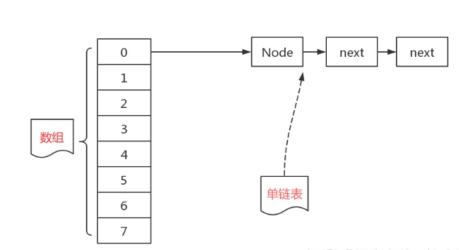
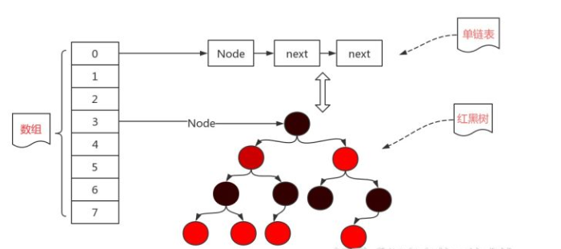
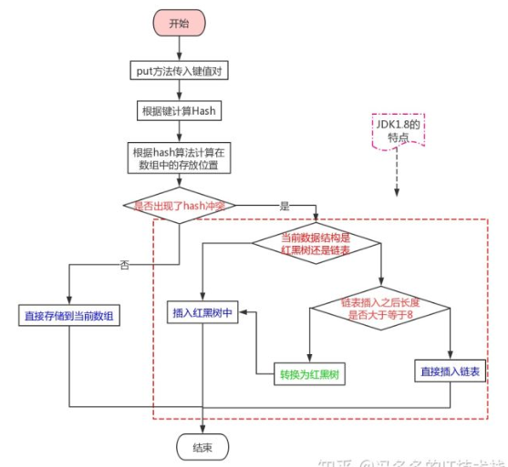
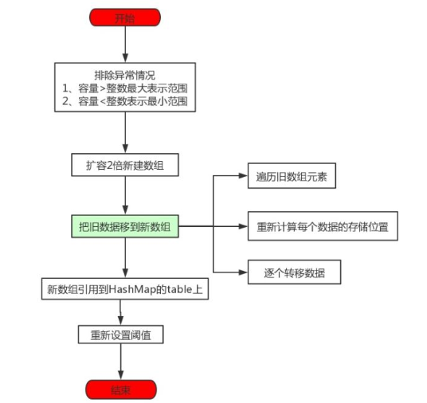

### 一、HashMap常见问题

```java
1.HashMap底层数据结构是什么？
	1）数组+链表+红黑树；
	2）红黑树：自平衡二叉查找树，查找效率很高；
	3）当链表长度大于8，数组容量大于64时才会转为红黑树
2.HashMap中添加操作底层实现原理是什么？
	1）put(k,v)调用putVal(int hash, K key, V value, boolean onlyIfAbsent,boolean evict)
    	//hash值计算方法：(h = key.hashCode()) ^ (h >>> 16)
    2) 首先通过i=((n-1) & hash) 计算元素存放table的角标的 //n=table.length;
    3)如果table[i]没有值就直接插入。
    4）如果table[i]有值，如果是红黑树，直接putTreeVal到红黑树；如果是链表，需要遍历key是否存在，不存在直接		添加在链表头部，存在就用新value覆盖旧value。
3.HashMap是如何实现扩容的？
	1）当 size>threshold 开始扩容；
	2）如果oldCap > MAXIMUM_CAPACITY,直接将阈值设置为整数最大值。如果没有超过，就扩容为原来的2倍。 			//MAXIMUM_CAPACITY = 1 << 30;  hashMap的最大容量。
	3）把旧数据复制到新数组里。  
		如果只有一个节点，通过新的n计算索引位置（n - 1） & hash直接映射；
		如果是红黑树，需要进行树的拆分然后映射；
		如果是链表，将链表拆分成两个链表,拆分方法if((hash&oldCap)==0)存放于第一条链表，else存放第二条链			表。第一条链表存放原索引处newTab[j],第二条链表存放原索引+oldCap索引处newTab[j+oldCap];	
4.HashMap如何解决hash冲突的？
	拉链法；
5.HashMap为什么是非线程安全的？
	因为源码中没有使用同步锁等线程安全措施；
	可以使用ConcurrentHashMap；
```

### 二、深入分析HashMap

#### 2.1底层数据结构

jdk1.7的hashMap底层是由数组加链表（拉链法）实现的。



由于存储的元素越来越多，链表越来越长，在查找一个元素时效率不仅没有提高，反倒是下降了不少，于是对于这条链表进行一个改进。  将链表变成一个适合查找的树形结构，就是红黑树。于是hashMap的存储数据结构就变成了下面的这种。



```java
//问题：
1.什么是红黑树？
	红黑树是一个自平衡二叉查找树，也就是说红黑树的查找效率是非常高的。查找效率由链表的o(n)降低为o(logn).
2.为什么不直接将整个链表变为红黑树？
	1）构造红黑树要比构造链表复杂，在链表的节点不多的时候，从整体性能上看，数组+链表+红黑树的结构可能不一定比数组+链表性能高。
	2）hashMap频繁的扩容，会造成底部红黑树不断的进行拆分和重组，这是非常耗时的。因此，也就是链表长度比较长的时候（8）转为红黑树才会显著提高效率。
```

#### 2.2HashMap属性说明

```java
//1.默认初始化容量，默认16，扩容时2倍扩容
static final int DEFAULT_INITIAL_CAPACITY = 1 << 4; // aka 16
//2.最大容量
static final int MAXIMUM_CAPACITY = 1 << 30;
//3.默认加载因子
 static final float DEFAULT_LOAD_FACTOR = 0.75f;
//4.转换为红黑树的节点阈值
static final int TREEIFY_THRESHOLD = 8;
//5.由树转换为链表的节点阈值
 static final int UNTREEIFY_THRESHOLD = 6;
//6.可被树化的最小表容量
static final int MIN_TREEIFY_CAPACITY = 64;

//size、threshold、loadFactory、capacity之间的关系
size是hashMap中存放kv对总数、 capacity是数组容量、 loadFactory是加载因子（扩容的依据）
threshold是扩容阈值，当size >= threshold时开始扩容
threshold = capacity * loadFactory;
因此当size/capcity >= 0.75时开始扩容，而不是hash桶使用量占capacity的0.75时扩容。
```

#### 2.3存储元素put

流程图



##### 2.3.1查看put源码如下

```java
public V put(K key, V value) {
        return putVal(hash(key), key, value, false, true);
    }
/*说明：
put方法其实是调用了putVal方法，putVal方法有5个参数；
1）hash：调用了hash方法计算hash值；
2）key:即是我们传入的key
3)value:即是我们传入的value
4）onlyIfAbsent：键相同时，不修改已存在的值
5）evict：如果为false，那么数组就处于创建中，所以一般为true
*/
```

##### 2.3.2查看putVal方法源码

```java
final V putVal(int hash, K key, V value, boolean onlyIfAbsent,
                   boolean evict) {
    //tab表示的是数组、p表示当前插入的节点、n表示数组的长度、i表示在数组中插入的位置
        Node<K,V>[] tab; Node<K,V> p; int n, i;
    //第一部分
        if ((tab = table) == null || (n = tab.length) == 0)
            n = (tab = resize()).length;
    //第二部分
        if ((p = tab[i = (n - 1) & hash]) == null)
            tab[i] = newNode(hash, key, value, null);
    //第三部分
        else {
            Node<K,V> e; K k;
            //第三部分a
            if (p.hash == hash &&
                ((k = p.key) == key || (key != null && key.equals(k))))
                e = p;
            //第三部分b
            else if (p instanceof TreeNode)
                e = ((TreeNode<K,V>)p).putTreeVal(this, tab, hash, key, value);
            //第三部分c
            else {
                for (int binCount = 0; ; ++binCount) {
                    if ((e = p.next) == null) {
                        p.next = newNode(hash, key, value, null);
                        if (binCount >= TREEIFY_THRESHOLD - 1) // -1 for 1st
                            treeifyBin(tab, hash);
                        break;
                    }
                    if (e.hash == hash &&
                        ((k = e.key) == key || (key != null && key.equals(k))))
                        break;
                    p = e;
                }
            }
            if (e != null) { // existing mapping for key
                V oldValue = e.value;
                if (!onlyIfAbsent || oldValue == null)
                    e.value = value;
                afterNodeAccess(e);
                return oldValue;
            }
        }
        ++modCount;
    //第四部分
        if (++size > threshold)
            resize();
        afterNodeInsertion(evict);
        return null;
    }

//解读
/*
1.第一部分：如果当前数组是空的，就通过resize()方法创建一个新的数组
2.第二部分：i表示在数组中插入的位置，计算方式是(n-1)&hash,判断插入的位置是否是冲突的，如果不冲突就直接    	newNode,插入数组中即可。  如果冲突就转为第三部分。
3.第三部分：处理hash冲突；
	第三部分a:判断table[i]中的元素是否与插入的key一样，若相同就直接使用p替换掉旧的值e
	第三部分b:判断插入的数据结构是红黑树还是链表，在这里表示如果是红黑树，就直接putTreeVal到红黑树中。
	第三部分c：如果数据结构是链表，首先要遍历链表是否存在，如果不存在直接newNode(hash, key, value, 				null)。如果存在了直接使用新的value替换掉旧的。
                注意一点：不存在并且在链表末尾插入元素的时候，会判断binCount >= TREEIFY_THRESHOLD - 1。				也就是判断当前链表的长度是否大于阈值8，如果大于那就会把当前链表转变成红黑树，方法是					treeifyBin。这也就和流程图中第三个判断框对应了。
     第四部分：插入成功之后，还要判断一下实际存在的键值对数量size是否大于阈值threshold。如果大于那就开始扩			   容了。
*/
```

##### 2.3.3扩容resize()

```java 
如果put太多元素后当前容量不够，就需要扩容。
流程图如下：
扩容过程： hashMap扩容就是先计算新的hash表容量和新的容量阈值，然后初始化一个新的hash表，将旧的键值对重新映射到新的hash表里。如果旧的hash表里涉及到红黑树，那么映射到新的hash表里还涉及到红黑树的拆分。整个流程也符合我们正常扩容一个容量的过程。
```



源代码：

```java
final Node<K,V>[] resize() {
        Node<K,V>[] oldTab = table;
        int oldCap = (oldTab == null) ? 0 : oldTab.length;
        int oldThr = threshold;
        int newCap, newThr = 0;
    //第一部分：扩容
        if (oldCap > 0) {
            if (oldCap >= MAXIMUM_CAPACITY) {
                threshold = Integer.MAX_VALUE;
                return oldTab;
            }
            else if ((newCap = oldCap << 1) < MAXIMUM_CAPACITY &&
                     oldCap >= DEFAULT_INITIAL_CAPACITY)
                newThr = oldThr << 1; // double threshold
        }
    //第二部分：设置阈值
        else if (oldThr > 0) // 阈值已经初始化了就直接使用
            newCap = oldThr;
        else {               // 没有初始化阈值那就初始化一个默认的容量和阈值
            newCap = DEFAULT_INITIAL_CAPACITY;
            newThr = (int)(DEFAULT_LOAD_FACTOR * DEFAULT_INITIAL_CAPACITY);
        }
        if (newThr == 0) {
            float ft = (float)newCap * loadFactor;
            newThr = (newCap < MAXIMUM_CAPACITY && ft < (float)MAXIMUM_CAPACITY ?
                      (int)ft : Integer.MAX_VALUE);
        }
    	//为当前容量阈值赋值
        threshold = newThr;
        @SuppressWarnings({"rawtypes","unchecked"})
            Node<K,V>[] newTab = (Node<K,V>[])new Node[newCap];
        table = newTab;
    //第三部分：旧数据保存在新数组里面
        if (oldTab != null) {
            for (int j = 0; j < oldCap; ++j) {
                Node<K,V> e;
                if ((e = oldTab[j]) != null) {
                    oldTab[j] = null;
                    //只有一个节点，通过索引位置直接映射，索引位置计算(n-1)&hash
                    if (e.next == null)
                        newTab[e.hash & (newCap - 1)] = e;
                    //如果是红黑树，需要进行树拆分然后映射
                    else if (e instanceof TreeNode)
                        ((TreeNode<K,V>)e).split(this, newTab, j, oldCap);
                    else { // 如果是多节点的链表，需要将链表拆分成两个链表
                        Node<K,V> loHead = null, loTail = null;
                        Node<K,V> hiHead = null, hiTail = null;
                        Node<K,V> next;
                        do {
                            next = e.next;
                            //拆分链表的方式(e.hash & oldCap) == 0
                            if ((e.hash & oldCap) == 0) {
                                if (loTail == null)
                                    loHead = e;
                                else
                                    loTail.next = e;
                                loTail = e;
                            }
                            else {
                                if (hiTail == null)
                                    hiHead = e;
                                else
                                    hiTail.next = e;
                                hiTail = e;
                            }
                        } while ((e = next) != null);
                        //链表1存于原索引
                        if (loTail != null) {
                            loTail.next = null;
                            newTab[j] = loHead;
                        }
                        //链表2存于原索引加上hash桶长度的偏移量
                        if (hiTail != null) {
                            hiTail.next = null;
                            newTab[j + oldCap] = hiHead;
                        }
                    }
                }
            }
        }
        return newTab;
    }

/*
第一部分：如果超过了数组的最大容量，那么直接将阈值设置为整数最大值。  没有超过最大容量但超过了初始容量，就扩			容为原来的2倍。
第二部分：第一个else if表示如果阈值已经初始化了，那就直接使用旧的阈值。第二个else表示如果没有初始化，那就初			始化一个新的数组容量和新的阈值。
第三部分：把旧数据复制到新数组里面
*/
```

##### 2.3.4解决地址冲突

HashMap中计算hash值的源代码

```java
static final int hash(Object key) {
        int h;
        return (key == null) ? 0 : (h = key.hashCode()) ^ (h >>> 16);
    }

//可以看到hash值就是 key的hashCode与16异或计算出来的。
为什么使用异或呢？
使用异或算出来的hash值比较均匀的，不容易出现冲突

//虽然不容易出现冲突，但是hash冲突时怎么解决呢？
hashmap中使用"拉链法"，就是将所有哈希地址为i的元素构成一个称为同义词链的单链表，并将单链表的头指针存在哈希表的第i个单元中，因而查找、插入和删除主要在同义词链中进行。链地址法适用于经常进行插入和删除的情况。
```

