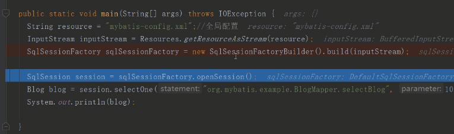

### 1.传统jdbc弊端

1. jdbc底层没有使用连接池、操作数据库需要频繁的创建和关闭连接。消耗很大的资源。
2. 写原生的jdbc代码在java中，一旦我们需要修改SQL的话，java需要整体编译，不利于系统维护。
3. 使用prepareStatement预编译的话对变量需要设置123数字，这样序号不利于维护。
4. 返回result结果集也需要硬编码。

### 2.mybatis执行流程

上面是使用mybatis使用步骤