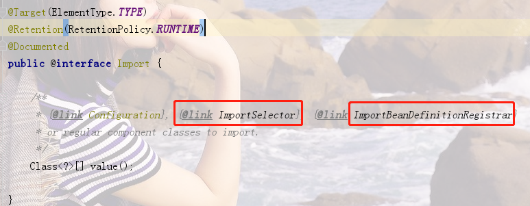
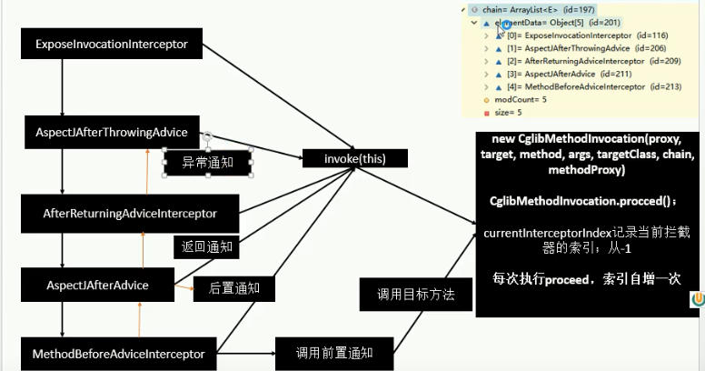

### 前言、jdk自定义注解的使用

**1.自定义注解类**

```java
@Target({ElementType.METHOD})
@Retention(RetentionPolicy.RUNTIME)
@Documented
public @interface SystemLog {
    String module() default "";
    String method() default "";
    String description() default "";
}

//说明：
1.@Target:标识注解用在什么地方
    TYPE,  //给类（型）注解
    FIELD, //给字段注解，不要忘了，字段可以是对象
    METHOD, //给方法注解
    PARAMETER, //给参数注解
    CONSTRUCTOR, //给构造方法注解
    LOCAL_VARIABLE, //给局部变量注解
    ANNOTATION_TYPE,//给注解注解（这貌似把自己不当类来看）
    PACKAGE, //给包注解
2.@Retention:标识注解运行状态
	SOURCE, //源码状态运行，
    CLASS, //编译类文件时运行
    RUNTIME //运行时运行
3.@Documented — — 生成说明文档，添加类的解释 
4.@Inherited — —允许子类继承父类中的注解。
```

**2.注解使用**

```java
public class Person {
    @SystemLog(module = "人类模块", method = "吃饭", description = "具体输出他吃了什么饭")
    public void eat(String food) {
        System.out.println("这个人今天吃了" + food);
    }
}
```

**3.测试类**

```java
//说明：注解信息需要通过反射获取，具体如下；

public class TestPerson {
    @Test
    public void test() throws ClassNotFoundException, NoSuchMethodException {
        //通过反射获取Person类的字节码
        Class<?> clazz = Class.forName("com.fy.study.Person");
        //获取指定的方法
        Method eat = clazz.getMethod("eat", String.class);
        //获取方法上指定的注解
        SystemLog annotation = eat.getAnnotation(SystemLog.class);
        //获取注解的属性值
        System.out.println("输出module：" + annotation.module() + " 输出method:" + annotation.method() + "  输出description:" + annotation.description());
    }
}
```


### 一、组件注册

#### 1.0给容器中注册主键的方式总结

```java
1.包扫描+组件标注注解(@Controller/@Service/@Repository/@Component)
2.@Bean[导入第三方包里面的组件]
3.@Import[快速给容器中导入一个组件]
	1）@Import(要导入到容器中的组件)：容器中自动注册这个组件，id默认全类名。
	2）ImportSelector:返回需要导入的组件的全类名数组。
	3）ImportBeanDefinitionRegistrar： 手工注册bean到容器中。
4.使用spring提供的FactoryBean(工厂bean)
```

**前置条件：创建maven工程，引入spring-context依赖**

#### 1.1@Configuration&@Bean给容器中注册组件

##### 1.1.1使用xml方式

1.配置文件bean.xml

```xml 
<bean class="com.fy.study.bean.Person" id="person">
        <property name="name" value="fangyan"></property>
        <property name="age" value="25"></property>
    </bean>
```

2.测试类

```java
public class ContextTest {
    public static void main(String[] args) {
        ClassPathXmlApplicationContext classPathXmlApplicationContext = new ClassPathXmlApplicationContext("beans.xml");
        Person person = (Person) classPathXmlApplicationContext.getBean("person");
        System.out.println(person);
    }
}
```

##### 1.1.2使用配置类

1.配置类

```java
//配置类==配置文件
@Configuration
public class BeanConfig {
    @Bean("person")  //给容器注册一个bean；类型为返回值类型，id默认是方法名作为id,也可以指定方法名
    public Person person01() {
        return new Person("zyy", 23);
    }
}
```

2.测试类

```java
public class ContextTest {
    public static void main(String[] args) {
        AnnotationConfigApplicationContext annotationConfigApplicationContext = new AnnotationConfigApplicationContext(BeanConfig.class);
        Person person = (Person) annotationConfigApplicationContext.getBean("person");
        System.out.println(person);
    }
}
```

#### 1.2@ComponentScan自动扫描组件&指定规则扫描

##### 1.2.1使用xml方式

```xml
<context:component-scan base-package="com.fy.study"></context:component-scan>
```

##### 1.2.2使用配置类

```java
@Configuration
@ComponentScan(value = "com.fy.study", excludeFilters = {
        @ComponentScan.Filter(type = FilterType.ANNOTATION, value = Controller.class)
})
public class BeanConfig {

    @Bean("person")  //给容器注册一个bean；类型为返回值类型，id默认是方法名作为id,也可以指定方法名
    public Person person01() {
        return new Person("zyy", 23);
    }
}

//说明：@ComponentScan
			value:指定自动扫描的包
			excludeFilters:数组，自定扫描过滤
	   @Filter
	   		type:指定过滤规则  FilterType.ANNOTATION表示按注解过滤 
	   		value: 过滤@Controller标识的类
```

#### 1.3@Scope&@Lazy作用域和懒加载

```java
@Configuration
public class MainConfig {
    
    @Scope("singleton")
    //prototype: 多实例，IOC容器启动并不会调用方法创建对象放在容器中。
//                        每次获取的时候才会调用方法创建对象
    //singleton：单实例(默认值)：IOC容器启动就会调用方法创建对象放到IOC容器中。
    //                             以后每次获取直接从IOC容器中拿
    //request：同一次请求创建一个实例
    //session：同一个session创建一个实例
    
    @Lazy
    //懒加载只针对于 scope=singleton而言，因为prototype本来就是懒加载
    
    @Bean("person")
    public Person person() {
        System.out.println("bean创建");
        return new Person();
    }
}
```

#### 1.4@Conditional按照条件注册bean

```java 
1.可以作用在类或方法上；
2.@Conditional(value={xxx.class})
    其中value是个数组，xxx是Condition的实现类，重写接口方法，定义条件规则。
```

```java
//实例：按照操作系统过滤bean的注册

//1.配置类
@Configuration
public class MainConfig {
    // 按照PersonCondition类的条件，满足条件就注册
    @Conditional(value = {PersonCondition.class})
    @Bean("bill")
    public Person person1() {
        return new Person("bill", 65);
    }

    // 按照LinuxCondition类的条件，满足条件就注册
    @Conditional(value = {LinuxCondition.class})
    @Bean("linus")
    public Person person2() {
        return new Person("linus", 45);
    }
}

//2.Condition实现类，定义注册条件
public class PersonCondition implements Condition {
    @Override
    public boolean matches(ConditionContext context, AnnotatedTypeMetadata metadata) {
        //判断当前运行在Windows环境的话就注册
        Environment environment = context.getEnvironment();
        String property = environment.getProperty("os.name");
        if (property.contains("Windows")){
            return true;
        }
        return false;
    }
}

public class LinuxCondition implements Condition {
    @Override
    public boolean matches(ConditionContext context, AnnotatedTypeMetadata metadata) {
        //判断当前运行在linux环境的话就注册
        Environment environment = context.getEnvironment();
        String property = environment.getProperty("os.name");
        if (property.contains("linux")) {
            return true;
        }
        return false;
    }
}

//3.测试类
@Test
public void test2() {
    String[] beanDefinitionNames = applicationContext.getBeanDefinitionNames();
    for (String name : beanDefinitionNames) {
        System.out.println(name);
    }
}

//结果;  容器中会注册 bill 这个名字的Person实体类，因为该程序时运行在Windows系统上的，满足条件。
```

#### 1.5@Import给容器中快速导入一个组件

**用法1.基本用法**

```java
@Configuration
@Import(value = {Color.class})   //将Color注册到容器中
public class MainConfig {}
```

**用法2.ImportSelector**

```java
//1.配置类
@Configuration
@Import(value = {Color.class, MyImportselector.class})
public class MainConfig {}

//2.ImportSeletor的实现类MyImportSelector,定义注入到容器中的组件
//自定义逻辑返回需要导入的组件的全类名
public class MyImportselector implements ImportSelector {
    //返回值，就是导入到容器中的组件全类名
    //AnnotationMetadata：当前标注@Import注解的类的所有注解信息
    @Override
    public String[] selectImports(AnnotationMetadata importingClassMetadata) {
        return new String[]{"com.fy.study.Yellow"};
    }
}
```

**用法3.ImportBeanDefinitionRegistrar**

```java
//1.配置类
@Configuration
@Import(value = {Color.class, MyImportselector.class, MyImportBeanDefinition.class})
public class MainConfig {}

//2.ImportBeanDefinitionRegistrar实现类
public class MyImportBeanDefinition implements ImportBeanDefinitionRegistrar {
    //AnnotationMetadata:当前类的注解信息
    //BeanDefinitionRegistry：BeanDefinition注册类；
    //              把所有需要添加到容器中的bean，调用
    //              BeanDefinitionRegistry.registerBeanDefinition手工注册进来
    //
    @Override
    public void registerBeanDefinitions(AnnotationMetadata importingClassMetadata, BeanDefinitionRegistry registry) {
        //指定bean名   与importSelector不同的是，手工注册bean可以指定bean名
        //将RainBow以rainBow的bean名注册到容器中
        RootBeanDefinition beanDefinition = new RootBeanDefinition(RainBow.class);
        registry.registerBeanDefinition("rainBow", beanDefinition);
    }
}
```



#### 1.6使用FactoryBean注册组件

```java 
//1.FactoryBean 的实现类
public class MyFacoryBean implements FactoryBean {
    //要注册进容器的bean
    @Override
    public Object getObject() throws Exception {
        return new Color();
    }
    //返回bean类型
    @Override
    public Class<?> getObjectType() {
        return Color.class;
    }
    //是否是单例：true表示是
    @Override
    public boolean isSingleton() {
        return true;
    }
}

//2.配置类，将MyFacoryBean注册进容器，实际注册时MyFacoryBean中的getObject返回的bean
@Bean
public MyFacoryBean myFacoryBean() {
    return new MyFacoryBean();
}

//3.测试类
@Test
public void testFactoryBean() {
    //在myFacoryBean中返回的是Color,虽然容器中拿到的名称是myFacoryBean，但是实际bean的类型时Color
    Object myFactoryBean = applicationContext.getBean("myFacoryBean");
    System.out.println("bean的类型：" + myFactoryBean.getClass());
    //bean的类型：class com.fy.study.Color
}
```

### 二、生命周期

#### 2.0bean声明周期管理总结

```java
/**
 * bean创建---初始化---销毁过程
 * 容器管理bean的声明周期：
 *  我们可以自定义初始化和销毁方法；
 *  构造（对象创建）
 *      单实例：在容器启动时创建对象
 *      多实例：在每次获取的时候创建对象
 *  初始化：
 *      对象创建完成，并赋值好，调用初始化方法
 *  销毁：
 *      单实例：容器关闭的时候进行销毁
 *      多实例：容器不会管理这个bean的销毁
 **/
   1）指定初始化和销毁方法
      指定inti-method和destroy-method
   2）通过让bean实现InitializingBean(定义初始化逻辑)和DisposableBean(定义销毁逻辑)
   3）可以使用JSR250:
		@PostConstruct:在bean创建完成并属性赋值完成，来执行初始化方法
		@PreDestroy:在容器销毁bean之前通知我们进行清理工作
   4）bean的后置处理器BeanPostProcessor：//对spring管理的bean初始化前后进行统一逻辑处理
   		postProcessBeforeInitialization ：spring bean初始化之前执行的方法
   		postProcessAfterInitialization  : spring bean初始化之后执行的方法
 		//说明：spring底层对	BeanPostProcessor的使用：
 		//		bean赋值，注入其他组件，@Autowired,生命周期注解功能，@Async,  xxxBeanPostProcessor;
```


#### 2.1@Bean指定初始化和销毁方法

**Person**

```java 
public class Person {
    public Person() {
        System.out.println("bean创建  调用构造方法");
    }
    public void init() {
        System.out.println("init()初始化..........");
    }

    public void destroy() {
        System.out.println("destroy()销毁......");
    }
}
```

**配置类**

```java
@Configuration
public class BeanConfig {

    @Bean(initMethod = "init", destroyMethod = "destroy")
    public Person person () {
        return new Person();
    }
}
```

**测试类**

```java
/**
 * bean创建---初始化---销毁过程
 * 容器管理bean的声明周期：
 *  我们可以自定义初始化和销毁方法；
 *  构造（对象创建）
 *      单实例：在容器启动时创建对象
 *      多实例：在每次获取的时候创建对象
 *  初始化：
 *      对象创建完成，并赋值好，调用初始化方法
 *  销毁：
 *      单实例：容器关闭的时候进行销毁
 *      多实例：容器不会管理这个bean的销毁
 *
 *   1）指定初始化和销毁方法
 *      指定inti-method和destroy-method
 */
public class SpringSourceTest {

    @Test
    public void testBeanCycle() {
        AnnotationConfigApplicationContext context = new AnnotationConfigApplicationContext(BeanConfig.class);
        System.out.println("容器创建完成");
        context.close();
        System.out.println("容器关闭");
    }
}
```

#### 2.2生命周期InitializingBean和DisposableBean

**实体类Cat**

```java
//初始化：实现InitializingBean接口重写afterPropertiesSet方法完成初始化逻辑
//销毁：实现DisposableBean接口重写destroy方法完成销毁逻辑
@Component  //注解注册方式
public class Cat implements InitializingBean, DisposableBean {
    public Cat() {
        System.out.println("cat 构造器调用");
    }

    @Override
    public void afterPropertiesSet() throws Exception {
        System.out.println("cat 初始化方法被调用");
    }

    @Override
    public void destroy() throws Exception {
        System.out.println("cat 销毁方法被调用");
    }
}
```

**配置类**

```java
@ComponentScan("com.fy.study")  //自动扫描包
@Configuration
public class BeanConfig {
}
```

**测试类**

```java
 @Test
    public void testBeanCycle() {
        AnnotationConfigApplicationContext context = new AnnotationConfigApplicationContext(BeanConfig.class);
        context.close();
    }

/**
cat 构造器调用
cat 初始化方法被调用.
cat 销毁方法被调用
**/
```

#### 2.3@PostConstruct&@PreDestroy

**实体类Dog**

```java 
@Component
public class Dog {
    public Dog() {
        System.out.println("dog  构造器方法执行");
    }

    @PostConstruct  //注解标识其为初始化执行的方法
    public void init() {
        System.out.println("dog 初始化方法执行");
    }

    @PreDestroy  //注解标识其为销毁执行的方法
    public void destroy() {
        System.out.println("dog 销毁方法执行");
    }
}
```

#### 2.4**@BeanPostProcessor-后置处理器

```java
//编写类实现BeanPostProcessor接口重写postProcessBeforeInitialization和postProcessAfterInitialization方法，分别在IOC容器中的bean初始化之前执行和初始化之后执行
@Component
public class MyBeanPostPrecessor  implements BeanPostProcessor {
    /**
    * @param bean the new bean instance
	* @param beanName the name of the bean
	* @return the bean instance to use, either the original or a wrapped one;
    **/
    @Override
    public Object postProcessBeforeInitialization(Object bean, String beanName) throws BeansException {
        System.out.println("postProcessBeforeInitialization..."+beanName+"=>"+bean);
        return bean;
    }

    @Override
    public Object postProcessAfterInitialization(Object bean, String beanName) throws BeansException {
        System.out.println("postProcessAfterInitialization..."+beanName+"=>"+bean);
        return bean;
    }
}


/*postProcessBeforeInitialization...cat=>com.fy.study.entity.Cat@275710fc
cat 初始化方法被调用
postProcessAfterInitialization...cat=>com.fy.study.entity.Cat@275710fc
*/
```

### 三、属性赋值

#### 3.1@Value属性赋值

```java
使用@Value赋值：
1.基本数值   @Value("fangyan")
2.可以写SpEL:  #{20-8}
3.可以写${}取出配置文件中的值(在运行环境变量的值)
```

#### 3.2@PropertySource加载外部配置文件

```java
//使用@PropertySource读取外部配置文件中的K/V保存到运行的环境变量中；加载完外部的配置文件以后使用${}

//1.实体类  People
public class People {
    @Value("fangyan")
    String name;
    @Value("#{20+6}")
    int age;
    @Value("${people.sex}")  //读取properties文件中的K/V值
    String sex;
    ...setter&getter
}

//2.配置类
@PropertySource(value = {"classpath:person.properties"}, encoding = "GBK")
@Configuration
public class PropertyConfig {
    @Bean
    public People people() {
        return new People();
    }
}

//3.properties文件  person.properties
people.sex=男

//4.测试类
@Test
    public void testBeanCycle() {
        AnnotationConfigApplicationContext context = new AnnotationConfigApplicationContext(PropertyConfig.class);
        People people = (People) context.getBean("people");
        System.out.println(people);
    }
```

### 四、自动装配

#### 4.1自动装配-@Autowired&@Qualifier&@Primary

```java 
1.默认优先按照类型去容器中找对应组件：applicationContext.getBean(BookDao.class);
2.如果找到多个相同类型的组件，再将属性名称作为组件的id去容器中查找
	applicationContext.getBean("bookDao")
3.@Qualifier("bookDao"):使用@Qualifier指定需要装配的组件的id，而不是用属性名；
4.自动装配默认一定要将属性赋值好，没有就报错。
	可以使用@Autowired(required=false);
5.@Primary:让spring进行自动装配的时候，默认使用首选bean；
	 也可以继续使用@Qualifier指定需要装配的bean的名字。
```

#### 4.2@Resource&@Inject

```java 
spring还支持使用@Resource(JSR250)和@Inject(JSR330)[JAVA规范的注解]
1.@Resource：
	可以和@Autowired一样实现自动装配功能；默认按照组件名称进行装配的；
	没有能支持@Primary功能，没有支持@Autowired(required=false)
2.@Inject:
	需要导入javax.inject的包，和Autowired的功能一样。没有required=false的功能。
	
//区别：@Autowired是spring定义的； @Resource/@Inject都是java规范。
```

#### 4.3自动装配-方法、构造器位置的自动装配

```java
@Autowired:构造器、参数、方法、属性；
1.标注在方法位置；
    @Autowired
    public Car setCar(Car car) {
        this.car = car;
    }
2.标注在构造器上；
	如果组件中只有一个有参构造器，这个有参构造器的@Autowired可以省略，参数位置的组件还是可以自动从容器中获取
	//构造器要用的组件都是从容器中获取
    @Autowired
    public Boss(Car car) {
        this.car = car;
    }
3.标注在方法参数上；
	public Boss(@Autowired Car car) {
        this.car = car;
    }
    
4.@Bean标注的方法创建对象的时候，方法参数的值从容器中获取
	@Bean
    public Color color(Car car) {
    	return new Color(car); 
    }
```

#### 4.4**自动装配-Aware注入Spring底层组件&原理

```java
自定义组件想要使用Spring容器底层的一些组件(ApplicationContext/BeanFactory/xxx)
自定义组件实现xxxAware，在创建对象的时候，会调用接口规定的方法注入相关组件
把spring底层一些组件注入到自定义的bean中；
```

**示例：将ApplicationContext注入到自定义Red类中**

```java
//1.自定义Red类，实现ApplicationContextAware接口，重写setApplicationContext方法
@Component
public class Red implements ApplicationContextAware, BeanNameAware, EmbeddedValueResolverAware {
    private ApplicationContext applicationContext;
    @Override //获取IOC容器
    public void setApplicationContext(ApplicationContext applicationContext) throws BeansException {
        this.applicationContext = applicationContext;
        System.out.println("从red中获取的ioc容器：" + applicationContext);
    }

    @Override
    public void setBeanName(String name) {
        System.out.println("当前bean的名字" + name);
    }

    @Override  //字符串值解析器
    public void setEmbeddedValueResolver(StringValueResolver resolver) {
        String s = resolver.resolveStringValue("你好${os.name} 我是#{20*18}");
        System.out.println("解析的字符串：" + s);
    }
}


//2.配置类，规定自动扫描Red类
@Configuration
@ComponentScan("study.entity.autowired")  //Red类所在包
public class AutowiredConfig {
}


//3.测试类
 @Test
public void test() {
    AnnotationConfigApplicationContext context = new AnnotationConfigApplicationContext(AutowiredConfig.class);
    Red red = context.getBean(Red.class);
    System.out.println("当前IOC容器：" + context);
}


//结果
当前bean的名字red
解析的字符串：你好Windows 7 我是360
从red中获取的ioc容器：org.springframework.context.annotation.AnnotationConfigApplicationContext@5f8ed237
当前IOC容器：org.springframework.context.annotation.AnnotationConfigApplicationContext@5f8ed237

//可以看到装配进Red中的applicationContext和当前IOC容器时同一个容器。
```

#### 4.5@Profile根据环境注册bean

```java
//1.配置类，以注册多个DataSource为例

/**
 * @Profile: 指定组件在哪个环境情况下才能被注册到容器，不指定，任何环境下都能注册这个组件
 * 1）加了环境标识的bean，只有这个环境被激活的时候才能注册到容器。默认是default环境
 * 2）写在配置类上，只有指定的环境的时候，整个配置类里面的所有配置才能生效
 * 3）没有标识环境的bean在任何环境下都能加载
 */
@Profile("test")
@PropertySource("classpath:/dbConnect.properties")
@Configuration
public class ProfileConfig implements EmbeddedValueResolverAware {
    /*此处用到属性装配的三种方法
    *  1.@Value 标注在属性上
    *  2.@Value标注在方法参数上
    *  3.实现EmbeddedValueResolverAware接口获取字符串解析器，解析properties中的K，手动注册
    * */
    @Value("${datasource.user}")
    private String user;

    private String driveClass;

    @Profile("dev")
    @Bean
    public DataSource devDataSource(@Value("${datasource.password}") String pwd) throws PropertyVetoException {
        ComboPooledDataSource dataSource = new ComboPooledDataSource();
        dataSource.setUser(user);
        dataSource.setPassword(pwd);
        dataSource.setDriverClass(driveClass);
        dataSource.setJdbcUrl("jdbc:mysql://localhost:3306/mysql");
        return dataSource;
    }

    @Profile("test")
    @Bean
    public DataSource testDataSource(@Value("${datasource.password}") String pwd) throws PropertyVetoException {
        ComboPooledDataSource dataSource = new ComboPooledDataSource();
        dataSource.setUser(user);
        dataSource.setPassword(pwd);
        dataSource.setDriverClass(driveClass);
        dataSource.setJdbcUrl("jdbc:mysql://localhost:3306/mysql");
        return dataSource;
    }

    @Profile("prod")
    @Bean
    public DataSource prodDataSource(@Value("${datasource.password}") String pwd) throws PropertyVetoException {
        ComboPooledDataSource dataSource = new ComboPooledDataSource();
        dataSource.setUser(user);
        dataSource.setPassword(pwd);
        dataSource.setDriverClass(driveClass);
        dataSource.setJdbcUrl("jdbc:mysql://localhost:3306/mysql");
        return dataSource;
    }

    @Override
    public void setEmbeddedValueResolver(StringValueResolver resolver) {
        String s = resolver.resolveStringValue("${datasource.driveClass}");
        this.driveClass = s;
    }
}

//2.测试类，从容器中获取三个DataSource实例

//1）使用命令行动态参数：在虚拟机参数位置加载-Dspring.profiles.active=test
//2）代码方式激活某种环境，如下：
@Test
public void test() {
    //1.创建一个applicationContext
    AnnotationConfigApplicationContext context = new AnnotationConfigApplicationContext();
    //2.设置需要激活的环境
    context.getEnvironment().setActiveProfiles("dev");
    //3.注册朱配置类
    context.register(ProfileConfig.class);
    //4.启动刷新容器
    context.refresh();
    String[] names = context.getBeanNamesForType(DataSource.class);
    for (String name : names) {
        System.out.println(name);
    }
}
```

### 五、spring AOP

#### 5.1AOP基本使用

```java
AOP:基于动态代理实现
	旨在程序运行期间动态的将某段代码切入到指定方法指定位置进行运行的编程方式；
步骤：
1.导入AOP模块：Spring Aop:(spring-aspects)
2.定义一个业务逻辑类即目标类(MathCaculate):在业务逻辑运行的时候将日志打印(方法之前、方法运行结束、方法出现异常，环绕)
3.定义一个日志切面类(MyAspect):切面类里面的方法需要动态感知MathCaculate来面的方法运行到哪里，然后执行
	通知方法：
		前置通知：在目标方法运行之前执行
		后置通知：在目标方法运行之后执行，无论方法正常结束还是异常结束都会执行
		返回通知：在目标方法正常返回之后执行
		异常通知：目标方法运行出现异常时执行
		环绕通知：动态代理，手动推进目标方法运行(joinPoint.proceed())
4.给切面类的目标方法标注何时何地运行（通知注解）
5.将切面类和目标类都加入到容器中；
6.必须告诉spring哪个类是切面类(给切面类加注解@Aspect)
[7].给配置类中加@EnableAspectJAutoProxy【开启基于注解的AOP模式】

核心三步：
	1）将业务逻辑组件（目标类）和切面类加入到容器；告诉spring哪个是切面类(@Aspect)
    2)在切面类上的每一个通知方法上标注通知注解，告诉spring何时何地运行(切入点表达式)
    3）开启基于注解AOP模式：@EnableAspectJAutoProxy
```

**示例**

```java
//1.目标类
public class MathCaculate {
    public int div(int a, int b) {
        return a/b;
    }
}

//2.切面类
@Aspect  //标识其为切面类
public class MyAspect {
	
    @Pointcut("execution(* com.fy.study.MathCaculate.*(..))")
    public void pointCut(){}

    @Before("pointCut()")
    public void before(JoinPoint joinPoint) {
        // 拿到切入点的方法名
        String methodName = joinPoint.getSignature().getName();
        // 拿到切入点的入参
        Object[] args = joinPoint.getArgs();
        System.out.println(methodName + " 前置方法执行。。。" + "参数{" + Arrays.toString(args) + "}");
    }

    @After("pointCut()")
    public void after(JoinPoint joinPoint) {
        String methodName = joinPoint.getSignature().getName();
        System.out.println(methodName + " 后置方法执行。。。");
    }

    @AfterReturning(value = "pointCut()", returning = "result")
    public void afterReturning(JoinPoint joinPoint, Object result) {
        System.out.println(joinPoint.getSignature().getName() + "方法正常返回。。。运行结果是：{" + result + "}");
    }

    @AfterThrowing(value = "pointCut()", throwing = "e")
    public void afterThrowing(JoinPoint joinPoint, Exception e) {
        System.out.println(joinPoint.getSignature().getName() + "后置异常方法执行。。。异常信息是{" + e.getMessage() + "}");
    }
}

//3.配置类
@EnableAspectJAutoProxy  //开启基于注解的AOP模式
@Configuration
public class BeanConfig {

    @Bean
    public MathCaculate mathCaculate() {
        return new MathCaculate();
    }

    @Bean
    public MyAspect myAspect() {
        return new MyAspect();
    }
}

//测试
 @Test
public void test() {
    AnnotationConfigApplicationContext context = new AnnotationConfigApplicationContext(BeanConfig.class);
    MathCaculate mathCaculate = context.getBean(MathCaculate.class);
    mathCaculate.div(1, 1);
}
/**
div 前置方法执行。。。参数{[1, 1]}
div 后置方法执行。。。
div方法正常返回。。。运行结果是：{1}
**/
```

```java
说明：
可以通过下面这个对注解作为切点
@Pointcut("@annotation(com.ryh.qtalk.annotation.SystemLog)")
    
注解的具体用法详见：本文档【前言】部分
```

#### 5.2AOP原理

**看注解的原理一般方法：看给容器注册了什么组件， 这个组件什么时候工作？这个组件的功能是什么？**

##### 5.2.1@EnableAspectJAutoProxy

```java 
1.@EnableAspectJAutoProxy是什么？
	1）@Import(AspectJAutoProxyRegistrar.class):给容器中导入AspectJAutoProxyRegistrar组件
		AspectJAutoProxyRegistrar实现了ImportBeanDefinitionRegistrar接口，自定义给容器注册bean;
		internalAutoProxyCreator=AnnotationAwareAspectJAutoProxyCreator
		给容器中注册一个AnnotationAwareAspectJAutoProxyCreator;
	2）AnnotationAwareAspectJAutoProxyCreator:  
		继承关系如下：
			->AspectJAwareAdvisorAutoProxyCreator
			->AbstractAdvisorAutoProxyCreator
			->AbstractAutoProxyCreator
			implements SmartInstantiationAwareBeanPostProcessor, BeanFactoryAware
		关注后置处理器(在bean初始化完成前后做的事)、自动装配BeanFactory
		
		//从AbstractAutoProxyCreator类开始逐层往子类分析
		AbstractAutoProxyCreator有后置处理器的逻辑
		AbstractAutoProxyCreator.setBeanFactory()
        
         AbstractAdvisorAutoProxyCreator.setBeanFactory() {initBeanFactory()}

		AnnotationAwareAspectJAutoProxyCreator.initBeanFactory()
        
    流程：
    	1）传入配置类，创建IOC容器
    	2）注册配置类，调用refresh()刷新容器
    	3）registerBeanPostProcessors(beanFactory);注册bean的后置处理器来方便拦截bean的创建
    		1）先获取IOC容器已经定义了的需要创建对象的所有BeanPostProcessor
    		2)给容器中加别的BeanPostProcessor
    		3)优先注册实现了PriorityOrdered接口的BeanPostProcessor
    		4）再给容器中注册实现了Ordered的接口的BeanPostProcessor
    		5）注册没实现优先级接口的BeanPostProcessor
    		6）注册BeanPostProcessor,实际上就是创建BeanPostProcessor对象，保存在容器中：
    			创建internalAutoProxyCreator的BeanPostProcessor【AnnotationAwareAspectJAutoProxyCreator】
    				1）创建bean实例
    				2）populateBean：给bean的各种属性赋值
    				3）initializeBean：初始化bean
    					1）invokeAwareMethods():处理Aware接口的方法回调
    					2）applyBeanPostProcessorsBeforeInitialization():应用后置处理器的PostProcessorsBeforeInitialization()
            			3）invokeInitMethods():执行自定义初始化方法
            			4）applyBeanPostProcessorsAfterInitialization():执行后置处理器的PostProcessorsAfterInitialization() 
            		4）BeanPostProcessor(AnnotationAwareAspectJAutoProxyCreator)创建成功：=》aspectJAdvisorsBuilder
            7）把BeanPostProcessor注册到BeanFactory中：
            	beanFactory.addBeanPostProcessor(postProcessor);
//==========================以上是创建和注册AnnotationAwareAspectJAutoProxyCreator的过程===========
			AnnotationAwareAspectJAutoProxyCreator => InstantiationAwareBeanPostProcessor后置处理器
		4）finishBeanFactoryInitialization(beanFactory);完成BeanFactory初始化工作；创建剩下的单实例bean；
			1）遍历容器中所有的bean，依次创建对象getBean(beanName);
				getBean()->doGetBean()->getSingleton()->
             2)创建bean
             	【AnnotationAwareAspectJAutoProxyCreator在所有bean创建之前会有一个拦截，InstantiationAwareBeanPostProcessor，会调用postProcessBeforeInstantiation()】
             	1）先从缓存中获取当前bean，如果能获取到，说明bean是之前被创建的，直接使用，否则再创建；
             		只要创建好的bean都会被缓存起来；
             	2）createBean();创建bean	
             		【BeanPostProcessor是在bean对象创建完成初始化前后调用的】
             		【InstantiationAwareBeanPostProcessor是在创建bean实例之前先尝试用后置处理器返回对象的】
             		1）resolveBeforeInstantiation(beanName, mbdToUse);解析BeforeInstantiation
             			希望后置处理器在此能返回一个代理对象；如果能返回代理对象就使用，如果不能就继续
             			1）后置处理器先尝试返回对象
             				bean = applyBeanPostProcessorsBeforeInstantiation(targetType, beanName);
							拿到所有后置处理器，如果是InstantiationAwareBeanPostProcessor,就执行postProcessBeforeInstantiation
						   if (bean != null) {
							bean = applyBeanPostProcessorsAfterInitialization(bean, beanName);
					}
```

**创建AOP代理**

```java
AnnotationAwareAspectJAutoProxyCreator【InstantiationAwareBeanPostProcessor】的作用：
1）每一个bean创建之前，调用postProcessBeforeInstantiation()
    关心MathCaculate和MyAspect的创建
    1）判断当前bean是否在advisedBeans中(保存了所有需要增强的bean)
    2）判断当前bean是否是基础类型的Advice、Pointcut、Advisor、AopInfrastructureBean
    	或者是切面(@Aspect)
    3)是否需要跳过
    	1）获取候选的增强器(切面里的通知方法)【List<Advisor> candidateAdvisors】
    		每一个封装的通知方法的增强器是InstantiationModelAwarePointcutAdvisor
    		判断每一个增强器是否是AspectJPointcutAdvisor类型的，返回true
    	2）永远返回false 
2）创建对象 
	对象创建后调用后置处理器方法： postProcessAfterInitialization()
    	return wrapIfNecessary(bean, beanName, cacheKey); //包装如果需要的话
		1）获取当前bean的所有增强器(通知方法)  Object[] specificInterceptors
            1.找到候选的所有增强器(找哪些通知方法需要切入当前bean方法的)
            2.获取能在当前bean使用的增强器
            3.给增强器排序
         2）保存当前bean在advisedBeans中：
         3）如果当前bean需要增强，创建bean的代理对象；
         	1）获取所有增强器(通知方法)
            2）保存到proxyFactory中
            3）创建代理对象：spring自动决定
            	JdkDynamicAopProxy(config)  //jdk动态代理  如果目标类实现了接口使用此方式
            	ObjenesisCglibAopProxy(config)  //cglib动态代理 
         4）给容器中返回当前组件使用cglib增强了的代理对象
         5）以后容器中获取到的就是这个组件的代理对象，执行目标方法的时候，代理对象就会执行通知方法的流程
3）目标方法执行；
	容器中保存了组件的代理对象(cglib增强后的对象)，这个对象里面保存了详细信息(比如增强器，目标对象，xxx)
    1)CglibAopProxy.intercept(); //拦截目标方法的执行 
    2）根据ProxyFactory获取将要执行目标方法的拦截器链：
		List<Object> chain = this.advised.getInterceptorsAndDynamicInterceptionAdvice(method, targetClass);
		1)List<Object> interceptorList保存所有拦截器5
			一个默认的ExposeInvocationInterceptor和4个增强器；
		2）遍历所有的增强器，将其转化为Interceptor
			registry.getInterceptors(advisor);	
		3)将增强器转为List<MethodInterceptor> interceptors；
			如果是MethodInterceptor，直接加入到集合中
			如果不是，使用AdvisorAdapter将增强器转为MethodInterceptor
			转换完成，返回MethodInterceptor数组
	3）如果没有拦截器链，直接执行目标方法；
		拦截器链(每一个通知方法又被包装为方法拦截器，利用MethodInterceptor机制)
	4）如果有拦截器链，把需要执行的目标对象，目标方法，拦截器链等信息传入创建一个CglibMethodInvocation对象，并调用proceed()方法  Object retVal = mi.proceed()
    5）拦截器链的触发过程：
    	1）如果没有拦截器执行目标方法，或者拦截器的索引和拦截器数组-1大小一样(指定到了最后一个拦截器)执行目		标方法；
    	2）链式获取每一个拦截器，拦截器执行invoke方法，每一个拦截器等待下一个拦截器执行返回以后再来执行；
    		拦截器链的机制，保证通知方法与目标方法的执行顺序。 
```

拦截器链调用示意图：



##### 5.2.2AOP原理总结

```java
1.@EnableAspectJAutoProxy 开启AOP功能；
2.@EnableAspectJAutoProxy会给容器中注册一个组件AnnotationAwareAspectJAutoProxyCreator
3.AnnotationAwareAspectJAutoProxyCreator是一个后置处理器
4.后置处理器的创建流程：
	1）registerBeanPostProcessors();注册后置处理器；创建AnnotationAwareAspectJAutoProxyCreator
	2） finishBeanFactoryInitialization(); 初始化剩下的单实例bean
		1）创建业务逻辑组件和切面组件；
		2）AnnotationAwareAspectJAutoProxyCreator拦截组件的创建过程；在组件创建完成后，判断是否需要对组			件进行增强？
			是：切面的通知方法包装成增强器(Advisor);给业务逻辑组件创建一个代理对象(cglib),代理对象里面包				含了所有的增强器；
5.执行目标方法：
	1）代理对象执行目标方法；
	2）CglibAopProxy.intercept();
		1）得到目标方法的拦截器链(增强包装成拦截器MethodInterceptor)
         2）利用拦截器的链式机制，依次进入每一个拦截器进行执行；
         3）效果：
         	正常执行：前置通知->目标方法->后置通知->返回通知
         	异常执行：前置通知->目标方法->后置通知->异常通知

		
//说明： spring容器创建的时候首先注册后置处理器，其次在创建其他的单实例bean，但是创建其他单实例bean的时候会被后置处理器拦截，判断是否需要对单实例bean进行处理。  这也是后置处理器的作用：统一处理spring bean的创建。
```

### 六、声明式事务

#### 6.1声明式事务环境搭建

```java 
步骤：
	/**
 * 声明式事务：
 *  环境搭建：
 *  1.导入相关依赖
 *      数据源、数据驱动、spring-jdbc模块
 *  2.配置数据源、JdbcTemplate操作数据库
 *  3.给方法上标注@Transactional 表示当前方法是一个事务方法
 *  4.@EnableTransactionManagement开启基于注解的事务管理功能
 *  5.配置事务管理器
 *      @Bean
 *     public PlatformTransactionManager platformTransactionManager()
 */
 
 //1.配置类
@EnableTransactionManagement
@ComponentScan("com.fy.study")
@Configuration
public class TxConfig {

    //数据源
    @Bean
    public DataSource dataSource() throws PropertyVetoException {
        ComboPooledDataSource dataSource = new ComboPooledDataSource();
        dataSource.setUser("root");
        dataSource.setPassword("123");
        dataSource.setDriverClass("com.mysql.jdbc.Driver");
        dataSource.setJdbcUrl("jdbc:mysql://localhost:3306/test");
        return dataSource;
    }

    @Bean
    public JdbcTemplate jdbcTemplate() throws PropertyVetoException {
        //说明：在config配置类中调用方法，仍然会从容器中找单实例bean，而不是重新重建，这是spring对配置类的特殊处理
        return new JdbcTemplate(dataSource());
    }

    //注册事务管理器在容器中
    @Bean
    public PlatformTransactionManager platformTransactionManager() throws PropertyVetoException {
        return new DataSourceTransactionManager(dataSource());
    }
}

//2.service层操作数据库方法
@Service
public class UserService {

    @Autowired
    private UserDao userDao;

    @Transactional
    public void insertUser() {
        userDao.insert();
        System.out.println("插入完成...");
        System.out.println(10/0);
    }
}

//3.测试类
public class TestTx {
    @Test
    public void test() {
        AnnotationConfigApplicationContext context = new AnnotationConfigApplicationContext(TxConfig.class);
        UserService userService = context.getBean(UserService.class);
        userService.insertUser();
    }
}
```

#### 6.2原理

```java
1.@EnableTransactionManagement
    利用TransactionManagementConfigurationSelector给容器导入两个组件
    AutoProxyRegistrar
    ProxyTransactionManagementConfiguration
2.AutoProxyRegistrar实现了ImportBeanDefinitionRegistrar给容器自定义导入组件
	给容器中注册一个InfrastructureAdvisorAutoProxyCreator组件；
	InfrastructureAdvisorAutoProxyCreator:?
    利用后置处理器机制在对象创建以后，包装对象，返回一个代理对象(增强器)，代理对象执行方法利用拦截器链进行调用；
3.ProxyTransactionManagementConfiguration做了什么？
	1.给容器中注册事务增强器；
		1）事务增强器要用事务注解信息，AnnotationTransactionAttributeSource解析事务注解
		2）事务拦截器：
			TransactionInterceptor：保存了事务属性，事务管理器；
			它是一个MethodInterceptor；
			在目标方法执行的时候；
				执行拦截器链；
				事务拦截器；
					1）先获取事务相关属性；
					2）在获取PlatformTransactionManager，如果实现没有添加指定任何transactionManager,最终会从容器中按照类型获取一个PlatformTransactionManager
					3）执行目标方法
						如果异常，获取到事务管理器，利用事务管理器回滚操作；
						如果正常，利用事务管理器提交事务；
```

### 七、扩展原理

#### 7.1BeanFactoryPostProcessor

**示例：**

```java
//1.配置类
@Configuration
@ComponentScan("com.fy")
public class BeanFactoryPostPrecessorConfig {
    @Bean
    public Blue blue() {
        return new Blue();
    }
}

//2.自定义BeanFactoryPostProcessor
@Component
public class MyBeanFacotryPostPrecessor implements BeanFactoryPostProcessor {
    @Override
    public void postProcessBeanFactory(ConfigurableListableBeanFactory beanFactory) throws BeansException {
        //获取beanFactory中所有的bean的个数
        int beanCount = beanFactory.getBeanDefinitionCount();
        //获取所有beanFactory中所有bean的名字
        String[] names = beanFactory.getBeanDefinitionNames();
        System.out.println("容器中共有bean" + beanCount +"个");
        System.out.println("容器中bean的名字" + Arrays.asList(names));
    }
}

//3.测试类
public class TestDemo {
    @Test
    public void test() {
        AnnotationConfigApplicationContext context = new AnnotationConfigApplicationContext(BeanFactoryPostPrecessorConfig.class);
        context.close();
    }
}

/*
容器中共有bean9个
容器中bean的名字[..., blue]

blue   constructor.....
*/

可以看到blue在实例化之前已经存在beanFactory中
```

**扩展原理**

```java
BeanPostProcessor: bean后置处理器，bean创建对象初始化前后进行拦截工作的；
BeanFactoryPostProcessor: beanFactory的后置处理器；
	在beanFactory标准初始化之后调用；来修改和定制BeanFactory的内容；
	所有的bean定义已经保存加载到beanFactory,但是bean的实例还未创建；
	1）IOC容器创建对象；
	2)invokeBeanFactoryPostProcessors(beanFactory);执行BeanFactoryPostProcessors
		如何找到所有的BeanFactoryPostProcessor并执行他们的方法；
			1）直接在BeanFactory中找到所有类型是BeanFactoryPostProcessor的组件，并执行他们的方法
			2）在初始化创建其他组件前面执行；
```

#### 7.2BeanDefinitionRegistryPostProcessor

**扩展原理**

```java
BeanDefinitionRegistryPostProcessor extends BeanFactoryPostProcessor 
	postProcessBeanDefinitionRegistry()
	在所有bean定义信息将要被加载，bean实例还未创建的时候
	
	优先于BeanFactoryPostProcessor执行；
	利用BeanDefinitionRegistryPostProcessor给容器中额外再添加一些组件；
	
原理：
	1）IOC容器创建对象；
	2）refresh();=>invokeBeanFactoryPostProcessors(beanFactory);
	3)从容器中获取到所有的BeanDefinitionRegistryPostProcessor组件	
		1）依次触发所有的postProcessBeanDefinitionRegistry()方法
		2）再来触发所有的postProcessBeanFactory()方法
	4）再来从容器中找到BeanFactoryPostProcessor组件，然后依次触发postProcessBeanFactory()方法
```

**实例代码**

```java
//1.配置类和测试类见7.1

//2.自定义BeanDefinitionRegistryPostProcessor类
@Component
public class MyBeanDefinitionRegistryPostProcessor implements BeanDefinitionRegistryPostProcessor {
    //来源于BeanDefinitionRegistryPostProcessor
    //BeanDefinitionRegistry： bean定义信息的保存中心，以后beanFactory就是按照BeanDefinitionRegistry里面保存的每一个bean定义信息创建bean实例
    @Override
    public void postProcessBeanDefinitionRegistry(BeanDefinitionRegistry registry) throws BeansException {
        System.out.println("postProcessBeanDefinitionRegistry...bean的数量" + registry.getBeanDefinitionCount());
//        RootBeanDefinition rootBeanDefinition = new RootBeanDefinition(Blue.class);
        AbstractBeanDefinition beanDefinition = BeanDefinitionBuilder.rootBeanDefinition(Blue.class).getBeanDefinition();
        registry.registerBeanDefinition("hello", beanDefinition);
    }

    //来源于BeanFactoryPostProcessor
    @Override
    public void postProcessBeanFactory(ConfigurableListableBeanFactory beanFactory) throws BeansException {
        System.out.println("MyBeanDefinitionRegistryPostProcessor...bean的数量" + beanFactory.getBeanDefinitionCount());
    }
}

/*
postProcessBeanDefinitionRegistry...bean的数量10
MyBeanDefinitionRegistryPostProcessor...bean的数量11
容器中共有bean11个
容器中bean的名字[..., blue, hello]
blue   constructor.....
blue   constructor.....
*/

可以看到BeanDefinitionRegistryPostProcessor优先于BeanFactoryPostProcessor执行
```

#### 7.3ApplicationListener

##### 7.3.1ApplicationListner用法

**说明**

```java
//ApplicationListener接口说明:监听容器中发布的事件。事件驱动模型开发；
	public interface ApplicationListener<E extends ApplicationEvent> extends EventListener {	
        /**
         * 监听ApplicationEvent及其下面的子事件
         */
        void onApplicationEvent(E event);
	}
	
//示例：
//1.自定义事件监听ApplicationListener
@Component
public class MyApplicationListener implements ApplicationListener {
    @Override
    public void onApplicationEvent(ApplicationEvent event) {
        System.out.println("监听到" + event);
    }
}
//2.测试类
@Test
public void test() {
    AnnotationConfigApplicationContext context = new AnnotationConfigApplicationContext(BeanFactoryPostPrecessorConfig.class);
    context.close();
}
/*
监听到org.springframework.context.event.ContextRefreshedEvent
监听到org.springframework.context.event.ContextClosedEvent
*/

步骤：
	1.写一个监听器来监听某个事件；
	2.把监听器加入到容器；
	3.只要容器中有相关事件的发布，我们就能监听到事件；
		ContextRefreshedEvent:容器刷新完成(所有bean都完成创建)会发布这个事件；
		ContextClosedEvent：关闭容器会发布这个事件；
	4.发布一个事件：
		context.publishEvent();
```

##### 7.3.2ApplicationListener原理

```java
上面程序中有三个事件被监听到：
	ContextRefreshedEvent、com.fy.test.TestDemo$1[source=我发布的事件]、ContextClosedEvent
1.ContextRefreshedEvent事件：
	1）创建容器：refresh();
	2）finishRefresh(); //容器刷新完成
	3）publishEvent(new ContextRefreshedEvent(this));

【事件发布流程】
	1）获取事件的多播器（派发器）：getApplicationEventMulticaster()
    2）multicastEvent派发事件：
    3）获取到所有的ApplicationListener:
        for (final ApplicationListener<?> listener : getApplicationListeners(event, type))
            1)如果有Executor，可以支持Executor进行异步派发；
                            Executor executor = getTaskExecutor();
        	2）否则，同步的方式直接执行listener方法；
                            invokeListener(listener, event);
拿到listener回调onApplicationEvent()方法

【事件多播器（派发器）】
	1）容器创建对象：refresh();
	2）initApplicationEventMulticaster(); //初始化ApplicationEventMulticaster
		1）先去容器中找有没有id="applicationEventMulticaster"的组件；
		2）如果没有；this.applicationEventMulticaster = new SimpleApplicationEventMulticaster(beanFactory); 并且加入到容器中，我们就可以在其他组件要派发事件的时候，自动注入这个applicationEventMulticaster；
		
【容器中有哪些监听器】
	1）容器创建对象：refresh();
	2）registerListeners()；
		从容器中拿到所有监听器，把他们注册到applicationEventMulticaster中；
		String[] listenerBeanNames = getBeanNamesForType(ApplicationListener.class, true, false);
		//将listener注册到ApplicationEventMulticaster中
		getApplicationEventMulticaster().addApplicationListenerBean(listenerBeanName);
```

#### 7.4@EventListene和SmartInitializingSingleton

**使用注解@EventListene实现方法层面监听**

```java
//1.在业务方法上添加注解@EventListener(ApplicationEvent.class)标识监听ApplicationEvent及其子类事件
@Service
public class UserService {
    @EventListener(ApplicationEvent.class)
    public void eventListener(ApplicationEvent event) {
        System.out.println("UserService监听到事件" + event);
    }
}
```

**原理**

```java
1.首先看@EventListener的注解源码
/*
* @author Stephane Nicoll
 * @since 4.2
 * @see EventListenerMethodProcessor
 */
@Target({ElementType.METHOD, ElementType.ANNOTATION_TYPE})
@Retention(RetentionPolicy.RUNTIME)
@Documented
public @interface EventListener {
	/**
	 * Alias for {@link #classes}.
	 */
	@AliasFor("classes")
	Class<?>[] value() default {};
	@AliasFor("value")
	Class<?>[] classes() default {};
	String condition() default "";
}

2.进入到注解上的EventListenerMethodProcessor类，可以看到实现了SmartInitializingSingleton接口

SmartInitializingSingleton原理： ->afterSingletonsInstantiated();
	1）容器创建对象：refresh();
	2）finishBeanFactoryInitialization(beanFactory);  //初始化剩下的单实例bean
		1）先创建所有的单实例bean；  getBean()
         2)获取所有创建好的单实例bean，判断是否是SmartInitializingSingleton类型；
         	如果是,就调用afterSingletonsInstantiated();
```

### 八、spring容器创建源码

```java
//========================BeanFactory的创建及预准备工作==========================================

spring容器的refresh()【创建刷新】
1.prepareRefresh(); //刷新前的预处理
	1）initPropertySources(); //初始化一些属性设置； 原方法doNothine,给子类自定义个性化的属性设置方法；
	2）getEnvironment().validateRequiredProperties(); //检验属性的合法等
	3）this.earlyApplicationEvents = new LinkedHashSet<ApplicationEvent>(); //保存容器中的一些早期的事件；
2.ConfigurableListableBeanFactory beanFactory = obtainFreshBeanFactory(); //获取beanFactory
	1)refreshBeanFactory(); //刷新【创建】beanFactory
		创建一个beanFactory： this.beanFactory = new DefaultListableBeanFactory();
		设置id；
	2）getBeanFactory()； //返回刚才GenericApplicationContext创建的beanFactory对象；
	3）将创建的beanFactory【DefaultListableBeanFactory】返回；
3.prepareBeanFactory(beanFactory); //BeanFactory的预准备工作（BeanFactory进行一些设置）
	1）设置beanFactory的类加载器、支持表达式解析器...
    2)添加部分BeanPostProcessor【ApplicationContextAwareProcessor】
    3）设置忽略的自动装配的接口【EnvironmentAware、EmbeddedValueResolverAware...】
    4）注册可以解析的自动装配；我们能直接在任何组件中自动注入：BeanFactory、ResourceLoader、ApplicationEventPublisher、ApplicationContext
    5）添加部分BeanPostProcessor【ApplicationListenerDetector】
    6）添加编译时的AspectJ;
	7)给BeanFactory中注册一些能用的组件；
		environment【ConfigurableEnvironment】
		systemProperties【Map<String, Object>】
		systemEnvironment【Map<String, Object>】
4.postProcessBeanFactory(beanFactory); //BeanFactory准备工作完成后进行的后置处理工作；
	1）子类通过重写这个方法来在BeanFactory创建并预准备完成以后做的进一步的设置；
		//说明：多态的定义，子类如果重写父类方法，父类方法会被覆盖，只执行子类方法
	
//===========================执行BeanFactoryPostProcessor========================================

5.invokeBeanFactoryPostProcessors(beanFactory);  //调用BeanFactoryPostProcessors的方法；
	BeanFactoryPostProcessors：BeanFactory的后置处理器。在BeanFactory标准初始化之后执行的；
	两个接口：BeanFactoryPostProcessor、BeanDefinitionRegistryPostProcessor
	1）执行BeanFactoryPostProcessors的方法；
		1）获取所有的BeanDefinitionRegistryPostProcessor；
		2）看先执行实现了PriorityOrdered接口的BeanDefinitionRegistryPostProcessor的优先执行
			postProcessor.postProcessBeanDefinitionRegistry(registry);
		3）再执行实现了Ordered顺序接口的BeanDefinitionRegistryPostProcessor；
			postProcessor.postProcessBeanDefinitionRegistry(registry);
		4）最后执行没有实现任何优先级或者顺序接口的BeanDefinitionRegistryPostProcessor；
			postProcessor.postProcessBeanDefinitionRegistry(registry);
		
		再执行BeanFactoryPostProcessor的方法；
		1）获取所有的BeanFactoryPostProcessor
		2）看先执行实现了PriorityOrdered接口的BeanDefinitionRegistryPostProcessor的优先执行
			postProcessor.postProcessBeanDefinitionRegistry(registry);
		3）再执行实现了Ordered顺序接口的BeanDefinitionRegistryPostProcessor；
			postProcessor.postProcessBeanDefinitionRegistry(registry);
		4）最后执行没有实现任何优先级或者顺序接口的BeanDefinitionRegistryPostProcessor；
			postProcessor.postProcessBeanDefinitionRegistry(registry);

//===============================在beanFactory中注册BeanPostProcessors===========================

6.registerBeanPostProcessors(beanFactory); //注册BeanPostProcessors(bean的后置处理器【intercept bean creation】)
	BeanPostProcessor、
	DestructionAwareBeanPostProcessor、
	SmartInstantiationAwareBeanPostProcessor、
	InstantiationAwareBeanPostProcessor、
	MergedBeanDefinitionPostProcessor【internalPostProcessors】
	1）获取所有的BeanPostProcessor； //后置处理器都默认可以通过PriorityOrdered、Ordered接口来指定优先级
	2）先注册PriorityOrdered优先级接口的BeanPostProcessor；
		把每一个BeanPostProcessor添加到beanFactory中
		beanFactory.addBeanPostProcessor(postProcessor);
	3）再注册实现Ordered接口的BeanPostProcessor；
	4）最后注册没有实现任何优先级接口的；
	5）最终注册MergedBeanDefinitionPostProcessor
	6）注册一个ApplicationListenerDetector；来在Bean创建完成后检查是否是ApplicationListener；如果是
		this.applicationContext.addApplicationListener((ApplicationListener<?>) bean);

//================================初始化MessageSource==========================================

7.initMessageSource();  //初始化MessageSource组件(做国际化功能；消息绑定，消息解析)
	1）获取beanFactory；
	2）看容器中是否有id为messageSource的，类型是MessageSource的组件
		如果有复制给messageSource，如果没有就自己创建一个DelegatingMessageSource；
			MessageSource：取出国际化配置文件中的某个key的值，能按照区域信息获取；
	3）把创建好的MessageSource注册到容器中，以后获取国际化配置文件的值的时候，可以自动注入MessageSource；
		beanFactory.registerSingleton(MESSAGE_SOURCE_BEAN_NAME, this.messageSource);
		MessageSource.String getMessage(String code, Object[] args, String defaultMessage, Locale locale);

//==============================初始化事件派发器=================================================

8.initApplicationEventMulticaster()；  //初始化事件派发器
    1）获取beanFactory；
    2）从beanFactory中获取applicationEventMulticaster的ApplicationEventMulticaster；
    3）如果上一步没有配置，创建一个SimpleApplicationEventMulticaster；
    4）将创建的ApplicationEventMulticaster注册到beanFactory中，以后其他组件直接自动注入；
    
//=================================onRefresh()==================================================

9.onRefresh();  //留给容器(For subclasses: do nothing by default.)
	1）子类重写这个方法，在容器刷新的时候可以自定义逻辑；
	
//======================================registerListeners()=====================================

10.registerListeners()；  //给容器中将所有项目里面的ApplicationListener注册进来；
	1）从容器中拿到所有的ApplicationListener；
	2)将每个监听器添加到事件派发器中
		getApplicationEventMulticaster().addApplicationListenerBean(listenerBeanName);
	3）派发之前步骤产生的事件；
	
//===============================初始化剩下所有的单实例bean=====================================

11.finishBeanFactoryInitialization(beanFactory);  //初始化剩下所有的单实例bean
	1）beanFactory.preInstantiateSingletons(); //初始化剩下的单实例bean
		1）获取容器中所有bean，依次进行初始化和创建对象
		2）获取bean的定义信息；RootBeanDefinition
		3）Bean不是抽象的，是单实例的，不是懒加载的
			1）判断是否是factoryBean；是否是实现FactoryBean接口的Bean;
			2)不是factoryBean,利用getBean(beanName);创建对象；
				0.getBean(beanName);  就是ioc.getBean()
                  1.doGetBean(name, null, null, false);
				2.先获取缓存中保存的单实例bean，如果能获取到说明这个bean之前被创建过了(所有创建过的单实例bean都会被缓存起来)
                    从private final Map<String, Object> singletonObjects = new ConcurrentHashMap<String, Object>(256);中拿
                    3.缓存中获取不到，开始Bean的创建流程；	 	
                    4.markBeanAsCreated(beanName);标记当前bean已经被创建了，防止多线程同时创建
                    5.获取bean的定义信息
                    6.【从bean的定义信息中获取当前bean依赖的其他bean；如果有，按照getBean(beanName)把依赖的Bean先创建出来；】
                    7.启动单实例bean的创建流程；
                    	1）createBean(beanName, mbd, args);
					   2）resolveBeforeInstantiation(beanName, mbdToUse); //让beanPostProcessor有机会拦截创建代理对象
							【InstantiationAwareBeanPostProcessors】提前执行；
							先触发：postProcessBeforeInstantiation()
                               如果返回值不为空，再触发：postProcessAfterInitialization()
                        3）如果前面的InstantiationAwareBeanPostProcessor没有返回代理对象；调用4）
                        4）Object beanInstance = doCreateBean(beanName, mbdToUse, args);
						1）【创建bean实例】；createBeanInstance(beanName, mbd, args);
							利用工厂方法或者对象的构造器创建出Bean实例；
						2）applyMergedBeanDefinitionPostProcessors(mbd, beanType, beanName);
							调用MergedBeanDefinitionPostProcessor的postProcessMergedBeanDefinition(mbd, beanType, beanName);
						3）【bean属性赋值】populateBean(beanName, mbd, instanceWrapper);
							==赋值之前：==
							1）拿到InstantiationAwareBeanPostProcessor后置处理器
								postProcessAfterInstantiation()
							2）拿到InstantiationAwareBeanPostProcessor后置处理器
								postProcessPropertyValues()
                                =====赋值之前======
                               3)应用Bean属性的值，为属性利用setter方法等进行赋值；
                               	applyPropertyValues(beanName, mbd, bw, pvs);
						  4）【bean初始化】initializeBean(beanName, existingBean, bd);
							1）【执行Aware接口方法】invokeAwareMethods(beanName, bean);执行xxxAware接口的方法
								BeanNameAware/BeanClassLoaderAware/BeanFactoryAware
							2)【执行后置处理器初始化之前的方法】applyBeanPostProcessorsBeforeInitialization(wrappedBean, beanName);
								beanProcessor.postProcessBeforeInitialization(result, beanName);
							3）【执行初始化方法】invokeInitMethods(beanName, wrappedBean, mbd);
								1）是否是InitializingBean接口的实现；执行接口规定的初始化方法；
								2）是否自定义初始化方法
							4）【执行后置处理器初始化之后】applyBeanPostProcessorsAfterInitialization(wrappedBean, beanName);
								BeanPostProcessor.postProcessAfterInitialization();
						   5)注册Bean的销毁方法；
						5）将创建的bean添加到缓存中singletonObjects；
						 ioc容器就是这些Map;很多的Map里面保存了单实例bean，环境信息等
				所有bean都利用getBean()创建完成以后；
					检查所有的Bean是否是SmartInitializingSingleton接口的；如果是，就执行afterSingletonsInstantiated();

//====================================发布相应的事件===============================================

12.finishRefresh();  //完成BeanFactory的初始化创建工作，IOC容器就创建完成；
	1）initLifecycleProcessor(); //初始化和声明周期有关的处理器  LifecycleProcessor
		默认从容器中找是否有lifecycleProcessor的组件【LifecycleProcessor】；
			如果没有new DefaultLifecycleProcessor();
		加入到容器；可以在使用的地方自动注入
		写一个LifecycleProcessor的实现类，可以在BeanFactory
		void onRefresh();   //IOC容器刷新通知方法
		void onClose();     //IOC容器关闭的通知方法
	2）getLifecycleProcessor().onRefresh();
		拿到前面定义的声明周期处理器(BeanFactory);回调onRefresh()
    3）publishEvent(new ContextRefreshedEvent(this)); //发布容器刷新完成事件
	4）LiveBeansView.registerApplicationContext(this);
```

**总结**

```java
1.spring容器在启动的时候，会保存所有注册进来的Bean的定义信息；
	两种方式：
	1）xml注册bean； <bean>
	2)注解注册bean; @Service、 @Component、 @Bean 、xxx
2.spring容器会在合适的时机创建这些bean
	1）用到这个bean的时候，利用getBean创建bean；创建好以后保存在容器中；
	2）统一创建所有剩下所有bean；  finishBeanFactoryInitialization(beanFactory);
3.后置处理器；BeanPostProcessor
	1）每一个bean创建完成，都会使用各种后置处理器进行处理；来增强bean的功能；
		比如：AutowiredAnnotationBeanPostProcessor用来处理自动注入；
			 AnnotationAwareAspectJAutoProxyCreator来做AOP功能；
			 xxx...
    		 增强功能注解 等；
4.事件驱动模型；
	ApplicationListener;事件监听
	ApplicationEventMulticaster；事件派发
```

### 九、高频面试题

#### 9.1spring是如何解决循环依赖的

```java
spring实例化单例对象的过程大致为三步：
1）createBeanInstance  实例化
2）populateBean  填充属性
3）InitializeBean  初始化
循环依赖解决过程：
“A的某个field或者setter依赖了B的实例对象，同时B的某个field或者setter依赖了A的实例对象”这种循环依赖的情况。A首先完成了初始化的第一步，并且将自己提前曝光到singletonFactories中，此时进行初始化的第二步，发现自己依赖对象B，此时就尝试去get(B)【递归调用】，发现B还没有被create，所以走create流程，B在初始化第一步的时候发现自己依赖了对象A，于是尝试get(A)，尝试一级缓存singletonObjects(肯定没有，因为A还没初始化完全)，尝试二级缓存earlySingletonObjects（也没有），尝试三级缓存singletonFactories，由于A通过ObjectFactory将自己提前曝光了，所以B能够通过ObjectFactory.getObject拿到A对象(虽然A还没有初始化完全，但是总比没有好呀)，B拿到A对象后顺利完成了初始化阶段1、2、3，完全初始化之后将自己放入到一级缓存singletonObjects中。此时返回A中，A此时能拿到B的对象顺利完成自己的初始化阶段2、3，最终A也完成了初始化，进去了一级缓存singletonObjects中，而且更加幸运的是，由于B拿到了A的对象引用，所以B现在hold住的A对象完成了初始化。
```

