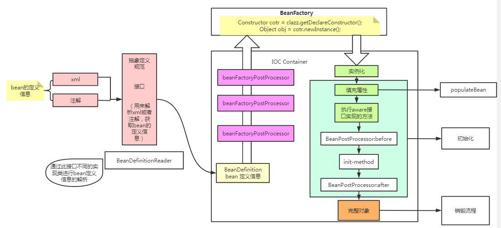
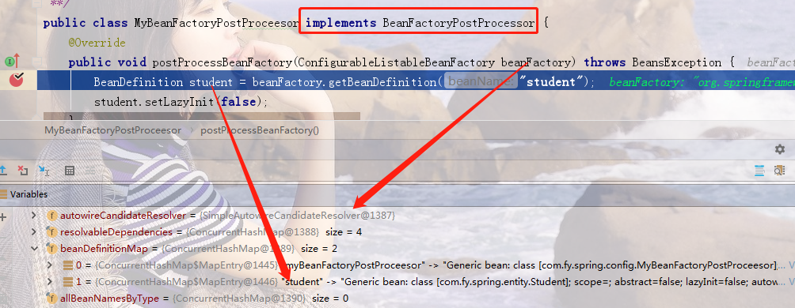

### 一、bean在spring容器中的创建流程图



### 二、BeanPostProcessor接口详解

从一图中可以看出，bean定义信息（存放在map中）在注册到BeanFactory中前后，会执行BeanFactoryPostProcessor接口的各种实现类的执行逻辑。

因此我们可以自己实现BeanFactoryPostProcessor接口，来进行扩展。比如从beanFactory中获取bean的定义信息（beanDefinitionMap）,从而修改bean定义信息中的一些属性值。



### 三、Aware接口详解

1. Aware接口存在的意义：==方便通过spring中的bean对象类获取对应容器中的相关属性值==

**代码示例**

```java
//Student类实现xxxAware接口，并重写setxxx方法，将xxx信息注入到实体类中
//通过spring的bean对象可以get出xxx的值
public class Student implements BeanNameAware, EnvironmentAware {
    private String name;

    private String beanName;
    private Environment environment;

    public String getName() {
        return name;
    }

    public void setName(String name) {
        this.name = name;
    }

    public String getBeanName() {
        return beanName;
    }

    public Environment getEnvironment() {
        return environment;
    }

    @Override
    public void setBeanName(String name) {
        this.beanName = name;
    }

    @Override
    public void setEnvironment(Environment environment) {
        this.environment = environment;
    }
}
```

```java
public static void main(String[] args) {
        ClassPathXmlApplicationContext context = new ClassPathXmlApplicationContext("spring-config.xml");
        Student student = (Student) context.getBean("student");
        String beanName = student.getBeanName(); //get到的通过BeanNameAware接口set的值
        student.getEnvironment(); //get到的通过EnvironmentAware接口set的值
    }
```

### 四、spring容器启动refresh()方法

此方法为spring刷新容器创建bean的核心方法。里面共调用了13个方法。

这13个方法的功能如下：

```java
public void refresh() throws BeansException, IllegalStateException {
		synchronized (this.startupShutdownMonitor) {
			// Prepare this context for refreshing.
            /**
            前戏：做容器刷新前的准备工作
            1.设置容器的启动时间
            2.设置活跃状态为true
            3.设置关闭状态为false
            4.获取Environment对象
            5.准备监听器和事件的集合对象，默认为空的集合
            **/
			prepareRefresh();

			// Tell the subclass to refresh the internal bean factory.
            /**
            创建容器对象：DefaultListableBeanFactory
            加载xml配置文件的属性值到当前工厂中。最重要的就是BeanDefinition
            **/
			ConfigurableListableBeanFactory beanFactory = obtainFreshBeanFactory();

			// Prepare the bean factory for use in this context.
            /**
            beanFactory的准备工作，对各种属性进行填充
            **/
			prepareBeanFactory(beanFactory);

			try {
				// Allows post-processing of the bean factory in context subclasses.
                //子类覆盖方法做额外处理，此处我们一般不做任何扩展工作，但是可以查看web中的代码，是有具体实现的
				postProcessBeanFactory(beanFactory);

				// Invoke factory processors registered as beans in the context.
                //调用各种beanFactory的处理器
				invokeBeanFactoryPostProcessors(beanFactory);

				// Register bean processors that intercept bean creation.
                //注册bean的各种处理器，以拦截bean的创建。（在getBean方法执行时才调用处理器）
				registerBeanPostProcessors(beanFactory);

				// Initialize message source for this context.
                // 为上下文初始化message源，即不同语言的消息体，国际化处理
				initMessageSource();

				// Initialize event multicaster for this context.
                // 初始化事件监听多播器
				initApplicationEventMulticaster();

				// Initialize other special beans in specific context subclasses.
                // 在特定上下文子类中初始化其他特殊的bean
				onRefresh();

				// Check for listener beans and register them.
                // 在所有注册的bean中查找listener bean，注册到消息广播器中
				registerListeners();

				// Instantiate all remaining (non-lazy-init) singletons.
                // 初始化剩余的单实例bean。 （注意，通过上面几个步骤，像beanFactory后置处理器、多播器、messageSource、beanPostProcessor这些特殊的对象已经被初始化了）
				finishBeanFactoryInitialization(beanFactory);

				// Last step: publish corresponding event.
				finishRefresh();
			}

			catch (BeansException ex) {
				if (logger.isWarnEnabled()) {
					logger.warn("Exception encountered during context initialization - " +
							"cancelling refresh attempt: " + ex);
				}

				// Destroy already created singletons to avoid dangling resources.
				destroyBeans();

				// Reset 'active' flag.
				cancelRefresh(ex);

				// Propagate exception to caller.
				throw ex;
			}

			finally {
				// Reset common introspection caches in Spring's core, since we
				// might not ever need metadata for singleton beans anymore...
				resetCommonCaches();
			}
		}
	}
```

### 五、spring解决循环依赖问题

具体过程看spring源码

> 1.三级缓存解决循环依赖问题的关键是什么？为什么通过提前暴露对象能解决？

实例化和初始化分开操作，在中间过程中给其他对象赋值的时候，并不是一个完整对象，而是把半成品对象赋值给其他对象。

> 2.如果只使用一级缓存能不能解决问题？

不能。在整个处理过程中，缓存中放的是半成品和成品对象，如果只是一级缓存，那么成品和半成品都会放到一级缓存中，有可能在获取过程中获取到半成品对象，此时半成品对象是无法使用的，不能直接进行相关处理，因此把半成品和成品的存放空间分割开来。