### 1.JVM体系结构

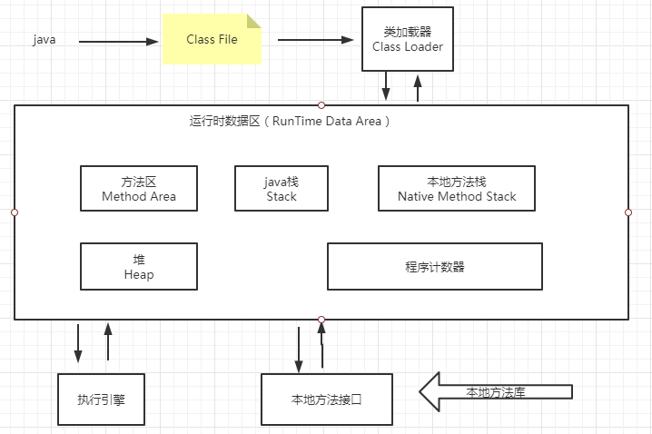

### 2.类加载器及双亲委派机制

1. 类加载器：==启动类加载器==（Bootstrap）->==扩展类加载器==（Extension）->==系统类加载器==（System）

2. 双亲委派机制：

   当某个类加载器需要加载某个`.class`文件时，它首先把这个任务委托给他的上级类加载器，递归这个操作，如果上级的类加载器没有加载，自己才会去加载这个类。 

   **作用：**安全性，防止java核心类被篡改，即使自定义一个java.lang.String类，也会交由启动类加载器加载

### 3.Native、方法区

> native

```java
	// native: 凡是带了native关键字的，说明java的作用范围达不到了，会去调用底层C语言的库
    // 会进入本地方法栈
    //  调用本地方法本地接口 JNI
    // JNI作用：扩展java的使用，融合不同的编程语言为java所用！  最初c/c++
    // java诞生的时候  C、C++横行，想要立足，必须要有调用C、C++的程序
    // 它在内存区域中专门开辟了一块标记区域：native method stack， 登记native方法
    // 在最终执行的时候，加载本地方法库中方法通过JNI
    // java程序驱动打印机，管理系统， 在企业级应用中较为少见。
    private native void start0();
```

> PC寄存器（程序计数器）

==每一个线程都有一个程序计数器，是线程私有的==，就是一个指针，指向方法区中的方法字节码（用来存储指向一条指令的地址，也即将要执行的指令代码），在执行引擎读取下一条指令，是一个非常小的内存空间，几乎可以忽略不计。

保证了多个线程执行同一代码不会混乱

> 方法区

==方法区是被所有线程共享的==，所有字段和方法字节码，以及一些特殊的方法，如构造函数，接口代码也在此定义，简单的说，所有定义的方法的信息都保存在该区域，**此区域属于共享区间**

==静态变量、常量、类信息（构造方法、接口定义）、运行时的常量池存在方法区中，但是实例变量存在堆内存中，和方法区无关。==

**方法区存放**：static、final、Class、常量池

### 4.虚拟机栈

==线程私有==，每个线程在创建时都会创建一个虚拟机栈，其内部保存一个个的栈帧，对应着一次次的java方法调用。

==-Xss 命令设置栈大小==

1. **栈**：栈内存，主管程序的运行，==生命周期和线程同步==；

   ​	线程结束，栈内存也就释放，对于栈来说，不存在垃圾回收问题

   ​	一旦线程结束，栈就over！

   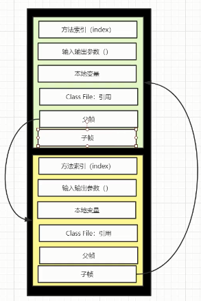

2. **栈中存放**：八大基本数据类型+对象引用+实例方法

3. 栈运行原理：栈帧

4. 栈满了：stackOverFlowError

5. 栈+堆+方法区：交互关系

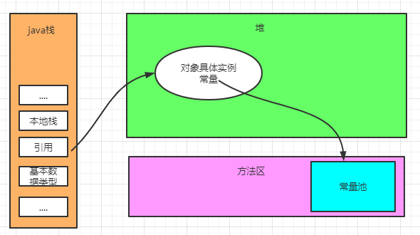

### 5.堆

Heap,一个JVM只有一个堆内存，堆内存的大小是可以调节的

类加载器读取了类文件后，一般会把我们引用类型指向的对象保存到对内存中。

对内存中还要细分为三个区域：

* 新生区
* 老年区
* 永久区

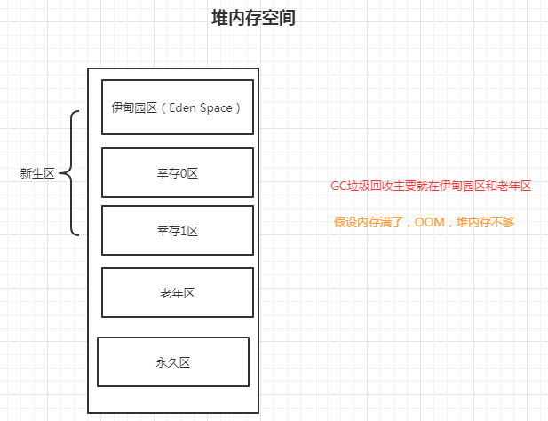

==在jdk1.8以后，永久区改了个名字（元空间）==

> 新生区

* 对象诞生和成长的地方，甚至是死亡
* 伊甸园区，所有对象都是在伊甸园区new出来的

> 永久代

这个区域常驻内存的。用来存放jdk自身携带的Class对象。interface元数据，存储的是java运行时一些环境或类信息，这个区域不存在垃圾回收！！关闭VM虚拟机就会释放这个区域的内存。

一个启动类，加载了大量的第三方jar包。tomcat部署了太多应用，大量动态生成的反射类。不断的被加载。直到内存满，就会出现OOM；

* jdk1.6之前：有永久代。常量池是在方法区
* jdk1.7：        有永久代，但是慢慢退化了，`去永久代`，常量池在堆中
* jdk1.8之后：无永久代，常量池在元空间

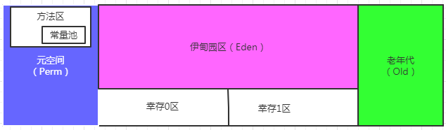

**使用-Xms1024m -Xmx1024m -XX:+PrintGCDetails 调节堆内存大小，以及打印GC日志**

-Xms 设置初始化内存分配大小 64/1

-Xmx 设置最大分配内存，默认4/1

```java
public static void main(String[] args) {
        // 返回虚拟机试图使用最大内存
        long maxMemory = Runtime.getRuntime().maxMemory();
        // 返回jvm初始化总内存
        long totalMemory = Runtime.getRuntime().totalMemory();

        System.out.println("maxMemory =" + maxMemory + "字节\t" + (maxMemory/(double)1024/1024) + "MB");
        System.out.println("totalMemor y=" + totalMemory + "字节\t" + (totalMemory/(double)1024/1024) + "MB");
        /**
         * 默认情况下： 分配的最大内存是电脑内存的4/1， 而初始化内存是电脑内存的64/1
         */
    }
```

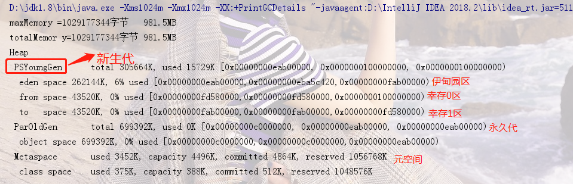

### 6.GC

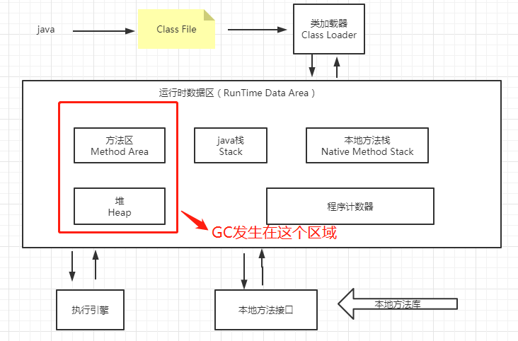

jvm在进行GC时，并不是对这三个区域统一回收。大部分时候，回收都是新生代；

* 新生代
* 幸存区（from， to）
* 老年代

GC两种类型：轻GC(普通的GC)、重GC（全局GC）


==GC题目：==

1. jvm的内存模型和分区~详细到每个区方什么？
2. 堆里面分区有哪些？Eden,from,to ,老年代，说说他们的特点？
3. GC的算法有哪些？标记清除算法，标记整理，复制算法，引用计数法。怎么用的？
4. 轻GC和重GC分别发生在什么时候？


> 引用计数法(JVM中基本不用)

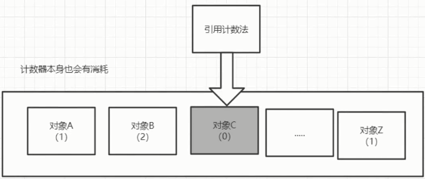

当发现对象引用计数为0时（即没有被引用）就清除

#### 6.1复制算法

==复制算法是发生在新生代的算法==

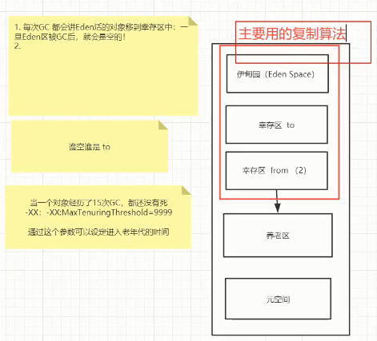

复制算法将堆中可用的新生代内存按容量划分成大小相等的两块内存区域，每次只使用其中的一块区域。当其中一块内存区域需要进行垃圾回收时，会将此区域内还存活着的对象复制到另一块上面，然后再把此内存区域一次性清理掉。 

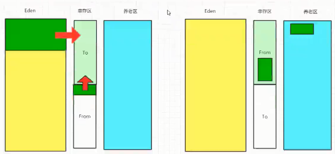

* 好处：没有内存碎片
* 坏处：浪费了内存空间；多了一半空间永远是空to

复制算法最佳使用场景：对象存活度较低的区域-新生代  （因为对象存活度低的话需要复制的内存区域较少）

#### 6.2标记清除算法

标记清除算法是最基础的回收算法，分为标记和清除两个部分：首先标记出所有需要回收的对象，这一过程在可达性分析过程中进行。在标记完之后统一回收所有被标记的对象。 

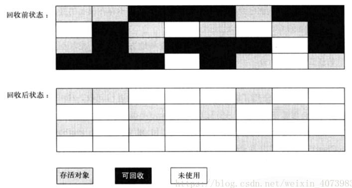

* 缺点：
  * 效率问题：标记和清除这两个过程的效率不高
  * 空间问题：清除之后会产生大量不连续内存碎片，内存碎片太多会导致以后的程序运行中无法分配出较大的内存，从内不得不触发另外的垃圾回收

#### 6.3标记整理算法

==老年代回收算法==

**复制算法在对象存活率较高的老年代会进行很多次的复制操作，效率很低，**所以在堆的老年代不适用复制算法。

 针对==老年代对象存活率高==的特点，提出了一种称之为”==标记-整理算法==”。标记过程仍与”标记-清除”过程一致，但后续步骤不是直接对可回收对象进行清理，而是让所有存活对象都向一端移动，然后直接清理掉端边界以外的内存。流程图如下:

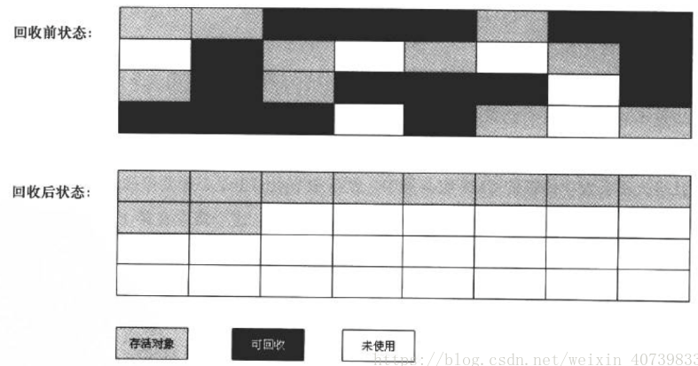

### 7.java垃圾回收及jvm参数调优概述

#### 7.1java垃圾回收算法

Java虚拟机的内存区域中，程序计数器、虚拟机栈和本地方法栈三个区域是线程私有的，随线程生而生，随线程灭而灭；栈中的栈帧随着方法的进入和退出而进行入栈和出栈操作，每个栈帧中分配多少内存基本上是在类结构确定下来时就已知的，因此这三个区域的内存分配和回收都具有确定性。==垃圾回收重点关注的是堆和方法区部分的内存==。 

##### 7.1.1引用计数法

​	引用计数算法是垃圾收集器中的早期策略。在这种方法中，堆中的每个对象实例都有一个引用计数。当一个对象被创建时，且将该对象实例分配给一个引用变量，该对象实例的引用计数设置为1。当任何其它变量被赋值为这个对象的引用时，对象实例的引用计数加1（a = b，则b引用的对象实例的计数器加 1），但当一个对象实例的某个引用超过了生命周期或者被设置为一个新值时，对象实例的引用计数减1。特别地，当一个对象实例被垃圾收集时，它引用的任何对象实例的引用计数器均减1。任何引用计数为0的对象实例可以被当作垃圾收集。

​	引用计数收集器可以很快的执行，并且交织在程序运行中，对程序需要不被长时间打断的实时环境比较有利，==但其很难解决对象之间相互循环引用的问题==。如下面的程序和示意图所示，对象objA和objB之间的引用计数永远不可能为 0，那么这两个对象就永远不能被回收。  

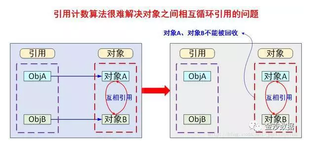

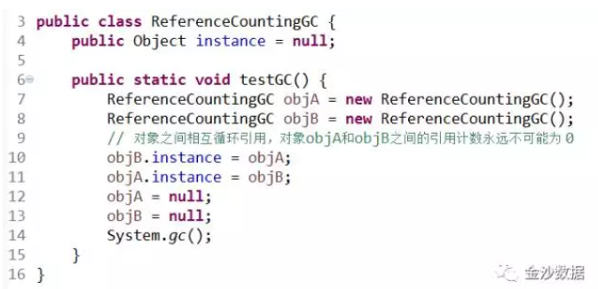

​	上述代码最后面两句将objA和objB赋值为null，也就是说objA和objB指向的对象已经不可能再被访问，但是由于它们互相引用对方，导致它们的引用计数器都不为 0，那么垃圾收集器就永远不会回收它们。

> 缺点

​	==由于引用计数法难以解决对象间相互循环引用的问题，因此java并没有使用引用计数法。==

##### 7.1.2根搜索算法

​	通过一系列的名为“GC Root”的对象作为起点，从这些节点向下搜索，搜索所走过的路径称为引用链(Reference Chain)，当一个对象到GC Root没有任何引用链相连时，则该对象不可达，该对象是不可使用的，垃圾收集器将回收其所占的内存。 

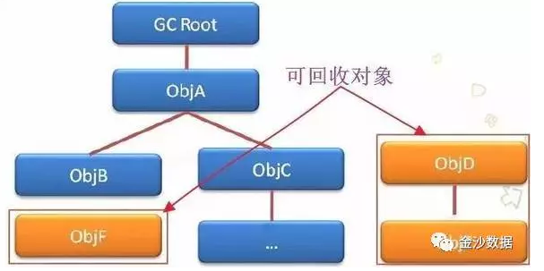

**在java语言中，可作为GC Root的对象包括以下几种对象**

* java虚拟机栈中引用的对象
* 方法区中类静态属性引用的对象
* 方法区中类常量引用的对象
* 本地方法栈中JNI本地方法引用的对象

> java方法区的回收

java方法区在Sun HotSpot虚拟机中被称为永久代，很多人认为该部分的内存是不用回收的，java虚拟机规范也没有对该部分内存的垃圾收集做规定，但是方法区中的废弃常量和无用的类还是需要回收以保证永久代不会发生内存溢出。

判断废弃常量的方法：如果常量池中的某个常量没有被任何引用所引用，则该常量是废弃常量。

判断无用的类：

(1).该类的所有实例都已经被回收，即java堆中不存在该类的实例对象。

(2).加载该类的类加载器已经被回收。

(3).该类所对应的java.lang.Class对象没有任何地方被引用，无法在任何地方通过反射机制访问该类的方法。


##### 7.1.3标记-清除算法

​	==最基础的垃圾收集算法。==算法分为“标记”和“清除”两个阶段：该算法首先从根集合进行扫描，对存活的对象进行标记，标记完毕后，再扫描整个空间中未被标记的对象并进行回收，如下图所示。 

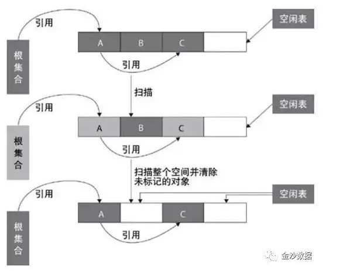

> 缺点

1. 效率问题：标记和清除效率都不高。

2. 标记清除后产生大量的不连续的内存碎片。空间碎片太多会导致当程序需要为较大对象分配内存时无法找到足够的连续内存而不得不提前触发另一次垃圾收集动作。

   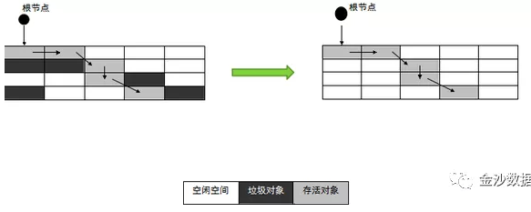

##### 7.1.4复制算法

​	将内存划分为大小相等的两块，每次只使用其中一块。当这一块的内存用完了，就将还存活的对象复制到另外一块上面，然后将已使用过的内存空间一次性清理掉。

==这种算法适用于对象存活率低的场景，比如新生代==。这样使得每次都是对整个半区进行内存回收，内存分配时也就不用考虑内存碎片等复杂情况，只要移动堆顶指针，按顺序分配内存即可，实现简单，运行高效。该算法示意图如下所示： 

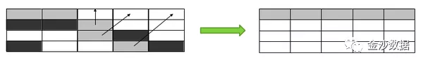

事实上，现在商用的虚拟机都采用这种算法来回收新生代。因为研究发现，新生代中的对象每次回收都基本上只有10%左右的对象存活，所以需要复制的对象很少，效率还不错。实践中会将新生代内存分为一块较大的Eden空间和两块较小的Survivor空间 (如下图所示)，每次使用Eden和其中一块Survivor。当回收时，将Eden和Survivor中还存活着的对象一次地复制到另外一块Survivor空间上，最后清理掉Eden和刚才用过的Survivor空间。HotSpot虚拟机默认Eden和Survivor的大小比例是 8:1，也就是每次新生代中可用内存空间为整个新生代容量的90% ( 80%+10% )，只有10% 的内存会被“浪费”。 


> 缺点

 	1. 会造成部分内存浪费，如新生代中有一个幸存者区内存浪费。
 	2. 对于存活率较高的区域会有较多的复制操作，效率将变低。所以对于对象朝生夕死的新生代适用，对于存活率高的老年代不适用。

##### 7.1.5标记整理算法

​	标记-整理算法在标记-清除算法基础上做了改进，标记阶段是相同的标记出所有需要回收的对象，在标记完成之后不是直接对可回收对象进行清理，而是让所有存活的对象都向一端移动，在移动过程中清理掉可回收的对象，这个过程叫做整理，该垃圾回收算法==适用于对象存活率高的场景（老年代）==，其作用原理如下图所示。 

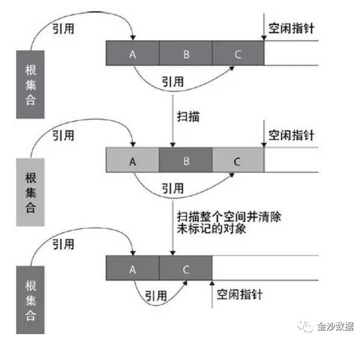

​	标记整理算法与标记清除算法最显著的区别是：标记清除算法不进行对象的移动，并且仅对不存活的对象进行处理而标记整理算法会将所有的存活对象移动到一端，并对不存活对象进行处理，因此其不会产生内存碎片。标记整理算法的作用示意图如下： 

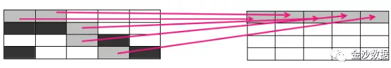

​	复制算法在对象存活率高的情况下就要执行较多的复制操作，效率将会变低，而在对象存活率高的情况下使用标记-整理算法效率会大大提高。 

##### 7.1.6分代收集算法（java中使用的算法）

​	根据内存中对象的存活周期不同将内存划分为几块，java的虚拟机中一般把内存划分为新生代、老年代和永久代，当新创建对象时一般在新生代中分配内存空间，当新生代垃圾收集器回收几次（默认15次）之后仍然存活的对象会被移动到老年代内存中，当大对象在新生代中无法找到足够的连续内存时也直接在老年代中创建。 

​	==现在的Java虚拟机就联合使用了分代复制、标记-清除和标记-整理算法==，java虚拟机垃圾收集器关注的内存结构如下： 

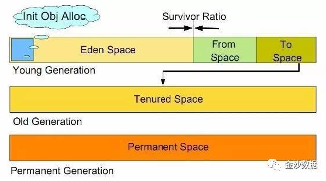

> 新生代

​	==新生代使用复制和标记-清除垃圾收集算法==，研究表明，新生代中98%的对象是朝生夕死的短生命周期对象，所以不需要将新生代划分为容量大小相等的两部分内存，而是将新生代分为Eden区，Survivor from和Survivor to三部分，其占新生代内存容量默认比例分别为8：1：1，其中Survivor from和Survivor to总有一个区域是空白，只有Eden和其中一个Survivor总共90%的新生代容量用于为新创建的对象分配内存，只有10%的Survivor内存浪费，**当新生代内存空间不足需要进行垃圾回收时，仍然存活的对象被复制到空白的Survivor内存区域中，Eden和非空白的Survivor进行标记-清理回收，两个Survivor区域是轮换的**。 

​	新生代中98%情况下空白Survivor都可以存放垃圾回收时仍然存活的对象，2%的极端情况下，如果空白Survivor空间无法存放下仍然存活的对象时，使用内存分配担保机制，直接将新生代依然存活的对象复制到老年代内存中，同时对于创建大对象时，==如果新生代中无足够的连续内存时，也直接在老年代中分配内存空间==。 

​	Java虚拟机对新生代的垃圾回收称为Minor GC，次数比较频繁，每次回收时间也比较短。 

​	使用java虚拟机==**-Xmn**==参数可以指定新生代内存大小。  

> 老年代

​	老年代中的对象一般都是长生命周期对象，对象的存活率比较高，因此在老年代中使用标记-整理垃圾回收算法。

​	Java虚拟机对老年代的垃圾回收称为MajorGC/Full GC，次数相对比较少，每次回收的时间也比较长。

​	当新生代中无足够空间为对象创建分配内存，老年代中内存回收也无法回收到足够的内存空间，并且新生代和老年代空间无法在扩展时，堆就会产生OutOfMemoryError异常。

​	java虚拟机**==-Xms==**参数可以指定最小内存大小，**==-Xmx==**参数可以指定最大内存大小，**这两个参数分别减去Xmn参数指定的新生代内存大小，可以计算出老年代最小和最大内存容量**。 

> 永久代

​	java虚拟机内存中的方法区在Sun HotSpot虚拟机中被称为永久代，是被各个线程共享的内存区域，它用于存储已被虚拟机加载的类信息、常量、静态变量、即时编译后的代码等数据。永久代垃圾回收比较少，效率也比较低，但是也必须进行垃圾回收，否则会永久代内存不够用时仍然会抛出OutOfMemoryError异常。

​	永久代也使用标记-整理算法进行垃圾回收，java虚拟机参数**==-XX:PermSize==和==-XX:MaxPermSize==可以设置永久代的初始大小和最大容量**。

#### 7.2垃圾回收器

##### 7.2.1垃圾回收器概述

​	如果说垃圾收集算法是内存回收的方法论，那么垃圾收集器就是内存回收的具体实现。下图展示了7种作用于不同分代的收集器，其中用于回收新生代的收集器包括Serial、PraNew、Parallel Scavenge，回收老年代的收集器包括Serial Old、Parallel Old、CMS，还有用于回收整个Java堆的G1收集器。不同收集器之间的连线表示它们可以搭配使用。 

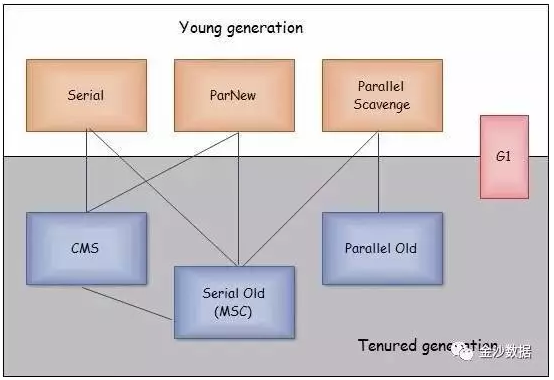

1. **Serial收集器（复制算法）**：新生代单线程收集器，标记和清理都是单线程，优点是简单高效； 
2. **Serial Old收集器 (标记-整理算法)**: 老年代单线程收集器，Serial收集器的老年代版本； 
3. **ParNew收集器 (复制算法)**: 新生代并行收集器，实际上是Serial收集器的多线程版本，在多核CPU环境下有着比Serial更好的表现；使用-XX:+UseParNewGC（新生代使用并行收集器，老年代使用串行回收收集器）或者-XX:+UseConcMarkSweepGC(新生代使用并行收集器，老年代使用CMS)。 
4. **Parallel Scavenge收集器 (复制算法)**: 新生代并行收集器，追求高吞吐量，高效利用 CPU。吞吐量 = 用户线程时间/(用户线程时间+GC线程时间)，高吞吐量可以高效率的利用CPU时间，尽快完成程序的运算任务，适合后台应用等对交互相应要求不高的场景；此处Parallel Scavenge与ParNew收集器的区别在下文有详细介绍。 
5. **Parallel Old收集器 (标记-整理算法)**： 老年代并行收集器，吞吐量优先，Parallel Scavenge收集器的老年代版本； 
6. **CMS(Concurrent Mark Sweep)收集器（标记-清除算法）**： 老年代并行收集器，以获取最短回收停顿时间为目标的收集器，具有高并发、低停顿的特点，追求最短GC回收停顿时间。 
7. **G1(Garbage First)收集器 (标记-整理算法)**：Java堆并行收集器，G1收集器是JDK1.7提供的一个新收集器，G1收集器基于“标记-整理”算法实现，也就是说不会产生内存碎片。此外，G1收集器不同于之前的收集器的一个重要特点是：G1回收的范围是整个Java堆(包括新生代，老年代)，而前六种收集器回收的范围仅限于新生代或老年代。 

##### 7.2.2串行垃圾回收器

​	串行垃圾回收器--Serial Garbage Collector 

​	最基本、最悠久的收集器，==他是一个单线程的收集器，而单线程是指当他在进行垃圾收集的时候，必须暂停其他所有的工作线程，被称为”Stop The World”==。 

​	串行垃圾回收器在进行垃圾回收时，它会持有所有应用程序的线程，冻结所有应用程序线程，使用单个垃圾回收线程来进行垃圾回收工作。 

​	串行垃圾回收器是为单线程环境而设计的，如果你的程序不需要多线程，启动串行垃圾回收。（一般是command line程序），简单而高效（与其他收集器的单线程相比），在限于单个CPU的环境，没有额外的线程交互的开销，所以能获得最高效率。 

​	使用方法：==-XX:+UseSerialGC==

​	**==在jkd client模式，不指定VM参数的话，默认是串行垃圾回收器。==**

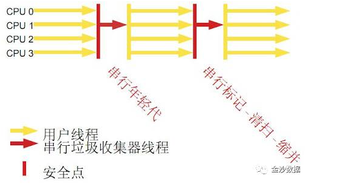

##### 7.2.3并行垃圾回收器

​	并行垃圾收集器--Parallel Garbage Collector 

​	看上去和ParNew没什么区别，但是Parallel Scavenge最大的特点就是他的关注点在于CPU的吞吐量，吞吐量=运行代码时间/（运行代码时间+垃圾收集时间）。较高的吞吐量可以最好的利用CPU的效率。-==XX:MaxGCPauseMillis==配置最大垃圾收集停顿时间，==-XX:GCTimeRatio==配置吞吐量大小。 

​	**并行垃圾回收器在进行垃圾回收时，同样会持有所有应用程序的线程，并冻结所有应用程序线程，来进行垃圾回收工作**（并行垃圾回收器也会stop-the-world）。唯一和串行垃圾回收器不同的是，并行垃圾回收器是使用多线程来进行垃圾回收工作的。 

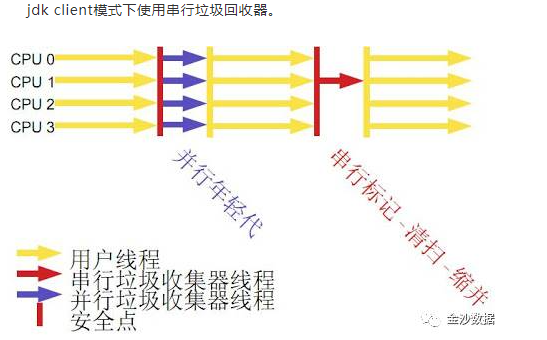

​	优点：被称为”吞吐量优先”收集器，有一个自适应调节参数（-XX:+UseAdaptiveSizePolicy），当这个参数打开后，无需手动指定新生代大小（-Xmn）、Eden和Survivor比例（-XX:SurvivorRatio）、晋升老年代年龄限制（-XX:PretenureSizeThreshold）等细节参数，虚拟机会动态调节这些参数来提供最适合的停顿时间或最大吞吐量。 

​	适用：本身是Server级别多CPU机器上的默认GC方式，也可以通过-XX:+UseParallelGC来指定，并且可以采用-XX:ParallelGCThread来指定线程数。  

##### 7.2.4并发垃圾回收器（CMS）

​	并发垃圾收集器--CMS Garbage Collector 

​	CMS(Concurrent Mark Sweep)收集器是一种以获取最短回收停顿时间为目标的收集器。基于”标记-清除”算法，整个过程分为4个步骤：初始标记（CMS initial mark）、并发标记（CMS concurrent mark）、重新标记（CMS remark）和并发清除（CMS concurrent sweep）。 

​	其中初始标记、重新标记仍然是”Stop The World”，初始标记仅仅是标记一下GC Roots能直接关联的对象，并发标记进行GC Roots Tracing的过程，重新标记为了修正并发标记期间因用户程序继续运行而导致标记产生变动的那部分对象，这个阶段停顿时间比初始标记阶段稍长一些，但比并发标记时间短。 

​	CMS垃圾回收器有时候会Hold所有的应用程序线程，但有时候只会Hold部分应用程序线程。

​	**什么时候会暂停所有应用程序线程？**

1. 在老年代中，当标记被引用的对象时。

2. 如果正在垃圾回收时，并行的改变在heap memory发生，大对象在old分配失败则停止CMS收集启用串行标记整理。

相比前两个垃圾回收器来说，CMS一定程度上缩短了应用程序GC时暂停的时间。 

相比并行垃圾回收，CMS收集器使用更多的CPU来换取更多的应用程序吞吐量。 

但是CMS进行恢复内存后的内存空间压缩整理时，会Stop the world。 

如果能分配更多的CPU给垃圾回收器，那么CMS会是一个比并行垃圾回收更好的选择。 

串行垃圾回收器在进行垃圾回收时，它会持有所有应用程序的线程，冻结所有应用程序线程，使用单个垃圾回收线程来进行垃圾回收工作。 

串行垃圾回收器是为单线程环境而设计的，如果你的程序不需要多线程，启动串行垃圾回收。（一般是command line程序） 

==XX:+USeParNewGC==

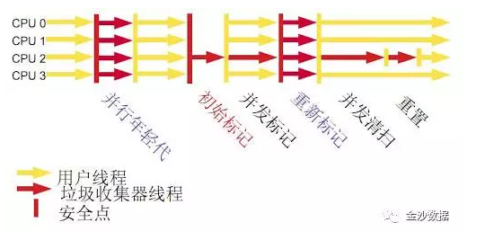

优点：并发收集、低停顿。

适用：重视服务的响应速度、系统停顿时间和用户体验的互联网网站或者B/S系统。  


