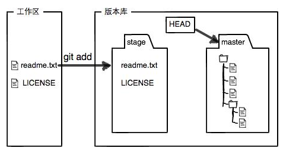

### 一、git的常用命令（创建版本库）

```java 
前提：在要使用git的地方右键选择Git Bash Here打开命令窗口；
1.git init //把该目录变为git可以管理的仓库
2.git add <file> //把文件添加为git的暂存区
3.git commit -m <massage> //把暂存区的内容提交到当前分支
注意：git不能管理Windows自带的记事本编辑的文本内容
```

### 二、版本回退

1.git log  //查看提交日志信息


2.git reset --hard HEAD^  //回退到上一个版本

​	

（已经回到上一版本）


```
说明：HEAD代表当前版本，HEAD^代表上一版本，HEAD^^代表上上个版本，HEAD~10代表上10版本
注意git reset --hard <版本号>   能回到指定版本（版本号不需要写全，git会自动匹配对应的版本）
```


扩展：   git reflog  (记录每次命令，可以找到任意版本号，包括回退前的)


### 三、工作区和暂存区



git status  //查看工作区和暂存区的状态（下图说明：test.md在暂存区且工作区的内容被修改，test2.md还未添加进暂存区）


一旦提交后工作区没有被修改，则工作树是干净的


### 四、撤销修改

两种：

#### 1.撤销工作区的修改

git checkout -- <file>

#### 2.撤销暂存区的修改

git reset HEAD <file>    //把暂存区的修改撤销到工作区

git checkout -- <file>     //把工作区的修改撤销

### 五、删除文件 

1.删除版本库的文件

git rm <file>    //先删除暂存区文件

git commit -m "remove"    //再把删除后的提交到版本库

2.针对于工作区的误删

git chekout -- <file>    //版本库的版本替换工作区的版本，因此做到还原

### 六、远程仓库

1.git remote add origin git@server-name:path/repo-name.git   //本地库与远程库关联

2.git push -u origin master      //推送master分支的所有内容到远程仓库

3.git clone <远程仓库URL>

### 七、分支管理

#### 1.创建与合并分支

```java
1.git checkout -b <分支名称>  //创建并切换分支
    相当于git branch <分支名称>   和  git checkout <分支名称>   
2.git branch   //查看当前分支
3.在新分支上修改并提交的代码，在master分支上看不到，需要合并分支后才能看到
	切换到master分支：git checkout master
	把dev分支合并到当前分支：git merge dev
	合并完成后删除dev分支：git branch -d dev
	
	注意：git merge --no-ff -m "message" <分支名称>  //合并分支的时候创建新commit，可以看到旧分支的信息（推荐使用）
```

#### 2.bug分支

修复bug时，我们会通过创建新的bug分支进行修复，然后合并，最后删除；

当手头工作没有完成时，先把工作现场`git stash`一下，然后去修复bug，修复后，再`git stash pop`，回到工作现场。