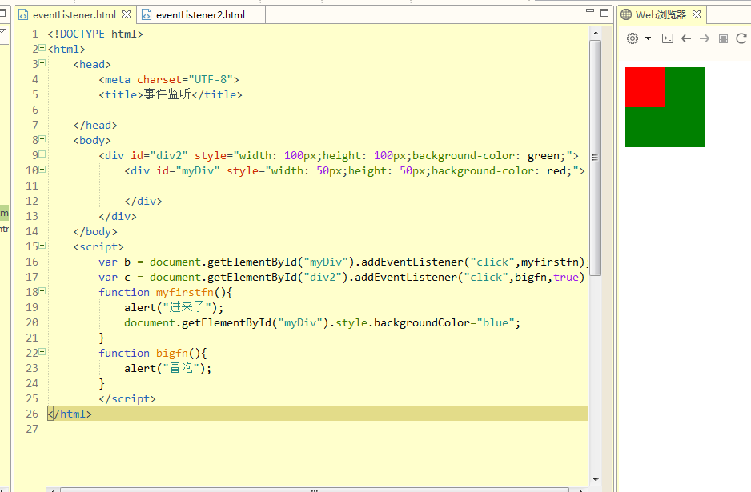

### 一、JavaScript基本语法

#### 1.数据类型

```javascript
1.基本数据类型
Number、String、Boolean、Undefined、Null五种；
2.引用数据类型
JavaScript中对象用json对象表示：
var student = {id:1,name:"张三",age:18};
document.write(student.id);//注：js中document代表HTML文档，document.write()可直接向HTML页面输出内容
3.数据类型
var a = [1,2,3,4];
4.关系运算符
与java一致！
```

#### 2.函数、事件、正则表达式

```JavaScript
1.函数
    函数定义：
    function functionName(parameters){
        //执行的代码
    }
2.弹窗函数
    2.1只能点击确定的弹窗
        alert("你好！");//无返回值
    2.2可以点击确定或取消的弹窗
        confirm("你好！")//点击确定返回true,点击“取消”或“x”返回false;
    2.3可以输入文本内容的弹窗
        prompt("你爱学习吗？","爱");
        //第一个参数是提示信息 ，第二个参数是用户输入的默认值；
        //点击确定时返回用户输入的内容，点击取消或关闭时，返回null；
3.事件
	onchange、onclick、onmouseover(用户在一个HTML元素上移动鼠标)、onmouseout(用户从一个HTML元素上移开鼠标)、onkeydown(用户按下键盘)、onload(浏览器已完成页面的加载)
4.正则表达式
	语法：var patt1 = new RegExp("e");
	document.write(patt1.test("The best thing in life are free"));
	//返回true 
	//另patt1.exec("The best thing in life are free"),返回被检索到的值，即e，如果没有，则返回null;
```

#### 3.javaScript的DOM

```JavaScript
1.概述：
	DOM即文档对象模型(Document Object Model)。
    1.1通过可编辑的对象模型，JavaScript有足够的能力创建动态的HTML。
    1）JavaScript能改变页面的所有HTML元素；
    2）JavaScript能改变页面所有HTM属性；
    3）JavaScript能改变页面所有CSS样式；
    4）JavaScript能对页面所有事件做出反应；
2.查找HTML元素
	2.1通过id查找
    	var a = document.getElementById("intro");
	2.2通过标签名查找
    	var b = document.getElementsByTagName("p");
	2.3类名查找
    	var c = document.getElementByClassName("intro");
3.改变HTML
	3.1改变HTML元素
		改变HTML输出流
    		document.write();//直接向HTML输出流写出内容
        改变HTML内容
    		document.getElementById(id).innerHTML="abc";
	3.2改变HTML属性
    	document.getElementById(id).attribute=新属性值;
		//例：document.getElementById("image").src="2.jpg";
	3.3改变CSS样式
    	document.getElementById(id).style.property=新样式
		//document.getElementById("p2").style.color="blue";
	3.4对事件做出反应
    document.getElementById(id).onclick=function(){
        //执行代码
    }
```

#### 4.监听事件与冒泡、捕获

```javascript
1.addEventListener()方法：
	概述：DOM中不允许向一个元素添加多个相同的事件，而addEventListener()可以向一个元素添加多个相同类型或不同类型的事件句柄；比如两个click事件；
    例：element.addEventListener(event, function, useCapture)；
    注：第三个参数为Boolean值，true代表捕获，false代表冒泡；默认为false（冒泡、捕获针对被覆盖的元素而言。冒泡是从上往下执行，捕获相反）
```



```javascript
2.cancelBubble阻止事件的冒泡和捕获
	var b = document.getElementById("myDiv").addEventListener("click",myfirstfn);
		b.cancelBubble=true;
		var c = document.getElementById("div2").addEventListener("click",bigfn，true);

则c事件被阻止；
```

#### 5.元素操作（创建和删除元素）

```javascript
1.创建新元素
element.appendChild(newElement);
例：
	<div id="div1">
        <p id="p1">这是一个段落。</p>
        <p id="p2">这是另一个段落。</p>
    </div>
    <script>
        var para=document.createElement("p");
        var node=document.createTextNode("这是一个新段落。");
        para.appendChild(node);
        var element=document.getElementById("div1");
        element.appendChild(para);
    </script>

2.删除已有元素
parentElement.removeChild(childElement);
	例：
    <div id="div1">
        <p id="p1">这是一个段落。</p>
        <p id="p2">这是另一个段落。</p>
    </div>
    <script>
        var parent=document.getElementById("div1");
        var child=document.getElementById("p1");
        parent.removeChild(child);
    </script>
	//注意：js删除元素必须利用该元素的父节点元素来删除；
```

#### 6.BOM（浏览器对象模型）

```javascript
概述：用于操作浏览器对象；
	其中DOM中的document也属于浏览器，window.document.getElementById("myId");中window省略；
    window.location.href="url";跳转新链接；
```

#### 7.JavaScript计时器

```javascript
1.JavaScript计时器事件setInterval()：（每隔指定时间执行一次指定代码）
	指定时间执行指定代码;

	<button onclick="stopFunction()">停止</button>

	var myVar=setInterval(function(){myTimer()},1000);
    function myTimer(){
    var d=new Date();
    var t=d.toLocaleTimeString();
    document.getElementById("demo").innerHTML=t;
    }
function stopFunction(){
    clearInterval(myVar);
}
	
2.clearInterval()停止计时器
	见上示例；
    
3.setTimeOut(function,time):(从当前时间起多少毫秒后执行第一个参数)
	clearTimeout();
示例:
	var myVar;
    function myFunction()
    {
    myVar=setTimeout(function(){alert("Hello")},3000);
    }
    function myStopFunction()
    {
    clearTimeout(myVar);
    }
//用法同计时器
```

