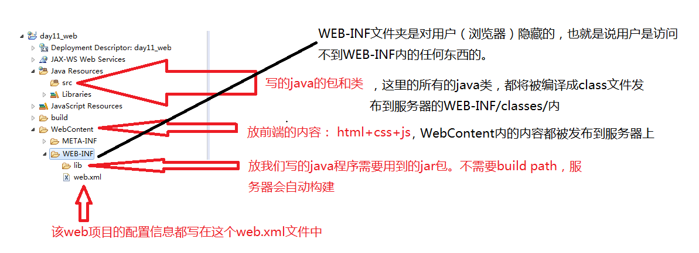
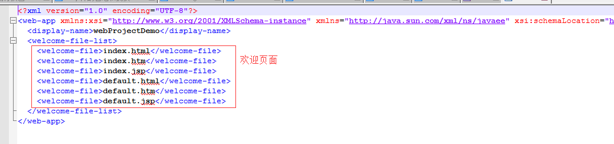

### 1.tomcat安装

```
官网下载压缩包，解压到英文路径下即可；
注意：tomcat安装需配置JAVA_HOME环境变量；
启动：进入到解压的目录下找到bin\startup.bat双击启动即可
```

### 2.tomcat目录介绍

```java
1.bin:二进制可执行文件；解压版会有startup.bat用于启动tomcat(但需要JDK配置)，shutdown.bat用于停止tomcat。
2.conf：1）server.xml:配置整个服务器信息。如修改端口号，添加虚拟机等；
		2）tomcatusers.xml:储存tomcat用户的文件，保存的是用户的用户名及密码以及用户的角色信息；
		3）web.xml:部署描述符文件，这个文件中注册了很多MIME类型，即文档类型。
		4）context.xml:对所有应用统一配置，通常我们不用去配置它。
3.lib:tomcat的类库，里面是一大堆的jar文件。如果需要添加tomcat依赖的jar文件，可以把它放到这个目录中，当然也可以把应用依赖的jar文件放到这个目录下，这个目录下的jar所有项目都可以共享，但这样你的应用放到其他tomcat下时就不能共享这个目录下的jar包了，所以建议只把tomcat需要的jar包放到这个目录下；
4.logs:存放日志文件，记录了tomcat启动和关闭的信息，如果启动tomcat时有错误，那么异常也会记录在日志文件中。
5.temp：存放tomcat的临时文件，这个目录下的东西可以在停止tomcat后删除；
6.webapps：存放web项目的目录，其中每个文件夹都是一个项目；如果这个目录下已经存在目录，那么是tomcat自带的项目；
7.work：运行时生成的文件，最终运行的文件都在这里。通过webapps中的项目生成的！当客户端访问一个JSP文件时，tomcat会通过JSP生成java文件，然后再编译java文件生成class文件，生成的java和class文件都会存放到这个目录下；
8.LICENSE:许可证；
9.NOTICE：说明文件；
```

### 3.eclipse集成tomcat

1.打开Eclipse的window-->Preferences—>Server

2.点击add—>选择对应的版本—>Finish即可

### 4.web项目创建及结构

```
1.创建：
new-->Dynamic Web Project
注意：servlet选择2.5版本会自动生成web.xml配置文件，3.0以上的版本不会生成；
```

2.web项目的结构



web.xml自动生成的配置信息



### 5.web项目发布到tomcat服务器

右键项目run as -->run on server

就会把项目发布到tomcat服务器的webapps文件夹下，供人访问，启动后默认访问web.xml文件中配置的welcome-file,没有则报404；