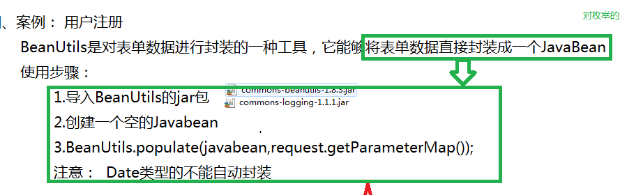

### 1.ServletContext对象（域对象）

```java
1.概述： 是该web应用所开辟的一块空间，该空间被该web应用下的所有servlet共享的一块空间；
2.调用的两种方式：
	1）ServletConfig servletConfig = this.getServletConfig();
		ServletContext context = servletConfig.getServletContext();
	2)ServletContext context = this.getServletContext();
3)ServletContext的API
	//存放键值对
	setAttribute(String key,Object value);
	//取键值对
	getAttribute(String key);
	//移除键值对
	removeAttribute(String key);
4)生命周期：对于一个web应用来说，当该web应用被启动时，服务器就会创建一个ServletContext对象，有且仅有一个，所有的servlet共享，当该web应用关闭或者卸载时，该ServletContext对象被销毁。
```


### 2.HttpServletRequest(域对象)

```javascript
1. 概述： 将客户端请求信息提供给某个servlet的对象；servlet容器创建ServletRequest对象，并将该对象作为参数传递给该servlet的service方法；  当客户端通过HTTP协议访问服务器时，HTTP请求头中的所有信息都封装在这个对象中，可以通过这个对象的方法，获取客户端的这些信息。
2. 常用方法：
	//获取请求方式
    String method = request.getMethod();
    //获取请求的url
    String url = request.getRequestURL()+"";
    //获取uri
    String uri = request.getRequestURI();
    //获取请求的参数 get
    String query = request.getQueryString();
    //获取请求人的id
    String ip = request.getRemoteAddr();
    //获取请求的主机名
    String host = request.getRemoteHost();
    //编码格式
    request.setCharacterEncoding("UTF-8");
    //获取参数方法
    System.out.println(request.getParameter("name"));
    System.out.println(request.getParameterMap());
    System.out.println(request.getParameterNames());

注意：getParameter(String name)和getParameterValues(String name)的区别：
	当进行多选下拉框提交时getParameter仅返回第一个值，而getParameterValues返回所有值的数组；
```

###3.BeanUtils的使用



### 4.HttpServletResponse

```java
1.简介：
	servlet将响应发送到客户端的对象；servlet容器创建servletResponse对象，并将它作为参数传递给servlet的service方法；
2.基本使用：
	//编码格式
//request.setCharacterEncoding("");//设置请求内容的编码格式
response.setCharacterEncoding("UTF-8");//设置响应数据的编码格式
response.setStatus(404);//设置状态响应码
//设置响应内容的类型和编码格式
response.setContentType("text/html;charset=UTF-8");
用户下载服务器图片：DownLoadServlet
//response.getOutputStream();
//获取打印字符流
PrintWriter pw=response.getWriter();
```

#### 1.案例之显示服务器图片

```java
//图片放在WEB-INF下，通过ServletContext的getRealPath获取绝对路径
		String path = "/WEB-INF/bueaty.jpg";
//request.getRealPath(String path);也可以获取绝对路径
		ServletContext context = this.getServletContext();
		String realPath = context.getRealPath(path);
		FileInputStream fileInputStream = new FileInputStream(realPath);
		ServletOutputStream outputStream = response.getOutputStream();
		byte[] b = new byte [1024];
		int len = 0;
		while((len = fileInputStream.read(b))!=-1) {
			outputStream.write(b,0,len);
		}
		fileInputStream.close();
```

#### 2.案例之下载

```java
		String path = "/WEB-INF/bueaty.jpg";
		String realPath = this.getServletContext().getRealPath(path);
		FileInputStream stream = new FileInputStream(realPath);

		//获取文件名字（用于下载名称显示和获取mime类型）
		String filename = realPath.substring(realPath.lastIndexOf(File.separator)+1);
		filename = new String(filename.getBytes("UTF-8"),"iso-8859-1");

		//告诉浏览器是下载而不是打开
		response.setHeader("content-disposition", "attachment;filename="+filename);

		//获取文件的mime类型（自动识别文件扩展名生成mime类型）
		String mimeType = this.getServletContext().getMimeType(filename);
		response.setContentType(mimeType);

		ServletOutputStream outputStream = response.getOutputStream();
		byte[] b = new byte[1024];
		int len = 0;
		while((len=stream.read(b))!=-1) {
			outputStream.write(b,0,len);
		}
		stream.close();
```
