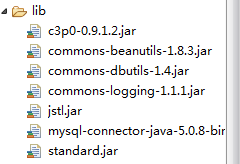

### 1.jsp概述及作用

```java
1.java server pages;java服务器页面。和servlet一样，是sun公司定义的一种动态网页开发技术；
特点：基于HTML模板，可以在HTML模板中嵌入java代码和jsp中的标签；
2.作用：jsp性能好，可以在HTML页面中动态嵌入元素；jsp基于java servlet Api，有很多强大企业支持；
```

### 2.简单上手

```java
//servlet  （“/servlet1”）
protected void doGet(HttpServletRequest request, HttpServletResponse response) throws ServletException, IOException {
		User user = new User();
		user.setUserName("赵雅静");
		user.setAge(25);
		request.setAttribute("user",user);
		request.getRequestDispatcher("/1.jsp").forward(request, response);
	}
```

```jsp
<!--注意：page指令导包，类的完全限定名要用引号括起来，不然会报错 -->
<!--注意：1.jsp建在webContent下 -->
<%@ page language="java" contentType="text/html; charset=UTF-8"
    pageEncoding="UTF-8"%>
<%@ page import="com.fy.domin.User" %>
<!DOCTYPE html>
<html>
<head>
<meta charset="UTF-8">
<title>Insert title here</title>
</head>
<body>
	<%
	String userName = "";
	int age = 0;
	Object obj = request.getAttribute("user");
	if(obj!=null){
		User user = (User)obj;
		userName = user.getUserName();
		age = user.getAge();
	}
	%>
	用户名：<%=userName %><br>
	年龄：<%=age %>
</body>
</html>
```

访问：http://localhost:8080/项目名/servlet1

### 3.jsp执行原理

```java
访问服务器上静态资源不是直接打开这个静态资源，而是由某个servlet来负责的；
当访问jsp资源时会去匹配全局的web.xml中的<url-pattern>/*.jsp</url-pattern>对应的servlet：jspServlet;
jspServlet将jsp资源翻译成servlet文件
全局的web.xml文件在tomcat安装目录里conf文件夹下
```

### 4.jsp语法

```java
1.<%java代码%>   //局部变量，直接写java代码
2.<%!int i = 10;%>  //全局变量
3.<%=2+3%>  //输出语句，等价于out.print(变量名)
```

### 5.jsp的三大指令

```java
1.page指令：<%@ pageimport="java.util.Date,java.util.List"%>
	作用：定义jsp页面各种属性。
	page指令中的键值对及作用：
		import：和java代码中的作用一样；
		session：是否自动创建session对象，默认true；
		buffer：设置输出数据的缓存大小，默认8kb；
		errorpage：如果页面中有错误，跳转到指定的资源errorPage="/uri";
		isErrorPage:是否创建throwable对象，默认false；
		contentType：等同于servlet中response.setContentType("text/html;charset=utf-8"),服务器发送客户端的内容编码；
		pageEncoding:jsp文件本身的编码；
		isELIgnored:是否不支持EL表达式，默认false，支持；

2.include指令：<%@ include file="header.jsp" %> //服务器地址
    静态包含：把其它资源包含到当前页面中 <%@ include file="header.jsp" %>
    动态包含： <jsp:include page=“header.jsp"></jsp:include>
    两者的区别：翻译的时间段不同(可在tomcat工作目录下查看)
    静态包含：在翻译时就把两个文件进行合并
    动态包含：不会合并文件，当代码执行到include时，才包含另一个文件的内容
    
3.taglib指令
	作用：在JSP页面中导入JSTL标签库。替换jsp中的java代码片段。
	<%@ taglib uri="http://java.sun.com/jsp/jstl/core"prefix="c" %>
```

### 6.jsp的九大内置对象

```java
request
response
application:  servletContext
session  :当页面的session属性为true是有，<%@page session="true"%>
exception：当页面的isErrorPage属性为true时才有，<%@page isErrorPage="true"%>
page：当前servlet的实例
pageContext：jsp的一个域对象
out：输出流对象
config：servletConfig
```

### 7.jsp中的四大域对象

```java
pageContext   ：  在当前页面
request			：在一次请求
session			：在一次会话
application（servletContext）:真个web应用运行状态

1.域对象的公共方法：
	setAttribute(String key,Object value);
	getAttribute(String key);
	removeAttribute(String key);

```

#### 7.1pageContext的使用

```java
1.pageContext操作其他三个域对象
	//向pageContext域中存放键值对
	pageContext.setAttribute("name","fangyan",PageContext.PAGE_SCOPE)；
	//request域存键值对
	pageContext.setAttribute("age","20",PageContext.REQUEST_SCOPE)；
	//session域存键值对
	pageContext.setAttribute("girlFriend","赵雅静",PageContext.SESSION_SCOPE)；
	//application域存键值对
	pageContext.setAttribute("sex","女",PageContext.APPLICATION_SCOPE)
	
	//从request域移除键值对
    pageContext.removeAttribute("age",PageContext.REQUEST_SCOPE);

	//从四大域对象中寻找键对应的值
	pageContext.findAttribute("sex");
	查找顺序：根据对象的作用范围从小到大查找
	pageContext < request < session < application
	
2.通过pageContext创建其他八个隐式对象
	getException方法返回exception隐式对象
    getPage方法返回page隐式对象
    getRequest方法返回request隐式对象
    getResponse方法返回response隐式对象
    getServletConfig方法返回config隐式对象
    getServletContext方法返回application隐式对象
    getSession方法返回session隐式对象
    getOut方法返回out隐式对象
```

### 8.jsp两大动作

```jsp
1.jsp:include  动态包含；
    <jsp:include page="header.jsp"></jsp:include>
    注意和静态包含<%@ include file="1.jsp"%>的区别；
2.jsp:forward  请求转发；
	<jsp:forward page="2.jsp"></jsp:forward>
```

### 9.EL表达式

```java 
1.格式： ${EL表达式} 等价于pageContext.findAttribute(name)
2.EL表达式获取实体类的属性值
	${user.name}   //自动找user.getName();
  获取集合元素
  	${list[1]}     //list.get(1);
  获取map集合元素
  	${map.name}   //map.get("name")；
3.EL表达式进行三元运算
	${10>9?"a":"b"}
4.EL表达式用于比较和计算
	${10>9}   //true
	${10*8}   //80
5.EL表达式的empty关键字
	${empty user}   //如果user对象是null将输出true
	${!empty teacher} 
```

### 10.JSTL标签库

####10.1概述和使用

```java
1.概述：JSTL（JavaSever Pages Standard Tag Library）,jsp标准标签库是一个不断完善的开放源码的jsp标签库；  JSTL支持通用的、结构化的任务；比如迭代、判断、xml操作等；
标签库的作用：取代jsp中java脚本语言；
2.使用：下载jakarta-taglibs-standard-1.1.2.zip 包并解压，将jakarta-taglibs-standard-1.1.2/lib/下的两个jar文件：
standard.jar和jstl.jar文件拷贝到/WEB-INF/lib/下。
3.JSTL分类：
	1）核心标签；  （最常用）
	2）格式化标签；
	3）SQL标签；
	4）xml标签；
```

#### 10.2core标签的使用

```jsp
1.准备：1）在项目WEB-INF/lib文件夹添加standard.jar和jstl.jar；
		2）在jsp页面使用taglib指令引入核心标签库；
		<%@ taglib uri="http://java.sun.com/jsp/jstl/core"  prefix="c"%>
		
2.c:if
    用法：<c:if test="EL表达式">html内容</c:if>  当test=true时显示
	示例：<c:if test="${empty users }">
          没有用户信息
          </c:if>
3.c:choose
	<c:choose>
		<c:when test="EL表达式1">满足条件1显示</c:when>
        <c:when test="EL表达式2">满足条件2显示</c:when>
        <c:otherwise>都不满足显示</c:when>
	</c:choose>
4.c:foreach
	<c:forEach items="${users }" var="user" varStatus="vs">
	${vs.count }-${user.username }:${user.password }:${user.addr }<br>
	</c:forEach>
	示例中：users是集合，var表示集合中的元素，varStatus获取的对象可以获取元素的状态，vs.count:元素的序号，vs.index:元素的索引...
```

#### 注意：

```
问：为什么在EL表达式中获取绝对路径用${pageContext.request.contextPath},而不能用${request.contextPath}或${contextParh}?  pageContext和request作为jsp的九大内置对象，都可以通过EL表达式获取内置对象的属性值；
答：EL表达式有11个内置对象，但是没有request，只能通过pageContext.request获取；

${} 等价于 pageContext.findAttribute(name);
<%= %> 等价于 out.write();
```

### 11.jsp简单示例

index.jsp

```jsp
<%@ page language="java" contentType="text/html; charset=UTF-8"
    pageEncoding="UTF-8"%>
<!DOCTYPE html>
<html>
<head>
<meta charset="UTF-8">
<title>Insert title here</title>
</head>
<body>
<a href="${pageContext.request.contextPath }/ServletDemo">点我将看到所有用户信息</a>
</body>
</html>
```

ServletDemo

```java
protected void doGet(HttpServletRequest request, HttpServletResponse response) throws ServletException, IOException {
    try {
        //QueryRunner来自dbutils核心类，JDBCUtil获取的是c3p0连接池，该连接池依赖mysql-connector包 需要添加的jar包如下图
		QueryRunner qr = new QueryRunner(JDBCUtil.getDataSource());
		String sql = "select * from user";
		List<User> list = null;
		list = qr.query(sql, new BeanListHandler<User>(User.class));
        request.setAttribute("users", list);
		request.getRequestDispatcher("/1.jsp").forward(request, response);
		} catch (SQLException e) {
			e.printStackTrace();
		}
	}
```

1.jsp

```jsp
<!--taglib指令的标签库需要导入standard.jar和jstl.jar-->
<%@ page language="java" contentType="text/html; charset=UTF-8"
    pageEncoding="UTF-8"%>
<%@ taglib uri="http://java.sun.com/jsp/jstl/core"  prefix="c"%>
<!DOCTYPE html>
<html>
<head>
<meta charset="UTF-8">
<title>Insert title here</title>
</head>
<body>
<c:if test="${empty users }">
	没有用户信息
</c:if>
<c:forEach items="${users }" var="user" varStatus="vs">
	${vs.count }-${user.username }:${user.password }:${user.addr }<br>
</c:forEach>
</body>
</html>
```

