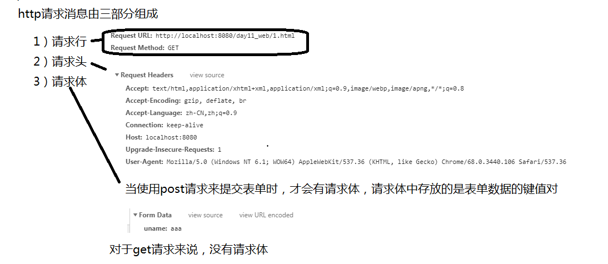
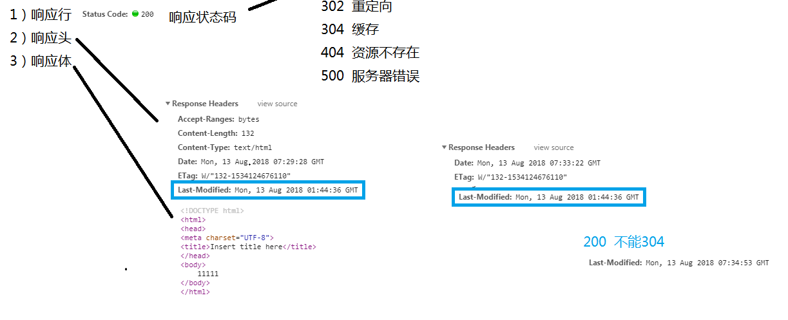
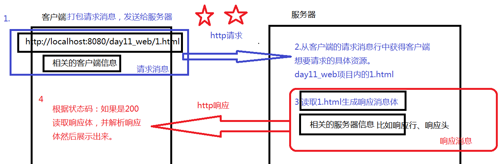

### 1.概述

```java
1.HTTP（超文本传输协议）：是一个基于请求与响应模式的、无状态的、应用层的协议，常基于TCP的连接方式，
HTTP1.1版本中给出一种持续连接的机制，绝大多数的Web开发，都是构建在HTTP协议之上的Web应用；
2.why:数据在两个终端之间进行传递时，必须遵守同一协议；对于浏览器和服务器之间的数据传输，我们目前使用的都是HTTP协议，该协议能传输超文本内容；
```

### 2.URL和URI

```
1.URL（统一资源定位符）：遵循某种协议
	例：http://localhost:8080/day11_web/1.html
		jdbc:mysql:///db_day01
		ftp://10.21.145.22/day11
2.uri(统一资源标识符)：
	例：D:\2018\javaee\webProjectDemo
3.区别：有协议的定位资源的路径为URL，没有协议的定位资源的路径为URI；
```

### 3.http协议的详解

```java
1.http请求：请求消息：客户端封装了所有客户端数据，将所有客户端数据传递给服务器。
2.http响应：响应消息：服务器封装所有的客户端需要的资源内容，将该所有的资源返回给客户端。

1.1http请求消息由三部分组成：
	1）请求行
	2）请求头
	3）请求体
1.2总结：所谓的请求，就是客户端在请求服务器上的某个资源，浏览器上显示任何内容都是通过发送了http请求后获得的；服务器可以从请求消息中获取客户端的数据，默认请求方式都是get请求；

2.1http响应由响应行、响应头和响应体组成；
2.2总结：服务器生成具体的相应资源发送给客户端；客户端根据响应资源中比如响应状态码来执行相应效果，客户端根据响应消息体来展示具体资源内容；
```





客户端和服务器http请求过程：



### 4.POST请求和GET请求

```
1.get请求特点：请求的表单数据体现在浏览器的URL后，不安全，不适合大数据量提交；
2.post请求特点：请求的表单数据封装在请求体中，保证了安全，也适合大数据浪提交；
3.when：只有当form表单method属性值是post时才进行post请求，其他任何请求方式都是get请求；
```

