**主要内容**

```java
1.java NIO简介
2.java NIO与IO的主要区别
3.缓冲区（Buffer）和通道(Channel)
4.文件通道(FileChannel)
5.NIO的非阻塞式网络通信
	1）选择器（Selector）
	2）SocketChannel、ServerSocketChannel、DatagramChannel
6.管道（pipe）
7.java NIO2(Path、Paths与Files)
```

### 1.java NIO简介

```java
	java NIO（new IO）是从java1.4开始引入的一个新的IO API，可以替代标准的java IO API。NIO与原来的IO有同样的作用和目的，但是使用的方式完全不同，NIO支持面向缓冲区的、基于通道的IO操作。NIO将以更加高效的方式进行文件的读写操作。
```

### 2.java NIO与IO的主要区别

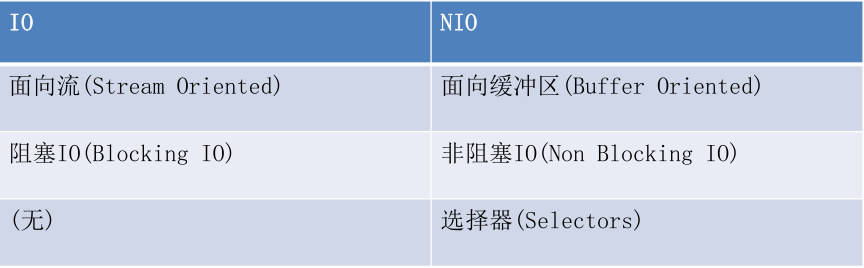

### 3.通道（Channel）与缓冲区(Buffer)

```java 
	java NIO系统的核心在于：通道（Channel）和缓冲区（Buffer）.通道表示打开到IO设备（例如：文件、套接字）的连接。若需要使用NIO系统，需要获取用于连接IO设备的通道以及用于容纳数据的缓冲区。然后操作缓冲区，对数据进行处理。
	简而言之，Channel负责传输，Buffer负责存储。
```

#### 3.1缓冲区

```java
1.缓冲区（Buffer）：一个用于特定基本数据类型的容器。由java.nio包定义的，所有缓冲区都是Buffer抽象类的子类。
2.java NIO中的Buffer主要用于与NIO通道进行交互，数据是从通道读入缓冲区，从缓冲区写入通道中的。
3.Buffer就像一个数组，可以保存多个相同类型的数据。根据数据类型不同（boolen除外），有以下Buffer常用子类：
	ByteBuffer
	CharBuffer
	ShortBuffer
	IntBuffer
	LongBuffer
	FloatBuffer
	DoubleBuffer
  上述Buffer类他们都采用相似的方法进行管理数据，只是各自管理数据类型不同而已。都是通过如下方法获取一个Buffer对象：
  static XxxBuffer allocate(int capacity):创建一个容量为capacity的XxxBuffer对象。
4.缓冲区的基本属性
	1）容量（capacity）：表示Buffer最大数据容量，缓冲区容量不能为负，并且创建后不能修改。
	2）限制（limit）：第一个不应该读取或写入的数据索引，即位于limit后的数据不可读写。缓冲区的限制不能为负，并且不能大于其容量。
	3）位置（position）：下一个要读取或写入的数据的索引。缓冲区的位置不能为负，并且不能大于其限制。
	4）标记（mark）与重置（reset）：标记是一个索引，通过buffer中的mark()方法指定buffer中一个特定的position，之后可以通过调用reset()方法恢复到这个position。
	//标记、位置、限制、容量遵守以下不变式：
	0<=mark<=position<=limit<=capacity
```

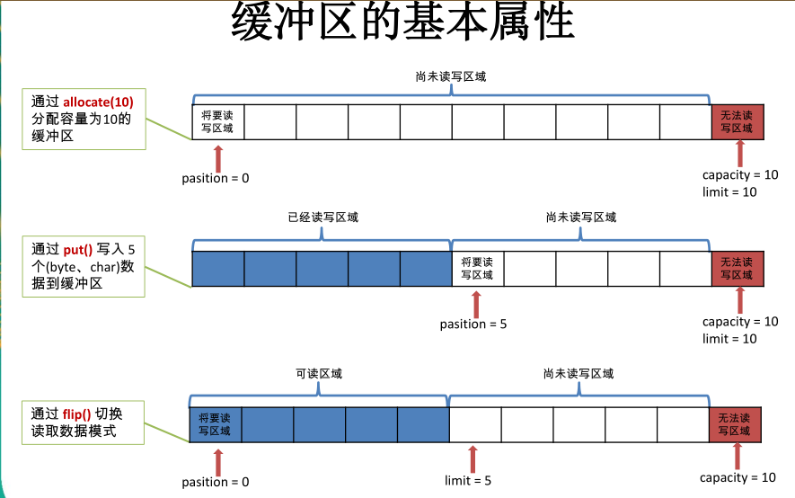

**Buffer的常用方法**

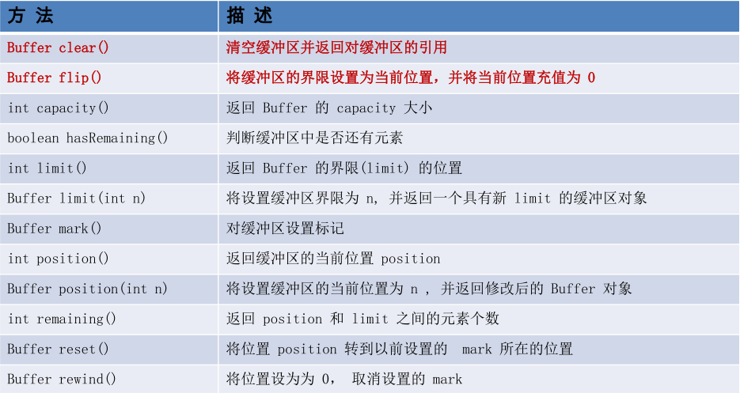

**缓冲区的数据操作**

```java
Buffer所有子类提供了两个用于数据操作的方法：get()与put()方法；
1.获取Buffer中数据
	get():读取单个字节
	get(byte[] dst):批量读取多个字节到dst中
	get(int index):读取指定索引位置的字节（不会移动position）
2.放入数据到Buffer中
	put(byte b):将给定单个字节写入缓冲区的当前位置
	put(byte[] src):将src中的字节写缓冲区的当前位置
	put(int index, byte b):将指定字节写入缓冲区的索引位置（不会移动position）
	
```

**练习**

```java
public class NioDemo {
    @Test
    public void test() {
        //Buffer四个属性测试
        ByteBuffer buffer = ByteBuffer.allocate(1024);
        System.out.println(buffer.position()); //0
        System.out.println(buffer.limit());   //1024
        System.out.println(buffer.capacity()); //1024

        //buffer对数据的操作(写入)
        String str = "abcde";
        buffer.put(str.getBytes());
        System.out.println(buffer.position()); //5
        System.out.println(buffer.limit());   //1024
        System.out.println(buffer.capacity()); //1024

        //buffer对数据的操作（读取） 注意要通过flip()切换至读取模式
        buffer.flip();
        System.out.println("===============flip()=============");
        System.out.println(buffer.position()); //0
        System.out.println(buffer.limit());   //5
        System.out.println(buffer.capacity()); //1024
        byte[] bytes = new byte[buffer.limit()];
        buffer.get(bytes, 0, bytes.length);  //将数据读到字节数组中
        System.out.println(new String(bytes));
        System.out.println("===============读取数据后==================");
        System.out.println(buffer.position()); //5
        System.out.println(buffer.limit());   //5
        System.out.println(buffer.capacity()); //1024
    }
}
```

#### 3.2直接缓冲区

```java
直接缓冲区与非直接缓冲区的区别：
1.字节缓冲区要么是直接的，要么是非直接的。如果为直接字节缓冲区，则java虚拟机会尽最大努力直接在此缓冲区上执行本机io的操作。也就是说，在每次调用基础操作系统的一个本机io操作之前（或之后），虚拟机都会尽量避免将缓冲区的内容复制到中间缓冲区中（或从中间缓冲区获取内容）。
2.直接字节缓冲区可以通过调用此类的 allocateDirect()  工厂方法 来创建。此方法返回的 缓冲区进行分配和取消
分配所需成本通常高于非直接缓冲区 。直接缓冲区的内容可以驻留在常规的垃圾回收堆之外，因此，它们对
应用程序的内存需求量造成的影响可能并不明显。所以，建议将直接缓冲区主要分配给那些易受基础系统的
机 本机 I/O  操作影响的大型、持久的缓冲区。一般情况下，最好仅在直接缓冲区能在程序性能方面带来明显好
处时分配它们。
3.直接字节缓冲区还可以过 通过FileChannel  的 map()  方法  将文件区域直接映射到内存中来创建 。该方法返回
MappedByteBuffer  。Java  平台的实现有助于通过 JNI  从本机代码创建直接字节缓冲区。如果以上这些缓冲区
中的某个缓冲区实例指的是不可访问的内存区域，则试图访问该区域不会更改该缓冲区的内容，并且将会在
访问期间或稍后的某个时间导致抛出不确定的异常。
4.字节缓冲区是直接缓冲区还是非直接缓冲区可通过调用其 isDirect()  方法来确定。提供此方法是为了能够在
性能关键型代码中执行显式缓冲区管理 。
```

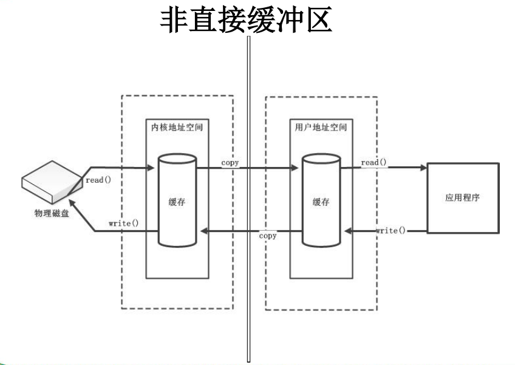

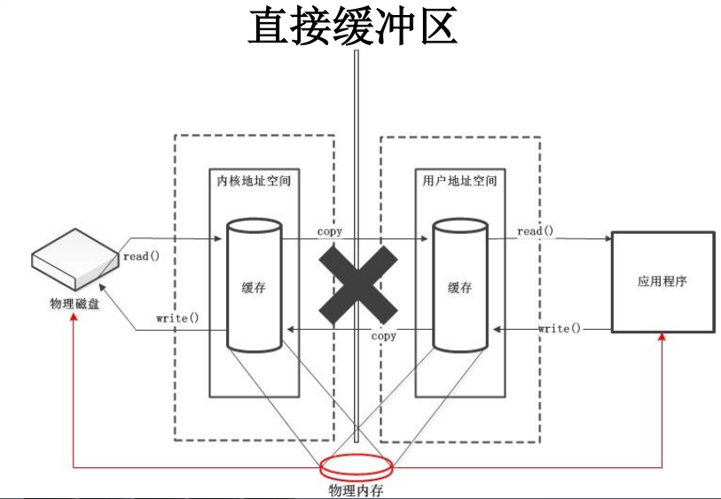

**代码示例**

```java
 @Test
    public void test2(){
        //创建直接缓冲区
        ByteBuffer buffer = ByteBuffer.allocateDirect(1024);
        //判断当前缓冲区是否是直接缓冲区
        System.out.println(buffer.isDirect());
    }
```

#### 3.3通道（Channel）

```java
通道(Channel):由java.nio.channels包定义的。Channel表示IO源与目标打开的连接。Channel类似于传统的流。只不过Channel本身不能直接访问数据，Channel只能与Buffer进行交互。
```

**传统IO 示意图**

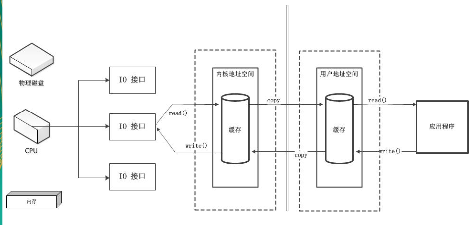

**使用通道的NIO示意图**

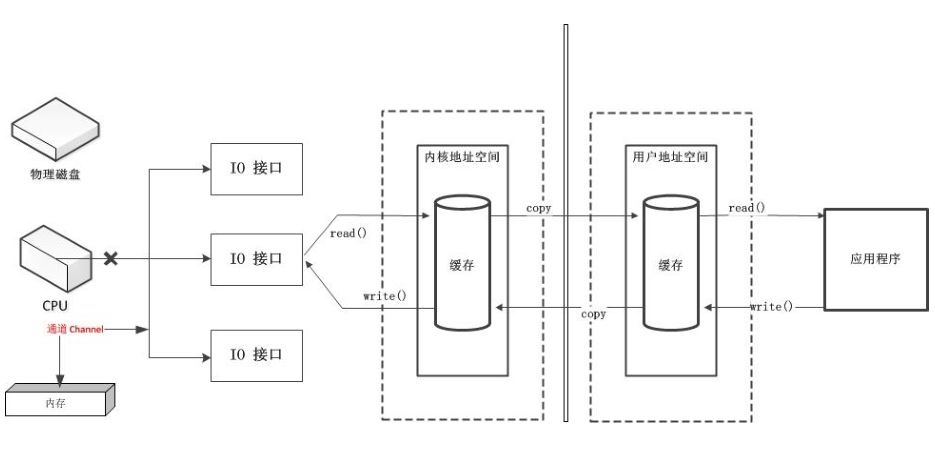

```java
1.java为Channel接口提供的最主要的实现类如下：
	1）FileChannel :用于读取、写入、映射和操作文件的通道。
	2）DatagramChannel :通过UDP读写网络中的数据通道。
	3）SocketChannel :通过TCP读取网络中的数据。
	4）ServerSocketChannel :可以监听新进来的TCP连接，对每一个新进来的连接都会创建一个SocketChannel.
2.获取通道：
	第一种方式：获取通道的一种方式是对支持通道的对象调用getChannel()方法。支持通道的类如下：
	1）FileInputStream
	2)FileOutputStream
	3)RandomAccessFile
	4)DatagramSocket
	5)Socket
	6)ServerSocket
	第二种方式：在JDK1.7中的NIO.2针对各个通道提供了静态方法open()
	第三种方式：在JDK1.7中的NIO.2使用Files类的静态方法newByteChannel()获取字节通道
3.通道的常用方法：见下图
```

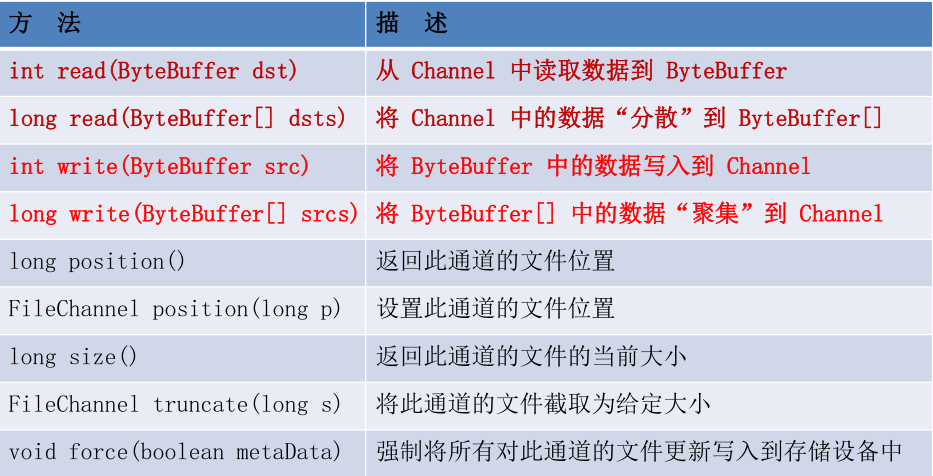


#### 3.4通道的数据传输与内存映射文件

```java
//第一种：：利用通道完成文件的复制（非直接缓冲区）
	@Test
	public void test1(){//10874-10953
		long start = System.currentTimeMillis();
		FileInputStream fis = null;
		FileOutputStream fos = null;
		//①获取通道
		FileChannel inChannel = null;
		FileChannel outChannel = null;
		try {
			fis = new FileInputStream("d:/1.mkv");
			fos = new FileOutputStream("d:/2.mkv");
			inChannel = fis.getChannel();
			outChannel = fos.getChannel();
			//②分配指定大小的缓冲区
			ByteBuffer buf = ByteBuffer.allocate(1024);
			//③将通道中的数据存入缓冲区中
			while(inChannel.read(buf) != -1){
				buf.flip(); //切换读取数据的模式
				//④将缓冲区中的数据写入通道中
				outChannel.write(buf);
				buf.clear(); //清空缓冲区
			}
		} catch (IOException e) {
			e.printStackTrace();
		} finally {
			if(outChannel != null){
				try {
					outChannel.close();
				} catch (IOException e) {
					e.printStackTrace();
				}
			}
			if(inChannel != null){
				try {
					inChannel.close();
				} catch (IOException e) {
					e.printStackTrace();
				}
			}
			if(fos != null){
				try {
					fos.close();
				} catch (IOException e) {
					e.printStackTrace();
				}
			}
			if(fis != null){
				try {
					fis.close();
				} catch (IOException e) {
					e.printStackTrace();
				}
			}
		}
		long end = System.currentTimeMillis();
		System.out.println("耗费时间为：" + (end - start));、
	}

//第二种方式：：使用直接缓冲区完成文件的复制(内存映射文件)
	@Test
	public void test2() throws IOException{//2127-1902-1777
		long start = System.currentTimeMillis();
		
		FileChannel inChannel = FileChannel.open(Paths.get("d:/1.mkv"), StandardOpenOption.READ);
		FileChannel outChannel = FileChannel.open(Paths.get("d:/2.mkv"), StandardOpenOption.WRITE, StandardOpenOption.READ, StandardOpenOption.CREATE);
		
		//内存映射文件
		MappedByteBuffer inMappedBuf = inChannel.map(MapMode.READ_ONLY, 0, inChannel.size());
		MappedByteBuffer outMappedBuf = outChannel.map(MapMode.READ_WRITE, 0, inChannel.size());
		
		//直接对缓冲区进行数据的读写操作
		byte[] dst = new byte[inMappedBuf.limit()];
		inMappedBuf.get(dst);
		outMappedBuf.put(dst);
		
		inChannel.close();
		outChannel.close();
		
		long end = System.currentTimeMillis();
		System.out.println("耗费时间为：" + (end - start));
	}

//第三种：通道之间的数据传输(直接缓冲区)
/*
 四、通道之间的数据传输
 * transferFrom()
 * transferTo()
 */
	@Test
	public void test3() throws IOException{
		FileChannel inChannel = FileChannel.open(Paths.get("d:/1.mkv"), StandardOpenOption.READ);
		FileChannel outChannel = FileChannel.open(Paths.get("d:/2.mkv"), StandardOpenOption.WRITE, StandardOpenOption.READ, StandardOpenOption.CREATE);
		
//		inChannel.transferTo(0, inChannel.size(), outChannel);
		outChannel.transferFrom(inChannel, 0, inChannel.size());
		
		inChannel.close();
		outChannel.close();
	}
```

#### 3.5分散读取和聚集写入

```java
1.分散读取（Scattering Reads）是指从Channel中读取的数据“分散”到多个buffer中。
	//注意：按缓冲区的顺序，从Channel中读取的数据依次将buffer填满。
2.聚集写入（Gathering Writes）是指将多个buffer中的数据“聚集”到Channel。
	//注意：按照缓冲区的顺序，写入position和limit之间的数据到Channel。
	
  //分散读取和聚集写
    @Test
    public void test6() {
        RandomAccessFile acessFile = null;
        RandomAccessFile accessFile2 = null;
        FileChannel inChannel = null;
        FileChannel outChannel = null;
        try {
            acessFile = new RandomAccessFile("E:/1.jpg", "rw"); //注意“rw”表示读写模式
            //1.获取通道
            inChannel = acessFile.getChannel();
            //2.分配指定大小的缓冲区
            ByteBuffer buf1 = ByteBuffer.allocate(100);
            ByteBuffer buf2 = ByteBuffer.allocate(1024);
            //5.聚集写入
            accessFile2 = new RandomAccessFile("E:/3.jpg", "rw");
            outChannel = accessFile2.getChannel();
            //3.分散读取
            ByteBuffer[] bufs = {buf1, buf2};
            while (inChannel.read(bufs) != -1){
                //4.切换缓冲区为写模式
                for (ByteBuffer buffer: bufs) {
                    buffer.flip();
                }
                outChannel.write(bufs);
                //清空缓冲区
                for (ByteBuffer buffer: bufs) {
                    buffer.clear();
                }
            }
        } catch (FileNotFoundException e) {
            e.printStackTrace();
        } catch (IOException e) {
            e.printStackTrace();
        } finally {
            try {
                acessFile.close();
                accessFile2.close();
                inChannel.close();
                outChannel.close();
            } catch (IOException e) {
                e.printStackTrace();
            }

        }

    }
```

#### 3.6字符集

```java
编码：字符串->字节数组
解码: 字节数组->字符串
//字符集
	@Test
	public void test6() throws IOException{
		Charset cs1 = Charset.forName("GBK");
		
		//获取编码器
		CharsetEncoder ce = cs1.newEncoder();
		
		//获取解码器
		CharsetDecoder cd = cs1.newDecoder();
		
		CharBuffer cBuf = CharBuffer.allocate(1024);
		cBuf.put("尚硅谷威武！");
		cBuf.flip();
		
		//编码
		ByteBuffer bBuf = ce.encode(cBuf);
		
		for (int i = 0; i < 12; i++) {
			System.out.println(bBuf.get());
		}
		
		//解码
		bBuf.flip();
		CharBuffer cBuf2 = cd.decode(bBuf);
		System.out.println(cBuf2.toString());
		
		System.out.println("------------------------------------------------------");
		
		Charset cs2 = Charset.forName("GBK");
		bBuf.flip();
		CharBuffer cBuf3 = cs2.decode(bBuf);
		System.out.println(cBuf3.toString());
	}
	
	@Test
	public void test5(){
		Map<String, Charset> map = Charset.availableCharsets();
		
		Set<Entry<String, Charset>> set = map.entrySet();
		
		for (Entry<String, Charset> entry : set) {
			System.out.println(entry.getKey() + "=" + entry.getValue());
		}
	}
```

### 4.NIO的非阻塞式网络通信

#### 4.1阻塞与非阻塞

```java
1.传统的IO流都是阻塞式的。也就是说，当一个线程调用read()或write()时，该线程被阻塞，直到有一些数据被读取或写入，该线程在此期间不能执行其他任务。因此，在完成网络通信进行IO操作时，由于线程会阻塞，所以服务器端必须为每个客户端都提供一个独立的线程进行处理，当服务器端需要处理大量客户端时，性能急剧下降。
2.Java NIO是非阻塞模式的。当线程从通道进行读写数据时，若没有数据可用时，该线程可以进行其他任务。线程通常将非阻塞IO的空闲时间用于在其他通道执行IO操作，所以单独的线程可以管理多个输入和输出通道。因此，NIO可以让服务器端使用一个有限几个线程来同时处理连接到服务器端的所有客户端。
```

#### 4.2选择器（Selector）

```java
1.选择器是SelectableChannel对象的多路复用器，Selector可以同时监控多个SelectableChannel的IO状况，也就是说，利用Selector可使一个单独的线程管理多个Channel。Selector是非阻塞IO的核心。
```

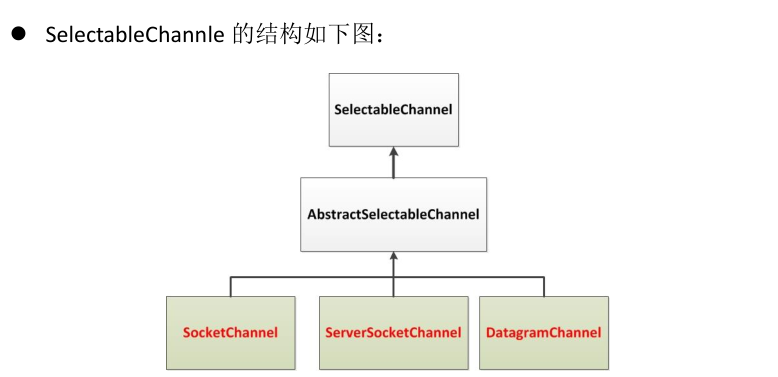

**选择器（Selector的应用）**

```java
1.创建Selector：通过调用Selector.open()方法创建一个Selector。
	Selector selector = Selector.open();
2.向选择器注册通道：SelectableChannel.register(Selector sel, int ops);
	//创建一个socket套接字
	Socket socket = new Socket(InetAdress.getByName("127.0.0.1"), 9898);
	//获取SocketChannel
	SocketChannel channel = socket.getChannel();
	//创建选择器
	Selector selector = Selector.open();
	//将socketChannel切换至非阻塞模式
	channel.configureBlocking(false);
	//向Selector注册Channel
	SelectionKey key = channel.register(selector, SelectionKey.OP_READ);
3.当调用register(Selector sel, int ops)将通道注册选择器时，选择器对通道的监听事件，需要通过第二个参数ops指定。
4.可以监听的事件类型(可使用SelectionKey的四个常量表示：)
    读：SelectionKey.OP_READ	(1)
    写：SelectionKey.OP_WRITE	(4)
    连接：SelectionKey.OP_CONECT	(8)
    接收：SelectionKey.OP_ACCEPT	(16)
5.若注册时不止监听一个事件，则可以使用“位或”操作符连接。
	//例：注册“监听事件”
	int interestSet = SelectionKey.OP_READ|SelectionKey.OP_WRITE;
6.SelectionKey:表示SelectableChannel和selector之间的注册关系。每次向选择器注册通道时就会选择一个事件（选择键）。选择键包含两个表示为整数值的操作集。操作集的每一位都表示该键的通道所支持的一类可选择操作。
SelectionKey的常用方法如下：
```

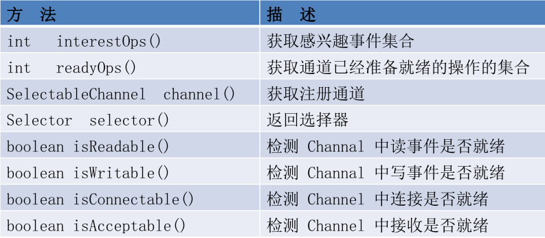

**Selector的常用方法**

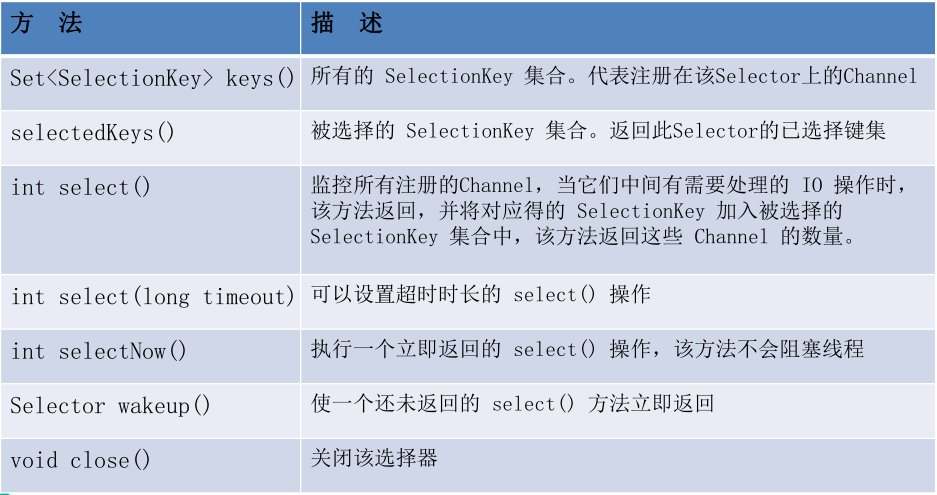

#### 4.3SocketChannel

```java
1.Java NIO中的SocketChannel是一个连接到TCP网络套接字的通道。
2.操作步骤：
	1）打开SocketChannel
	2）读写数据
	3）关闭SocketChannel
3.Java NIO中的ServerSocketChannel是一个可以监听新进来的TCP连接的通道，就像标准IO中的ServerSocket一样。
```

#### 4.3示例

**阻塞NIO** 1

```java
/*
 * 一、使用 NIO 完成网络通信的三个核心：
 * 
 * 1. 通道（Channel）：负责连接
 * 		
 * 	   java.nio.channels.Channel 接口：
 * 			|--SelectableChannel
 * 				|--SocketChannel
 * 				|--ServerSocketChannel
 * 				|--DatagramChannel
 * 
 * 				|--Pipe.SinkChannel
 * 				|--Pipe.SourceChannel
 * 
 * 2. 缓冲区（Buffer）：负责数据的存取
 * 
 * 3. 选择器（Selector）：是 SelectableChannel 的多路复用器。用于监控 SelectableChannel 的 IO 状况
 * 
 */
public class TestBlockingNIO {
	//客户端
	@Test
	public void client() throws IOException{
		//1. 获取通道
		SocketChannel sChannel = SocketChannel.open(new InetSocketAddress("127.0.0.1", 9898));
		FileChannel inChannel = FileChannel.open(Paths.get("1.jpg"), StandardOpenOption.READ);
		//2. 分配指定大小的缓冲区
		ByteBuffer buf = ByteBuffer.allocate(1024);
		//3. 读取本地文件，并发送到服务端
		while(inChannel.read(buf) != -1){
			buf.flip();
			sChannel.write(buf);
			buf.clear();
		}
		//4. 关闭通道
		inChannel.close();
		sChannel.close();
	}
	//服务端
	@Test
	public void server() throws IOException{
		//1. 获取通道
		ServerSocketChannel ssChannel = ServerSocketChannel.open();
		FileChannel outChannel = FileChannel.open(Paths.get("2.jpg"), StandardOpenOption.WRITE, StandardOpenOption.CREATE);
		//2. 绑定连接
		ssChannel.bind(new InetSocketAddress(9898));
		//3. 获取客户端连接的通道
		SocketChannel sChannel = ssChannel.accept();
		//4. 分配指定大小的缓冲区
		ByteBuffer buf = ByteBuffer.allocate(1024);
		//5. 接收客户端的数据，并保存到本地
		while(sChannel.read(buf) != -1){
			buf.flip();
			outChannel.write(buf);
			buf.clear();
		}
		//6. 关闭通道
		sChannel.close();
		outChannel.close();
		ssChannel.close();
	}
}
```

**阻塞NIO2（接收服务端反馈）**

```java
public class TestBlockingNIO2 {
	
	//客户端
	@Test
	public void client() throws IOException{
		SocketChannel sChannel = SocketChannel.open(new InetSocketAddress("127.0.0.1", 9898));
		
		FileChannel inChannel = FileChannel.open(Paths.get("1.jpg"), StandardOpenOption.READ);
		
		ByteBuffer buf = ByteBuffer.allocate(1024);
		
		while(inChannel.read(buf) != -1){
			buf.flip();
			sChannel.write(buf);
			buf.clear();
		}
		
		sChannel.shutdownOutput();
		
		//接收服务端的反馈
		int len = 0;
		while((len = sChannel.read(buf)) != -1){
			buf.flip();
			System.out.println(new String(buf.array(), 0, len));
			buf.clear();
		}
		
		inChannel.close();
		sChannel.close();
	}
	
	//服务端
	@Test
	public void server() throws IOException{
		ServerSocketChannel ssChannel = ServerSocketChannel.open();
		
		FileChannel outChannel = FileChannel.open(Paths.get("2.jpg"), StandardOpenOption.WRITE, StandardOpenOption.CREATE);
		
		ssChannel.bind(new InetSocketAddress(9898));
		
		SocketChannel sChannel = ssChannel.accept();
		
		ByteBuffer buf = ByteBuffer.allocate(1024);
		
		while(sChannel.read(buf) != -1){
			buf.flip();
			outChannel.write(buf);
			buf.clear();
		}
		
		//发送反馈给客户端
		buf.put("服务端接收数据成功".getBytes());
		buf.flip();
		sChannel.write(buf);
		
		sChannel.close();
		outChannel.close();
		ssChannel.close();
	}

}

```

**非阻塞NIO1**

```java
public class TestNonBlockingNIO {
	
	//客户端
	@Test
	public void client() throws IOException{
		//1. 获取通道
		SocketChannel sChannel = SocketChannel.open(new InetSocketAddress("127.0.0.1", 9898));
		
		//2. 切换非阻塞模式
		sChannel.configureBlocking(false);
		
		//3. 分配指定大小的缓冲区
		ByteBuffer buf = ByteBuffer.allocate(1024);
		
		//4. 发送数据给服务端
		Scanner scan = new Scanner(System.in);
		
		while(scan.hasNext()){
			String str = scan.next();
			buf.put((new Date().toString() + "\n" + str).getBytes());
			buf.flip();
			sChannel.write(buf);
			buf.clear();
		}
		
		//5. 关闭通道
		sChannel.close();
	}

	//服务端
	@Test
	public void server() throws IOException{
		//1. 获取通道
		ServerSocketChannel ssChannel = ServerSocketChannel.open();
		
		//2. 切换非阻塞模式
		ssChannel.configureBlocking(false);
		
		//3. 绑定连接
		ssChannel.bind(new InetSocketAddress(9898));
		
		//4. 获取选择器
		Selector selector = Selector.open();
		
		//5. 将通道注册到选择器上, 并且指定“监听接收事件”
		ssChannel.register(selector, SelectionKey.OP_ACCEPT);
		
		//6. 轮询式的获取选择器上已经“准备就绪”的事件
		while(selector.select() > 0){
			
			//7. 获取当前选择器中所有注册的“选择键(已就绪的监听事件)”
			Iterator<SelectionKey> it = selector.selectedKeys().iterator();
			
			while(it.hasNext()){
				//8. 获取准备“就绪”的是事件
				SelectionKey sk = it.next();
				
				//9. 判断具体是什么事件准备就绪
				if(sk.isAcceptable()){
					//10. 若“接收就绪”，获取客户端连接
					SocketChannel sChannel = ssChannel.accept();
					
					//11. 切换非阻塞模式
					sChannel.configureBlocking(false);
					
					//12. 将该通道注册到选择器上
					sChannel.register(selector, SelectionKey.OP_READ);
				}else if(sk.isReadable()){
					//13. 获取当前选择器上“读就绪”状态的通道
					SocketChannel sChannel = (SocketChannel) sk.channel();
					
					//14. 读取数据
					ByteBuffer buf = ByteBuffer.allocate(1024);
					
					int len = 0;
					while((len = sChannel.read(buf)) > 0 ){
						buf.flip();
						System.out.println(new String(buf.array(), 0, len));
						buf.clear();
					}
				}
				
				//15. 取消选择键 SelectionKey
				it.remove();
			}
		}
	}
}
```

**非阻塞NIO2（使用DatagramChannel）**

```java 
//Java NIO中的DatagramChannel是一个能收发UDP包的通道。
//操作步骤：1）打开DatagramChannel	2)接收/发送数据
public class TestNonBlockingNIO2 {
	
	@Test
	public void send() throws IOException{
		DatagramChannel dc = DatagramChannel.open();
		
		dc.configureBlocking(false);
		
		ByteBuffer buf = ByteBuffer.allocate(1024);
		
		Scanner scan = new Scanner(System.in);
		
		while(scan.hasNext()){
			String str = scan.next();
			buf.put((new Date().toString() + ":\n" + str).getBytes());
			buf.flip();
			dc.send(buf, new InetSocketAddress("127.0.0.1", 9898));
			buf.clear();
		}
		
		dc.close();
	}
	
	@Test
	public void receive() throws IOException{
		DatagramChannel dc = DatagramChannel.open();
		
		dc.configureBlocking(false);
		
		dc.bind(new InetSocketAddress(9898));
		
		Selector selector = Selector.open();
		
		dc.register(selector, SelectionKey.OP_READ);
		
		while(selector.select() > 0){
			Iterator<SelectionKey> it = selector.selectedKeys().iterator();
			
			while(it.hasNext()){
				SelectionKey sk = it.next();
				
				if(sk.isReadable()){
					ByteBuffer buf = ByteBuffer.allocate(1024);
					
					dc.receive(buf);
					buf.flip();
					System.out.println(new String(buf.array(), 0, buf.limit()));
					buf.clear();
				}
			}
			
			it.remove();
		}
	}

}

```

#### 4.4管道（Pipe）

Java NIO管道是2个线程之间的单向数据连接。Pipe有一个source通道和一个sink通道。数据会被写到sink通道，从source通道读取。

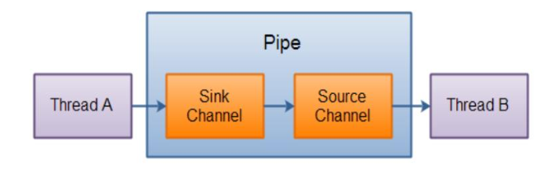

```java
public class TestPipe {

	@Test
	public void test1() throws IOException{
		//1. 获取管道
		Pipe pipe = Pipe.open();
		
		//2. 将缓冲区中的数据写入管道
		ByteBuffer buf = ByteBuffer.allocate(1024);
		
		Pipe.SinkChannel sinkChannel = pipe.sink();
		buf.put("通过单向管道发送数据".getBytes());
		buf.flip();
		sinkChannel.write(buf);
		
		//3. 读取缓冲区中的数据
		Pipe.SourceChannel sourceChannel = pipe.source();
		buf.flip();
		int len = sourceChannel.read(buf);
		System.out.println(new String(buf.array(), 0, len));
		
		sourceChannel.close();
		sinkChannel.close();
	}
	
}
```

