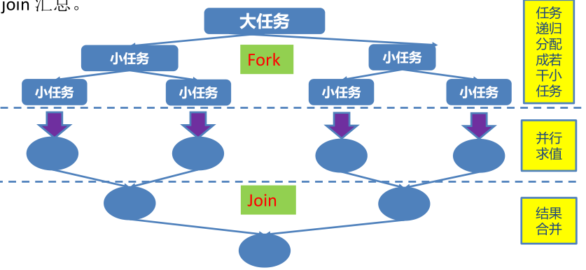

### 0.线程的五种状态回顾

```java
1.新建状态（new）:线程对象被创建后，就进入了新建状态。例如，Thread thread = new Thread();
2.就绪状态（Runnable）：也被称为“可执行状态”。线程对象被创建后，其他线程（如main）调用了该对对象的start()方法，从而来启动该线程。例如：thread.start();处于就绪状态的线程随时可能被CPU调度执行。
3.运行状态（running）：线程获取CPU权限进行执行。需要注意的是，线程只能由就绪状态进入到运行状态。
4.阻塞状态（blocked）：阻塞状态是线程因为某种原因放弃CPU使用权，暂时停止工作。直到线程进入就绪状态，才有机会转到运行状态。阻塞状态分三种：
	1）等待阻塞：通过调用o.wait()方法，让线程等待某工作完成。 wait()会释放锁；
	2）同步阻塞：线程在获取synchronized同步锁失败（因为锁被其他线程占用），它会进入同步阻塞状态。
	3）其他阻塞：通过调用线程的sleep()或join()或发出I/O请求，线程会进入阻塞状态。当sleep()状态超时、join()等待线程终止或者超时、或者I/O处理完毕，线程重新转入就绪状态。
5.死亡状态(Dead):线程执行完了或者因异常退出run()方法，该线程结束生命周期。

//注意：wait()是Object基类中的方法，但是会影响线程，线程被wait()后，释放锁，进入等锁池，直到被唤醒notify()后才会重新竞争锁，竞争到锁后进入就绪状态，等CPU分配执行权限时，从wait()后代码继续执行。
```


### 1.java JUC简介

```java
	在java5.0提供了java.util.concurrent(简称JUC包)，在此包中增加了在并发编程中很常用的使用工具类，用于定义类似于线程自定义子系统，包括线程池、异步IO和轻量级任务框架。提供可调的、灵活的线程池。还提供了设计用于多线程上下文中的Collection实现等。
```

### 2.volatile关键字-内存可见性

#### 2.1内存可见性

```java
1.内存可见性：当某个线程正在使用对象状态而另一个线程在同时修改该状态，需要确保当一个线程修改了对象状态后，其他线程能够看到发生的状态变化。
2.可见性错误是指当读操作与写操作在不同的线程中执行时，我们无法确保执行读操作的线程能实时的看到其他线程写入的值，有时甚至根本不可能的事。
3.我们可以通过同步来保证对象被安全的发布。除此之外我们也可以使用一种更加轻量级的volatile变量。
```

#### 2.2volatile关键字

```java
	java提供了一种稍弱的同步机制，即volatile变量，用来确保将变量的更新操作通知到其他线程。可以将volatile看作一个轻量级的锁。但是又与锁有些不同：
	1）对于多线程不是一种互斥关系，而sychronize锁对于线程是互斥关系；
	2）不能保证变量状态的“原子性”操作；
```

```java
/*
 * 一、volatile 关键字：当多个线程进行操作共享数据时，可以保证内存中的数据可见。
 *                   相较于 synchronized 是一种较为轻量级的同步策略。
 * 
 * 注意：
 * 1. volatile 不具备“互斥性”
 * 2. volatile 不能保证变量的“原子性”
 */
public class TestVolatile {
   
   public static void main(String[] args) {
      ThreadDemo td = new ThreadDemo();
      new Thread(td).start();
      
      while(true){
         if(td.isFlag()){
            System.out.println("------------------");
            break;
         }
      }
      
   }

}

class ThreadDemo implements Runnable {

   private volatile boolean flag = false;

   @Override
   public void run() {
      
      try {
         Thread.sleep(200);
      } catch (InterruptedException e) {
      }

      flag = true;
      
      System.out.println("flag=" + isFlag());

   }

   public boolean isFlag() {
      return flag;
   }

   public void setFlag(boolean flag) {
      this.flag = flag;
   }

}

//说明：1.对于flag是共享变量，共有两个线程操作它，thread线程进行写操作，main线程进行读操作；
//		2.flag是在主存中，而每个线程操作时会将共享变量首先放入自己线程的内存中取进行操作，操作完成后再放回到主存中，因此造成内存不可见，如果没有volatile关键字的话，main线程操作的flag变量一直都是false；
//		3.volatile关键字保证每次变量更改时通知到其他线程进行及时更新，因此解决了内存可见性。
```

### 3.原子变量-CAS算法

#### 3.1CAS算法

```java
1. CAS (Compare-And-Swap) 是一种硬件对并发的支持，针对多处理器操作而设计的处理器中的一种特殊指令，用于管理对共享数据的并发访问；
2.CAS 是一种无锁的非阻塞算法的实现。
3.CAS包含了3个操作数：
	1）需要读写的内存值；
	2）进行比较的值A；//设置新值时读取的内存值，看是否被更改了
	3）拟写入的新值B；
4.当且仅当V值等于A值时，CAS通过原子方式用新值B来更新V的值，否则不会执行任何操作。
```

模拟CAS（CompareAndSwap）算法代码：

```java
/*
 * 模拟 CAS 算法
 */
public class TestCompareAndSwap {

	public static void main(String[] args) {
		final CompareAndSwap cas = new CompareAndSwap();
		
		for (int i = 0; i < 10; i++) {
			new Thread(new Runnable() {
				
				@Override
				public void run() {
					int expectedValue = cas.get(); //预估值，即是设置新值之前再次读取的内存值
					boolean b = cas.compareAndSet(expectedValue, (int)(Math.random() * 101));
					System.out.println(b);
				}
			}).start();
		}
		
	}
	
}

class CompareAndSwap{
	private int value;
	
	//获取内存值
	public synchronized int get(){
		return value;
	}
	
	//比较
	public synchronized int compareAndSwap(int expectedValue, int newValue){
		int oldValue = value;
		
		if(oldValue == expectedValue){
			this.value = newValue;
		}
		
		return oldValue;
	}
	
	//设置
	public synchronized boolean compareAndSet(int expectedValue, int newValue){
		return expectedValue == compareAndSwap(expectedValue, newValue);
	}
}

```


#### 3.2原子变量

```java
1.类的小工具包，支持在单个变量上解除锁的线程安全编程。事实上，此包中的类可将 volatile 值、字段和数组元素的概念扩展到那些也提供原子条件更新操作的类。
2.类 AtomicBoolean、AtomicInteger、AtomicLong 和 AtomicReference 的实例各自提供对相应类型单个变量的访问和更新。每个类也为该类型提供适当的实用工具方法。
3.AtomicIntegerArray、AtomicLongArray 和 AtomicReferenceArray 类进一步扩展了原子操作，对这些类型的数组提供了支持。这些类在为其数组元素提供 volatile 访问语义方面也引人注目，这对于普通数组来说是不受支持的。
4.核心方法：boolean compareAndSet(expectedValue, updateValue)；
5.java.util.concurrent.atomic 包下提供了一些原子操作的常用类:
 AtomicBoolean 、AtomicInteger 、AtomicLong 、 AtomicReference
 AtomicIntegerArray 、AtomicLongArray
 AtomicMarkableReference
 AtomicReferenceArray
 AtomicStampedReference
```

#### 3.3代码说明

```java
/*
 * 一、i++ 的原子性问题：i++ 的操作实际上分为三个步骤“读-改-写”
 * 		  int i = 10;
 * 		  i = i++; //10
 * 
 * 		  int temp = i;
 * 		  i = i + 1;
 * 		  i = temp;
 * 
 * 二、原子变量：在 java.util.concurrent.atomic 包下提供了一些原子变量。
 * 		1. volatile 保证内存可见性
 * 		2. CAS（Compare-And-Swap） 算法保证数据变量的原子性
 * 			CAS 算法是硬件对于并发操作的支持
 * 			CAS 包含了三个操作数：
 * 			①内存值  V
 * 			②预估值  A
 * 			③更新值  B
 * 			当且仅当 V == A 时， V = B; 否则，不会执行任何操作。
 */
public class TestAtomicDemo {
	public static void main(String[] args) {
		AtomicDemo ad = new AtomicDemo();
		
		for (int i = 0; i < 10; i++) {
			new Thread(ad).start();
		}
	}
}

class AtomicDemo implements Runnable{
	//如果两个线程前后读取了变量，第一个线程进行++操作后，写入，第二个线程还是在原来基础上++,因此写入的值都是一样的，导致原子性问题；
//	private volatile int serialNumber = 0;
	private AtomicInteger serialNumber = new AtomicInteger(0);
	@Override
	public void run() {
		try {
			Thread.sleep(200);
		} catch (InterruptedException e) {
		}
		System.out.println(getSerialNumber());
	}
	public int getSerialNumber(){
		return serialNumber.getAndIncrement();
	}
}
```

### 4.ConcurrentHashMap

```java 
1.java5.0在java.util.concurrent包中提供了多种并发容器类来改进同步容器的性能；
2.ConcurrentHashMap同步容器类是java5增加的一个线程安全的哈希表。对于多线程的操作，介于HashMap和HashTable之间。内部采用锁分段机制替代HashTable的独占锁。进而提高性能；
3.此包还提供了设计用于多线程上下文中的Collection实现：
	ConcurrentHashMap/ConcurrentSkipListMap/ConcurrentSkipListSet/CopyOnWriteArrayList和CopyOnWriteArraySet.
    *当期望许多线程访问一个给定Collection时，ConcurrentHashMap通常优于同步的HashMap, ConcurrentSkipListMap通常优于同步的TreeMap;
	*当期望的读数和遍历远远大于列表的更新数时，CopyOnWriteArrayList优于同步的ArrayList.
```

### 5.CountDownLatch(闭锁)

```java
1.CountDownLatch是一个同步辅助类，在完成一组正在其他线程中执行的操作之前，它允许一个或多个线程一直等待。
2.闭锁可以延迟一个线程的进度直到其到达终止状态，闭锁可以用来确保某些活动直到其他活动都完成才继续执行。
	应用场景：
	1）确保某个计算在其需要的所有资源都被初始化之后才继续执行；
	2）确保某个服务在其依赖的所有其他服务都已经启动之后才启动；
	3）等待直到某个操作所有参与者都准备就绪再继续执行；
```

代码说明：

```java
/**
 * 说明：1.如果不用闭锁是不能计算出所有线程运行完成时间的，因为计算运行时间的是主线程，和我们创建的50个线程是并行执行的
 *       2.闭锁CountDownLatch使用步骤：
 *          1）创建一个有初始值的CountDownLatch对象，初始值和创建的线程数相等；
 *          2）将CountDownLatch对象作为参数，传入要进行多线程执行类的构造方法中；
 *          3）每有一个线程进入后，调用countDownLatch.countDown();方法减一直至所有线程加入，则countDownLatch的值减为0
 *          4）所有线程加入后，调用CountDownLatch的await()方法，让主线程进行等待加入CountDownLatch的线程执行完后再执行主线程；
 **/
public class TestCountDownLatch {
    public static void main(String[] args) {
        //1）创建一个有初始值的CountDownLatch对象，初始值和创建的线程数相等；
        CountDownLatch la = new CountDownLatch(50);
        //2）将CountDownLatch对象作为参数，传入要进行多线程执行类的构造方法中；
        CountDownDemo countDownDemo = new CountDownDemo(la);

        long start = System.currentTimeMillis();

        for(int i = 0; i < 50; i++){
            new Thread(countDownDemo).start();
        }
        try {
            //4）所有线程加入后，调用CountDownLatch的await()方法，让主线程进行等待加入CountDownLatch的线程执行完后再执行主线程；
            la.await();
        } catch (InterruptedException e) {
            e.printStackTrace();
        }

        long end = System.currentTimeMillis();
        System.out.println("耗费的时间是" + (end - start));
    }
}

class CountDownDemo implements Runnable{
    private CountDownLatch countDownLatch;
    public CountDownDemo(CountDownLatch countDownLatch){
        this.countDownLatch = countDownLatch;
    }
    @Override
    public void run() {
        try {
            for(int i = 0; i < 5000; i++){
                if(i % 2 == 0){
                    System.out.println(i);
                }
            }
        }finally {
            //3）每有一个线程进入后，调用countDownLatch.countDown();方法减一直至所有线程加入，则countDownLatch的值减为0
            countDownLatch.countDown();
        }

    }
}
```

### 6.线程的创建方式三：实现Callable接口

```java
1.java5.0在java.util.concurrent包中提供了一个新的创建线程的方式：实现Callable接口；
2.Callable接口类似于Runnable,两者都是为那些其实例可能被另一个线程执行的类设计的。但是Runnable不会反回结果，并且无法抛出经过检查的异常。
3.Callable需要依赖FutureTask, FutureTask有闭锁的功能。

//创建步骤：
1.创建一个类实现Callable接口，重写call()方法，相当于Runnable接口中run方法，不同的是call方法有返回值；
2.创建一个实现Callable接口类的实现类td;
3.创建一个FutureTask实现类ft，将上述td作为参数传入构造方法中；
4.将FutureTask实现类作为参数传入Thread的构造方法中，创建Thread实现类；thread.start()启动线程；
5.ft.get();可以获取call()方法的返回值；
//注意：由于FutureTask类有闭锁的功能，因此，在此多线程执行完之前，主线程一值再等待；
//应用场景：如果一个类中有大量的计算，速度太慢，且主线程必须拿到计算结果才能继续进行，则可以使用实现Callable接口的线程；   如果主线程不需要依赖计算结果的，则可以直接使用实现Runnable接口的线程；
```

代码实现：

```java
/*
 * 一、创建执行线程的方式三：实现 Callable 接口。 相较于实现 Runnable 接口的方式，方法可以有返回值，并且可以抛出异常。
 * 
 * 二、执行 Callable 方式，需要 FutureTask 实现类的支持，用于接收运算结果。  FutureTask 是  Future 接口的实现类
 */
public class TestCallable {
	
	public static void main(String[] args) {
		ThreadDemo td = new ThreadDemo();
		
		//1.执行 Callable 方式，需要 FutureTask 实现类的支持，用于接收运算结果。
		FutureTask<Integer> result = new FutureTask<>(td);
		
		new Thread(result).start();
		
		//2.接收线程运算后的结果
		try {
			Integer sum = result.get();  //FutureTask 可用于 闭锁
			System.out.println(sum);
			System.out.println("------------------------------------");
		} catch (InterruptedException | ExecutionException e) {
			e.printStackTrace();
		}
	}

}

class ThreadDemo implements Callable<Integer>{
	@Override
	public Integer call() throws Exception {
		int sum = 0;
		for (int i = 0; i <= 100000; i++) {
			sum += i;
		}
		return sum;
	}	
}
```

### 7.显示锁lock

```java
1.在java1.5之前，协调共享对象的访问时可以使用的机制只有synchronized和volatile。java5.0后增加了一些新的机制，但并不是替代内置锁的一种方法，而是当内置锁不适用时，作为一种可选择的高级功能。
2.ReentrantLock实现了Lock接口，并提供了与synchronized相同的互斥和内存可见性。当相较于synchronized提供了更高的处理锁的灵活性；
```

代码：

```java
/**
 * 说明：用于解决多线程安全问题的方式：
 * synchronized:隐式锁
 * 1同步代码块
 * 2同步方法
 *
 * jdk1.5以后：
 * 3同步锁lock
 * 注意：lock是一个显示锁，需要通过lock()方法上锁，必须通过unlock()方法进行释放锁
 **/
public class LockTest {
    public static void main(String[] args) {
        ThreaDemo td = new ThreaDemo();
        new Thread(td, "1号窗口").start();
        new Thread(td, "2号窗口").start();
        new Thread(td, "3号窗口").start();
    }
}

class ThreaDemo implements Runnable{
    int ticket = 100;
    Lock lock = new ReentrantLock(); //1.获取锁
    @Override
    public void run() {
        lock.lock(); //2.上锁
        try{
            while(ticket > 0){
                try {
                    Thread.sleep(200);
                } catch (InterruptedException e) {
                    e.printStackTrace();
                }
                System.out.println(Thread.currentThread().getName() + "完成售票，余票为" + --ticket);
            }
        }finally {
            lock.unlock(); //3.释放锁，注意释放锁的操作一定要放在finally块中，不然中间出现异常将释放不掉
        }

    }
}

```

### 8.虚假唤醒问题

```java
0.前言：使用Object.wait(),notifyAll()等方法需要在对象锁内使用，这样才可以让当前进入锁内的线程等待并释放锁；
1.虚假唤醒：以生产者和消费者为例，如果有两个消费者线程先后进入消费方法，判断product数量为0，则wait()；有一个生产者线程，生产了一个product则对消费者线程进行唤醒，这时两个消费者线程都从wait()醒来继续往下执行，其中一个进行了消费，product又变为0，而另一个再消费时并没有商品可以消费，因此发生了虚假唤醒。 
	虚假唤醒解决办法:将wait();用while(<condition>)包括，每次醒来后不是直接进行消费，而是先判断，满足product>0再消费；
	详见如下代码：


/**
 * 使用this.wait()/this.notifyAll()等需要注意：当前线程要锁定该对象之后，才能用锁定的对象执行这些方法
 **/
public class TestProductorAndConsumer {
    public static void main(String[] args) {
        Clerk clerk = new Clerk();
        Productor productor = new Productor(clerk);
        Consumer consumer = new Consumer(clerk);
        new Thread(productor, "生产者1").start();
        new Thread(consumer, "消费者1").start();
        new Thread(productor, "生产者2").start();
        new Thread(consumer, "消费者2").start();
    }
}

//店员
class Clerk{
    private int product = 0;

    //进货
    public synchronized void get(){
        while(product >= 1){
            System.out.println("货物已满");
            try {
                this.wait();
            } catch (InterruptedException e) {
            }
        }
        System.out.println(Thread.currentThread().getName() + ":" + ++product);
        this.notifyAll();

    }

    //卖货
    public synchronized void sail(){
        while(product <= 0){ //此处如果用if进行判断，则可有能多个线程在wait()然后同时唤醒，产生虚假唤醒
            System.out.println("缺货");
            try {
                this.wait();
            } catch (InterruptedException e) {
            }
        }
        System.out.println(Thread.currentThread().getName() + ":" + --product);
        this.notifyAll();

    }
}

//生产者
class Productor implements Runnable{
    private Clerk clerk;
    public Productor(Clerk clerk){
        this.clerk = clerk;
    }
    @Override
    public void run() {
        for(int i = 0; i < 20; i++){
            try {
                Thread.sleep(200);
            } catch (InterruptedException e) {
            }
            clerk.get();
        }
    }
}

//消费者
class Consumer implements Runnable{
    private Clerk clerk;
    public Consumer(Clerk clerk){
        this.clerk = clerk;
    }
    @Override
    public void run() {
        for(int i = 0; i < 20; i++){
            clerk.sail();
        }
    }
}

```

### 9.Condition线程通信

```java
1.Condition接口描述了可能会与锁有关联的条件变量。这些变量在用法上与使用object.wait()访问隐式监视器类似，但提供了更强大的功能。需要特别指出的是，单个Lock可能与多个Condition对象关联。为了避免兼容性问题，Condition方法的名称与对应的Object版本中不同。
2.在Condition对象中，与wait、notify和notifyAll方法对应的是await、sinal和sinalAll.
3.Condition实例实际是被绑定到一个锁上。要为特定Lock实例获得Condition实例，请使用lock.newCondition()方法；
参考如下代码：
```

#### 9.1Condition基本使用

代码示例：

```java
public class ConditionTest {
    public static void main(String[] args) {
        Clerk2 clerk2 = new Clerk2();
        Productor2 productor2 = new Productor2(clerk2);
        Consumer2 consumer2 = new Consumer2(clerk2);
        new Thread(productor2, "生产者1").start();
        new Thread(productor2, "生产者2").start();
        new Thread(consumer2, "消费者1").start();
        new Thread(consumer2, "消费者2").start();
    }
}


//店员
class Clerk2{
    private int product = 0;
    private Lock lock = new ReentrantLock(); //1.获得Lock锁
    private Condition condition = lock.newCondition(); //2.获取Condition对象
    //进货
    public void get(){
        lock.lock(); //3.上锁
        try{
            while (product >= 1){
                System.out.println("货物已满");
                try {
                    condition.await(); //5.等待，等同于object.wait()
                } catch (InterruptedException e) {
                }
            }
            System.out.println(Thread.currentThread().getName() + ":" + ++product);
            condition.signalAll(); // 6.唤醒。等同于object.notifyAll()
        }finally {
            lock.unlock(); //4.释放锁，必须放在finally代码块中
        }

    }

    //卖货
    public void sail(){
        lock.lock();
        try{
            while (product <= 0){
                System.out.println("缺货");
                try {
                    condition.await();
                } catch (InterruptedException e) {
                }
            }
            System.out.println(Thread.currentThread().getName() + ":" + --product);
            condition.signalAll();
        }finally {
            lock.unlock();
        }


    }
}

//生产者
class Productor2 implements Runnable{
    private Clerk2 clerk2;
    public Productor2(Clerk2 clerk2){
        this.clerk2 = clerk2;
    }
    @Override
    public void run() {
        for(int i = 0; i < 20; i++){
            try {
                Thread.sleep(200);
            } catch (InterruptedException e) {
            }
            clerk2.get();
        }
    }
}

//消费者
class Consumer2 implements Runnable{
    private Clerk2 clerk2;
    public Consumer2(Clerk2 clerk2){
        this.clerk2 = clerk2;
    }
    @Override
    public void run() {
        for(int i = 0; i < 20; i++){
            clerk2.sail();
        }
    }
}


```

#### 9.2Condition唤醒指定线程

```java
1.一个lock可以关联多个condition；
2.如果一个线程执行condition.await(),被等待后，可以通过condition.signal()唤醒；相同的如果一个线程被condition1.await(),则在其他线程内使用condition1.signal()唤醒被condition1等待的线程，即唤醒指定线程；
3.如果多个线程等待在condition2.await(),则在其他线程中使用condition2.signal(),会唤醒其中一个线程；
	//说明：由于await()会释放锁，因此其他线程可能会进入同步代码块中。
```

代码：（面试题）

```java
/**
 * 面试题：线程按序交替
 *      编写一个程序，开启3个线程，这三个线程的ID分别是A/B/C，每个线程将自己的ID在屏幕上打印10遍，要求输出的结果必须按顺序显示。
 **/
public class LoopPrintThread {
    public static void main(String[] args) {
        Print print = new Print();
        new Thread(new Runnable() {
            @Override
            public void run() {
                for(int i = 1; i <= 10; i++){
                    print.printA(i);
                }
            }
        }, "A").start();
        new Thread(new Runnable() {
            @Override
            public void run() {
                for(int i = 1; i <= 10; i++){
                    print.printB(i);
                }
            }
        }, "B").start();

        new Thread(new Runnable() {
            @Override
            public void run() {
                for(int i = 1; i <= 10; i++){
                    print.printC(i);
                }
            }
        }, "C").start();

    }
}

/**
 * 打印类，三个线程分别执行三个方法
 */
class Print{
    private int num = 1;
    private Lock lock = new ReentrantLock();
    private Condition condition1 = lock.newCondition();
    private Condition condition2 = lock.newCondition();
    private Condition condition3 = lock.newCondition();

    public void printA(int nowCount){
        lock.lock();
        try{
            if(num != 1){ //只有一个线程执行此方法用if可以，如果有多个线程执行就必须用while，不然会虚假唤醒
                try {
                    condition1.await();
                } catch (InterruptedException e) {
                }
            }
            System.out.println(Thread.currentThread().getName() + "\t" + "第" + nowCount + "轮循环");
            num = 2;
            condition2.signal();
        }finally {
            lock.unlock();
        }

    }

    public void printB(int nowCount){
        lock.lock();
        try{
            if(num != 2){
                try {
                    condition2.await();
                } catch (InterruptedException e) {
                }
            }
            System.out.println(Thread.currentThread().getName() + "\t" + "第" + nowCount + "轮循环");
            num = 3;
            condition3.signal();
        }finally {
            lock.unlock();
        }

    }

    public void printC(int nowCount){
        lock.lock();
        try{
            if(num != 3){
                try {
                    condition3.await();
                } catch (InterruptedException e) {
                }
            }
            System.out.println(Thread.currentThread().getName() + "\t" + "第" + nowCount + "轮循环");
            num = 1;
            condition1.signal();
        }finally {
            lock.unlock();
        }

    }
}
```

### 10.读-写锁ReadWriteLock

```java 
1.ReadWriteLock维护了一对相关的锁，一个用于只读操作，另一个用于写入操作。只要没有write，读取锁可以由多个Read线程同时,写入锁是独占的。换言之，读读是不互斥的，读写/写写 是互斥的。
//疑问：既然多个线程可以同时持有读取锁，那么还有必要上锁吗？
//答：由于读写线程是互斥的，如果没有写线程的话，单独读是不需要加锁的。但是当写线程执行的时候，读线程是要等待的，不然会发生数据还没有被写好，但是读的确实写之前的数据，就会产生数据安全问题。  因此读锁的存在意义就是与写锁形成互斥。当然这个功能由ReadWriteLock来实现。
2.ReadWriteLock读取操作通常不会改变共享资源，但执行写入操作时，必须独占方式来获取锁。对于读取操作占多数的数据结构。ReadWriteLock能提供比独占锁更高的并发性。而对于只读的数据结构，其中包含的不变性完全可以不需要考虑加锁操作。
```

代码：

```java
/*
 * 1. ReadWriteLock : 读写锁
 * 
 * 写写/读写 需要“互斥”
 * 读读 不需要互斥
 * 
 */
public class TestReadWriteLock {

	public static void main(String[] args) {
		ReadWriteLockDemo rw = new ReadWriteLockDemo();
		
		new Thread(new Runnable() {
			
			@Override
			public void run() {
				rw.set((int)(Math.random() * 101));
			}
		}, "Write:").start();
		
		
		for (int i = 0; i < 100; i++) {
			new Thread(new Runnable() {
				
				@Override
				public void run() {
					rw.get();
				}
			}).start();
		}
	}
	
}

class ReadWriteLockDemo{
	
	private int number = 0;
	
	private ReadWriteLock lock = new ReentrantReadWriteLock();
	
	//读
	public void get(){
		lock.readLock().lock(); //上锁
		
		try{
			System.out.println(Thread.currentThread().getName() + " : " + number);
		}finally{
			lock.readLock().unlock(); //释放锁
		}
	}
	
	//写
	public void set(int number){
		lock.writeLock().lock();
		
		try{
			System.out.println(Thread.currentThread().getName());
			this.number = number;
		}finally{
			lock.writeLock().unlock();
		}
	}
}
```

### 11.线程八锁

```java

/*
 * 1. 两个普通同步方法，两个线程，标准打印， 打印? //one  two
 * 2. 新增 Thread.sleep() 给 getOne() ,打印? //one  two
 * 3. 新增普通方法 getThree() , 打印? //three  one   two
 * 4. 两个普通同步方法，两个 Number 对象，打印?  //two  one
 * 5. 修改 getOne() 为静态同步方法，打印?  //two   one
 * 6. 修改两个方法均为静态同步方法，一个 Number 对象?  //one   two
 * 7. 一个静态同步方法，一个非静态同步方法，两个 Number 对象?  //two  one
 * 8. 两个静态同步方法，两个 Number 对象?   //one  two
 * 
 * 线程八锁的关键：
 * ①非静态方法的锁默认为  this,  静态方法的锁为 对应的 Class 实例
 * ②某一个时刻内，只能有一个线程持有锁，无论几个方法。
 */
public class TestThread8Monitor {
	
	public static void main(String[] args) {
		Number number = new Number();
		Number number2 = new Number();
		
		new Thread(new Runnable() {
			@Override
			public void run() {
				number.getOne();
			} 
		}).start();
		
		new Thread(new Runnable() {
			@Override
			public void run() {
//				number.getTwo();
				number2.getTwo();
			}
		}).start();
		
		/*new Thread(new Runnable() {
			@Override
			public void run() {
				number.getThree();
			}
		}).start();*/
		
	}

}

class Number{
	
	public static synchronized void getOne(){//Number.class
		try {
			Thread.sleep(3000);
		} catch (InterruptedException e) {
		}
		
		System.out.println("one");
	}
	
	public synchronized void getTwo(){//this
		System.out.println("two");
	}
	
	public void getThree(){
		System.out.println("three");
	}
	
}
```

### 12.线程池

```java
1.第四种获取线程的方法：线程池。一个ExecutorService,它使用可能的几个池线程之一执行每个提交的任务，通常使用Executor工厂方法配置；
2.线程池可以解决两个不同问题：用于减少了每个任务调用的开销，他们通常可以在执行大量异步任务时提供增强的性能，并且还可以提供绑定和管理资源（包括执行任务集时使用的线程）的方法。每个ThreadPoolExecutor还维护着一些基本的统计数据，如完成的任务数；
3.为了便于跨大量上下文使用，此类提供了很多可调整参数和扩展钩子（hook），但是强烈建议程序员使用较为方便的Executor工厂方法：
	1）Executors.newCachedThreadPool()（无界线程池，可以进行自动回收线程）
	2）Executors.newFixedThreadPool()(固定大小线程池)
    3）Executors.newSingleThreadExecutor()(单个后台线程)
    他们均为大多数使用场景预定义了设置；
```

代码：

```java
/*
 * 一、线程池：提供了一个线程队列，队列中保存着所有等待状态的线程。避免了创建与销毁额外开销，提高了响应的速度。
 * 
 * 二、线程池的体系结构：
 * 	java.util.concurrent.Executor : 负责线程的使用与调度的根接口
 * 		|--**ExecutorService 子接口: 线程池的主要接口
 * 			|--ThreadPoolExecutor 线程池的实现类
 * 			|--ScheduledExecutorService 子接口：负责线程的调度
 * 				|--ScheduledThreadPoolExecutor ：继承 ThreadPoolExecutor， 实现 ScheduledExecutorService
 * 
 * 三、工具类 : Executors 
 * ExecutorService newFixedThreadPool() : 创建固定大小的线程池
 * ExecutorService newCachedThreadPool() : 缓存线程池，线程池的数量不固定，可以根据需求自动的更改数量。
 * ExecutorService newSingleThreadExecutor() : 创建单个线程池。线程池中只有一个线程
 * 
 * ScheduledExecutorService newScheduledThreadPool() : 创建固定大小的线程，可以延迟或定时的执行任务。
 */
public class TestThreadPool {
	public static void main(String[] args) throws Exception {
		//1. 创建线程池
		ExecutorService pool = Executors.newFixedThreadPool(5);
		List<Future<Integer>> list = new ArrayList<>();	
		for (int i = 0; i < 10; i++) {
			Future<Integer> future = pool.submit(new Callable<Integer>(){
				@Override
				public Integer call() throws Exception {
					int sum = 0;	
					for (int i = 0; i <= 100; i++) {
						sum += i;
					}
					return sum;
				}
			});
			list.add(future);
		}
		pool.shutdown();
		for (Future<Integer> future : list) {
			System.out.println(future.get());
		}
		
		/*ThreadPoolDemo tpd = new ThreadPoolDemo();
		
		//2. 为线程池中的线程分配任务
		for (int i = 0; i < 10; i++) {
			pool.submit(tpd);
		}
		
		//3. 关闭线程池
		pool.shutdown();*/
	}
	
//	new Thread(tpd).start();
//	new Thread(tpd).start();

}

class ThreadPoolDemo implements Runnable{
	private int i = 0;
	@Override
	public void run() {
		while(i <= 100){
			System.out.println(Thread.currentThread().getName() + " : " + i++);
		}
	}
}
```

### 13.ScheduledExecutorService

```java
1.一个ExecutorService,可安排在给定的延迟后运行或定期执行的命令；
步骤：
	1）创建调度线程池：ScheduledExecutorService pool = Executors.newScheduledThreadPool(5);
	2)提交线程任务：pool.schedule(Callable<V> callable, long delay, TimeUnit unit);
	3)关闭线程：pool.shutdown();

//代码：
public class TestScheduledThreadPool {
    public static void main(String[] args) throws ExecutionException, InterruptedException {
        //1.创建一个任务调度线程池，可以延迟指定时间后执行
        ScheduledExecutorService pool = Executors.newScheduledThreadPool(5);
        //2.调度线程池提价线程使用schedule(),而不是submit()
        for(int i = 0; i < 5; i++) {
            ScheduledFuture<Integer> result = pool.schedule(new Callable<Integer>() {
                @Override
                public Integer call() throws Exception {
                    int num = new Random().nextInt(100); //产生一个随机数
                    System.out.println(Thread.currentThread().getName() + ":" + num);
                    return num;
                }
            }, 3, TimeUnit.SECONDS);
            System.out.println(result.get());
        }
        pool.shutdown();
        //说明：这段话会在线程任务执行完后再执行，是因为实现Callable接口的线程具有闭锁功能
        System.out.println("测试");
    }
}

```

### 14.ForkJoinPool分支/合并框架 工作窃取

```java
1.Fork/Join框架：就是在必要的时候，将一个大任务进行拆分（fork）成若干个小任务（拆到不可再拆时），再将一个个的小任务运算的结果进行join汇总。
2.fork/Join框架与线程池的区别：
	1）采用“工作窃取”模式（work-stealing）:
	当执行新的任务时它可以将其拆分成更小的任务执行，并将小任务加到线程队列中，然后再从一个随机的线程队列中偷一个并把它放到自己的队列中。
	2）相对于一般的线程池实现，fork/join 框架的优势体现在对其中包含的任务处理方式上。在一般的线程池中，如果一个线程正在执行的任务由于某些原因无法继续运行，那么该线程会处于等待状态。而在fork/join框架实现中，如果某个子问题由于等待另外一个子问题的完成而无法继续运行。那么处理该子问题的线程会主动寻找其他尚未运行的子问题来执行。这种方式减少了线程的等待时间，提高了性能。
```

图示：



代码实例：

```java
//计算1-1亿之间数的总和
public class TestForkJoinPool {
	
	public static void main(String[] args) {
		Instant start = Instant.now();
		
		ForkJoinPool pool = new ForkJoinPool();
		
		ForkJoinTask<Long> task = new ForkJoinSumCalculate(0L, 50000000000L);
		
		Long sum = pool.invoke(task);
		
		System.out.println(sum);
		
		Instant end = Instant.now();
		
		System.out.println("耗费时间为：" + Duration.between(start, end).toMillis());//166-1996-10590
	}
	
	
	//java8 新特性
	@Test
	public void test2(){
		Instant start = Instant.now();
		
		Long sum = LongStream.rangeClosed(0L, 50000000000L)
							 .parallel()
							 .reduce(0L, Long::sum);
		
		System.out.println(sum);
		
		Instant end = Instant.now();
		
		System.out.println("耗费时间为：" + Duration.between(start, end).toMillis());//1536-8118
	}

}

class ForkJoinSumCalculate extends RecursiveTask<Long>{

	/**
	 * 
	 */
	private static final long serialVersionUID = -259195479995561737L;
	
	private long start;
	private long end;
	
	private static final long THURSHOLD = 10000L;  //临界值
	
	public ForkJoinSumCalculate(long start, long end) {
		this.start = start;
		this.end = end;
	}

	@Override
	protected Long compute() {
		long length = end - start;
		
		if(length <= THURSHOLD){
			long sum = 0L;
			
			for (long i = start; i <= end; i++) {
				sum += i;
			}
			
			return sum;
		}else{
			long middle = (start + end) / 2;
			
			ForkJoinSumCalculate left = new ForkJoinSumCalculate(start, middle); 
			left.fork(); //进行拆分，同时压入线程队列
			
			ForkJoinSumCalculate right = new ForkJoinSumCalculate(middle+1, end);
			right.fork(); //
			
			return left.join() + right.join();
		}
	}
	
}

```

