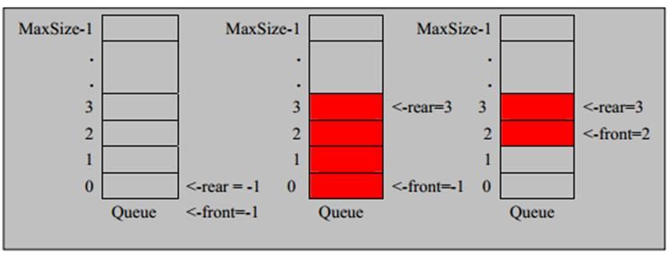
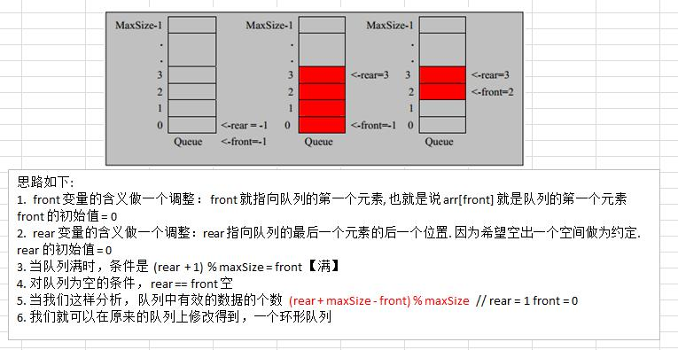
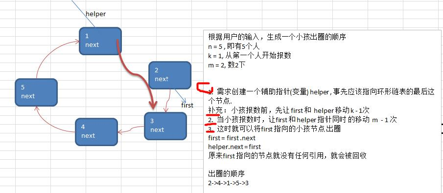

### 1.数据结构和算法概述

#### 1.1数据结构和算法的关系

```java
1.程序 = 数据结构 + 算法
2.数据结构是算法的基础，想要学好算法，必须要把数据结构学到位。
3.数据结构主要分为 线性结构 和 非线性结构。
```

#### 1.2线性结构和非线性结构

```java
1.线性结构
	1）线性结构是最常用的数据结构，特点是数据元素之间存在一对一的线性关系。
	2）线性结构的两种不同存储结构，即顺序存储结构(数组)和链式存储结构（链表）。顺序存储结构中存储元素是连续的，链表中的存储元素不一定是连续的（元素节点中存放数据元素以及相邻元素的地址信息）
	3）线性结构常见的有：数组、队列、链表和栈。

2.非线性结构
	非线性结构包括：二维数组、多维数组、广义表、数据结构、图结构。
```

### 2.稀疏数组和队列

#### 2.1稀疏数组sparsearray

##### 2.1.1需求

* 编写的五子棋程序中，有存盘退出和续上盘的功能。


* 分析问题： 因为该二维数组的很多值是默认值0，因此记录了很多没有意义的数据->稀疏数组

##### 2.1.2稀疏数组的处理方法

1）记录数组一共几行几列，有多少个不同的值

2）把具有不同值的元素的行列及值记录在一个小规模的数组中，从而缩小程序规模。


##### 2.1.3应用实例

1）使用稀疏数组来保留类似前面的二维数组；

2）把稀疏数组存盘，并且可以重新恢复为原来的二维数组；

3）思路分析，如下


4）代码实现

```java
public class ParsearrayDemo {
    public static void main(String[] args) {
        //1.初始化二位数组
        int[][] chess = new int[11][11];
        chess[1][2] = 1;
        chess[2][3] = 2;
        //打印二维数组
        System.out.println("打印二位数组");
        for (int i = 0; i<11; i++){
            for (int j = 0; j<11; j++){
                System.out.printf("%d\t", chess[i][j]);
            }
            System.out.println();
        }
        //2.二维数组转稀疏数组
        int sum = 0; //记录二位数组总共有多少个不同的值
        for (int i = 0; i<11; i++){
            for (int j = 0; j<11; j++){
                if(chess[i][j] != 0){
                    sum++;
                }
            }
        }
        int[][] parsearray = new int[sum + 1][3];
        parsearray[0][0] = 11;
        parsearray[0][1] = 11;
        parsearray[0][2] = sum;
        int n = 0;
        for (int i = 0;i<11;i++){
            for (int j = 0;j<11;j++){
                if(chess[i][j]!=0){
                    n++;
                    parsearray[n][0] = i;
                    parsearray[n][1] = j;
                    parsearray[n][2] = chess[i][j];
                }
            }
        }
        //打印稀疏数组
        System.out.println("打印稀疏数组");
        for (int i = 0; i<parsearray.length; i++){
            for (int j = 0; j<3;j++){
                System.out.printf("%d\t", parsearray[i][j]);
            }
            System.out.println();
        }

        //3.稀疏数组转二维数组
        int[][] chess2 = new int[parsearray[0][0]][parsearray[0][1]];
        for (int i = 1; i<parsearray.length; i++){
            chess2[parsearray[i][0]][parsearray[i][1]] = parsearray[i][2];
        }
        //打印还原后的二维数组
        System.out.println("打印还原后的二位数组");
        for (int[] ches : chess2){
            for (int data : ches){
                System.out.printf("%d\t", data);
            }
            System.out.println();
        }
    }
}

```

#### 2.2队列

##### 2.2.1队列介绍

```java
1.队列是一个有序列表，可以用数组或链表实现；
2.遵循先入先出的原则；
3.示意图如下（使用数组模拟队列示意图）：
```



##### 2.2.2数组模拟队列思路

```java
1.数组模拟队列，数组的初始长度即为队列的最大容量；
2.队列的输入和输出是从尾和头来处理，因此需要两个变量rear,front分别记录队列尾和头的下标；front随着数据的输出而改变，rear随着数据的输入而改变；
3.当我们存数据到队列时有两个步骤：
	1）将尾指针向后移：rear+1,当rear==front(空)
    2）若尾指针小于maxSize-1,则将数据存入rear所指的数组元素中，否则无法存入数据；rear == maxSize-1(满)；
4.注意：front指向头部数据的前一个位置，rear指向尾部数据的位置；上图第三个front应该为1
```

代码实现：

```java
public class ArrayQueueDemo {
    public static void main(String[] args) {
        //测试
        //创建一个队列
        ArrayQueen queue = new ArrayQueen(3);
        char key = ' '; //接收用户输入
        Scanner scanner = new Scanner(System.in);
        boolean loop = true;
        //输出一个菜单
        while (loop){
            System.out.println("s,显示队列");
            System.out.println("e,退出程序");
            System.out.println("a,添加数据");
            System.out.println("g,从队列取出数据");
            System.out.println("h,查看头部数据");
            key = scanner.next().charAt(0); //接收一个字符
            switch (key){
                case 's':
                    queue.showQueue();
                    break;
                case 'a':
                    try {
                        System.out.println("请输入要添加的数据");
                        int i = scanner.nextInt();
                        queue.addQueue(i);
                    }catch (Exception e){
                        System.out.println(e.getMessage());
                    }
                    break;
                case 'g':
                    try {
                        int res = queue.getQueue();
                        System.out.println("取出的数据是" + res);
                    }catch (Exception e){
                        System.out.println(e.getMessage());
                    }
                    break;
                case 'h':
                    try {
                        int n = queue.headQueue();
                        System.out.println("头数据是"+n);
                    }catch (Exception e){
                        System.out.println(e.getMessage());
                    }
                    break;
                case 'e':
                    scanner.close();
                    loop = false;
                    break;
                    default:
                        break;
            }
        }
        System.out.println("程序退出~");
    }
}

//使用数组模拟队列-编写一个ArrayQueue类
class ArrayQueen{
    private int maxSize; //数组最大容量
    private int front; //队列头
    private int rear; //队列尾
    private int[] arr; //该数组用于存放数据，模拟队列

    //创建队列的构造器
    public ArrayQueen(int arryMaxSize){
        maxSize = arryMaxSize;
        arr = new int[maxSize];
        front = -1; //指向队列的头部前一个位置
        rear = -1; //指向队列尾的数据
    }

    //判断队列是否已满
    public boolean isFull(){
        return rear == maxSize - 1;
    }

    //判断判断队列是否为空
    public boolean isEmpty(){
        return rear == front;
    }

    //添加数据到队列
    public void addQueue(int a){
        if(isFull()){
            throw new RuntimeException("队列已满，不能添加数据");
        }
        rear ++;
        arr[rear] = a;
    }

    //获取队列数据，出队列
    public int getQueue(){
        if(isEmpty()){
            throw new RuntimeException("队列已空，不能取数据");
        }
        front ++;
        return arr[front];
    }

    //显示队列所有数据
    public void showQueue(){
        if(isEmpty()){
            System.out.println("队列是空的，没有数据~");
            return;
        }
        for (int i = 0; i<arr.length; i++){
            System.out.printf("arr[%d]=%d\n", i, arr[i]);
        }
    }

    //显示队列的头部,注意不是出队列
    public int headQueue(){
        if(isEmpty()){
            throw new RuntimeException("队列是空的，没有头部数据");
        }
        return arr[front+1];
    }
}
```

问题分析及优化：

​	1）目前的数组使用一次就不能用了，没有达到复用的效果；

​	2）将这个队列使用算法，改造成一个环形队列   取模 %

##### 2.2.3数组模拟环形队列

对前面的数组模拟队列优化，充分利用数组，因此将数组看作是一个环形的。（通过取模的方式实现即可）。

分析说明：



代码实现：

```java
public class CircleQueueDemo {
    public static void main(String[] args) {
        //测试
        //创建一个队列
        CircleArrayQueue queue = new CircleArrayQueue(4);
        char key = ' '; //接收用户输入
        Scanner scanner = new Scanner(System.in);
        boolean loop = true;
        //输出一个菜单
        while (loop){
            System.out.println("s,显示队列");
            System.out.println("e,退出程序");
            System.out.println("a,添加数据");
            System.out.println("g,从队列取出数据");
            System.out.println("h,查看头部数据");
            key = scanner.next().charAt(0); //接收一个字符
            switch (key){
                case 's':
                    queue.showQueue();
                    break;
                case 'a':
                    try {
                        System.out.println("请输入要添加的数据");
                        int i = scanner.nextInt();
                        queue.addQueue(i);
                    }catch (Exception e){
                        System.out.println(e.getMessage());
                    }
                    break;
                case 'g':
                    try {
                        int res = queue.getQueue();
                        System.out.println("取出的数据是" + res);
                    }catch (Exception e){
                        System.out.println(e.getMessage());
                    }
                    break;
                case 'h':
                    try {
                        int n = queue.headQueue();
                        System.out.println("头数据是"+n);
                    }catch (Exception e){
                        System.out.println(e.getMessage());
                    }
                    break;
                case 'e':
                    scanner.close();
                    loop = false;
                    break;
                default:
                    break;
            }
        }
        System.out.println("程序退出~");
    }
}

//用数组创建一个环形队列
class CircleArrayQueue{
    private int maxSize;
    private int front;
    private int rear;
    private int[] arr;

    public CircleArrayQueue(int arrMaxSize){
        maxSize = arrMaxSize;
        arr = new int[maxSize];
    }

    //判断队列是否已满
    public boolean isFull(){
        return (rear + 1) % maxSize == front;
    }
    //判断队列是否已空
    public boolean isEmpty(){
        return rear == front;
    }
    //添加数据到队列
    public void addQueue(int a){
        if(isFull()){
            System.out.println("队列已满，不能添加数据~");
            return;
        }
        arr[rear] = a;
        rear = (rear + 1) % maxSize;
    }
    //获取队列数据
    public int getQueue(){
        if(isEmpty()){
            throw new RuntimeException("队列已空，不能取数据~");
        }
        int value = arr[front];
        front = (front + 1) % maxSize;
        return value;
    }
    //显示队列所有数据
    public void showQueue(){
        if(isEmpty()){
            System.out.println("队列时空的，没法显示数据~");
            return;
        }
        for(int i = front; i < front + size(); i++){
            System.out.printf("arr[%d]=%d\n", i%maxSize, arr[i%maxSize]);
        }
    }
    //显示队列的头，注意不是取数据
    public int headQueue(){
        if(isEmpty()){
            throw new RuntimeException("队列时空的，没有头数据~");
        }
        return arr[front];
    }


    //当前队列有多少有效数据
    public int size(){
        return (rear + maxSize - front) % maxSize;
    }
}

```

### 3.链表

#### 3.1链表（Linked List）介绍

链表是有序的的列表，但是每个节点在内存中是不连续的


```java
1.链表是以节点方式来存储，是链式存储；
2.每个节点包含data域，next域：指向下一个节点；
3.链表的各个节点不一定是连续存储；
4.链表分为带头结点的链表和不带头节点的链表，根据实际需求来确定；
```

#### 3.2单链表的实例应用

```java
问题：
使用带head头的单向链表实现水浒英雄排行榜管理完成对英雄人物的增删改查操作。
1）第一种添加方式，添加英雄时直接在链表尾添加；
2）第二种添加方式，根据排名，将英雄添加到指定的位置，如果有这个排名则添加失败且给出提示信息；
3）修改节点
4）删除节点
```

代码实现：

```java
public class SingleLinkedListDemo {
    public static void main(String[] args) {
        //测试单向链表
        HeroNode heroNode = new HeroNode(1, "宋江", "及时雨");
        HeroNode heroNode1 = new HeroNode(2, "卢俊义", "玉麒麟");
        HeroNode heroNode2 = new HeroNode(3, "吴用", "智多星");
        HeroNode heroNode3 = new HeroNode(4, "公孙胜", "入云龙");

        SingleLinkedList singleLinkedList = new SingleLinkedList();
        /*singleLinkedList.addNode(heroNode);
        singleLinkedList.addNode(heroNode1);
        singleLinkedList.addNode(heroNode2);
        singleLinkedList.addNode(heroNode3);*/
        //带编号添加
        singleLinkedList.addNodeByOrder(heroNode);
        singleLinkedList.addNodeByOrder(heroNode3);
        singleLinkedList.addNodeByOrder(heroNode2);
        singleLinkedList.addNodeByOrder(heroNode1);
        singleLinkedList.addNodeByOrder(heroNode2);

        singleLinkedList.showSingleLinkedList();
        
        //测试修改
        HeroNode node = new HeroNode(2, "卢员外", "玉麒麟~~");
        singleLinkedList.update(node);
        System.out.println("修改以后的链表如下：");
        singleLinkedList.showSingleLinkedList();
        
        //测试删除节点
        singleLinkedList.delete(1);
        singleLinkedList.delete(4);
        singleLinkedList.delete(2);
        System.out.println("删除以后的链表如下：~");
        singleLinkedList.showSingleLinkedList();
    }
}

class SingleLinkedList{
    //初始化一个头结点,头节点不存储数据
    private HeroNode head = new HeroNode(0, "", "");

    //添加节点（不考虑编号）
    //1.找到当前链表的最后节点
    //2.将最后节点的next指向新的节点
    public void addNode(HeroNode heroNode){
        //因为head节点不能动，因此我们需要一个辅助遍历temp
        HeroNode temp = head;
        while (true){
            if(temp.next == null){
                break;
            }
            temp = temp.next;
        }
        temp.next = heroNode;
    }
    
    //添加节点（考虑编号，若编号存在提示添加不进去）
    public void addNodeByOrder(HeroNode heroNode){
        //遍历辅助变量
        HeroNode temp = head;
        //是否有相同的编号
        boolean flag = false;
        while(true){
            if(temp.next == null){
                break;
            }
            if(temp.next.no > heroNode.no){
                break;
            }else if(temp.next.no == heroNode.no){
                flag = true;
            }
            temp = temp.next;  //指针后移
        }

        if(flag){
            System.out.printf("编号%d已经存在，无法添加~", heroNode.no);
        }else{
            heroNode.next = temp.next;
            temp.next = heroNode;
        }
    }
    
    //修改节点
    public void update(HeroNode heroNode){
        HeroNode temp = head;
        //是否找到相同的节点供修改
        boolean flag = false;
        while (true){
            if(temp.next == null){
                break;
            }
            if(temp.next.no == heroNode.no){
                flag = true;
                break;
            }
            temp = temp.next;
        }
        if(flag){
            temp.next.name = heroNode.name;
            temp.next.nickName = heroNode.nickName;
        }else{
            System.out.printf("没有找到编号为%d的节点\n,不能修改~", heroNode.no);
        }

    }
    
    //删除节点
    public void delete(int no){
        HeroNode temp = head;
        boolean flag = false;
        while(true){
            if(temp.next == null){
                break;
            }
            if(temp.next.no == no){
                flag = true;
                break;
            }
            temp = temp.next;
        }
        if(flag){
            temp.next = temp.next.next;
        }else{
            System.out.printf("没有找到编号为%d的节点，不能删除\n", no);
        }
    }
    

    //显示链表
    public void showSingleLinkedList(){
        HeroNode temp = head;
        while(true){
            if(temp.next == null){
                break;
            }
            System.out.println(temp.next.toString());
            temp = temp.next;
        }
    }
}

//创建HeroNode,每一个HeroNode对象就是一个节点
class HeroNode{
    public int no;
    public String name;
    public String nickName;
    public HeroNode next;

    public HeroNode(int no, String name, String nickName){
        this.no = no;
        this.name = name;
        this.nickName = nickName;
    }
    @Override
    public String toString() {
        return "HeroNode{" +
                "no=" + no +
                ", name='" + name + '\'' +
                ", nickName='" + nickName + '\'' +
                '}';
    }
}

```

#### 3.3单链表面试题（新浪、百度、腾讯）

1）求单链表中有效节点个数

```java
//单链表中有效节点个数（不能统计头节点）
    public int getLength(HeroNode head){
        HeroNode cur = head.next;
        int i = 0;
        while(cur != null){
            cur = cur.next;
            i++;
        }
        return i;
    }
```

2）查找单链表中倒数第k个节点

```java
//查找单链表中倒数第k个节点
    //1.先遍历查出链表的有效节点个数length
    //2.倒数第K个就是正数第length-k个
    public static HeroNode findLastIndexNode(HeroNode head, int index){
        int length = getLength(head);
        if(index <= 0 || index > length){
            return null;
        }
        HeroNode cur = head.next; //length=3,index=1, 从第一个到第三个需要遍历两次，3-1正确
        for(int i = 0; i < length-index; i++){
            cur = cur.next;
        }
        return cur;
    }
```

3）单链表反转（腾讯面试题）

思路分析：


代码实现：

```java
//腾讯面试题：单链表的反转
    //思路：1.新建一个单链表的头节点ReverseHead  2.遍历原来的链表，每取出一个节点都放在新链表的最前面 3.将原来的链表头的下一个节点指向新链表头的第一个节点
    public static HeroNode reverseList(HeroNode head){
        if(head.next == null || head.next.next == null){
            return head;   //空链表或只有一个节点的链表直接返回
        }
        HeroNode reverseHead = new HeroNode(0, "", "");
        HeroNode cur = head.next; //辅助变量（循环指针）
        HeroNode next = null; //指向当前节点的下一个节点
        while (cur != null){
            next = cur.next; //注意：把当前节点及后面的节点保存,供后面指针后移使用
            cur.next = reverseHead.next;
            reverseHead.next = cur;
            cur = next;
        }
        head.next = reverseHead.next;
        return head;
    }
```

4）从尾到头打印链表（百度面试题，推荐用栈实现)

代码实现：

```java
 //百度面试题：从尾到头打印单链表(使用栈)
    public static void reversePrint(HeroNode head){
        if(head.next == null){
            return; //链表为空
        }
        //创建一个栈，将链表各个节点顺序压入栈中，先进后出完成倒序
        Stack<HeroNode> stack = new Stack<>();
        HeroNode cur = head.next;
        while (cur != null){
            stack.push(cur);
            cur = cur.next;
        }
        while (stack.size() > 0){
            System.out.println(stack.pop().toString());
        }
    }
```

#### 3.4双向链表应用实例


**对上图说明：**

1.*遍历：*方法和单链表一样，只是可以向前也可以向后查找；

2.*添加（默认添加到双向链表的最后）*：

​	1）先找到双向链表的最后这个节点

​	2）temp.next = newHeroNode

​	3)newHeroNode.pre = temp

3.*修改：*思路和原来单链表一样

4.*删除*

​	1）因为是双链表，因此可以实现自我删除某个节点；

​	2）直接找要删除的节点，比如temp

​	3）temp.pre.next = temp.next

​	4)temp.next.pre = temp.pre

**双向链表代码实现：**

```java
public class DoubleLinkedListDemo {
    public static void main(String[] args) {
        //测试双向链表
        System.out.println("双向链表的测试~");

        HeroNode2 heroNode = new HeroNode2(1, "宋江", "及时雨");
        HeroNode2 heroNode1 = new HeroNode2(2, "卢俊义", "玉麒麟");
        HeroNode2 heroNode2 = new HeroNode2(3, "吴用", "智多星");
        HeroNode2 heroNode3 = new HeroNode2(4, "公孙胜", "入云龙");

        //创建一个双向链表
        DoubleLinkedList doubleLinkedList = new DoubleLinkedList();
        doubleLinkedList.addNode(heroNode);
        doubleLinkedList.addNode(heroNode1);
        doubleLinkedList.addNode(heroNode2);
        doubleLinkedList.addNode(heroNode3);
        doubleLinkedList.showDoubleLinkedList();

        HeroNode2 newNode = new HeroNode2(3, "wu用", "智多星~");
        doubleLinkedList.update(newNode);
        System.out.println("测试修改~");
        doubleLinkedList.showDoubleLinkedList();

        doubleLinkedList.delete(3);
        doubleLinkedList.delete(4);
        System.out.println("测试删除~");
        doubleLinkedList.showDoubleLinkedList();
    }


}


class DoubleLinkedList{
    //初始化一个头结点,头节点不存储数据
    private HeroNode2 head = new HeroNode2(0, "", "");

    public HeroNode2 getHead() {
        return head;
    }

    //添加节点（默认添加到链表的最后）
    //1.找到当前链表的最后节点
    //2.将最后节点的next指向新的节点
    //3.将新节点的pre指向原最后一个节点
    public void addNode(HeroNode2 heroNode){
        //因为head节点不能动，因此我们需要一个辅助遍历temp
        HeroNode2 temp = head;
        while (true){
            if(temp.next == null){
                break;
            }
            temp = temp.next;
        }
        temp.next = heroNode;
        heroNode.pre = temp;
    }

    //修改节点
    public void update(HeroNode2 heroNode){
        HeroNode2 temp = head;
        //是否找到相同的节点供修改
        boolean flag = false;
        while (true){
            if(temp.next == null){
                break;
            }
            if(temp.next.no == heroNode.no){
                flag = true;
                break;
            }
            temp = temp.next;
        }
        if(flag){
            temp.next.name = heroNode.name;
            temp.next.nickName = heroNode.nickName;
        }else{
            System.out.printf("没有找到编号为%d的节点\n,不能修改~", heroNode.no);
        }

    }

    //删除节点(双链表可以实现自我删除)
    public void delete(int no){
        HeroNode2 temp = head.next;
        boolean flag = false;
        while(true){
            if(temp == null){
                break;
            }
            if(temp.no == no){
                flag = true;
                break;
            }
            temp = temp.next;
        }
        if(flag){
            if(temp.next != null){ //如果是删除最后一个节点
                temp.next.pre = temp.pre;
            }
            temp.pre.next = temp.next;
        }else{
            System.out.printf("没有找到编号为%d的节点，不能删除\n", no);
        }
    }


    //显示链表
    public void showDoubleLinkedList(){
        HeroNode2 temp = head;
        while(true){
            if(temp.next == null){
                break;
            }
            System.out.println(temp.next.toString());
            temp = temp.next;
        }
    }
}

//创建HeroNode,每一个HeroNode对象就是一个节点
class HeroNode2{
    public int no;
    public String name;
    public String nickName;
    public HeroNode2 pre;
    public HeroNode2 next;

    public HeroNode2(int no, String name, String nickName){
        this.no = no;
        this.name = name;
        this.nickName = nickName;
    }
    @Override
    public String toString() {
        return "HeroNode{" +
                "no=" + no +
                ", name='" + name + '\'' +
                ", nickName='" + nickName + '\'' +
                '}';
    }
}
```

#### 3.5单向环形链表（约瑟夫环）

1. 约瑟夫（Josephu）问题概要：

   ```java
   问题：
   	设编号为1,2，...,n的n个人围坐一圈，约定编号为k（1<=k<=n）的人从1开始报数，数到m的那个人出列，它的下一位又从1开始报数，数到m的那个人又出列，以此类推，直到所有人出列为止，由此产生一个出队编号的序列。
   提示：
   	用一个不带头节点的循环链表来处理josephu问题：先构建一个有n个节点的单循环链表，然后由k点起从1开始计数，记到m时，对应节点从链表中删除，然后再从被删除节点的下一个节点又从1开始计数，直到最后一个节点从链表中删除，算法结束。
   ```

   思路分析：

   

   

   代码示例：

   ```java
   public class Josephu {
       public static void main(String[] args) {
           //测试环形链表
           CircleSingleLinkedList circleSingleLinkedList = new CircleSingleLinkedList();
           circleSingleLinkedList.addBoys(5);
           circleSingleLinkedList.list();
   
           //测试约瑟夫问题
           circleSingleLinkedList.countBoy(1,2,5);
       }
   }
   
   //构建一个单向链表环
   class CircleSingleLinkedList{
       //一个辅助变量，该变量指向第一个节点，因为每增加一个节点都需要指向第一个节点，有变量指向第一个节点才可以操作
       Boy first = null;
   
       //添加节点
       public void addBoys(int count){
           if(count < 1){
               System.out.println("输入参数有误~");
               return;
           }
           //辅助变量（指针），作用类似first，帮助构建环形链表
           Boy curBoy = null;
           for(int i = 1; i<=count; i++){
               Boy boy = new Boy(i);
               if(i == 1){
                   first = boy;
                   curBoy = boy;
                   first.setNext(first);
               }else{
                   curBoy.setNext(boy);
                   curBoy = boy;
                   curBoy.setNext(first);
               }
           }
       }
   
       //遍历环形链表
       public void list(){
           if(first == null){
               System.out.println("链表是空的~");
               return;
           }else {
               //遍历指针
               Boy curBoy = first;
               while(true){
                   System.out.printf("当前小孩编号是%d \n", curBoy.getNo());
                   curBoy = curBoy.getNext();
                   if(curBoy == first)
                       return;
               }
           }
       }
   
   
   
       /**
        * //约瑟夫问题，根据用户输入打印出小孩出圈顺序
        * 说明：数到的小孩要出圈，相当于删除节点，由于是单向链表，因此需要一个辅助指针指在first的前一个节点，帮助删除first到达的节点
        * @param startNo 第几个小孩开始数数
        * @param countNum 数几下
        * @param nums 最初有几个小孩在圈中
        */
       public void countBoy(int startNo, int countNum, int nums){
           //参数校验
           if(first == null || countNum < 1 || startNo < 1 || startNo > nums){
               System.out.println("参数输入有误~");
               return;
           }
           //创建helper指针，指在最后一个节点，辅助删除节点
           Boy helper = first;
           while (true){
               if(helper.getNext() == first){
                   break;
               }
               helper = helper.getNext();
           }
           //将指针移向开始位置k-1
           for(int j = 0; j<startNo-1;j++){
               first = first.getNext();
               helper = helper.getNext();
           }
           //开始数数，first和helper同时移动，到第m个删除
           while(first != helper){
               for(int i = 0; i<countNum-1; i++){
                   first = first.getNext();
                   helper = helper.getNext();
               }
               //first到达第m个数，删除
               System.out.printf("该次出圈的是编号%d \n", first.getNo());
               first = first.getNext();
               helper.setNext(first);
           }
           System.out.println("最后一位是编号"+first.getNo());
       }
   }
   
   //构建一个小孩类
   class Boy{
       private int no;
       private Boy next;
   
       public Boy(int no){
           this.no = no;
       }
       public int getNo() {
           return no;
       }
   
       public void setNo(int no) {
           this.no = no;
       }
   
       public Boy getNext() {
           return next;
       }
   
       public void setNext(Boy next) {
           this.next = next;
       }
   }
   
   ```

   

### 4.栈

#### 4.1栈的介绍

```java
1.栈是一个先入后出的有序列表。
2.栈是限制线性表中元素的插入和删除只能在线性表的同一端进行的一种特殊线性表。允许插入和删除的一端为变化的一端，称为栈顶（top），另一端为固定的一端，称为栈底（Bottom）。
3.出栈和入栈如下图所示：
```


#### 4.2栈的快速入门

1.实现思路：


2.代码实现：

```java
public class ArrayStackDemo {
    public static void main(String[] args) {
        //测试栈
        ArrayStack arrayStack = new ArrayStack(4);
        Scanner scanner = new Scanner(System.in);
        String key = ""; //接收键盘录入数据
        boolean loop = true; //控制程序是否退出
        while(loop){
            System.out.println("show:显示栈");
            System.out.println("exist:退出程序");
            System.out.println("push:压栈");
            System.out.println("pop:弹栈");
            System.out.println("请输入你的选择");
            key = scanner.next();
            switch (key){
                case "show":
                    try {
                        arrayStack.list();
                    }catch (Exception e){
                        //TODO handler
                        System.out.println(e.getMessage());
                    }
                    break;
                case "exist":
                    scanner.close();
                    loop = false;
                    break;
                case "push":
                    System.out.println("请输入一个数：");
                    int i = scanner.nextInt();
                    arrayStack.push(i);
                    break;
                case "pop":
                    try{
                        int value = arrayStack.pop();
                        System.out.printf("弹出数据是%d \n", value);
                    }catch (Exception e){
                        System.out.println(e.getMessage());
                    }
                    break;
                default:
                    break;
            }
        }
        System.out.println("程序退出~");
    }
}

//模拟栈
class ArrayStack{
    private int top = -1;  //栈顶
    private int[] stack; //数组模拟栈
    private int maxSize; //长度

    public ArrayStack(int maxSize){
        this.maxSize = maxSize;
        stack = new int[maxSize];
    }

    //判断栈为空
    public boolean isEmpty(){
        return top == -1;
    }
    //判断栈满
    public boolean isFull(){
        return top == maxSize - 1;
    }
    //压栈
    public void push(int value){
        if(isFull()){
            System.out.println("栈满，无法添加数据~");
            return;
        }
        top ++;
        stack[top] = value;
    }
    //弹栈
    public int pop(){
        if(isEmpty()){
            throw new RuntimeException("栈空，没有数据可取~");
        }
        int value = stack[top];
        top--;
        return value;
    }
    //遍历栈 从栈顶开始显示数据
    public void list(){
        if(isEmpty()){
            throw new RuntimeException("栈空，没有数据遍历~");
        }
        for(int i = top; i >= 0; i--){
            System.out.printf("stack[%d]=%d \n", i, stack[i]);
        }
//        while (top != -1) { //错误：如果用top遍历，遍历完栈也就空了，top不能动
//            System.out.printf("stack[%d]=%d \n", top, stack[top]);
//            top--;
//        };
    }
}

```

#### 4.3栈实现综合计算器（中缀表达式）

* 思路分析


* 代码实现

```java
public class ArrayStackDemo {
    public static void main(String[] args) {
        //栈模拟综合计算器
        String expression = "7*2*2-5+1-5+3*41";
        ArrayStack numStack = new ArrayStack(10);
        ArrayStack operStack = new ArrayStack(10);
        int index = 0;  //索引，用来遍历表达式
        int num1 = 0;
        int num2 = 0;
        int oper = 0;
        int res = 0;
        char ch = ' '; //每次扫描的结果
        String keepNum = ""; //拼接多位数
        while (true){
            ch = expression.substring(index, index + 1).charAt(0);
            //如果ch是运算符
            if(operStack.isOper(ch)){
                if(operStack.isEmpty()){ //如果运算符栈为空直接放入
                    operStack.push(ch);
                }else { //如果不为空，与栈顶运算符比较，如果优先级高于栈顶直接放入，优先级低于或等于栈顶，则弹出栈顶运算符和数据栈的两个数据进行计算
                    if(operStack.priority(ch) > operStack.priority(operStack.peek())){
                        operStack.push(ch);
                    }else {
                        num1 = numStack.pop();
                        num2 = numStack.pop();
                        oper = operStack.pop();
                        res = operStack.cal(num1, num2, oper);
                        numStack.push(res);
                        operStack.push(ch);
                    }
                }
            }else { //如果不是运算符则直接放入numStack
                //numStack.push(ch - 48);
                //多位数处理
                keepNum += ch;
                if(index == expression.length() - 1){
                    numStack.push(Integer.parseInt(keepNum));
                }else {
                    //判断下一位字符是运算符的话，将keepNum直接入栈
                    if(operStack.isOper(expression.substring(index + 1, index + 2).charAt(0))){
                        numStack.push(Integer.parseInt(keepNum));
                        keepNum = "";
                    }
                }
            }
            index++;
            if(index == expression.length()){
                break;
            }
        }

        //表达式扫描完后，此时运算符栈中的栈顶运算优先级肯定大于等于下面的优先级，因此顺序弹出数据和运算符进行运算
        while (true) {
            num1 = numStack.pop();
            num2 = numStack.pop();
            oper = operStack.pop();
            res = operStack.cal(num1, num2, oper);
            numStack.push(res);
            if(operStack.isEmpty()){
                break;
            }
        }
        System.out.printf("%s=%d", expression, numStack.pop());

    }
}

//模拟栈
class ArrayStack{
    private int top = -1;  //栈顶
    private int[] stack; //数组模拟栈
    private int maxSize; //长度

    public ArrayStack(int maxSize){
        this.maxSize = maxSize;
        stack = new int[maxSize];
    }

    //判断栈为空
    public boolean isEmpty(){
        return top == -1;
    }
    //判断栈满
    public boolean isFull(){
        return top == maxSize - 1;
    }
    //压栈
    public void push(int value){
        if(isFull()){
            System.out.println("栈满，无法添加数据~");
            return;
        }
        top ++;
        stack[top] = value;
    }
    //弹栈
    public int pop(){
        if(isEmpty()){
            throw new RuntimeException("栈空，没有数据可取~");
        }
        int value = stack[top];
        top--;
        return value;
    }
    //遍历栈 从栈顶开始显示数据
    public void list(){
        if(isEmpty()){
            throw new RuntimeException("栈空，没有数据遍历~");
        }
        for(int i = top; i >= 0; i--){
            System.out.printf("stack[%d]=%d \n", i, stack[i]);
        }
//        while (top != -1) { //错误：如果用top遍历，遍历完栈也就空了，top不能动
//            System.out.printf("stack[%d]=%d \n", top, stack[top]);
//            top--;
//        };
    }


    //*************************栈实现综合计算器用到的方法*********************************
    //判断取出的字符是否是运算符+-*/
    public boolean isOper(char ch){
        return ch == '+' || ch == '-' || ch == '*' || ch == '/';
    }
    //查看栈顶的元素
    public int peek(){
        return stack[top];
    }
    //当前运算符的优先级
    public int priority(int oper){
        if(oper == '*' || oper == '/'){
            return 1;
        }else if(oper == '+' || oper == '-'){
            return 0;
        }else{
            return -1;
        }
    }
    //计算结果
    public int cal(int num1, int num2, int oper){
        int res = 0; //计算结果
        switch (oper){
            case '+':
                res = num1 + num2;
                break;
            case '-':
                res = num2 - num1;
                break;
            case '*':
                res = num1 * num2;
                break;
            case '/':
                res = num2 / num1;
                break;
            default:
                break;
        }
        return res;
    }
}

```

#### 4.4逆波兰计算器

```java
要求：
	已知一个逆波兰表达式计算其值？
解题思路：
	1.创建一个栈用于存放计算过程的数字和符号；
	2.遍历表达式，1）如果是数字则直接入栈 2）如果是运算符，则弹出栈顶和次栈顶数据进行运算，并将运算结果入栈
	3.遍历完成后栈中的数字就是计算结果。
```

代码实现：

```java
public class PolandNotation {
    public static void main(String[] args) {
        String suffixExpression = "4 5 * 8 - 60 + 8 2 / +";
        //思路：1.先将表达式放入list中
        //      2.将list传给一个方法，配合栈完成计算
        List<String> list = getListString(suffixExpression);
        int result = calculate(list);
        System.out.println("4 5 * 8 - 60 + 8 2 / + 的结果是：" + result);
    }

    //将表达式字符串转为ArrayList
    public static List<String> getListString(String suffixExpression){
        String[] s = suffixExpression.split(" ");
        List<String> list = Arrays.asList(s);
        return list;
    }

    //对波兰表达式转成的list进行计算
    public static int calculate(List<String> list){
        Stack<String> stack = new Stack<>();
        for (String item : list) {
            if(item.matches("\\d+")){ //匹配的是数字，直接入栈
                stack.push(item);
            }else{ //匹配的是运算符则弹出两个数进行计算
                int num2 = Integer.parseInt(stack.pop());
                int num1 = Integer.parseInt(stack.pop());
                int res = 0;
                if(item.equals("+")){
                    res = num1 + num2;
                }else if(item.equals("-")){
                    res = num1 - num2;
                }else if(item.equals("*")){
                    res = num1 * num2;
                }else if (item.equals("/")){
                    res = num1 / num2;
                }else{
                    throw new RuntimeException("输入的运算符有误！");
                }
                stack.push(res + "");
            }
        }
        //遍历完成，最后留在栈中的数就是表达式结果
        return Integer.parseInt(stack.pop());
    }
}

```

#### 4.5中缀表达式转后缀表达式（逆波兰表达式）

1. 具体步骤如下

```properties
1.初始化两个栈s1和s2,s1用来存放运算符，s2用来存放数值；
2.从左向右扫描中缀表达式；
3.遇到数值，直接入栈s2；
4.遇到运算符时：
	1）如果s1为空，或者栈顶运算符为“（”，或者当前运算符优先级比栈顶优先级高，  则直接入栈s1；
	2）如果当前运算符优先级小于或等于栈顶运算符优先级，将s1栈顶运算符弹出压入s2中。 重复步骤4
5.遇到括号时：
	1）如果是左括号“（”，直接压入s1;
	2)如果是右括号“）”,则依次弹出s1栈顶的运算符并压入s2，直至遇到“（”为止，并把这一对括号舍弃；
6.重复步骤2-5，直到表达式最右边；
7.将s1中剩余的运算符依次弹出并压入s2;
8.依次弹出s2中的元素，结果的逆序即是中缀表达式对应的后缀表达式；
```

代码实现：

```java
public class PolandNotation {
    public static void main(String[] args) {
        String expression = "1+((2+3)*4)-5";
        //将表达式转为list
        List<String> list = toInfixExpression(expression);
        System.out.println(list);
        //中缀表达式对应的list转为后缀表达式
        List<String> suffixList = toSuffixExpression(list);
        System.out.println(suffixList);
        //将后缀表达式计算结果
        int res = calculate(suffixList);
        System.out.println("计算结果是：" + res);
    }

    //将表达式转为ArrayList
    public static List<String> toInfixExpression(String expression){
        int index = 0; //遍历指针
        String str = ""; //从表达式中取出的字符
        String num = ""; //处理多位数
        ArrayList<String> list = new ArrayList<>();
        while(index < expression.length()){
            str = expression.substring(index,index+1);
            if(!str.matches("\\d+")){ //如果是符号直接加入到list
                list.add(str);
                index++;
            }else{ //如果是数据，判断是否多位数
                num = ""; //每次添加数据之前置空
                while(index < expression.length() && (str = expression.substring(index,index+1)).matches("\\d+")){
                    num += str;
                    index++;
                }
                list.add(num);
            }
        }
        return list;
    }
    
    //将中缀表达式转为逆波兰表达式
    public static List<String> toSuffixExpression(List<String> list){
        //定义两个栈s1存放操作符，s2存放后缀表达式
        Stack<String> s1 = new Stack<>();
        List<String> s2 = new ArrayList<>();
        //遍历中缀表达式的list
        for(String item : list){
            if(item.matches("\\d+")){ //1.如果是数据直接入s2
                s2.add(item);
            }else if(item.equals("(")){ //2.如果是左括号直接入S1
                s1.push(item);
            }else if(item.equals(")")){ //3.如果是右括号，则依次将s1中的符号弹出压入到s2中直至遇到小括号，并舍弃
                while(!s1.peek().equals("(")){
                    s2.add(s1.pop());
                }
                s1.pop(); //弹出小括号
            }else{ //4.如果是运算符,1)s1为空或栈顶为"("或当前符号优先级高于栈顶符号，则直接入栈；否则弹出栈顶符号到s2,继续比
                while(s1.size() > 0 && !s1.peek().equals("(") && Operation.getValue(s1.peek()) >= Operation.getValue(item)){
                    s2.add(s1.pop());
                }
                s1.add(item);
            }
        }
        //将s1中剩余的符号依次弹出到S2中
        while(s1.size()>0){
            s2.add(s1.pop());
        }
        return s2;
    }

    //对波兰表达式转成的list进行计算
    public static int calculate(List<String> list){
        Stack<String> stack = new Stack<>();
        for (String item : list) {
            if(item.matches("\\d+")){ //匹配的是数字，直接入栈
                stack.push(item);
            }else{ //匹配的是运算符则弹出两个数进行计算
                int num2 = Integer.parseInt(stack.pop());
                int num1 = Integer.parseInt(stack.pop());
                int res = 0;
                if(item.equals("+")){
                    res = num1 + num2;
                }else if(item.equals("-")){
                    res = num1 - num2;
                }else if(item.equals("*")){
                    res = num1 * num2;
                }else if (item.equals("/")){
                    res = num1 / num2;
                }else{
                    throw new RuntimeException("输入的运算符有误！");
                }
                stack.push(res + "");
            }
        }
        //遍历完成，最后留在栈中的数就是表达式结果
        return Integer.parseInt(stack.pop());
    }
}


//判断符号优先级工具类
class Operation{
    private static int ADD = 1;
    private static int SUB = 1;
    private static int MUL = 2;
    private static int DIV = 2;
	//传入运算符，返回优先级
    public static int getValue(String str){
        int res = 0;
        switch (str){
            case "+":
                res = ADD;
                break;
            case "-":
                res = SUB;
                break;
            case "*":
                res = MUL;
                break;
            case "/":
                res = DIV;
                break;
            default:
                System.out.println("非运算符");
                break;
        }
        return res;
    }
}

```

