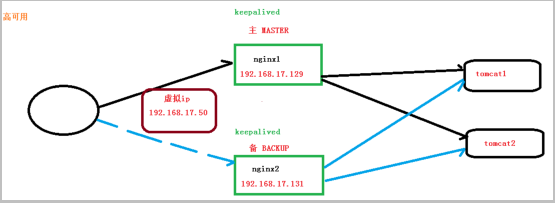
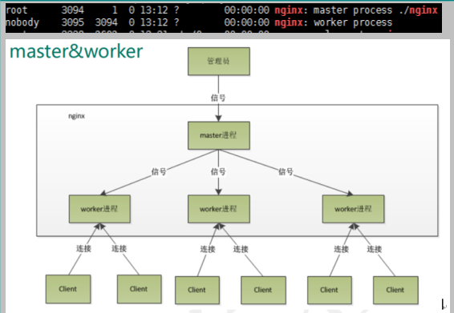
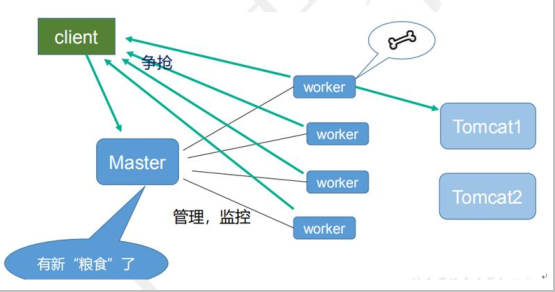

**内容**

```properties
1.nginx简介
	1）什么是nginx和可以做什么事
	2）正向代理
	3）反向代理
	4）动静分离
2.nginx的安装
	1）在linux系统安装nginx
3.nginx常用命令和配置文件
4.nginx配置实例1 反向代理
5.nginx配置实例2 负载均衡
6.nginx配置实例3 动静分离
7.nginx高可用集群
	1）nginx配置主从模式
	2）nginx配置双主模式
```

### 1.nginx的简介

```
1.什么是nginx
	nginx是高性能的HTTP和反向代理的服务器，处理高并发能力是十分强大的，能经受高负载的考验，有报告表名能支持高达50000个并发连接数。

2.正向代理
	需要在客户端配置代理服务器进行指定网站访问。
	比如：如果把局域网外的Internet想象成一个巨大的资源库，则局域网中的客户端要访问Internet，则需要通过代理服务器访问，这种代理服务就是正向代理。
	
3.反向代理
	反向代理其实客户端对代理是无感知的，因为客户端不需要任何配置就可以访问，我们只需要将请求发送到反向代理服务器，由反向代理服务器去选择目标服务器获取数据后，再返回给客户端，此时反向代理服务器和目标服务器对外就是一个服务器，暴露的是代理服务器地址，隐藏了真实服务器ip地址。
	
4.负载均衡
	传统的架构模式，多个请求同时访问一个服务器，由于访问量和数据量以及系统业务的复杂度增加，这种架构会造成服务器响应客户端的请求日益缓慢，并发量特别大的时候还容易造成服务器崩溃。
	解决方式1）纵向解决：升级服务器配置，比如提高CPU执行效率，加大内存等提高机器的物理性能来解决此问题。但是如果并发量特别大的时候，服务器即使增加到现有顶级配置也无法满足需求，因此需要横向扩展服务器。
	解决方式2）横向解决（负载均衡）：增加服务器数量，然后将请求分发到服务器上，将原先请求集中到单个服务器上的情况改为将请求分发到多个服务器上，将负载分发到不同服务器，也就是我们说的负载均衡。
	
5.动静分离
	为了加快网站的解析速度，可以把动态页面和静态页面由不同的服务器来解析，加快解析速度。降低原来单个服务器的压力。
```

**图示**


### 2.nginx安装

1. 需要的素材

pcre-8.37.tar.gz

openssl-1.0.1t.tar.gz

zlib-1.2.8.tar.gz

nginx-1.11.1.tar.gz

2. 安装nginx

```shell
第一步，安装pcre
	1)下载安装包
	# wget http://downloads.sourceforge.net/project/pcre/pcre/8.37/pcre-8.37.tar.gz
	2）解压 # tar -xvf pcre-8.37.tar.gz
	3)进入解压后的文件夹执行命令 # ./configure
	4)编译和安装，在安装目录下执行命令： # make && make install

第二步，安装openssl和zlib
	# yum -y install make zlib zlib-devel gcc-c++ libtool openssl openssl-devel

第三步，安装nginx
	1）解压nginx-xx.tar.gz
	2)进入解压目录执行  # ./configure
	3)make && make install
	4)启动： 安装成功后在/usr/local/下会生成nginx目录，在/usr/local/nginx/sbin/ 目录下有一个nginx文件，即是可执行文件，用于启动、停止nginx服务
	# ./nginx
	5)关闭 # ./nginx -s stop
	6)重启 # ./nginx -s reload
	
关于防火墙：
	1）查看开放端口号： # firewall-cmd --list-all
	2)设置开放的端口号： # sudo firewall-cmd --add-port=80/tcp --permanent
	3）重启防火墙： # firewall-cmd -reload
	
说明：启动nginx后，由于nginx默认端口是80，在浏览器输入ip即可以访问nginx，如下图：
```


### 3.nginx常用命令和配置文件

#### 3.1nginx常用命令

```properties
0.使用nginx命令前提条件：进入nginx安装目录sbin下，可执行文件在sbin目录下，默认目录/usr/local/nginx/sbin
1.启动命令
在/usr/local/nginx/sbin 下执行 ./nginx
2.关闭命令
在/usr/local/nginx/sbin 下执行 ./nginx -s stop
3.重新加载命令
在/usr/local/nginx/sbin 下执行 ./nginx -s reload
```

#### 3.2nginx配置文件介绍

将nginx.conf文件中注释的部分去掉，如下即是精简版的nginx.conf

```properties
#全局块
worker_processes  1;
#events块
events {
    worker_connections  1024;
}
#http块
http {
	#http全局块
    include       mime.types;
    default_type  application/octet-stream;
    sendfile        on;
    keepalive_timeout  65;
    #server块
    server {
        listen       80;
        server_name  localhost;
        location / {
            root   html;
            index  index.html index.htm;
        }
        error_page   500 502 503 504  /50x.html;
        location = /50x.html {
            root   html;
        }
    }
}
```

```properties
1.nginx配置文件位置
#cd /usr/local/nginx/conf/nginx.conf

2.配置文件中的内容
包含三块配置内容：
1）全局块(文件开始部分到events块之间)：配置服务器整体运行的配置指令
	比如：worker_processes 1;    #处理并发数的配置
2）events块：影响nginx服务器与用户的网络连接
	比如：worker_connections 1024;		#支持的最大连接数位1024
3）http块
	这是nginx服务器配置中最频繁的部分，代理、缓存和日志定义等绝大多数功能和第三方模块的配置都在这里。
	包含：  http全局块 和 server块
	#http全局块：http全局块配置的指令包括文件引入、MIME-TYPE定义、日志自定义、连接超时时间、单链接请求数上限等。
	#server块：每个http块可以包括多个server块，而每个server块就相当于一个虚拟主机；
			  而每个sever块也分全局server块，以及可以同时包含多个location块。
```

### 4.nginx配置实例-反向代理

#### 4.1反向代理实例一（一个server一个location）

1. 实现效果：使用nginx反向代理，访问www.123.com直接跳转linux上tomcat页面192.168.1.102:8080
2. 实现步骤

```
1）在linux上启动tomcat，在Windows浏览器输入192.168.1.102:8080显示tomcat首页
2）在Windows上C:\Windows\System32\drivers\etc\hosts 文件中添加
	192.168.1.102  www.123.com
    即可将192.168.1.102映射到www.123.com
    在浏览器中输入www.123.com:8080即可访问到linux上的tomcat首页
3）配置linux反向代理，用192.168.1.102:80代理192.168.1.102:8080
	如下图配置：  
	listen:监听端口， 
	server_name:监听ip地址，如下配置就是linux本地ip即192.168.1.102，   
	proxy_pass:代理服务地址，即将http://127.0.0.1:8080,代理到http://192.168.1.102:80
```


此时在Windows浏览器中输入:www.123.com就可以访问到192.168.1.102:8080

代理过程：1）www.123.com根据hosts文件的配置可以访问到192.168.1.102:80  (80端口是浏览器默认访问端口)

​		  2）根据linux上nginx.conf的配置，将192.168.1.102:8080代理到192.168.1.102:80

过程如下图：


#### 4.2反向代理实例二（一个server多个location，统一端口访问）

```properties
#实现效果：
使用nginx反向代理，根据访问的路径跳转到不同端口的服务中，nginx监听端口为9001；
访问:http://192.168.1.102:9001/edu/   直接跳转到192.168.1.102:8080/edu/
访问:http://192.168.1.102:9001/vod/   直接跳转到192.168.1.102:8081/vod/
#准备工作：
	在linux上解压两个tomcat，修改端口号分别为8080和8081，
	在tomcat8080的webapps文件夹下创建edu/index.html
	在tomcat8081的webapps文件夹下创建vod/index2.html
	启动后访问测试；
#在nginx.conf中配置
server {
        listen       9001;
        server_name  127.0.0.1;
        location ~ /edu/ {
                proxy_pass http://127.0.0.1:8080;
        }
        location ~ /vod/ {
                proxy_pass http://127.0.0.1:8081;
        }
        }
```

最终测试


```properties
#location指令说明：
 该指令用于匹配URL。
 语法如下：
 location [= | ~ | ~* | ^~] uri{
     
 }
 #说明：
 1.= ：用于不含正则表达式的 uri 前，要求请求字符串与 uri 严格匹配，如果匹配成功，就停止继续向下搜索并立即处理该请求。
 2.~：用于表示 uri 包含正则表达式，并且区分大小写。
 3.~*：用于表示 uri 包含正则表达式，并且不区分大小写。
 4.^~：用于不含正则表达式的 uri 前，要求 Nginx 服务器找到标识 uri 和请求字符串匹配度最高的 location 后，立即使用此 location 处理请求，而不再使用 location块中的正则 uri 和请求字符串做匹配。
```


### 5.nginx配置实例-负载均衡

```properties
#实现效果
 浏览器地址栏中输入地址http://192.168.1.102/edu/index.html,负载均衡效果，平均到8080和8081端口中。
 
 #准备工作：
 1）准备两台tomcat服务器，一台8080，一台8081
 2）在两台tomcat里面webapps目录中，创建名称是edu的文件夹，在edu文件夹中创建index.html，用于测试。
 
 #在nginx.conf中配置负载均衡
 如下图所示
 
 #测试
 在浏览器中输入http://192.168.1.102/edu/index.html会默认轮训访问8080和8081的index.html文件。
```


```properties
#nginx分配服务器策略
1.轮询（默认）
	每个请求按时间顺序逐一分配到不同后端服务器，如果后端服务器down掉，能自动剔除。
2.加权轮询weight
	weight代表权重值，默认为1，权重越高被分配的客户端越多。
	例：
	upstream myserver{
        server 192.168.1.102:8080 weight=5;
        server 192.168.1.102:8081 weight=10;
	}
3.ip_hash
	每个请求按访问ip的hash结果分配，这样每个访客固定访问一个后端服务器。
	例：
	upstream myserver{
		ip_hash;
        server 192.168.1.102:8080;
        server 192.168.1.102:8081;
	}
4.fair(第三方)
	按后端服务器的响应时间分配请求，响应时间短的优先分配。
	例：
	upstream myserver{
        server 192.168.1.102:8080;
        server 192.168.1.102:8081;
        fair;
	}
```

### 6.nginx配置实例-动静分离

1. 什么是动静分离


```properties
	nginx动静分离简单来说就是把动态跟静态请求分开，不能理解成只是单纯的把动态页面和静态页面物理分离。严格意义上说应该是动态请求跟静态请求分开，可以理解成使用nginx处理静态页面，tomcat处理动态页面。
	动静分离从目前实现角度来讲大致分为两种：
	一种是纯粹把静态文件独立成单独的域名，放在独立的服务器上，也是目前主流推崇的方案；
	另一种方法是动态跟静态文件混合在一起发布，通过nginx来分开。通过location指定不同的后缀名实现不同的请求和转发。
```

2. 实验步骤：

   1）项目资源准备

   ​	在linux上/data/目录下分别创建www目录和image目录；

   ​	www文件夹下创建a.html

   ​	image文件夹下创建1.jpg

   2)进行nginx配置

   ​	找到nginx安装目录，打开/conf/nginx.conf配置文件。

```properties
server {
        listen       80;
        server_name  127.0.0.1;
        location /www/ {
                root /data/;
                index index.html; 
        }
        location /image/ {
                root /data/;
                autoindex on;
        }
        }
#说明：1)location /www/ 就可以访问到/data/www/
	  2)index index.html 访问192.168.1.102/www/  会默认访问/www/index.html
	  3）autoindex on; 访问192.168.1.102/image/ 会在浏览器将该文件夹下的文件列出来
```

### 独立思考（一个端口代理多个服务配置）

```properties
如上反向代理配置，nginx代理tomcat配置如下：
server{
    listen 80;
    server_name test.com;
    localtion / {
        proxy_pass http://192.168.1.102:8080;
    }
}
#说明server_name配置的是本机的域名
此时访问http://test.com 即可以访问到192.168.1.102:8080

#问题1：如果有多个java应用需要配置统一端口访问，该怎么配？因为每个java应用所用的端口不同，location /{}只能配置一个代理路径?
解决：可以在location / 后加服务名作为区分，proxy_pass 后面也要加上相同的服务名；如下图：
```


注意：此时访问test.com，如果后面路径是/center、/portal、/demo，那么就跳到代理的链接，其他的全部都跳到http://127.0.0.1:8081/服务。 

### 7.nginx配置高可用集群

1.什么是nginx高可用？



2.配置高可用的准备工作

```properties
1.需要两台服务器：192.168.17.129和192.168.17.131
2.在两台服务器安装nginx
3.在两台服务器安装keepalived
	1)使用yum命令进行安装
	# yum install keepalived -y
	2)安装之后，在etc里面生成目录keepalived,有文件keepalived.conf
4.完成高可用配置（主从配置）
	1）修改/etc/keepalived/keepalived.conf配置文件（见下）
	2）在/usr/local/src添加检测脚本（见下）
	3）把两台服务器上的nginx和keepalived启动
		启动nginx： ./nginx
		启动keepalived: systemctl start keepalived.service
5.最终测试
	1）在浏览器地址栏输入 虚拟ip地址192.168.17.50  能正常访问nginx
	2）把主服务器（192.168.17.129）nginx和keepalived停止，再输入192.168.17.50 依然可以正常访问nginx，证明已经切换至备机nginx中。
```

**keepalived.conf**

```properties
global_defs {
    notification_email {
    acassen@firewall.loc
    failover@firewall.loc
    sysadmin@firewall.loc
    }
    notification_email_from Alexandre.Cassen@firewall.loc
    smtp_server 192.168.17.129
    smtp_connect_timeout 30
    #访问到主机配置，其中LVS_DEVEL是在/etc/hosts文件中配置的127.0.0.1对应的名字
    router_id LVS_DEVEL 
}

#检测脚本配置（检测nginx是否还活着，如果死了切换至备用机）
vrrp_script chk_http_port {
	#检测脚本位置
    script "/usr/local/src/nginx_check.sh"
    ##（检测脚本执行的间隔）
    interval 2 
    #权重（如果该nginx死了，权重就减20,）
    weight -20
}

vrrp_instance VI_1 {
	# 备份服务器上将 MASTER 改为 BACKUP
    state MASTER 
    #网卡，可通过ifconfig命令进行查看
    interface ens33 
    # 主、备机的 virtual_router_id 必须相同
    virtual_router_id 51 
    # 主、备机取不同的优先级，主机值较大，备份机值较小
    priority 90 
    #每隔一秒发送一次心跳检测，确认主机/备机是否还活着
    advert_int 1
    authentication {
        auth_type PASS
        auth_pass 1111
    }
    virtual_ipaddress {
        #VRRP H 虚拟地址，可以配置多个，访问nginx集群就可以通过这个虚拟ip访问
    	192.168.17.50 
    }
}
```

**检测脚本nginx_check.sh**

```properties
#!/bin/bash
A=`ps -C nginx –no-header |wc -l`
if [ $A -eq 0 ];then
/usr/local/nginx/sbin/nginx
sleep 2
if [ `ps -C nginx --no-header |wc -l` -eq 0 ];then
killall keepalived
fi
fi
```

### 8.nginx的原理解析

1.master和worker



2.worker如何进行工作的（争抢）



```properties
3.一个master和多个worker的好处
	1）可以使用nginx -s reload 热部署，利用nginx进行热部署操作；
	2）每个worker是独立的进程，如果有其中的一个worker出问题，其他worker独立的，继续进行争抢，实现请求过程，不会造成服务终端。
4.设置多少个worker合适？
	worker数量和服务器的CPU数量相等是最为适宜的。
5.连接数worker_connection
	第一个问题：发送请求占用了worker的几个连接数？
	答：2或4个；
	第二个问题：nginx有一个master，有四个worker，每个worker支持的最大连接数是1024，支持的最大并发数是多少？
	答：普通的静态访问最大并发数是：worker_connections*worker_processes/2,
		如果是http作反向代理来说最大并发数应该是worker_connctions*worker_processes/4.
```

