### 1.nosql入门概述

#### 1.1为什么使用nosql

```java
1.为什么使用nosql？
	答：1）MySQL数据库也经常存储一些大文本字段，导致数据库表非常大，在做数据库恢复的时候就导致非常的慢，不容易快速恢复数据库。
		2）关系型数据库很强大，但是它并不能很好的应付所有应用场景。
		3）MySQL的扩展性差（需要复杂的技术来实现），大数据下IO压力大，表结构更改困难。
2.3V+3高？
	1）大数据时代的3V：海量(Volume)、多样(Variety)、实时(Velocity)
    2)互联网需求的3高：高并发、高可扩、高性能。
3.NoSQL数据库的四大分类：
	1）KV键值；
	2）文档型数据库(bson格式比较多)；
	3）列存储数据库；
	4）图关系数据库；
```

#### 1.2分布式数据库中CAP原理

```java
1.传统的关系型数据库的ACID？
	A(Atomicity)原子性，C(Consistency)一致性，I(Isolation)独立性，D(Durability)持久性
2.在分布式数据库中遵守的是CAP原理：
	1）CAP指：Consistency强一致性，Availability可用性，Partition tolerance分区容错性
	2）CAP的3进2：CAP理论就是说在分布式存储系统中，最多只能实现上面两点。而由于当前网络硬件肯定会出现延迟丢包等问题，所以  分区容忍性使我们必须要实现的。
	所以我们只能在“一致性”和“可用性”之间进行权衡，没有NoSQL系统能同时保证这三点。
	CA：传统ORACLE数据库
	AP：大多数网站架构的选择
	CP：redis、MongoDB
	注意：分布式架构的时候必须做出取舍。一致性和可用性之间取一个平衡。多余大多数web应用，其实并不需要强一致性。因此牺牲C换取P，这是目前分布式数据库产品的方向。
3.经典CAP图：
	CAP理论的核心是：一个分布式系统不可能同时很好的满足一致性，可用性和分区容错性这三个需求，最多只能同时较好的满足两个。因此，根据 CAP 原理将 NoSQL 数据库分成了满足 CA 原则、满足 CP 原则和满足 AP 原则三 大类：
CA - 单点集群，满足一致性，可用性的系统，通常在可扩展性上不太强大。
CP - 满足一致性，分区容忍性的系统，通常性能不是特别高。
AP - 满足可用性，分区容忍性的系统，通常可能对一致性要求低一些。
4.BASE:
	BASE就是为了解决关系数据库强一致性引起的问题而引起的可用性降低而提出的解决方案。
	BASE其实是下面三个术语的缩写：
    基本可用（Basically Available）
    软状态（Soft state）
    最终一致（Eventually consistent）
5.分布式+集群简介：
	1）分布式：不同的多台服务器上面部署不同的服务模块（工程），他们之间通过RPC/RMI之间通信和调用，对外提供服务和组内协作。
	2）集群：不同的多台服务器上面部署相同的服务模块，通过分布式调度软件进行统一调度，对外提供服务和访问。
```

### 2.redis入门概述

```java
1.是什么？
	1）redis是一个高性能的（key/value）分布式内存数据库，基于内存运行，并支持持久化的nosql数据库，是当前最热门的nosql数据库之一，也被人们称为数据结构服务器。
	2）redis与其他key-value缓存产品有以下三个特点：
		a.redis支持数据的持久化，可以将内存中的数据保存在磁盘上，重启的时候可以再次加载进行使用。
		b.redis不仅仅支持简单的key-value类型的数据，同时还提供了list,set,zset,hash等数据结构的存储。
		c.redis支持数据的备份，即master-slave模式的数据备份。
```

### 3.redis的安装

#### 3.1linux版本正常安装

```properties
1.下载安装包
	#wget http://download.redis.io/releases/redis-2.8.17.tar.gz
2.linux下下载的安装包默认在/usr/local下，解压到当前目录
	#tar xzf redis-2.8.17.tar.gz
3.进入解压后的目录执行make命令
	#cd redis-2.8.17
	#make
4.make完后 redis-2.8.17目录下会出现编译后的redis服务程序redis-server,还有用于测试的客户端程序redis-cli,两个程序位于安装目录 src 目录下：
# cd src
# ./redis-server
5.注意这种方式启动redis 使用的是默认配置。也可以通过启动参数告诉redis使用指定配置文件使用下面命令启动。
# cd src
# ./redis-server ../redis.conf
注：../redis.conf是我们指定的配置文件，一般不用默认的配置文件
6.redis.conf 是一个默认的配置文件。我们可以根据需要使用自己的配置文件。启动redis服务进程后，就可以使用测试客户端程序redis-cli和redis服务交互了。 比如：
$ cd src
$ ./redis-cli
redis> set foo bar
OK
redis> get foo
"bar"

7.关闭：
	1）单实例关闭：redis-cli shutdown
	2）多实例关闭：指定端口关闭:redis-cli -p 6379 shutdown
	
```

#### 3.2docker安装redis

```properties
#注意：docker容器启动的redis没有配置文件，如果需要可以在启动时设置参数生成配置文件

1.拉取redis镜像
# docker pull redis
2.创建redis容器
# docker run -id --name=redis -p 6379:6379 redis

说明：
#进入容器命令：#docker exec -it redis(容器名|容器id) /bin/bash
要在redis服务上执行命令需要一个redis客户端，开启一个redis客户端命令
#redis-cli
```

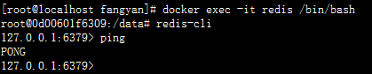


#### 3.3默认安装目录文件说明

```java
//安装完redis后会在/usr/local/bin下生成以下文件
1.redis-benchmark:性能测试工具，可以在自己本子运行，看看自己本子性能如何
2.redis-check-aof：修复有问题的AOF文件
3.redis-check-dump：修复有问题的dump.rdb文件
4.redis-cli：客户端，操作入口
5.redis-sentinel：redis集群使用
6.redis-server：Redis服务器启动命令
```

### 4.redis启动后杂项基础知识

```properties
1.单进程：单进程模型来处理客户端的请求。对读写等事件的响应是通过对epoll函数的包装来做到的。redis的实际处理速度完全依靠主进程的执行效率。
2.默认16个数据库，类似数组下标从0开始，初始默认使用0号库。
3.select 命令切换数据库。 例select 1   切换至1号库
4.dbsize 查看当前数据库的key的数量。
5.flushdb 清空当前库
6.flushall 通杀全部库
7.统一密码管理，16个库都是同样的密码，要么都OK要么一个都连不上。
8.redis索引都是从0开始
9.端口号默认6379
```

### 5.redis数据类型

#### 5.1redis的五大数据类型

```
1.string （字符串）
2.hash （哈希，类似java里的map）
3.list （列表）
4.set （集合）
5.zset （sorted set:有序集合）
```

redis常见命令操作：http://redisdoc.com/

#### 5.2redis键（key）

```properties
1.列出当前库所有的键
#keys *   
2.判断某个key是否存在
#exists key的名字
3.移除键到指定库（剪切）
#move key db
4.为给定的key设置过期时间
#expire key 秒钟
5.查看key还有多少秒过期，-1永不过期  -2已过期
#ttl key
6.查看key的值是什么类型
#type key
```

#### 5.3redis字符串（String）

```properties
1.设置值
#set key value
2.获取值
#get key
3.删除指定key
#del key
4.在指定key值后append值
#append key value
5.查看字符串长度
#strlen key
6.加减，针对value是数字的操作
#incr  #decr  #incrby key increment  #decrby key decrement
上面命令分别是 +1 -1 +increment -decrement
7.获取/替换 字符串指定位置的值
#getrange key start end
#setrange key offset value
8.设置带过期时间的key值
#setex key seconds value
9.set if not exist
#setnx key value
10.同时设置/获取多个值
#mset key value[key value]
#mget key[key]
#msetnx key value[key value]   当且仅当set的全部key不存在，才能set成功
11.先获取后赋值
#getset key value
```

#### 5.4redis列表（list）

```properties
1.lpush/rpush 设置列表 从列表左侧/右侧依次添加值
#lpush key value [value ...]
2.lrange 查看指定列表某个范围内的值 start开始角标，stop结束角标 查看全部start=0,stop=-1
#lrange key start stop
3.lpop/rpop 从列表左侧/右侧弹出一个元素
#lpop key
3.lindex 按照索引下标获取元素
#lindex key index
4.llen 查看列表元素个数
#llen key 
5.lrem 删除n个value元素
#lrem key count value
6.ltrim 截取key指定范围内的值赋值给key
#ltrim key start stop
7.rpoplpush 从source列表右侧弹出一个元素添加到destination列表左侧
#rpoplpush source destination
8.lset 修改指定角标的值
#lset key index value
9.linsert 在pivot值之前/之后插入指定值value
#linsert key BEFORE|AFTER pivot value
#说明如果有多个pivot值，会选择第一个
```

**性能总结**

```properties
它是一个字符串链表，left、right都可以添加；
如果键不存在，创建新的链表；
如果键已存在，新增内容；
如果值全部移除，对应的键也就消失了；
链表的操作无论是头和尾效率都极高，但假如对中间元素的操作效率就很惨淡了；
```

#### 5.5redis集合(set)

```properties
#注意：1.set集合中的元素不能重复，添加重复元素时仅保留一个
      #2.对于存放数字类型的数据会自动排序
      
1.sadd[创建集合key]添加元素member
#sadd key member [member]
2.smembers 查看集合key所有元素
#smembers key
3.sismember 查看集合中是否有指定元素，返回指定元素个数
#sismember key member
4.scard 获取集合元素个数
#scard key
5.srem 删除集合中指定元素
#srem key member
6.srandmember 从集合key中随机获取count个元素，不指定count就获取一个
#srandmember key [count]
7.spop 从集合中随机弹出count个元素，指定count就弹出一个
#spop key [count]
8.smove 将source的member值移动到destination集合中
#smove source destination member
9.sdiff 差集：获取在第一个集合中有但是在第二个集合中没有的元素
#sdiff key [key ...]
10.sinter 交集：获取在第一个集合和第二个集合中共同的元素
#sinter key [key ...]
11.sunion 并集：获取第一个和第一个集合中所有的元素
#sunion key [key ...]
```

#### 5.6redis哈希（hash）

```properties
1.hset设置值 field value是键值对
#hset key field value
2.hget 获取指定hash表key的field值
#hget key field
3.hmset/hmget 设置/获取key多个键值对，用法同上
4.hgetall 获取指定hash所有键值对
#hgetall key
5.hdel 删除指定hash的指定field
#hdel key field [field ...]
6.hlen 获取指定hash的元素个数
#hlen key
7.hexists 在key里判断是否存在field
#hexists key field
8.hkeys/hvals  获取key中所有的键/值
#hkeys/hvals key
9.hincrby/hincrbyfloat 对field的值加increment    注意field必须是数字类型
#hincrby/hincrybyfloat key field increment
10.hsetnx  不存在指定field就赋值，存在的话就无效
#hsetnx key field value
```

#### 5.7redis有序集合Zset(sorted set)

```properties
#说明：zset是在set基础上加一个score值。  之前set是k1 v1 v2 v3,现在zset是key1 score1 v1 score2 v2
1.zadd 创建并添加元素
#zadd key score member [score member ...]
2.zrange 查看指定角标范围内元素 withscores加上就会打印分数和值
#zrange key start stop [WITHSCORES]
3.zrangebyscore 查看指定分数范围内的元素 offset开始角标  count步数 
#zrangebyscore key min max [WITHSCORES] [LIMIT offset count]
10.zrevrangebyscore 逆序查看指定分数范围内的元素
#zrevrangebyscore key max min [WITHSCORES] [LIMIT offset count]
(min  分数前面加个（表示不包含
4.zrem 删除指定key对应的value元素
#zrem key member [member ...]
5.zcard 获取key内元素个数
#zcard key
6.zcount 获取key中指定分数范围内的元素个数
#zcount key min max
7.zrank 获取指定元素下标值，（因为是根据分数排序的，因此也就是排名）
#zrank key member
7.1 zrevrank 获取指定元素逆序下标值
#zrevrank key member
8.zsore 获取指定元素的分数
#zscore key member
9.zrevrange 逆序查看指定角标范围内元素
#zrevrange key start stop [WITHSCORES]
```

### 6.解析配置文件redis.conf

#### 6.1常见配置redis.conf介绍

说明：

1.redis.conf在菜鸟教程中有详细的讲解，如下部分菜鸟教程也有说明：

2.redis的配置文件位于redis的安装目录下，文件名为redis.conf(windows名为redis.windows.conf)

3.可以通过CONFIG命令查看或设置配置项。#config  get key  , #config set key value

4.修改配置有两种方式：1)修改config.conf文件如下代码块；2）config set 

```properties
1、redis默认不是以守护进程的方式运行，可以通过该配置项修改，使用yes启用守护进程：
#daemonize no

2、当redis以守护进程方式运行时，redis默认会把pid写入/var/run/redis.pid文件，可以通过pidfile指定：
#pidfile /var/run/redis.pid

3、指定redis监听端口，默认端口号为6379，作者在自己的一篇博文中解析了为什么选用6379作为默认端口，因为6379在手机按键上MERZ对应的号码，而MERZ取自意大利女歌手Alessia Merz的名字：
#port 6379

4、设置tcp的backlog，backlog是一个连接队列，backlog队列总和=未完成三次握手队列+已完成三次握手队列。在高并发环境下你需要一个高backlog值来避免慢客户端连接问题。注意Linux内核会将这个值减小到/proc/sys/net/core/somaxconn 的值，所以需要确认增大somaxconn和tcp_max_syn_backlog两个值来达到想要的效果：
#tcp-backlog 511

5、绑定的主机地址：
#bind 127.0.0.1

6、当客户端闲置多长时间后关闭连接，如果指定为0，表示永不关闭：
#timeout 300

7、设置检测客户端网络中断时间间隔，单位为秒，如果设置为0，则不检测，建议设置为60：
#tcp-keepalive 0

8、指定日志记录级别，redis总共支持四个级别：debug、verbose、notice、warning，默认为verbose：
#loglevel verbose

9、日志记录方式，默认为标准输出，如果配置redis为守护进程方式运行，而这里又配置为日志记录方式为标准输出，则日志将会发送给/dev/null：
#logfile stdout

10、设置数据库数量，默认值为16，默认当前数据库为0，可以使用select<dbid>命令在连接上指定数据库id：
#databases 16

11、指定在多长时间内，有多少次更新操作，就将数据同步到数据文件，可以多个条件配合：
#save <seconds><changes>
save 300 10：表示300秒内有10个更改就将数据同步到数据文件

12、指定存储至本地数据库时是否压缩数据，默认为yes，redis采用LZF压缩，如果为了节省CPU时间，可以关闭该选项，但会导致数据库文件变得巨大：
#rdbcompssion yes

13、指定本地数据库文件名，默认值为dump.rdb：
#dbfilename dump.rdb

14、指定本地数据库存放目录：
#dir ./

15、设置当本机为slave服务时，设置master服务的IP地址及端口，在redis启动时，它会自动从master进行数据同步：
#slaveof <masterip><masterport>

16、当master服务设置了密码保护时，slave服务连接master的密码：
#masterauth <master-password>

17、设置redis连接密码，如果配置了连接密码，客户端在连接redis时需要通过auth <password>命令提供密码，默认关闭：
#requirepass foobared

18、设置同一时间最大客户端连接数，默认无限制，redis可以同时打开的客户端连接数为redis进程可以打开的最大文件描述符数，如果设置maxclients 0，表示不作限制。当客 户端连接数到达限制时，redis会关闭新的连接并向客户端返回 max number of clients reached错误消息：
#maxclients 128

19、指定redis最大内存限制，redis在启动时会把数据加载到内存中，达到最大内存后，redis会先尝试清除已到期或即将到期的key，当次方法处理后，仍然到达最大内存设置，将无法再进行写入操作，但仍然可以进行读取操作。Redis新的vm机制， 会把key存放内存，value会存放在swap区：
#maxmemory <bytes>

20、设置缓存过期策略，有6种选择：（LRU算法最近最少使用）
#volatile-lru：使用LRU算法移除key，只对设置了过期时间的key；
#allkeys-lru：使用LRU算法移除key，作用对象所有key；
#volatile-random：在过期集合key中随机移除key，只对设置了过期时间的key;
#allkeys-random：随机移除key，作用对象为所有key；
#volarile-ttl：移除哪些ttl值最小即最近要过期的key；
#noeviction：永不过期，针对写操作，会返回错误信息。
#maxmemory-policy noeviction

21、指定是否在每次更新操作后进行日志记录，redis在默认情况下是异步的把数据写入磁盘，如果不开启，可能会在断电时导致一段时间内数据丢失。因为redis本身同步数据文件是按上面save条件来同步的，所以有的数据会在一段时间内置存在于内存中。默认为no：
#appendonly no

22、指定更新日志文件名，默认为appendonly.aof：
#appendfilename appendonly.aof

23、指定更新日志条件，共有3个可选值：
no：表示等操作系统进行数据缓存同步到磁盘（快）；
always：表示每次更新操作后手动调用fsync()将数据写到磁盘（慢，安全）；
everysec：表示每秒同步一次（折中，默认值）
#appendfsync everysec

24、指定是否启用虚拟内存机制，默认值为no，简单介绍一下，VM机制将数据分页存放，由redis将访问量较小的页即冷数据 swap到磁盘上，访问多的页面由磁盘自动换出到内存中：
#vm-enabled no

25、虚拟内存文件路径，默认值为/tmp/redis.swap，不可多个redis实例共享：
#vm-swap-file /tmp/redis.swap

26、将所有大于vm-max-memory的数据存入虚拟内存，无论vm-max-memory设置多小，所有索引数据都是内存存储的（redis的索引数据就是keys），也就是说，当vm-max-memory设置为0的时候，其实是所有value都存在于磁盘。默认值为 0：
#vm-max-memory 0

27、redis swap文件分成了很多的page，一个对象可以保存在多个page上面，但一个page上不能被多个对象共享，vm-page-size是根据存储的数据大小来设定的，作者建议如果储存很多小对象，page大小最好设置为32或者64bytes；如果存储很多大对象，则可以使用更大的page，如果不确定，就使用默认值：
#vm-page-size 32

28、设置swap文件中page数量，由于页表（一种表示页面空闲或使用的bitmap）是放在内存中的，在磁盘上每8个pages将消耗1byte的内存：
#vm-pages 134217728

29、设置访问swap文件的线程数，最好不要超过机器的核数，如果设置为0，那么所有对swap文件的操作都是串行的，可能会造成长时间的延迟。默认值为4：
#vm-max-threads 4

30、设置在客户端应答时，是否把较小的包含并为一个包发送，默认为开启：
#glueoutputbuf yes

31、指定在超过一定数量或者最大的元素超过某一临界值时，采用一种特殊的哈希算法：
#hash-max-zipmap-entries 64
#hash-max-zipmap-value 512

32、指定是否激活重置hash，默认开启：
#activerehashing yes

33、指定包含其他配置文件，可以在同一主机上多个redis实例之间使用同一份配置文件，而同时各个实例又拥有自己的特定配置文件：
#include /path/to/local.conf
```

### 7.Redis持久化之RDB(Redis DataBase)

#### 7.1是什么？

```properties
1.在指定的时间间隔内将内存中的数据集快照写入磁盘，也就是行话讲的Snapshot快照，它恢复时是将快照文件直接读到内存里。
2.Redis会单独创建（fork）一个子进程来进行持久化，会先将数据写入到一个临时文件中，待持久化过程都结束了，再用这个临时文件替换上次持久化好的文件。整个过程中，主进程是不进行任何IO操作的，这就确保了极高的性能，如果需要进行大规模数据的恢复，且对于数据恢复的完整性不是非常敏感，那RDB方式要比AOF方式更加的高效。RDB的缺点是最后一次持久化后的数据可能丢失。
3.fork:fork的作用是复制一个与当前进程一样的进程。新进程的所有数据（变量、环境变量、程序计数器等）数值都和原进程一致，但是是一个全新的进程，并作为原进程的子进程
4.rdb 保存的是dump.rdb文件;
5.配置位置：在redis.conf文件中 SNAPSHOTTING 下 save <seconds> <changes>
```

#### 7.2如何配置

5.配置位置：在redis.conf文件中 SNAPSHOTTING 下 save <seconds> <changes>

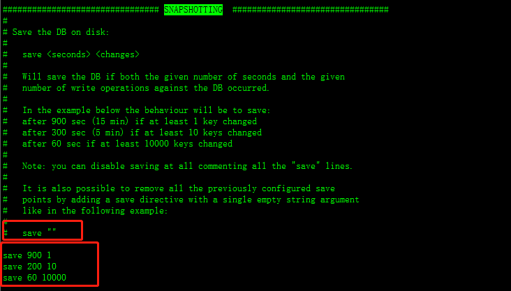

#### 7.2如何触发RDB快照

```properties
1.配置文件中默认的快照配置:可以cp dump.rdb dump_new.rdb 冷拷贝后重新使用；
2.命令save或bgsave:
	1)save:只管保管，其他不管，全部阻塞。也就是执行save命令时触发快照写入磁盘时，同时不能向redis中写入数据。
	2）bgsave:redis会在后台异步进行快照操作，快照同时还可以响应客户端请求。可以通过lastsave命令获取最后一次成功执行快照的时间。
3.执行flushall命令，也会产生dump.rdb文件，但是里面是空的，毫无意义。
```

#### 7.3如何恢复

```properties
#问题：因为redis是内存数据，如果服务器异常关闭等原因，则内存中的数据就会丢失，采用RDB可以保存数据到磁盘，但是最后一次没来得及写入磁盘的数据会丢失。  但是如果当前服务器硬件坏了，备份到dump.rdb文件也没有了，所以最好在另一台服务器备份一份dump.rdb文件，如果服务器硬盘坏了可以将备份的dump.rdbwe年拿来恢复；
方式：
	将备份的dump.rdb移动到redis安装目录并启动服务即可。
```

#### 7.4RDB的优势和劣势

```properties
#优势
1.适合大规模数据恢复；
2.对数据完整性和一致性要求不高；

#劣势
1.在一定间隔内做一次备份，如果redis意外down掉的话，就丢失最后一次快照后的所有修改；
2.fork的时候，内存中的数据被克隆了一份，大致2倍的膨胀性需要考虑；
```

#### 7.5如何停止RDB

动态所有停止RDB保存规则的方法：redis-cli config set save ""

或者在配置文件redis.conf中修改save ""

### 8.Redis持久化之AOF(Append Only File)

#### 8.1AOF是什么

```properties
1.aof以日志的形式来记录每个写操作，将redis执行过的所有写指令记录下来（读操作不记录）；
2.只许追加文件，但不可以修改文件，redis启动时会读取该文件重新构建数据（即redis启动时根据aof日志文件内容将所有写指令重新执行一遍以完成数据的恢复）；
3.在redis.conf配置中开启AOF如下，在APPEND ONLY MODE 模块下：
```

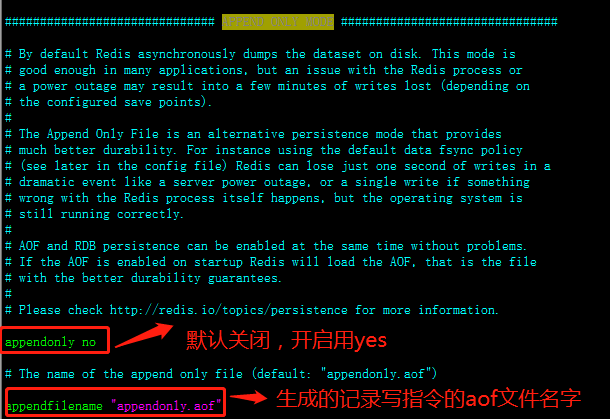

#### 8.2AOF启动/修复/恢复

``` properties
#1.正常恢复数据：
	1）启动：将默认的appendonly no ,改为yes
	2）将有数据的aof文件复制一份保存到对应目录（config get dir）
	3)恢复：重启redis，自动加载dir下的aof文件，进行读写日志里的写指令执行，进行数据恢复；
#2.异常恢复数据（aof文件有错误）：
	1）启动：将默认的appendonly no ,改为yes
	2）备份写坏的aof文件
	3）redis-check-aof --fix进行修复的文件； 此步骤执行完aof文件将修复
	4）恢复：重启redis重新加载
	
说明：redis-check-aof 执行命令在redis-2.8.17/bin目录下，下面还有其他指令，详见3.3节
```

#### 8.3rewrite

```properties
1.是什么？ 
	AOF采用文件追加方式，文件会越来越大为避免出现此种情况，新增了重写机制,当AOF文件的大小超过所设定的阈值时，Redis就会启动AOF文件的内容压缩，只保留可以恢复数据的最小指令集.可以使用命令bgrewriteaof
2.触发机制：
	Redis会记录上次重写时的AOF大小，默认配置是当AOF文件大小是上次rewrite后大小的一倍且文件大于64M时触发；
3.配置如下： 100表示100%,即aof文件大小是上次rewrite大小的一倍
```

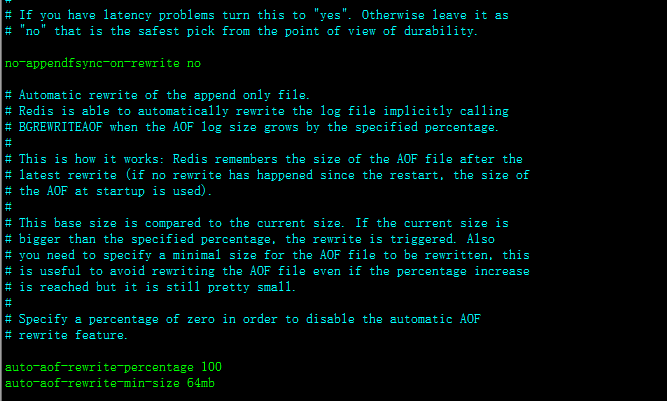

#### 8.4AOF配置

```properties
#AOF的配置全部在 APPEND ONLY MODE 模块下
1.appendonly no  #AOF开关
2.appendfilename  "appendonly.aof"  #生成的记录文件名字
3.appendfsync everysec  
	指定更新日志条件，共有3个可选值：
	no：表示等操作系统进行数据缓存同步到磁盘（快）；
	always：表示每次更新操作后手动调用fsync()将数据写到磁盘（慢，安全）；
	everysec：表示每秒同步一次,如果服务器宕机，最后一秒数据将丢失（折中，默认值）
4.no-appendfsync-on-rewrite no  #开启rewrite
5.auto-aof-rewrite-percentage 100
  auto-aof-rewrite-min-size 64mb
  #rewrite触发机制
```

#### 8.5AOF的优势和劣势

```properties
优势：
	1）每修改同步：appendfsync always   同步持久化 每次发生数据变更会被立即记录到磁盘  性能较差但数据完整性比较好
	2）每秒同步：appendfsync everysec    异步操作，每秒记录   如果一秒内宕机，有数据丢失
	3）不同步：appendfsync no   从不同步
	
劣势：
	1）相同数据集的数据而言aof文件要远大于rdb文件，恢复速度慢于rdb
	2）aof运行效率要慢于rdb,每秒同步策略效率较好，不同步效率和rdb相同
	
自己总结：
	AOF在数据完整性方面优于RDB
	RDB文件比AOF文件小，且恢复速度快于AOF

如何选择？
	1）如果redis只做缓存用的话可以不开启任何持久化方式；
	2）同时开启两种持久化方式： redis会优先载入aof来恢复数据，因为aof文件保存的数据通常比rdb文件保存的数据完整；  RDB的数据不实时，同时使用两者时服务器重启也只会找AOF文件。那要不要只使用AOF呢？作者建议不要，因为RDB更适合用于备份数据库(AOF在不断变化不好备份)，快速重启，而且不会有AOF可能潜在的bug，留着作为一个万一的手段。
```

#### 8.6性能建议

```properties
因为RDB文件只用作后备用途，建议只在Slave上持久化RDB文件，而且只要15分钟备份一次就够了，只保留save 900 1这条规则。

如果Enalbe AOF，好处是在最恶劣情况下也只会丢失不超过两秒数据，启动脚本较简单只load自己的AOF文件就可以了。代价一是带来了持续的IO，二是AOF rewrite的最后将rewrite过程中产生的新数据写到新文件造成的阻塞几乎是不可避免的。只要硬盘许可，应该尽量减少AOF rewrite的频率，AOF重写的基础大小默认值64M太小了，可以设到5G以上。默认超过原大小100%大小时重写可以改到适当的数值。

如果不Enable AOF ，仅靠Master-Slave Replication 实现高可用性也可以。能省掉一大笔IO也减少了rewrite时带来的系统波动。代价是如果Master/Slave同时倒掉，会丢失十几分钟的数据，启动脚本也要比较两个Master/Slave中的RDB文件，载入较新的那个。新浪微博就选用了这种架构
```

### 9.redis的事务

#### 9.1redis事务简介

```properties
1.是什么？
	可以一次执行多个命令，本质是一组命令的集合。一个事务中的所有命令都会序列化，按顺序的串行化执行而不会被其他命令插入，不许加塞。
2.能干嘛？
	一个队列中，一次性、顺序性、排他性的执行一系列命令。
```

#### 9.2redis事务使用

```properties
使用事务之前需要知道的几个事务相关的命令：
1）multi	标记一个事务块的开始   
2）exec	执行所有事务块内的命令
3）discard	取消事务，放弃执行事务块内的所有命令
4）watch key [key ...]	监视一个（或多个）key,如果在事务执行之前这个（这些）key被其他命令所改动，那么事务将被打断。
5）unwatch	取消watch命令对所有key的监视。
```

##### 9.2.1事务正常执行

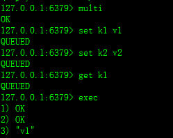

##### 9.2.2放弃事务

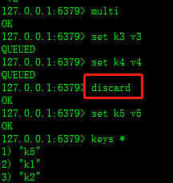

注意：放弃事务后，加入事务队列的命令将不再执行。    放弃事务后，exec事务也会报错。

##### 9.2.3全体连坐

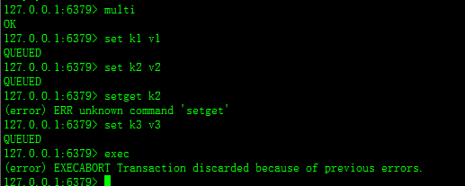

如果输入一个不存在的命令，在受检时发生错误，因此不能加入队列，并且提交事务时报错，所有队列里的命令都不执行，即为全体连坐。

##### 9.2.4冤头债主

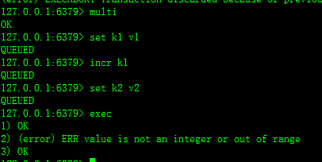

如果事务队列中，有一条运行时异常的命令，可以正常加入队列，提交事务时该条命令执行失败，其他命令正常执行，即为冤头债主。

#### 9.3watch监控

**问题**

对于高并发的操作，如果一个在一个事物块中对k1 100进行修改incrby k1 20，在事务提交之前有另一个客户端对k1进行修改set k1 500,则事务提交时k1 就变为了520，此时并不是我们预期的值，就产生了数据安全问题。

##### 9.3.1乐观锁、悲观锁、CAS简介

```properties
1.悲观锁：
	悲观锁(Pessimistic Lock), 顾名思义，就是很悲观，每次去拿数据的时候都认为别人会修改，所以每次在拿数据的时候都会上锁，这样别人想拿这个数据就会block直到它拿到锁。传统的关系型数据库里边就用到了很多这种锁机制，比如行锁，表锁等，读锁，写锁等，都是在做操作之前先上锁。
2.乐观锁：
	乐观锁(Optimistic Lock), 顾名思义，就是很乐观，每次去拿数据的时候都认为别人不会修改，所以不会上锁，但是在更新的时候会判断一下在此期间别人有没有去更新这个数据，可以使用版本号等机制。乐观锁适用于多读的应用类型，这样可以提高吞吐量，
乐观锁策略:提交版本必须大于记录当前版本才能执行更新
3.CAS：
	Check And Set，赋值之前先进行检查，如果值已经改变了就不set.
	
#说明：redis事务中watch类似于加了乐观锁，如果被监控的key在事务提交之前被其他客户端修改了，则事务提交失败。
```

##### 9.3.2watch监控无加塞篡改

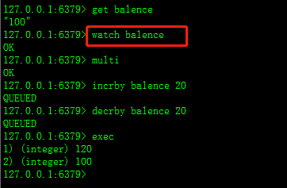

无加塞篡改，先监控再开启multi，
保证两笔金额变动在同一个事务内

##### 9.3.3watch监控有加塞篡改

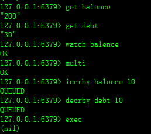

说明：watch之后，exec之前，如果有另一个客户端对balence进行修改，则执行exec不成功；

注意：watch和乐观锁的区别？

乐观锁如果是取数据不会判断此数据有没有被修改过，但是修改数据时判断此数据如果被修改过就此次修改失败；

而watch监控的话，对于在事务内纯取数据操作，如果值在事务提交之前被改过，也会exec失败。

##### 9.3.4unwatch

```
一旦执行了exec之前加的监控锁都会被取消掉了
```

##### 9.3.5watch监控总结

```properties
1.Watch指令，类似乐观锁，事务提交时，如果Key的值已被别的客户端改变，比如某个list已被别的客户端push/pop过了，整个事务队列都不会被执行
2.通过WATCH命令在事务执行之前监控了多个Keys，倘若在WATCH之后有任何Key的值发生了变化，EXEC命令执行的事务都将被放弃，同时返回Nullmulti-bulk（其实是返回(nil)）应答以通知调用者事务执行失败
```

#### 9.4redis事务总结

##### 9.4.1三阶段

```java
1.开启：以multi开始一个事务；
2.入队：将多个命令入队到事务中，接到这些命令并不会立即执行，而是放到等待执行的事务队列里面；
3.执行：有exec命令触发事务执行；
```

##### 9.4.2三特性

```java
1.单独的隔离操作：事务中的所有命令都会序列化、按顺序地执行。事务在执行的过程中，不会被其他客户端发送来的命令请求所打断。
2.没有隔离级别的概念：队列中的命令没有提交之前都不会实际的被执行，因为事务提交前任何指令都不会被实际执行，
也就不存在”事务内的查询要看到事务里的更新，在事务外查询不能看到”这个让人万分头痛的问题
3.不保证原子性：redis同一个事务中如果有一条命令执行失败，其后的命令仍然会被执行，没有回滚
```

### 10.redis发布订阅

```properties
#说明发布订阅类似于消息中间件的功能，有rocketmq替代它，因此此功能使用不多，仅作为了解。
1.是什么？
	进程间的一种消息通信模式：发布者（pub）发送消息，订阅者（sub）接收消息。
2.发布订阅关系图如下：
```

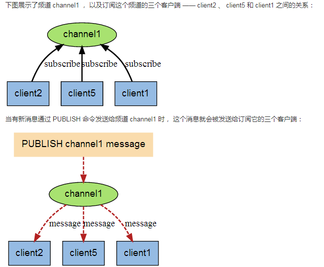

**发布订阅命令**

```properties
1.订阅给定一个或多个频道信息
#SUBSCRIBE channel [channel ...]
2.将消息发送到指定频道
#PUBLISH channel message
3.订阅一个或多个符合给定模式的频道
#PSUBSCRIBE pattern [pattern ...]
4.查看订阅与发布系统状态。
#PUBSUB subcommand [argument [argument ...]]
5.退订所有给定模式的频道。	
#PUNSUBSCRIBE [pattern [pattern ...]]
6.指退订给定的频道。
#UNSUBSCRIBE [channel [channel ...]]
```

### 11.redis的主从复制（master/slave）

#### 11.1主从复制介绍

```properties
主机数据更新后根据配置的策略，自动同步到备机的master/slave机制，master以写为主，slave以读为主。
```

#### 11.2怎么玩？

```properties
1.配从（库）不配主（库）；
2.从库配置：slaveof 主库ip 主库端口号
	#注意：1）查看主从角色信息命令：info replication
	#      2)以命令形式配置的主从复制，每次slave与master断开后，都需要重新连接，除非配置到redis.conf文件中。
3.修改配置文件细节
	1）拷贝多个redis.conf文件
	2）开启daemonize yes
	3)pid文件名字
	4）指定端口
	5）log文件名字
	6）dump.rdb名字
4.常用三招之 一主二仆
	步骤：
	1）拷贝3个redis.conf,一个master，两个slave，按照上述3修改配置文件
	2）分别以三个不同的redis.conf启动redis服务，两个从机按照上述2去复制主机
	3）从机问题演示：
		1.切入点问题？slave1、slave2是从头开始复制还是从切入点开始复制？比如从k4进来，那之前的123是否也复制？     答：是从头开始复制。
		2.从机是否可写？    答：从机read only，执行写操作会报错。
		3.主机shutdown后，从机是上位还是原地待命？     答：从机原地待命，等主机重启后会继续slave 主机。
		4.其中一台从机shutdown后情况如何？依照原有它能跟上大部队吗？		答：从机down后重启默角色会变为master，因为他的slaveof没有配置启动配置文件redis.conf中。
5.常用三招之 薪火相传
	1）上一个slave是下一个slave的master，slave同样可以接收其他slaves的连接和同步请求，那么该slave作为了链条中下一个master，可以有效减轻master的写压力；
	2）中途变更转向：会清除之前的数据，重新建立拷贝最新的；
	3）slaveof 新主库ip 新主库端口号
6.常用三招之 反客为主
	如果master宕机，在slave1上执行slaveof no one，则slave1就有slave变为master达到反客为主的效果，slave2执行slaveof 新主机ip 新主机端口号
		
######################################复制原理########################################
1）slave启动成功连接到master后会发送一个sync命令
2）master接到命令启动后台的存盘进程，同时收集所有接受到的用于修改数据集命令，在后台进程执行完毕后，master将传递整个数据文件到slave，以完成一次完全同步。
3）全量复制：而slave在接收到数据库wenjian数据后，将其存盘并加载到内存中；
4）增量复制：master继续将新的所有收集到的修改命令依次传给slave完成同步；
5）但是只要重新连接master，一次完全同步（全量复制）将被自动执行；
```

### 12.哨兵模式

```properties
###说明：在平常生产中不使用上述“常用三招”，而是功能更为强悍的“哨兵模式”
1.是什么？
	反客为主的自动版，能够后台监控主机是否故障，如果故障了根据投票数自动将从库转为主库。
	#注意：不同于反客为主的是，根据投票选出新主机后，其他的slave将自动slaveof新主机，如果原主机重启后也会变为新主机的从机。
	
2.哨兵模式使用步骤：
	1）将模式改为一主多仆；
	2）自定义的/myredis目录下新建sentinel.conf文件，名字绝对不能错；
	3）配置哨兵，填写内容；
		#在sentinel.conf文件中填写： sentinel monitor 被监控数据库名字(自己起名字) 127.0.0.1 6379 1
		#说明：内容中最后数字1，表示主机挂掉后slave投票看让谁接替称为主机，得票数多少后称为主机。
	4）启动哨兵
		#redis-sentinel /myredis/sentinel.conf 
		
##################### 一组sentinel能同时监控多个master #######################
```

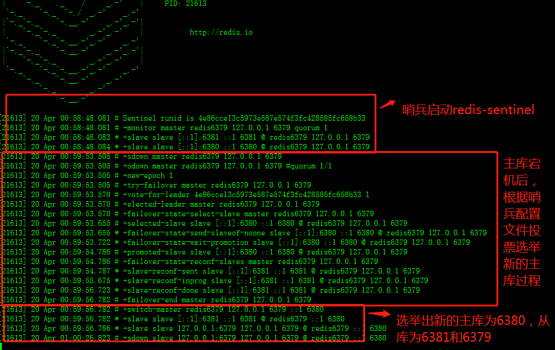

如果之前的master重启回来，会不会双master冲突？

不会，原主库也会slaveof 新主库，从上图日志可以看出。

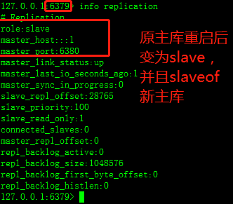

#### 12.1复制的缺点

```properties
由于所有写操作都现在master上操作，然后同步更新到slave上，所以从master同步到slave机器有一定延迟，当系统很繁忙的时候，延迟问题会更加严重，slave机器数量的增加也会使这个问题更严重。
```

### 13.redis的java客户端Jedis

#### 13.1Jedis连通测试

```java
1.所需jar包，jedis-2.9.0，commons-pool2-2.4.2
    使用maven构建项目，引入jedis依赖，会自动引入commons-pool依赖jar包
		<dependency>
            <groupId>redis.clients</groupId>
            <artifactId>jedis</artifactId>
            <version>2.9.0</version>
        </dependency>
 2.创建jedis客户端，测试是否可以连通
 public static void main(String[] args) {
        Jedis jedis = new Jedis("192.168.1.102",6379);
        System.out.println(jedis.ping());
    }
```

#### 13.2Jedis常用操作1个key+5个数据类型

```java
public class RedisTest2 {
    public static void main(String[] args) {
        Jedis jedis = new Jedis("192.168.1.102", 6379);
        //============key操作====================================
        //1)遍历所有的key
        Set<String> keys = jedis.keys("*");
        for (Iterator iterator = keys.iterator(); iterator.hasNext();) {
            String key = (String) iterator.next();
            System.out.println(key);
        }
        //2）判断是否有key2
        Boolean k2 = jedis.exists("k2");
        System.out.println(k2);
        //3)查看k1还有多久过期 -1永不过期
        System.out.println(jedis.ttl("k1"));

        //============String操作==================================
        jedis.append("k1", "fangyan");
        System.out.println(jedis.get("k1"));
        jedis.set("k4", "v4");
        jedis.mset("str1", "v1","str2", "v2", "str3", "v3");
        System.out.println(jedis.mget("k1", "str1", "str2"));

        //=============list操作===================================
        jedis.lpush("mylist", "v1", "v2", "v3");
        List<String> mylist = jedis.lrange("mylist", 0, -1);
        for (String e : mylist) {
            System.out.println(e);
        }

        //============set操作===================================
        jedis.sadd("orders", "jd001", "jd002", "jd003");
        Set<String> orders = jedis.smembers("orders");
        for(Iterator iterator = orders.iterator(); iterator.hasNext();){
            String str = (String) iterator.next();
            System.out.println(str);
        }
        jedis.srem("orders", "jd002");
        System.out.println(jedis.smembers("orders").size());

        //=====================hash操作=============================================
        jedis.hset("hash1", "username", "lisi");
        System.out.println(jedis.hget("hash1", "username"));
        Map<String,String> map = new HashMap<String,String>();
        map.put("telphone","13811814763");
        map.put("address","atguigu");
        map.put("email","abc@163.com");
        jedis.hmset("hash2", map);
        jedis.hmget("hash2", "telphone", "email");

        //======================zset操作==============================
        jedis.zadd("zset01", 60d, "v1");
        jedis.zadd("zset01", 70, "v2");
        jedis.zadd("zset01", 80, "v3");
        Set<String> zset01 = jedis.zrange("zset01", 0, -1);
        for(Iterator iterator = zset01.iterator(); iterator.hasNext();) {
            String str = (String) iterator.next();
            System.out.println(str);
        }
    }
}

```

#### 13.3Jedis事务操作

```java
//====================不加锁========================================================
public class JedisTransaction {
    public static void main(String[] args) {
        Jedis jedis = new Jedis("192.168.1.102", 6379);

        //监控key，如果该动了事务就被放弃
        /*3
     jedis.watch("serialNum");
     jedis.set("serialNum","s#####################");
     jedis.unwatch();*/

        Transaction transaction = jedis.multi();//被当作一个命令进行执行
        Response<String> response = transaction.get("serialNum");
        transaction.set("serialNum", "s002");
        response = transaction.get("serialNum");
        transaction.lpush("list3", "a");
        transaction.lpush("list3", "b");
        transaction.lpush("list3", "c");

        transaction.exec();
        //2 transaction.discard();
        System.out.println("serialNum***********" + response.get());
    }
}


//======================加锁===========================================================
public class JedisTrasaction2 {
    public static void main(String[] args) {
        boolean retValue = transMethod();
        System.out.println("main retValue-------: " + retValue);
    }


    public static boolean transMethod() {
        Jedis jedis = new Jedis("192.168.1.102", 6379);
        int balance;// 可用余额
        int debt;// 欠额
        int amtToSubtract = 10;// 实刷额度
        jedis.watch("balance");
        //jedis.set("balance","5");//此句不该出现，讲课方便。模拟其他程序已经修改了该条目
        balance = Integer.parseInt(jedis.get("balance"));
        if (balance < amtToSubtract) {
            jedis.unwatch();
            System.out.println("modify");
            return false;
        } else {
            System.out.println("***********transaction");
            Transaction transaction = jedis.multi();
            transaction.decrBy("balance", amtToSubtract);
            transaction.incrBy("debt", amtToSubtract);
            transaction.exec();
            balance = Integer.parseInt(jedis.get("balance"));
            debt = Integer.parseInt(jedis.get("debt"));
            System.out.println("*******" + balance);
            System.out.println("*******" + debt);
            return true;
        }
    }
}
```

#### 13.4jedis主从复制

```java
Jedis jedis_M = new Jedis("127.0.0.1", 6379);
Jedis jedis_S = new Jedis("127.0.0.1", 6380);
jedis_S.slaveof("127.0.0.1", 6379);
jedis_M.set("k6", "v6");
Thread.sleep(500);
System.out.println(jedis_S.get("k6"));
```

#### 13.5JedisPool

```java 
//说明：
//1.获取Jedis实例需要从JedisPool中获取；
//2.用完Jedis实例需要返还给JedisPool;
//3.如果Jedis在使用过程出错，则也需要还给JedisPool;

//***************************JedisPoolUtil****************************
public class JedisPoolUtil {
    private static volatile JedisPool jedisPool = null; //被volatile修饰的变量不会被本地线程缓存，对该变量的读写都是直接操作共享内存
    private JedisPoolUtil(){};

    //获得JedisPool实例对象
    public static JedisPool getJedisPoolInstance(){
        if (jedisPool == null) {
            synchronized (JedisPoolUtil.class) {
                if(jedisPool == null) {
                    JedisPoolConfig jedisPoolConfig = new JedisPoolConfig();
                    jedisPoolConfig.setMaxTotal(1000);
                    jedisPoolConfig.setMaxIdle(32);
                    jedisPoolConfig.setMaxWaitMillis(100*1000);
                    jedisPoolConfig.setTestOnBorrow(true);

                    jedisPool = new JedisPool(jedisPoolConfig, "192.168.1.102");
                }
            }
        }
        return jedisPool;
    }

    //归还jedis实例到JedisPool
    public static void release(JedisPool jedisPool, Jedis jedis){
        if(jedis != null) {
            jedisPool.returnResourceObject(jedis);
        }
    }
}

//************************测试使用JedisPool***********************************
public class RedisTest {
    public static void main(String[] args) {
        JedisPool jedisPool = JedisPoolUtil.getJedisPoolInstance();
        Jedis jedis = null;
        try {
            jedis = jedisPool.getResource();
            jedis.set("k18", "v18");
        }catch (Exception e){
            e.printStackTrace();
        }finally {
            JedisPoolUtil.release(jedisPool, jedis);
        }
    }
}
```

```java
JedisPool的配置参数大部分是由JedisPoolConfig的对应项来赋值的。
1.maxActive：
	控制一个pool可分配多少个jedis实例，通过pool.getResource()来获取；如果赋值为-1，则表示不限制；如果pool已经分配了maxActive个jedis实例，则此时pool的状态为exhausted。
	
2.maxIdle：
	控制一个pool最多有多少个状态为idle(空闲)的jedis实例；
whenExhaustedAction：表示当pool中的jedis实例都被allocated完时，pool要采取的操作；默认有三种。
 WHEN_EXHAUSTED_FAIL --> 表示无jedis实例时，直接抛出NoSuchElementException；
 WHEN_EXHAUSTED_BLOCK --> 则表示阻塞住，或者达到maxWait时抛出JedisConnectionException；
 WHEN_EXHAUSTED_GROW --> 则表示新建一个jedis实例，也就说设置的maxActive无用；
 
3.maxWait：
	表示当borrow一个jedis实例时，最大的等待时间，如果超过等待时间，则直接抛JedisConnectionException；

4.testOnBorrow：
	获得一个jedis实例的时候是否检查连接可用性（ping()）；如果为true，则得到的jedis实例均是可用的；

3.testOnReturn：
	return 一个jedis实例给pool时，是否检查连接可用性（ping()）；

4.testWhileIdle：
	如果为true，表示有一个idle object evitor线程对idle object进行扫描，如果validate失败，此object会被从pool中drop掉；这一项只有在timeBetweenEvictionRunsMillis大于0时才有意义；

5.timeBetweenEvictionRunsMillis：
表示idle object evitor两次扫描之间要sleep的毫秒数；

6.numTestsPerEvictionRun：
	表示idle object evitor每次扫描的最多的对象数；

7.minEvictableIdleTimeMillis：
	表示一个对象至少停留在idle状态的最短时间，然后才能被idle object evitor扫描并驱逐；这一项只有在timeBetweenEvictionRunsMillis大于0时才有意义；

8.softMinEvictableIdleTimeMillis：
	在minEvictableIdleTimeMillis基础上，加入了至少minIdle个对象已经在pool里面了。如果为-1，evicted不会根据idle time驱逐任何对象。如果minEvictableIdleTimeMillis>0，则此项设置无意义，且只有在timeBetweenEvictionRunsMillis大于0时才有意义；

9.lifo：
	borrowObject返回对象时，是采用DEFAULT_LIFO（last in first out，即类似cache的最频繁使用队列），如果为False，则表示FIFO队列；


==================================================================================================================
其中JedisPoolConfig对一些参数的默认设置如下：
testWhileIdle=true
minEvictableIdleTimeMills=60000
timeBetweenEvictionRunsMillis=30000
numTestsPerEvictionRun=-1
```

