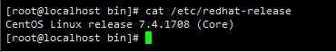
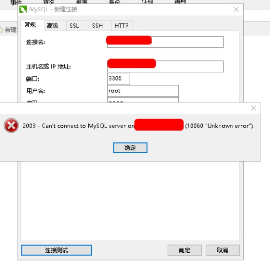
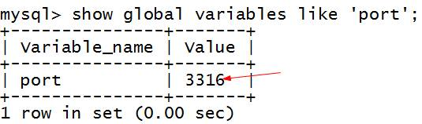
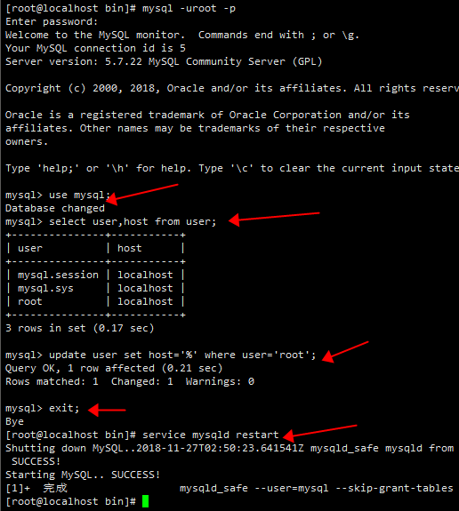
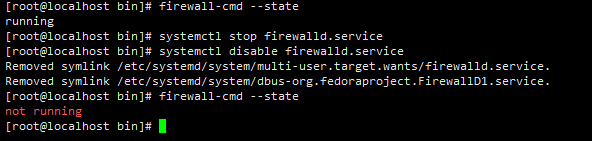
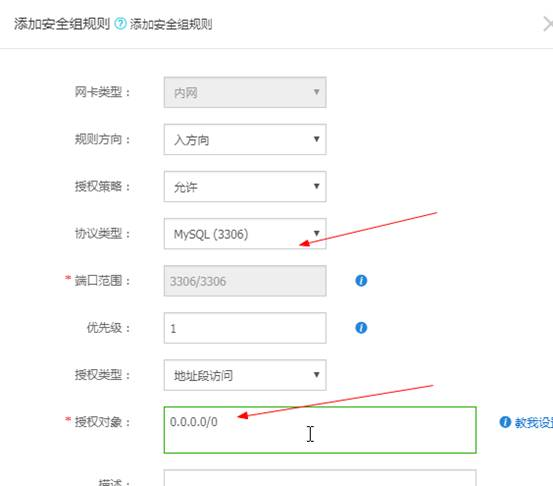

**安装手册** 

 说明：本文主要描述在centos7上安装mysql5.7.2。文中出现的/data/mysql 为本次安装mysql的目录，可以根据自己需要进行修改。最好将系统/etc/selinux/config文件中设置SELINUX=disabled

```properties
centos用户:root / fangyan
	   密码:123

MySQL用户root   密码:root

linux系统版本： CentOS 7.2 64位
安装源文件版本：mysql-5.7.22-linux-glibc2.12-x86_64.tar.gz

mysql安装位置：/software/mysql

数据库文件数据位置：/data/mysql

```


### 1.   压缩版安装

#### 1.1     查看操作系统版本

​	cat /etc/redhat-release

 

#### 1.2  安装前的环境准备 

查看是否安装过mysql

首先检测Linux操作系统中是否安装了MySQL：

​	rpm -qa | grep -i mysql 

卸载安装包

如果有信息出现，则进行删除，命令如下：

​	rpm -e --nodeps 包名 

删除老版本mysql的开发头文件和库 

​	rpm -e --nodeps 包名 

注意：卸载后/var/lib/mysql中的数据及/etc/my.cnf不会删除，如果确定没用后就手工删除： 

​	rm -f /etc/my.cnf

​	rm -fr /var/lib/mysql

删除完成后，才能进行安装，否则安装会出错。 

查看旧的mysql安装目录 

​	whereis mysql 

删除旧的安装目录 

​	rm -rf 目录 

新建目录 

 

A temporary password is generated for root@localhost: *frCJtD5wrtc

#### 1.3   安装过程

```properties
1、在根目录下创建文件夹software和数据库数据文件/data/mysql
#mkdir /software/
#mkdir /data/mysql

2、上传mysql-5.7.21-linux-glibc2.12-x86_64.tar.gz文件到/software下
#cd /software/
#tar -zxvf mysql-5.7.21-linux-glibc2.12-x86_64.tar.gz

3、更改解压缩后的文件夹名称
#mv /software/mysql-5.7.21-linux-glibc2.12-x86_64/  /software/mysql

4、创建mysql用户组和mysql用户
#groupadd mysql
#useradd -r -g mysql mysql

5、关联myql用户到mysql用户组中
#chown -R mysql:mysql  /software/mysql/
#chown -R mysql:mysql  /data/mysql/
#chown -R mysql  /software/mysql/
#chown -R mysql  /data/mysql

6、更改mysql安装文件夹mysql/的权限
#chmod -R 755 /software/mysql/

7、安装libaio依赖包，由于我买的腾讯云服务器centos系统自带的有这个依赖包所以不需要安装，不过自带的依赖包会报错，后面介绍解决办法
查询是否暗转libaio依赖包
#yum search libaio
如果没安装，可以用下面命令安装
#yum install libaio

8、初始化mysql命令
#cd /software/mysql/bin
#./mysqld --user=mysql --basedir=/software/mysql --datadir=/data/mysql --initialize
在执行上面命令时特别要注意一行内容   
[Note] A temporary password is generated for root@localhost: o*s#gqh)F4Ck
root@localhost: 后面跟的是mysql数据库登录的临时密码，各人安装生成的临时密码不一样
如果初始化时报错如下：
error while loading shared libraries: libnuma.so.1: cannot open shared objec
是因为libnuma安装的是32位，我们这里需要64位的，执行下面语句就可以解决
#yum install numactl.x86_64
执行完后重新初始化mysql命令

9、启动mysql服务
# sh /software/mysql/support-files/mysql.server start
上面启动mysql服务命令是会报错的，因为没有修改mysql的配置文件，报错内容大致如下：
./support-files/mysql.server: line 239: my_print_defaults: command not found
./support-files/mysql.server: line 259: cd: /usr/local/mysql: No such file or directory
Starting MySQL ERROR! Couldn't find MySQL server (/usr/local/mysql/bin/mysqld_safe)

10、修改Mysql配置文件
#vim /software/mysql/support-files/mysql.server
修改前
if test -z "$basedir"
then
basedir=/usr/local/mysql
bindir=/usr/local/mysql/bin
if test -z "$datadir"
then
datadir=/usr/local/mysql/data
fi
sbindir=/usr/local/mysql/bin
libexecdir=/usr/local/mysql/bin
else
bindir="$basedir/bin"
if test -z "$datadir"
then
datadir="$basedir/data"
fi
sbindir="$basedir/sbin"
libexecdir="$basedir/libexec"
fi

修改后

if test -z "$basedir"
then
basedir=/software/mysql
bindir=/software/mysql/bin
if test -z "$datadir"
then
datadir=/data/mysql
fi
sbindir=/software/mysql/bin
libexecdir=/software/mysql/bin
else
bindir="$basedir/bin"
if test -z "$datadir"
then
datadir="$basedir/data"
fi
sbindir="$basedir/sbin"
libexecdir="$basedir/libexec"
fi

保存退出

#cp /software/mysql/support-files/mysql.server  /etc/init.d/mysqld
#chmod 755 /etc/init.d/mysqld


11、修改my.cnf文件
#vi /etc/my.cnf
将下面内容复制替换当前的my.cnf文件中的内容
[client]
no-beep
socket =/software/mysql/mysql.sock
# pipe
# socket=0.0
port=3306
[mysql]
default-character-set=utf8
[mysqld]
basedir=/software/mysql
datadir=/data/mysql
port=3306
pid-file=/software/mysql/mysqld.pid
#skip-grant-tables
skip-name-resolve
socket = /software/mysql/mysql.sock
character-set-server=utf8
default-storage-engine=INNODB
explicit_defaults_for_timestamp = true
# Server Id.
server-id=1
max_connections=2000
query_cache_size=0
table_open_cache=2000
tmp_table_size=246M
thread_cache_size=300
#限定用于每个数据库线程的栈大小。默认设置足以满足大多数应用
thread_stack = 192k
key_buffer_size=512M
read_buffer_size=4M
read_rnd_buffer_size=32M
innodb_data_home_dir = /data/mysql
innodb_flush_log_at_trx_commit=0
innodb_log_buffer_size=16M
innodb_buffer_pool_size=256M
innodb_log_file_size=128M
innodb_thread_concurrency=128
innodb_autoextend_increment=1000
innodb_buffer_pool_instances=8
innodb_concurrency_tickets=5000
innodb_old_blocks_time=1000
innodb_open_files=300
innodb_stats_on_metadata=0
innodb_file_per_table=1
innodb_checksum_algorithm=0
back_log=80
flush_time=0
join_buffer_size=128M
max_allowed_packet=1024M
max_connect_errors=2000
open_files_limit=4161
query_cache_type=0
sort_buffer_size=32M
table_definition_cache=1400
binlog_row_event_max_size=8K
sync_master_info=10000
sync_relay_log=10000
sync_relay_log_info=10000
#批量插入数据缓存大小，可以有效提高插入效率，默认为8M
bulk_insert_buffer_size = 64M
interactive_timeout = 120
wait_timeout = 120
log-bin-trust-function-creators=1
sql_mode=NO_ENGINE_SUBSTITUTION,STRICT_TRANS_TABLES
#
# include all files from the config directory
#
!includedir /etc/my.cnf.d

保存退出

12、启动mysql
#/etc/init.d/mysqld start
新版本的安装包会报错，错误内容如下：
Starting MySQL.Logging to '/data/mysql/SZY.err'.
2018-07-02T10:09:03.779928Z mysqld_safe The file /usr/local/mysql/bin/mysqld
does not exist or is not executable. Please cd to the mysql installation
directory and restart this script from there as follows:
./bin/mysqld_safe&
See http://dev.mysql.com/doc/mysql/en/mysqld-safe.html for more information
ERROR! The server quit without updating PID file (/software/mysql/mysqld.pid).
因为新版本的mysql安全启动安装包只认/usr/local/mysql这个路径。
解决办法：
方法1、建立软连接
例 #cd /usr/local/mysql
#ln -s /sofware/mysql/bin/myslqd mysqld
方法2、修改mysqld_safe文件（有强迫症的同学建议这种，我用的这种）
# vim /software/mysql/bin/mysqld_safe
将所有的/usr/local/mysql改为/software/mysql
保存退出。（可以将这个文件拷出来再修改然后替换）

13、登录mysql
#/software/mysql/bin/mysql -u root –p

14、输入临时密码。临时密码就是第8条root@localhost:后面的内容

15、修改mysql的登录密码
>mysql   set password=password('root');
>mysql  grant all privileges on *.* to root@'%' identified by 'root';
>mysql flush privileges;

16、完成，此时mysql的登录名root  登录密码root
```


### 3      设置远程登录权限

#### 3.1    如果远程连接登录，会报错误的

 

#### 3.2确定mysql端口号

​	mysql> show global variables like 'port'; 

 

如果不是3306可进行修改mysql端口号 

\1. # vi /etc/my.cnf

\2. 修改 port=3306

\3. 重启 # service mysqld restart

#### 3.3修改远程连接权限

很简单，只需要修改user表中root用户的host就可以了。改完之后，记得重启一下服务，再次远程连接

\# mysql -uroot -p

mysql> use mysql;

mysql> update user set host='%' where user='root';

mysql> exit;

\# service mysqld restart

 "

#### 3.4关闭防火墙,

**CentOS7.x** 默认的防火墙不是ptables，而是firewalle.

查看防火墙状态（关闭后显示not running，开启后显示running）

\# *firewall*-*cmd* --*state*

停止防火墙firewall

\# systemctl stop firewalld.service

禁止防火墙firewall开机启动

\# systemctl disable firewalld.service

 

**CentOS6**默认的防火墙是iptables

1。防火墙即时生效，重启后复原：

关闭

\# service iptables stop

开启

\# service iptables start

2。防火墙永久性生效，重启后不会复原

关闭：

\# chkconfig iptables off

开启：

\# chkconfig iptables on

#### 3.5    阿里云添加安全组规则，开放端口号

官网手册: https://help.aliyun.com/document_detail/25471.html?spm=5176.100241.0.0.IneJPl 

 

 

 

### 4     设置mysql开机自启动

​	chkconfig mysqld on 