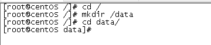

**安装手册** 

 说明：本文主要描述在centos7上安装mysql5.7.2。文中出现的/data/mysql 为本次安装mysql的目录，可以根据自己需要进行修改。最好将系统/etc/selinux/config文件中设置SELINUX=disabled

### 1.   压缩版安装

#### 1.1     查看操作系统版本

​	cat /etc/redhat-release

 

#### 1.2  安装前的环境准备 

查看是否安装过mysql

首先检测Linux操作系统中是否安装了MySQL：

​	rpm -qa | grep -i mysql 

卸载安装包

如果有信息出现，则进行删除，命令如下：

​	rpm -e --nodeps 包名 

删除老版本mysql的开发头文件和库 

​	rpm -e --nodeps 包名 

注意：卸载后/var/lib/mysql中的数据及/etc/my.cnf不会删除，如果确定没用后就手工删除： 

​	rm -f /etc/my.cnf

​	rm -fr /var/lib/mysql

删除完成后，才能进行安装，否则安装会出错。 

查看旧的mysql安装目录 

​	whereis mysql 

删除旧的安装目录 

​	rm -rf 目录 

新建目录 

 

#### 1.3   安装过程

安装前先准备好压缩安装包或者到mysq官网下载即可，将安装报上传至/data/目录下后解压 

​	cd /data

 

​	tar -zxvf 安装包 -C /data/ 

 

**目录名太长了，重命名为mysql** 

​	mv mysql-5.7.22-linux-glibc2.12-x86_64 mysql 

 

*在mysql下面新建目录data*

 

#### 1.4  查看mysql用户和组 如果存在，需要删除怎执行以下步骤

查看mysql用户或组是否存在 

​	id mysql 


如需删除用户和组，执行下列操作

\# groupdel mysql

\# userdel -f mysql 

不行就进入 vi /etc/grpup 找到mysql 在其前面加上 # 

如下，说明没有用户了 

 

#### 1.5     添加mysql用户组和用户，并且将mysql用户和mysql组关联

创建mysql组 

​	groupadd mysql

查看是否创建成功

​	cat /etc/**group |** grep mysql 

 

创建mysql用户 

​	useradd -r -g mysql mysql 

查看是否创建成功 

​	cat /etc/**passwd |** grep mysql 

 

给mysql用户设置密码为：mengxuegu1234 

​	passwd mysql 

 

#### 1.6 给mysql授权,以便能够读写以及执行必要的文件

\# chown -R mysql:mysql /data/mysql

\# chmod -R 775 /data/mysql

#### 1.7  进入mysql/support-files文件夹的内容，查看是否有my-default.cnf配置文件，如果没有默认的配置文件，需要手动创建一个my-default.cnf配置文件

\# cd /data/mysql/support-files/

\# ll

 

#### 1.8    my-default.cnf配置文件内容可直接复制下面内容：

```properties
[client]
port = 3306
socket = /tmp/mysql.sock
[mysqld]
basedir = /data/mysql
datadir = /data/mysql/data
bind-address = 0.0.0.0
port = 3306
socket = /tmp/mysql.sock
skip-external-locking
key_buffer_size = 128M
max_allowed_packet = 1M
table_open_cache = 256
sort_buffer_size = 1M
read_buffer_size = 1M
read_rnd_buffer_size = 2M
myisam_sort_buffer_size = 8M
thread_cache_size = 8
query_cache_size= 16M
max_connections = 213
wait_timeout = 31536000
interactive_timeout = 30
max_connect_errors = 9
long_query_time = 1
tmp_table_size = 16M
#log-bin=mysql-bin
#binlog_format=mixed
#server-id = 1
lower_case_table_names = 1
[mysqldump]
quick
max_allowed_packet = 8M
[mysql]
no-auto-rehash
[myisamchk]
key_buffer_size = 12M
sort_buffer_size = 1M
read_buffer = 1M
write_buffer = 1M
[mysqlhotcopy]
interactive-timeout
```

#### 1.9   重新授权

\# chown -R mysql:mysql /data/mysql

\# chmod -R 775 /data/mysql

#### 1.10 复制support-files文件下的my-default.cnf和mysql.server，如下：

\# cp my-default.cnf  /etc/**my**.cnf

\# cp mysql.server  /etc/init.d/mysqld

 

#### 1.11编辑mysqld，修改为mysql的指定路径

​	vi /etc/init.d/mysqld 

进入编辑页面，按i 可编辑修改，按ctrl+c停止修改，然后  **:wq** 保存修改 

 

#### 1.12     把mysql路径添加到环境变量中，方便操作命令：

\	# vi /etc/profile

文件末尾添加export MYSQL=/data/mysql，path中加入$MYSQL/bin:

 

#### 1.13    使修改后的profile文件生效:

​	source /etc/profile 

 

#### 1.14执行数据库初始化操作

执行文件为mysql下bin文件夹中mysql_install_db，basedir为安装目录，datadir为数据文件目录。注：mysql_install_db在5.6版本中位于scripts文件夹，5.7已经取消该文件夹，合并到bin下: 

​	cd /data/mysql/bin

​	./mysqld --basedir=/data/mysql --user=mysql --datadir=/data/mysql/data --initialize 

如果 报error while loading shared libraries: libaio.so.1: cannot open shared object file: No such file or directory

就需要 安装libaio

​	\# yum install libaio

如果报：[ERROR] --initialize specified but the data directory has files in it. Aborting 

 

说明已经执行过一次，需要把'/data/mysql/data目录删除，重新创建，再授权

[root@centOS mysql]# cd /data/mysql

[root@centOS mysql]# rm -rf data

[root@centOS mysql]# mkdir data

[root@centOS mysql]# chown -R mysql:mysql /data/mysql

[root@centOS mysql]# chmod -R 775 /data/mysql

[root@centOS mysql]#

 

然后再执行：

\#cd /data/mysql/bin

\# ./mysqld --basedir=/data/mysql --user=mysql --datadir=/data/mysql/data --initialize

 

以上安装成功效果 

#### 1.15      完成之后，启动mysql服务：

 	service mysqld start 

 

此时已经可以启动服务，但整个工程只算完成了一半。 

注意：新版的可能会报错，因为mysqld_safe的原因，旧版本安装的时候没有报错，只需要把mysqld_safe中的默认路径修改为自己的目标路径，再执行就可以了。


### 2      修改密码

#### 2.1首先关闭服务 

​	service mysqld stop

 

#### 2.2把mysql/bin/mysqld_safe中usr/local/mysql换成指定安装的路径名，然后执行下面代码

​	mysqld_safe --user=mysql --skip-grant-tables --skip-networking &

 

#### 2.3    此时已经进入免过滤状态，开始修改root密码。注：5.6版本user表中密码字段是password，5.7之后改为authentication_string，不再有password。

[root@ZhOu bin]# mysql

mysql> use mysql;

mysql> update user set authentication_string=PASSWORD('root') where user='root';

mysql> flush privileges;

mysql> exit;

 

#### 2.4   此时，密码已经修改完成。退出重新登录，本以为搞定了，但是创建数据库，却报错了，错误是：ERROR 1820 (HY000): You must reset your password using ALTER USER statement。原来第一登录，还要再次设置密码,修改之后，创建成功。

\# mysql -u root -p 

mysql> alter user 'root'@'localhost' identified by 'root';

mysql> flush privileges;

mysql> exit;

 

### 3      设置远程登录权限

#### 3.1    如果远程连接登录，会报错误的

 

#### 3.2确定mysql端口号

​	mysql> show global variables like 'port'; 

 

如果不是3306可进行修改mysql端口号 

\1. # vi /etc/my.cnf

\2. 修改 port=3306

\3. 重启 # service mysqld restart

#### 3.3修改远程连接权限

很简单，只需要修改user表中root用户的host就可以了。改完之后，记得重启一下服务，再次远程连接

\# mysql -uroot -p

mysql> use mysql;

mysql> update user set host='%' where user='root';

mysql> exit;

\# service mysqld restart

 "

#### 3.4关闭防火墙,

**CentOS7.x** 默认的防火墙不是ptables，而是firewalle.

查看防火墙状态（关闭后显示not running，开启后显示running）

\# *firewall*-*cmd* --*state*

停止防火墙firewall

\# systemctl stop firewalld.service

禁止防火墙firewall开机启动

\# systemctl disable firewalld.service

 

**CentOS6**默认的防火墙是iptables

1。防火墙即时生效，重启后复原：

关闭

\# service iptables stop

开启

\# service iptables start

2。防火墙永久性生效，重启后不会复原

关闭：

\# chkconfig iptables off

开启：

\# chkconfig iptables on

#### 3.5    阿里云添加安全组规则，开放端口号

官网手册: https://help.aliyun.com/document_detail/25471.html?spm=5176.100241.0.0.IneJPl 

 

 

 

### 4     设置mysql开机自启动

​	chkconfig mysqld on 