### 一、构建springboot项目入门

#### 1.使用spring初始化器创建springboot项目

#####1.1步骤

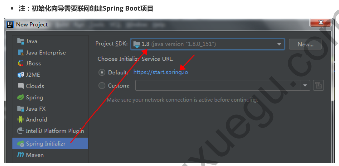

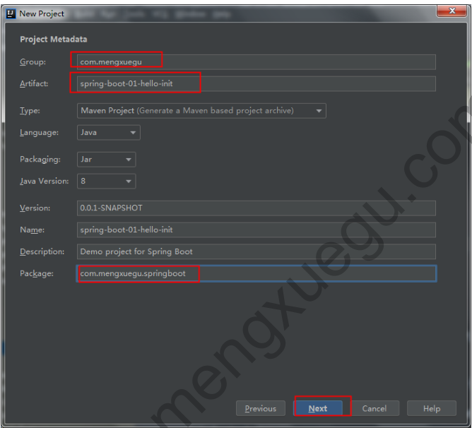

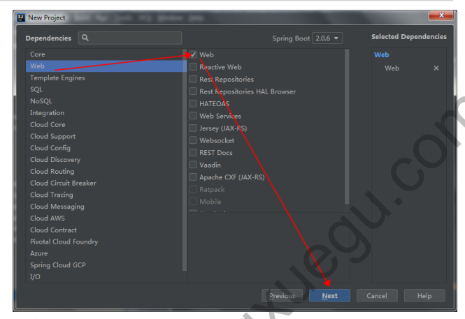

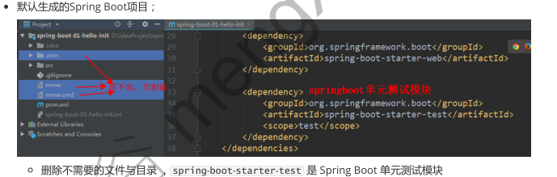

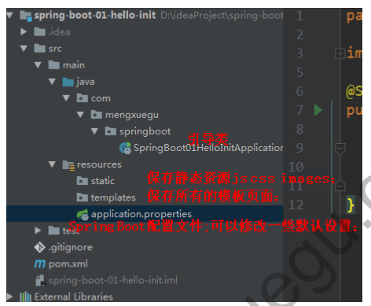

##### 1.2访问

```java
编写controller即可访问：（由于引入了web模块，支持springMVC）
默认端口号：8080   

@Controller
public class HelloController {
    @ResponseBody
    @RequestMapping("/hello")
    public String hello(){
        return "Hello World....";
    }
}
```

### 二、springboot核心配置

#### 1.springboot的配置文件类型(properties和yml)

```java
1.application.properties / application.yml
2.配置文件的作用：修改springboot的默认配置；
				springboot有很多默认配置，详见官网：
```

https://docs.spring.io/spring-boot/docs/2.0.6.RELEASE/reference/htmlsingle/#common-application-properties

#### 2.yml语法格式

```yaml
1.key: value 表示一对键值对（冒号后面必须有空格）
2.使用空格缩进表示层级关系，左侧缩进空格数不重要，只要同一层级元素左侧对其即可；
3.字符串默认不加引号
4.对象&Map
	一般写法：
		emp:
		  lastName: xiaomeng
		  age: 22
		  salary: 10000
	行内写法：
		emp: {lastName: xiaomeng, age: 22, salary: 10000}
		
5.数组（List & set）
	一般写法：
		fortes:
		  - java
		  - python
		  - hadoop
	行内写法：
		fortes: [java, python, hadoop]
```

**注意：properties中map和list的写法**

```properties
#对象&map
	emp.map.key1=value1
	emp.map.key2=value2
#list
	emp.list=one,two,three
```

#### 2.@ConfigurationProperties和@Value配置文件注入值的比较

**2.1@ConfigurationProperties配置文件注入值**

```java
@Component
@ConfigurationProperties(prefix = "emp")
public class Emp {
  private String lastName;
  private Integer age;
  private Double salary;
  private Boolean boss;
  private Date birthday;
  private Map map;
  private List list;
    ..getter&setter..
}
```

**2.2@Value配置文件注入值**

```java
  @Value("${emp.last-name}")
  private String lastName;
  @Value("#{10*2}")
  private Integer age;
  @Value("8000")
  private Double salary;
```

**2.3总结@Value 与 @ConfigurationProperties获取值差异**

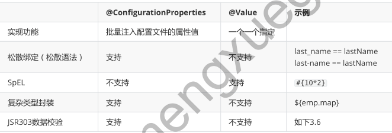

注：如果只是某个业务逻辑中需要获取配置文件某个属性值则使用@Value，如果专门使用Javabean和配置文件映射，则使用@ConfigurationProperties

#### 3.@PropertySource用于加载局部配置文件

```java
//PropertySource读取value指定的配置文件而非默认的配置文件
@PropertySource(value = {"classpath:emp.properties"})
@Component
@ConfigurationProperties(prefix = "emp")
@Validated
public class Emp {
  private String lastName;
  private Integer age;
  private Double salary;
  private Boolean boss;
  private Date birthday;
  private Map map;
  private List list;
  //特长
  private Forte forte;
```

#### 4.@ImportResource使用xml配置

```java
//将@ImportResource(locations = {"classpath:spring01.xml"})注解到配置类上，就会读取spring01.xml里面的配置
@ImportResource(locations = {"classpath:spring01.xml"})
@SpringBootApplication
public class SpringBoot02ConfigApplication {
  public static void main(String[] args) {
    SpringApplication.run(SpringBoot02ConfigApplication.class, args);
 }
}
```

#### 5.自定义配置类向容器注入组件

```java
/**
* @Configuration 用于标识当前类是一个配置类, 来表示对应的Spring配置文件
*/
@Configuration
public class EmpConfig {
  /**
  * @Bean 标识的方法用于向容器注入组件
  * 1. 方法的返回值就是注入容器中的组件对象,
  * 2. 方法名是这个组件对象的 id 值
  */
  @Bean
  public EmpService empService2() {
    System.out.println(" @Bean 注解已经将 EmpService 组件注入");
    return new EmpService();
 }
}

//总结：配置类的作用类似于application.xml，@Bean相当于<bean></bean>标示一个类注入到spring容器中，   方法名是<bean id="empService2">中id
```

#### 6.Profile多环境支持

**properties文件激活**

```
创建两个文件  application-dev.properties 与  application-prod.properties；
在主配置文件  application.properties 中指定  spring.profiles.active=dev，即可激活application-dev.properties文件；
```

**yml文件激活**

```yaml
#yaml支持多文档块方式 ---
server:
	port: 8081   # 默认端口号
spring:
    profiles:
        active: prod #激活哪个profile , 当前激活的是 dev 开发环境
---
server:
	port: 8082
spring:
	profiles: dev #指定属于哪个环境, dev 环境时使用
---
server:
	port: 8888
spring:
	profiles: prod #指定属于哪个环境, prod 环境时使用
```

#### 7.配置文件加载位置

```java
1.springboot启动时，会扫描以下位置的application.properties或application.yml作为默认配置文件：
2.高优先级的配置内容会覆盖低优先级的配置内容
```

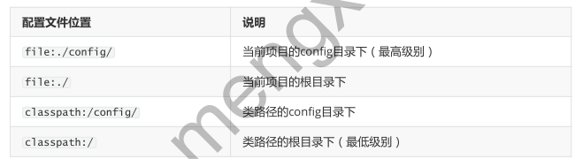

### 三、springboot日志配置

#### 1.slf4j+logback的组合形式

```
Spring Boot 采用了 slf4j+logback 的组合形式，Spring Boot也提供对JUL、log4j2、Logback提供了默认配置；
spring官网参考文档：
https://docs.spring.io/spring-boot/docs/2.0.6.RELEASE/reference/htmlsingle/#boot-features-logging
```

```properties
1.日志级别（低->高）：
	trace < debug < info < warn <error
2.springboot默认设置级别为info(也称root级别)
3.调整日志级别：
	3.1修改指定包下的日志级别：
		logging.level.com.fy=trace
	3.2设置root级别：
		logging.level.root=debug
```

#### 2.修改日志文件生成路径

**修改生成日志文件两种方式如下**

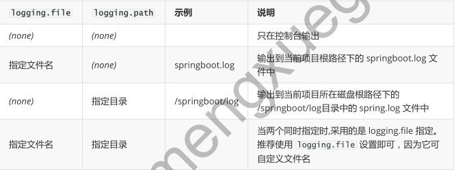

**示例：**

```properties
#输出到当前项目根路径下的springboot.log文件中
logging.file=springboot.log
#注：logging.file=D:/springboot.log 也可以将生成日志放入指定磁盘目录

#输出到当前项目所在的磁盘根路径下的/springboot/log目录中的spring.log文件中
logging.path=springboor/log

推荐使用logging.file可以指定路径和文件名，而logging.path不能指定文件名
```

#### 3.修改日志输出格式

```properties
#日志输出格式说明：
	# %d 输出日期时间，
	# %thread 输出当前线程名，
	# %-5level 输出日志级别，左对齐5个字符宽度，
	# %logger{50} 输出全类名最长50个字符，超过按照句点分割，
	# %msg 日志信息
	# %n 换行符
	
#修改控制台输出的日志格式
logging.pattern.console=%d{yyyy-MM-dd} [%thread] %-5level %logger{50} - %msg%n

#修改文件中输出的日志格式
logging.pattern.file=%d{yyyy-MM-dd HH:mm:ss.SSS} >>> [%thread] >>> %-5level >>>
%logger{50} >>> %msg%n
```

#### 4.自定义日志配置

1）在 spring-boot-2.0.6.RELEASE.jar! \org\springframework\boot\logging\logback\base.xml 做了日志的
默认配置

```xml
<included>
 <!--日志格式默认规定-->
 <include resource="org/springframework/boot/logging/logback/defaults.xml" />
 <!--日志文件默认生成路径-->
 <property name="LOG_FILE"
value="${LOG_FILE:-${LOG_PATH:-${LOG_TEMP:-${java.io.tmpdir:-/tmp}}}/spring.log}"/>
 <!--控制台日志信息默认配置-->
  <include resource="org/springframework/boot/logging/logback/console-appender.xml"
/>
 <!--文件中日志信息默认配置-->
 <include resource="org/springframework/boot/logging/logback/file-appender.xml" />
  <!--日志级别默认为： info -->
  <root level="INFO">
   <appender-ref ref="CONSOLE" />
   <appender-ref ref="FILE" />
 </root>
</included>
```

2)如果springboot的日志功能无法满足我们的需求（比如异步日志记录等），我们可以自己定义日志配置文件

```
在类路径下存放对应的日志框架配置文件即可，springboot 就不会使用它默认的日志配置了；
```

**在resource目录下创建logback.xml文件如下：**

```xml
<?xml version="1.0" encoding="UTF-8"?>
<!--梦学谷 www.mengxuegu.com

scan：当此属性设置为true时，配置文件如果发生改变，将会被重新加载，默认值为true。
scanPeriod：设置监测配置文件是否有修改的时间间隔，如果没有给出时间单位，默认单位是毫秒当scan为true时，此属性生效。默认的时间间隔为1分钟。
debug：当此属性设置为true时，将打印出logback内部日志信息，实时查看logback运行状态。默认值为false。
-->
<configuration scan="false" scanPeriod="60 seconds" debug="false">
    <!-- 定义日志的根目录 -->
    <property name="LOG_HOME" value="/logs/log" />
    <!-- 定义日志文件名称 -->
    <property name="appName" value="mengxuegu-spring-boot"></property>
    <!-- ch.qos.logback.core.ConsoleAppender 表示控制台输出 -->
    <appender name="stdout" class="ch.qos.logback.core.ConsoleAppender">
        <!--
			日志输出格式说明：
				    %d 		输出日期时间
				    %thread 输出当前线程名
				    %-5level  	输出日志级别，左对齐5个字符宽度
				    %logger{50} 输出全类名最长50个字符，超过按照句点分割
				    %msg  	日志信息
				    %n    	换行符
        -->
        <layout class="ch.qos.logback.classic.PatternLayout">
            <pattern>%d{yyyy-MM-dd HH:mm:ss.SSS} - [%thread] - %-5level - %logger{50} - %msg%n</pattern>
        </layout>
    </appender>

    <!-- 滚动记录文件，先将日志记录到指定文件，当符合某个条件时，将日志记录到其他文件 -->  
    <appender name="appLogAppender" class="ch.qos.logback.core.rolling.RollingFileAppender">
        <!-- 指定日志文件的名称 -->
        <file>${LOG_HOME}/${appName}.log</file>
        <!--
        当发生滚动时，决定 RollingFileAppender 的行为，涉及文件移动和重命名
        TimeBasedRollingPolicy： 最常用的滚动策略，它根据时间来制定滚动策略，既负责滚动也负责出发滚动。
        -->
        <rollingPolicy class="ch.qos.logback.core.rolling.TimeBasedRollingPolicy">
            <!--
				滚动时产生的文件的存放位置及文件名称 %d{yyyy-MM-dd}：按天进行日志滚动 
				%i：当文件大小超过maxFileSize时，按照i进行文件滚动
            -->
            <fileNamePattern>${LOG_HOME}/${appName}-%d{yyyy-MM-dd}-%i.log</fileNamePattern>
            <!-- 
            可选节点，控制保留的归档文件的最大数量，超出数量就删除旧文件。
			假设设置每天滚动，且maxHistory是365，则只保存最近365天的文件，删除之前的旧文件。
			注意，删除旧文件是，那些为了归档而创建的目录也会被删除。
            -->
            <MaxHistory>365</MaxHistory>
            <!-- 
            当日志文件超过maxFileSize指定的大小是，根据上面提到的%i进行日志文件滚动 注意此处配置SizeBasedTriggeringPolicy是无法实现按文件大小进行滚动的，必须配置timeBasedFileNamingAndTriggeringPolicy
            -->
            <timeBasedFileNamingAndTriggeringPolicy class="ch.qos.logback.core.rolling.SizeAndTimeBasedFNATP">
                <maxFileSize>100MB</maxFileSize>
            </timeBasedFileNamingAndTriggeringPolicy>
        </rollingPolicy>
        <!-- 日志输出格式： -->     
        <layout class="ch.qos.logback.classic.PatternLayout">
            <pattern>%d{yyyy-MM-dd HH:mm:ss.SSS} [ %thread ] - [ %-5level ] [ %logger{50} : %line ] - %msg%n</pattern>
        </layout>
    </appender>

    <!-- 
		logger主要用于存放日志对象，也可以定义日志类型、级别
		name：表示匹配的logger类型前缀，也就是包的前半部分
		level：要记录的日志级别，包括 TRACE < DEBUG < INFO < WARN < ERROR
		additivity：作用在于children-logger是否使用 rootLogger配置的appender进行输出，
		false：表示只用当前logger的appender-ref，true：
		表示当前logger的appender-ref和rootLogger的appender-ref都有效
    -->
    <!-- hibernate logger -->
    <logger name="com.mengxuegu" level="debug" />
    <!-- Spring framework logger -->
    <logger name="org.springframework" level="debug" additivity="false"></logger>


    <!-- 
    root与logger是父子关系，没有特别定义则默认为root，任何一个类只会和一个logger对应，
    要么是定义的logger，要么是root，判断的关键在于找到这个logger，然后判断这个logger的appender和level。 
    -->
    <root level="info">
        <appender-ref ref="stdout" />
        <appender-ref ref="appLogAppender" />
    </root>
</configuration> 
```

### 四、springboot的web开发

web开发官方文档：

https://docs.spring.io/spring-boot/docs/2.0.6.RELEASE/reference/htmlsingle/#boot-features-spring-mvc

#### 1.web开发支持

```java
1.springboot的web启动器spring-boot-starter-web依赖了spring-boot-starter-tomcat，spring-web，spring-webmvc从而达到内嵌的servlet和springmvc的支持，直接便可以进行web开发；
```

#### 2.静态资源的映射规则

**对静态资源的映射规则可以通过分析WebMvcAutoConfiguration自动配置类得到**

##### 2.1webjars静态资源映射

在 WebMvcAuotConfiguration.addResourceHandlers() 分析webjars 资源映射

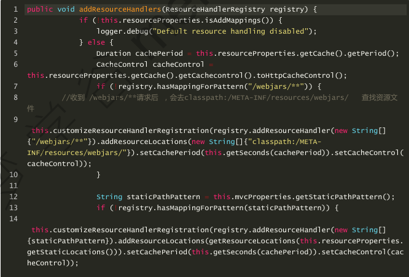

```xml
1.所有/webjars/**请求都去classpath:/META-INF/resources/webjars/目录下寻找对应资源；
2.webjars:以jar包的方式引入静态资源；
	webjars官网： https://www.webjars.org/
3.在官网打开资源文件的依赖配置信息，然后粘贴到pom.xml中
	<!--引入 jquery webjars-->
    <dependency>
      <groupId>org.webjars</groupId>
      <artifactId>jquery</artifactId>
      <version>3.3.1</version>
    </dependency>
4.访问localhost:8080/webjars/jquery/3.3.1/jquery.js会在下面路径中查找：
```

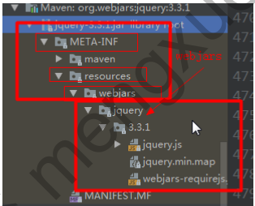

##### 2.2其他静态资源映射

当接受到/**请求访问资源时，会被映射到下面4个类路径下的静态资源目录中查找

```properties
classpath:/META-INF/resources/
classpath:/resources/
classpath:/static/
classpath:/public/


#说明:这些在springboot的webMvcAutoConfiguration自动配置类中定义好了静态资源访问规则,而在springMVC框架中需要手动在springmvc.xml文件中配置静态资源访问路径,目的是让前端控制器可以直接访问
#示例:<mvc:resources location="/static/" mapping="/static/**"></mvc:resources>
```

访问 localhost:8080/style.css 会在上面四个静态资源路径 中查找文件

##### 2.3欢迎页映射

访问localhost:8080/ 会在下面5个路径中查找index.html页面；

```properties
classpath:/META-INF/resources/
classpath:/resources/
classpath:/static/
classpath:/public/
/: 当前项目根路径下
```

##### 2.4图标映射

```properties
springboot会在静态资源目录下与根路径下查找favicon.ico文件，如果存在，springboot会自动将其设置为应用图标；

classpath:/META-INF/resources/
classpath:/resources/
classpath:/static/
classpath:/public/
/: 当前项目根路径下
```

#### 3.Thymeleaf模板引擎

##### 3.1Thymeleaf引入和使用

1.引入Thymeleaf

```xml
<!-- thymeleaf 模板启动器 -->
<dependency>
  <groupId>org.springframework.boot</groupId>
  <artifactId>spring-boot-starter-thymeleaf</artifactId>
</dependency>
```

2.使用Thymeleaf

**模板放在哪里**

```java
@ConfigurationProperties(   prefix = "spring.thymeleaf" )
public class ThymeleafProperties {
  private static final Charset DEFAULT_ENCODING;
  public static final String DEFAULT_PREFIX = "classpath:/templates/";
  public static final String DEFAULT_SUFFIX = ".html";
    
    
//通过上面源码发现，将HTML页面放在classpath:/templates/目录下，thymeleaf能自动渲染
```

**导入Thymeleaf的名称空间**

```html
<!--导入名称空间后可以使用th: 的语法-->
<html xmlns:th="http://www.thymeleaf.org">
```

##### 3.2Thymeleaf语法

**1）常用属性**

| 优先级 | 属性名                                     | 作用                                                         |
| :----: | ------------------------------------------ | ------------------------------------------------------------ |
|   1    | th:insert <br>th:replace                   | 引入片段，与th:fragment声明组合使用；类似于jsp:include       |
|   2    | th:each                                    | 遍历，类似于c:forEach                                        |
|   3    | th:if<br>th:unless<br>th:swith<br>th:case  | 条件判断，类似于c:if                                         |
|   4    | th:object<br>th:with                       | 声明变量                                                     |
|   5    | th:attr<br>th:attrprepend<br>th:attrappend | 修改任意属性，prepend前面追加,append后面追加                 |
|   6    | th:value<br>th:href<br>th:src              | **修改任意HTML原生属性值**                                   |
|   7    | th:text<br>th:utext                        | 修改标签体中的内容；<br>th:text转义特殊字符，即h1标签以文本显示出来<br>th:utext是不转义特殊字符，即h1标签展现出来的本来的效果 |
|   8    | th:fragment                                | 声明片段                                                     |
|   9    | th:remove                                  | 移除片段                                                     |

**2）标准表达式语法**

参考 Thymeleaf 官方文档  4 Standard Expression Syntax

```properties
一、Simple expressions（表达式语法）
 1. Variable Expressions(变量表达式): ${...} （参考： 4.2 Variables）
 1)、获取变量值；使用OGNL表达式；
 2）、获取对象的属性, 调用方法
 3）、使用内置的基本对象：
     #ctx : the context object.(当前上下文对象)
     #vars: the context variables.(当前上下文里的变量)
     #locale : the context locale. (当前上下文里的区域信息)
     下面是Web环境下的隐式对象
     #request : (only in Web Contexts) the HttpServletRequest object.
     #response : (only in Web Contexts) the HttpServletResponse object.
     #session : (only in Web Contexts) the HttpSession object.
     #servletContext : (only in Web Contexts) the ServletContext object.
     示例: ${session.foo} (用法参考: 18 Appendix A: Expression Basic Objects)
     
    4）、使用内置的工具对象：(用法参考: 19 Appendix B: Expression Utility Objects)
     #execInfo : information about the template being processed.
     #messages : methods for obtaining externalized messages inside variables
expressions, in the same way as they would be obtained using #{…} syntax.
     #uris : methods for escaping parts of URLs/URIs
     #conversions : methods for executing the configured conversion service (if
any).
     #dates : methods for java.util.Date objects: formatting, component
extraction, etc.
     #calendars : analogous to #dates , but for java.util.Calendar objects.
     #numbers : methods for formatting numeric objects.
     #strings : methods for String objects: contains, startsWith,
prepending/appending, etc.
     #objects : methods for objects in general.
     #bools : methods for boolean evaluation.
     #arrays : methods for arrays.
     #lists : methods for lists.
     #sets : methods for sets.
     #maps : methods for maps.
     #aggregates : methods for creating aggregates on arrays or collections.
     #ids : methods for dealing with id attributes that might be repeated (for
example, as a result of an iteration).  
     
 2. Selection Variable Expressions(选择表达式): *{...}
 （参考：4.3 Expressions on selections）
 1）、和${}在功能上是一样， 额外新增：配合 th:object 使用
     <div th:object="${session.user}">
     省得每次写${session.user.firstName}, 直接取出对象，然后写对象名即可
       <p>Name: <span th:text="*{firstName}">Sebastian</span> </p>
       <p>Email: <span th:text="*{email}">Saturn</span> </p>
     </div>
 3. Message Expressions（获取国际化内容）: #{...}  （参考：4.1 Messages）
 	4. Link URL Expressions（定义URL）: @{...} （参考：4.4 Link URLs）
 5. Fragment Expressions（片段引用表达式）: ~{...} （参考：4.5 Fragments）
 <div th:insert="~{commons :: main}">...</div>
二、Literals（字面量） （参考： 4.6 Literals）
 1. Text literals: 'one text' , 'Another one!' ,…
 2. Number literals: 0 , 34 , 3.0 , 12.3 ,…
 3. Boolean literals: true , false
 4. Null literal: null
 5. Literal tokens: one , sometext , main ,…
三、Text operations（文本操作） （参考： 4.7 Appending texts）
 1. String concatenation: +
 2. Literal substitutions: |The name is ${name}|
 
四、Arithmetic operations（数学运算） （参考： 4.9 Arithmetic operations）
 1. Binary operators: + , - , * , / , %
 2. Minus sign (unary operator): -
五、Boolean operations（布尔运算）
 1. Binary operators: and , or
 2. Boolean negation (unary operator): ! , not
 
五、Comparisons and equality（比较运算）  （参考： 4.10 Comparators and Equality）
 1. Comparators: > , < , >= , <= ( gt , lt , ge , le )
 2. Equality operators:  == , != ( eq , ne )
 
六、Conditional operators(条件表达式;三元运算符) （参考： 4.11 Conditional expressions）
 1. If-then: (if) ? (then)
 2. If-then-else: (if) ? (then) : (else)
 3. Default: (value) ?: (defaultvalue)
七、Special tokens（特殊操作） (参考： 4.13 The No-Operation token)
 1. No-Operation: _
```

##### 3.3实例代码演示

###### 3.3.1声明与引入公共片段

```html
<!--header.html-->
<body>
  <!--声明公共片段-->
  <!-- 方式1：-->
  <div th:fragment="header_common">
   这是th:fragment声明公共片段
  </div>
  <!-- 方式2：选择器写法-->
  <div id="header_common_id">
   这是id选择器声明公共片段
  </div>
</body>

<!--success.html-->
<!-- success.html 引入头部公共片段   -->
<!--方式1：
  header : 公共片段所在模板的文件名
  header_common ：声明代码片段名 -->
<div th:replace="header :: header_common"></div>
<!--方式2：选择器写法
  header : 公共片段所在模板的文件名
  #header_common_id: 声明代码片的id值
-->
<div th:replace="header :: #header_common_id"></div>


<!--
  th:insert 和 th:replace的区别
    th:insert和th:replace都可以引入片段，两者的区别在于
    th:insert： 保留引入时使用的标签
    th:replace：不保留引入时使用的标签, 将声明片段直接覆盖当前引用标签
-->
<h2 th:insert="header :: #header_common_id"></h2>
```

###### 3.3.2迭代th:each 

```html
<!--1.常用迭代方式-->
    <tr th:each="user : ${userList}">
        <!--每次迭代都会生成一个当前标签-->
    	<td th:text="${user.name}"></td>
    </tr>

    <ul>
      <!--方式2：-->
      <!--作用在同一个标签上， 每次迭代生成一个当前标签-->
      <li th:each="user : ${userList}" th:text="${user.name}"></li>
    </ul>

<!--获取迭代状态 th:each="user, iterStat : ${userList}"-->
<!--
    user :   第1个值,代表每次迭代出对象,名字任意取
    iterStat : 第2个值,代表每次迭代器内置对象, 名字任意取, 并有如下属性:
    index : 当前迭代下标 0 开始
    count : 当前迭代下标 1 开始
    size : 获取总记录数
    current : 当前迭代出的对象
    even/odd : 当前迭代是偶数还是奇数 (1开始算,返回布尔值)
    first : 当前是否为第一个元素
    last : 当前是否为最后一个元素
  -->
  <tr th:each="user, iterStat : ${userList}">
    <td th:text="${iterStat.count}">0</td>
    <td th:text="${user.username}">mengxuegu</td>
    <td th:text="${user.gender == 1 ? '女' : '男'}">未知</td>
    <td th:text="${iterStat.size}">0</td>
    <td th:text="${iterStat.even}? '偶数' : '奇数'"></td>
    <td th:text="${iterStat.first}"></td>
    <td th:text="${iterStat.last}"></td>
  </tr>
```

###### 3.3.3条件判断

**th:if**

```html
<h3 th:if="not ${#lists.isEmpty(userList)}">th:if判断,如果此文字显示说明有值</h3>
<h3 th:unless="${#lists.isEmpty(userList)}">th:unless判断,如果此文字显示说明有值</h3>

<!--
说明：1.th：if 不仅判断返回值为true的表达式，还判断一些特殊的表达式。
		如果值为null，则返回false；
		如果值不为null，以下情况均返回true：
			1）如果值是boolean类型并且返回true；
			2）如果值是数值类型并且不为0；
			3）如果值是字符串类型并且不为可空；
			4）如果值是字符串并且内容不是"false","off","no";
			5)如果值不是上述类型也返回true；
	2.th:unless与th:if作用正好相反。
-->
```

**th:swith  th:case**

```html
<div th:switch="${sex}">
  <!--1女, 2男-->
  <p th:case="1">女</p>
  <!--判断sex的值和下面取出man的值是否相等,相等则显示-->
  <p th:case="${man}">男</p>
  <!--如果值都不在上述case里，则th:case="*"语句生效。-->
  <p th:case="*">未知</p>
</div>
```

###### 3.3.4th:object直接取出对象

**使用th:object直接取出对象，然后写对象里的属性名即可获取属性值**

```html
<!--使用th:object 直接取出对象，然后写对象里的属性名即可获取属性值-->
<div th:object="${session.user}">
  <p>
   姓名:<span th:text="*{username}">xxxx</span>
  </p>
  <p>
   性别:<span th:text="*{gender == 1 ? '女' : '男'}">xxxx</span>
  </p>
</div>
```

##### 3.4springboot热部署

步骤：

1. 在springboot开发环境下禁用模板缓存

   ```properties
   #开发环境下关闭thymeleaf模板缓存，thymeleaf默认是开启状态
   spring.thymeleaf.cache=false
   ```

2. 添加springboot Devtools热部署依赖

```xml
<!--热部署-->
<dependency>
  <groupId>org.springframework.boot</groupId>
  <artifactId>spring-boot-devtools</artifactId>
</dependency>
```

3. idea和eclipse不同，idea需要做小调整

```
1.在eclipse中，修改完文件后要手动保存，他就会自动编译，就会触发热部署现象；
2.在idea中，修改完文件后自动保存，默认不会自动编译文件，需要手动编译'ctrl+F9'
```

#### 4.分析springmvc自动配置WebMvcAutoConfiguration

springboot为springmvc提供了适用于多数应用的自动配置功能（WebMvcAutoConfiguration）.

在spring默认配置基础上，自动配置添加了以下特性：

1. *引入ContentNegotiatingViewResolver和BeanNameViewResolver beans*

- 自动配置了视图解析器ViewResolver(根据方法返回值获取视图对象view,视图对象决定如何渲染?重定向or转发)   (springMVC框架中配置视图解析器配置在springmvc.xml中)

* ContentNegotiatingViewResolver:组合所有的视图解析器(通过源码分析出)

  ```java
  public class ContentNegotiatingViewResolver
   //146    
   public View resolveViewName(String viewName, Locale locale) throws Exception {
    RequestAttributes attrs = RequestContextHolder.getRequestAttributes();
    Assert.state(attrs instanceof ServletRequestAttributes
          , "No current ServletRequestAttributes");
    List<MediaType> requestedMediaTypes =
      this.getMediaTypes(((ServletRequestAttributes)attrs).getRequest());
    if (requestedMediaTypes != null) {
      //选择所有候选的视图对象
      List<View> candidateViews = this.getCandidateViews(viewName, locale,
                               requestedMediaTypes);
      //从候选中选择最合适的视图对象
      View bestView = this.getBestView(candidateViews, requestedMediaTypes,
                      attrs);
     
   //存入所有视图解析器
   private List<ViewResolver> viewResolvers;
   107
   protected void initServletContext(ServletContext servletContext) {
      Collection<ViewResolver> matchingBeans =
        BeanFactoryUtils.beansOfTypeIncludingAncestors(
        //从容器中获取所有的视图解析器
        this.obtainApplicationContext(), ViewResolver.class).values();
  ```

  * 自定义视图解析器:可以@Bean向容器中添加一个我们自定义的视图解析器,即可被容器管理使用

    ```java
    @Bean
    public ViewResolver myViewResolver () {
    return new MyViewResolver();
    }
    private  class MyViewResolver implements ViewResolver {
      @Override
      public View resolveViewName(String s, Locale locale) throws Exception {
      return null;
     }
    }
    ```

2. 自动注册[^Converter],[^GenericConvert],and [^Formatter]beans.

   * converter 转换器;如:如文本类型转换为目标类型,true转Boolean类型;

   * GenericConvert: 转换器,spring内部在注册时,会将Converter先转为GenericConverter之后,再统一对GenericConverter注册.
   * Formatter: 格式化器;如:2017/12/17格式化Date类型;

```java
@Bean
public FormattingConversionService mvcConversionService() {
  //传入日期格式， spring.mvc.date-format配置日期格式
  WebConversionService conversionService =
    new WebConversionService(this.mvcProperties.getDateFormat());
  this.addFormatters(conversionService);
  return conversionService;
}
//将格式化器添加容器中
protected void addFormatters(FormatterRegistry registry) {
  this.configurers.addFormatters(registry);
}
```

3. 对HttpMessageConverters的支持
   * springmvc用它来转换Http请求和响应的; User_json  User_xml
   * 可以通过@Bean向容器中添加一个我们自定义的HttpMessageConverters,就可以被容器管理使用了;

4.自动注册MessageCodesResolver

* 定义错误代码生成规则

5. 自动注册ConfigurableWebBindingInitializer
   * 初始化所有web数据绑定器对象,比如  请求数据-->Javabean
6. 对静态资源的支持,包括对webjars的支持;
7. 对静态首页index.html的支持;
8. 对自定义Favicon图标的支持;

***

1. 如果想保留springbootMVC的特性,而且还想扩展新的功能(拦截器,格式化器,视图控制器等),你可以在你自定义的webMvcConfigurer类上增加@Configuration注解;
2. 如果你想全面控制springmvc(也就是不使用默认配置),你可以自定义的web配置类上添加@Configuration和@EnableWebMvc注解;

#### 5.扩展springMvc功能

**xml方式扩展一个视图解析器功能**

```xml
<!--配置视图解析器-->
<mvc:view-controller path="/mengxuegu" view-name="success"/>
<!--配置拦截器-->
<mvc:interceptors>
  <mvc:interceptor>
    <mvc:mapping path="/*"/>
    <bean id="intercept" class="实现Interceptor接口的类的完全限定名"></bean>
  </mvc:interceptor>
</mvc:interceptors>
```

注意:配合@ImportResource注解使用

###### 5.1@Configuration扩展mvc功能

由于springboot不建议使用xml配置,因此写配置类来实现

**自定义配置类保留了所有的自动配置,也能扩展我们的功能**

```java
/* 
1.自定义配置类实现WebMvcConfigurer
2.注解@Configuration
3.重写addViewControllers方法,自己新添加视图解析器供容器管理
*/
@Configuration
public class MySpringMvcConfigurer implements WebMvcConfigurer{
@Override
  public void addViewControllers(ViewControllerRegistry registry) {
   // super.addViewControllers(registry);
    //发送 /mengxuegu 请求来到 success.html
    registry.addViewController("/mengxuegu").setViewName("success");
 }
}

//说明:实现一个类时ctl+o可以查看所有可以重写的方法
```

#####5.2@EnableWebMvc全面控制springmvc

```java
/*
使用@Configuration注解,springboot提供的WebMvcAutoConfiguration中默认mvc的配置全部失效
*/
@EnableWebMvc
@Configuration
public class MySpringMvcConfigurer implements WebMvcConfigurer{
@Override
  public void addViewControllers(ViewControllerRegistry registry) {
   // super.addViewControllers(registry);
      //发送 /mengxuegu 请求来到 success.html
    registry.addViewController("/mengxuegu").setViewName("success");
 }
}


/*原理:@EnableWebMvc 将  WebMvcConfigurationSupport 组件导入进来, 使得 WebMvcAutoConfiguration就失效了;
而在 WebMvcAutoConfiguration 上使用了@ConditionalOnMissingBean(WebMvcConfigurationSupport.class),意思是如果没有WebMvcConfigurationSupport,该类才生效
具体源码分析见文档
*/
```

### 五 web项目实战-账单管理系统

**默认前端已经开发好前端页面**

#### 1.初始化项目

##### 1.1创建并引入项目资源

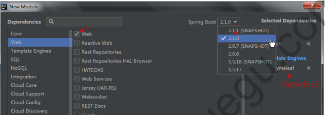

选择web+thymeleaf

##### 1.2Thymeleaf修改资源路径

优点:使用[^th:href]修改资源路径,  可以自动获取应用名

```xml
<script th:src="@{/js/js.js}" src="../js/js.js"></script>
# 上面会自动获取到应用名 /bill
server.servlet.context-path=/bill

# 说明:如果不配置应用名 则src="/js/js.js"也能获取静态资源,因为springboot已经配置了静态资源访问规则,只要静态资源在resource/static下

```

##### 1.3Thymeleaf引入片段时传入参数

```html
<div th:replace="main/public :: #public_left(activeUri='provider')">
</div>
<!--引入template/main/public.html文件的id='public'的代码片段,并传入参数activeUri='provider'-->

<!--public.html可以通过el表达式接收参数-->
<li th:id="${activeUri == 'provider' ? 'active' : ''}"></li>
```

##### 1.4更改图标和默认访问欢迎页

**1.更改图标**

```properties
classpath:/META-INF/resources/
classpath:/resources/
classpath:/static/
classpath:/public/
/: 当前项目根路径下

在以上路径下添加图标favicon.ico即可使用
```

**2.默认访问欢迎页是login.html**

```java 
//新建自定义配置类,方法内部返回实现WebMvcConfigurer的类,该类增加了自定义视图解析器
//让WebMvcConfigurer被spring容器管理,由于内部自定义了视图解析器,springboot默认的mvc配置类WebMvcAutoConfiguration会检测到自定义控制器并使用它
@Configuration
public class MySpringMvcConfigurer {
  @Bean
  public WebMvcConfigurer webMvcConfigurer() {
    return new WebMvcConfigurer(){
      //添加视图控制
      @Override
      public void addViewControllers(ViewControllerRegistry registry) {
        registry.addViewController("/").setViewName("main/login");
        registry.addViewController("/index.html").setViewName("main/login");
     }
   };
 }
}
```

#### 2.国际化信息

##### 2.1springboot国际化步骤

**1.编写国际化配置文件,需要显示的国际内容写到配置中**

```properties
#类路径下创建 i18n 目录存放配置文件(i18n 是“国际化”的简称)
login.properties  (默认国际化文件)
#login_语言代码_国家代码.propertis
login_zh_CN.properties (中文_中国 国际化文件)
login_en_US.properties (英文_美国 国际化文件)
```

*注意:先修改properties问价的字符编码,不然会出现乱码*

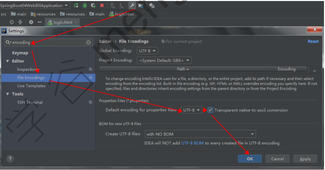

*类路径下创建i18n目录存放配置文件(右键i18n选择new->resource bundle可以同时新建和编写多个properties文件)*

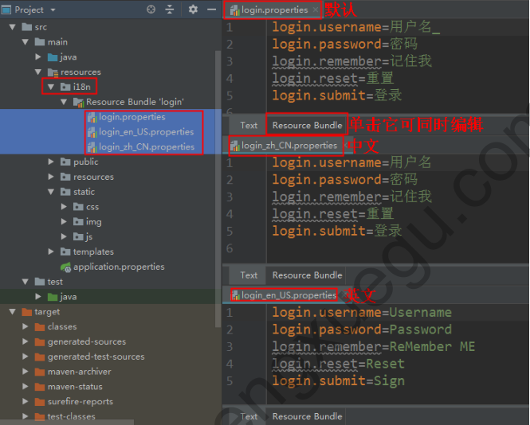

**2.登录页面中通过#{}获取国际化值**

```HTML
<div class="inputbox">
      <label for="user" th:text="#{login.username}">Username</label>
      <input id="user" type="text" name="username" required/>
    </div>
    <div class="inputbox">
      <label for="mima" th:text="#{login.password}">Password</label>
      <input id="mima" type="password" name="password" required/>
    </div>
    <div class="subBtn">
     Thymeleaf 行内表达式双中括号[[表达式]]（参考12 Inlining）
      <input type="checkbox" /> [[#{login.remember}]]
    </div>
    <br/>
    <div class="subBtn">
      <input type="submit" th:value="#{login.submit}" value="登录" />
      <input type="reset" th:value="#{login.reset}" value="重置"/>
    </div>
```

**3.全局配置文件添加spring.messages.basename = i18n.login,会自动读取i18n.login文件作为国际化信息**

```
说明:springboot 已经自动配置了管理国际化资源文件的组件  MessageSourceAutoConfiguration,该配置类中定义了,会自动寻找类路径下的国际化资源文件的基础名为  messages,如果找到就直接使用,无需配置,因为spring.messages.basename默认为messages 
```

##### 2.2切换国际化

**1.分析切换国际化原理**

* 原理 : LocaleResolver 获取区域信息对象, 来切换国际化信息 (区域信息就是像  zh_CN /  en_US )

```java
public class WebMvcAutoConfiguration {
@Bean
@ConditionalOnMissingBean//如果容器中有LocaleResolver实例,则不使用该默认实例
@ConditionalOnProperty(prefix = "spring.mvc", name = {"locale"})
public LocaleResolver localeResolver() {
  if (this.mvcProperties.getLocaleResolver() == LocaleResolver.FIXED) {
    return new FixedLocaleResolver(this.mvcProperties.getLocale());
 } else {
    //1. 根据请求头来获取区域信息
    AcceptHeaderLocaleResolver localeResolver = new
AcceptHeaderLocaleResolver();
    localeResolver.setDefaultLocale(this.mvcProperties.getLocale());
    return localeResolver;
 }
}
 
//2. 请求头区域信息解析器
public class AcceptHeaderLocaleResolver implements LocaleResolver {  
public Locale resolveLocale(HttpServletRequest request) {
  public Locale resolveLocale(HttpServletRequest request) {
    Locale defaultLocale = this.getDefaultLocale();
    //
    if (defaultLocale != null && request.getHeader("Accept-Language")==null){
      return defaultLocale;
   } else {
      //3. 获取当前收到的请求区域信息, 从而来选择国际化语言
      Locale requestLocale = request.getLocale();
   }
 }
    
    
//说明:LocaleResolver是用来获取请求头区域信息的,而AcceptHeaderLocaleResolver是解析区域信息的,因此我们可以自定义区域信息解析器来改写区域信息给AcceptHeaderLocaleResolver来解析
```

**2.点击链接切换国际化(自定义区域信息解析器)**

* 请求参数中设置区域信息

```html
<div style="margin-left: 100px;">
  <a th:href="@{/index.html(l='zh_CH')}" href="#">中文</a>
&nbsp;&nbsp;&nbsp;&nbsp;&nbsp;&nbsp;&nbsp;&nbsp;
<a th:href="@{/index.html(l='en_US')}" href="">English</a>
</div>
```

* 自定义区域信息解析器来进行设置区域信息(原理:不从请求头中获取语言信息,而改为从参数中获取)

  ```java
  /**
  * 自定义解析器来切换国际化信息,
  * 需要再注入到容器器
  * @Auther: www.mengxuegu.com
  */
  public class MyLocaleResolver implements LocaleResolver {
    /**解析区域信息*/
    @Override
    public Locale resolveLocale(HttpServletRequest httpServletRequest) {
      System.out.println("区域信息。。。");
      //获取请求头中的l参数值
      String l = httpServletRequest.getParameter("l");
      //获取浏览器上的区域信息
      Locale locale = httpServletRequest.getLocale();
      //获取当前操作系统 默认的区域信息
  //    Locale locale = Locale.getDefault();
     
      //参数有区域信息，则用参数里的区域信息
      if (!StringUtils.isEmpty(l)) {
        String[] split = l.split("_");
        //参数：语言代码，国家代码
        locale = new Locale(split[0], split[1]);
     }
      return locale;
   }
    @Override
    public void setLocale(HttpServletRequest httpServletRequest,
  HttpServletResponse httpServletResponse, Locale locale) {
   }
  }
  ```

  

* 需要替换mvc自动配置类中区域信息解析器,(返回值与方法名要和下面保持必须一致)

```java
@Configuration
public class MySpringMvcConfigurer{
  //需要替换mvc自动配置类中区域解析器,
  @Bean
  public LocaleResolver localeResolver() {
    return new MyLocaleResolver();
 }
}
```

#### 3.登录模块开发

* 登录页面

```html
 <div th:text="${msg}" th:if="${not #strings.isEmpty(msg)}"
style="color:red; margin-left: 130px">用户名错误！</div>
 <form class="loginForm" th:action="@{/login}" method="post">
     ...
</form>
```

* 登录控制层

```java
@Controller
public class LoginController {
 
  @PostMapping("/login")
//  @RequestMapping(value = "/user/login", method = RequestMethod.POST)
  public String login(@RequestParam("username") String username,
            @RequestParam("password") String password,
            Map<String, Object> map) {
    if ( !StringUtils.isEmpty(username) && "123".equals(password)) {
      //登录成功，
      //防止表单重复提交，通过重定向到主页, 需要添加一个视图
      return "redirect:/main.html";
   }
    //登录失败
    map.put("msg", "用户名或密码错误！");
    return "/main/login";
 }
}
```

#### 4.自定义拦截器-登录校验

步骤:1.自定义拦截器类实现HandlerInterceptor接口,重写preHandle方法;

​	2.将自定义拦截器注册到webMvcConfigurer

* 非登录用户,只能访问登录页面,其他页面都不可以访问

```java
@Override
    public boolean preHandle(HttpServletRequest request, HttpServletResponse response, Object handler) throws Exception {
        System.out.println(request.getSession().getId());
        Object loginUser = request.getSession().getAttribute("loginUser");
        if (loginUser == null){//没有登录,返回登录页面
            request.setAttribute("msg","没有权限访问,请先登录");
            request.getRequestDispatcher("/index.html").forward(request,response);
            return false;
        }
        //否则,已登录,放行
        return true;
    }
```

* 添加拦截器到容器中

```java
@Configuration
public class MySpringmvcConfig {

    //让WebMvcConfigurer被spring容器管理,由于内部自定义了视图解析器,springboot默认的mvc配置类WebMvcAutoConfiguration会检测到自定义控制器并使用它
    @Bean
    public WebMvcConfigurer webMvcConfigurer() {
        return new WebMvcConfigurer() {
            //添加视图控制
            @Override
            public void addViewControllers(ViewControllerRegistry registry) {
                registry.addViewController("/").setViewName("main/login.html");
                registry.addViewController("/index.html").setViewName("main/login.html");
                registry.addViewController("/main.html").setViewName("main/index.html");
            }
            //添加拦截器
            @Override
            public void addInterceptors(InterceptorRegistry registry) {
                registry.addInterceptor(new LoginHandlerInterceptor())
                        .addPathPatterns("/**")//拦截所有路径
                        .excludePathPatterns("/","/index.html","/login","/css/*","/img/*","/js/*","/public/*");//排除登录页面和静态资源,springboot2+中要排除静态资源路径,因访问是不会加/static,所以配置如上
            }
        };
    }
}
```

```properties
疑问?当我们通过浏览器登录成功后,用户信息保存到session中,默认30分钟,那么其他人通过另一个浏览器访问页面是不是也能获取到session中的用户信息,而不需要登录呢(毕竟session是服务器缓存)?
答:  服务器创建session时,该session会有一个唯一标识sessionId,浏览器访问时会将该sessionId返回存到浏览器缓存cookie中JSESSIONID,浏览器再次访问时会携带该sessionId找到对应的session;  而用另外一台浏览器访问获取本台浏览器清除cookie后,该cookie中没有sessionId因此就找不到存放用户信息的session,就要重新登录;
```

#### 5.退出登录

* 右上角和主页显示登录用户名

```html
<span style="color: #fff21b"> [[${session.loginUser}]]</span> , 欢迎你！
<div class="wFont">
  <h2 th:text="${session.loginUser}">Admin</h2>
  <p>欢迎来到梦学谷账单管理系统!</p>
  <span id="hours"></span>
</div>

<!--
注意:1.获取session中的value值,可以使用行内标签[[${session.key}]]和th:text="${session.key}"
	2.session是web环境下隐式对象,另外还有request/response/servletContext都可以类似的方式取值
-->
```

* 点击 退出,退出登录

```java
@GetMapping("/logout")
    public String logout(HttpSession session){
        session.removeAttribute("loginUser");//移除登录用户信息
        session.invalidate();//注销session
        return "redirect:/index.html";//重定向到登录页面
    }
```

#### 6.restful架构分析

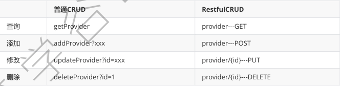

#### 7.供应商列表查询

```java
  @GetMapping("/provider")
    public String providerList(Model model,@RequestParam(value = "providerName", required = false) String providerName){
        logger.info("providerName :"+providerName);
        Collection<Provider> providers = providerDao.getAll(providerName);
        model.addAttribute("providers",providers);
        return "provider/list";
    }

//此处@Requestparam可以省略,接收字符串参数时可以自动接收,且required的默认值也是false
```

```html
<form id="form" th:action="@{/provider}" th:method="get">
            <div class="search">
                    <span>供应商名称：</span>
                    <input type="text" name="providerName" placeholder="请输入供应商的名称"/>
                    <input type="button" onclick="$('#form').submit()" value="查询"/>
                <a href="add.html">添加供应商</a>
            </div>
        </form>

<!--
onclick="方法名()"  即可以写入form的submit()方法;
restful架构中一般指定请求方式method  查询:get  添加:post  修改:put  删除:delete
-->
```

#### 8.供应商详情查询(restful架构传接参)

```html
<a th:href="@{/view/} + ${provider.pid}"></a>

<!--传参方式:   ip:port/mappingName/参数-->
```

```java
//查看某个供应商详情
@GetMapping("/view/{pid}")
public String view(@PathVariable("pid") Integer pid, Map<String, Object> map) {
  Provider provider = providerDao.getProvider(pid);
  map.put("provider", provider);
  //详情页面
  return "provider/view";
}

/*接收参数:
	1.映射路径后加/{},将参数放在花括号内;@RequestMapping("/view/{id}")
	2.在方法形参上用@PathVariable("和映射路径上的参数名一致") String para;  就可以将id附在para上;
*/
```

#### 9.供应商修改

* **发送put请求修改供应商信息**

  1. 在springmvc中需在web.xml文件中配置HiddenHttpMethodFilter(在springboot中已经自动配置好了在webMvcAutoconfiguration自动配置类中)

  2. 页面创建一个method="post"的表单;

  3. 创建一个隐藏域name="_method", value="put" 指定请求方式;

     

修改供应商信息

```java
@PutMapping(value = "/provider")
    public String updateProvider(Provider provider){
        logger.info("修改供应商信息...");
        provider.setCreateDate(new Date());
        providerDao.save(provider);
        return "redirect:/provider";
    }
```

表单指定请求方式

```html
<form id="updateForm" th:action="@{/provider}" th:method="post">
                <input th:type="hidden" name="_method" value="put">
                <input type="hidden" name="pid" th:value="${provider.pid}">
    
<!--
说明:返回按钮可以绑定这个方法:  <input type="button" value="返回" onclick="history.back(-1)"/>
-->
```

#### 10.供应商添加

```java 
@PostMapping("/provider")
    public String addEntity(Provider provider){
        logger.info("添加供应商");
        provider.setCreateDate(new Date());
        providerDao.save(provider);
        return "redirect:/providers";
    }
```

#### 11.供应商删除

```java
//删除操作
@DeleteMapping("provider/{pid}")
public String delete(@PathVariable("pid") Integer pid) {
  logger.info("删除供应商：" + pid);
  providerDao.delete(pid);
  return "redirect:/providers";
}
```

```html
<a href="#" th:attr="del_uri=@{/provider/}+${p.pid}" class="delete"></a>

<!--详见项目中js-->
```

### 六 springboot错误处理机制

#### 1.默认的错误处理机制(底层原理分析)

**底层原理关注ErrorMvcAutoConfiguration错误自动配置类**

* 第一步

**ErrorpageCustomizer错误页面定制器**

```java
private static class ErrorPageCustomizer implements ErrorPageRegistrar, Ordered {
 
  public void registerErrorPages(ErrorPageRegistry errorPageRegistry) {
    ErrorPage errorPage = new ErrorPage(
      this.dispatcherServletPath.getRelativePath(
      // 出现错误后来到 /error 请求进行处理（类似web.xml注册的错误页面规则）
      this.properties.getError().getPath())); //private String path = "/error";
    errorPageRegistry.addErrorPages(new ErrorPage[]{errorPage});
 }
  public int getOrder() {
    return 0;
 }
}
```

当应用出现了4xx或5xx之类的错误,ErrorPageCustomizer就会被激活,它主要用于定制错误处理的响应规则,就会发送一个/error请求,它会交给BasicErrorController进行处理;

**第二步**

BasicErrorController就会接收/error请求处理

```java
@Controller
@RequestMapping({"${server.error.path:${error.path:/error}}"})
public class BasicErrorController extends AbstractErrorController {
    //通过请求头判断调用下面哪个访求： text/html
  //响应 html 类型的数据；接收浏览器发送的请求
  @RequestMapping( produces = {"text/html"} )
  public ModelAndView errorHtml(HttpServletRequest request,
                 HttpServletResponse response) {
    HttpStatus status = this.getStatus(request);
    Map<String, Object> model =
      Collections.unmodifiableMap(this.getErrorAttributes(request,
this.isIncludeStackTrace(request, MediaType.TEXT_HTML)));
    response.setStatus(status.value());
    //去哪个页面作为错误页面，包括 页面地址与页面内容，里面有一个ErrorViewResolver
    ModelAndView modelAndView = this.resolveErrorView(request, response, status,
model);
    return modelAndView != null ? modelAndView
    //没有找到，则找 error 视图 ，在ErrorMvcAutoConfiguration的defaultErrorView中
     : new ModelAndView("error", model);
 }
  //通过请求头判断： */*
  @RequestMapping
  @ResponseBody //响应 Json 类型的数据；接收 其他客户端 发送的请求
  public ResponseEntity<Map<String, Object>> error(HttpServletRequest request) {
    Map<String, Object> body = this.getErrorAttributes(request,
this.isIncludeStackTrace(request, MediaType.ALL));
    HttpStatus status = this.getStatus(request);
    return new ResponseEntity(body, status);
 }
```

BasicErrorController 会接收一个/error请求, 两个 方法处理,第1个erroHtml响应html数据, 还有一个error用来响应json数据 的, 使用了 ErrorViewResolver (DefaultErrorViewResolver)组件进行封装视图

**第三步**

DefaultErrorViewResolver 去解析具体响应的错误页面。

```java
public class DefaultErrorViewResolver implements ErrorViewResolver, Ordered {
public ModelAndView resolveErrorView(HttpServletRequest request,
                  HttpStatus status, Map<String, Object> model) {
    ModelAndView modelAndView = this.resolve(String.valueOf(status), model);
    if (modelAndView == null && SERIES_VIEWS.containsKey(status.series())) {
      //找4xx 5xx页面
      modelAndView = this.resolve((String)SERIES_VIEWS.get(
        status.series()), model);
   }
    return modelAndView;
 }
private ModelAndView resolve(String viewName, Map<String, Object> model) {
    //SpringBoot默认根据状态码响应状态码页面，如 error/404 (templates/error/404.html)
    String errorViewName = "error/" + viewName;
 //如果模板引擎解析这个页面地址，则使用模板引擎解析
    TemplateAvailabilityProvider provider =
      this.templateAvailabilityProviders.getProvider(errorViewName,
                             this.applicationContext);
 //如果模板引擎可用，返回errorViewName指定的视图
    return provider != null ? new ModelAndView(errorViewName, model)
      //如果模板引擎不可用，则调以下方法, 在静态资源目录下找errorViewName对应的页面
     : this.resolveResource(errorViewName, model);
 }
 private ModelAndView resolveResource(String viewName, Map<String, Object> model) {
  //从静态资源目录下找状态码的错误页面，如 404.html
    String[] var3 = this.resourceProperties.getStaticLocations();
    int var4 = var3.length;
    for(int var5 = 0; var5 < var4; ++var5) {
      String location = var3[var5];
      try {
       
        Resource resource = this.applicationContext.getResource(location);
        resource = resource.createRelative(viewName + ".html");
        if (resource.exists()) {
          return new ModelAndView(
            new DefaultErrorViewResolver.HtmlResourceView(resource)
           , model);
       }
     } catch (Exception var8) {
     }
   }
    return null;
 }
  //还可以定义 4xx , 5xx的页面
static {
    Map<Series, String> views = new EnumMap(Series.class);
    views.put(Series.CLIENT_ERROR, "4xx");
    views.put(Series.SERVER_ERROR, "5xx");
    SERIES_VIEWS = Collections.unmodifiableMap(views);
 }
```

通过以上分析可以自定义错误页面

**第四步**

DefaultErrorAttributes 错误页面可获取到的数据信息
通过 BasicErrorController 的方法中响应的 module 可定位到响应哪些数据，从而引出  ErrorAttributes 的实现类  DefaultErrorAttributes ,  DefaultErrorAttributes 中绑定的所有值都可在页面获取到。

```java
public abstract class AbstractErrorController implements ErrorController {
  //以下接口实现类 DefaultErrorAttributes 封装了响应的错误数据。
  private final ErrorAttributes errorAttributes;
```

```java
public class DefaultErrorAttributes implements ErrorAttributes,
HandlerExceptionResolver, Ordered {
  public Map<String, Object> getErrorAttributes(WebRequest webRequest, boolean
includeStackTrace) {
    Map<String, Object> errorAttributes = new LinkedHashMap();
    errorAttributes.put("timestamp", new Date());
    this.addStatus(errorAttributes, webRequest);
    this.addErrorDetails(errorAttributes, webRequest, includeStackTrace);
    this.addPath(errorAttributes, webRequest);
    return errorAttributes;
 }
 
下面省略一大波可获取的数据
  timestamp：时间戳
  status：状态码
  error：错误提示
  exception：异常对象
  message：异常消息
  errors：JSR303数据校验出现的错误
```

#### 2.自定义错误响应页面

**第一种:有模板引擎**

* error/状态码 : 精确匹配,将错误页面命名为  错误状态码.html  放在模板引擎目录 templates下error目录下,发生相对应状态码错误时,就会响应对应的模板页面

* error/4xx , error/5xx : 模糊匹配,可以将错误页面命名为4xx和5xx, 有来匹配对应类型的所有错误;

* 采用精确优先;

* 错误页面可获取的数据信息

  ```properties
  timestamp：时间戳
  status：状态码
  error：错误提示
  exception：异常对象
  message：异常消息
  errors：JSR303数据校验出现的错误
  ```

**第二种:没有模板引擎**

静态资源目录下的 error 目录中找

**第三种:模板目录和静态目录下都找不到对应错误页面,就响应springboot默认的错误页面**

* 分析

  出现错误以后，会发送  /error 请求，会被  BasicErrorController 处理，而响应的数据是由getErrorAttributes封装的(就是 ErrorController 的实现类AbstractErrorController.getErrorAttributes 的方法）, 所以我们只需要自定义  ErrorAttributes 实现类即可

* 自定义ErrorAttributes

```java
@Component //向容器中添加该组件
public class MyErrorAttributes extends DefaultErrorAttributes {
  /**
  * 自定义数据进行响应
  */
  @Override
  public Map<String, Object> getErrorAttributes(WebRequest webRequest, boolean
includeStackTrace) {
    Map<String, Object> map = super.getErrorAttributes(webRequest,
includeStackTrace);
    map.put("company", "mengxuegu.com");
    return map;
 }
}
```

* 错误页面获取

```html
<body>
 4xx错误。。
  <h2>[[${company}]]</h2>
</body>
```

### 七 嵌入式Servlet容器自定义配置

#### 7.1注册servlet三大组件servlet/filter/listener

* 以前web应用使用外置tomcat容器部署,可在web.xml文件中注册servlet三大组件;

* 而由于springboot默认是以jar包方式运行嵌入式servlet容器来启动应用,没有web.xml文件,spring提供以下bean来注册三大组件:

  ​	ServletRegistrationBean  :注册自定义servlet

  ​	FilterRegistrationBean  :注册自定义Filter

  ​	ServletListenerRegistrationBean  :注册自定义Listener

  **1.Servlet组件**

```java
//自定义Servlet组件
public class HelloServlet extends HttpServlet {
  //处理git请求
  @Override
  protected void doGet(HttpServletRequest req, HttpServletResponse resp) throws
ServletException, IOException {
    resp.getWriter().write("HelloServlet success。。。。");
 }
  @Override
  protected void doPost(HttpServletRequest req, HttpServletResponse resp) throws
ServletException, IOException {
    super.doGet(req, resp);
 }
}
```

```java
//注册Servlet相关组件
@Configuration
public class MyServletConfig {
  //注册Sevlet组件
  @Bean
  public ServletRegistrationBean helloSevlet() {
    //参数1：自定义Servlet， 参数2：url映射
    ServletRegistrationBean<HelloServlet> bean =
        new ServletRegistrationBean<>(new HelloServlet(), "/hello");
    //设置servlet组件参数配置，如下面加载顺序
    bean.setLoadOnStartup(1);
    return bean
  }
}
```

**2.Filter组件**

```java
//自定义filter
public class MyFilter implements Filter {
    @Override
    public void init(FilterConfig filterConfig) throws ServletException {
        System.out.println("filter初始化");
    }

    @Override
    public void doFilter(ServletRequest servletRequest, ServletResponse servletResponse, FilterChain filterChain) throws IOException, ServletException {
        System.out.println("filter过滤完成");
        filterChain.doFilter(servletRequest, servletResponse);

    }

    @Override
    public void destroy() {
        System.out.println("filter注销");
    }
}

```

```java
//注册filter组件
    @Bean
    public FilterRegistrationBean getFilter(){
        FilterRegistrationBean<Filter> filter = new FilterRegistrationBean<>();
        //1.指定过滤器
        filter.setFilter(new MyFilter());
        //2.过滤哪些请求
        filter.setUrlPatterns(Arrays.asList("/hello"));
        return filter;
    }
```

**3.Listener组件**

```java
//自定义listener
//对谁进行监听就实现谁的监听器
public class MyListener implements ServletContextListener {
    @Override
    public void contextInitialized(ServletContextEvent sce) {
        System.out.println("应用启动了...");
    }

    @Override
    public void contextDestroyed(ServletContextEvent sce) {
        System.out.println("应用注销了...");
    }
}

```

```java
//注册listener组件
    @Bean
    public ServletListenerRegistrationBean getListener(){
        return new ServletListenerRegistrationBean(new MyListener());
    }
```

#### 7.2分析自动注册的springmvc前端控制器

springboot在DispatcherServletAutoConfiguration自动配置中,帮我们注册了SpringMVC的前端控制器:DispatcherServlet

```java
@Bean( name = {"dispatcherServletRegistration"})
@ConditionalOnBean(value = {DispatcherServlet.class},name={"dispatcherServlet"})
//注册了前端控制器
public DispatcherServletRegistrationBean
 dispatcherServletRegistration(DispatcherServlet dispatcherServlet) {
    DispatcherServletRegistrationBean registration =
   new DispatcherServletRegistrationBean(dispatcherServlet,
   // / 拦截所有请求(包括静态资源);但不会拦截jsp请求; 而 /* 会拦截jsp
   this.webMvcProperties.getServlet().getPath());// /
    registration.setName("dispatcherServlet");
  
 registration.setLoadOnStartup(this.webMvcProperties.getServlet().getLoadOnStartup());
    if (this.multipartConfig != null) {
      registration.setMultipartConfig(this.multipartConfig);
      }
    return registration;
 }
}
```

#### 7.3修改servlet容器配置

参考pom.xml可知,springboot默认使用tomcat作为嵌入式的servlet容器,springboot2.1版本默认使用的是tomcat9.0.12版本的容器

##### 7.3.1修改servlet容器配置

* **方式1:在application全局配置文件中,修改server开头有关的配置[ServerProperties]**

```properties
#项目服务相关
server.port=8080
#修改Servlet相关配置 server.servlet.xxx
server.servlet.context-path=/servlet
#修改Tomcat相关配置 server.tomcat.xxx
server.tomcat.uri-encoding=utf-8
```

* **方式2使用定制器修改servlet容器配置**

  在2.x版本为实现WebServerFactoryCustomizer接口的customize方法

```java
 //springboot2.x
  @Bean
  public WebServerFactoryCustomizer webServerFactoryCustomizer() {
    return new WebServerFactoryCustomizer() {
      @Override
      public void customize(WebServerFactory factory) {
        ConfigurableWebServerFactory serverFactory =
(ConfigurableWebServerFactory)factory;
        serverFactory.setPort(8081);
     }
   };
}
```

#### 7.4切换为其他嵌入式servlet容器

* springbootmore针对servlet容器提供以下支持
  1. tomcat(默认使用)
  2. Jetty:支持长连接项目(如聊天页面)
  3. Undertow:不支持JSP,但是高并发性能高,是高性能非阻塞的容器
* 默认tomcat容器

```xml
在spring-boot-starter-web启动器中默认引入了tomcat容器
<dependency>
  <groupId>org.springframework.boot</groupId>
  <artifactId>spring-boot-starter-tomcat</artifactId>
  <version>2.1.0.RELEASE</version>
  <scope>compile</scope>
</dependency>
```

* 切换Jetty容器

```xml
<dependency>
 <groupId>org.springframework.boot</groupId>
 <artifactId>spring-boot-starter-web</artifactId>
 <!-- 排除tomcat容器 -->
 <exclusions>
   <exclusion>
    <artifactId>spring-boot-starter-tomcat</artifactId>
    <groupId>org.springframework.boot</groupId>
   </exclusion>
 </exclusions>
</dependency>
<!--引入其他的Servlet容器-->
<dependency>
 <artifactId>spring-boot-starter-jetty</artifactId>
 <groupId>org.springframework.boot</groupId>
</dependency>
```

* 切换Undertow容器

```xml
<dependency>
 <groupId>org.springframework.boot</groupId>
 <artifactId>spring-boot-starter-web</artifactId>
 <!-- 排除tomcat容器 -->
 <exclusions>
   <exclusion>
    <artifactId>spring-boot-starter-tomcat</artifactId>
    <groupId>org.springframework.boot</groupId>
   </exclusion>
 </exclusions>
</dependency>
<!--引入其他的undertow容器-->
<dependency>
 <artifactId>spring-boot-starter-undertow</artifactId>
 <groupId>org.springframework.boot</groupId>
</dependency>
```

### 八 使用外置servlet容器Tomcat

#### 8.1比较嵌入式与外置servlet容器

```
1.嵌入式servlet容器:运行启动类就可启动,或将项目打成可执行的jar包
	优点:简单,快捷
	缺点:默认不支持jsp,优化定制比较复杂使用定制器,还需要知道每个功能的底层原理
2.外置servlet容器:配置tomcat,将项目部署到tomcat中执行;
```

#### 8.2使用Tomcat作为外置servlet容器

**操作步骤**

1.必须创建一个war类型项目

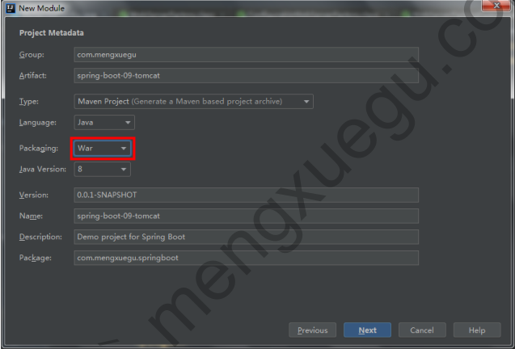

2.在idea上指定web.xml与修改好目录结构

* 指定webapp目录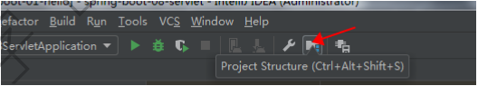

  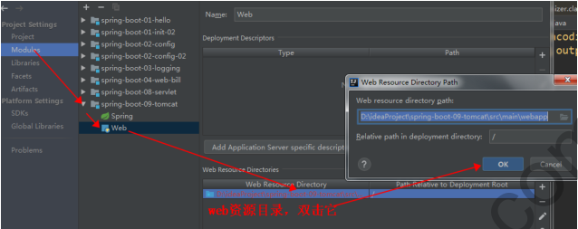

  

* 指定web.xml位置

  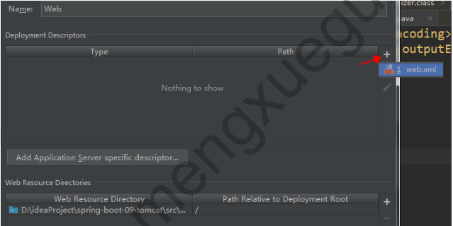

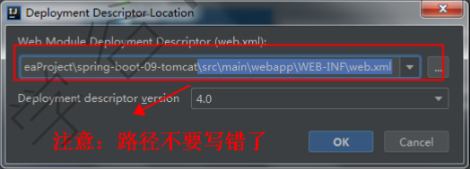

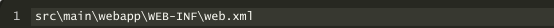

* 添加外置tomcat

  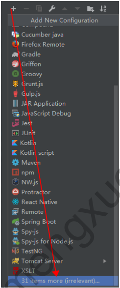

  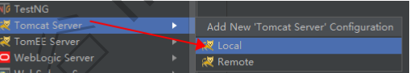

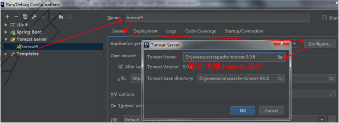

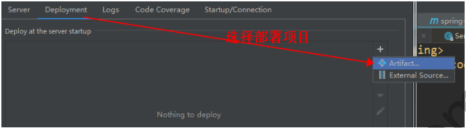

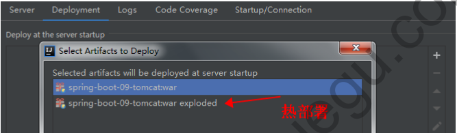

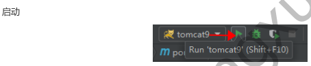


3.在pom.xml将嵌入式的tomcat指定为provided(spring初始化器已经默认指定了)

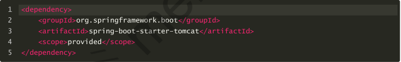

4.spring初始化器自动创建了SpringBootServletInitializer的子类,调用configure方法

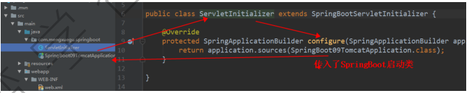

5.直接开发项目功能即可,然后启动tomcat即可访问

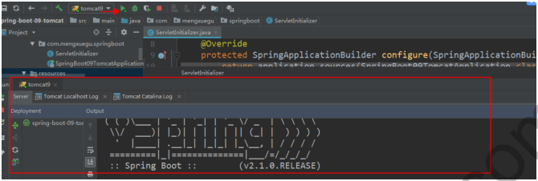

### 九 SpringBoot数据访问操作

#### 9.1整合JDBC实战

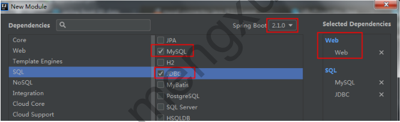

##### 9.1.1JDBC相关配置

* pom.xml

```xml
<!--mysql驱动包-->
<dependency>
  <groupId>mysql</groupId>
  <artifactId>mysql-connector-java</artifactId>
  <scope>runtime</scope>
</dependency>
<!--jdbc启动器-->
<dependency>
  <groupId>org.springframework.boot</groupId>
  <artifactId>spring-boot-starter-jdbc</artifactId>
</dependency>
```

* application.yml

  **注意:MySQL8.x版本驱动包,要使用com.mysql.cj.jdbc.Driver作为驱动类**

  ```properties
  spring:
  datasource:
   username: root
   password: 123
    #使用 MySQL连接驱动是8.0以上，需要在Url后面加上时区, GMT%2B8代表中国时区，不然报时区错误
   url: jdbc:mysql://127.0.0.1:3306/jdbc?serverTimezone=GMT%2B8
    # 注意： 新版本驱动包，要使用以下类作为驱动类
   driver-class-name: com.mysql.cj.jdbc.Driver
  ```

* 测试类

```java
@RunWith(SpringRunner.class)
@SpringBootTest
public class SpringBootDataApplicationTests {
  @Autowired
  DataSource datasource;
  @Test
  public void contextLoads() throws SQLException {
    // 默认采用的数据源连接池：com.zaxxer.hikari.HikariDataSource
    System.out.println("datasource: " + datasource.getClass());
    Connection connection = datasource.getConnection();
    System.out.println(connection);
    connection.close();
 }
}

/*
1.springboot默认采用的数据源连接池是:com.zaxxer.hikari.HikariDataSource;
2.数据源相关配置都在DataSourceProperties中;
*/
```

##### 9.1.2JDBC自动配置原理

1. **支持的数据源,提供了Hikari.class, Tomcat.class, Dbcp2.class, Generic.class 各种连接池数据源相关配置: DataSourceConfiguration**

   可以通过spring.datasource.type修改数据源

```java
@Configuration
@Conditional({DataSourceAutoConfiguration.PooledDataSourceCondition.class})
@ConditionalOnMissingBean({DataSource.class, XADataSource.class})
//提供了 Hikari.class, Tomcat.class, Dbcp2.class, Generic.class
@Import({Hikari.class, Tomcat.class, Dbcp2.class, Generic.class,
DataSourceJmxConfiguration.class})
protected static class PooledDataSourceConfiguration {
  protected PooledDataSourceConfiguration() {
 }
}
```

2. **JdbcTemplateAutoConfiguration自动配置类提供了JdbcTemplate操作数据库**

```java
@Controller
public class ProviderController {
  @Autowired
  JdbcTemplate jdbcTemplate;
  @ResponseBody
  @GetMapping("/providers")
  public Map<String, Object>list() {
    List<Map<String, Object>> maps =
      jdbcTemplate.queryForList("select * from provider");
    System.out.println(maps);
    return maps.get(0);
 }
}

//说明:在学springMVC时,想使用spring提供的操作数据库的模板JdbcTemplate,需要将JdbcTemplate注册到spring的xml配置文件中,传入数据源等参数;    而在springboot中在JdbcTemplateAutoConfiguration自动配置类中已经自动注册了,且使用的是springboot默认的数据源连接池HikariDatasource
```

#### 9.2高级配置Druid连接池与监控管理

**Hikari性能上比Druid更好,但是Druid有配套的监控安全管理功能**

##### 9.2.1整合Druid操作步骤

1. 引入Druid依赖

```xml
<dependency>
  <groupId>com.alibaba</groupId>
  <artifactId>druid</artifactId>
  <version>1.1.12</version>
</dependency>
```

2. Druid全局配置

```yaml
spring:
  datasource:
    username: root
    password: 123
    driver-class-name: com.mysql.cj.jdbc.Driver
    url: jdbc:mysql://localhost:3306/jdbc?serverTimezone=GMT%2B8
    type: com.alibaba.druid.pool.DruidDataSource

    #  数据源其他配置, DataSourceProperties中没有相关属性,默认无法绑定
    initialSize: 8
    minIdle: 5
    maxActive: 20
    maxWait: 6000
    timeBetweenEvictionRunsMillis: 60000
    minEvictableIdleTimeMillis: 300000
    validationQuery: SELECT 1 FROM DUAL
    testWhileIdle: true
    testOnBorrow: false
    testOnReturn: false
    poolPreparedStatements: true
    #  配置监控统计拦截的filters，去掉后监控界面sql无法统计，'wall'用于防火墙
    filters: stat,wall,logback
    maxPoolPreparedStatementPerConnectionSize: 25
    useGlobalDataSourceStat: true
    connectionProperties: druid.stat.mergeSql=true;druid.stat.slowSqlMillis=500
    
    
```

3. 通过测试类测试,发现数据源已经切换到DruidDataSource,但是配置中的属性没有与它绑定上
4. 自定义配置类,将配置中的属性与DruidDataSource属性绑定;

```java
package com.mengxuegu.springboot.config;
。。。。。。
/**
* Druid 配置类
* @Auther: 梦学谷
*/
@Configuration
public class DruidConfig {
  //绑定数据源配置
  @ConfigurationProperties(prefix = "spring.datasource")
  @Bean
  public DataSource druid() {
    return new DruidDataSource();
 }
}


//注意:方法名druid就是DruidDataSource实体bean名   如果报方法名重复定义错误  则将方法名改了
```

##### 9.2.2配置Druid监控

```java
@Configuration
public class DruidConfig {
  //绑定数据源配置
  @ConfigurationProperties(prefix = "spring.datasource")
  @Bean
  public DataSource druid() {
    return new DruidDataSource();
 }
  /**
  * 配置Druid监控
  * 1. 配置一个管理后台的Servlet  (StatViewServlet)
  * 2. 配置一个监控的filter	  (WebStatFilter)
  */
  @Bean  // 1. 配置一个管理后台的Servlet
  public ServletRegistrationBean statViewServlet() {
    //StatViewServlet是 配置管理后台的servlet
    ServletRegistrationBean<StatViewServlet> bean =
        new ServletRegistrationBean<>(new StatViewServlet(), "/druid/*");
    //配置初始化参数
    Map<String, String> initParam = new HashMap<>();
    //访问的用户名密码
    initParam.put(StatViewServlet.PARAM_NAME_USERNAME, "root");
    initParam.put(StatViewServlet.PARAM_NAME_PASSWORD, "123");
    //允许访问的ip，默认所有ip访问
    initParam.put(StatViewServlet.PARAM_NAME_ALLOW, "");
    //禁止访问的ip
    initParam.put(StatViewServlet.PARAM_NAME_DENY, "192.168.10.1");
    bean.setInitParameters(initParam);
    return bean;
 }
  //2. 配置一个监控的filter
  @Bean
  public FilterRegistrationBean filter() {
    FilterRegistrationBean<Filter> bean = new FilterRegistrationBean<>();
    bean.setFilter(new WebStatFilter());
    //配置初始化参数
    Map<String, String> initParam = new HashMap<>();
    //排除请求
    initParam.put(WebStatFilter.PARAM_NAME_EXCLUSIONS, "*.js,*.css,/druid/*");
    bean.setInitParameters(initParam);
    //拦截所有请求
    bean.setUrlPatterns(Arrays.asList("/*"));
       return bean;
 }
}


//说明:该后台监控系统是由DruidDatasource提供的,  StatViewServlet和WebStatFilter都是Druid包下的
```

#### 9.3整合mybatis3.x注解版实战

##### 9.3.1搭建mybatis环境

**创建module**

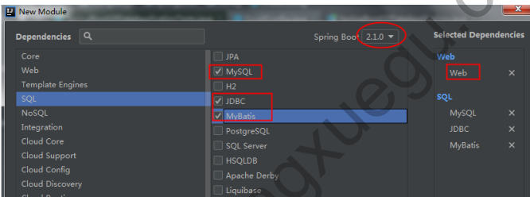

**导入 Druid 数据源依赖， 创建后自动会引入 MyBatis 启动器，是由 MyBatis 官方提供的**

```xml
<!--导入 mybatis 启动器-->
<dependency>
  <groupId>org.mybatis.spring.boot</groupId>
  <artifactId>mybatis-spring-boot-starter</artifactId>
  <version>1.3.2</version>
</dependency>
<!--druid数据源-->
<dependency>
  <groupId>com.alibaba</groupId>
  <artifactId>druid</artifactId>
  <version>1.1.12</version>
</dependency>
```

**配置Druid数据源(application.yml)与监控**

**导入实体类**

##### 9.3.2注解版mybatis操作

```java
//@Mapper //指定这是操作数据的Mapper
public interface ProviderMapper {
  @Select("select * from provider where pid=#{pid}")
  Provider getProvierByPid(Integer pid);
  //useGeneratedKeys是否使用自增主键，keyProperty指定实体类中的哪一个属性封装主键值
  @Options(useGeneratedKeys = true, keyProperty = "pid")
  @Insert("insert into provider(providerName) values(#{providerName})")
  int addProvider(Provider provider);
  @Delete("delete from provider where pid=#{pid}")
  int deleteProviderByPid(Integer pid);
  @Update("update provider set providerName=#{providerName} where pid=#{pid}" )
  int updateProvider(Provider provider);
}


//注:@Insert插入数据时使用   @Option接收插入的主键值:userGenerateKeys是否自增主键,keyProperty指定实体中哪个属性封装主键
```

```java
@Controller
public class ProviderController {
  @Autowired
  ProviderMapper providerMapper;
  @ResponseBody
  @GetMapping("/provider/{pid}")
  public Provider getProvider(@PathVariable("pid") Integer pid) {
    Provider providerByPid = providerMapper.getProviderByPid(pid);
    return providerByPid;
 }
  @ResponseBody
  @GetMapping("/provider")
  public Provider addProvider(Provider provider) {
    providerMapper.addProvider(provider);
    return provider;
 }
}
```

###### 9.3.2.1自定义mybatis配置类,代替mybatis配置文件(开启驼峰命名方式)

开启驼峰命名方式,不然数据库中provider_code带下划线的字段不会自动转成providerCode

```java
@Configuration
public class MybatisConfig {
    @Bean
    public ConfigurationCustomizer configurationCustomizer(){
        ConfigurationCustomizer customizer = new ConfigurationCustomizer() {
            @Override
            public void customize(org.apache.ibatis.session.Configuration configuration) {
                configuration.setMapUnderscoreToCamelCase(true);
            }
        };
        return customizer;
    }
}

```

###### 9.3.2.2@MapperScan("包名")

自动装配指定包下所有Mapper,省的在每个Mapper接口上写@Mapper

```java
//会自动装配指定包下面所有Mapper，省得在每个Mapper上面写@Mapper
@MapperScan("com.mengxuegu.springboot.mapper")
@SpringBootApplication
public class SpringBoot08DataMybatisApplication {
  public static void main(String[] args) {
    SpringApplication.run(SpringBoot08DataMybatisApplication.class, args);
 }
}
```

#### 9.4整合mybatis3.x配置文件版实战

1. mapper接口

```java
public interface BillMapper {

    Bill getBill(int bid);

    void addBill(Bill bill);
}

```

2. 在resource下创建核心配置文件与mapper映射文件

   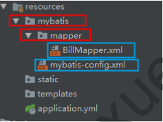

   3. mybatis核心配置文件

```xml
<?xml version="1.0" encoding="UTF-8" ?>
<!DOCTYPE configuration
        PUBLIC "-//mybatis.org//DTD Config 3.0//EN"
        "http://mybatis.org/dtd/mybatis-3-config.dtd">
<configuration>
   <!--mybatis核心配置-->
   <!--开启驼峰命名方式-->
   <settings>
      <setting name="mapUnderscoreToCamelCase" value="true"/>
   </settings>
</configuration>


注意也可以在application.properties文件中开启驼峰命名:
mybatis.configuration.map-underscore-to-camel-case=true
```

4. billMapper映射文件

```xml
<?xml version="1.0" encoding="UTF-8" ?>
<!DOCTYPE mapper
        PUBLIC "-//mybatis.org//DTD Mapper 3.0//EN"
        "http://mybatis.org/dtd/mybatis-3-mapper.dtd">
<mapper namespace="com.fy.demo.mapper.BillMapper">
      <select id="getBill" resultType="com.fy.demo.entities.Bill">
        select * from bill where bid = #{bid}
      </select>
</mapper>
```

5. application.yml中指定配置文件路径

```yaml
# Mybatis相关配置
mybatis:
 #核心配置文件路径
config-location: classpath:mybatis/mybatis-config.xml
 #映射配置文件路径
mapper-locations: classpath:mybatis/mapper/*.xml

#说明:由于mybatis.config-location指定了指定的配置文件,则9.3.2.1中的自定义配置类将不再默认使用

#指定mapper包下的日志级别为debug可以打印出SQL语句
logging:
  level:
    com.fy.demo.mapper: debug
```

6. controller

```java
@RestController
public class BillController {

    @Autowired
    BillMapper billMapper;

    @GetMapping("/bill/{bid}")
    public Bill getBill(@PathVariable("bid") int bid){
        Bill bill = billMapper.getBill(bid);
        return bill;
    }

}
```

#### 9.5整合Spring Data JPA实战

##### 9.5.1什么是spring data

```java
1.spring data是springboot底层默认进行数据访问的技术,为了简化构建基于spring框架应用的数据访问技术,包括非关系数据库,云数据服务等;另外也包含对关系数据库的访问支持;
2.spring data特点: spring data项目为大家提供统一的API来对不同数据访问层进行操作;
3.spring data统一的核心接口
	1)Respository: 统一的跟接口,其他接口继承该接口
	2)CrudRespository: 基本的增删改查接口,提供了最基本的对实体类CRUD操作;
	3)PagingAndSortingRespository: 增加了分页和排序操作
	4)JpaRepository: 增加了批量操作,并重写了父接口的一些方法的返回类型
	5)JpaSpecificationExecutor: 用来做动态查询,可以实现带查询条件的分页(不属于Repository体系,支持KPA Criteria查询相关的方法)
```

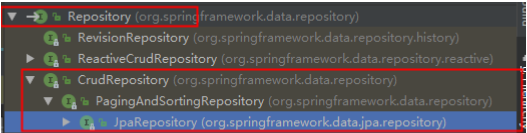

**Spring Data JPA/JPA与Hibernate关系**

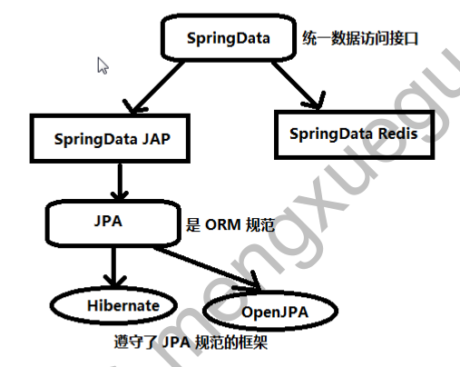

JPA 是一种规范而Hibernate是实现这种规范的底层实现,Spring Data JPA 对持久化接口JPA再抽象一层对持久层业务再进一步统一简化.

##### 9.5.2整合Spring Data JPA实战

JPA的底层遵守的是ORM(对象关系映射),因此JPA其实就是java实体对象和关系型数据库建立起的映射关系,通过面向对象编程的思想操作关系型数据库的规范.

**整合步骤**

1. 创建Module

   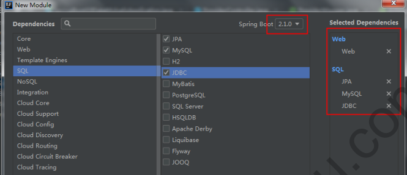

   2.添加数据源,新建jpa数据库

```yaml
spring:
  datasource:
    username: root
    password: 123
    url: jdbc:mysql://localhost:3306/jpa?serverTimezone=GMT%2B8
    driver-class-name: com.mysql.cj.jdbc.Driver

#    jpa相关配置
  jpa:
    show-sql: true	     #控制台打印SQL
    hibernate:           
      ddl-auto: update   #自动创建/更新表
    # 默认创建表类型是MyISAM，是非事务安全的，所以无法实现事物回滚
    # 指定如下方言: 创建的表类型是Innodb，才可以进行对事物的回滚。
    database-platform: org.hibernate.dialect.MySQL5InnoDBDialect
```

3. 创建实体类,并使用JPA注解进行配置映射关系

```java
@Entity  //说明它是和数据库映射的类
@Table(name = "user")  //指定对应的映射的表名,省略的话默认表名就是类名
public class User {
    @Id  //标识主键
    @GeneratedValue(strategy= GenerationType.IDENTITY)  //标识自增长主键
    private Integer id;
    @Column(name = "username", length = 5)  //这是和数据表对应的一个列
    private String username;
    @Column  //省略默认列名就是属性名
    private String password;
    
    setter/getter
}
```

4. 创建UserRepository接口继承JpaRepository,就会crud及分页等基本功能

```java
//指定的泛型<操作的实体类, 主键的类型>
public interface UserRepository extends JpaRepository<User, Integer> {
}
```

6. 测试方法

```java
@RestController
public class UserController {

    @Autowired
    UserRepository userRepository;

    @GetMapping("/user/{id}")
    public User getUser(@PathVariable("id") Integer id){
        Optional<User> userOp = userRepository.findById(id);
        User user = userOp.get();
        return user;
    }

    @GetMapping("/user")
    public User addUser(User user){
        User user1 = userRepository.save(user);
        return user1;
    }
}
```

#### 9.6SpringBoot中的事务管理

```java
1.在springboot中,当我们使用了spring-boot-start-jdbc或spring-boot-start-data-jpa依赖的时候,框架会自动默认分别注入DATASourceTransactionManager或JpaTransactionManager.所以我们不需要任何额外配置就可以用@Transactional注解进行事物的使用;
2.强调Hibernate在创建表时,默认创建的类型时MyISAM时非事务安全的,所以无法实现事务回滚;Innodb才可以进行事物的回滚;需要指定 spring.jpa.database-platform=org.hibernate.dialect.MySQL57Dialect
```

##### 9.6.1事务管理步骤

**1.在启动类上,使用@EnableTransactionManagement开启注解方式事务支持**

**2.在service层方法上添加@Transactional进行事务管理**

注意:如果使用JPA创建表则需要指定数据库引擎为InnoDB

##### 9.6.2事务的隔离级别和传播行为

1. 隔离级别

```java
隔离级别是指在发生并发的事务之间的隔离程度,与我们开发时主要相关的场景包括:脏读/不可重复读/幻读.
1.脏读:A事务执行过程中修改了id=1的数据,未提交前,B事务读取了A修改的id=1的数据,而A事务却回滚了,这样B事务就形成了脏读.
2.不可重复读:A事务先读取了一条数据,然后执行逻辑的时候,B 事务将这条数据改变了,然后A 事务再次读取的时候,发现数据不匹配了,就是所谓的不可重复读.
3.幻读:A事务先根据条件查询到了N条数据,然后B事务新增了M条符合A事务查询条件的数据,导致A事务再次查询时发现有N+M条数据了,就产生了幻读.
    
//我们可以看到Isolation枚举类中定义了五个表示隔离级别的值:
public enum Isolation {
  DEFAULT(-1),
  READ_UNCOMMITTED(1),
  READ_COMMITTED(2),
  REPEATABLE_READ(4),
  SERIALIZABLE(8);
}

	DEFAULT ：这是默认值，表示使用底层数据库的默认隔离级别。对大部分数据库而言，通常这值就是：READ_COMMITTED 。
	READ_UNCOMMITTED ：该隔离级别表示一个事务可以读取另一个事务修改但还没有提交的数据。该级别不
能防止脏读和不可重复读，因此很少使用该隔离级别。
	READ_COMMITTED ：该隔离级别表示一个事务只能读取另一个事务已经提交的数据。该级别可以防止脏
读，这也是大多数情况下的推荐值，性能最好。
	REPEATABLE_READ ：该隔离级别表示一个事务在整个过程中可以多次重复执行某个查询，并且每次返回
的记录都相同。即使在多次查询之间有新增的数据满足该查询，这些新增的记录也会被忽略。该级别可以
防止脏读和不可重复读。
	SERIALIZABLE ：所有的事务依次逐个执行，这样事务之间就完全不可能产生干扰，也就是说，该级别可
以防止脏读、不可重复读以及幻读。但是这将严重影响程序的性能。通常情况下也不会用到该级别
	指定方式:
@Transactional(isolation = Isolation.DEFAULT) 
```

2. 传播行为

```java
传播行为是指，如果在开始当前事务之前，已经存在一个事务，此时可以指定这个要开始的这个事务的执行行为。
我们可以看 org.springframework.transaction.annotation.Propagation 枚举类中定义了6个表示传播行
为的枚举值：
public enum Propagation {
  REQUIRED(0),
  SUPPORTS(1),
  MANDATORY(2),
  REQUIRES_NEW(3),
  NOT_SUPPORTED(4),
  NEVER(5),
  NESTED(6);
}

	REQUIRED ：（默认）如果当前存在事务，则加入该事务；如果当前没有事务，则创建一个新的事务。
	SUPPORTS ：如果当前存在事务，则加入该事务；如果当前没有事务，则以非事务的方式继续运行。
	MANDATORY ：如果当前存在事务，则加入该事务；如果当前没有事务，则抛出异常。
	REQUIRES_NEW ：创建一个新的事务，如果当前存在事务，则把当前事务挂起。
	NOT_SUPPORTED ：以非事务方式运行，如果当前存在事务，则把当前事务挂起。
	NEVER ：以非事务方式运行，如果当前存在事务，则抛出异常。
	NESTED ：如果当前存在事务，则创建一个事务作为当前事务的嵌套事务来运行；如果当前没有事务，则
该取值等价于 REQUIRED 。

指定方式:
@Transactional(propagation = Propagation.REQUIRED) 

//默认情况最常用的隔离级别是readCommited  最常用的传播机制是required,这两种都是默认,因此一般情况下不用特意指定数据的隔离级别和传播机制
```

### 十  项目实战-账单管理系统完整版

在上一个项目基础上做如下扩展

#### 1.数据源相关配置

1. 添加依赖用mybatis做数据库访问层

```xml
<!--数据源相关-->
		<dependency>
			<groupId>org.mybatis.spring.boot</groupId>
			<artifactId>mybatis-spring-boot-starter</artifactId>
			<version>2.1.1</version>
		</dependency>
		<dependency>
			<groupId>mysql</groupId>
			<artifactId>mysql-connector-java</artifactId>
			<scope>runtime</scope>
		</dependency>
		<dependency>
			<groupId>com.alibaba</groupId>
			<artifactId>druid</artifactId>
			<version>1.1.16</version>
		</dependency>
	</dependencies>

```

2. 指定 Druid 数据源，application.yml 与 DruidConfig.java，参考 9.2 配置Druid连接池

3. resources类路径下添加 Mybatis 配置,并在配置中指定路径

   核心配置文件：mybatis/mybatis-config.xml
   映射配置文件：mybatis/mapper/ProviderMapper.xml

```yaml
#mybatis
mybatis:
  mapper-locations: classpath:mybatis/mapper/*.xml
  config-location: classpath:mybatis/mybatis-config.xml
```

4.  访问Druid监控后台,测试是否切换数据源成功;

#### 2.供应商管理模块和账单管理模块(略,详见代码)

项目git地址:https://github.com/FangYanFor1994/springboot-billmanage.git

#### 3.用户管理模块(修改springboot默认日期格式)

```java
详细代码见上项目:
注意:springboot默认日期类型dd/MM/yyyy格式
	如果在新增时传入yyyy-MM-dd格式,controller层参数获取不到
	需要在配置文件中修改默认格式:
	#指定日期格式
	spring.mvc.date-format=yyyy-MM-dd
```

#### 4.重构登录功能

1. UserMapper.java新增一个方法

```java
User getUserByUsername(String username); 
```

2. UserMapper.xml

```xml
<select id="getUserByUsername" resultType="com.mengxuegu.springboot.entities.User">
 select * from `user` where upper(username) = upper(#{username})
</select>
```

3. LoginController.login(...)

```java 
@Controller
public class LoginController {
  @Autowired
  UserMapper userMapper;
  @PostMapping("/login")
  public String login (HttpSession session, String username, String password,
Map<String, Object> map) {
    if( !StringUtils.isEmpty(username)
        && !StringUtils.isEmpty(password) ) {
      //查询数据库用户是否存在
      User user = userMapper.getUserByUsername(username);
      if(user != null && password.equals(user.getPassword())) {
        //登录成功
        session.setAttribute("loginUser", user.getUsername());
        //重定向 redirect：可以重定向到任意一个请求中（包括其他项目），地址栏改变
        return "redirect:/main.html";
     }
   }
    map.put("msg", "用户名或密码错误");
return "";
 }
```

#### 5.密码修改模块

```
需求：先使用Ajax异步校验输入的原密码是否正确，正确则JS校验新密码输入是否一致，一致则提交修改，然后注销重新回到登录页面。
```

js

```js
<script type="text/javascript" th:inline="javascript">
  // 要使用thymeleaf行内表达式则上面需要使用：th:inline="javascript" 标识
  $(function () {
    var isCheck = false;
    //原密码失去焦点
    $("#oldPassword").blur(function () {
      var oldPassword = $(this).val().trim();
      if(!oldPassword) {
        $('#pwdText').css('color', 'red');
        isCheck = false;
        return ;
     }
      //theymeleaf行内表达式
      var url = [[@{/user/pwd/}]] + oldPassword;
      //异步判断密码是否正确
      $.ajax({
        url: url,
        dataType: 'json',
        method: 'GET',
        success: function (data) {
          isCheck = data;
          data ? $("#pwdText").replaceWith("<span id='pwdText'>*原密码正确
</span>")
           : $("#pwdText").replaceWith("<span id='pwdText'
style='color: red'>*原密码错误</span>");
          return;
       },
        error: function () {
          $('#pwdText').html("校验原密码异常");
          isCheck = false;
          return;
       }
     });
   });
    $("#save").click(function () {
      if(isCheck) {
        if($("#newPassword").val() && $("#reNewPassword").val()
          && $("#newPassword").val() == $("#reNewPassword").val()) {
          $("#pwdForm").submit();
       }else{
          $("#reNewPwdText").replaceWith("<span id='reNewPwdText'
style='color: red'>*保证和新密码一致</span>");
       }
     }
          });
 });
</script>
```

控制层

```java
@Controller
public class UserController {
  //前往密码修改页面
  @GetMapping("user/pwd")
  public String toPwdUpdatePage() {
    return "/main/password";
 }
  //校验密码是否正确
  @ResponseBody
  @GetMapping("user/pwd/{oldPwd}")
  public Boolean checkPwd(@PathVariable("oldPwd") String oldPwd,
              HttpSession session) {
    logger.info("输入的旧密码为：" + oldPwd);
    User user = (User) session.getAttribute("loginUser");
    if(user.getPassword().equals(oldPwd)) {
      return true;
   }
    return false;
 }
  @PostMapping("/user/pwd")
  public String updatePwd(HttpSession session, String password) {
    //获取session中的登录信息
    User user = (User) session.getAttribute("loginUser");
    //更新密码
    user.setPassword(password);
    userMapper.updateUser(user);
    //将session中用户信息移除
    session.removeAttribute("loginUser");
    //注销重新登录
    return "redirect:/logout";
 }
}
```

###十一 springboot异步任务与定时任务实战

#### 11.1springboot异步任务实战

```java
1.前言:
	在项目开发中，绝大多数情况下都是通过同步方式处理业务逻辑的，但是比如批量处理数据，批量发送邮件，批量发送短信等操作 容易造成阻塞的情况，之前大部分都是使用多线程来完成此类任务。而在Spring 3+之后，就已经内置了  @Async 注解来完美解决这个问题，从而提高效率。
2.步骤:
	1)@EnableAysnc启动类上开启基于注解的异步任务
	2)@Aysnc标识的方法会异步执行
```

代码:

```java
//service
@Service
public class AsyncService {

    @Async
    public void batchAdd(){
        try {
            Thread.sleep(3*1000);
        } catch (InterruptedException e) {
            e.printStackTrace();
        }
        System.out.println("批量新增完成!");
    }
}
 
//controller
@RestController
public class AsyncController {
    @Autowired
    AsyncService asyncService;
    @GetMapping("/hello")
    public String hello(){
        asyncService.batchAdd();
        return "hello,too";
    }
}

//启动类
@EnableAsync  //开启基于注解的异步任务
@SpringBootApplication
public class SpringbootTestApplication {...}
```

#### 11.2springboot定时任务实战

```java
步骤:
	1)@EnableScheduling 启动类上开启基于注解的定时任务
	2)@Scheduled 标识的方法会进行定时处理

//启动类
@EnableScheduling  //开始基于注解的定时任务
@SpringBootApplication
public class SpringbootTestApplication {...)

//执行定时任务的方法
	@Controller
public class SchuduledController {
    private static int count = 1;
    //  每隔三秒执行一次
    @Scheduled(cron = "*/3 * * * * MON-FRI")
    public void schuledTest(){
        System.out.println("执行"+ count++ +"次");
    }
}
```

**cron表达式**

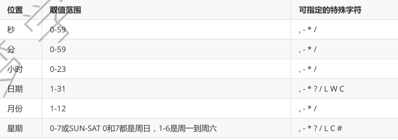

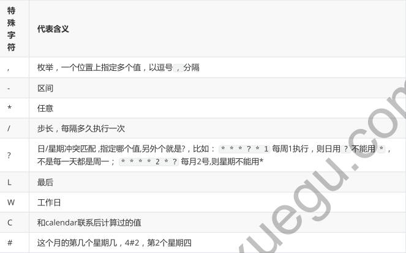

* 在线生成cron表达式http://cron.qqe2.com/

  ```properties
  1-5 * * * * 1到5秒，每秒都触发任务
  */5 * * * * 每隔5秒执行一次
  0 */1 * * * 每隔1分钟执行一次
  0 0 5-15 * * 每天5-15点整点触发
  0 0-5 14 * * 在每天下午2点到下午2:05期间的每1分钟触发
  0 0/5 14 * * 在每天下午2点到下午2:55期间的每5分钟触发
  0 0/5 14,18 * * 在每天下午2点到2:55期间和下午6点到6:55期间的每5分钟触发
  0 0/30 9-17 * * 朝九晚五工作时间内每半小时
  0 0 12 ? * WED 表示每个星期三中午12点
  0 10,44 14 ? 3 WED 每年三月的星期三的下午2:10和2:44触发
  0 0 23 L * ? 每月最后一天23点执行一次
  0 15 10 LW * ? 每个月最后一个工作日的10点15分0秒触发任务
  0 15 10 ? * 5#3 每个月第三周的星期五的10点15分0秒触发任务
  ```


### 十二 springboot邮件发送实战

#### 12.1邮件发送环境准备

1. 引入邮件启动器:spring-boot-starter-mail

```xml
<dependency>
  <groupId>org.springframework.boot</groupId>
  <artifactId>spring-boot-starter-mail</artifactId>
</dependency>
```

1. springboot提供了自动配置类MailSenderAutoConfiguration

2. 在application.properties中配置邮箱信息,参考MailProperties

3. ```properties
   #配置邮箱信息
   spring.mail.username=807094023@qq.com
   spring.mail.password=hcmviimmdtcnbbgf
   #配置邮箱服务
   spring.mail.host=smtp.qq.com
   #开启ssl连接
   spring.mail.properties.smtp.ssl.enable=true
   ```

   密码不写在明文配置中,在qq邮箱中进行获取授权码,如下操作

   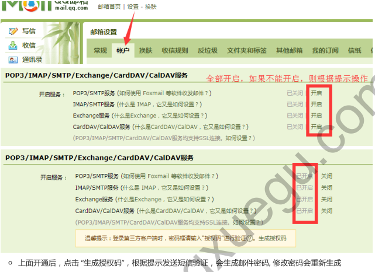

   

#### 12.2邮件发送实战操作

说明:springboot自动装配JavaMailSenderImpl进行发送邮件

```java
@SpringBootTest
@RunWith(SpringRunner.class)
class SpringbootMailApplicationTests {
    
    @Autowired
    JavaMailSenderImpl javaMailSenderImpl = new JavaMailSenderImpl();
    
    //测试发送简单邮件
    @Test
    void simpleMailTest() {
        //邮件内容实体类
        SimpleMailMessage mailMessage = new SimpleMailMessage();
        mailMessage.setSubject("春节放假通知!");
        mailMessage.setText("测试发送春节放假通知邮件代码实现,发送成功请回复,谢谢!");
        mailMessage.setFrom("807094023@qq.com");
        mailMessage.setTo("fangyanfor1994@163.com");
        //发送邮件
        javaMailSenderImpl.send(mailMessage);
    }


    //测试发送复杂邮件
    @Test
    void mimeMailTest() throws MessagingException {
        //创建一个发送复杂消息对象
        MimeMessage mimeMessage = javaMailSenderImpl.createMimeMessage();
        //通过消息帮助对象，来设置发送的内容
        MimeMessageHelper mimeMessageHelper = new MimeMessageHelper(mimeMessage, true);
        //邮件主题
        mimeMessageHelper.setSubject("测试发送带附件的邮件代码实现!");
        //邮件内容,第二个参数表示是否使用HTML格式
        mimeMessageHelper.setText("<h2 style='color:red'>春节放假7天</h2>", true);
        //上传附件
        mimeMessageHelper.addAttachment("1.jpg", new File("G:\\360Downloads\\ideaBackground\\317764.jpg"));
        mimeMessageHelper.addAttachment("2.jpg", new File("G:\\360Downloads\\ideaBackground\\318396.jpg"));
        mimeMessageHelper.setFrom("807094023@qq.com");
        mimeMessageHelper.setTo("120366562@qq.com");
        javaMailSenderImpl.send(mimeMessage);
    }
}
```

### 十三springboot整合缓存实战

#### 12.1缓存简介

缓存是每一个系统都应该考虑的功能，它用于加速系统的访问，以及提速系统的性能。比如：
经常访问的高频热点数据：
	电商网站的商品信息：每次查询数据库耗时，可以引入缓存。
	微博阅读量、点赞数、热点话题等
临时性的数据：发送手机验证码，1分钟有效，过期则删除，存数据库负担有点大，这些临时性的数据也可以放到缓存中, 直接从缓存中存取数据。

#### 12.2springboot整合缓存

springboot提供缓存注解:@EnableCacheing/@Cacheable/@CachePut

**整合缓存步骤**

1. 引入缓存启动器:spring-boot-starter-cache
2. @EnableCaching:在启动类上,开启基于注解的缓存
3. @Cacheable:标在方法上,返回的结果会进行缓存(先查缓存中的结果,没有则调用方法并将结果放入缓存)

属性:1)value/cacheNames:缓存名称     2)key:作为缓存中的key值,可以使用SpEL表达式指定(不指定就是参数值),缓存结果是方法返回值;

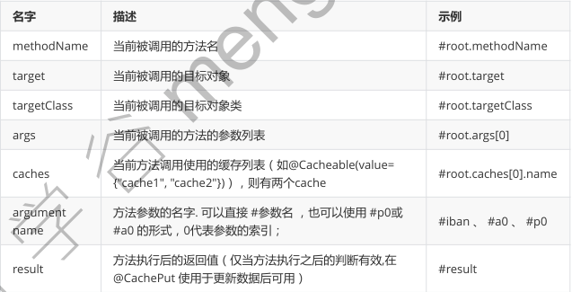

5.@CachePut:保证方法被调用后，又将对应缓存中的数据更新（先调用方法，调完方法再将结果放到缓存）
比如：修改了表中某条数据后，同时更新缓存中的数据，使得别人查询这条更新的数据时直接从缓存中获取

注意:需要指定key的属性:key="#user.id"参数对象的id或key="#result.id"返回值对象的id

1. @CacheEvict:清除缓存

   属性:

   - key:指定要清除的数据,如key="#id"
   - allEntries=true:指定清除这个缓存的所有数据
   - beforeInvocation=true:true在方法之前执行;默认false在方法执行之后执行,出现异常则不会清除缓存;

2. @CacheConfig指定缓存公共属性值

   @CacheConfig(cacheNames="user")指定在类上,其他方法上就不需要写缓存名.

**代码**

```java
//启动类
@EnableCaching //开启基于注解的缓存
@MapperScan("com.fy.springbootcache.mapper")
@SpringBootApplication
public class SpringbootCacheApplication {...}

//service方法
@Service
public class UserService {

    @Autowired
    UserMapper userMapper;

    @Cacheable(cacheNames = "user", key = "#id")
    public User getUsers(Integer id){
        User users = userMapper.getUsers(id);
        return users;
    }

    @CachePut(cacheNames = "user", key = "#result.id")
    public User updateUser(User user){
        userMapper.updateUser(user);
        return user;
    }

    @CacheEvict(cacheNames = "user", key = "#id")
    public void deleteUser(Integer id){
        userMapper.deleteUser(id);

    }
}
```

#### 12.3底层原理分析

```java
/**
* 0 = "org.springframework.boot.autoconfigure.cache.GenericCacheConfiguration"
* 1 = "org.springframework.boot.autoconfigure.cache.JCacheCacheConfiguration"
* 2 = "org.springframework.boot.autoconfigure.cache.EhCacheCacheConfiguration"
* 3 = "org.springframework.boot.autoconfigure.cache.HazelcastCacheConfiguration"
* 4 = "org.springframework.boot.autoconfigure.cache.InfinispanCacheConfiguration"
* 5 = "org.springframework.boot.autoconfigure.cache.CouchbaseCacheConfiguration"
* 6 = "org.springframework.boot.autoconfigure.cache.RedisCacheConfiguration"
* 7 = "org.springframework.boot.autoconfigure.cache.CaffeineCacheConfiguration"
* 8 = "org.springframework.boot.autoconfigure.cache.SimpleCacheConfiguration"[默认缓存]
* 9 = "org.springframework.boot.autoconfigure.cache.NoOpCacheConfiguration"
* 分析源码：
* 1.默认采用的是SimpleCacheConfiguration 使用 ConcurrentMapCacheManager
* 2. getCache 获取的是 ConcurrentMapCache 缓存对象进行存取数据,它使用ConcurrentMap<Object,
Object>对象进行缓存数据
*  @Cacheable(cacheNames = "user")
* 第一次请求时:
* 3.当发送第一次请求时,会从cacheMap.get(name)中获取有没有ConcurrentMapCache缓存对象,如果没有
则创建出来,
* 并且创建出来的key就是通过@Cacheable(cacheNames = "user")标识的name值
* 4.接着会从ConcurrentMapCache里面调用lookup获取缓存数据,通过key值获取的,
* 默认采用的是service方法中的参数值,如果缓存中没有获取到,则调用目标方法进行获取数据,获取之后则再将它
放到缓存中(key=参数值,value=返回值)
*
* 第二次请求:
* 5. 如果再次调用 则还是先ConcurrentMapCacheManager.getCache()获取缓存对象,如果有则直接返回,
如果没有则创建
* 6. 然后再调用 ConcurrentMapCache.lookup方法从缓存中获取数据, 如果缓存有数据则直接响应回去,不
会再去调用目标方法,
*
* 第三次请求与第二次请求一样.
* 如果缓存中没有缓存管理器,则与第一次请求一致
*
*/
```

### 十三 springboot整合redis实战

#### 13.1安装redis客户端与服务端

- Redis 中文官网：http://www.redis.cn/

- Redis 下载：
  Linux版本：http://download.redis.io/releases/
  Windows（微软开发维护的）：https://github.com/MicrosoftArchive/redis/releases

- Redis直接解压 Redis-x64-3.2.100.zip 即可，点击以下 redis-server.exe, 默认端口号：6379

- 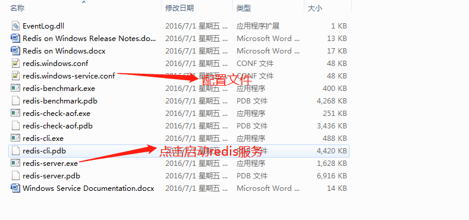

- 安装 Redis 可视化客户端 redis-desktop-manager-0.8.8.384.exe

  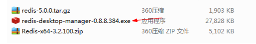

  - 连接redis服务

    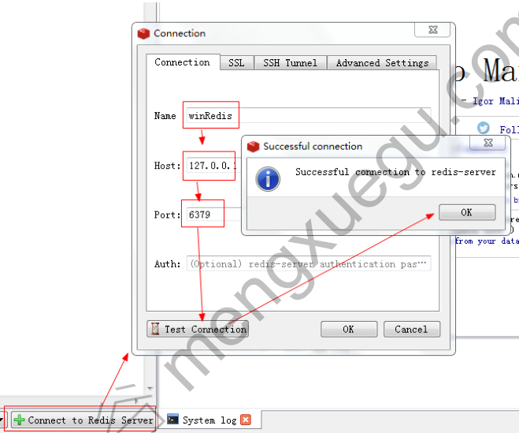

    - 打开操作 Redis命令行窗口

      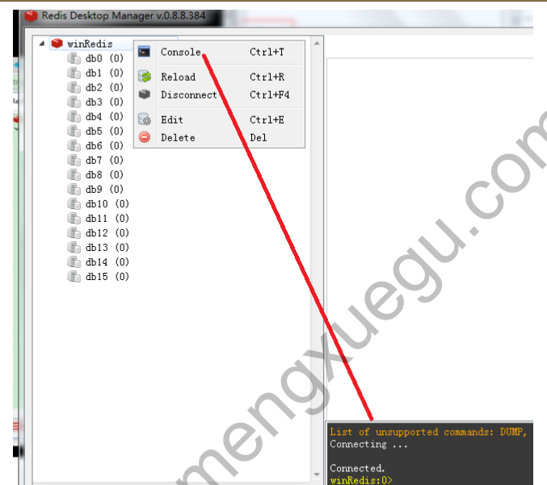

      


