一 、docker简介

#### 1.1docker能解决什么问题

```java
1.难题：
	软件开发中最麻烦的事之一，就是环境配置。软件从开发到上线，一般都要经过开发、测试、上线。而每个人的计算机环境配置可能都不相同，谁能保证自已开发的软件，能在每一台机器上跑起来？
每台机器必须保证：操作系统的设置，各种依赖和组件的安装都正确，软件才能运行起来。
比如，开发与部署一个 Java 应用，计算机必须安装 JDK，并配置环境变量，还必须有各种依赖。在windows上进行开发，到Linux上进行部署时这些环境又得重装，这样很就麻烦。而且系统如果需要集群，那每一台机器都得重新配置环境。
开发人员经常说："它在我的机器可以正常运行"，言下之意就是，其他机器很可能跑不了。环境配置如此麻烦，换一台机器，就要重来一次，费力费时。很多人想到，能不能从根本上解决问题，软件可以带环境安装？也就是说，安装的时候，把原始环境一模一样地复制过来。

2.解决：
	开发人员可以使用  Docker 来解决 "它在我的机器可以正常运行" 的问题，它会将运行程序的相关配置打包（打包成一个镜像），然后直接搬移到新的机器上运行。
```

#### 1.2什么是虚拟机技术

```java
虚拟机（virtual machine）就是带环境安装的一种解决方案。
它可以在一种操作系统里面运行另一种操作系统，比如 VMware workstation 虚拟化产品提供了虚拟的硬件，在Windows 系统里面运行 Linux 系统。安装在虚拟机（如Linux）上的应用程序对此毫无感知，因为虚拟机看上去跟真实系统一模一样，而对于底层系统(如Windows)来说，虚拟机(如Linux)就是一个普通文件，不需要了就删掉，对
其他部分毫无影响。
```

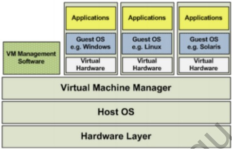

```java
缺点：虽然可以通过虚拟机还原软件需要的配置环境。但是虚拟机有几个缺点：
1.资源占用多
每个虚拟机会独占一部分内存和硬盘空间。哪怕虚拟机里面的应用程序，真正使用的内存只有 1MB，虚拟机依然需要几百 MB 的内存才能运行。
2.冗余步骤多
虚拟机是完整的操作系统，一些系统级别的操作步骤，往往无法跳过，比如用户登录。
3.启动慢
启动硬件上的操作系统需要多久，启动虚拟机就需要多久。可能要等几分钟，虚拟机才能真正运行。
```

#### 1.3什么是容器

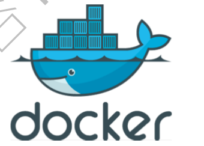

##### 1.3.1容器技术

由于虚拟机存在以上那些缺点，Linux发展出了另外一种虚拟化技术：Linux容器（Linux Containers,缩写为LXC）。

```java
容器与虚拟机有所不同，虚拟机通过虚拟软件中间层将一台或者多台独立的虚拟机器运行在物理硬件之上。而容器则是直接运行在操作系统内核之上，是进程级别的，并对进程进行了隔离，而不是模拟一个完整的操作系统。因此，容器虚拟化也被称为“操作系统级虚拟化”，容器技术可以将软件需要的环境配置都打包到一个隔离的容器中。让多个独立的容器高效且轻量的运行在同一台宿主机上。而Docker就是为了实现这一切而生的。
```

##### 1.3.2容器与虚拟机比较

1）本质上的区别：

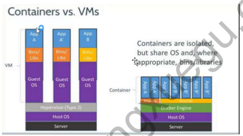

2）使用上的区别：

容器：体积小，启动快（秒级），资源占用少（只占用需要的资源），好评如潮。

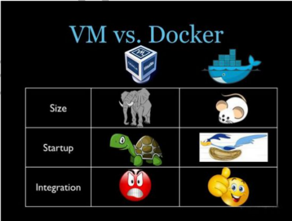

**虚拟机已死，容器才是未来！！！**

#### 1.4分析docker容器架构

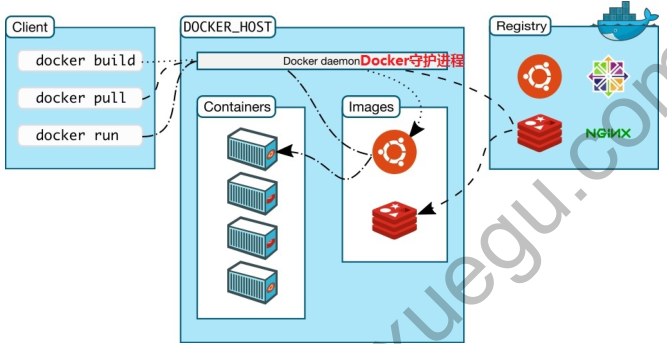

##### 1.4.1docker客户端和服务端

```java
docker是一个C/S架构程序。docker客户端只需要向docker服务器或者守护进程发出请求，服务器或者守护进程将完成所有工作并返回结果。docker提供了一个命令行工具和一整套RESTful API。你可以在同一台宿主机上运行docker守护进程和客户端，也可以从本地的docker客户端连接到运行在另一台宿主机上的远程docker守护进程。
```

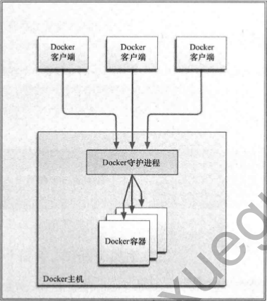

##### 1.4.2docker镜像（Image）

镜像（Image）是docker中的一个模板。通过docker镜像来创建docker容器，一个镜像可以创建出多个容器。镜像是由一系列指令一步一步构建出来的。

镜像与容器的关系类似于java中类与对象的关系。镜像体积很小非常“便携”，易于分享、存储和更新。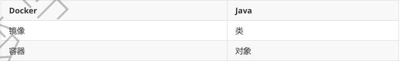

##### 1.4.3docker容器（Container）

```
容器（container）是基于镜像创建的运行实例，一个容器中可以运行一个或多个应用程序。
docker可以帮助你构建和部署容器，你只需要把自己的应用程序或者服务打包放进容器即可。
我们可以认为镜像是docker生命周期中的构建后者打包阶段，而容器则是启动或者执行阶段。
可以理解容器中有包含：一个精简版的Linux环境+要运行的应用程序。
```

##### 1.4.4docker仓库（repository）

```java
1.仓库（Repository）是集中存放镜像文件的场所。
2.有时候会把仓库（Repository）和仓库注册服务器（Registry）混为一谈，但并不严格区分。实际上，仓库注册服务器上往往存放着多个仓库，每个仓库中又包含了多个镜像，每个镜像有不同的标签（tag）。
3.仓库分为公有仓库（Public）和私有仓库（Private）两种。
  1）Docker公司运营的公共仓库叫做 Docker Hub （https://hub.docker.com/），存放了数量庞大的镜像供用户下载。用户可以在Docker Hub注册账号，分享并保存自己的镜像。（说明：在Docker Hub下载镜像巨慢）
  2）国内的公有仓库包括阿里云 、网易云 等，可以提供大陆用户更稳定快速的访问。
4.当用户创建了自己的镜像之后就可以使用 push 命令将它上传到公有或者私有仓库，这样下次在另外一台机器上使用这个镜像时候，只需要从仓库上 pull 下来就可以了。
```

docker仓库的概念和git类似，注册服务器可以理解为GitHub这样的托管服务器。

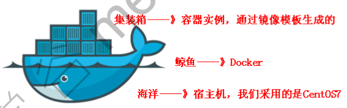

### 二、VMware和Centos7安装

安装详解请见目录 "相关软件操作/centos.md"

### 三、docker安装卸载与启停

#### 3.1查看当前系统的内核版本

查看当前内核版本是否高于3.10

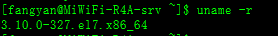

#### 3.2安装docker服务

使用镜像仓库进行安装，采用yum命令在线安装（即电脑需要联网）

root用户运行以下命令：

1. 卸载旧版本：（如果安装过旧版本的话）

   Docker 的早期版本称为  docker 或  docker-engine 。如果安装了这些版本，请卸载它们及关联的依赖资源。

```properties
yum remove docker docker-common docker-selinux docker-engine
```

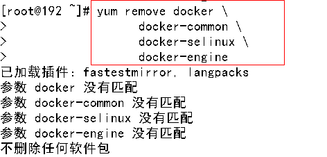

2. 安装所需的软件包

```properties
yum-utils 提供了  yum-config-manager 实用程序，并且  devicemapper 存储驱动需要 device-mapper-persistent-data 和  lvm2 。
# yum install -y yum-utils device-mapper-persistent-data lvm2
```

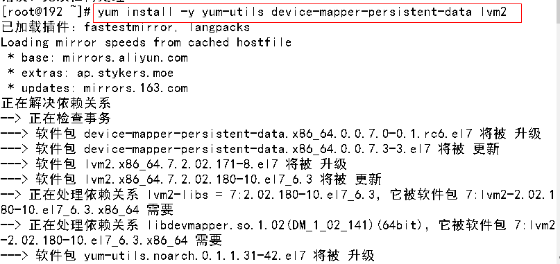

3. 设置docker的镜像仓库

```properties
yum-config-manager --add-repo https://download.docker.com/linux/centos/docker-ce.repo
```

上面可能会报错（原因是国内访问不到docker官方镜像的缘故）

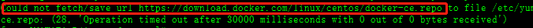

解决:使用以下方式：阿里源访问

```properties
yum-config-manager --add-repo http://mirrors.aliyun.com/docker-ce/linux/centos/docker-ce.repo
```

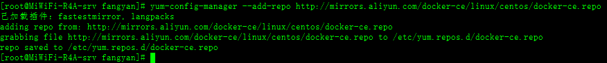

4. 安装最新版本docker CE

```properties
yum install docker-ce
```

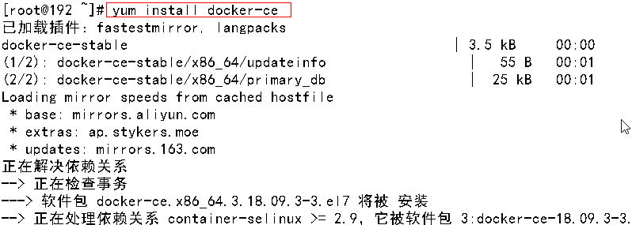

* 安装中出现下面提示，输入y后回车

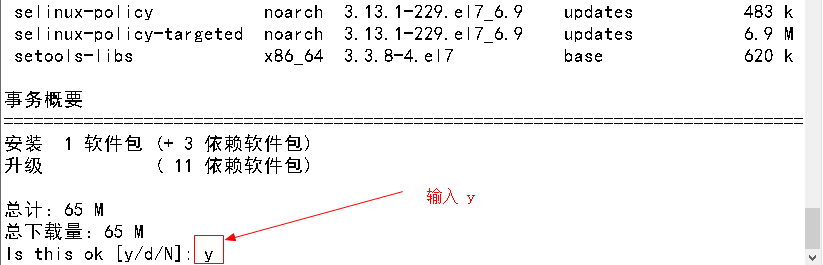

* 如用的docker国外网下载比较慢，当出现下面提示，输入y后回车

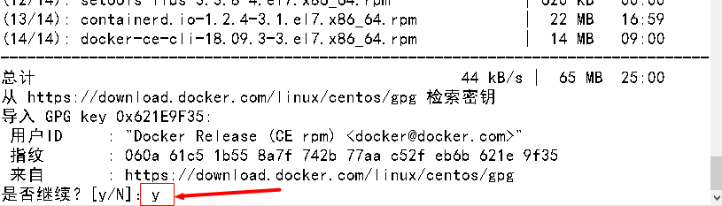

5. 安装完成

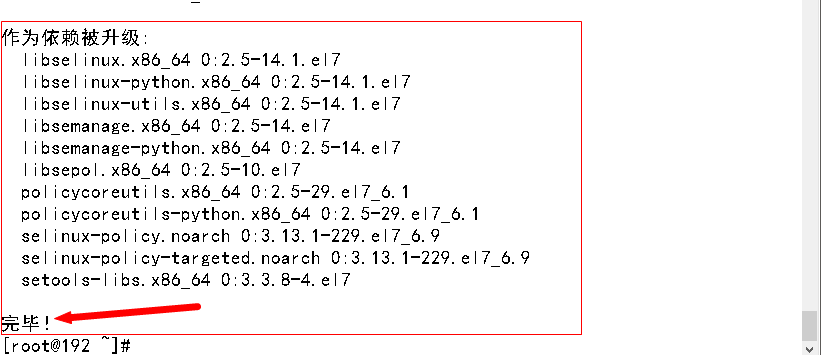

**如果上面安装不成功，则按3.3节卸载再按上面重新安装**

#### 3.3卸载docker服务

1. 卸载docker软件包

```properties
[root@mengxuegu /]# yum remove docker-ce
```

2.删除镜像、容器等 

```properties
[root@mengxuegu /]# rm -rf /var/lib/docker
```

#### 3.4启动与停止docker服务

* systemctl命令是系统服务管理器指令，它是service和chkconfig两个命令组合。

  ```properties
  1.启动docker： systemctl start docker
  2.停止docker： systemctl stop docker
  3.重启docker： systemctl restart docker
  4.查看docker状态： systemctl status docker
  5.开机自动启动docker： systemctl enable docker
  ```

#### 3.5docker版本查看

查看当前安装的docker版本

```properties
[root@mengxuegu /]# docker version
```

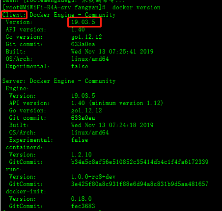

#### 3.6docker帮助命令

* 查看docker帮助命令： docker --help

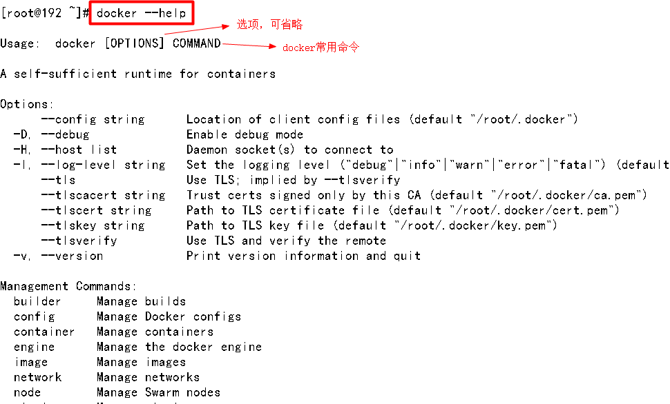

* 查看docker概要信息： docker info

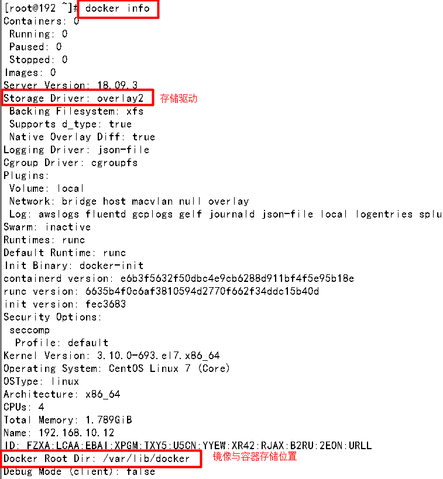

### 四、docker镜像操作

```
Docker镜像是由文件系统叠加而成（是一种文件的存储形式）。最底端是一个文件引导系统，即bootfs，这
很像典型的Linux/Unix的引导文件系统。Docker用户几乎永远不会和引导系统有什么交互。实际上，当一个
容器启动后，它将会被移动到内存中，而引导文件系统则会被卸载，以留出更多的内存供磁盘镜像使用。
Docker容器启动是需要的一些文件，而这些文件就可以称为Docker镜像。
```

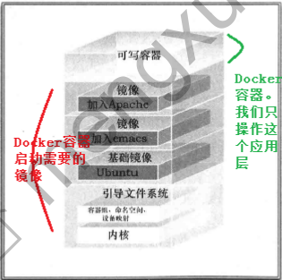

#### 4.1列出镜像

docker官网镜像搜索：https://hub.docker.com/

```properties
1.显示所有已下载的镜像
# docker images
2.只显示镜像id
# docker images -q

#说明
1.这些镜像都是存放在宿主机的 /var/lib/docker目录下
2.为了区分同一个仓库下的不同镜像，Docker提供了一种称为标签（TAG）的功能，此功能使得同一仓库中存放多个相同的镜像（不同版本号即tag）
3.我们可以使用仓库名后面加上一个冒号和标签名 ( REPOSITORY:TAG ) 来指定该仓库中的某一具体的镜像，
如果未指定镜像的标签，将下载lastest最新版本
```

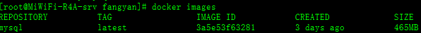

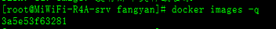

#### 4.2搜索镜像

```properties
1.搜索网络中的镜像
# docker search [OPTIONS] 镜像名称

2.options选项说明
-s 列出关注数大于指定值的镜像
# docker search -s 100 centos
--no-trunc 显示完整的镜像描述DESCRIPTION
# docker search --no-trunc centos
```

#### 4.3拉取镜像

```properties
# docker pull 镜像名:标签名
例如拉取mysql:5.6版本镜像
# docker pull mysql:5.6
```

由于官方镜像库在国外，拉取太慢或者拉取失败，因此需要配置国内镜像加速器

##### 4.3.1配置阿里云镜像

1. 阿里云镜像加速器地址

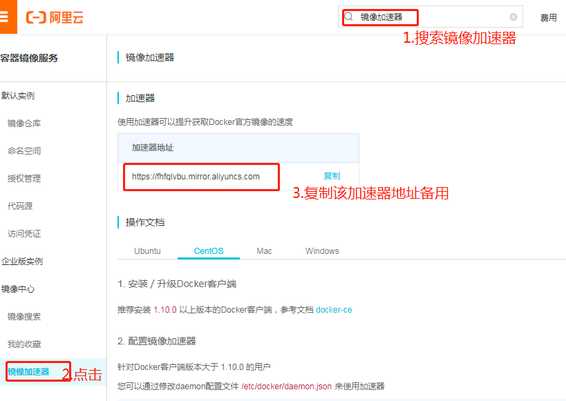

2. 通过修改daemon配置文件/etc/docker/daemon.json来使用加速器,如果不存在则手动创建

   ```properties
   # vim /etc/docker/daemon.json
   ```

3. 文件加入以下内容

```properties
{
 "registry-mirrors": ["https://fhfqlvbu.mirror.aliyuncs.com"]
}
```

4. 一定要重启docker服务，如果重启docker后无法加速，可以重新启动CentOS

```properties
# 重载此配置文件
systemctl daemon-reload
# 重启 docker
systemctl restart docker
```

再通过 docker pull 命令下载镜像：速度杠杠的

```properties
# docker pull mysql
```

#### 4.4删除镜像

```properties
删除某一个镜像
# docker rmi 镜像ID
删除所有镜像 (是 `` 反单引号 )  其中  docker images -q 获取所有镜像id
# docker rmi `docker images -q`
```

### 五、docker容器操作

#### 5.1查看容器

```properties
1.查看正在运行的容器
# docker ps
2.查看所有的容器（运行与未运行的）
# docker ps -a
3.查看最后一次运行的容器
# docker ps -l
4.查看停止的容器
# docker ps -f status=exited
```

#### 5.2创建与启动容器

**创建容器命令**

```properties
# docker run [options] 镜像名：标签名
创建容器  [OPTIONS] 常用的参数说明：
-i 表示交互式运行容器（就是创建容器后，马上会启动容器，并进入容器 ），通常与 -t 同时使用 。
-t 启动后会进入其容器命令行, 通常与  -i 同时使用; 加入  -it 两个参数后，容器创建就能登录进去。即
分配一个伪终端。
--name 为创建的容器指定一个名称 。
-d 创建一个守护式容器在后台运行，并返回容器ID；
这样创建容器后不会自动登录容器，如果加 -i 参数，创建后就会运行容器。
-v 表示目录映射, 格式为： -p 宿主机目录:容器目录
注意：最好做目录映射，在宿主机上做修改，然后共享到容器上。
-p 表示端口映射，格式为： -p 宿主机端口:容器端口

1. 创建一个交互式容器（创建后立刻启动并进入容器）并取名为  mycentos , (  /bin/bash 是linux中的命令解析器,会进入到容器里面命令行)
# docker run -it --name=mycentos centos:7 /bin/bash
同一个镜像可运行多个容器
```

#### 5.3退出容器

```properties
注意：退出容器指在容器内部操作的命令
1.退出并停止当前容器(如果是以守护容器执行exit，则只退出不停止)
# exit
2.退出不停止当前容器
键盘：ctr+q+p   需要按两次即可退出
```

#### 5.4启动与停止容器

```properties
1.启动已运行过的容器
# docker start 容器名|容器id
2.启动所有运行过的容器
# docker start `docker ps -a -q`
3.停止正在运行的容器
# docker stop 容器名|容器id
4.停止所有正在运行的容器
# docker stop `docker ps -a -q`
5.强制停止正在运行的容器
# docker kill 容器名|容器id
6.强制停止所有正在运行的容器
# docker kill `docker ps -a -q`
```

#### 5.5创建守护式容器

```properties
# docker run -id --name=mycentos2 centos:7
-i 运行容器
-d 创建守护式容器
```

#### 5.6登录容器

```properties
# docker exec -it 容器名称|容器id /bin/bash

说明：以docker exec登录的容器，执行exit命令只会退出容器  不会停止容器
```

#### 5.7拷贝宿主机与容器中的文件

```properties
1.拷贝宿主机中的文件到容器中 (容器必须是启动的)
# docker cp 要拷贝的宿主机文件或目录 容器名称:容器文件或目录
例：docker cp /opt/fangyan mycentos2:/opt  （将宿主机/opt下的fangyan文件拷贝到mycentos2容器的/opt目录下）
2.从容器内文件拷贝到宿主机
# docker cp 容器名称:要拷贝的容器文件或目录 宿主机文件或目录

注意：文件拷贝docker cp 命令均在宿主机中操作
```

#### 5.8数据目录挂载

```properties
# docker run -id -v /宿主机绝对路径目录:/容器内目录 --name=容器名  镜像名：标签名
例：docker run -id -v /opt:/opt --name=mycentos3 centos:7
说明：根据centos：7创建（-d）并运行（-i）一个守护式容器mycentos3，并且宿主机的/opt目录和容器的/opt目录做映射，此时修改宿主机或者容器内的/opt下内容，都将会映射到对应的容器或宿主机/opt目录下，保持同步。

# docker run -id -v /宿主机绝对路径目录:/容器内目录:ro --name=容器名  镜像名：标签名
说明：在映射目录后加 ：ro  即可实现目录挂载只读（Read-Only）权限。
```

#### 5.9看容器内部细节

```properties
# docker inspect mycentos2
```

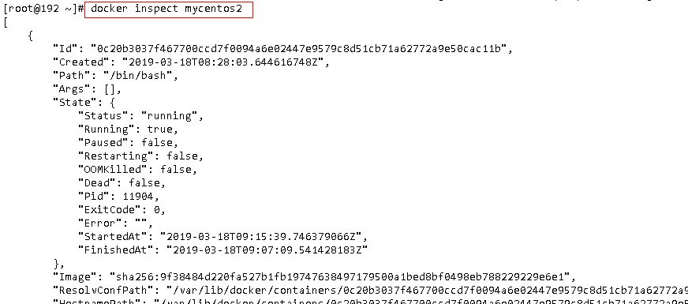

#### 5.10查看容器ip地址

```properties
# docker inspect --format='{{.NetworkSettings.IPAddress}}' mycentos2
```

#### 5.12删除容器

```properties
1.删除指定容器
# docker rm 容器名称 | 容器ID
2.删除所有容器（其中运行中的容器无法删除，所以先停再删）
# docker rm `docker ps -a -q`
```

