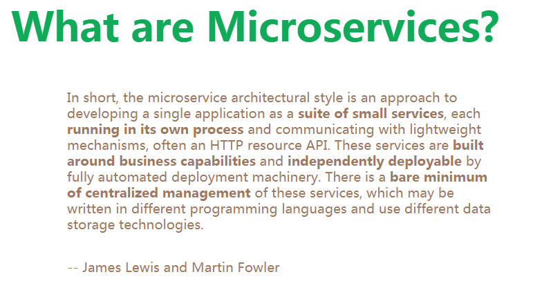
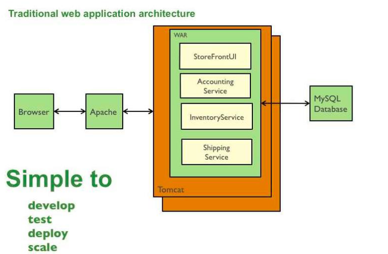
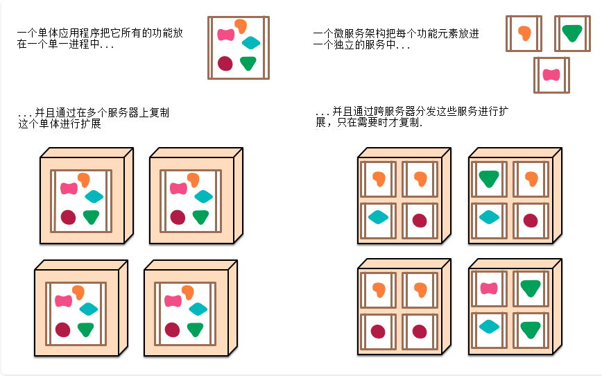
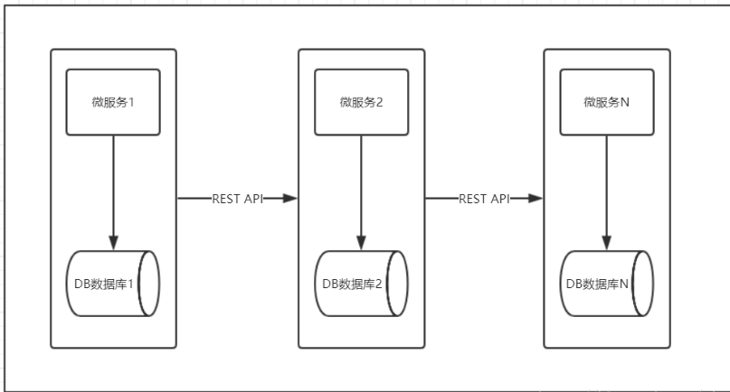
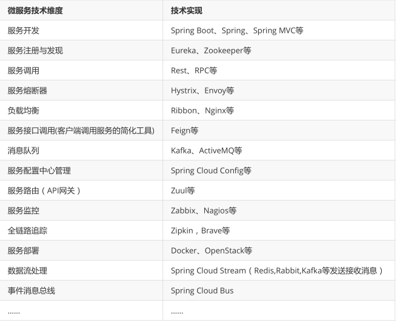

### 一 微服务架构概要

#### 1.什么是微服务

微服务详细文档https://martinfowler.com/articles/microservices.html#MicroservicesAndSoa



微服务是一种架构风格，是以开发一组小型服务的方式来作为一个独立的应用系统，每个服务都运行在
自已的进程中，服务之间采用轻量级的HTTP通信机制 ( 通常是采用HTTP的RESTful API )进行通信。这
些服务都是围绕具体业务进行构建的，并且可以独立部署到生产环境上。这些服务可以用不同的编程语
言编写，并且可以使用不同的数据存储技术。对这些微服务我们只需要使用一个非常轻量级的集中式管
理来进行协调。

#### 2.单体应用架构

```properties
1.单体应用架构
	一个应用中包含了应用程序的所有功能（比如：页面，代码，配置等），把应用打成一个war或jar包部署到Tomcat中，通常称为单体应用架构。
2.单体应用架构的优缺点
  (1)优点:
    1)易于开发&测试：单个应用包含所有功能，不涉及多个应用的互联互调，便于在团队之间开发与测试。 易于部署：只需将单个应用打成war或jar包，进行部署到Tomcat即可，运维起来比较方便。
    2)易于整体扩展：当应用负载压力大时，将这个应用复制几份，分别部署在不同的服务器上，再通过负载均衡即可提高应用的并发能力。
  (2)缺点:
  	1)复杂性高：由于是单个应用，所以整个项目文件包含的模块非常多，导致模块的边界模糊、依赖关系不清晰、代码的质量参差不齐，混乱的堆在一起，使得整个项目非常复杂。以致每次修改代码，都非常小心，可能添加一个简单的功能，或者修改一个Bug都会带来隐藏的缺陷。
  	2)技术债务：随着时间的推移、需求的变更和技术人员的更替，会逐渐形成应用程序的技术债务，并且越积越多。
  	3)阻碍技术创新：
对于单体应用来说，技术是在开发之前经过慎重评估后选定的，每个团队成员都必须使用相同的开发语言、持久化存储及消息系统。
```

3. 单体架构图:

   

   

#### 3.微服务架构

```properties
微服务架构总结:
	1)微服务的核心就是将传统的单一应用，根据业务拆分成一个一个的服务，彻底地去耦合,每一个微服务提供单个业务功能的服务，一个服务做一件事。
	2)在 IDEA 工具中使用Maven构建的一个个独立的 Module ，也就是使用Spring Boot 开发的一个个小模块就是一个个微服务，将专业的事交给专业的模块来做。比如一个大型项目可能有上百个微服务，将这些微服务集中起来构成一个大的系统，对外暴露服务进行调用与使用。
	3)从技术角度看就是一种小而独立的处理过程，类似进程概念，能够自行单独启动或销毁，拥有自己独立的数据库。
```

微服务架构图:





#### 4.微服务架构技术栈



##### 5.面试题

```properties
spring Cloud 使用 RESTful API 实现服务之间通信
Dubbo 使用 RPC （远程过程调用） 实现服务之间通信
```

```properties
springboot和springcloud的关系:
	1)Spring Boot 可以离开 Spring Cloud 单独使用开发项目，但是Spring Cloud离不开SpringBoot，属于依赖的关系.
	2)Spring Boot 专注于快速方便的开发单个个体微服务，Spring Cloud 关注全局的服务治理框架。
	3)Spring Cloud 是关注全局的微服务协调整理治理框架，它将 Spring Boot 开发的一个个单体微服务整合并管理起来，为各个微服务之间提供，配置管理、服务发现、断路器、路由、微代理、事件总线、全局锁、决策竞选、分布式会话等等集成服务。
```

#### 6.参考资料

官网: http://spring.io/projects/spring-cloud
各组件说明（中文版）：https://springcloud.cc/spring-cloud-netflix.html
详细文档版：
	英文版：https://cloud.spring.io/spring-cloud-static/Finchley.SR2/single/spring-cloud.html
	中文版：https://springcloud.cc/spring-cloud-dalston.html
Spring Cloud 中国社区：http://springcloud.cn/
Spring Cloud 中文网：https://springcloud.cc/
Spring Cloud 目前集合了21种分布式微服务架构技术