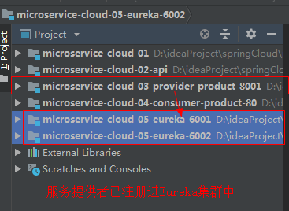

### 一 微服务架构概要

#### 1.1.什么是微服务

微服务详细文档https://martinfowler.com/articles/microservices.html#MicroservicesAndSoa


微服务是一种架构风格，是以开发一组小型服务的方式来作为一个独立的应用系统，每个服务都运行在
自已的进程中，服务之间采用轻量级的HTTP通信机制 ( 通常是采用HTTP的RESTful API )进行通信。这
些服务都是围绕具体业务进行构建的，并且可以独立部署到生产环境上。这些服务可以用不同的编程语
言编写，并且可以使用不同的数据存储技术。对这些微服务我们只需要使用一个非常轻量级的集中式管
理来进行协调。

#### 1.2.单体应用架构

```properties
1.单体应用架构
	一个应用中包含了应用程序的所有功能（比如：页面，代码，配置等），把应用打成一个war或jar包部署到Tomcat中，通常称为单体应用架构。
2.单体应用架构的优缺点
  (1)优点:
    1)易于开发&测试：单个应用包含所有功能，不涉及多个应用的互联互调，便于在团队之间开发与测试。 易于部署：只需将单个应用打成war或jar包，进行部署到Tomcat即可，运维起来比较方便。
    2)易于整体扩展：当应用负载压力大时，将这个应用复制几份，分别部署在不同的服务器上，再通过负载均衡即可提高应用的并发能力。
  (2)缺点:
  	1)复杂性高：由于是单个应用，所以整个项目文件包含的模块非常多，导致模块的边界模糊、依赖关系不清晰、代码的质量参差不齐，混乱的堆在一起，使得整个项目非常复杂。以致每次修改代码，都非常小心，可能添加一个简单的功能，或者修改一个Bug都会带来隐藏的缺陷。
  	2)技术债务：随着时间的推移、需求的变更和技术人员的更替，会逐渐形成应用程序的技术债务，并且越积越多。
  	3)阻碍技术创新：
对于单体应用来说，技术是在开发之前经过慎重评估后选定的，每个团队成员都必须使用相同的开发语言、持久化存储及消息系统。
```

3. 单体架构图:

   

   

#### 1.3.微服务架构

```properties
微服务架构总结:
	1)微服务的核心就是将传统的单一应用，根据业务拆分成一个一个的服务，彻底地去耦合,每一个微服务提供单个业务功能的服务，一个服务做一件事。
	2)在 IDEA 工具中使用Maven构建的一个个独立的 Module ，也就是使用Spring Boot 开发的一个个小模块就是一个个微服务，将专业的事交给专业的模块来做。比如一个大型项目可能有上百个微服务，将这些微服务集中起来构成一个大的系统，对外暴露服务进行调用与使用。
	3)从技术角度看就是一种小而独立的处理过程，类似进程概念，能够自行单独启动或销毁，拥有自己独立的数据库。
```

微服务架构图:


#### 1.4.微服务架构技术栈


#### 1.5.面试题

```properties
spring Cloud 使用 RESTful API 实现服务之间通信
Dubbo 使用 RPC （远程过程调用） 实现服务之间通信
```

```properties
springboot和springcloud的关系:
	1)Spring Boot 可以离开 Spring Cloud 单独使用开发项目，但是Spring Cloud离不开SpringBoot，属于依赖的关系.
	2)Spring Boot 专注于快速方便的开发单个个体微服务，Spring Cloud 关注全局的服务治理框架。
	3)Spring Cloud 是关注全局的微服务协调整理治理框架，它将 Spring Boot 开发的一个个单体微服务整合并管理起来，为各个微服务之间提供，配置管理、服务发现、断路器、路由、微代理、事件总线、全局锁、决策竞选、分布式会话等等集成服务。
```

#### 1.6.参考资料

官网: http://spring.io/projects/spring-cloud
各组件说明（中文版）：https://springcloud.cc/spring-cloud-netflix.html
详细文档版：
	英文版：https://cloud.spring.io/spring-cloud-static/Finchley.SR2/single/spring-cloud.html
	中文版：https://springcloud.cc/spring-cloud-dalston.html
Spring Cloud 中国社区：http://springcloud.cn/
Spring Cloud 中文网：https://springcloud.cc/
Spring Cloud 目前集合了21种分布式微服务架构技术

### 二 Rest构建分布式微服务架构实战项目

#### 2.1.开发环境要求

```properties
jdk1.8 (Spring Boot 推荐jdk1.8及以上)： java version "1.8.0_151"
Maven 3.x (maven 3.2 以上版本)：Apache Maven 3.3.9
IntelliJ IDEA ：IntelliJ IDEA 2018.2.1 x64
Spring Boot ：Spring Boot 2.0.7
Spring Cloud 使用当前最新稳定版本：Finchley SR2 , 搭配 Spring Boot 2.0.7 稳定版
```

官网: http://spring.io/projects/spring-cloud

**springcloud和springboot依赖关系**


#### 2.2微服务架构实战项目介绍

1. 项目需求

以 商品管理模块 做一个微服务架构通用案例，消费者Consumer（Client）通过REST调用 提供者
Provider（Server）提供的商品管理服务。


2. maven的分包分模块架构

```properties
一个 Project 父工程下有多个 Module 子模块
microservice-cloud-01 父工程（Project）下初始化 3个子模块（Module）：
 1)microservice-cloud-02-api 封装的整体Entity/接口/公共配置等
 2)microservice-cloud-03-provider-product-8001 微服务的服务提供者Provider
 3)microservice-cloud-04-consumer-product-80 微服务的服务消费者Consumer
```

#### 2.3构建project父工程(microservice-cloud-01)

##### 2.3.1创建一个空工程


##### 2.3.2创建父工程(pom类型)

**注意:父工程microservice-cloud-01,切记是packaging是pom类型**

1. 创建父工程microservice-cloud-01


2. 删除src目录及子目录,在pom.xml中手动指定为pom类型,如下所示:


3. 在pom.xml中定义公共依赖,并各个子模块聚合起来

   ```xml
   <?xml version="1.0" encoding="UTF-8"?>
   <project xmlns="http://maven.apache.org/POM/4.0.0"
            xmlns:xsi="http://www.w3.org/2001/XMLSchema-instance"
            xsi:schemaLocation="http://maven.apache.org/POM/4.0.0 http://maven.apache.org/xsd/maven-4.0.0.xsd">
       <modelVersion>4.0.0</modelVersion>
   
       <groupId>com.fy.springcloud</groupId>
       <artifactId>microservice-cloud-01</artifactId>
       <version>1.0-SNAPSHOT</version>
       <modules>
           <module>../microservice-cloud-02-api</module>
           <module>../microservice-cloud-03-provider-product-8001</module>
           <module>../microservice-cloud-04-consumer-product-80</module>
       </modules>
       <!--手动指定pom-->
       <packaging>pom</packaging>
   
       <!-- spring boot 采用 2.0.7 版本 -->
       <parent>
           <groupId>org.springframework.boot</groupId>
           <artifactId>spring-boot-starter-parent</artifactId>
           <version>2.0.7.RELEASE</version>
           <relativePath/>
       </parent>
   
       <properties>
           <project.build.sourceEncoding>UTF-8</project.build.sourceEncoding>
           <maven.compiler.source>1.8</maven.compiler.source>
           <maven.compiler.target>1.8</maven.compiler.target>
           <junit.version>4.12</junit.version>
           <!-- spring cloud 采用 Finchley.SR2 版本 -->
           <spring-cloud.version>Finchley.SR2</spring-cloud.version>
       </properties>
   
   
       <!--依赖声明-->
       <dependencyManagement>
           <dependencies>
               <dependency>
                   <groupId>org.springframework.cloud</groupId>
                   <artifactId>spring-cloud-dependencies</artifactId>
                   <version>${spring-cloud.version}</version>
                   <type>pom</type>
                   <!--maven不支持多继承，使用import来依赖管理配置-->
                   <scope>import</scope>
               </dependency>
               <!--导入 mybatis 启动器-->
               <dependency>
                   <groupId>org.mybatis.spring.boot</groupId>
                   <artifactId>mybatis-spring-boot-starter</artifactId>
                   <version>1.3.2</version>
               </dependency>
               <!--druid数据源-->
               <dependency>
                   <groupId>com.alibaba</groupId>
                   <artifactId>druid</artifactId>
                   <version>1.1.12</version>
               </dependency>
               <dependency>
                   <groupId>mysql</groupId>
                   <artifactId>mysql-connector-java</artifactId>
                   <version>8.0.13</version>
               </dependency>
               <dependency>
                   <groupId>junit</groupId>
                   <artifactId>junit</artifactId>
                   <version>${junit.version}</version>
                   <scope>test</scope>
               </dependency>
           </dependencies>
       </dependencyManagement>
   </project>
   ```

#### 2.4构建公共模块(microservice-cloud-02-api)

##### 2.4.1创建模块


创建完成后请回到父工程查看pom文件变化

##### 2.4.2pom文件

```xml
<?xml version="1.0" encoding="UTF-8"?>
<project xmlns="http://maven.apache.org/POM/4.0.0"
         xmlns:xsi="http://www.w3.org/2001/XMLSchema-instance"
         xsi:schemaLocation="http://maven.apache.org/POM/4.0.0 http://maven.apache.org/xsd/maven-4.0.0.xsd">
    <parent>
        <artifactId>microservice-cloud-01</artifactId>
        <groupId>com.fy.springcloud</groupId>
        <version>1.0-SNAPSHOT</version>
        <relativePath>../microservice-cloud-01/pom.xml</relativePath>
    </parent>
    <modelVersion>4.0.0</modelVersion>

    <artifactId>microservice-cloud-02-api</artifactId>


</project>
```

##### 2.4.3创建商品实体类

```java
public class Product implements Serializable {//必须序列化
    private Long pid; //主键
    private String productName; //产品名称
    // 来自那个数据库，因为微服务架构可以一个服务对应一个数据库，同一个信息被存储到不同数据库
    private String dbSource;
    public Product(String productName) {
        this.productName = productName;
    }
    public Product(Long pid, String productName, String dbSource) {
        this.pid = pid;
        this.productName = productName;
        this.dbSource = dbSource;
    }
    public Product() {
    }
    public Long getPid() {
        return pid;
    }
    public void setPid(Long pid) {
        this.pid = pid;
    }
    public String getProductName() {
        return productName;
    }
    public void setProductName(String productName) {
        this.productName = productName;
    }
    public String getDbSource() {
        return dbSource;
    }
    public void setDbSource(String dbSource) {
        this.dbSource = dbSource;
    }
}
```

#### 2.5构建服务提供者

##### 2.5.1创建module:microservice-cloud-03-provider-product-8001


##### 2.5.2配置pom.xml文件

```xml
<?xml version="1.0" encoding="UTF-8"?>
<project xmlns="http://maven.apache.org/POM/4.0.0"
         xmlns:xsi="http://www.w3.org/2001/XMLSchema-instance"
         xsi:schemaLocation="http://maven.apache.org/POM/4.0.0 http://maven.apache.org/xsd/maven-4.0.0.xsd">
    <parent>
        <artifactId>microservice-cloud-01</artifactId>
        <groupId>com.fy.springcloud</groupId>
        <version>1.0-SNAPSHOT</version>
        <relativePath>../microservice-cloud-01/pom.xml</relativePath>
    </parent>
    <modelVersion>4.0.0</modelVersion>

    <artifactId>microservice-cloud-03-provider-product-8001</artifactId>

    <dependencies>
        <dependency>
            <groupId>com.fy.springcloud</groupId>
            <artifactId>microservice-cloud-02-api</artifactId>
            <version>${project.version}</version>
        </dependency>
        <!--springboot web启动器-->
        <dependency>
            <groupId>org.springframework.boot</groupId>
            <artifactId>spring-boot-starter-web</artifactId>
        </dependency>
        <!-- mybatis 启动器-->
        <dependency>
            <groupId>org.mybatis.spring.boot</groupId>
            <artifactId>mybatis-spring-boot-starter</artifactId>
        </dependency>
        <dependency>
            <groupId>org.springframework.boot</groupId>
            <artifactId>spring-boot-starter-test</artifactId>
        </dependency>
        <dependency>
            <groupId>junit</groupId>
            <artifactId>junit</artifactId>
        </dependency>
        <dependency>
            <groupId>mysql</groupId>
            <artifactId>mysql-connector-java</artifactId>
        </dependency>
        <dependency>
            <groupId>com.alibaba</groupId>
            <artifactId>druid</artifactId>
        </dependency>
    </dependencies>

</project>
```

##### 2.5.3配置application.yml文件

```yaml
server:
  port: 8001

mybatis:
  config-location: classpath:mybatis/mybatis.cfg.xml        # mybatis配置文件所在路径
  type-aliases-package: com.fy.springcloud.entities  # 所有Entity别名类所在包
  mapper-locations: classpath:mybatis/mapper/**/*.xml       # mapper映射文件

spring:
  application:
    name: microservice-product #这个很重要，这在以后的服务与服务之间相互调用一般都是根据这个name
  datasource:
    type: com.alibaba.druid.pool.DruidDataSource            # 当前数据源操作类型
    driver-class-name: com.mysql.cj.jdbc.Driver             # mysql驱动包
    url: jdbc:mysql://127.0.0.1:3306/springcloud_db01?serverTimezone=GMT%2B8  # 数据库名称
    username: root
    password: 123
    dbcp2:
      min-idle: 5                                # 数据库连接池的最小维持连接数
      initial-size: 5                            # 初始化连接数
      max-total: 5                               # 最大连接数
      max-wait-millis: 150                       # 等待连接获取的最大超时时间
```

##### 2.5.4运行MySQL数据库脚本

```mysql
DROP DATABASE IF EXISTS springcloud_db01;
CREATE DATABASE springcloud_db01 CHARACTER SET UTF8;
USE springcloud_db01;
CREATE TABLE product
(
pid BIGINT NOT NULL PRIMARY KEY AUTO_INCREMENT,
product_name VARCHAR(50),
db_source  VARCHAR(50)
);
INSERT INTO product(product_name,db_source) VALUES('格力空调',DATABASE());
INSERT INTO product(product_name,db_source) VALUES('海尔冰箱',DATABASE());
INSERT INTO product(product_name,db_source) VALUES('小短裙',DATABASE());
INSERT INTO product(product_name,db_source) VALUES('羽绒服',DATABASE());
INSERT INTO product(product_name,db_source) VALUES('韩版休闲鞋',DATABASE());
INSERT INTO product(product_name,db_source) VALUES('高贵鞋',DATABASE());
SELECT * FROM product;
```

##### 2.5.5创建mapper接口

```java
package com.fy.springcloud.mapper;

import com.fy.springcloud.entities.Product;

import java.util.List;

public interface ProductMapper {

    Product findById(Long pid);

    List<Product> findAll();

    boolean addProduct(Product product);
}

```

##### 2.5.6mybatis相关配置

1. src/main/resources下新建 mybatis 目录后新建  mybatis.cfg.xml 核心配置文件，内容如下：

   ```xml
   <?xml version="1.0" encoding="UTF-8" ?>
   <!DOCTYPE configuration
           PUBLIC "-//mybatis.org//DTD Config 3.0//EN"
           "http://mybatis.org/dtd/mybatis-3-config.dtd">
   <configuration>
       <settings>
           <!--开启驼峰命名-->
           <setting name="mapUnderscoreToCamelCase" value="true"/>
       </settings>
   </configuration>
   ```

2. src/main/resources/mybatis 下新建 mapper 目录后新建  ProductMapper.xml 映射文件，内容如下：

```xml
<?xml version="1.0" encoding="UTF-8" ?>
<!DOCTYPE mapper PUBLIC "-//mybatis.org//DTD Mapper 3.0//EN"
        "http://mybatis.org/dtd/mybatis-3-mapper.dtd">

<mapper namespace="com.fy.springcloud.mapper.ProductMapper">

    <select id="findById" resultType="Product" parameterType="Long">
   select pid, product_name, db_source from product where pid=#{pid};
  </select>

    <select id="findAll" resultType="Product">
   select pid, product_name, db_source from product;
  </select>

    <insert id="addProduct" parameterType="Product">
   INSERT INTO product(product_name, db_source) VALUES(#{productName}, DATABASE());
  </insert>

</mapper>
```

##### 2.5.7创建服务层

1. 部门服务接口:ProductService

```java 
//注意:@Service注解标在实现类上
package com.fy.springcloud.service;

import com.fy.springcloud.entities.Product;
import org.springframework.stereotype.Service;

import java.util.List;

public interface ProductService {

    boolean add(Product product);
    Product get(Long id);
    List<Product> list();
}

```

2. 部门服务接口实现类

```java
package com.fy.springcloud.service;

import com.fy.springcloud.entities.Product;
import com.fy.springcloud.mapper.ProductMapper;
import org.springframework.beans.factory.annotation.Autowired;
import org.springframework.stereotype.Service;

import java.util.List;

/**
 * @program: springCloud->ProductServiceImpl
 * @description: 服务层
 * @author: fangyan
 * @create: 2019-12-28 01:00
 **/
@Service
public class ProductServiceImpl implements ProductService {
    @Autowired
    ProductMapper productMapper;

    @Override
    public boolean add(Product product) {
        return productMapper.addProduct(product);
    }

    @Override
    public Product get(Long id) {
        return productMapper.findById(id);
    }

    @Override
    public List<Product> list() {
        return productMapper.findAll();
    }
}

```

##### 2.5.8创建控制层-提供者

商品微服务提供者REST：ProductController

```java
package com.fy.springcloud.controller;

import com.fy.springcloud.entities.Product;
import com.fy.springcloud.service.ProductService;
import org.springframework.beans.factory.annotation.Autowired;
import org.springframework.web.bind.annotation.*;

import java.util.List;


@RestController
public class ProductController {

    @Autowired
    private ProductService productService;

    @RequestMapping(value = "/product/add", method = RequestMethod.POST)
    public boolean add(@RequestBody Product product) {
        return productService.add(product);
    }

    @RequestMapping(value = "/product/get/{id}", method = RequestMethod.GET)
    public Product get(@PathVariable("id") Long id) {
        return productService.get(id);
    }

    @RequestMapping(value = "/product/list", method = RequestMethod.GET)
    public List<Product> list() {
        return productService.list();
    }


}

```

##### 2.5.9创建启动类

创建主启动类： MicroserviceProductProvider_8001

```java
package com.fy.springcloud;

import org.mybatis.spring.annotation.MapperScan;
import org.springframework.boot.SpringApplication;
import org.springframework.boot.autoconfigure.SpringBootApplication;


@MapperScan("com.fy.springcloud.mapper")
@SpringBootApplication
public class MicroserviceProductProvider_8001 {
    public static void main(String[] args) {
        SpringApplication.run(MicroserviceProductProvider_8001.class,args);
    }
}

```

##### 2.5.10功能测试

http://localhost:8001/product/get/3

http://localhost:8001/product/list

#### 2.6构建服务消费者

##### 2.6.1创建module:microservice-cloud-04-consumer-product-80


##### 2.6.2配置pom.xml文件

```xml
<?xml version="1.0" encoding="UTF-8"?>
<project xmlns="http://maven.apache.org/POM/4.0.0"
         xmlns:xsi="http://www.w3.org/2001/XMLSchema-instance"
         xsi:schemaLocation="http://maven.apache.org/POM/4.0.0 http://maven.apache.org/xsd/maven-4.0.0.xsd">
    <parent>
        <artifactId>microservice-cloud-01</artifactId>
        <groupId>com.fy.springcloud</groupId>
        <version>1.0-SNAPSHOT</version>
        <relativePath>../microservice-cloud-01/pom.xml</relativePath>
    </parent>
    <modelVersion>4.0.0</modelVersion>

    <artifactId>microservice-cloud-04-consumer-product-80</artifactId>


    <dependencies>
        <dependency>
            <groupId>com.fy.springcloud</groupId>
            <artifactId>microservice-cloud-02-api</artifactId>
            <version>${project.version}</version>
        </dependency>
        <dependency>
            <groupId>org.springframework.boot</groupId>
            <artifactId>spring-boot-starter-web</artifactId>
        </dependency>
    </dependencies>
</project>
```

##### 2.6.3配置application.yml文件

```yaml
server:
  port: 80
```

##### 2.5.4自定义Rest相关配置类(向容器注入RestTemplate组件)

在 com.fy.springcloud.config 包下新建配置类： ConfigBean
向容器中注入 RestTemplate 组件, 提供了多种简单便捷的访问 Restful 服务的方法，是Spring提供的用于访问Rest服务的客户端模板工具集。 (url, requestMap, ResponseBean.class)这三个参数分别代表：REST请求地址、请求参数、HTTP响应转换被转换成的对象类型。

```java
package com.fy.springcloud.config;

import org.springframework.context.annotation.Bean;
import org.springframework.context.annotation.Configuration;
import org.springframework.web.client.RestTemplate;

@Configuration
public class ConfigBean {

    @Bean
    public RestTemplate getRestTemplate(){
        return new RestTemplate();
    }
}

```

##### 2.5.5创建控制层-消费者

1. 在 com.fy.springcloud.controller 包下新建消费者: ProductController_Consumer

```java 
package com.fy.springcloud.controller;

import com.fy.springcloud.entities.Product;
import org.springframework.beans.factory.annotation.Autowired;
import org.springframework.web.bind.annotation.PathVariable;
import org.springframework.web.bind.annotation.RequestMapping;
import org.springframework.web.bind.annotation.RestController;
import org.springframework.web.client.RestTemplate;

import java.util.List;

@RestController
public class ProductController_consumer {
    private static final String REST_URL_PROFIX="http://localhost:8001";

    @Autowired
    private RestTemplate restTemplate;

    @RequestMapping("/consumer/product/get/{id}")
    public Product getProduct(@PathVariable("id") Long id){
        return restTemplate.getForObject(REST_URL_PROFIX + "/product/get/" + id, Product.class);
    }

    @RequestMapping("/consumer/product/list")
    public List<Product> getProduct(){
        return restTemplate.getForObject(REST_URL_PROFIX + "/product/list", List.class);
    }

    @RequestMapping("/consumer/product/add")
    public boolean add(Product product){
        return restTemplate.postForObject(REST_URL_PROFIX + "/product/add", product, boolean.class);
    }

}

```

##### 2.5.6创建启动类

```java
package com.fy.springcloud;

import com.fy.springcloud.entities.Product;
import org.springframework.boot.SpringApplication;
import org.springframework.boot.autoconfigure.SpringBootApplication;

@SpringBootApplication
public class ProductConsumer_80 {
    public static void main(String[] args) {
        SpringApplication.run(ProductConsumer_80.class, args);
    }
}

```

##### 2.5.7功能测试

http://localhost/consumer/product/get/3

http://localhost/consumer/product/list

http://localhost/consumer/product/add?productName=java

### 三 Eureka服务的注册与发现


* 问题:系统会根据业务被拆分成为很多的微服务,微服务的信息如何管理?

  springcloud中提供服务注册中心来管理微服务信息.

* 为什么用注册中心/

  1.微服务数量众多,要进行远程调用就需要知道服务端的ip地址和端口,注册中心帮助我们管理这些服务的ip和端口.

  2.微服务会实现上报自己的状态,注册中心统一管理这些微服务的状态,将存在问题的微服务踢出服务列表客户端获取到可用的服务进行调试.

  

#### 3.1Eureka介绍

* Spring Cloud Eureka 是对Netflix公司的Eureka的二次封装，它实现了服务治理的功能，Spring Cloud  Eureka 提供 Eureka Server 服务端与 Eureka Client 客户端 ，服务端即是Eureka服务注册中心，客户端完成微服务向Eureka服务的注册与发现。

* 客户端同时也具备一个内置的使用轮询(round-robin)负载算法的负载均衡器。在微服务启动后，将会向Eureka Server发送心跳(默认周期为30秒)。如果Eureka Server在多个心跳周期内没有接收到某个节点的心跳，EurekaServer将会从服务注册表中把这个服务节点移除（默认90秒）

* 下图显示了Eureka Server与Eureka Client的关系

  

```properties
1.Eureka Server 是服务端，负责管理各个微服务注册和发现。
2.在微服务上添加 Eureka Client 代码，就会访问到 Eureka Server 将此微服务注册在Eureka Server中，从而使服务消费方能够找到。
3. 微服务（服务消费者）需要调用另一个微服务（服务提供者）时，从 Eureka Server 中获取服务调用地址，进行远程调用。
```

#### 3.2搭建单机版Eureka Server服务注册中心

##### 3.2.1创建microservice-cloud-05-eureka-6001工程

##### 

##### 

##### 

##### 3.2.2配置pom.xml文件

```xml
<?xml version="1.0" encoding="UTF-8"?>
<project xmlns="http://maven.apache.org/POM/4.0.0"
         xmlns:xsi="http://www.w3.org/2001/XMLSchema-instance"
         xsi:schemaLocation="http://maven.apache.org/POM/4.0.0 http://maven.apache.org/xsd/maven-4.0.0.xsd">
    <parent>
        <artifactId>microservice-cloud-01</artifactId>
        <groupId>com.fy.springcloud</groupId>
        <version>1.0-SNAPSHOT</version>
        <relativePath>../microservice-cloud-01/pom.xml</relativePath>
    </parent>
    <modelVersion>4.0.0</modelVersion>

    <artifactId>microservice-cloud-05-eureka-6001</artifactId>

    <dependencies>
        <!-- 导入Eureka-server 服务端依赖 -->
        <dependency>
            <groupId>org.springframework.cloud</groupId>
            <artifactId>spring-cloud-starter-netflix-eureka-server</artifactId>
        </dependency>
    </dependencies>
</project>
```

##### 3.2.3配置application.yml文件

```yaml
server:
  port: 6001 # 服务端口

eureka:
  instance:
    hostname: localhost # eureka服务端的实例名称
  client:
    registerWithEureka: false # 服务注册，false表示不将自已注册到Eureka服务中
    fetchRegistry: false # 服务发现，false表示自己不从Eureka服务中获取注册信息
    serviceUrl:    # Eureka客户端与Eureka服务端的交互地址，集群版配置对方的地址，单机版配置自己（如果不配置则默认本机8761端口）
      #单机版
      defaultZone: http://${eureka.instance.hostname}:${server.port}/eureka/
```

##### 3.2.4创建主启动类

在启动类上添加  @EnableEurekaServer 注解，表示它是一个Eureka Server服务注册中心

```java
@EnableEurekaServer //标识一个eureka server 服务注册中心
@SpringBootApplication
public class Eurekaserver_6001 {
    public static void main(String[] args) {
        SpringApplication.run(Eurekaserver_6001.class, args);
    }
}
```

##### 3.2.5功能测试

启动后访问:http://localhost:6001  效果如下:


#### 3.3服务注册到Eureka Server服务注册中心

说明:将服务提供者（ microservice-cloud-03-provider-product-8001）注册到 Eureka Server注册中心（microservice-cloud-05-eureka-6001）


下面对 microservice-cloud-03-provider-product-8001 模块做对应的修改

##### 3.3.1配置pom.xml文件

* 添加配置

  ```xml
  <!-- 导入Eureka-client依赖 -->
          <dependency>
              <groupId>org.springframework.cloud</groupId>
              <artifactId>spring-cloud-starter-netflix-eureka-client</artifactId>
          </dependency>
  ```

##### 3.3.2配置application.yml文件

* 添加配置

```yaml
#eureka客户端配置
eureka:
  client:
    register-with-eureka: true #服务注册开关
    fetch-registry: true #服务发现开关
    serviceUrl:
      defaultZone: http://localhost:6001/eureka
```

##### 3.3.3修改主启动类

```java
//在启动类上添加  @EnableEurekaClient 注解，表示它是一个Eureka的客户端，本服务启动后会自动注册进Eureka Sever服务列表中

@EnableEurekaClient //标识该微服务为eureka客户端,将注册进eureka服务注册中心
@MapperScan("com.fy.springcloud.mapper")
@SpringBootApplication
public class MicroserviceProductProvider_8001 {
    public static void main(String[] args) {
        SpringApplication.run(MicroserviceProductProvider_8001.class,args);
    }
}
```

##### 3.3.4功能测试

```properties
1.先启动Eureka Server
2.再启动Eureka Client
3.访问:http://localhost:6001
如下:商品提供者已经注册到Eureka Server中
```


#### 3.4微服务注册信息完善

##### 3.4.1指定实例ID

问题：当前 状态中 含有主机名称


解决:修改Eureka Client的yml文件如下

```yaml
#eureka客户端配置
eureka:
  client:
    register-with-eureka: true #服务注册开关
    fetch-registry: true #服务发现开关
    serviceUrl:
      defaultZone: http://eureka6001.com:6001/eureka,http://eureka6002.com:6002/eureka
  instance:
    instance-id: ${spring.application.name}:${server.port} #实例id,指定eureka页面服务状态显示
    prefer-ip-address: true #指定鼠标悬停在实例id上显示ip地址
```

##### 3.4.2访问路径显示ip地址

问题:鼠标放在 实例 ID 上，显示的还是主机名，而不是显示IP地址

解决:修改Eureka Client的yml文件

如3.4.1中yml文件最后一行

eureka.instance.prefer-ip-address: true

#### 3.5Eureka Server自我保护机制

```yaml
#开发阶段建议禁用自我保护模式,默认开启的
eureka:
  server:
    enable-self-preservation: false #禁用自我保护模式
```

什么是自我保护机制?

```properties
1.当Eureka Server 在一定时间内（默认90秒）没有接收到某个微服务的心跳，Eureka Server会从服务列表将此服务实例注销。但是如果出现网络异常情况（微服务本身是正常的），微服务与Eureka Server之间无法正常通信，以上行为可能变得非常危险了——因为微服务本身其实是正常的，此时本不应该注销这个微服务。
2.Eureka Server有一种 “自我保护模式” 来解决这个问题——当Eureka Server在短时间内丢失过多客户端时（可能发生了网络故障），此时Eureka Server会进入自保护模式，一旦进入该模式，Eureka Server就会保护服务注册表中的信息，不再删除服务注册表中的数据（也就是不会注销任何微服务）。当网络故障恢复后，该Eureka Server会自动退出自我保护模式。
3.所以， 自我保护模式是一种应对网络异常的安全保护措施。它的架构哲学是宁可同时保留所有微服务（健康的微服务和不健康的微服务都会保留），也不盲目注销任何健康的微服务。使用自我保护模式，可以让Eureka集群更加的健壮、稳定。
```

#### 3.6搭建集群版Eureka Server服务注册中心

```properties
为了避免 Eureka Server的失效，Eureka Server 高可用环境需要部署两个及以上Eureka Server，它们互相向对方注册。如果在本机启动两个Eureka需要 注意两个Eureka Server的端口要设置不一样，如下图：
```


```properties
1.在实际使用时Eureka Server至少部署两台服务器，实现高可用。
2.两台Eureka Server互相注册。
3.微服务需要连接两台Eureka Server注册，当其中一台Eureka死掉也不会影响服务的注册与发现。
4.微服务会定时向Eureka Server发送心跳，报告自己的状态。
5.微服务从注册中心获取服务地址以RESTful方式发起远程调用。
```


##### 3.6.1ip与域名绑定,模拟两台服务器

```properties
找到 C:\Windows\System32\drivers\etc 目录下的hosts文件,添加如下内容

127.0.0.1 eureka6001.com
127.0.0.1 eureka6002.com
```

##### 3.6.2创建两个Eureka Server模块

创建过程见3.2

##### 3.6.3配置pom.xml

将6001中的pom.xml复制到6002中

```xml
<!-- 导入Eureka-server 服务端依赖 -->
        <dependency>
            <groupId>org.springframework.cloud</groupId>
            <artifactId>spring-cloud-starter-netflix-eureka-server</artifactId>
        </dependency>
```

##### 3.6.4主启动类

和6001中一样,修改类名;

##### 3.6.5配置2台Eureka Server服务端的yml文件

即让两个eureka服务相互注册

* 6001 服务端模块的 application.yml

```yaml
server:
  port: 6001 # 服务端口

eureka:
  instance:
    hostname: eureka6001.com # eureka服务端的实例名称
  client:
    registerWithEureka: false # 服务注册，false表示不将自已注册到Eureka服务中
    fetchRegistry: false # 服务发现，false表示自己不从Eureka服务中获取注册信息
    serviceUrl:    # Eureka客户端与Eureka服务端的交互地址，集群版配置对方的地址，单机版配置自己（如果不配置则默认本机8761端口）
      #单机版
      #defaultZone: http://${eureka.instance.hostname}:${server.port}/eureka/
      #集群版
      defaultZone: http://eureka6002.com:6002/eureka/
  server:
    enable-self-preservation: false #禁用自我保护模式
```

* 6002 服务端模块 的 application.yml , 注意修改端口号 6002

```yaml
server:
  port: 6002 # 服务端口

eureka:
  instance:
    hostname: eureka6002.com # eureka服务端的实例名称
  client:
    registerWithEureka: false # 服务注册，false表示不将自已注册到Eureka服务中
    fetchRegistry: false # 服务发现，false表示自己不从Eureka服务中获取注册信息
    serviceUrl:    # Eureka客户端与Eureka服务端的交互地址，集群版配置对方的地址，单机版配置自己（如果不配置则默认本机8761端口）
      #单机版
      #defaultZone: http://${eureka.instance.hostname}:${server.port}/eureka/
      #集群版
      defaultZone: http://eureka6001.com:6001/eureka/
  server:
    enable-self-preservation: false #禁用自我保护模式
```

##### 3.6.6将服务提供者注册到2台Eureka Server集群中

修改 microservice-cloud-03-provider-product-8001 中的 application.yml 文件，图示：


##### 3.6.7效果测试

先启动两台Eureka Server集群,再启动服务提供者

访问http://eureka6001.com:6001/

​       http://eureka6002.com:6002/


* 当前架构效果:服务提供者8001已注册进eureka集群中

  

##### 3.6.8集群版Eureka Server总结

```properties
1.多台Eureka Server相互注册构成Eureka集群:
	eureka.client.serviceUrl.defaultZone:另一台Eureka Server
2.商品提供者微服务注册进集群中
	eureka.client.serviceUrl.defaultZone:Eureka Server1,Eureka Server2
	
#注意:浏览器访问Eureka服务地址:
		http://ip:port
	 yml配置将微服务注册进Eureka Server中Eureka服务地址:
	 	eureka.client.serviceUrl.defaultZone=http://ip:port/eureka
```

