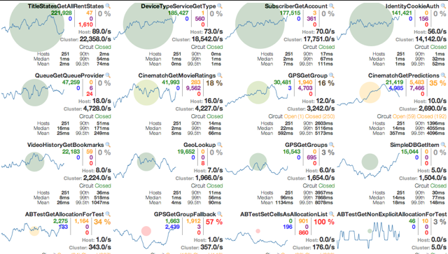

### 一 微服务架构概要

#### 1.1.什么是微服务

微服务详细文档https://martinfowler.com/articles/microservices.html#MicroservicesAndSoa


微服务是一种架构风格，是以开发一组小型服务的方式来作为一个独立的应用系统，每个服务都运行在
自已的进程中，服务之间采用轻量级的HTTP通信机制 ( 通常是采用HTTP的RESTful API )进行通信。这
些服务都是围绕具体业务进行构建的，并且可以独立部署到生产环境上。这些服务可以用不同的编程语
言编写，并且可以使用不同的数据存储技术。对这些微服务我们只需要使用一个非常轻量级的集中式管
理来进行协调。

#### 1.2.单体应用架构

```properties
1.单体应用架构
	一个应用中包含了应用程序的所有功能（比如：页面，代码，配置等），把应用打成一个war或jar包部署到Tomcat中，通常称为单体应用架构。
2.单体应用架构的优缺点
  (1)优点:
    1)易于开发&测试：单个应用包含所有功能，不涉及多个应用的互联互调，便于在团队之间开发与测试。 易于部署：只需将单个应用打成war或jar包，进行部署到Tomcat即可，运维起来比较方便。
    2)易于整体扩展：当应用负载压力大时，将这个应用复制几份，分别部署在不同的服务器上，再通过负载均衡即可提高应用的并发能力。
  (2)缺点:
  	1)复杂性高：由于是单个应用，所以整个项目文件包含的模块非常多，导致模块的边界模糊、依赖关系不清晰、代码的质量参差不齐，混乱的堆在一起，使得整个项目非常复杂。以致每次修改代码，都非常小心，可能添加一个简单的功能，或者修改一个Bug都会带来隐藏的缺陷。
  	2)技术债务：随着时间的推移、需求的变更和技术人员的更替，会逐渐形成应用程序的技术债务，并且越积越多。
  	3)阻碍技术创新：
对于单体应用来说，技术是在开发之前经过慎重评估后选定的，每个团队成员都必须使用相同的开发语言、持久化存储及消息系统。
```

3. 单体架构图:

   

   

#### 1.3.微服务架构

```properties
微服务架构总结:
	1)微服务的核心就是将传统的单一应用，根据业务拆分成一个一个的服务，彻底地去耦合,每一个微服务提供单个业务功能的服务，一个服务做一件事。
	2)在 IDEA 工具中使用Maven构建的一个个独立的 Module ，也就是使用Spring Boot 开发的一个个小模块就是一个个微服务，将专业的事交给专业的模块来做。比如一个大型项目可能有上百个微服务，将这些微服务集中起来构成一个大的系统，对外暴露服务进行调用与使用。
	3)从技术角度看就是一种小而独立的处理过程，类似进程概念，能够自行单独启动或销毁，拥有自己独立的数据库。
```

微服务架构图:


#### 1.4.微服务架构技术栈


#### 1.5.面试题

```properties
spring Cloud 使用 RESTful API 实现服务之间通信
Dubbo 使用 RPC （远程过程调用） 实现服务之间通信
```

```properties
springboot和springcloud的关系:
	1)Spring Boot 可以离开 Spring Cloud 单独使用开发项目，但是Spring Cloud离不开SpringBoot，属于依赖的关系.
	2)Spring Boot 专注于快速方便的开发单个个体微服务，Spring Cloud 关注全局的服务治理框架。
	3)Spring Cloud 是关注全局的微服务协调整理治理框架，它将 Spring Boot 开发的一个个单体微服务整合并管理起来，为各个微服务之间提供，配置管理、服务发现、断路器、路由、微代理、事件总线、全局锁、决策竞选、分布式会话等等集成服务。
```

#### 1.6.参考资料

官网: http://spring.io/projects/spring-cloud
各组件说明（中文版）：https://springcloud.cc/spring-cloud-netflix.html
详细文档版：
	英文版：https://cloud.spring.io/spring-cloud-static/Finchley.SR2/single/spring-cloud.html
	中文版：https://springcloud.cc/spring-cloud-dalston.html
Spring Cloud 中国社区：http://springcloud.cn/
Spring Cloud 中文网：https://springcloud.cc/
Spring Cloud 目前集合了21种分布式微服务架构技术

### 二 Rest构建分布式微服务架构实战项目

#### 2.1.开发环境要求

```properties
jdk1.8 (Spring Boot 推荐jdk1.8及以上)： java version "1.8.0_151"
Maven 3.x (maven 3.2 以上版本)：Apache Maven 3.3.9
IntelliJ IDEA ：IntelliJ IDEA 2018.2.1 x64
Spring Boot ：Spring Boot 2.0.7
Spring Cloud 使用当前最新稳定版本：Finchley SR2 , 搭配 Spring Boot 2.0.7 稳定版
```

官网: http://spring.io/projects/spring-cloud

**springcloud和springboot依赖关系**


#### 2.2微服务架构实战项目介绍

1. 项目需求

以 商品管理模块 做一个微服务架构通用案例，消费者Consumer（Client）通过REST调用 提供者
Provider（Server）提供的商品管理服务。


2. maven的分包分模块架构

```properties
一个 Project 父工程下有多个 Module 子模块
microservice-cloud-01 父工程（Project）下初始化 3个子模块（Module）：
 1)microservice-cloud-02-api 封装的整体Entity/接口/公共配置等
 2)microservice-cloud-03-provider-product-8001 微服务的服务提供者Provider
 3)microservice-cloud-04-consumer-product-80 微服务的服务消费者Consumer
```

#### 2.3构建project父工程(microservice-cloud-01)

##### 2.3.1创建一个空工程


##### 2.3.2创建父工程(pom类型)

**注意:父工程microservice-cloud-01,切记是packaging是pom类型**

1. 创建父工程microservice-cloud-01


2. 删除src目录及子目录,在pom.xml中手动指定为pom类型,如下所示:


3. 在pom.xml中定义公共依赖,并各个子模块聚合起来

   ```xml
   <?xml version="1.0" encoding="UTF-8"?>
   <project xmlns="http://maven.apache.org/POM/4.0.0"
            xmlns:xsi="http://www.w3.org/2001/XMLSchema-instance"
            xsi:schemaLocation="http://maven.apache.org/POM/4.0.0 http://maven.apache.org/xsd/maven-4.0.0.xsd">
       <modelVersion>4.0.0</modelVersion>
   
       <groupId>com.fy.springcloud</groupId>
       <artifactId>microservice-cloud-01</artifactId>
       <version>1.0-SNAPSHOT</version>
       <modules>
           <module>../microservice-cloud-02-api</module>
           <module>../microservice-cloud-03-provider-product-8001</module>
           <module>../microservice-cloud-04-consumer-product-80</module>
       </modules>
       <!--手动指定pom-->
       <packaging>pom</packaging>
   
       <!-- spring boot 采用 2.0.7 版本 -->
       <parent>
           <groupId>org.springframework.boot</groupId>
           <artifactId>spring-boot-starter-parent</artifactId>
           <version>2.0.7.RELEASE</version>
           <relativePath/>
       </parent>
   
       <properties>
           <project.build.sourceEncoding>UTF-8</project.build.sourceEncoding>
           <maven.compiler.source>1.8</maven.compiler.source>
           <maven.compiler.target>1.8</maven.compiler.target>
           <junit.version>4.12</junit.version>
           <!-- spring cloud 采用 Finchley.SR2 版本 -->
           <spring-cloud.version>Finchley.SR2</spring-cloud.version>
       </properties>
   
   
       <!--依赖声明-->
       <dependencyManagement>
           <dependencies>
               <dependency>
                   <groupId>org.springframework.cloud</groupId>
                   <artifactId>spring-cloud-dependencies</artifactId>
                   <version>${spring-cloud.version}</version>
                   <type>pom</type>
                   <!--maven不支持多继承，使用import来依赖管理配置-->
                   <scope>import</scope>
               </dependency>
               <!--导入 mybatis 启动器-->
               <dependency>
                   <groupId>org.mybatis.spring.boot</groupId>
                   <artifactId>mybatis-spring-boot-starter</artifactId>
                   <version>1.3.2</version>
               </dependency>
               <!--druid数据源-->
               <dependency>
                   <groupId>com.alibaba</groupId>
                   <artifactId>druid</artifactId>
                   <version>1.1.12</version>
               </dependency>
               <dependency>
                   <groupId>mysql</groupId>
                   <artifactId>mysql-connector-java</artifactId>
                   <version>8.0.13</version>
               </dependency>
               <dependency>
                   <groupId>junit</groupId>
                   <artifactId>junit</artifactId>
                   <version>${junit.version}</version>
                   <scope>test</scope>
               </dependency>
           </dependencies>
       </dependencyManagement>
   </project>
   ```

#### 2.4构建公共模块(microservice-cloud-02-api)

##### 2.4.1创建模块


创建完成后请回到父工程查看pom文件变化

##### 2.4.2pom文件

```xml
<?xml version="1.0" encoding="UTF-8"?>
<project xmlns="http://maven.apache.org/POM/4.0.0"
         xmlns:xsi="http://www.w3.org/2001/XMLSchema-instance"
         xsi:schemaLocation="http://maven.apache.org/POM/4.0.0 http://maven.apache.org/xsd/maven-4.0.0.xsd">
    <parent>
        <artifactId>microservice-cloud-01</artifactId>
        <groupId>com.fy.springcloud</groupId>
        <version>1.0-SNAPSHOT</version>
        <relativePath>../microservice-cloud-01/pom.xml</relativePath>
    </parent>
    <modelVersion>4.0.0</modelVersion>

    <artifactId>microservice-cloud-02-api</artifactId>


</project>
```

##### 2.4.3创建商品实体类

```java
public class Product implements Serializable {//必须序列化
    private Long pid; //主键
    private String productName; //产品名称
    // 来自那个数据库，因为微服务架构可以一个服务对应一个数据库，同一个信息被存储到不同数据库
    private String dbSource;
    public Product(String productName) {
        this.productName = productName;
    }
    public Product(Long pid, String productName, String dbSource) {
        this.pid = pid;
        this.productName = productName;
        this.dbSource = dbSource;
    }
    public Product() {
    }
    public Long getPid() {
        return pid;
    }
    public void setPid(Long pid) {
        this.pid = pid;
    }
    public String getProductName() {
        return productName;
    }
    public void setProductName(String productName) {
        this.productName = productName;
    }
    public String getDbSource() {
        return dbSource;
    }
    public void setDbSource(String dbSource) {
        this.dbSource = dbSource;
    }
}
```

#### 2.5构建服务提供者

##### 2.5.1创建module:microservice-cloud-03-provider-product-8001


##### 2.5.2配置pom.xml文件

```xml
<?xml version="1.0" encoding="UTF-8"?>
<project xmlns="http://maven.apache.org/POM/4.0.0"
         xmlns:xsi="http://www.w3.org/2001/XMLSchema-instance"
         xsi:schemaLocation="http://maven.apache.org/POM/4.0.0 http://maven.apache.org/xsd/maven-4.0.0.xsd">
    <parent>
        <artifactId>microservice-cloud-01</artifactId>
        <groupId>com.fy.springcloud</groupId>
        <version>1.0-SNAPSHOT</version>
        <relativePath>../microservice-cloud-01/pom.xml</relativePath>
    </parent>
    <modelVersion>4.0.0</modelVersion>

    <artifactId>microservice-cloud-03-provider-product-8001</artifactId>

    <dependencies>
        <dependency>
            <groupId>com.fy.springcloud</groupId>
            <artifactId>microservice-cloud-02-api</artifactId>
            <version>${project.version}</version>
        </dependency>
        <!--springboot web启动器-->
        <dependency>
            <groupId>org.springframework.boot</groupId>
            <artifactId>spring-boot-starter-web</artifactId>
        </dependency>
        <!-- mybatis 启动器-->
        <dependency>
            <groupId>org.mybatis.spring.boot</groupId>
            <artifactId>mybatis-spring-boot-starter</artifactId>
        </dependency>
        <dependency>
            <groupId>org.springframework.boot</groupId>
            <artifactId>spring-boot-starter-test</artifactId>
        </dependency>
        <dependency>
            <groupId>junit</groupId>
            <artifactId>junit</artifactId>
        </dependency>
        <dependency>
            <groupId>mysql</groupId>
            <artifactId>mysql-connector-java</artifactId>
        </dependency>
        <dependency>
            <groupId>com.alibaba</groupId>
            <artifactId>druid</artifactId>
        </dependency>
    </dependencies>

</project>
```

##### 2.5.3配置application.yml文件

```yaml
server:
  port: 8001

mybatis:
  config-location: classpath:mybatis/mybatis.cfg.xml        # mybatis配置文件所在路径
  type-aliases-package: com.fy.springcloud.entities  # 所有Entity别名类所在包
  mapper-locations: classpath:mybatis/mapper/**/*.xml       # mapper映射文件

spring:
  application:
    name: microservice-product #这个很重要，这在以后的服务与服务之间相互调用一般都是根据这个name
  datasource:
    type: com.alibaba.druid.pool.DruidDataSource            # 当前数据源操作类型
    driver-class-name: com.mysql.cj.jdbc.Driver             # mysql驱动包
    url: jdbc:mysql://127.0.0.1:3306/springcloud_db01?serverTimezone=GMT%2B8  # 数据库名称
    username: root
    password: 123
    dbcp2:
      min-idle: 5                                # 数据库连接池的最小维持连接数
      initial-size: 5                            # 初始化连接数
      max-total: 5                               # 最大连接数
      max-wait-millis: 150                       # 等待连接获取的最大超时时间
```

##### 2.5.4运行MySQL数据库脚本

```mysql
DROP DATABASE IF EXISTS springcloud_db01;
CREATE DATABASE springcloud_db01 CHARACTER SET UTF8;
USE springcloud_db01;
CREATE TABLE product
(
pid BIGINT NOT NULL PRIMARY KEY AUTO_INCREMENT,
product_name VARCHAR(50),
db_source  VARCHAR(50)
);
INSERT INTO product(product_name,db_source) VALUES('格力空调',DATABASE());
INSERT INTO product(product_name,db_source) VALUES('海尔冰箱',DATABASE());
INSERT INTO product(product_name,db_source) VALUES('小短裙',DATABASE());
INSERT INTO product(product_name,db_source) VALUES('羽绒服',DATABASE());
INSERT INTO product(product_name,db_source) VALUES('韩版休闲鞋',DATABASE());
INSERT INTO product(product_name,db_source) VALUES('高贵鞋',DATABASE());
SELECT * FROM product;
```

##### 2.5.5创建mapper接口

```java
package com.fy.springcloud.mapper;

import com.fy.springcloud.entities.Product;

import java.util.List;

public interface ProductMapper {

    Product findById(Long pid);

    List<Product> findAll();

    boolean addProduct(Product product);
}

```

##### 2.5.6mybatis相关配置

1. src/main/resources下新建 mybatis 目录后新建  mybatis.cfg.xml 核心配置文件，内容如下：

   ```xml
   <?xml version="1.0" encoding="UTF-8" ?>
   <!DOCTYPE configuration
           PUBLIC "-//mybatis.org//DTD Config 3.0//EN"
           "http://mybatis.org/dtd/mybatis-3-config.dtd">
   <configuration>
       <settings>
           <!--开启驼峰命名-->
           <setting name="mapUnderscoreToCamelCase" value="true"/>
       </settings>
   </configuration>
   ```

2. src/main/resources/mybatis 下新建 mapper 目录后新建  ProductMapper.xml 映射文件，内容如下：

```xml
<?xml version="1.0" encoding="UTF-8" ?>
<!DOCTYPE mapper PUBLIC "-//mybatis.org//DTD Mapper 3.0//EN"
        "http://mybatis.org/dtd/mybatis-3-mapper.dtd">

<mapper namespace="com.fy.springcloud.mapper.ProductMapper">

    <select id="findById" resultType="Product" parameterType="Long">
   select pid, product_name, db_source from product where pid=#{pid};
  </select>

    <select id="findAll" resultType="Product">
   select pid, product_name, db_source from product;
  </select>

    <insert id="addProduct" parameterType="Product">
   INSERT INTO product(product_name, db_source) VALUES(#{productName}, DATABASE());
  </insert>

</mapper>
```

##### 2.5.7创建服务层

1. 部门服务接口:ProductService

```java 
//注意:@Service注解标在实现类上
package com.fy.springcloud.service;

import com.fy.springcloud.entities.Product;
import org.springframework.stereotype.Service;

import java.util.List;

public interface ProductService {

    boolean add(Product product);
    Product get(Long id);
    List<Product> list();
}

```

2. 部门服务接口实现类

```java
package com.fy.springcloud.service;

import com.fy.springcloud.entities.Product;
import com.fy.springcloud.mapper.ProductMapper;
import org.springframework.beans.factory.annotation.Autowired;
import org.springframework.stereotype.Service;

import java.util.List;

/**
 * @program: springCloud->ProductServiceImpl
 * @description: 服务层
 * @author: fangyan
 * @create: 2019-12-28 01:00
 **/
@Service
public class ProductServiceImpl implements ProductService {
    @Autowired
    ProductMapper productMapper;

    @Override
    public boolean add(Product product) {
        return productMapper.addProduct(product);
    }

    @Override
    public Product get(Long id) {
        return productMapper.findById(id);
    }

    @Override
    public List<Product> list() {
        return productMapper.findAll();
    }
}

```

##### 2.5.8创建控制层-提供者

商品微服务提供者REST：ProductController

```java
package com.fy.springcloud.controller;

import com.fy.springcloud.entities.Product;
import com.fy.springcloud.service.ProductService;
import org.springframework.beans.factory.annotation.Autowired;
import org.springframework.web.bind.annotation.*;

import java.util.List;


@RestController
public class ProductController {

    @Autowired
    private ProductService productService;

    @RequestMapping(value = "/product/add", method = RequestMethod.POST)
    public boolean add(@RequestBody Product product) {
        return productService.add(product);
    }

    @RequestMapping(value = "/product/get/{id}", method = RequestMethod.GET)
    public Product get(@PathVariable("id") Long id) {
        return productService.get(id);
    }

    @RequestMapping(value = "/product/list", method = RequestMethod.GET)
    public List<Product> list() {
        return productService.list();
    }


}

```

##### 2.5.9创建启动类

创建主启动类： MicroserviceProductProvider_8001

```java
package com.fy.springcloud;

import org.mybatis.spring.annotation.MapperScan;
import org.springframework.boot.SpringApplication;
import org.springframework.boot.autoconfigure.SpringBootApplication;


@MapperScan("com.fy.springcloud.mapper")
@SpringBootApplication
public class MicroserviceProductProvider_8001 {
    public static void main(String[] args) {
        SpringApplication.run(MicroserviceProductProvider_8001.class,args);
    }
}

```

##### 2.5.10功能测试

http://localhost:8001/product/get/3

http://localhost:8001/product/list

#### 2.6构建服务消费者

##### 2.6.1创建module:microservice-cloud-04-consumer-product-80


##### 2.6.2配置pom.xml文件

```xml
<?xml version="1.0" encoding="UTF-8"?>
<project xmlns="http://maven.apache.org/POM/4.0.0"
         xmlns:xsi="http://www.w3.org/2001/XMLSchema-instance"
         xsi:schemaLocation="http://maven.apache.org/POM/4.0.0 http://maven.apache.org/xsd/maven-4.0.0.xsd">
    <parent>
        <artifactId>microservice-cloud-01</artifactId>
        <groupId>com.fy.springcloud</groupId>
        <version>1.0-SNAPSHOT</version>
        <relativePath>../microservice-cloud-01/pom.xml</relativePath>
    </parent>
    <modelVersion>4.0.0</modelVersion>

    <artifactId>microservice-cloud-04-consumer-product-80</artifactId>


    <dependencies>
        <dependency>
            <groupId>com.fy.springcloud</groupId>
            <artifactId>microservice-cloud-02-api</artifactId>
            <version>${project.version}</version>
        </dependency>
        <dependency>
            <groupId>org.springframework.boot</groupId>
            <artifactId>spring-boot-starter-web</artifactId>
        </dependency>
    </dependencies>
</project>
```

##### 2.6.3配置application.yml文件

```yaml
server:
  port: 80
```

##### 2.5.4自定义Rest相关配置类(向容器注入RestTemplate组件)

在 com.fy.springcloud.config 包下新建配置类： ConfigBean
向容器中注入 RestTemplate 组件, 提供了多种简单便捷的访问 Restful 服务的方法，是Spring提供的用于访问Rest服务的客户端模板工具集。 (url, requestMap, ResponseBean.class)这三个参数分别代表：REST请求地址、请求参数、HTTP响应转换被转换成的对象类型。

```java
package com.fy.springcloud.config;

import org.springframework.context.annotation.Bean;
import org.springframework.context.annotation.Configuration;
import org.springframework.web.client.RestTemplate;

@Configuration
public class ConfigBean {

    @Bean
    public RestTemplate getRestTemplate(){
        return new RestTemplate();
    }
}

```

##### 2.5.5创建控制层-消费者

1. 在 com.fy.springcloud.controller 包下新建消费者: ProductController_Consumer

```java 
package com.fy.springcloud.controller;

import com.fy.springcloud.entities.Product;
import org.springframework.beans.factory.annotation.Autowired;
import org.springframework.web.bind.annotation.PathVariable;
import org.springframework.web.bind.annotation.RequestMapping;
import org.springframework.web.bind.annotation.RestController;
import org.springframework.web.client.RestTemplate;

import java.util.List;

@RestController
public class ProductController_consumer {
    private static final String REST_URL_PROFIX="http://localhost:8001";

    @Autowired
    private RestTemplate restTemplate;

    @RequestMapping("/consumer/product/get/{id}")
    public Product getProduct(@PathVariable("id") Long id){
        return restTemplate.getForObject(REST_URL_PROFIX + "/product/get/" + id, Product.class);
    }

    @RequestMapping("/consumer/product/list")
    public List<Product> getProduct(){
        return restTemplate.getForObject(REST_URL_PROFIX + "/product/list", List.class);
    }

    @RequestMapping("/consumer/product/add")
    public boolean add(Product product){
        return restTemplate.postForObject(REST_URL_PROFIX + "/product/add", product, boolean.class);
    }

}

```

##### 2.5.6创建启动类

```java
package com.fy.springcloud;

import com.fy.springcloud.entities.Product;
import org.springframework.boot.SpringApplication;
import org.springframework.boot.autoconfigure.SpringBootApplication;

@SpringBootApplication
public class ProductConsumer_80 {
    public static void main(String[] args) {
        SpringApplication.run(ProductConsumer_80.class, args);
    }
}

```

##### 2.5.7功能测试

http://localhost/consumer/product/get/3

http://localhost/consumer/product/list

http://localhost/consumer/product/add?productName=java

### 三 Eureka服务的注册与发现


* 问题:系统会根据业务被拆分成为很多的微服务,微服务的信息如何管理?

  springcloud中提供服务注册中心来管理微服务信息.

* 为什么用注册中心/

  1.微服务数量众多,要进行远程调用就需要知道服务端的ip地址和端口,注册中心帮助我们管理这些服务的ip和端口.

  2.微服务会实现上报自己的状态,注册中心统一管理这些微服务的状态,将存在问题的微服务踢出服务列表客户端获取到可用的服务进行调试.

  

#### 3.1Eureka介绍

* Spring Cloud Eureka 是对Netflix公司的Eureka的二次封装，它实现了服务治理的功能，Spring Cloud  Eureka 提供 Eureka Server 服务端与 Eureka Client 客户端 ，服务端即是Eureka服务注册中心，客户端完成微服务向Eureka服务的注册与发现。

* 客户端同时也具备一个内置的使用轮询(round-robin)负载算法的负载均衡器。在微服务启动后，将会向Eureka Server发送心跳(默认周期为30秒)。如果Eureka Server在多个心跳周期内没有接收到某个节点的心跳，EurekaServer将会从服务注册表中把这个服务节点移除（默认90秒）

* 下图显示了Eureka Server与Eureka Client的关系

  

```properties
1.Eureka Server 是服务端，负责管理各个微服务注册和发现。
2.在微服务上添加 Eureka Client 代码，就会访问到 Eureka Server 将此微服务注册在Eureka Server中，从而使服务消费方能够找到。
3. 微服务（服务消费者）需要调用另一个微服务（服务提供者）时，从 Eureka Server 中获取服务调用地址，进行远程调用。
```

#### 3.2搭建单机版Eureka Server服务注册中心

##### 3.2.1创建microservice-cloud-05-eureka-6001工程


##### 3.2.2配置pom.xml文件

```xml
<?xml version="1.0" encoding="UTF-8"?>
<project xmlns="http://maven.apache.org/POM/4.0.0"
         xmlns:xsi="http://www.w3.org/2001/XMLSchema-instance"
         xsi:schemaLocation="http://maven.apache.org/POM/4.0.0 http://maven.apache.org/xsd/maven-4.0.0.xsd">
    <parent>
        <artifactId>microservice-cloud-01</artifactId>
        <groupId>com.fy.springcloud</groupId>
        <version>1.0-SNAPSHOT</version>
        <relativePath>../microservice-cloud-01/pom.xml</relativePath>
    </parent>
    <modelVersion>4.0.0</modelVersion>

    <artifactId>microservice-cloud-05-eureka-6001</artifactId>

    <dependencies>
        <!-- 导入Eureka-server 服务端依赖 -->
        <dependency>
            <groupId>org.springframework.cloud</groupId>
            <artifactId>spring-cloud-starter-netflix-eureka-server</artifactId>
        </dependency>
    </dependencies>
</project>
```

##### 3.2.3配置application.yml文件

```yaml
server:
  port: 6001 # 服务端口

eureka:
  instance:
    hostname: localhost # eureka服务端的实例名称
  client:
    registerWithEureka: false # 服务注册，false表示不将自已注册到Eureka服务中
    fetchRegistry: false # 服务发现，false表示自己不从Eureka服务中获取注册信息
    serviceUrl:    # Eureka客户端与Eureka服务端的交互地址，集群版配置对方的地址，单机版配置自己（如果不配置则默认本机8761端口）
      #单机版
      defaultZone: http://${eureka.instance.hostname}:${server.port}/eureka/
```

##### 3.2.4创建主启动类

在启动类上添加  @EnableEurekaServer 注解，表示它是一个Eureka Server服务注册中心

```java
@EnableEurekaServer //标识一个eureka server 服务注册中心
@SpringBootApplication
public class Eurekaserver_6001 {
    public static void main(String[] args) {
        SpringApplication.run(Eurekaserver_6001.class, args);
    }
}
```

##### 3.2.5功能测试

启动后访问:http://localhost:6001  效果如下:


#### 3.3服务注册到Eureka Server服务注册中心

说明:将服务提供者（ microservice-cloud-03-provider-product-8001）注册到 Eureka Server注册中心（microservice-cloud-05-eureka-6001）


下面对 microservice-cloud-03-provider-product-8001 模块做对应的修改

##### 3.3.1配置pom.xml文件

* 添加配置

  ```xml
  <!-- 导入Eureka-client依赖 -->
          <dependency>
              <groupId>org.springframework.cloud</groupId>
              <artifactId>spring-cloud-starter-netflix-eureka-client</artifactId>
          </dependency>
  ```

##### 3.3.2配置application.yml文件

* 添加配置

```yaml
#eureka客户端配置
eureka:
  client:
    register-with-eureka: true #服务注册开关
    fetch-registry: true #服务发现开关
    serviceUrl:
      defaultZone: http://localhost:6001/eureka
```

##### 3.3.3修改主启动类

```java
//在启动类上添加  @EnableEurekaClient 注解，表示它是一个Eureka的客户端，本服务启动后会自动注册进Eureka Sever服务列表中

@EnableEurekaClient //标识该微服务为eureka客户端,将注册进eureka服务注册中心
@MapperScan("com.fy.springcloud.mapper")
@SpringBootApplication
public class MicroserviceProductProvider_8001 {
    public static void main(String[] args) {
        SpringApplication.run(MicroserviceProductProvider_8001.class,args);
    }
}
```

##### 3.3.4功能测试

```properties
1.先启动Eureka Server
2.再启动Eureka Client
3.访问:http://localhost:6001
如下:商品提供者已经注册到Eureka Server中
```


#### 3.4微服务注册信息完善

##### 3.4.1指定实例ID

问题：当前 状态中 含有主机名称


解决:修改Eureka Client的yml文件如下

```yaml
#eureka客户端配置
eureka:
  client:
    register-with-eureka: true #服务注册开关
    fetch-registry: true #服务发现开关
    serviceUrl:
      defaultZone: http://eureka6001.com:6001/eureka,http://eureka6002.com:6002/eureka
  instance:
    instance-id: ${spring.application.name}:${server.port} #实例id,指定eureka页面服务状态显示
    prefer-ip-address: true #指定鼠标悬停在实例id上显示ip地址
```

##### 3.4.2访问路径显示ip地址

问题:鼠标放在 实例 ID 上，显示的还是主机名，而不是显示IP地址

解决:修改Eureka Client的yml文件

如3.4.1中yml文件最后一行

eureka.instance.prefer-ip-address: true

#### 3.5Eureka Server自我保护机制

```yaml
#开发阶段建议禁用自我保护模式,默认开启的
eureka:
  server:
    enable-self-preservation: false #禁用自我保护模式
```

什么是自我保护机制?

```properties
1.当Eureka Server 在一定时间内（默认90秒）没有接收到某个微服务的心跳，Eureka Server会从服务列表将此服务实例注销。但是如果出现网络异常情况（微服务本身是正常的），微服务与Eureka Server之间无法正常通信，以上行为可能变得非常危险了——因为微服务本身其实是正常的，此时本不应该注销这个微服务。
2.Eureka Server有一种 “自我保护模式” 来解决这个问题——当Eureka Server在短时间内丢失过多客户端时（可能发生了网络故障），此时Eureka Server会进入自保护模式，一旦进入该模式，Eureka Server就会保护服务注册表中的信息，不再删除服务注册表中的数据（也就是不会注销任何微服务）。当网络故障恢复后，该Eureka Server会自动退出自我保护模式。
3.所以， 自我保护模式是一种应对网络异常的安全保护措施。它的架构哲学是宁可同时保留所有微服务（健康的微服务和不健康的微服务都会保留），也不盲目注销任何健康的微服务。使用自我保护模式，可以让Eureka集群更加的健壮、稳定。
```

#### 3.6搭建集群版Eureka Server服务注册中心

```properties
为了避免 Eureka Server的失效，Eureka Server 高可用环境需要部署两个及以上Eureka Server，它们互相向对方注册。如果在本机启动两个Eureka需要 注意两个Eureka Server的端口要设置不一样，如下图：
```


```properties
1.在实际使用时Eureka Server至少部署两台服务器，实现高可用。
2.两台Eureka Server互相注册。
3.微服务需要连接两台Eureka Server注册，当其中一台Eureka死掉也不会影响服务的注册与发现。
4.微服务会定时向Eureka Server发送心跳，报告自己的状态。
5.微服务从注册中心获取服务地址以RESTful方式发起远程调用。
```


##### 3.6.1ip与域名绑定,模拟两台服务器

```properties
找到 C:\Windows\System32\drivers\etc 目录下的hosts文件,添加如下内容

127.0.0.1 eureka6001.com
127.0.0.1 eureka6002.com
```

##### 3.6.2创建两个Eureka Server模块

创建过程见3.2

##### 3.6.3配置pom.xml

将6001中的pom.xml复制到6002中

```xml
<!-- 导入Eureka-server 服务端依赖 -->
        <dependency>
            <groupId>org.springframework.cloud</groupId>
            <artifactId>spring-cloud-starter-netflix-eureka-server</artifactId>
        </dependency>
```

##### 3.6.4主启动类

和6001中一样,修改类名;

##### 3.6.5配置2台Eureka Server服务端的yml文件

即让两个eureka服务相互注册

* 6001 服务端模块的 application.yml

```yaml
server:
  port: 6001 # 服务端口

eureka:
  instance:
    hostname: eureka6001.com # eureka服务端的实例名称
  client:
    registerWithEureka: false # 服务注册，false表示不将自已注册到Eureka服务中
    fetchRegistry: false # 服务发现，false表示自己不从Eureka服务中获取注册信息
    serviceUrl:    # Eureka客户端与Eureka服务端的交互地址，集群版配置对方的地址，单机版配置自己（如果不配置则默认本机8761端口）
      #单机版
      #defaultZone: http://${eureka.instance.hostname}:${server.port}/eureka/
      #集群版
      defaultZone: http://eureka6002.com:6002/eureka/
  server:
    enable-self-preservation: false #禁用自我保护模式
```

* 6002 服务端模块 的 application.yml , 注意修改端口号 6002

```yaml
server:
  port: 6002 # 服务端口

eureka:
  instance:
    hostname: eureka6002.com # eureka服务端的实例名称
  client:
    registerWithEureka: false # 服务注册，false表示不将自已注册到Eureka服务中
    fetchRegistry: false # 服务发现，false表示自己不从Eureka服务中获取注册信息
    serviceUrl:    # Eureka客户端与Eureka服务端的交互地址，集群版配置对方的地址，单机版配置自己（如果不配置则默认本机8761端口）
      #单机版
      #defaultZone: http://${eureka.instance.hostname}:${server.port}/eureka/
      #集群版
      defaultZone: http://eureka6001.com:6001/eureka/
  server:
    enable-self-preservation: false #禁用自我保护模式
```

##### 3.6.6将服务提供者注册到2台Eureka Server集群中

修改 microservice-cloud-03-provider-product-8001 中的 application.yml 文件，图示：


##### 3.6.7效果测试

先启动两台Eureka Server集群,再启动服务提供者

访问http://eureka6001.com:6001/

​       http://eureka6002.com:6002/


* 当前架构效果:服务提供者8001已注册进eureka集群中

  

##### 3.6.8集群版Eureka Server总结

```properties
1.多台Eureka Server相互注册构成Eureka集群:
	eureka.client.serviceUrl.defaultZone:另一台Eureka Server
2.商品提供者微服务注册进集群中
	eureka.client.serviceUrl.defaultZone:Eureka Server1,Eureka Server2
	
#注意:浏览器访问Eureka服务地址:
		http://ip:port
	 yml配置将微服务注册进Eureka Server中Eureka服务地址:
	 	eureka.client.serviceUrl.defaultZone=http://ip:port/eureka
```

### 四 Ribbon客户端负载均衡(RestTemplate+Ribbon)

#### 4.1什么是负载均衡

```properties
1. LB，即负载均衡(Load Balance)，负载均衡是微服务架构中经常使用的一种技术。 负载均衡是我们处理高并发、缓解网络压力和进行服务端扩容的重要手段之一，简单的说就是将用户的请求平摊的分配到多个服务上，从而实现系统的高可用性集群。
2.负载均衡可通过 硬件设备 及 软件 进行实现，软件比如：Nginx等，硬件比如：F5等
3. 负载均衡相应的在中间件，例如：Dubbo 和 SpringCloud 中均给我们提供了负载均衡组件。
```

以下是负载均衡的架构图:


用户请求先到达负载均衡器（也相当于一个服务），负载均衡器根据负载均衡算法将请求转发到微服务。负载均衡器维护一份服务端列表，根据负载均衡算法 将请求转发到相应的微服务上，负载均衡 算法有：轮训、随机、加权轮训、加权随机、地址哈希等方法，所以负载均衡可以为微服务集群分担请求，降低系统的压力。

#### 4.2什么是客户端负载均衡(Ribbon)

```java
1.上图是服务端负载均衡.客户端负载均衡和服务端负载均衡最大的区别在于服务清单储存的位置.
在客户端负载均衡中,每个客户端服务都有一份自己要访问的服务端清单,这些清单统统是从Eureka服务注册中心获取的.而在服务端负载均衡中,只要负载均衡器维护一份服务端列表.
2.Spring Cloud Ribbon 是基于 Netflix 公司发布的开源项目 Ribbon 进行封装的一套客户端负载均衡器 。
3.Ribbon 从 Eureka Server 获取服务列表，Ribbon根据负载均衡算法直接请求到具体的微服务，中间省去了负载均衡服务。
```

如下是Ribbon负载均衡的流程图:


```java
1.在消费者微服务中使用 Ribbon 实现负载均衡，Ribbon 先从EurekaServer中获取服务列表。
2.Ribbon 根据负载均衡的算法（默认轮训算法）去调用微服务。
```

#### 4.3Ribbon服务调用配置实战

```java
无需新增新服务,在消费者端通过Ribbon进行实现负载均衡即可
针对microservice-cloud-04-consumer-product-80 模块进行修改
1.pom文件添加eureka客户端依赖
2.yml文件配置eureka客户端发现
3.RestTemplate添加@LoadBalance注解实现客户端负载均衡
4.controller层服务调用,将ip和端口号直接改为提供者在eureka中的服务名,消费者就可以在eureka服务中发现提供者从而进行调用;
5.在启动类上加@EnableEurekaClient标识其为Eureka客户端

//注意:1.ribbon在引入eureka client时会自动依赖进来,核心注解@LoadBalance,将该注解标识在RestTemplate注册bean上,即可实现客户端负载均衡.(默认轮训算法)  2.只有使用@LoadBalance才可以在controller层使用服务名调用服务
```

##### 4.3.1修改pom文件

添加配置:

```xml
<!-- 导入Eureka-client依赖 -->
        <dependency>
            <groupId>org.springframework.cloud</groupId>
            <artifactId>spring-cloud-starter-netflix-eureka-client</artifactId>
        </dependency>

<!--由于依赖了spring-cloud-starter-netflix-eureka-client，会自动添加spring-cloud-starter-netflix-ribbon依赖-->
```

##### 4.3.2修改application.yml文件

```yaml
server:
  port: 80

eureka:
  client:
    register-with-eureka: false  #服务注册关闭
    fetch-registry: true #服务发现开启
    service-url:
      defaultZone: http://eureka6001.com:6001/eureka,http://eureka6002.com:6002/eureka
```

##### 4.3.3修改自定义配置类ConfigBean

```java 
@Configuration
public class ConfigBean {

    //@LoadBalance作用1:开启RestTemplate负载均衡
    //作用2:在调用服务提供者的接口时，可使用 服务名称 替代真实IP地址。 
    @LoadBalanced
    @Bean
    public RestTemplate getRestTemplate(){
        return new RestTemplate();
    }
}
```

##### 4.3.4修改消费者控制层ProductController_Consumer

* 修改调用REST风格的服务提供者地址:

```java
@RestController
public class ProductController_consumer {
    private static final String REST_URL_PROFIX="http://MICROSERVICE-PRODUCT";
```

* 修改后完整版:

```java
@RestController
public class ProductController_consumer {
    private static final String REST_URL_PROFIX="http://MICROSERVICE-PRODUCT";

    @Autowired
    private RestTemplate restTemplate;

    @RequestMapping("/consumer/product/get/{id}")
    public Product getProduct(@PathVariable("id") Long id){
        return restTemplate.getForObject(REST_URL_PROFIX + "/product/get/" + id, Product.class);
    }

    @RequestMapping("/consumer/product/list")
    public List<Product> getProduct(){
        return restTemplate.getForObject(REST_URL_PROFIX + "/product/list", List.class);
    }

    @RequestMapping("/consumer/product/add")
    public boolean add(Product product){
        return restTemplate.postForObject(REST_URL_PROFIX + "/product/add", product, boolean.class);
    }

}

```

##### 4.3.5修改主启动类

在主启动类  MicroserviceProductConsumer_80 上添加注解  @EnableEurekaClient

```java
@EnableEurekaClient //标识为Eureka客户端
@SpringBootApplication
public class ProductConsumer_80 {
    public static void main(String[] args) {
        SpringApplication.run(ProductConsumer_80.class, args);
    }
}
```

###### 4.3.6功能测试

```java
1.启动两个Eureka集群后,再启动microservice-cloud-03-provider-product-8001注册进eureka集群中
2.启动microservice-cloud-04-consumer-product-80从eureka中发现服务
3.访问:http://localhost/consumer/product/list进行测试

//总结:Ribbon 和 Eureka 整合后 ，消费者 Consumer 可以直接调用提供者服务，而不用再关心地址和端口号
```

#### 4.4Ribbon负载均衡实战

```java
总结:
	将多个部署在不同服务器的相同的微服务注册进eureka服务,在本地测试用端口号作为区分模拟在不同的服务器场景.每个微服务可以有自己的数据库,但是服务名必须一致,这样才能做到负载均衡,服务调用者从负载均衡中根据算法(默认轮训算法)找到要调用的微服务进行调用.
```

##### 4.4.1Ribbon负载均衡架构

```java
Ribbon在工作时分为两步:
1.先选择 Eureka Server ,它优先选择在同一个区域内负载较少的server
2.再根据用户指定的策略，在从 Eureka Server 获取的服务注册列表中选择一个地址。 其中Ribbon提供了多种策略：比如轮询、随机和根据响应时间加权等。
```


##### 4.4.2新建一个商品提供者服务

新建 microservice-cloud-06-provider-product-8002 ，参考： microservice-cloud-03-provider-product-8001

```
注意:
1.pom文件和8001保持一致;
2.新建数据库springcloud_db02,数据和springcloud_db01保持一致
3.将mybatis配置和controller/service/mapper层复制
4.配置application.yml,复制8001的,修改端口号和数据库名,注意服务名一定要和8001服务名保持一致(集群关键)
5.配置启动类,复制8001的,修改类名
```

##### 4.4.3功能测试

```java
1.启动eureka集群;
2.启动两个商品提供者微服务,并各自通过测试;
3.启动商品消费者服务microservice-cloud-04-consumer-product-80
4. 客户端通过 Ribbon 完成负载均衡并访问上一步的 Product 微服务
http://localhost/consumer/product/list
注意观察看到返回的数据库名字，各不相同，负载均衡实现
```

### 五 Feign客户端接口调用

上一章讲述了如何通过RestTemplate+Ribbon去调用服务提供者.

这一章主要讲述如何通过Feign去调用服务提供者;

#### 5.1什么是Feign以及使用步骤

```java
1.什么是Feign?
    Feign是Netflix公司开源的轻量级Rest客户端,使用Feign可以非常方便,简单的实现Http客户端.springcloud对Feign进行了封装,Feign默认集成了Ribbon实现了客户端负载均衡.
2.Feign使用步骤:
	1)引入spring-cloud-starter-openfeign依赖
	2)启动类上注解@EnableFeignClients(basePackages = "com.fy.springcloud.rest")
    3)编写接口,在接口类上注解@FeignClient("microservice-product"),接口方法的注解 请求参数 方法名 等都应该和被调用方法一致.
```

#### 5.2Feign实战操作

##### 5.2.1创建Feign模块

参考 microservice-cloud-04-consumer-product-80

* 拷贝 microservice-cloud-04-consumer-product-80 中的 pom 依赖配置粘贴到 microservice-cloud-08-consumer-product-feign
* 拷贝 application.yml 与 java类路径 下的所有文件到 microservice-cloud-08-consumer-product-feign
* 拷贝与修改主启动类名：ProductConsumer_80_Feign

##### 5.2.2配置pom.xml文件

```xml
<!--导入feign依赖-->
        <dependency>
            <groupId>org.springframework.cloud</groupId>
            <artifactId>spring-cloud-starter-openfeign</artifactId>
        </dependency>
```

##### 5.2.3新建ProductClient接口

```java
@FeignClient("microservice-product")//标识其为feign接口,并告知所调用的服务名
public interface ProductClient {

    @RequestMapping(value = "/product/add", method = RequestMethod.POST)
    boolean add(@RequestBody Product product);

    @RequestMapping(value = "/product/get/{id}", method = RequestMethod.GET)
    Product get(@PathVariable("id") Long id);

    @RequestMapping(value = "/product/list", method = RequestMethod.GET)
    List<Product> list();
}

//注意:接口方法中请求路径 注解 请求方式 方法名 入参等都和被调用方法保持一致;
```

##### 5.2.4启动类注解@EnableFeignClients

```java 
@EnableFeignClients(basePackages = "com.fy.springcloud.rest") //开启feign客户端并指定feign接口所在包,并生成此接口的代理对象
@EnableEurekaClient //标识为Eureka客户端
@SpringBootApplication
public class ProductConsumer_feign {
    public static void main(String[] args) {
        SpringApplication.run(ProductConsumer_feign.class, args);
    }
}
```

##### 5.2.5创建ProductController_Feign

```java 
@RestController
public class ProductController_consumer {
	//将Feign客户端实例注入
    @Autowired
    ProductClient productClient;

    @RequestMapping("/consumer/product/get/{id}")
    public Product getProduct(@PathVariable("id") Long id){
        return productClient.get(id);
    }

    @RequestMapping("/consumer/product/list")
    public List<Product> getProduct(){
        return productClient.list();
    }

    @RequestMapping("/consumer/product/add")
    public boolean add(Product product){
        return productClient.add(product);
    }

}
```

##### 5.2.6功能测试

```java
1.启动两个eureka集群
2.启动两个商品提供者8001/8002
3.启动启动ProductConsumer_80_Feign
4.访问:http://localhost/consumer/product/list
  发现一样有负载均衡配置功能
```

#### 5.3Feign工作原理

```properties
Feign通过接口的方法调用Rest服务（之前是Ribbon+RestTemplate），请求发送给 Eureka 服务器（http://MICROSERVICE-PRODUCT/product/list）, 通过Feign直接找到服务接口 ，因为集成了 Ribbon 技术，Feign 自带负载均衡配置功能。
1.启动类添加@EnableFeignClients注解，Spring会扫描标记了@FeignClient注解的接口，并生成此接口的代理对象
2.@FeignClient("服务名称 ") 即指定了 product 服务名称，Feign会从Eureka注册中心获取 product 服务列表，并通过负载均衡算法进行服务调用。
3.在接口方法中使用注解 @RequestMapping(value = "/product/list",method = RequestMethod.GET)，指定调用的url，Feign 会根据url进行远程调用。
```

#### 5.4Feign注意事项

```properties
SpringCloud对Feign进行了增强兼容了SpringMVC的注解 ，我们在使用SpringMVC的注解时需要注意：
1.@FeignClient接口方法有基本类型参数在参数必须加@PathVariable("XXX") 或 @RequestParam("XXX")
2.@FeignClient接口方法返回值为复杂对象时，此类型必须有无参构造方法.
```

### 六 Hystrix熔断器(断路器)

#### 6.1什么是Hystrix

##### 6.1.1分布式微服务架构面临的问题

```
在微服务架构中,根据业务来拆分成一个个的服务,而服务于服务之间存在着依赖关系(比如用户调用商品,商品调用库存,库存调用订单等等),在springcloud中多个微服务之间可以用RestTemplate+Ribbon或Feign来调用.
```


```java
//雪崩效应
在服务之间调用的链路上由于网络原因、资源繁忙或者自身的原因，服务并不能保证100%可用，如果单个服务出现问题，调用这个服务就会出现线程阻塞，导致响应时间过长或不可用，此时若有大量的请求涌入，容器的线程资源会被消耗完毕，导致服务瘫痪。服务与服务之间的依赖性，故障会传播，会对整个微服务系统造成灾难性的严重后果，这就是服务故障的“雪崩”效应。
//为了解决这个问题,业界提出了熔断器模型;
```

##### 6.1.2Hystrix作用

Hystrix 是Netflix公司开源项目( https://github.com/Netflix/Hystrix)，实现了熔断器模型，Spring Cloud 对这一组件进行了整合。
服务熔断
服务监控.....

#### 6.2服务熔断

##### 6.2.1什么是服务熔断

熔断机制是应对雪崩效应的一种微服务链路保护机制。在微服务架构中，一个请求需要调用多个服务是非常常见的，如下图：


当服务之间调用的链路上某个微服务不可用或者响应时间太长时，会导致连锁故障。当失败的调用到一定阈值（缺省是5秒内20次调用失败) 就会启动熔断机制。在 SpringCloud 框架里熔断机制通过Hystrix实现，Hystrix会监控微服务间调用的状况。熔断机制的注解是  @HystrixCommand


熔断器打开后，可用避免连锁故障，fallback方法可以直接返回一个固定值。

##### 6.2.2服务熔断实战

```java
商品提供者服务熔断步骤:
1.修改提供者pom.xml文件,添加spring-cloud-starter-netflix-hystrix依赖;
2.启动类添加@EnableHystrix注解,开启Hystrix熔断机制;
3.修改ProductController,在出现异常的方法上添加@HystrixCommand(fallbackMethod="方法名")指定出现异常后调用的方法;
```

###### 6.2.2.1创建Hystrix模块

新建microservice-cloud-08-provider-product-hystrix,直接复制microservice-cloud-03-provider-product-8001,相当于在此工程上添加Hystrix服务熔断机制

###### 6.2.2.2配置pom.xml文件

添加Hystrix依赖

```xml
<!--导入feign依赖-->
        <dependency>
            <groupId>org.springframework.cloud</groupId>
            <artifactId>spring-cloud-starter-openfeign</artifactId>
        </dependency>
```

###### 6.2.2.3配置application.yml文件

在实例名后面添加-hystrix以便于区分


###### 6.2.2.4修改ProductController

出现异常后如何处理？
使用  @HystrixCommand 注解
一旦调用服务方法失败并抛出了错误信息后，会自动调用  @HystrixCommand 注解中 fallbackMethod属性指定的当前类中的方法

```java 
@RestController
public class ProductController {

    @Autowired
    private ProductService productService;

    @RequestMapping(value = "/product/add", method = RequestMethod.POST)
    public boolean add(@RequestBody Product product) {
        return productService.add(product);
    }

    @HystrixCommand(fallbackMethod = "getFallback") //方法发生异常时会调用fallbackMethod指定的方法
    @RequestMapping(value = "/product/get/{id}", method = RequestMethod.GET)
    public Product get(@PathVariable("id") Long id) {
        Product product = productService.get(id);
        if(product == null){
            throw new RuntimeException("id="+id+"无效");
        }
        return product;
    }

    @RequestMapping(value = "/product/list", method = RequestMethod.GET)
    public List<Product> list() {
        return productService.list();
    }

    public Product getFallback(@PathVariable("id") Long id){
        return new Product(id, "id="+id+"无效--@HystrixCommand", "无有效数据库");
    }

}

```

###### 6.2.2.5修改启动类

添加注解@EnableHystrix开启Hystrix熔断机制的支持

```java
@EnableHystrix //开启对熔断器的支持
@EnableEurekaClient //标识该微服务为eureka客户端,将注册进eureka服务注册中心
@MapperScan("com.fy.springcloud.mapper")
@SpringBootApplication
public class MicroserviceProductProvider_hystrix {
    public static void main(String[] args) {
        SpringApplication.run(MicroserviceProductProvider_hystrix.class,args);
    }
}
```

###### 6.2.2.6功能测试

```java
1.先启动2个eureka
2.启动ProductProvider_Hystrix
3.启动消费者microservice-cloud-08-consumer-product-feign
4.访问http://localhost/consumer/product/get/-1
```


#### 6.3Feign客户端服务熔断

```yaml
步骤:
1.
#Feign是自带断路器的,也就是针对消费者(客户端)进行服务熔断,需要在配置文件中开启它,在配置文件中添加如下代码:

feign:
  hystrix:
    enabled: true
2.在FeignClient接口类上,@FeignClient添加fallback属性指定熔断后进入的类,该类实现@FeignClient标注的接口,重写接口方法;
@FeignClient(value = "microservice-product", fallback = ProductClientHystrix.class)
3.创建熔断类ProductClientHystrix实现接口重写方法;注意该类添加@Componet注解;
```

##### 6.3.1重构consumer-product-feign工程

基于 microservice-cloud-07-consumer-product-feign 工程进行改造

只要在已存在的  ProductClientService 接口上的  @FeignClient 注解中，加上  fallback 指定熔断处理类即可：  ProductClientServiceFallBack.class

```java
@FeignClient(value = "microservice-product", fallback = ProductClientHystrix.class)//标识其为feign接口,并告知所调用的服务名
public interface ProductClient {

    @RequestMapping(value = "/product/add", method = RequestMethod.POST)
    boolean add(@RequestBody Product product);

    @RequestMapping(value = "/product/get/{id}", method = RequestMethod.GET)
    Product get(@PathVariable("id") Long id);

    @RequestMapping(value = "/product/list", method = RequestMethod.GET)
    List<Product> list();
}

```

##### 6.3.2创建ProductClientServiceFallBack 类，并实现ProductClientService 接口

创建 ProductClientServiceFallBack 类，并实现 ProductClientService 接口，
注意使用 @Component 注解将它注入到容器中

```java
@Component
public class ProductClientHystrix implements ProductClient{
    @Override
    public boolean add(Product product) {
        return false;
    }

    @Override
    public Product get(Long id) {
        return new Product(id, "id="+id+"不存在--FeignClient&hystrix", "无数据库");
    }

    @Override
    public List<Product> list() {
        return null;
    }
}

```

##### 6.3.3修改yml文件

在Feign中需要开启 Hystrix

```yaml
server:
  port: 80

eureka:
  client:
    register-with-eureka: false  #服务注册关闭
    fetch-registry: true #服务发现开启
    service-url:
      defaultZone: http://eureka6001.com:6001/eureka,http://eureka6002.com:6002/eureka

#Feign客户端熔断
feign:
  hystrix:
    enabled: true

```

##### 6.3.4功能测试

```java
1.启动2个eureka
2.启动服务提供者
3.启动启动 microservice-cloud-08-consumer-product-feign
4.正常访问测试http://localhost/consumer/product/get/2
5.故意关闭服务提供者
6.客户端自己代用提示如下图:
```


此时服务端 提供者 已经down了，但是我们做了服务熔断处理，让客户端在服务端不可用时，也会获得提示信息而不会挂起耗死服务器

#### 6.4Hystrix Dashboard监控平台搭建

##### 6.4.1服务监控实战

###### 6.4.1.1搭建Hystrix Dashboard监控图形化服务

```java
步骤:
1.创建microservice-cloud-09-hystrix-dashboard-9001 监控模块
2.pom文件引入web/hystrix/hystrix-dashboard依赖
3.yml文件配置端口号
4.创建启动类,通过@EnableHystrixDashboard标识其为服务监控
访问地址:http://localhost:9001/hystrix
```

pom.xml

```xml
<?xml version="1.0" encoding="UTF-8"?>
<project xmlns="http://maven.apache.org/POM/4.0.0"
         xmlns:xsi="http://www.w3.org/2001/XMLSchema-instance"
         xsi:schemaLocation="http://maven.apache.org/POM/4.0.0 http://maven.apache.org/xsd/maven-4.0.0.xsd">
    <parent>
        <artifactId>microservice-cloud-01</artifactId>
        <groupId>com.fy.springcloud</groupId>
        <version>1.0-SNAPSHOT</version>
        <relativePath>../microservice-cloud-01/pom.xml</relativePath>
    </parent>
    <modelVersion>4.0.0</modelVersion>

    <artifactId>microservice-cloud-10-hystrix-dashboard-9001</artifactId>


    <dependencies>
        <dependency>
            <groupId>com.fy.springcloud</groupId>
            <artifactId>microservice-cloud-02-api</artifactId>
            <version>${project.version}</version>
        </dependency>
        <!--springboot web启动器-->
        <dependency>
            <groupId>org.springframework.boot</groupId>
            <artifactId>spring-boot-starter-web</artifactId>
        </dependency>

        <!--导入hystrix和hystrix-dashboard依赖-->
        <dependency>
            <groupId>org.springframework.cloud</groupId>
            <artifactId>spring-cloud-starter-netflix-hystrix</artifactId>
        </dependency>
        <dependency>
            <groupId>org.springframework.cloud</groupId>
            <artifactId>spring-cloud-starter-netflix-hystrix-dashboard</artifactId>
        </dependency>
    </dependencies>

</project>
```

application.yml

```yaml
server:
  port: 9001
```

启动类

```java
@EnableHystrixDashboard //开启服务监控
@SpringBootApplication
public class HystrixDashboard_9001 {
    public static void main(String[] args) {
        SpringApplication.run(HystrixDashboard_9001.class, args);
    }
}
```

启动后访问http://localhost:9001/hystrix


###### 6.4.1.2为要被监控的服务添加配置

```java
步骤:
	1.在需要监控的服务 pom.xml 中的 dependencies 节点中新增 spring-boot-starter-actuator 监控依赖，以开启监控相关的端点，并确保已经引入断路器的依赖 spring-cloud-starter-netflix-hystrix
	2.在需要监控的服务  application.yml 配制中添加暴露端点
```

被监控服务为:microservice-cloud-09-provider-product-hystrix

pom.xml

```xml
<!--导入hystrix依赖-->
        <dependency>
            <groupId>org.springframework.cloud</groupId>
            <artifactId>spring-cloud-starter-netflix-hystrix</artifactId>
        </dependency>
        <!--监控依赖-->
        <dependency>
            <groupId>org.springframework.boot</groupId>
            <artifactId>spring-boot-starter-actuator</artifactId>
        </dependency>
    </dependencies>
```

application.yml

```yaml
#在被监控服务上添加暴露端点
management:
  endpoints:
    web:
      exposure:
        include: hystrix.stream
```

测试:

```java
1.启动监控服务： microservice-cloud-09-hystrix-dashboard-9001
2.启动2个Eureka
3.启动 microservice-cloud-09-provider-product-hystrix
```

访问：http://localhost:8001/actuator/hystrix.stream 看效果

每隔2秒进行ping获取json格式数据（9001 监控 8001），但是阅读性不好，如果数据可以图形化显示效果就更完美


图形化监控测试


* 第一个输入框填写监控地址: http://localhost:8001/actuator/hystrix.stream

* Delay：控制服务器上轮询监控信息的延迟时间，默认为2000毫秒，可以通过配置该属性来降低客\户端的网络和CPU消耗。

* Title：可以通过配置该信息来展示更合适的标题，默认会使用具体监控实例的URL

  

监控结果

* 如果没有请求会一直显示 “Loading…”
* 这时访问一下 http://localhost:8001/product/get/1，可以看到出现了下面的效果：


```
如何查看监控页面
7色 ：右上角
1圈
实心圆：共有两种含义。
它通过颜色的变化代表了实例的健康程度，它的健康度从绿色<黄色<橙色<红色递减。
该实心圆除了颜色的变化之外，它的大小也会根据实例的请求流量发生变化，流量越大该实心圆就越大。所以通过该实心圆的展示，就可以在大量的实例中快速的发现故障实例和高压力实例。
1线
曲线：用来记录2分钟内流量的相对变化，可以通过它来观察到流量的上升和下降趋势。
整图说明如下:
```


被监控多个微服务效果图:



### 七 Zuul路由网关

#### 7.1什么是Zuul

```java 
1.Spring Cloud Zuul 是整合Netflix公司的 Zuul开源项目（官方：https://github.com/Netflix/zuul）；
2.Zuul 包含了对请求路由和校验过滤两个最主要的功能：
3.Zuul 和 Eureka 进行整合，将 Zuul 自身注册为 Eureka 服务治理中的服务，同时从 Eureka 中获得其他微服务的消息，也即以后的访问微服务都是通过Zuul跳转后获得。
```

#### 7.2Zuul路由功能实战

```java
//步骤:
1.新建microservice-cloud-10-zuul-gateway-7001工程
2.配置pom文件,引入web/eureka-client/zuul依赖
3.配置application.yml,将该服务注册进eureka,并配置zuul路由相关配置
4.启动类添加@EnableZuulProxy注解,标识其为zuul路由网关
```

##### 7.2.1新建microservice-cloud-10-zuul-gateway-7001

##### 7.2.2配置pom.xml文件

```xml
<?xml version="1.0" encoding="UTF-8"?>
<project xmlns="http://maven.apache.org/POM/4.0.0"
         xmlns:xsi="http://www.w3.org/2001/XMLSchema-instance"
         xsi:schemaLocation="http://maven.apache.org/POM/4.0.0 http://maven.apache.org/xsd/maven-4.0.0.xsd">
    <parent>
        <artifactId>microservice-cloud-01</artifactId>
        <groupId>com.fy.springcloud</groupId>
        <version>1.0-SNAPSHOT</version>
        <relativePath>../microservice-cloud-01/pom.xml</relativePath>
    </parent>
    <modelVersion>4.0.0</modelVersion>

    <artifactId>microservice-cloud-11-zuul-gateway-7001</artifactId>
    <dependencies>
        <dependency>
            <groupId>org.springframework.cloud</groupId>
            <artifactId>spring-cloud-starter-netflix-eureka-client</artifactId>
        </dependency>
        <dependency>
            <groupId>org.springframework.boot</groupId>
            <artifactId>spring-boot-starter-web</artifactId>
        </dependency>
        <!--zuul路由网关依赖-->
        <dependency>
            <groupId>org.springframework.cloud</groupId>
            <artifactId>spring-cloud-starter-netflix-zuul</artifactId>
        </dependency>

    </dependencies>

</project>
```

##### 7.2.3配置appliance.yml文件

```yaml
server:
  port: 7001

spring:
  application:
    name: microservice-zuul-gateway

eureka:
  client:
    register-with-eureka: true
    fetch-registry: true
    service-url:
      defaultZone: http://eureka6001.com:6001/eureka,http://eureka6002.com:6002/eureka
    instance:
      instance-id: ${spring.application.name}:${server.port} #实例id,指定eureka页面服务状态显示
      prefer-ip-address: true #指定鼠标悬停在实例id上显示ip地址
      
      
#zuul路由配置
zuul:
  routes:
    provider-product: # 路由名称，名称任意，路由名称唯一
      path: /product/** #访问路径
      serviceId: microservice-product #指定服务的id,会自动从eureka中找到该服务的ip和端口号
      stripPrefix: false #代理转发时去掉前缀,false为不去掉前缀
      
   # 如果多个服务需要经过路由，则同povider-product方式继续添加，例如：
  #provider-order:  
     #path: /order/**
     #serviceId: microservice-order
     #stripPrefix: false

```

##### 7.2.4配置启动类

```java
@EnableZuulProxy  //开启zuul的功能
@SpringBootApplication
public class ZuulServer_7001 {
    public static void main(String[] args) {
        SpringApplication.run(ZuulServer_7001.class, args);
    }
}

```

##### 7.2.5测试zuul路由功能

```java
1.启动两个eureka集群
2.启动商品提供者服务
3.启动zuul服务
4.访问:http://localhost:7001/product/get/1

//说明:由于在zuul服务中配置了zuul.routes.**配置指定了路由对象的服务名,则zuul会从eureka中寻找该服务名对应的ip地址,因此我们只需要访问zuul的ip和端口会自动路由到目标服务的ip地址,加上请求路径就可以请求到具体的资源.
```

#### 7.3Zuul过滤器实战

Zuul的核心就是过滤器,通过过滤器实现请求过滤,身份校验等.

```java
步骤:
1.自定义过滤器要继承ZuulFilter,ZuulFilter是一个抽象类,需要重写它的4个抽象方法,如下:
1)filterType:返回字符串代表过滤器的类型,返回值有:
	pre:在请求路由之前执行
	route:在请求路由时调用
	post:请求路由之后调用
	error:处理请求发生时调用
2)filterOrder:返回整型数值,通过数据大小判断过滤器执行顺序,数值越小优先级越高
3)shouldFilter:返回Boolean值,判断该过滤器是否执行
4)run:过滤业务执行逻辑
```

```java
//继承ZuulFilter的过滤器

@Component
public class LoginFilter extends ZuulFilter {
    Logger logger = LoggerFactory.getLogger(this.getClass());
    @Override
    public String filterType() {
        return "pre";
    }

    @Override
    public int filterOrder() {
        return 1;
    }

    @Override
    public boolean shouldFilter() {
        return true;
    }

    @Override
    public Object run() throws ZuulException {
        RequestContext context = RequestContext.getCurrentContext();
        HttpServletRequest request = context.getRequest();
        String token = request.getParameter("token");
        if(token == "" || token == null){
            logger.warn("此操作需要先登录系统...");
            context.setSendZuulResponse(false);// 拒绝访问      
            context.setResponseStatusCode(200);// 设置响应状态码
            try {
                //响应结果
                context.getResponse().getWriter().write("token is empty");
        } catch (IOException e) {
                e.printStackTrace();
            }
        }
        logger.info("ok");
        return null;
    }
}

```

**测试功能**

1. 不带token访问:http://localhost:7001/product/get/1

   

2. 带token参数访问:http://localhost:7001/product/get/1?token=123

   

   带上token校验通过放行.

