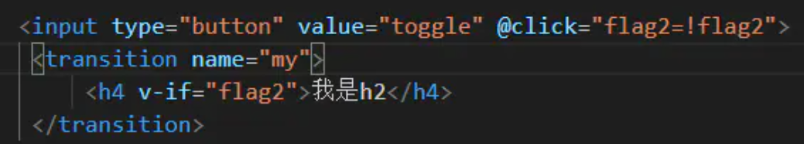
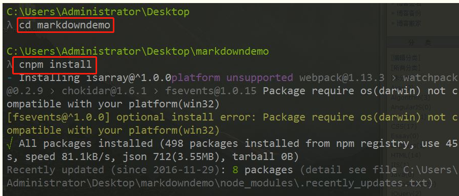
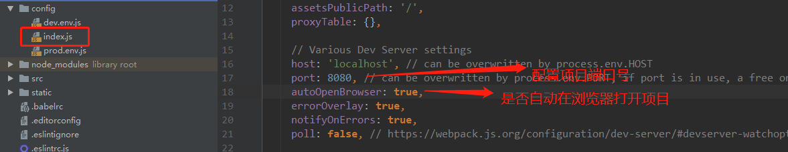

### 一、vue.js渐进式JavaScript框架

#### 1.vue的优点

```
1.体积小，压缩后33k;
2.更高的运行效率：
	基于虚拟dom,一种可以预先通过JavaScript进行各种计算，把最终的dom操作计算出来并优化的技术，由于这个dom操作属于预处理操作，并没有真正的处理dom，所以叫做虚拟dom。
3.双向数据绑定：
	让开发者不用再去操作dom对象，把更多的精力投入到业务逻辑上。
4.生态丰富、学习成本低。
```

#### 2.vue的基本使用

##### 2.1效果helloWorld

```html
<!DOCTYPE html>
<html lang="en">
<head>
    <meta charset="UTF-8">
    <title>Title</title>
</head>
<body>
    <!--1.引入vue.js
    2.创建vue对象
        el:指定根element(选择器)
        data:初始化数据(页面可以访问)
    3.双向数据绑定：v-model
    4.显示数据：{{xxx}}
    5.理解vue的MVVM实现-->

<div id="app">
    <input type="text" v-model="username">
    <p>hello {{username}}</p>
</div>

<script type="text/javascript" src="js/vue.js"></script>
<script type="text/javascript">
    //创建vue实例，Vue是一个vue.js库提供的构建函数
    const vm = new Vue({ //配置对象（属性名必须是指定的一些名称）
        el:'#app',	//element：选择器字符串， 表名将哪个元素交给vue管理
        data:{
            username:'fangyan'
        }
    })
</script>
</body>
</html>
```

##### 2.2理解vue的MVVM


```
MVVM:
model：模型，数据对象
view：视图，模板页面
viewModel：视图模型（Vue的实例）
```


#### 3.模板语法

```HTML
1.双大括号表达式：
	读取data中数据显示
2.数据绑定与双向数据绑定：
	数据绑定：数据在页面中与内存中的变量自动转移；
	双向数据绑定：2个方向数据都可以自动转移；
2.v-model:
	等同于给元素value属性赋值：
	<input type="text" v-model="username"> <!--element.value = 'xxx'-->
3.v-text:
	等同于给元素textContent赋值
	<p v-text="username"></p>  <!--element.textContent = 'xxx'-->
4.v-html:
	等同于将值尽量解析为HTML标签
	<p v-text="msg"></p> <!--textContent-->
    <p v-html="msg"></p> <!--innerHTML-->

    new Vue({
            el:'#app',
            data:{
                msg:'<a href="www.baidu.com">i will back</a>'
            }
        })

5.v-bind:
	强制数据绑定，使用HTML语法，在属性名前加上"v-bind:" 或 ":" 进行强制数据绑定
	
6.v-on:
	绑定事件监听 使用v-on: 或 @
	注意：事件方法不传参的时候，直接写方法名即可。如果传参方法名后加括号，括号里加参数（可以是data中的参数也可以是常量）
```

**示例**

```HTML
<!DOCTYPE html>
<html lang="en">
<div id="app">
    <h2>1.双大括号表达式</h2>
    <p>{{msg}}</p>
    <p>{{msg.toUpperCase()}}</p>
    <p v-text="msg"></p> <!--textContent-->
    <p v-html="msg"></p> <!--innerHTML-->
    
    <h2>2.指令一：强制数据绑定</h2>
    
    
    

    <h2>3.指令二：绑定事件监听</h2>
    <button v-on:click="test">点我</button>
    <button @click="test">再点我</button>
    <button @click="test2(msg)">传参</button>
</div>


<script type="text/javascript" src="../js/vue.js"></script>
<script type="text/javascript">
    new Vue({
        el:'#app',
        data:{
            msg:'<a href="www.baidu.com">i will back</a>',
            imgUrl:'https://cn.vuejs.org/images/logo.png'
        },
        methods:{
            test(){
                alert("hehe")
            },
            test2(data) {
                alert(data)
            }
        }
    })
</script>
</body>
</html>
```

#### 4.计算属性computed和监视watch

```HTML
1.计算属性：
	在conputed属性对象中定义计算属性的方法
	在页面中使用{{方法名}}来显示计算的结果
2.监视：
	通过vm对象的$watch()或watch配置来监视指定的属性
	当属性变化时，回调函数自动调用，在函数内部进行计算
3.计算属性之set与get:
	通过getter/setter实现对属性数据的显示和监视
	计算属性存在缓存，多次读取只执行一次getter计算
```

```HTML

<div id="app">
姓：<input placeholder="姓" v-model="firstName"><br>
名：<input placeholder="名" v-model="lastName"><br>
姓名1(单向):<input placeholder="姓名1" v-model="name1"><br>
姓名2(单向)：<input placeholder="姓名2" v-model="name2"><br>
姓名3(双向)：<input placeholder="姓名3" v-model="name3"><br>
</div>

<script type="text/javascript" src="../js/vue.js"></script>
<script type="text/javascript">
    const vm = new Vue({
        el:'#app',
        data:{
            firstName:'方',
            lastName:'岩',
            name2:'方 岩'
        },
        computed:{
            name1(){
                return this.firstName+' ' +this.lastName
            },
            name3: {
                //当读取name3属性值时执行get回调函数
                get() {
                    return this.firstName + ' ' + this.lastName
                },
                //当name3属性值发生变化时执行set回调函数
                set(newValue) {
                    const values = newValue.split(' ')
                    this.firstName = values[0]
                    this.lastName = values[1]
                }
            }
        },
        watch:{ //监视firstName值的变化，触发的方法，newValue是firstName修改后的值
            firstName(newValue){
                this.name2=newValue + ' ' + this.lastName
            }
        }
    })
    //监视的第二种方式，通过vue对象的watch方法监视
    vm.$watch('lastName',function (newValue, oldValue) {
        this.name2 = this.firstName + ' ' + newValue
    })
</script>
```

#### 5.class与style绑定

```HTML
在应用界面，某些元素的样式是变化的。class/style绑定就是专门用来实现动态样式效果的技术
1.class绑定：
	1) :class='xxx'
    2) 表达式是字符串: 'classA'
    3) 表达式是对象: {classA:isA, classB: isB}
    4) 表达式是数组: ['classA', 'classB']
2.style绑定：
	1) :style="{ color: activeColor, fontSize: fontSize + 'px' }"
	2) 其中 activeColor/fontSize 是 data 属性	
```

```HTML
<style>
    .aClass{
        color: red;
    }
    .bClass{
        color: green;
    }
    .cClass{
        font-size: 40px;
    }
</style>
<body>
<div id="app">
    <h2>1.class绑定：class='xxx'</h2><br>
    <p :class="a">class绑定：'xxx'是字符串</p><br>
    <p :class="{aClass:isA, cClass:isC}">class绑定：'xxx'是对象</p><br>
    <p :class="[a, c]">class绑定：'xxx'是数组</p><br>
    <button @click="update">更新</button><br>

    <h2>2.style绑定</h2><br>
    <p :style="{color, fontSize}">style="{ color: activeColor, fontSize: fontSize + 'px' }"</p>
</div>

<script type="text/javascript" src="../js/vue.js"></script>
<script type="text/javascript">
    new Vue({
        el:'#app',
        data:{
            a:'aClass',
            c:'cClass',
            isA:true,
            isC:false,
            color:'grey',
            fontSize:'30px'
        },
        methods:{
            update() {
                this.a = 'bClass'
                this.isA = false
                this.isC = true
                this.color='blue'
                this.fontSize='20px'
            }
        }
    })
</script>
```

#### 6.条件渲染

```HTML
1.条件渲染指令
    1) v-if 与 v-else
    2) v-show
2.比较v-if和v-show
	3) 如果需要频繁切换 v-show 较好
	4) 当条件不成立时, v-if 的所有子节点不会解析(项目中使用)
```

```HTML
<div id="demo">
    <p v-if="ok">成功了</p>
    <p v-else>失败了</p>
    <p v-show="ok">表白成功</p>
    <p v-show="!ok">表白失败</p>
    <button @click="ok=!ok">切换</button>
</div>

<script type="text/javascript" src="../js/vue.js"></script>
<script type="text/javascript">
    new Vue({
        el:'#demo',
        data:{
            ok:true
        }
    })
</script>
```

#### 7.列表渲染v-for

```html 
<div id="app">
    <h2>测试：v-for遍历数组</h2>
    <ul>
        <!--//列表的遍历(p, index)中第一个是数组里面的元素，第二个是下标-->
        <li v-for="(p, index) in persons" :key="index">
            {{index}}---{{p.name}}--{{p.age}}--<button @click="pDelete(index)">删除</button>--<button @click="pUpdate(index, {name:'cat',age:20})">更新</button>
        </li>
    </ul>
    
    <h2>测试：v-for遍历对象</h2>
    <ul>
        <!--//数组的遍历(value, key)中第一个是对象里面的值，第二个对象的键-->
        <li v-for="(value, key) in persons[1]" :key="key">
            {{key}}:{{value}}
        </li>
    </ul>
</div>

<script type="text/javascript" src="../js/vue.js"></script>
<script type="text/javascript">
    new Vue({
        el:'#app',
        data:{
            persons:[
                {name:'jack', age:19},
                {name:'tom', age:18},
                {name:'stive', age:16},
                {name:'rose', age:17}
            ]
        },
        methods:{
            pDelete(index) {
                this.persons.splice(index,1)
            },
            //注意更新操作不要用this.persons[index]=newP,因为这样原始数组的引用没有改变，而vue只能监视到数组的改变，不能监视数组内部结构的改变
            pUpdate(index, newP) {
                //splice方法改变的是整个数组
                this.persons.splice(index,1,newP)
            }
        }
    })
</script>
```

##### 7.1列表过滤和排序

```HTML
<div id="app">
    <h2>测试：列表排序</h2>
    <input type="text" v-model="searchName">
    <ul>
        <li v-for="(p, index) in filterPersons" :key="index">
            {{index}}---{{p.name}}--{{p.age}}
        </li>
    </ul>
    <button @click="setOrderType(1)">升序</button>
    <button @click="setOrderType(2)">降序</button>
    <button @click="setOrderType(0)">原序</button>
</div>

<script type="text/javascript" src="../js/vue.js"></script>
<script type="text/javascript">
    new Vue({
        el:'#app',
        data:{
            persons:[
                {name:'jack', age:19},
                {name:'tom', age:18},
                {name:'stive', age:16},
                {name:'rose', age:17}
            ],
            searchName:'',
            orderType:0  //0:原序 1：升序 2：降序
        },
        computed:{
            filterPersons() {
                let {persons, searchName, orderType} = this  //这句的作用是下面写数据属性时不用加this.
                //过滤
                persons = persons.filter(p => p.name.indexOf(searchName) != -1)
                //排序
                if (orderType !== 0) {
                    persons = persons.sort((a,b) => {
                        if (orderType === 1) { //升序
                            return a.age - b.age
                        } else {  //降序
                            return b.age - a.age
                        }
                    })
                }
                return persons
            }
        },
        methods:{
            setOrderType(orderType) {
                this.orderType = orderType
            }
        }
    })
</script>
```

#### 8.事件处理

```HTML
1.绑定监听：
	1) v-on:xxx="fun"
    2) @xxx="fun"
    3) @xxx="fun(参数)"
    4) 默认事件形参: event
    5) 隐含属性对象: $event
2.事件修饰符：
	1) @click.prevent : 阻止事件的默认行为 event.preventDefault()
	2) @click.stop : 停止事件冒泡 event.stopPropagation()
3.按键修饰符：
	1) @keyup.keycode : 操作的是某个 keycode 值的键
	2) @keyup.keyName : 操作的某个按键名的键(少部分)
```

```html 
<div id="app">
    <h2>1.绑定监听</h2>
    <button @click="test1">test1</button>
    <button @click="test2($event,'aaa')">test2</button>

    <h2>2.事件修饰符</h2>
   <!-- 停止事件冒泡 @click.stop-->
    <div style="width: 200px;height: 200px;background: red" @click="test3">
        <div style="width: 100px;height: 100px;background: green" @click.stop="test4"></div>
    </div>
    <!--停止事件默认行为@click.prevent-->
    <a href="http://www.baidu.com" @click.prevent="test5">百度一下</a>
    <!--按回车键，弹出input中的值 @keyUp.13-->
    <h2>3.案件修饰符</h2>
    <input @keyup.13="test6"> <!--13是enter键的keyCode,写@keyup.enter效果一样-->
    <input @keyup.enter="test6">
</div>

<script type="text/javascript" src="../js/vue.js"></script>
<script type="text/javascript">
    new Vue({
        el:'#app',
        data:{

        },
        methods:{
            //event为默认传入的事件本身，是原生dom事件
            test1(event){
                alert(event.target.innerHTML)
            },
            //如果该事件方法传入参数，又要使用event，则在标签处必须显示传入$event
            test2(event, str) {
                alert(event.target.innerHTML + '---' + str)
            },

            test3() {
                alert('out')
            },
            test4(event){
                //event.stopPropagation();    原生停止事件冒泡写法，  在vue中只需要在标签中写@click.stop="test4"即可
                alert('inner')
            },
            test5(){
                alert('点击了')
            },
            test6(event){
                alert(event.target.value)
            }
        }
    })
</script>
```

#### 9.使用v-model对表单数据自动收集

```HTML
<div id="demo">
    <form @submit.prevent="handleSubmit"> <!--@submit.prevent 阻止表单提交-->
        <span>用户名: </span>
        <input type="text" v-model="user.username"><br>
        <span>密码: </span>
        <input type="password" v-model="user.pwd"><br>
        <span>性别: </span>
        <input type="radio" id="female" value="female" v-model="user.sex">
        <label for="female">女</label>
        <input type="radio" id="male" value="male" v-model="user.sex">
        <label for="male">男</label><br>
        <span>爱好: </span>
        <input type="checkbox" id="basket" value="basketball"
               v-model="user.likes">
        <label for="basket">篮球</label>
        <input type="checkbox" id="foot" value="football"
               v-model="user.likes">
        <label for="foot">足球</label>
        <input type="checkbox" id="pingpang" value="pingpang"
               v-model="user.likes">
        <label for="pingpang">乒乓</label><br>
        <span>城市: </span>
        <select v-model="user.cityId">
            <option value="">未选择</option>
            <option v-for="city in allCitys" :value="city.id">
                {{ city.name }}
            </option>
        </select><br>
        <span>介绍: </span>
        <textarea v-model="user.desc" rows="10"></textarea><br><br>
        <input type="submit" value=" 注册">
    </form>
</div>

<script type="text/javascript" src="../js/vue.js"></script>
<script type="text/javascript">
    new Vue({
        el:'#demo',
        data:{
            user:{
                username:'',
                pwd:'',
                sex:'female',
                likes:['football'],
                cityId:'3',
                desc:''
            },
            allCitys:[{id:1,name:'beijing'},{id:2,name:'shanghai'},{id:3,name:'hangzhou'}]
        },
        methods:{
            handleSubmit(){
                console.log(this.user.username)
            }
        }
    })
</script>
```

#### 10.vue实例生命周期

```HTML
1.初始化显示：
	* beforeCreate()
    * created()
    * beforeMount()
    * mounted()
2.更新状态：this.xx=value
	* beforeUpdate()
	* updated()
3.销毁vue实例：
    * beforeDestory()
    * destoryed()

常用的生命周期方法：
1) created()/mounted(): 发送 ajax 请求, 启动定时器等异步任务
2) beforeDestory(): 做收尾工作, 如: 清除定时器
```

```HTML
<!DOCTYPE html>
<html lang="en">
<head>
    <meta charset="UTF-8">
    <title>09_vue实例的生命周期</title>
</head>
<body>
<div id="app">
    <button @click="destroyVue">destroy vue</button>
    <p v-show="isShow">{{name}}</p>
</div>

<script type="text/javascript" src="../js/vue.js"></script>
<script type="text/javascript">
    new Vue({
        el:'#app',
        data:{
            name:'方岩真帅',
            isShow:true
        },

        //生命周期-创建vue实例
        beforeCreate(){
            console.log("beforeCreate()")
        },
        created(){
            console.log("created()")
        },

        //生命周期-创建完vue实例后初始化的方法，调用一次
        beforeMount(){
            console.log("beforeMount()")
        },
        mounted(){
            console.log("beforeMount()")
            this.intervalId = setInterval(() => { //注意这边使用匿名函数，this才指代vue实例，否则this指代window实例
                this.isShow = !this.isShow
            },1000)
        },

        //生命周期-更新状态
        beforeUpdate(){
            console.log("beforeUpdate()")
        },
        updated(){
            console.log("updated()")
        },

        //生命周期-销毁vue实例  需要手动调用vue.$destroy()才能触发
        beforeDestroy(){
            console.log("beforeDestoty()")
            clearInterval(this.intervalId)
        },
        destroyed() {
            console.log("destroyed()")
        },

        methods:{
            destroyVue(){
                this.$destroy() //使用vm.$destroy()手动销毁vue实例，会触发beforeDestroy()和destroyed()回调函数
            }
        }
    })
</script>
</body>
</html>
```

#### 11.vue动画

```
先理解事件发生的过程，v-enter,v-enter-to,v-leave,v-leave-to。其中v-enter,v-leave代表开始及结束时的状态。v-enter-active,v-leave-active代表动画的过程。
```


```
定义动画第一步把要做动画的语句添加到transition标签中，其中name可以定义class前缀，下面的事件在添加动画时就可以写my-enter,my-leave-to,从而设置不同区域具有的不同的动画效果。
```



```
第二步就是在style里面添加动画样式：
```


**编码**

```HTML
<style>
    .fade-enter-active, .fade-leave-active {
        transition: opacity .5s
    }
    .fade-enter, .fade-leave-to {
        opacity: 0
    }
</style>
<body>
<div id="app">
    <button @click="isShow=!isShow">toggle</button>
    <transition name="fade"> <!--这个name对应的就是动画生成过程中vue给该标签添加class名称的前缀：fade-enter-->
        <p v-show="isShow">hello</p>
    </transition>
</div>

<script type="text/javascript" src="../js/vue.js"></script>
<script type="text/javascript">
    new Vue({
        el:'#app',
        data:{
            isShow:true
        }
    })
</script>
```

#### 12.过滤器

```HTML
1.定义过滤器
    Vue.filter(filterName, function(value[,arg1,arg2,...]){
    // 进行一定的数据处理
    return newValue
    })
2.使用过滤器
	<div>{{myData | filterName}}</div>
	<div>{{myData | filterName(arg)}}</div>
```

```HTML
<body>
<div id="app">
    <p>当前时间：为{{date | dateStr}}</p>
    <p>当前时间2为：{{date | dateStr('YYYY-MM-DD')}}</p>
</div>
</body>

<script type="text/javascript" src="../js/vue.js"></script>
<script type="text/javascript" src="https://cdn.bootcss.com/moment.js/2.19.0/moment.js"></script>
<script type="text/javascript">
    Vue.filter('dateStr',(value, format) => {
        return moment(value).format(format || 'YYYY-MM-DD HH:mm:ss')
    })
    new Vue({
        el:'#app',
        data:{
            date:new Date()
        }
    })
</script>
```

#### 13.内置指令和自定义指令

##### 13.1内置指令

```
1.内置指令
    1) v:text : 更新元素的 textContent
    2) v-html : 更新元素的 innerHTML
    3) v-if : 如果为 true, 当前标签才会输出到页面
    4) v-else: 如果为 false, 当前标签才会输出到页面
    5) v-show : 通过控制 display 样式来控制显示/隐藏
    6) v-for : 遍历数组/对象
    7) v-on : 绑定事件监听, 一般简写为@
    8) v-bind : 强制绑定解析表达式, 可以省略 v-bind
    9) v-model : 双向数据绑定
    10) ref : 指定唯一标识, vue 对象通过$els 属性访问这个元素对象
    11) v-cloak : 防止闪现, 与 css 配合: [v-cloak] { display: none }
```

```HTML
<style>
    [v-cloak]{
        display: none;
    }
</style>
<body>
<div id="app">
    <!--ref指令的使用-->
    <p ref="msg">我是帅哥</p>
    <button @click="showMsg">显示左侧文本</button>
    <!--防止闪现v-cloak指令的使用-->
    <p v-cloak>{{url}}</p>
</div>


<script type="text/javascript" src="../js/vue.js"></script>
<script type="text/javascript">
    alert('----------')
new Vue({
    el:'#app',
    data:{
        url:'www.baidu.com'
    },
    methods:{
        showMsg(){
            alert(this.$refs.msg.textContent)
        }
    }
})
</script>
```

##### 13.2自定义指令

```js
1) 注册全局指令
Vue.directive('my-directive', function(el, binding){
	el.innerHTML = binding.value.toupperCase()
})

2) 注册局部指令
directives : {
    'my-directive' : {
        bind (el, binding) {
        	el.innerHTML = binding.value.toupperCase()
        }
    }
}

3) 使用指令
v-my-directive='xxx'
```

```html 
<div id="app">
    <p v-upper-text="msg"></p>
    <p v-lower-text="msg"></p>
</div>

<script type="text/javascript" src="../js/vue.js"></script>
<script type="text/javascript">
    /*<!--自定义全局指令，在所有vue实例中都能用-->*/
    Vue.directive('upper-text', function (el, binding) {
        return el.textContent = binding.value.toUpperCase()
    })

    new Vue({
        el:'#app',
        data:{
            msg:'I Like Music'
        },
        //自定义局部指令，只在当前vm中能使用
        directives:{
            'lower-text':{
                bind (el, binding) {
                    return el.textContent = binding.value.toLowerCase()
                }
            }
        }
    })
</script>
```

#### 14.开发插件

```
1) Vue 插件是一个包含 install 方法的对象
2) 通过 install 方法给 Vue 或 Vue 实例添加方法, 定义全局指令等
```

**插件js**

```javascript
//自定义vue插件
(function () {
    const MyPlugin = {}
    MyPlugin.install = function (Vue, options) {
        // 1. 添加全局方法或 property
        Vue.myGlobalMethod = function () {
            alert('vue函数对象方法执行')
        }

        // 2. 添加全局资源 如自定义指令
        Vue.directive('my-directive', {
            bind (el, binding) {
                el.innerHTML = "myPlugin my-directive " + binding.value
            }
        })

        // 3. 添加实例方法
        Vue.prototype.$myMethod = function (methodOptions) {
            alert('vue实例对象方法执行')
        }
    }

    //4.对外暴露插件对象
    window.MyPlugin = MyPlugin
})()
```

**使用插件**

```HTML
<div id="app">
    <p v-my-directive="msg"></p>
</div>
</body>

<script type="text/javascript" src="../js/vue.js"></script>
<script type="text/javascript" src="vue-myPlugin.js"></script>
<script type="text/javascript">
    //1.使用自定义插件
    Vue.use(MyPlugin)
    //2.调用自定义静态方法
    Vue.myGlobalMethod()

    var vm = new Vue({
        el:'#app',
        data:{
            msg:'方岩真帅'
        }
    })

    //3.调用自定义对象方法
    vm.$myMethod()
</script>
```

### 二、vue组建化编码

#### 1.使用vue-cli创建模板项目

```javascript
1.说明：
	1）vue-cli是vue官方提供的脚手架工具；
	2) github: https://github.com/vuejs/vue-cli
    3) 作用: 从 https://github.com/vuejs-templates 下载模板项目
2.创建vue项目：
	npm install -g vue-cli  //-g表示全局安装，安装一次后以后都不用安装了
    vue init webpack vue_demo(项目名)  //下载webpack脚手架模板作为项目
    cd vue_demo			   //进入项目目录
    npm install			   //安装模板项目所需依赖包
    npm run dev			   //运行脚手架项目
    访问: http://localhost:8080/
```

检查是否已经安装了vue-cli,在黑窗口使用命令vue,如果可以使用证明已经安装


#### 2.使用vue-cli创建模板项目问题解决

```
如果在执行vue init webpack vue_demo命令时出现downloding说明网络原因不能从GitHub上下载webpack模板，因此可以使用离线下载的方式：
1.在https://github.com/vuejs-templates/webpack/tree/master下载webpack模板
2.将下载的模板解压命名为webpack
3.将解压后的文件夹放到C:\Users\Administrator.SKY-20181021GIQ/.vue-templates/目录下
4.在要创建vue项目的目录下执行vue init webpack projectName --offline
	就可以创建模板项目了
```


```
进入项目，下载依赖：（进入项目一定要切换到项目路径）
npm install
```



```
运行项目
npm run dev
```


#### 3.基于webpack脚手架编写项目

##### 3.1脚手架目录介绍





##### 3.2编写项目

```HTML
步骤：
1.在src/components/下编写我们的组件
2.在App.vue根组件中使用我们的组件
3.在main.js入口里注册根组件
```

**1.在src/components/下编写我们的组件HelloWorld.vue**

```vue
<template>
  <div class="hello">
    <p class="msg">{{msg}}</p>
  </div>
</template>

<script>
export default { //配置对象(与Vue一致)
  data () { //必须写函数
    return {
      msg: 'Welcome vue component'
    }
  }
}
</script>

<style>
.msg {
  color: red;
  font-size: 30px;
}

</style>
```

**2.在App.vue根组件中使用我们的组件**

```vue
<template>
  <div>
    
    <!--3.使用组件标签-->
    <HelloWorld/>
  </div>
</template>

<script>
  //1. 引入自定义组件
import HelloWorld from './components/HelloWorld'

export default {
  //2. 映射组件标签
  components: {
    HelloWorld
  }
}
</script>

<style>
.logo {
  width: 200px;
  height: 200px;
}
</style>

```

**3.在main.js入口里注册根组件**

```js
/**
 * 入口js：创建vue实例
 */

//1.引入vue和app组件
import Vue from 'vue'
import App from './App'


new Vue({
  el: '#app',  //2.将组件渲染到index.html中的id="app"的标签上
  components: { App },  //3. 映射组件标签
  template: '<App/>'    //4.使用组件标签
})
```

**4.index.html**

```html 
<!DOCTYPE html>
<html>
  <head>
    <meta charset="utf-8">
    <meta name="viewport" content="width=device-width,initial-scale=1.0">
    <title>vue_demo</title>
  </head>
  <body>
    <div id="app"></div>
  </body>
</html>

```

***5.效果**


#### 4.vue项目打包发布

```properties
1.打包：
	1）在本地项目的config/index.js里的build下进行修改，如果要把项目放到 vueDemo 文件夹下，则：
		assetsPublicPath: '/VueDemo/'
	2)使用命令 npm run build 打包生成 dist 文件夹，  把文件夹改为 1）中vueDemo名称
		文件夹内容包括 一个static文件夹和 一个 index.html 文件
		
2.发布到nginx服务器：
	1）在vueDemo文件放到路径 /app/下
	2）nginx中的配置：
	server {
        listen      9090;
        server_name 127.0.0.1;

        location /vueDemo/ {
                root /app/;
                index index.html;
        }
        
3.访问 ip:9090/vueDemo  即可自动访问到/app/vueDemo/index.html文件了
```

#### 5.组件的定义与使用

##### 5.1vue文件的组成(3个部分)

```vue
<template>
	<!--模板页面-->
</template>

<script>
  export default {
    name: 'App',
    components:{
    },
    data() {  //与vm不同，data必须用函数
      return {
      }
    },
    methods:{},
    computed:{}
  }
</script>

<style scoped>
    /*样式*/
</style>

```

##### 5.2基本使用

```vue
1) 引入组件
2) 映射成标签
3) 使用组件标签

<template>
    <HelloWorld></HelloWorld>
    <hello-world></hello-world>
</template>
<script>
import HelloWorld from './components/HelloWorld'
export default {
    components: {
    	HelloWorld
    }
}
</script>	
```

##### 5.3关于标签名与标签属性名书写的问题

```
1) 写法一: 一模一样
2) 写法二: 大写变小写, 并用-连接
```

#### 6.组件间通信

组件间通信基本原则

```
1) 不要在子组件中直接修改父组件的状态数据
2) 数据在哪, 更新数据的行为(函数)就应该定义在哪
```

##### 6.1组件间通信1：props

```vue
<!--此方法适用于父组件向子组件传递 数据 或 方法-->

1.使用组件标签时：
	<my-component name='tom' :age='3' :setName='setName'></my-component>
	//setName可以是data也可以是methods
2.定义MyComponent时
	1) 在组件内声明所有的 props
	2) 方式一: 只指定名称
		props: ['name', 'age', 'setName']
	3) 方式二: 指定名称和类型
        props: {
            name: String,
            age: Number,
            setNmae: Function
        }
	4) 方式三: 指定名称/类型/必要性/默认值
        props: {
        	name: {type: String, required: true, default:xxx},
        }

3.注意：
    1) 此方式用于父组件向子组件传递数据
    2) 所有标签属性都会成为组件对象的属性, 模板页面可以直接引用
    3) 问题:
        a. 如果需要向非子后代传递数据必须多层逐层传递
        b. 兄弟组件间也不能直接 props 通信, 必须借助父组件才可以
```

##### 6.2组件间通信2：自定义事件

```js
1.绑定事件监听;
	// 方式一: 通过 v-on 绑定
    @delete_todo="deleteTodo"

    // 方式二: 通过$on()
		//一般异步执行代码写在vm生命周期函数mounted中
    this.$refs.xxx.$on('delete_todo', function (todo) {
    	this.deleteTodo(todo)
    })

2.触发事件
	// 触发事件(只能在父组件中接收)
	this.$emit(eventName, data)

3.注意：
    1) 此方式只用于子组件向父组件发送消息(数据)
    2) 问题: 隔代组件或兄弟组件间通信此种方式不合适
```

##### 6.3组件间通信3：消息订阅与发布（pubsub-js库）

```
1.订阅消息
	PubSub.subscribe('msg', function(msg, data))
2.发布消息：
	PubSub.publish('msg', data)
	
3.注意：
	优点：此方式可实现任意关系组件间通信（数据）
```

##### 6.4组件间通信4：slot

```html 
1.理解：
	此方式用于父组件向子组件传递标签数据

2.子组件：Child.vue
<template>
    <div>
        <slot name="xxx">不确定的标签结构 1</slot>
        <div>组件确定的标签结构</div>
        <slot name="yyy">不确定的标签结构 2</slot>
    </div>
</template>

3.父组件：Parent.vue
<child>
    <div slot="xxx">xxx 对应的标签结构</div>
    <div slot="yyy">yyyy 对应的标签结构</div>
</child>
```


#### 7.本地存储数据

```js
//通过window.loaclStorage.setItem(key, value) 向本地存储一个键值对数据
//通过window.loaclStorage.sgetItem(key) 从本地取出一个键对应的数据
//通过watch对数据进行监视，保证数据变化实时向本地文件更新数据  
data () {
      return {
        todos : JSON.parse(window.localStorage.getItem('todos_key') || '[]')
      }
    },

 watch : {
      todos:{
        deep:true,
        handler: function(newValue){
          window.localStorage.setItem('todos_key', JSON.stringify(newValue))
        }
      }
    }
```


### 三、vue-ajax

#### 1.vue项目中常用的2个ajax库

```
1.vue-resource
	vue插件，非官方库，vue1.x使用广泛
2.axios
	通用的ajax请求库，官方推荐，vue2.x使用广泛
```

#### 2.vue-resource的使用

```js
1.在线文档：
	https://github.com/pagekit/vue-resource/blob/develop/docs/http.md
2.下载;
	npm install vue-resource --save
	
3.实例：
//1.引入VuesResource插件
import VueResource from 'vue-resource'
//2.声明使用插件
Vue.use(VueResource)  //内部会给vm对象添加一个属性：$http

//发送ajax获取数据
      const url = 'https://api.github.com/search/repositories?q=vu&sort=stars'
     //使用VueResource发送ajax请求
      this.$http.get(url).then(
        //调用成功的回调函数
        reponse => {
          const result = reponse.data
          //得到最受欢迎的repo
          const mostRespo = result.items[0]
          this.repoUrl = mostRespo.html_url
          this.repoName = mostRespo.name
        },
        //调用失败的回调函数
        error => {
          alert('调用失败')
        }
      )
```

#### 3.axios的使用

```js
1.在线文档：
	https://github.com/pagekit/vue-resource/blob/develop/docs/http.md
2.下载：
    npm install axios --save
    
3.实例：
//1.引入模块
import axios from 'axios'
//使用axios发送ajax请求
      axios.get(url).then(res => { //调用成功的回调函数
        const mostRespo = res.data.items[0]
        this.repoUrl = mostRespo.html_url
        this.repoName = mostRespo.name
      }).catch(error =>{//调用失败的回调函数
        alert('调用失败')
      })
```

### 四、vue UI组件库

```
1.常用：
    1) Mint UI:
        a. 主页: http://mint-ui.github.io/#!/zh-cn
        b. 说明: 饿了么开源的基于 vue 的移动端 UI 组件库
    2) Elment
        a. 主页: http://element-cn.eleme.io/#/zh-CN
        b. 说明: 饿了么开源的基于 vue 的 PC 端 UI 组件库
        
2.使用：
	2.1下载：
		npm install --save mint-ui
	2.2实现按需打包：
        1. 下载
        npm install --save-dev babel-plugin-component
        2. 修改 babel 配置
        "plugins": ["transform-runtime",["component", [
            {
                "libraryName": "mint-ui",
                "style": true
            }
        ]]]
    2.3mint-ui组件分类：
    	1) 标签组件
		2) 非标签组件
```

2.4使用mint-ui的组件：

1）index.html

```HTML
<meta name="viewport" content="width=device-width, initial-scale=1, maximum-scale=1,
minimum-scale=1, user-scalable=no"/>
<script
  src="https://as.alipayobjects.com/g/component/fastclick/1.0.6/fastclick.js"></scrip
  t>
  <script>
    if ('addEventListener' in document) {
    document.addEventListener('DOMContentLoaded', function() {
    FastClick.attach(document.body);
    }, false);
    }
    if(!window.Promise) {
    document.writeln('
    <script
      src="https://as.alipayobjects.com/g/component/es6-promise/3.2.2/es6-promise.min.js"
    '+'>'+'<'+'/'+'script>');
    }
  </script>
```

2)main.js

```js
import {Button} from 'mint-ui'
Vue.component(Button.name, Button)
```

3)App.vue

```vue
<template>
  <mt-button @click="handleClick" type="primary" style="width: 100%">Test</mt-button>
</template>
<script>
  import {Toast} from 'mint-ui'
  export default {
    methods: {
      handleClick () {
        Toast(' 点击了测试');
      }
    }
  }
</script>
```

### 五、vue-router

#### 1.理解

```js
1.说明：
    1) 官方提供的用来实现 SPA 的 vue 插件
    2) github: https://github.com/vuejs/vue-router
    3) 中文文档: http://router.vuejs.org/zh-cn/
    4) 下载: npm install vue-router --save
    
2.相关API说明：
	1）配置路由器：
        new VueRouter({
          //n个路由
          routes: [
            {
              path: '/about',
              component: About
            },
            {
              path: '/home',
              component: Home
            },
            {
              path: '/',
              redirect: '/about'
            }
          ]
        })
	2)注册路由器
    import router from './router'
    new Vue({
    	router
    })
	3）使用路由组件标签
        1. <router-link>: 用来生成路由链接
        <router-link to="/xxx">Go to XXX</router-link>
        2. <router-view>: 用来显示当前路由组件界面
        <router-view></router-view>
```

#### 2.基本路由

路由组件： Home.vue    About.vue

**1.配置路由模块：src/router/index.js**

```js
/*
路由器模块
 */

import Vue from 'vue'
import VueRouter from 'vue-router'
import About from '../views/About'
import Home from '../views/Home'

Vue.use(VueRouter)

export default new VueRouter({
  //n个路由
  routes: [
    {
      path: '/about',
      component: About
    },
    {
      path: '/home',
      component: Home
    },
    { //跟路径，重定向某个路由
      path: '/',
      redirect: '/about'
    }
  ]
})
```

**2.注册路由器：main.js**

```js
import Vue from 'vue'
import App from './App.vue'
//1.引入路由器模块
import router from './router'

new Vue({
  el:'#app',
  components: {App},
  template: '<App/>',
  router   //2.注册
})

```

**3.应用组件：App.vue**

```html 
<div>
    <!--路由链接-->
    <router-link to="/about">About</router-link>
    <router-link to="/home">Home</router-link>
    <!--用于渲染当前路由组件-->
    <router-view></router-view>
</div>
```

#### 3.嵌套路由

**1.子路由组件**

```
News.vue
Message.vue
```

**2.配置嵌套路由router.js**

```js
routes: [
    {
      path: '/about',
      component: About
    },
    {
      path: '/home',
      component: Home,
      children: [ //配置home的子路由
        {
          path: 'news',
          component: News
        },
        {
          path: 'message',
          component: Message
        },
        {
          path: '',  //重定向
          redirect: '/home/news'
        }
      ]
    }
    ]
```

**3.路由链接Home.vue**

```html 
<div>
      <h2>Home</h2>
      <router-link to="/home/news">news</router-link>
      <router-link to="/home/message">messages</router-link><br>
      <router-view></router-view>
    </div>
```

#### 4.缓存路由组件对象

```HTML
1.理解：
	1）默认情况下，被切换的路由组件对象会死亡释放，再次切换回来是重新创建的。
	2）如果可以缓存路由组件对象，可以提高用户体验。
2.编码实现：<keep-alive></keep-alive>
	  <keep-alive>
        <router-view/>
      </keep-alive>
```

#### 5.向路由组件传递数据

**方式1：路由路径携带参数(param/query)**

```js
1.配置路由器：
	 children: [
            {
              path: 'messageDetail/:id',
              component: MessageDeatil
            }
          ]
2.路由路径：
<router-link :to="`/home/message/messageDetail/` + message.id">{{message.title}}</router-link>
3.路由组件中读取请求参数
	this.$route.params.id
```

**方式2：<rooter-view>属性携带数据**

```
<router-view :msg="msg"></router-view>

路由组件通过props属性获取
```

#### 6.编程式路由向导

```js
1) this.$router.push(path): 相当于点击路由链接(可以返回到当前路由界面)
2) this.$router.replace(path): 用新路由替换当前路由(不可以返回到当前路由界面)
3) this.$router.back(): 请求(返回)上一个记录路由
4) this.$router.go(-1): 请求(返回)上一个记录路由
5) this.$router.go(1): 请求下一个记录路由
```

### 六、vuex

#### 6.1vuex理解

```js
1.vuex是什么？
	1) github 站点: https://github.com/vuejs/vuex
    2) 在线文档: https://vuex.vuejs.org/zh-cn/
    3) 简单来说: 对 vue 应用中多个组件的共享状态进行集中式的管理(读/写)
2.状态自管理应用：
	1）store:驱动应用的数据源；
    2）view：以声明方式将state映射到视图；
    3）actions：响应在view上的用户输入导致的状态变化（包含n个更新状态的方法）
```


#### 6.2vuex的核心概念和API

```JS
1.state
	1)vuex管理的状态对象；
    2）他应该是唯一的：
    	const state = {
        	xxx: initValue
        }
2.mutations
	1)包含多个直接更新state的方法（回调函数）的对象；
    2)谁来触发：actions中的commit('mutation名称')
	3）只能包含同步代码块，不能写异步代码。  异步代码写进action中
    	const mutations = {
            yyy (state, {data1}) {
            	// 更新 state 的某个属性
            }
        }
3.actions
	1）包含多个事件回调函数的对象；
    2）通过执行：commit()来触发mutation的调用，间接更新state
    3）谁来触发：组件中：$store.dispatch('action名称',data1)   //'zzz'
	4)可以包含异步代码：（定时器，ajax）
    	const actions = {
            zzz ({commit, state}, data1) {
            	commit('yyy', {data1})
            }
        }
4.getters
	1)包含多个计算属性(get)的对象；
    2）谁来读取：组件中：$store.getters.xxx
		const getters = {
            mmm (state) {
                return ...
            }
        }
5.modules
	1)包含多个module
    2）一个module是一个store的配置对象；
    3）与一个组件（包含有共享数据）对应
6.向外暴露store对象
        export default new Vuex.Store({
            state,
            mutations,
            actions,
            getters
        })
7.组件中
    import {mapState, mapGetters, mapActions} from 'vuex'
    export default {
        computed: {
            ...mapState(['xxx']),
            ...mapGetters(['mmm'])
        }
    	methods: mapActions(['zzz'])
    }
    {{xxx}} {{mmm}} @click="zzz(data)"
8.映射store
	import store from './store'
    new Vue({
    store
    })
9.store对象
	1）所有用vuex管理的组件中都多一个属性$store, 它就是一个store对象
	2）属性：
    	state：注册的state对象
        getters:注册的getter对象
    3）方法：
    	dispatch(actionName, data)    //分发调用action
```

#### 6.3案例一、计数器

**store.js**

```js
/*
vuex的核心管理模块 store
 */
//引入Vue和Vuex模块
import Vue from 'vue'
import Vuex from 'vuex'
//声明使用vuex
Vue.use(Vuex)

/*
  state状态对象
 */
const state = {
  count: 0
}

/*mutation对象
  包含多个更新state函数的对象
  一个方法就是一个mutation
  mutation只能包含更新state的同步代码，也不会有逻辑
  mutation有action触发调用：commit('mutationName')
*/
const mutations = {
  ADD() {
    state.count++
  },
  DECRE() {
    state.count--
  }
}

/*actions对象
  包含多个对应事件回调函数的对象 间接更新state
  一个方法就是一个action
  action中可以有逻辑和异步代码
  action由组件来触发调用：this.$store.dispatch('actionName')

*/
const actions = {
  add({commit}) {
    commit('ADD')
  },
  decre({commit}) {
    commit('DECRE')
  },
  increIfOdd({commit, state}) {
    if (state.count % 2 === 1) {
      commit('ADD')
    }
  },
  increAsync({commit}) {
    setTimeout(() => {
      commit('ADD')
    }, 1000)
  }
}

/*getters对象
  包含多个getter计算属性函数的对象
 */
const getters = {
    evenOrOdd(state) {
    return state.count % 2 === 0 ? '偶数' : '奇数'
  },
  count(state) {
    return state.count
  }
}

/**
 * 向外暴露store实例对象
 */
export default new Vuex.Store({
  state,
  mutations,
  actions,
  getters
})
```

**main.js**

```js
import Vue from 'vue'
import App from './App.vue'
import store from './store'

new Vue({
  el:'#app',
  components: {App},
  template: '<App/>',
  store  //使所有组件都多了一个$store对象,  注意：此处store必须小写
})
```

**App.vue(优化前)**

```vue
<template>
  <div>
    <p>click {{count}} times, count is {{oddOrEven}}</p>
    <button @click="add">+</button>
    <button @click="decre">-</button>
    <button @click="increIfOdd">increment if odd</button>
    <button @click="increAsync">increment async</button>
  </div>
</template>

<script>
  export default {
    name: 'App',
    computed: {
      oddOrEven() {
        return this.$store.getters.evenOrOdd
      },
      count() {
        return this.$store.getters.count
      }
    },
    methods: {
      add() {
        this.$store.dispatch('add')
      },
      decre() {
        this.$store.dispatch('decre')
      },
      increIfOdd() {
        this.$store.dispatch('increIfOdd')
      },
      increAsync() {
        this.$store.dispatch('increAsync')
      }
    }
  }
</script>

<style scoped>
</style>

```

**App.vue（优化后）**

```vue
<template>
  <div>
    <p>click {{count}} times, count is {{oddOrEven}}</p>
    <button @click="add">+</button>
    <button @click="decre">-</button>
    <button @click="increIfOdd">increment if odd</button>
    <button @click="increAsync">increment async</button>
  </div>
</template>

<script>
  import {mapGetters, mapActions} from 'vuex'

  export default {
    name: 'App',
    computed: mapGetters({ //store中和组件中名称不一致的用对象来手动映射
      count: 'count',
      evenOrOdd: 'oddOrEven' //evenOrOdd是组件中的名称，'oddOrEven'是store中的名称
    }),
    methods: mapActions([ //store中和组件中名称一致的直接用数组直接映射
      'add',
      'decre',
      'increIfOdd',
      'increAsync'
    ])
  }
</script>

<style scoped>

</style>

```

#### 6.4vuex结构图


