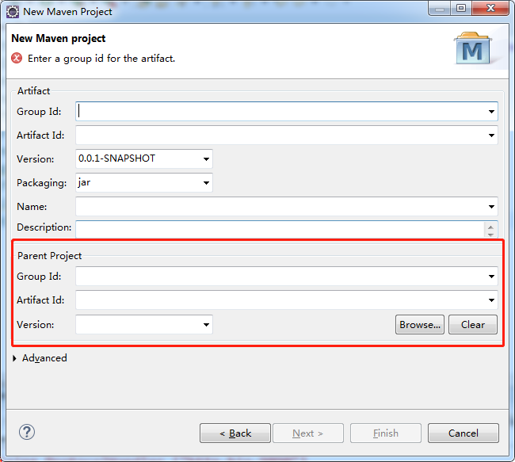

### 1.maven插件的安装

####1.1安装到本地

```java
1.官网下载maven插件：http://maven.apache.org/
2.把插件放到磁盘的英文目录下；
3.配置环境变量
	MAVEN_HOME = F:\javasoftware\apache-maven-3.3.9
	Path = %MAVEN_HOME%\bin
4.测试环境变量是否配置成功；
	cmd-->mvn -v
```

#### 1.2maven插件和IDE（Eclipse）工具集成使用

Eclipse-->preferences-->搜索maven-->install安装磁盘下的maven插件即可；

指定maven的setting.xml文件（读取本地仓库及其他重要配置，是一个全局文件）。

#### 1.3设置settings.xml文件

```xml
1.本地仓库：
	默认情况，本地仓库在c盘用户目录/.m2/respository目录，把本地仓库位置切换成自己指定的磁盘路局：
	<localRepository>本地仓库的磁盘路径</localRepository>
2.阿里镜像：
	默认情况，jar包从中央仓库去下载，速度较慢，所以一般指定国内镜像（阿里镜像）
	在mirrors标签下引入以下代码：
	<mirror>
			<id>alimaven</id>
			<name>aliyun maven</name><url>http://maven.aliyun.com/nexus/content/groups/public/</url>
			<mirrorOf>central</mirrorOf>
	</mirror>	
3.jdk版本配置
	默认情况下，maven依赖jdk1.5，可以手动指定当前的编译环境：
	在profiles标签引入以下代码：
	<profile>
		<id>jdk-1.8</id>
		<activation>
			<activeByDefault>true</activeByDefault>
			<jdk>1.8</jdk>
		</activation>
		<properties>
			<maven.compiler.source>1.8</maven.compiler.source>
			<maven.compiler.target>1.8</maven.compiler.target><maven.compiler.compilerVersion>1.8</maven.compiler.compilerVersion>
		</properties>
	</profile>
```

#### 1.4创建maven工程

```xml
1.创建maven工程：
	Eclipse-->new Maven Project-->跳过原型选择-->指定工程坐标（groupId,artifactId,version）-->选择该工程的打包方式（jar，war，pom）-->finish

注意：如果创建的是maven web工程，则打包方式选择war包，然后工程名右键-->javaeeTools-->generate deployment  discriptor stub,然后会在src/main/webapp/ 下放web资源


2.jar包的依赖管理
<dependencies>
		<!--当前工程中引入junit的jar包-->
		<dependency>
			<groupId>junit</groupId>
    		<artifactId>junit</artifactId>
    		<version>4.12</version>
		</dependency>
        ......
	</dependencies>
```

### 2.maven的常用命令

```java
clean：清空target目录下的资源
compile:编译
deploy:上传到私服
test:单元测试
install:把工程打成jar|war包添加到本地仓库
tomcat7:run war包项目发布到tomcat服务器中，并启动服务器
package:打包
执行顺序：从上到下，如果其中一个命令被执行，那么其上的其他的命令也会被依次被自动执行

//说明：install命令可以把本项目打成jar或者war包，放入项目的target目录下，并且会把该jar或war包和pom.xml放入到本地maven仓库,如果其他工程需要引入本项目，只需要把本项目的pom.xml文件内的工程坐标复制到其他工程的pom.xml中，就会自动引入该jar或war包；
//tomcat7:run会将项目发布到tomcat服务器插件；
```

#### maven集成tomcat插件

```xml
1.在pom.xml文件中配置tomcat7插件
	<build>
	<!-- tomcat插件 -->
	<plugins>
    	<plugin>
        	<groupId>org.apache.tomcat.maven</groupId>
			<artifactId>tomcat7-maven-plugin</artifactId>
			<version>2.2</version>
			<configuration>
                 <!--项目打成的包的名字-->
				<path>/mvn</path>
                 <!--tomcat的端口-->
				<port>9090</port>
                 <!--设置tomcat服务器编码-->
				<uriEncoding>UTF-8</uriEncoding>
			</configuration>
        </plugin>
    </plugins>
</build>
说明：maven工程一般使用maven集成的tomcat插件，而不使用本地tomcat；

2.启动tomcat：
	工程名上右键-->run as maven build-->tomcat7:run
```

###3.maven依赖版本冲突解决方式

```xml
1.在pom.xml中排除指定的jar包
	<dependency>
			<groupId>commons-fileupload</groupId>
			<artifactId>commons-fileupload</artifactId>
			<version>1.3.3</version>
			<!-- 排除指定的jar包 -->
			<exclusions>
				<exclusion>
					<artifactId>commons-io</artifactId>
					<groupId>commons-io</groupId>
				</exclusion>
			</exclusions>
		</dependency>

2.在pom.xml文件中手动指定统一版本号
	<!-- 1.版本指定 -->
	<properties>
        <!--以下标签名可以自定义，作为下面版本号引用的标识-->
		<io-version>2.1</io-version>
		<junit-version>4.12</junit-version>
	</properties>
	<!--2.锁定版本号 -->
	<dependencyManagement>
		<dependencies>
			<dependency>
				<groupId>commons-io</groupId>
				<artifactId>commons-io</artifactId>
                <!--使用EL取相应版本号的信息-->
				<version>${io-version}</version>
			</dependency>

			<dependency>
				<groupId>junit</groupId>
				<artifactId>junit</artifactId>
				<version>${junit-version}</version>
			</dependency>
		</dependencies>
	</dependencyManagement>

<!--3.在pom.xml文件中依赖相关jar包，不需在指定版本号-->
	<dependencies>
		<dependency>
			<groupId>junit</groupId>
			<artifactId>junit</artifactId>
			<scope>test</scope>
		</dependency>
	</dependencies>
```

### 4.jar包的作用于scope

```
scope的取值如下：

compile: 表示jar包只在编绎环境时使用
test: 表示jar包在测试环境时使用
provided:服务器环境，jar包依赖第三方提供（重要）
runtime:jar包运行在整个过程

注意：如果使用maven和tomcat插件集成启动项目，pom中需引入servlet的jar包才可以用servlet的api，但是它的作用域应为provided，因为当发布到tomcat服务器后，tomcat服务器内置的有servlet的jar包，provided的作为范围是当服务器环境下，pom.xml中的servlet的jar包无效，使用tomcat的提供的servlet的jar包，以免发生jar包冲突。
```

### 5.工程的继承

```
开发中多个项目有共同的jar包依赖,可以采用继承方式简化各个项目的pom文件,在父类的pom文件中依赖共同拥有的
jar.

注意：
1.父级项目只能是pom打包方式。
2.子项目是一个Maven Project
```

```xml
<!--父工程的pom.xml-->

<project xmlns="http://maven.apache.org/POM/4.0.0" xmlns:xsi="http://www.w3.org/2001/XMLSchema-instance" xsi:schemaLocation="http://maven.apache.org/POM/4.0.0 http://maven.apache.org/xsd/maven-4.0.0.xsd">
  <modelVersion>4.0.0</modelVersion>
  <groupId>com.qf</groupId>
  <artifactId>day01_maven_parent</artifactId>
  <version>0.0.1-SNAPSHOT</version>
  <packaging>pom</packaging>
  
  <!-- 版本指定 -->
	<properties>
		<io-version>2.1</io-version>
		<junit-version>4.12</junit-version>
	</properties>

	<!--2.锁定版本号 -->
	<dependencyManagement>
		<dependencies>
			<dependency>
				<groupId>junit</groupId>
				<artifactId>junit</artifactId>
				<version>${junit-version}</version>
			</dependency>
		</dependencies>
	</dependencyManagement>
  
  <dependencies>
		<dependency>
			<groupId>junit</groupId>
			<artifactId>junit</artifactId>
			<scope>test</scope>
		</dependency>
  </dependencies>
</project>
```

```xml
<!--子工程的pom.xml-->
<!--使用eclipse创建maven工程可以在创建工程时指定父工程，详见下图-->
<project xmlns="http://maven.apache.org/POM/4.0.0" xmlns:xsi="http://www.w3.org/2001/XMLSchema-instance" xsi:schemaLocation="http://maven.apache.org/POM/4.0.0 http://maven.apache.org/xsd/maven-4.0.0.xsd">
  <modelVersion>4.0.0</modelVersion>
   <!--指定继承的父工程座标-->
  <parent>
    <groupId>com.qf</groupId>
    <artifactId>day01_maven_parent</artifactId>
    <version>0.0.1-SNAPSHOT</version>
  </parent>
  
  <artifactId>day01_maven_child</artifactId>
  <packaging>war</packaging>
</project>
```



### 6.maven的聚合工程

```
聚合父工程：maven project，打包方式必须为pom
聚合模块工程（子工程）：maven module,可以打包为jar或war

区别：
Maven Project独立运行
Maven Module无法独立运行
```

```
	day01_mvn_core 父工程：
	day01_mvn_servlet web子工程
	day01_mvn_service 子工程
	day01_mvn_dao 子工程
	day01_mvn_model 子工程
```

**day01_mvn_core 父工程的pom.xml**

```xml
<project xmlns="http://maven.apache.org/POM/4.0.0" xmlns:xsi="http://www.w3.org/2001/XMLSchema-instance" xsi:schemaLocation="http://maven.apache.org/POM/4.0.0 http://maven.apache.org/xsd/maven-4.0.0.xsd">
  <modelVersion>4.0.0</modelVersion>
  <groupId>com.qf</groupId>
  <artifactId>day01_mvn_core</artifactId>
  <version>0.0.1-SNAPSHOT</version>
  <packaging>pom</packaging>
  <!--聚合工程  -->
  <modules>
  	<module>day01_mvn_model</module>
  	<module>day01_mvn_dao</module>
  	<module>day01_mvn_service</module>
  	<module>day01_mvn_servlet</module>
  </modules>
</project>
```

**day01_mvn_model 子工程的pom.xml**

```xml
<project xmlns="http://maven.apache.org/POM/4.0.0" xmlns:xsi="http://www.w3.org/2001/XMLSchema-instance" xsi:schemaLocation="http://maven.apache.org/POM/4.0.0 http://maven.apache.org/xsd/maven-4.0.0.xsd">
  <modelVersion>4.0.0</modelVersion>
  <parent>
    <groupId>com.qf</groupId>
    <artifactId>day01_mvn_core</artifactId>
    <version>0.0.1-SNAPSHOT</version>
  </parent>
  <artifactId>day01_mvn_model</artifactId>
</project>
```

**day01_mvn_dao 子工程的pom.xml**

```xml
<project xmlns="http://maven.apache.org/POM/4.0.0" xmlns:xsi="http://www.w3.org/2001/XMLSchema-instance" xsi:schemaLocation="http://maven.apache.org/POM/4.0.0 http://maven.apache.org/xsd/maven-4.0.0.xsd">
  <modelVersion>4.0.0</modelVersion>
  <parent>
    <groupId>com.qf</groupId>
    <artifactId>day01_mvn_core</artifactId>
    <version>0.0.1-SNAPSHOT</version>
  </parent>
  <artifactId>day01_mvn_dao</artifactId>
  
  <dependencies>
      <!--对model模块的依赖-->
  	<dependency>
  		<groupId>com.qf</groupId>
  		<artifactId>day01_mvn_model</artifactId>
  		<version>0.0.1-SNAPSHOT</version>
  	</dependency>
  </dependencies>
</project>
```

**day01_mvn_service 子工程的pom.xml**

```xml
<project xmlns="http://maven.apache.org/POM/4.0.0" xmlns:xsi="http://www.w3.org/2001/XMLSchema-instance" xsi:schemaLocation="http://maven.apache.org/POM/4.0.0 http://maven.apache.org/xsd/maven-4.0.0.xsd">
  <modelVersion>4.0.0</modelVersion>
  <parent>
    <groupId>com.qf</groupId>
    <artifactId>day01_mvn_core</artifactId>
    <version>0.0.1-SNAPSHOT</version>
  </parent>
  <artifactId>day01_mvn_service</artifactId>
  
  <dependencies>
      <!--对dao模块的依赖-->
  	<dependency>
  		<groupId>com.qf</groupId>
  		<artifactId>day01_mvn_dao</artifactId>
  		<version>0.0.1-SNAPSHOT</version>
  	</dependency>
  </dependencies>
</project>
```

**day01_mvn_servlet web子工程的pom.xml**

```xml
<project xmlns="http://maven.apache.org/POM/4.0.0" xmlns:xsi="http://www.w3.org/2001/XMLSchema-instance" xsi:schemaLocation="http://maven.apache.org/POM/4.0.0 http://maven.apache.org/xsd/maven-4.0.0.xsd">
  <modelVersion>4.0.0</modelVersion>
  <parent>
    <groupId>com.qf</groupId>
    <artifactId>day01_maven_core</artifactId>
    <version>0.0.1-SNAPSHOT</version>
  </parent>
  <artifactId>day01_mvn_servlet</artifactId>
  <packaging>war</packaging>
  
  <dependencies>
  		<dependency>
			<groupId>javax.servlet</groupId>
			<artifactId>javax.servlet-api</artifactId>
			<version>4.0.0</version>
			<!-- 作用范围 -->
			<scope>provided</scope>
		</dependency>
     	<!--对service模块的依赖-->
  		<dependency>
	  		<groupId>com.qf</groupId>
	  		<artifactId>day01_mvn_service</artifactId>
	  		<version>0.0.1-SNAPSHOT</version>
  		</dependency>
  
  </dependencies>
  
  <build>
		<!-- tomcat插件 -->
		<plugins>
			<plugin>
				<groupId>org.apache.tomcat.maven</groupId>
				<artifactId>tomcat7-maven-plugin</artifactId>
				<version>2.2</version>
				<configuration>
					<!--项目打成的包的名字 -->
					<path>/mvn</path>
					<!--tomcat的端口 -->
					<port>9090</port>
					<!--设置tomcat服务器编码 -->
					<uriEncoding>UTF-8</uriEncoding>
				</configuration>

			</plugin>
		</plugins>
	</build>
</project>
```

**执行步骤：**

```
1.在day01_mvn_core父工程进行聚合（install）操作，打成相关jar包，安装到maven的本地仓库中。
2.把day01_mvn_servlet相关的web工程布署到tomcat中运行。（在此web工程上使用tomcat7:run命令启动即可）。
注意：
tomcat7-maven-plugin插件一般配置在web工程的pom.xml文件中
```

### 7.maven继承和聚合的区别

```
聚合是为了方便快速构件项目。对于聚合模块来说，它知道有哪些被聚合的模块，但那些模块不知道这个聚合模块的存在；
继承是为了消除重复配置。对于继承关系的父POM来说，它不知道有哪些子模块继承于它，但是子模块必须知道自己的父POM是什么
```

