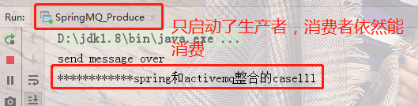
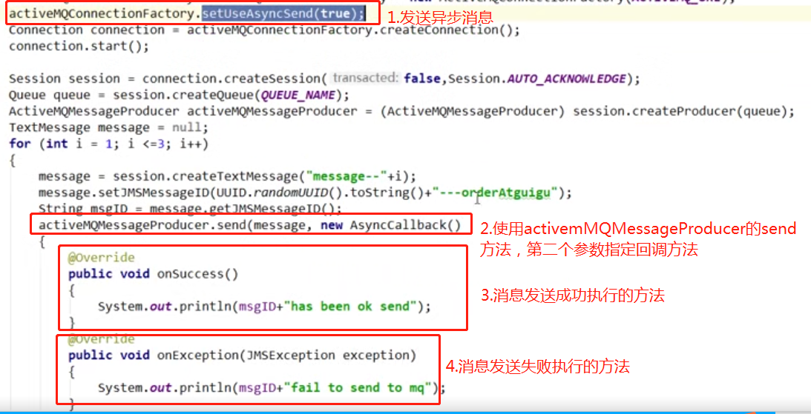
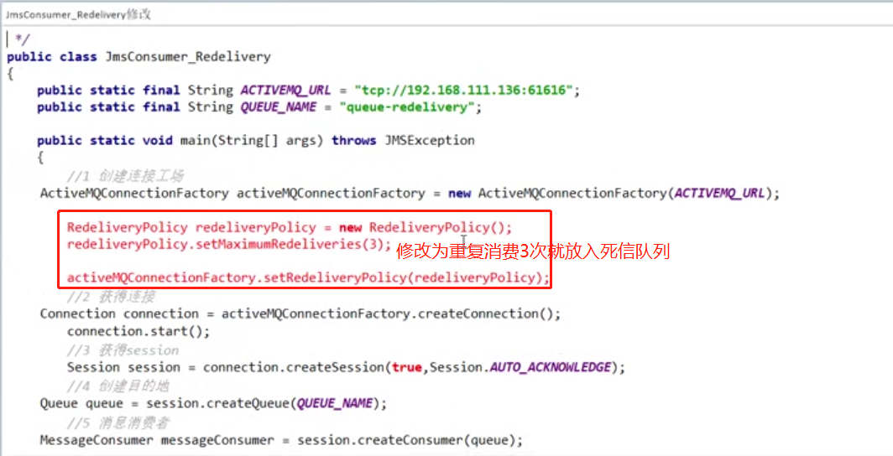
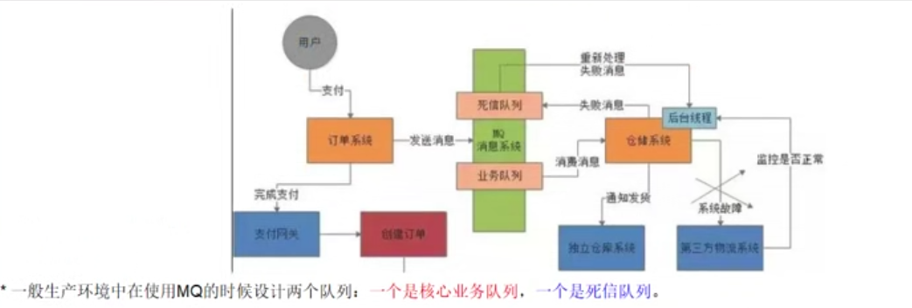

### 一、入门概述

#### 1.1前言

**问题**

```java
1.在何种场景下使用消息中间件？
2.为什么要在系统里引入消息中间件？
```

**上述问题引出产生背景**

```java
1.系统之间/*直接调用*/实际工程落地和存在的问题
	微服务架构后，链式调用是我们在写程序时候的一般流程，为了完成一个整体功能会将其拆分成多个函数（或子模块），比如模块A调用模块B，模块B调用模块C，模块C调用模块D。但是在大型分布式应用中，系统间的RPC交互繁杂，一个功能背后调用上百个接口并非不可能，从单机架构过渡分布式微服务架构的通例，这种架构会有哪些问题？
	1）系统之间接口耦合比较严重
	2）面对大流量并发时，容易被冲垮
	3）等待同步存在性能问题
	上述三个问题例子如下图：
2.上述三个问题需要从如下三方面解决：
	1）要做到系统解耦，当新的模块接进来时，可以做到代码改动最小： 能够解耦
	2）设置流量缓冲池，可以让后端系统按照自身吞吐能力进行消费，不被冲垮： 能够削峰
	3）强弱依赖梳理能将非关键调用链路的操作异步化并提升整体系统的吞吐能力： 能够异步
```

1）系统间接口耦合例子


2）大流量并发例子


3）等待同步出现性能问题例子


#### 1.2是什么？

```java
1.定义：
	面向消息中间件（message-oriented middleware）MOM能够很好的解决以上问题。
	是指利用高效可靠的消息传递机制进行与平台无关的数据交流，并基于数据通信来进行分布式系统的集成。
	通过提供消息传递和消息排队模型在分布式环境下提供应用解耦、弹性伸缩、冗余存储、流量削峰、异步通信、数据同步等功能。
	大致过程是这样的： 发送者把消息发送给消息服务器，消息服务器将消息存放在若干队列/主题中，在合适的时候，消息服务器会将消息转发给接受者。  着这个过程中，发送和接收是异步的，也就是发送无需等待，而且发送者和接收者的声明周期没有必然联系；  尤其在发布/订阅模式下，也可以完成一对多的通信，即让一个消息有多个接收者。
2.特点：
	1）采用异步处理模式
		消息发送者可以发送一个消息而无需等待响应。消息发送者将消息发送到一条虚拟的通道（主题或队列）上；
		消息接收者则订阅或监听该通道。一条信息可能最终转发给一个或多个消息接收者，这些接收者都无需对消息发送者做出同步回应。整个过程都是异步的。
	2）应用系统之间解耦合
		发送者和接收者不必了解对方，只需要确认消息；
		发送者和接收者不必同时在线；
```

应用案例


#### 1.3能干嘛？

- 解耦
- 削峰
- 异步

#### 1.4怎么玩？

```java
1.最主要的功能：
	实现高可用、高性能、可伸缩、易用、和安全的企业级面向消息服务的系统。
2.异步消息的消费和处理
3.控制消息的消费顺序
4.可以和spring/springboot整合简化编码
5.配置集群容错的MQ集群
```

### 二、ActiveMQ安装和控制台

#### 2.1安装步骤

```java
1.官网下载： apache-activemq-5.15.9-bin.tar.gz
2.放在linux上 /opt 目录下 （注：linux上/opt 目录一般方第三方软件）
3.解压缩： tar -zxvf apache-activemq-5.15.9-bin.tar.gz
4.在根目录下 mkdir /myactiveMQ
5.将解压文件复制到/myaciveMQ :  mv -r apache-activemq-5.15.9 /myactiveMQ
6.普通启动：进入/myactiveMQ/bin 目录下执行  ./activemq start
	activemq的默认进程端口是61616
7.重启： ./activemq restart
8.关闭： ./activemq stop
9.带日志的启动方式 ：./activemq start > /myactiveMQ/run_activemq.log
	将启动时将日志写入/myactiveMQ/run_activemq.log文件
```

**复习：查看服务是否启动**

1. ps -ef | grep activemq


2. netstat -anp|grep 61616 (查看61616端口占用情况)

   如图所示，61616被进程号为6826的java程序占用


3. losf -i:61616 (查看61616端口占用情况)


#### 2.2Apache ActiveMQ控制台

```java
1.浏览器访问：http://ip:8161/admin/
	默认的用户名密码是  admin/admin
//说明：
	61616端口提供JMS服务
	8161端口提供管理控制台服务
```


### 三、Java编码实现ActiveMQ通讯

#### 3.1IDEA建maven工程


#### 3.2pom.xml引入所需依赖包

```xml
<?xml version="1.0" encoding="UTF-8"?>
<project xmlns="http://maven.apache.org/POM/4.0.0"
         xmlns:xsi="http://www.w3.org/2001/XMLSchema-instance"
         xsi:schemaLocation="http://maven.apache.org/POM/4.0.0 http://maven.apache.org/xsd/maven-4.0.0.xsd">
    <modelVersion>4.0.0</modelVersion>

    <groupId>com.fy</groupId>
    <artifactId>activemqDemo</artifactId>
    <version>1.0-SNAPSHOT</version>

    <properties>
        <project.build.sourceEncoding>UTF-8</project.build.sourceEncoding>
        <maven.compiler.source>1.8</maven.compiler.source>
        <maven.compiler.target>1.8</maven.compiler.target>
    </properties>

    <dependencies>
        <!--activemq所需jar包配置-->
        <dependency>
            <groupId>org.apache.activemq</groupId>
            <artifactId>activemq-all</artifactId>
            <version>5.15.9</version>
        </dependency>
        <dependency>
            <groupId>org.apache.xbean</groupId>
            <artifactId>xbean-spring</artifactId>
            <version>3.16</version>
        </dependency>
        <!--以下是Junit/log4j等基础通用配置-->
        <dependency>
            <groupId>org.slf4j</groupId>
            <artifactId>slf4j-api</artifactId>
            <version>1.7.25</version>
        </dependency>
        <dependency>
            <groupId>ch.qos.logback</groupId>
            <artifactId>logback-classic</artifactId>
            <version>1.2.3</version>
            <scope>test</scope>
        </dependency>
        <dependency>
            <groupId>org.projectlombok</groupId>
            <artifactId>lombok</artifactId>
            <version>1.16.18</version>
            <scope>provided</scope>
        </dependency>
        <dependency>
            <groupId>junit</groupId>
            <artifactId>junit</artifactId>
            <version>4.12</version>
            <scope>test</scope>
        </dependency>
    </dependencies>

</project>
```


#### 3.3JMS编码总体架构


**回忆JDBC操作数据库，与mq对比**


#### 3.4粗说目的地Destination(队列queen和主题topic)

1. 两大模式特性


#### 3.5消息队列（queue）

##### 3.5.1消息生产者编码（发送至queue）

```java
public class JmsProduce {
    //消息队列URL
    public static final String ACTIVEMQ_URL = "tcp://192.168.1.102:61616";
    //队列名称
    public static final String QUEUE_NAME = "queue01";

    public static void main(String[] args) throws JMSException {
        //1.创建连接工厂，按照给定的URL地址，采用默认的用户名和密码
        ActiveMQConnectionFactory activeMQConnectionFactory = new ActiveMQConnectionFactory(ACTIVEMQ_URL);
        //2.通过连接工厂获得连接对象，并启动
        Connection connection = activeMQConnectionFactory.createConnection();
        connection.start();
        //3.创建会话session
        //两个参数，第一个是事务/第二个是签收
        Session session = connection.createSession(false, Session.AUTO_ACKNOWLEDGE);
        //4.创建目的地，具体是队列还是主题
        Queue queue = session.createQueue(QUEUE_NAME);
        //5.创建消息的生产者(将目的地作为参数传入)
        MessageProducer producer = session.createProducer(queue);
        //6.通过producer生产3条消息发送到MQ队列里
        for (int i = 1; i <= 3; i++) {
            //7.创建消息
            TextMessage textMessage = session.createTextMessage("MSG---" + i);
            //8.通过producer发送消息
            producer.send(textMessage);
        }

        //9.释放资源
        producer.close();
        session.close();
        connection.close();
        System.out.println("************消息发送完成！");
    }
}
```

**访问控制台**


##### 3.5.2消息消费者编码（从queue中取）

###### 3.5.2.1receive()方法取

```java
public class JmsConsumer {
    //消息队列URL
    public static final String ACTIVEMQ_URL = "tcp://192.168.1.102:61616";
    //队列名称
    public static final String QUEUE_NAME = "queue01";

    public static void main(String[] args) throws JMSException {
        //1.创建连接工厂，按照给定的URL地址，采用默认的用户名和密码
        ActiveMQConnectionFactory activeMQConnectionFactory = new ActiveMQConnectionFactory(ACTIVEMQ_URL);
        //2.通过连接工厂获得连接对象，并启动
        Connection connection = activeMQConnectionFactory.createConnection();
        connection.start();
        //3.创建会话session
        //两个参数，第一个是事务/第二个是签收
        Session session = connection.createSession(false, Session.AUTO_ACKNOWLEDGE);
        //4.创建目的地，具体是队列还是主题
        Queue queue = session.createQueue(QUEUE_NAME);
        //5.创建消费者，将目的地作为参数传入
        MessageConsumer consumer = session.createConsumer(queue);
        //6.消费者接受消息
        while (true) {
            TextMessage message = (TextMessage)consumer.receive();
            if (message != null) {
                System.out.println("消费者接收到的消息***" + message.getText());
            } else{
                break;
            }
        }

        consumer.close();
        session.close();
        connection.close();
    }
}

 //注意：receive(long timeout);表示过timeout时间后没有接受到消息就会关闭
            //而receive()会一直等待
```

**访问控制台**


###### 3.5.2.2setMessageListner()监听方式消费

```java
public class JmsConsumer2 {
    //消息队列URL
    public static final String ACTIVEMQ_URL = "tcp://192.168.1.102:61616";
    //队列名称
    public static final String QUEUE_NAME = "queue01";

    public static void main(String[] args) throws JMSException, IOException {
        //1.创建连接工厂，按照给定的URL地址，采用默认的用户名和密码
        ActiveMQConnectionFactory activeMQConnectionFactory = new ActiveMQConnectionFactory(ACTIVEMQ_URL);
        //2.通过连接工厂获得连接对象，并启动
        Connection connection = activeMQConnectionFactory.createConnection();
        connection.start();
        //3.创建会话session
        //两个参数，第一个是事务/第二个是签收
        Session session = connection.createSession(false, Session.AUTO_ACKNOWLEDGE);
        //4.创建目的地，具体是队列还是主题
        Queue queue = session.createQueue(QUEUE_NAME);
        //5.创建消费者，将目的地作为参数传入
        MessageConsumer consumer = session.createConsumer(queue);
        //6.消费者接受消息（监听的方式）
        consumer.setMessageListener((msg) -> {
            if (null != msg && msg instanceof TextMessage) {
                TextMessage textMessage = (TextMessage) msg;
                try {
                    System.out.println("消费者接收到的消息***" + textMessage.getText());
                } catch (JMSException e) {
                    e.printStackTrace();
                }
            }
        });
        System.in.read(); //保证控制台不关闭，才能完成监听。连接activemq异步并且耗时，可能还没有连接成功，控制台已经关闭

        consumer.close();
        session.close();
        connection.close();
    }
}

//注意：监听的方式，只要有消息入队，就可以立刻进行消费
```

##### 3.5.3消费者3大消费情况

```java
1.先生产，只启动1号消费者。   问：1号消费者能消费消息吗？
	答：Y
2.先生产， 先启动1号消费者，再启动2号消费者。 问：2号消费者还能消费消息吗？
	答：1号启动时将消息消费完了，   2号没有消息可供消费
3.先启动2个消费者，再生产6条消息。  问：情况如何？
	答：1号消费者和2号消费者平均分配消息。（类似于负载均衡的轮询）
```

##### 3.5.4队列案列小总结

**JMS开发的基本步骤**


**两种消费方式**


```java
//在点对点的消息传递中，目的地被称为队列（queue）
点对点小时传递的特点如下：
1）每个消息只能有一个消费者，类似1对1关系。
2）消息的生产者和消费者之间没有时间上的相关性。无论消费者在生产者发消息的时候是否处于运行状态，消费者都可以提取消息。
3）消息被消费后队列中不会再储存，所以消费者不会消费到已经被消费掉的消息。
```

#### 3.6消息主题（topic）

```java
发布/订阅消息传递域的特点如下：
1）生产者将消息发布到topic中，每个消息可以有多个消费者，属于1：N关系；
2）生产者和消费者有时间上的相关性。订阅某一个主题的消费者只能消费自它订阅之后发布的消息。
3）生产者生产时，topic不保存消息它是无状态的不落地，假如无人订阅就去生产，那就是一条废消息，所以一般先启动消费者再启动生产者。

JMS规范允许客户创建持久订阅，这在一定程度上放松了时间上的相关性要求。持久订阅允许消费者消费它在未处于激活状态时发送的消息。  类似我们微信公众号订阅。
```


##### 3.6.1消息主题生产者

```java
//只需要将上述消息队列生产者，消息目的地改为topic即可，和创建目的地为topic即可session.createTopic(String topicName);    代码如下：

public class JmsProduce_topic {
    //消息中间件URL
    public static final String ACTIVEMQ_URL = "tcp://192.168.1.102:61616";
    //主题名称
    public static final String TOPIC_NAME = "topic01";

    public static void main(String[] args) throws JMSException {
        //1.创建连接工厂，按照给定的URL地址，采用默认的用户名和密码
        ActiveMQConnectionFactory activeMQConnectionFactory = new ActiveMQConnectionFactory(ACTIVEMQ_URL);
        //2.通过连接工厂获得连接对象，并启动
        Connection connection = activeMQConnectionFactory.createConnection();
        connection.start();
        //3.创建会话session
        //两个参数，第一个是事务/第二个是签收
        Session session = connection.createSession(false, Session.AUTO_ACKNOWLEDGE);
        //4.创建目的地，具体是队列还是主题
        Topic topic = session.createTopic(TOPIC_NAME);
        //5.创建消息的生产者(将目的地作为参数传入)
        MessageProducer producer = session.createProducer(topic);
        //6.通过producer生产3条消息发送到MQ队列里
        for (int i = 1; i <= 3; i++) {
            //7.创建消息
            TextMessage textMessage = session.createTextMessage("MSG---" + i);
            //8.通过producer发送消息
            producer.send(textMessage);
        }

        //9.释放资源
        producer.close();
        session.close();
        connection.close();
        System.out.println("************消息发送完成！");
    }
}
```

##### 3.6.2消息主题消费者

```java
//只需要将上述消息队列消费者的消息目的地改为topic即可（采用消息监听模式），代码如下

public class JmsConsumer_topic {
    //消息中间件URL
    public static final String ACTIVEMQ_URL = "tcp://192.168.1.102:61616";
    //主题名称
    public static final String TOPIC_NAME = "topic01";

    public static void main(String[] args) throws JMSException, IOException {
        //1.创建连接工厂，按照给定的URL地址，采用默认的用户名和密码
        ActiveMQConnectionFactory activeMQConnectionFactory = new ActiveMQConnectionFactory(ACTIVEMQ_URL);
        //2.通过连接工厂获得连接对象，并启动
        Connection connection = activeMQConnectionFactory.createConnection();
        connection.start();
        //3.创建会话session
        //两个参数，第一个是事务/第二个是签收
        Session session = connection.createSession(false, Session.AUTO_ACKNOWLEDGE);
        //4.创建目的地，具体是队列还是主题
        Topic topic = session.createTopic(TOPIC_NAME);
        //5.创建消费者，将目的地作为参数传入
        MessageConsumer consumer = session.createConsumer(topic);
        //6.消费者接受消息
        consumer.setMessageListener((msg) -> {
            if (null != msg && msg instanceof TextMessage) {
                TextMessage textMessage = (TextMessage) msg;
                try {
                    System.out.println("消费者接收到的消息***" + textMessage.getText());
                } catch (JMSException e) {
                    e.printStackTrace();
                }
            }
        });
        System.in.read(); //保证控制台不关闭，才能完成监听。连接activemq异步并且耗时，可能还没有连接成功，控制台已经关闭

        consumer.close();
        session.close();
        connection.close();
    }
}

```

*注意：先启动消费者，再启动生产者*

##### 3.6.3控制台

分别启动三个消费者和一个生产者，控制台如下：


#### 3.7topic和queue的对比总结

| 比较项目       | topic模式队列                                                | queue模式队列                                                |
| -------------- | ------------------------------------------------------------ | ------------------------------------------------------------ |
| **工作模式**   | “发布-订阅”模式，如果当前没有订阅者，消息将会被丢弃。如果有多个订阅者，那么这些订阅者都会收到消息 | “负载均衡”模式，如果当前没有消费者，消息也不会丢弃；如果有多个消费者，那么一条消息也只会发送给其中一个消费者，并且要求消费者ack信息 |
| **有无状态**   | 无状态                                                       | queue数据默认会在mq服务器上以文件形式保存，比如ActiveMQ一般保存在$AMQ_HOME\data\kr-store\data下面，也可以配置成DB存储 |
| **传递完整性** | 如果没有订阅者，消息会被丢弃                                 | 消息不会丢弃                                                 |
| **处理效率**   | 由于消息要按照订阅者的数量进行复制，所以处理性能会随着订阅者的增加而明显降低，并且还要结合不同消息协议自身的性能差异 | 由于一条消息只发送给一个消费者，所以就算消费者再多，性能也不会有明显下降。当然不同消息协议的具体性能也是有差异的 |

### 四、JMS规范和落地产品

#### 4.1JMS（java message service）是什么

```java
什么是java消息服务？
java消息服务指的是两个应用程序之间进行异步通信的API，它为标准消息协议和消息服务提供了一组通用接口，包括创建、发送、读取消息等，用于支持java应用程序开发。在javaEE中，当两个应用程序使用JMS通信时，他们之间并不是直接相连的，而是通过一个共同的消息收发服务组件关联起来以达到解耦、异步、削峰的效果。
```


#### 4.2MQ中间件的落地产品对比

| 特性              | ActiveMQ       | RabbitMQ   | Kafka            | RocketMQ       |
| ----------------- | -------------- | ---------- | ---------------- | -------------- |
| PRODUCE-CONSUMER  | 支持           | 支持       | 支持             | 支持           |
| PUBLISH-SUBSCRIBE | 支持           | 支持       | 支持             | 支持           |
| REQUEST-REPLY     | 支持           | 支持       | -                | 支持           |
| API完备性         | 高             | 高         | 高               | 低（静态配置） |
| 多语言支持        | 支持，java优先 | 语言无关   | 支持，java优先   | 支持           |
| 单机吞吐量        | 万级           | 万级       | 十万级           | 万级           |
| 消息延迟          | -              | 微秒级     | 毫秒级           | -              |
| 可用性            | 高（主从）     | 高（主从） | 非常高（分布式） | 高             |
| 消息丢失          | -              | 低         | 理论上不会丢失   | -              |
| 消息重复          | -              | 可控制     | 理论上会有重复   | -              |
| 文档的完备性      | 高             | 高         | 高               | 中             |
| 提供快速入门      | 有             | 有         | 有               | 无             |
| 首次部署难度      | -              | 低         | 中               | 高             |

#### 4.3JMS组成结构和特点

```java 
jms组成结构和特点：
1）JMS provider：实现JMS接口和规范的消息中间件，也就是我们MQ服务器；
2）JMS produce：消息生产者，创建和发送JMS消息的客户端应用；
3）JMS consumer:消息消费者，接收和处理JMS消息的客户端应用；
4）JMS message：包括消息头、消息属性、消息体。  具体特点如下：
```

##### 4.3.1JMS消息头

```java
1）JMSDestination:消息发送的目的地，主要指Queue和Topic
	//textMessage.setJMSDestination(Destination destination)
2)JMSDeliveryMode:
	持久和非持久模式：
	一条持久的消息：应该被传送“一次仅仅一次”，这就意味着如果JMS提供者出现故障，该消息并不会丢失，它会在服务器恢复之后再次传递。
	一条非持久的消息：最多会传送一次，这意味这台服务器出现故障，该消息将永久丢失。
	//textMessage.setJMSDeliveryMode(DeliveryMode.NON_PERSISTENT|Delivery.PERSISTENT)
3)JMSExpiration:
	可以设置消息在一定时间后过期，默认是永不过期；
	消息过期时间，等于Destination的send方法中timeToLive值加上发送时刻的GMT时间值；
	如果timeToLive值等于零，则JMSExpiration被设为零，表示该消息永不过期；
	如果发送后，在消息过期时间后消息还没有发送到目的地，则该消息被清除；
4）JMSPriority:
	消息优先级，从0-9是个级别，0到4是普通消息，5-9是加急消息。
	JMS不要求MQ严格按照这十个优先级发送消息，但必须保证加急消息先于普通消息到达。默认4级。
5）JMSMessageID:
	唯一识别每个消息的标识由MQ产生。   也可通过textMessage.setJMSMessageID(Stiring id)手动赋值。
//注意以上消息头也可以直接通过textMessage.send()重载方式一次性设置，重载方法如下：
```


##### 4.3.2JMS的消息体

```java
5种消息体格式：
1）TextMessage:普通字符串消息，包含一个String。
2）MapMessage:一个map类型的消息，key为String类型，而value为java的基本类型；
3）BytesMessage:二进制数组消息，包含一个byte[]
4)StreamMessage:java数据流消息，用标准流操作来顺序的填充和读取。
5）ObjectMessage：对象消息，包含一个可序列化的java对象。
//基本上最常用的是前两种，如果要发送java对象 可以将java对象转为一个json串用1）或2）发送。

要求：发送和接收的消息体leixing必须一致对应。
//注意通过session.Create...Message()来创建
```

示例：

发送

接收

##### 4.3.3JMS消息属性

```java
1.是什么？
	他们是以属性名和属性值对的形式制定的。可以将属性是为消息头的扩展，属性指定消息头没有包括的附加信息，比如可以在属性里指定消息选择器。
	消息的属性就像可以分配给一条消息的附加消息头一样。他们允许开发者添加有关消息的不透明附加信息。
	他们还用于暴露消息选择器在消息过滤时使用的数据。
	
示例：
TextMessage message = session.createTextMessage();
message.setText(text);
message.setStringProperty("username","z3"); //自定义属性
//消费者可以通过getStringProperty("username")来或者属性值
//另外，还有setBooleanProperty(String k, Boolean v),setIntProperty(String k, int v)等方法
```

#### 4.4JMS的可靠性

##### 4.4.1PERSISTENT:持久化

```java
1.参数设置说明：
	1）非持久化：messageProducer.setDeliveryMode(DeliveryMode.NON_PERSISTENT);
			   //当服务器宕机，消息不存在
	2）持久化：messageProducer.setDeliveryMode(DeliveryMode.PERSISTENT);
			 //当服务器宕机，消息依然存在
2.队列的默认持久化策略是持久化消息！！！
```

3. 持久的Topic

因为，topic模式，是先启动消费者一直监听，再启动生产者推送消息，消费者才能消费到消息。如果先启动生产者推消息再启动消费者消费，则在消费者启动之前的消息是消费不了的。   因此持久化的Topic需要将代码做以下修改：

- 生产者

```java
public class JmsProduce_topic_persistent {
    //消息队列URL
    public static final String ACTIVEMQ_URL = "tcp://192.168.1.102:61616";
    //队列名称
    public static final String TOPIC_NAME = "topic_persistent";

    public static void main(String[] args) throws JMSException {
        //1.创建连接工厂，按照给定的URL地址，采用默认的用户名和密码
        ActiveMQConnectionFactory activeMQConnectionFactory = new ActiveMQConnectionFactory(ACTIVEMQ_URL);
        //2.通过连接工厂获得连接对象，并启动
        Connection connection = activeMQConnectionFactory.createConnection();
        //3.创建会话session
        //两个参数，第一个是事务/第二个是签收
        Session session = connection.createSession(false, Session.AUTO_ACKNOWLEDGE);
        //4.创建目的地，具体是队列还是主题
        Topic topic = session.createTopic(TOPIC_NAME);
        //5.创建消息的生产者(将目的地作为参数传入)
        MessageProducer producer = session.createProducer(topic);
        //**persistent**设置持久化
        producer.setDeliveryMode(DeliveryMode.PERSISTENT);
        connection.start();
        //6.通过producer生产3条消息发送到MQ队列里
        for (int i = 1; i <= 3; i++) {
            //7.创建消息
            TextMessage textMessage = session.createTextMessage("MSG---" + i);
            //8.通过producer发送消息
            producer.send(textMessage);
        }

        //9.释放资源
        producer.close();
        session.close();
        connection.close();
        System.out.println("************消息发送完成！");
    }
}
```

- 消费者

```java
public class JmsConsumer_topic_persisten {
    //消息中间件URL
    public static final String ACTIVEMQ_URL = "tcp://192.168.1.102:61616";
    //主题名称
    public static final String TOPIC_NAME = "topic_persistent";

    public static void main(String[] args) throws JMSException, IOException {
        System.out.println("我是1号消费者");

        //1.创建连接工厂，按照给定的URL地址，采用默认的用户名和密码
        ActiveMQConnectionFactory activeMQConnectionFactory = new ActiveMQConnectionFactory(ACTIVEMQ_URL);
        //2.通过连接工厂获得连接对象，并启动
        Connection connection = activeMQConnectionFactory.createConnection();
        //**persisten**设置订阅id
        connection.setClientID("z3");
        //3.创建会话session
        //两个参数，第一个是事务/第二个是签收
        Session session = connection.createSession(false, Session.AUTO_ACKNOWLEDGE);
        //4.创建目的地，具体是队列还是主题
        Topic topic = session.createTopic(TOPIC_NAME);
        //**persistent**设置持久订阅
        TopicSubscriber topicSubscriber =  session.createDurableSubscriber(topic, "remark...");
        connection.start();

        Message message = topicSubscriber.receive();
        while (null != message) {
            TextMessage textMessage = (TextMessage) message;
            System.out.println("收到的持久化topic消息：" + textMessage.getText());
            topicSubscriber.receive();
        }
        session.close();
        connection.close();
    }
}

/*
注意：1.一定要先运行一次消费者，等于向MQ注册，类似于我们订阅了这个主题
	2.然后再运行生产者发送消息，此时
	3.无论消费者是否在线，都会接收到。  不在线的话，下次连接的时候，会把没有收到的消息都接收下来。
*/
```

- 控制台


##### 4.4.2transaction:事务

**事务偏生产者/签收偏消费者**

```java
//producer提交时的事务
Session session = connection.createSession(事务，签收);
事务开启true,关闭false;说明如下：
1.false：只要执行send,就进入到队列中。
		关闭事务，那第二个签收参数的设置需要有效。
2.true：先执行send再执行commit，消息才被真正的提交到队列中。
		消息需要批量发送，需要缓冲区处理。
	//代码示例：
		connection.createSession(true, Session.AUTO_ACKNOWLEDGE);
		...
            try{
                producer.send(textMessage);
                session.commit();
            }catch(Exception e){
                e.printStackTrace();
                session.rollback();//回滚
            }finally{
                if(null != session){
                    session.close();
                }
            }

//消费者事务介绍
如果在消费者中开启事务不手动commit的话，消息会被重复消费。  手动commit即可解决。
如果没有commit引起消息重发，可参考10.3解决
```

##### 4.4.3ACKNOWLEDGE:签收

```java
//通过connection.createSession(true, Session.AUTO_ACKNOWLEDGE);第二个参数进行设置
1.非事务状态下的签收
	1）自动签收（默认）
		Session.AUTO_ACKNOWLEDGE
    2）手动签收
        Session.CLIENT_ACKNOWLEDGE
        客户端调用acknowledge方法手动签收：message.acknowledge();
        //说明：如果不进行手动签收的话，消息会认为没有被签收，因此消息出队0，会导致重复消费。
    3）允许重复消息（了解）
        Session.DUPS_OK_ACKNOWLEDGE
        
2.事务状态下的签收
	当消费者开启事务后并提交事务时，则消息会被自动签收。
	如代码：connection.createSession(true, Session.CLIENT_ACKNOWLEDGE);即使不使用手动签收message.acknowledge();消息也会被自动签收。
	
3.签收和事务的关系(重要结论)：
	1）在事务性会话中，当一个事务被成功提交则消息被自动签收。如果事务回滚，则消息会被再次传送。
	2）非事务性会话中，消息何时被确认取决于创建会话时的应答模式（acknowledge mode）
```

#### 4.5点对点和发布订阅总结

```java
1.JMS的点对点总结：
	点对点模型是基于队列的，生产者发消息到队列，消费者从队列接收消息，队列的存在使得消息的异步传输成为可能。
	1）如果在session关闭时有部分消息已被收到但还没有被签收（acknowledged），那当消费者下次连接到相同队列时，这些消息还会被再次接收。
	2）队列可以长久的保存消息知道消费者收到消息。消费者不需要因为担心消息会丢失而时刻和队列保持激活的连接状态，充分体现了异步传输模式的优势。
	
2.JMS的发布订阅总结：
	JMS	Pub/Sub模型定义了如何向一个内容节点发布和订阅消息，这些节点被称为topic。
	主题可以被认为是消息的传输中介，发布者（publisher）发布消息到主题，订阅者（subscribe）从主题订阅消息。
	主题使得消息订阅者和消息发布者保持相互独立，不需要接触即可保证消息的传送。
	1）非持久订阅：非持久订阅只有当客户端处于激活状态，也就是和MQ保持连接状态才能接收发送到某个主题的消息。如果消费者处于离线状态，生产者发送的主题消息将被丢失作废，消费者永远不会收到。
		一句话：先要订阅注册才能接收到发布，只给订阅者发布消息。
	2）持久订阅：客户端首先向MQ注册一个自己的身份ID识别号，当这个客户端处于离线时，生产者会为这个ID保存所有发送到主题的消息，当客户端再次连接时会根据消费者的ID得到所有当自己处于离线时发送到主题的消息。
		
	非持久状态订阅不能恢复或重新派送一个未签收的消息。
	持久订阅才能恢复或重新派送一个未签收的消息。
	
	//用哪一个呢？
	当所有的消息必须被接收，则用持久订阅。
	当丢失消息能够被容忍，则用非持久订阅。
```

### 五、ActiveMQ的Broker

#### 5.1使用指定的配置文件启动activemq

```java 
1.是什么？
	相当于一个ActiveMQ服务器实例
	说白了，Broker其实就是实现了用代码形式启动ActiveMQ将MQ嵌入到java代码中，以随时用随时启动，在用的时候再去启动这样能节省了资源，也保证了可靠性。
2.类似于启动redis时指定redis.conf进行启动，ActiveMQ启动时也可以指定使用指定的配置文件进行启动activemq.xml,具体如下图：//指定使用activemq02.xml
```


#### 5.2嵌入式Broker

```java 
3.嵌入式Broker
	用ActiveMQ Broker作为独立消息服务器来构建java应用。
	ActiveMQ也支持在jvm中通信基于嵌入式的broker，能够无缝的集成其他java应用。
	
	代码实现：
	1）引入pom依赖，否则会报错//Caused by: java.lang.ClassNotFoundException: com.fasterxml.jackson.databind.ObjectMapper
	<dependency>
            <groupId>com.fasterxml.jackson.core</groupId>
            <artifactId>jackson-databind</artifactId>
            <version>2.9.5</version>
        </dependency>
     2）创建broker实例
     	public class ActiveMQBroker {
            public static void main(String[] args) throws Exception {
                BrokerService brokerService = new BrokerService();
                brokerService.setUseJmx(true);
                //此处连接本机的61616端口，就会生成一个小型的activemq实例
                brokerService.addConnector("tcp://localhost:61616");
                brokerService.start();
            }
        }
        //启动，效果如下：
```


此时生产者和消费者连接tcp://localhost:61616，即可连接此broker实例：


### 六、spring整合ActiveMQ

#### 6.1maven修改

```xml
		<!-- acivemq所需要的jar包 -->
        <dependency>
            <groupId>org.apache.activemq</groupId>
            <artifactId>activemq-all</artifactId>
            <version>5.15.9</version>
        </dependency>
        <dependency>
            <groupId>org.apache.xbean</groupId>
            <artifactId>xbean-spring</artifactId>
            <version>3.16</version>
        </dependency>
        <dependency>
            <groupId>com.fasterxml.jackson.core</groupId>
            <artifactId>jackson-databind</artifactId>
            <version>2.9.5</version>
        </dependency>
        <!-- 整合spring和jms -->
        <dependency>
            <groupId>org.springframework</groupId>
            <artifactId>spring-jms</artifactId>
            <version>4.3.23.RELEASE</version>
        </dependency>
        <!-- acivemq所需要的pool包配置 -->
        <dependency>
            <groupId>org.apache.activemq</groupId>
            <artifactId>activemq-pool</artifactId>
            <version>5.15.9</version>
        </dependency>
```

#### 6.2spring配置文件applicationContext.xml

```xml
<?xml version="1.0" encoding="UTF-8"?>
<beans xmlns="http://www.springframework.org/schema/beans"
       xmlns:xsi="http://www.w3.org/2001/XMLSchema-instance"
       xmlns:p="http://www.springframework.org/schema/p"
       xmlns:tx="http://www.springframework.org/schema/tx"
       xmlns:aop="http://www.springframework.org/schema/aop"
       xmlns:context="http://www.springframework.org/schema/context"
       xsi:schemaLocation="http://www.springframework.org/schema/beans
http://www.springframework.org/schema/beans/spring-beans.xsd
http://www.springframework.org/schema/context
http://www.springframework.org/schema/context/spring-context.xsd
http://www.springframework.org/schema/tx
http://www.springframework.org/schema/tx/spring-tx.xsd
http://www.springframework.org/schema/aop
http://www.springframework.org/schema/aop/spring-aop.xsd" >

    <!-- 开启包的自动扫描 -->
    <context:component-scan base-package="com.fy.activemq"/>

    <!--配置生产者-->
    <bean id="jmsFactory" class="org.apache.activemq.jms.pool.PooledConnectionFactory" destroy-method="stop">
        <property name="connectionFactory">
            <!--真正可以生产connection的connectionFacotry,相对应的JMS服务厂商提供-->
            <bean class="org.apache.activemq.ActiveMQConnectionFactory">
                <property name="brokerURL" value="tcp://192.168.1.102:61616"/>
            </bean>
        </property>
        <property name="maxConnections" value="100"></property>
    </bean>

    <!--这个是队列目的地，点对点的-->
    <bean id="destinationQueue" class="org.apache.activemq.command.ActiveMQQueue">
        <constructor-arg index="0" value="spring-active-queue" />
    </bean>

    <!--srping提供的JMS工具类，它可以进行消息的发送、接收等-->
    <bean id="jmsTemplate" class="org.springframework.jms.core.JmsTemplate">
        <property name="connectionFactory" ref="jmsFactory" />
        <property name="defaultDestination" ref="destinationQueue"/>
        <property name="messageConverter">
            <bean class="org.springframework.jms.support.converter.SimpleMessageConverter"/>
        </property>
    </bean>
</beans>
```

#### 6.3队列代码示例

##### 6.3.1**生产者**

```java
@Service
public class SpringMQ_Produce {
    @Autowired
    private JmsTemplate jmsTemplate;

    public static void main(String[] args) {
        ClassPathXmlApplicationContext ctx = new ClassPathXmlApplicationContext("applicationContext.xml");
        SpringMQ_Produce produce = (SpringMQ_Produce) ctx.getBean("springMQ_Produce");
        produce.jmsTemplate.send(session -> session.createTextMessage("************spring和activemq整合的case111"));
        System.out.println("send message over");
    }
}
```

**启动后控制台**


##### 6.3.2消费者

```java
@Service
public class SpringMQ_Consumer {
    @Autowired
    private JmsTemplate jmsTemplate;
    public static void main(String[] args) {
        ClassPathXmlApplicationContext ctx = new ClassPathXmlApplicationContext("applicationContext.xml");
        SpringMQ_Consumer consumer = (SpringMQ_Consumer) ctx.getBean("springMQ_Consumer");
        String retValue = (String) consumer.jmsTemplate.receiveAndConvert();
        System.out.println("消费者接收到的消息：" + retValue);
    }
}

//总结：其实对JMS的操作都是通过JmsTemplate进行操作的。
```

#### 6.4主题代码示例

只需要将上述代码中applicationContext.xml文件中目的地改为topic并注入到jmsTemplate中即可，其他代码不需要改变

```xml
<?xml version="1.0" encoding="UTF-8"?>
<beans xmlns="http://www.springframework.org/schema/beans"
       xmlns:xsi="http://www.w3.org/2001/XMLSchema-instance"
       xmlns:tx="http://www.springframework.org/schema/tx"
       xmlns:aop="http://www.springframework.org/schema/aop"
       xmlns:context="http://www.springframework.org/schema/context"
       xsi:schemaLocation="http://www.springframework.org/schema/beans
http://www.springframework.org/schema/beans/spring-beans.xsd
http://www.springframework.org/schema/context
http://www.springframework.org/schema/context/spring-context.xsd
http://www.springframework.org/schema/tx
http://www.springframework.org/schema/tx/spring-tx.xsd
http://www.springframework.org/schema/aop
http://www.springframework.org/schema/aop/spring-aop.xsd" >

    <!-- 开启包的自动扫描 -->
    <context:component-scan base-package="com.fy.activemq"/>

    <!--配置生产者-->
    <bean id="jmsFactory" class="org.apache.activemq.jms.pool.PooledConnectionFactory" destroy-method="stop">
        <property name="connectionFactory">
            <!--真正可以生产connection的connectionFacotry,相对应的JMS服务厂商提供-->
            <bean class="org.apache.activemq.ActiveMQConnectionFactory">
                <property name="brokerURL" value="tcp://192.168.1.102:61616"/>
            </bean>
        </property>
        <property name="maxConnections" value="100"></property>
    </bean>

    <!--这个是队列目的地，点对点的-->
    <bean id="destinationQueue" class="org.apache.activemq.command.ActiveMQQueue">
        <constructor-arg index="0" value="spring-active-queue" />
    </bean>
    <!--这个是主题目的地-->
    <bean id="destinationTopic" class="org.apache.activemq.command.ActiveMQTopic">
        <constructor-arg index="0" value="spring-active-topic" />
    </bean>

    <!--srping提供的JMS工具类，它可以进行消息的发送、接收等-->
    <bean id="jmsTemplate" class="org.springframework.jms.core.JmsTemplate">
        <property name="connectionFactory" ref="jmsFactory" />
        <property name="defaultDestination" ref="destinationTopic"/>
        <property name="messageConverter">
            <bean class="org.springframework.jms.support.converter.SimpleMessageConverter"/>
        </property>
    </bean>
</beans>

<!--主题的话先启动消费者进行监听，再启动生产者生产-->
```

**控制台**


#### 6.5spring配置消息监听器，实现消费者不启动也能消费消息

步骤一、applicationContext.xml

```xml
<?xml version="1.0" encoding="UTF-8"?>
<beans xmlns="http://www.springframework.org/schema/beans"
       xmlns:xsi="http://www.w3.org/2001/XMLSchema-instance"
       xmlns:tx="http://www.springframework.org/schema/tx"
       xmlns:aop="http://www.springframework.org/schema/aop"
       xmlns:context="http://www.springframework.org/schema/context"
       xsi:schemaLocation="http://www.springframework.org/schema/beans
http://www.springframework.org/schema/beans/spring-beans.xsd
http://www.springframework.org/schema/context
http://www.springframework.org/schema/context/spring-context.xsd
http://www.springframework.org/schema/tx
http://www.springframework.org/schema/tx/spring-tx.xsd
http://www.springframework.org/schema/aop
http://www.springframework.org/schema/aop/spring-aop.xsd" >

    <!-- 开启包的自动扫描 -->
    <context:component-scan base-package="com.fy.activemq"/>

    <!--配置生产者-->
    <bean id="jmsFactory" class="org.apache.activemq.jms.pool.PooledConnectionFactory" destroy-method="stop">
        <property name="connectionFactory">
            <!--真正可以生产connection的connectionFacotry,相对应的JMS服务厂商提供-->
            <bean class="org.apache.activemq.ActiveMQConnectionFactory">
                <property name="brokerURL" value="tcp://192.168.1.102:61616"/>
            </bean>
        </property>
        <property name="maxConnections" value="100"></property>
    </bean>

    <!--这个是队列目的地，点对点的-->
    <bean id="destinationQueue" class="org.apache.activemq.command.ActiveMQQueue">
        <constructor-arg index="0" value="spring-active-queue" />
    </bean>
    <!--这个是主题目的地-->
    <bean id="destinationTopic" class="org.apache.activemq.command.ActiveMQTopic">
        <constructor-arg index="0" value="spring-active-topic" />
    </bean>

    <!--srping提供的JMS工具类，它可以进行消息的发送、接收等-->
    <bean id="jmsTemplate" class="org.springframework.jms.core.JmsTemplate">
        <property name="connectionFactory" ref="jmsFactory" />
        <property name="defaultDestination" ref="destinationTopic"/>
        <property name="messageConverter">
            <bean class="org.springframework.jms.support.converter.SimpleMessageConverter"/>
        </property>
    </bean>

    <!--配置监听程序-->
    <bean id="jmsContainer" class="org.springframework.jms.listener.DefaultMessageListenerContainer">
        <property name="connectionFactory" ref="jmsFactory"/>
        <property name="destination" ref="destinationTopic"/>
        <!--public class MyMessageListener implements MessageListener-->
        <property name="messageListener" ref="myMessageListener"/>
    </bean>
</beans>
```

步骤二、编写自定义监听器，注意类名和xml中配置的监听器属性messageListener中引入的ref名保持一致，且实现MessageListener

```java 
//用@Component注解，使其注入到spring容器中，在xml配置中可以使用ref引入
@Component
public class MyMessageListener implements MessageListener {
    @Override
    public void onMessage(Message message) {
        if (null != message && message instanceof TextMessage) {
            TextMessage textMessage = (TextMessage) message;
            try {
                System.out.println(textMessage.getText());
            } catch (JMSException e) {
                e.printStackTrace();
            }
        }
    }
}
```

步骤三、启动生产者，即可看到消息发送完成后消费者不启动也能进行消费



### 七、springboot整合ActiveMQ

#### 7.1队列生产者

**步骤一、新建maven工程并设置包名工程名**

```java
工程名：boot_mq_produce
包名：com.fy.boot.activemq
//通过idea新建springboot项目，依赖选择的时候，选择Spring Web和Spring for Apache ActiveMQ 5,即可自动依赖所需依赖包
```

**步骤二、pom.xml**

```xml
<!--这一步的依赖通过第一步勾选即可自动生成-->
<!--核心依赖包spring-boot-starter-activemq-->
	   <dependency>
            <groupId>org.springframework.boot</groupId>
            <artifactId>spring-boot-starter-activemq</artifactId>
        </dependency>
        <dependency>
            <groupId>org.springframework.boot</groupId>
            <artifactId>spring-boot-starter-web</artifactId>
        </dependency>
```

**步骤三、application.properties**

```properties
server.port=7777

#activemq的相关配置
spring.activemq.broker-url=tcp://192.168.1.102:61616
spring.activemq.user=admin
spring.activemq.password=admin
#false=queue  true=topic 默认是false
spring.jms.pub-sub-domain=false

#自己定义队列名称
myqueue:boot-activemq-queue
```

**步骤四、配置目的地bean**

```java
/**
 * @description: 配置bean  类似于spring中applicationContext.xml
 **/
@Configuration
@EnableJms //开启JMS
public class ConfigBean {
    @Value("${myqueue}")
    private String myqueue;

    @Bean  //<bean id="" class="">
    public Queue queue() {
        return new ActiveMQQueue(myqueue);
    }
}
```

**步骤五、生产者代码Queue_Produce**

```java 
/**
 * @description: springboot整合activemq之队列生产者
 **/
@Service
public class Queue_Produce {
    @Autowired
    private JmsMessagingTemplate jmsMessagingTemplate;
    @Autowired
    private Queue queue;

    public void produceMsg() {
        jmsMessagingTemplate.convertAndSend(queue, "发送消息：" + UUID.randomUUID().toString().substring(0,8));
        System.out.println("============produceMsg task is over");
    }
}

```

**测试单元**

```java
@SpringBootTest(classes = BootMqProduceApplication.class)
@RunWith(SpringJUnit4ClassRunner.class)
@WebAppConfiguration
class BootMqProduceApplicationTests {

    @Autowired
    private Queue_Produce queue_produce;

    @Test
    void contextLoads() {
        queue_produce.produceMsg();
    }
}

//运行单元测试，即可将消息发送到mq服务器
```

**新增需求，每间隔3秒投递一次消息（用定时任务实现）**

```java
//1.生产者方法
//间隔3秒投递消息
    @Scheduled(fixedDelay = 3000)
    public void produceMsgScheduled() {
        jmsMessagingTemplate.convertAndSend(queue, "scheduled发送消息：" + UUID.randomUUID().toString().substring(0,8));
        System.out.println("============produceMsg task is over");
    }
//2.主启动类添加注解@EnableSchudling开启定时任务
//3.启动主启动类，即可完成间隔三秒投递消息
```

#### 7.2队列消费者

**步骤一、新建maven工程并设置包名类名**

```java
工程名：boot_mq_consumer
包名：com.fy.boot.activemq
//通过idea新建springboot项目，依赖选择的时候，选择Spring Web和Spring for Apache ActiveMQ 5,即可自动依赖所需依赖包
```

**步骤二、pom.xml**

同生产者

**步骤三、application.properties**

同生产者

**步骤四、队列的消费者代码（通过监听方式）**

```java
/*
*在方法上添加@JmsListener注解将自动标识该方法为监听器
*/
@Service
public class Queue_Consumer {
    //通过监听的方式消费消息  使用@JmsListener注解，将会自动生成监听器
    @JmsListener(destination = "${myqueue}")
    public void receive(TextMessage textMessage) throws JMSException {
        System.out.println("**********消费者收到的消息：" + textMessage.getText());
    }
}
```

**步骤五、启动主启动类**


#### 7.3发布订阅（topic生产者）

**步骤一、新建maven并设置包名类名**

```java
工程名：boot_mq_topic_produce
包名：com.fy.boot.activemq.topic.produce
//通过idea新建springboot项目，依赖选择的时候，选择Spring Web和Spring for Apache ActiveMQ 5,即可自动依赖所需依赖包
```

**步骤二、pom.xml**

同上

**步骤三、application.properties**

```properties
server.port=6666

#activemq的相关配置
spring.activemq.broker-url=tcp://192.168.1.102:61616
spring.activemq.user=admin
spring.activemq.password=admin
#false=queue  true=topic 默认是false
spring.jms.pub-sub-domain=true

#自己定义队列名称
mytopic:boot-activemq-topic
```

**步骤四、配置目的地bean**

```java
/**
 * @description: 配置目的地bean，类似spring 中的applicationContext.xml
 **/
@Configuration
public class ConfigBean {

    @Value("${mytopic}")
    private String topicName;

    @Bean
    public Topic topic() {
        return new ActiveMQTopic(topicName);
    }
}
```

**步骤五、Topic_Produce**

```java 
@Service
public class Topic_Produce {
    @Autowired
    private Topic topic;
    @Autowired
    private JmsMessagingTemplate jmsMessagingTemplate;

    @Scheduled(fixedDelay = 3000) //定时每隔3秒钟投递一次消息，注意在主启动类开启定时任务
    public void produceTopic(){
        jmsMessagingTemplate.convertAndSend(topic, "发送主题消息：" + UUID.randomUUID().toString().substring(0, 6));
    }
}
```

#### 7.4发布订阅（topic消费者）

**步骤一、新建maven工程并设置包名类名**

```java
工程名：boot_mq_topic_consumer
包名：com.fy.boot.activemq.topic.consumer
//通过idea新建springboot项目，依赖选择的时候，选择Spring Web和Spring for Apache ActiveMQ 5,即可自动依赖所需依赖包
```

**步骤二、pom.xml**

同上

**步骤三、application.properties**

```properties
server.port=5555
#模拟两个消费者进行订阅
#server.port=5566  

#activemq的相关配置
spring.activemq.broker-url=tcp://192.168.1.102:61616
spring.activemq.user=admin
spring.activemq.password=admin
#false=queue  true=topic 默认是false
spring.jms.pub-sub-domain=true

#自己定义队列名称
mytopic:boot-activemq-topic
```

**步骤四、主题的消费者代码（通过监听方式）**

```java
@Service
public class Topic_Consumer {
    //通过监听的方式消费消息  使用@JmsListener注解，将会自动生成监听器
    @JmsListener(destination = "${mytopic}")
    public void receive(TextMessage textMessage) throws JMSException {
        System.out.println("消费者收到订阅的主题：" + textMessage.getText());
    }
}
```

**步骤五、测试订阅**

```java
1.复制一个主启动类，分别以端口5555和5566启动
```


2. 启动7.3的生产者，可以看到如下正常订阅


### 八、ActiveMQ的传输协议

#### 8.1面试题

```java
1.默认的61616端口如何修改？
2.你生产上的链接协议如何配置的？使用tcp吗？
```

#### 8.2是什么？

```xml
ActiveMQ支持的client-broker通讯协议有：TCP、NIO、UDP、SSL、Http(s)、VM。
其中配置Transport Connector的文件在activemq安装目录的conf/activemq.xml中的<transportConnectors>标签之内。
详见下图：
在下图给出的配置信息中，
    URI描述的头部都是都是采用协议名称，唯独在进行openwire协议描述时，URI头却采用了"tcp://..."，
    这是因为ActiveMQ中默认的消息协议就是openwire。
```


#### 8.3ActiveMQ传输协议的种类

1. **Transmission Control Protocol(TCP)我是默认**

```java
1.这是默认的Broker配置，TCP的client监听端口61616；
2.在网络传输数据前，必须要序列化数据，消息是通过一个叫wire protocol的来序列化成字节流。
	默认情况下ActiveMQ把wire protocol叫做openwire，他的目的是促使网络上的效率和数据快速交互。
3.TCP连接的URI形式如：tcp://hostname:port?key=value&key=value,后面的参数是可选的。
4.TCP传输的优点：
	1）TCP协议传输可靠性高，稳定性强；
	2）高效性：字节流方式传递，效率很高；
	3）有效性、可用性：应用广泛，支持任何平台。
```

2. **New I/O (NIO)**

```java 
//推荐使用
1.NIO协议和TCP协议类似但NIO更侧重于底层的访问操作。它允许开发人员对同一资源可有更多的client调用和服务端有更多的负载。
2.适合使用NIO协议场景：
	1）可能有大量的Client去连接broker，一般情况下，大量的client去连接broker是被操作系统的线程所限制的。因此，NIO的实现比TCP需要更少的线程去运行，所以建议使用NIO协议。
	2）可能对于Broker有一个很迟钝的网络传输，NIO比TCP提供更好的性能。
3.NIO连接的URI形式：nio://hostname:port?key=value
4.Transport Connector配置示例，参考官网：http://activemq.apache.org/configuring-version-5-transports.html
```


3. AMOP协议

```java
//了解  详见官网
即Advanced Message Queuing Protocol,一个提供统一消息服务的应用层标准高级消息队列协议，是应用层协议的一个开放标准，为面向消息的中间件设计。基于此协议的客户端与消息中间件可传递消息，并不受客户端/中间件不同产品，不同开发语言等条件的限制。
```

4. STOMP协议

```java
//了解  详见官网
即Streaming Text Orientated Message Protocol,是流文本定向消息协议，是一种为MOM（Message Oriented Middleware,面向消息的中间件）设计的简单文本协议。
```

5.SSL协议

```java
//了解  详见官网
Serure Sockets Layer Protocol(SSL)
```

6. MQTT协议

```java
MQTT(Message Queuing Telemetry Transport,消息队列遥测传输)是IBM开发的一个即时通讯协议，有可能成为物联网的重要组成部分。该协议支持所有平台，几乎可以把所有物联网物品和外部链接起来，被用来当做传感器和致动器（比如通过Twitter让房屋联网）的通讯协议。
```

7. ws协议，偏向HTML
8. 小总结


#### 8.4ActiveMQ传输协议之NIO

```xml
<!--1.在activemq.xml配置文件中添加如下，将端口号改为61618-->
<transportConnector name="nio" uri="nio://0.0.0.0:61618"/>
```


2. 启动activemq,查看控制台


3. 代码中，将broker-URL改为  nio://192.168.1.102:61616  即使用nio协议

#### 8.5ActiveMQ传输协议之NIO加强

```xml
1.上述NIO性能不错了，如何进一步优化？
2.问题：URI格式头以“nio”开头，表示这个端口使用以TCP协议为基础的NIO网络IO模型。 但是这样的配置方式，只能使这个端口支持OpenWire协议。  那么我们怎么即让这个端口支持NIO网络IO模型，又让他支持多个协议呢？
3.解决：
如果我们需要某一个端口支持NIO网络IO模型，有需要它支持多个协议，可以在配置文件配置以下配置：
<transportConnector name="auto+nio" uri="auto+nio://0.0.0.0:61608?maximumConnections=1000&amp;wireFormat.maxFrameSize=104857600&amp;org.apache.activemq.transport.nio.SelectorManager.corePoolSize=20&amp;org.apache.activemq.transport.nio.SelectorManager.maximumPoolSize=50"/>
4.启动后控制台如下，配置成功。
	此时，代码中连接URL改为
	"nio://192.168.1.102:61608"
	或"tcp://192.168.1.102:61608"
	则nio协议和tcp协议可以共用61608端口
```


### 九、MQ消息持久化

#### 9.1ActiveMQ消息持久化理论简介

```java
activemq如何保证高可用？
1.activemq自带的有1）持久化2）事务3）签收
2.借用外部数据库实现消息持久化

官网：http://activemq.apache.org/persistence

说明：一句话：MQ服务器down机了，消息不会丢失机制。
	为了避免意外宕机以后丢失信息，需要做到重启后可以恢复消息队列，消息系统一般都会采用持久化机制。
	ActiveMQ的消息持久化机制有JDBC、AMQ、KahaDB和LevelDB,无论使用哪种持久化方式，消息的存储逻辑都是一致的。
	就是在发送者将消息发送出去后，消息中心首先将消息存储到本地数据文件、内存数据库或者远程数据库等试图将消息发送给接收者，成功则将消息从存储中删除，失败则继续尝试发送。
	消息中心启动以后首先要检查指定的存储位置，如果有未发送成功的消息，则需要把消息发送出去。
```

#### 9.2有哪些？

**1.AMQ Message Store(了解)**

```java
基于文件的存储方式，是以前的默认消息存储，现在不用了。
AMQ是一种文件存储形式，它具有写入速度快和容易恢复的特点。消息存储在一个个文件中，文件的默认大小是32M，当一个存储文件的消息已经全部被消费，那么这个文件将被标记为可删除，在下一个清除阶段，这个文件被删除。AMQ适用于ActiveMQ5.3之前的版本。
```

**2.KahaDB(默认)**

```java
1.基于日志文件，从ActiveMQ5.4开始默认的持久化插件。
在activemq.xml配置文件中可以看出
```


上面配置的${activemq.data}/kahadb对应的路径下文件如下图：


```java
//说明：
KahaDB是目前默认的存储方式，可用于任何场景，提高了性能和恢复能力。
消息存储使用一个事务日志和仅仅用一个索引文件来存储它所有地址。
KahaDB是一个专门针对消息持久化的解决方案，它对典型的消息使用模型进行优化。
数据被追加到data logs中。当不再需要log文件中的数据的时候，log文件会被丢弃。

//KahaDB的存储原理
kahaDB在消息保存目录中只有4类文件和一个lock，跟ActiveMQ的其他几种文件存储引擎相比这就非常简洁了。
1.db-<Number>.log： KahaDB存储消息到预定义大小的数据记录文件中，文件命名为db-<Number>.log。当数据文件已满时，一个新的文件会随之创建，number数值也会随之递增，它随着消息数量的增多，如每32M一个文件，文件名按照数字进行编号，如db-1.log/db-2.log/db-3.log... 当不再有引用到数据文件中任何消息时，文件会被删除或归档。
2.db.data:该文件包含了持久化的BTree索引，索引了消息数据记录中的消息，它是消息的索引文件，本质上是B-Tree树（B树），使用B-Tree作为索引指向db-<Number>.log里面存储的消息。
3.db.free:当前db.data文件里哪些页面是空闲的，文件具体内容是所有空闲页的ID。（方便以后建索引的时候从空闲页开始建，保证索引的连续性）
4.db.redo:用来进行消息恢复，如果KahaDB消息存储在强制退出后重启，用于恢复BTree索引。
5.lock文件锁：表示当前获得kahadb读写权限的broker。
```


**3.LevelDB(了解)**

```xml
这种文件系统是从ActiveMQ5.8以后引进的，它和KahaDB非常相似，也是基于文件的本地数据库存储形式，但是它提供比KahaDB更快的持久性。
但他不使用自定义BTree树实现索引预写日志，而是使用基于LevelDB的索引。
默认配置如下：
<broker brokerName="broker" ... >
    ...
    <persistenceAdapter>
      <levelDB directory="activemq-data"/>
    </persistenceAdapter>
    ...
  </broker>
```

**4.JDBC消息存储**

将activemq服务器的消息保存到数据库中。对于需要长期保存的消息适合使用JDBC，但是消息写入会变得更慢。

在9.3将详细讲解

#### 9.3JDBC消息存储

##### **1.MQ+mysql**


##### **2.添加mysql数据库的驱动包到lib文件夹**


```java
//注意：
	如上activemq使用的版本是5.15.9，而mysql驱动包使用的是5.1.40，第五步启动时失败，查看/myactivemq/data/activemq.log报错信息是
	/*Error creating bean with name 'org.apache.activemq.xbean.XBeanBrokerService#0' defined in class path resource [activemq.xml]: Invocation of init method failed; nested exception is java.lang.AbstractMethodError*/
	创建bean失败，查资料发现是jar包冲突的问题，因此将mysql驱动包版本改为5.1.37，重启问题得到解决。
```

##### **3.jdbcPersistenceAdapter配置**

```xml
<!--将activemq.xml做如下配置-->
将kahadb配置替换为jdbc配置
    <persistenceAdapter>
      <kahaDB directory="activemq-data" journalMaxFileLength="32mb"/>
    </persistenceAdapter>
改为
<persistenceAdapter> 
  <jdbcPersistenceAdapter dataSource="#my-ds" createTableONStartup="true"/> 
</persistenceAdapter>

<!--说明：datasource指定将要引用的持久化数据库的bean名称
	createTableOnStartup是否在启动的时候创建数据表，默认值是true，这样每次创建都会启动数据表了，一般是第一次启动时设置为true，之后改为false-->
```


##### **4.数据库连接池配置**

```xml
<bean id="mysql-ds" class="org.apache.commons.dbcp2.BasicDataSource" destroy-method="close"> 
    <property name="driverClassName" value="com.mysql.jdbc.Driver"/> 
    <property name="url" value="jdbc:mysql://192.168.1.102:3306/activemq?relaxAutoCommit=true"/> 
    <property name="username" value="root"/> 
    <property name="password" value="root"/> 
    <property name="poolPreparedStatements" value="true"/> 
  </bean> 

<!--注意：连接池如果使用第三方的，则lib包下也要引入相应的连接池的jar包
id表示数据表名，默认会自动创建。   数据库名activemq需要自己创建
-->
```


##### **5.消息建仓和建表说明**

```java
1.在上述配置的mysql下新建数据库activemq
2.重启activemq后，会自动在activemq下新建3张表
	1）ACTIVEMQ_MSGS
	2)ACTIVEMQ_ACKS
	3)ACTIVEMQ_LOCK
	//3张表字段说明如下图
	
//注意：这一步如果启动失败，可以查看data/activemq.log日志文件查看报错信息，做出对应处理。
```

ACTIVEMQ_MSGS


ACTIVEMQ_ACKS


ACTIVEMQ_LOCK


##### **6.代码运行验证**

**队列**

```java
//1.一定要开启持久化（才能持久化到数据库）messageProduce.setDeliveryMode(DeliveryMode.PERSISTENT)

//2.生产者
在3.5.1代码中添加
producer.setDeliveryMode(DeliveryMode.PERSISTENT)；

//3.消费者
代码和3.5.2保持一致

//4.启动生产者，可以看到消息入mysql数据库ACTIVEMQ_MSGS表中，如下

//5.启动消费者，消息被消费后，数据库中的消息自动被删除。
```


**主题**

```java
//1.生产者和消费者代码见4.1.1
//2.先开启消费者完成注册，再启动生产者生产消息。
订阅者信息保存到ACTIVEMQ_ACK中，topic和queue的消息都是保存到ACTIVEMQ_MSGS
```

##### 7.数据库情况

```java
1.运行生产者code
	1）点到点：
		在点对点类型中，当DeliveryMode设置为NON_PERSISTENCE时，消息被保持在内存中；
					 当DeliveryMode设置为PERSISTENCE时，消息保存在broker相应的文件或者数据库中。
		而且点对点类型中消息一旦被消费就从broker中删除。
	
```

##### 8.小总结

```java
//如果是queue
	在没有消费者消费的情况下会将消息保存到ACTIVEMQ_MSGS表中，只要有任意一个消费者已经消费过了，消费之后这些消息将会立即被删除。
//如果是topic
	一般是先启动消费者订阅然后再生产的情况下会将消息保存到activemq_acks中。
```

##### 9.开发中的坑

```java
在配置关系型数据库作为ActiveMQ的持久化存储方案时，有坑：
1.数据库jar包问题：
	记得需要使用到相关jar文件放置到activemq安装路径下的lib目录。mysql-jdbc驱动的jar包和对应的数据库连接池jar包。
2.createTablesOnStartup属性：
	在jdbcPersistenceAdapter标签中设置了createcreateTablesOnStartup属性为true时在第一次启动ActiveMQ时，activemq服务节点会自动创建所需要的数据表。启动完成后可以去掉这个属性，或者改为false。
3.下划线坑爹：
	"java.lang.IllegalStateException:BeanFactory not initialized or already closed"
	这是因为你的操作系统的机器名中有“_”符合。请更改机器名并重启解决问题。
```

#### 9.4JDBC Message store with ActiveMQ Journal

**1.是什么**


```java
这种方式克服了JDBC Store的不足，JDBC每次消息过来，都需要去写库和读库。
ActiveMQ Journal,使用高速缓存写入技术，大大提高了性能。
当消费者的消费速度能够及时跟上生产者消息生产速度时，journal文件能够大大减少需要写入DB中的消息。

举个例子：
生产者生产了1000条消息，这1000条消息会保存到journal文件中，如果消费者的消费速度很快的情况下，在journal文件还没同步到DB之前，消费者已经消费了90%以上的消息，那么这个时候只需要同步剩余10%的消息到DB。 如果消费者的消费速度很慢，这个时候journal文件可以使消息以批量的方式写入到DB。
```

**2.配置**


**3.重启和验证**

```
第2步配置完成后重启mq
消费者发送消息，写入journal高速缓存文件，而不是直接写入数据库，等长时间没有进行消费时才会批量写入数据库。
这样降低了与数据库的频繁连接。
```

#### 9.5ActiveMQ持久化机制小总结

```java
持久化消息主要是指：
MQ所在服务器down了消息不会丢失机制。
持久化机制演化过程：
	从最初的AMQ Message Store方案到ActiveMQ V4版本中推出的High performance journal(高性能事务支持)附件，并且同步推出了关系型数据库的存储方案。ActiveMQ5.3版本中又推出了KahaDB的支持（V5.4版本后称为ActiveMQ默认的持久化方案），后来ActiveMQ5.8版本开始支持LevelDB，到现在，V5.9+版本提供了标准的Zookeeper+LevelDB集群优化方案。我们重点介绍了KahaDB/LevelDB和mysql数据库这三种持久化方案。
	
ActiveMQ的消息持久化机制有：
AMQ		基于日志文件
KahaDB	基于日志文件，从activemq5.4开始默认的持久化插件
JDBC	基于第三方数据库
LevelDB	基于文件的本地数据库存储，从activemq5.8版本之后又推出了LevelDB的持久化引擎性能高于KahaDB
Replicated LevelDB Store	从activemq5.9提供了LevelDB和Zookeeper 的数据复制方式，用于Master-Slave方式的首选数据复制方案。

无论使用哪一种持久化方式，消息的存储逻辑都是一致的：
	就是在发送者将消息发送出去以后，消息中心首先将消息存储到本地数据文件、内存数据库或者远程数据库等，然后试图将消息发送给接收者，发送成功则将消息从存储中删除失败则继续尝试。消息中心启动以后首先要检查指定的存储位置，如果有未发送成功的消息，则需要把消息发送出去。
```

### 十、ActiveMQ多节点集群

```java
//面试题： 引入消息队列后如何保证其高可用性
是什么？
	基于ZoolKeeper和LevelDB搭建ActiveMQ集群。
	集群仅提供主备方式的高可用集群功能，避免单点故障。
```

#### 10.1ZooKeeper和Replicated LevelDB集群原理


```java
//原理说明：
使用ZooKeeper集群注册所有的ActiveMQ Broker但只有其中一个Broker可以提供服务它将被视为Master,其他Broker处于待机状态被视为Slave.
	如果Master因故障不能提供服务ZooKeeper会从Slave中选举一个Broker充当Master。
	Slave连接Master并同步他们存储状态，Slave不接受客户端连接。所有的存储操作都将被复制到连接至Master的Slaves.如果Master宕机得到最新更新的Slave会成为Master。故障节点恢复后会重新加入到集群中并连接Master进入Slave模式。
	所有需要同步的消息操作都将等待存储状态被复制到其他法定节点的操作完成才能完成。
	所以，如果你配置了relicas=3,那么法定大小是（3/2）+1=2.Master将会存储并更新然后等待（2-1）=1个Slave存储和更新完成，才会报success。至于为什么是2-1，可以参考zooKeeper章节的学习。
	有一个node要作为观察者存在。当一个新的Master被选中，你需要至少保障一个法定的node在线以能够找到拥有最新状态node。这个node才可以成为新的Master。
	因此推荐至少3个replica nodes以防止一个node失败后服务中断。
```

#### 10.2部署规划和步骤

```java
1.环境和版本：
	Centos release6.8(Final)
    JDK1.8.0_201
    zookeeper-3.4.9
    apache-activemq-5.15.9
2.关闭防火墙并保证win可以ping通activemq服务器。
3.要求具备ZK集群并可以成功启动。
4.集群部署规划列表
```


```java
5.创建3台集群目录
	mkdir /mq_cluster/
    cd /mq_cluster
    cp -r /opt/apache-activemq-5.15.9 mq_node1
    cp -r mq_node1 mq_node2
    cp -r mq_node1 mq_node3
6.修改管理控制台端口
	mq_node1全部默认不动
	mq_node2和mq_node3如下图：
```


```java
7.hostname名字映射
```


```xml
8.activemq集群配置：
	1）在三个节点的activemq.xml文件里BrokerName要求全部一致，如下图：
	2）三个节点的持久化配置修改，如下：
<!--说明：1）将bind值分别修改为4中bind端口
		 2）zkAddress值修改为zookeeper集群地址
		 3）hostname值修改为7中ip映射的域名
-->
<persistenceAdapter>
    <replicatedLevelDB
      directory="activemq-data"
      replicas="3"
      bind="tcp://0.0.0.0:0"
      zkAddress="zoo1.example.org:2181,zoo2.example.org:2181,zoo3.example.org:2181"
      zkPassword="password"
      zkPath="/activemq/leveldb-stores"
      hostname="broker1.example.org"
      />
  </persistenceAdapter>
```


```java
9.修改各节点的消息端口
	mq_node1全部默认不动
	mq_node2端口改为61617
	mq_node3端口改为61618
```


```java
10.按顺序启动3个ActiveMQ节点，前提是zk集群已经成功启动运行。
11.zookeeper的节点状态说明：
	3台zk集群连接任意一台；
	查看master
```


#### 10.3集群的可用性测试

```java
	ActiveMQ的kehudaun只能访问master的broker，其他处于slave的broker不能访问，所以客户端连接的broker应该使用failover协议（失败转移）
	当一个ActiveMQ节点挂掉或者一个ZooKeeper节点挂掉，ActiveMQ服务依然正常运转，如果仅剩一个activemq节点，由于不能选举master，所以activemq不能正常运行。
	同样的，如果zookeeper仅剩一个节点活动，不管ActiveMQ各节点是否存活，ActiveMQ也不能正常提供服务。（ActiveMQ集群的高可用依赖于zookeeper集群的高可用）。
```

代码修改：


```
此时消费者发送消息可以发送到mq集群，但是控制台只能连接master，此时将master的进程kill掉，会自动选举一个slave作为master，消息能正常消费。
```

### 十一、高级特性和大厂常考重点

```java
1.引入消息队列后该如何保证其高可用性：
	持久化、事务、签收、zookeeper+replicated-levelDB-store的主从集群
	
2.异步投递Async Sends
	对于一个Slow Consumer,使用同步发送消息可能出现Producer阻塞等情况，慢消费者适合异步发送。
	1）是什么？
		activemq默认使用异步发送模式：除非明确指定使用同步发送方式或者在未使用事务的前提下发送持久化消息，这两种情况都是同步发送的。
		同步发送：提供消息安全保障，但同时会阻塞客户端带来很大的延时。
		异步发送：最大化producer端的发送效率。 但同时消耗较多的client端的内存导致broker端性能消耗增加；此外他不能有效确保消息的发送成功。
	2）官网配置，如何开启异步发送：如下图3种方式
	3）面试题追问：异步发送如何确认发送成功？
		异步发送丢失消息的场景是：生产者设置UseAsyncSend=true,使用producer.send(msg)持续发消息。
		由于消息不阻塞，生产者会认为所有send的消息均被成功发送至MQ。
		如果MQ突然宕机，此时生产者端内存中尚未被发送至MQ的消息都会丢失。
		所以，正确的异步发送方法是需要接受回调的。
		
		同步发送和异步发送的区别就在于此，同步发送等send不阻塞了就表示一定发送成功了，异步发送需要接收回执			并由客户端再判断一次是否发送成功。
		具体详见10.1分析：
```


#### 10.1异步投递如何确认发送成功



#### 10.2延时投递和定时投递

四大属性


案例演示：

1. 在activemq.xml中配置schedulerSupport属性为true


2. 生产者代码


3. 启动生产者和消费者，即可看到消费者第一次收到消息延迟3秒，间隔4秒收到第二次消息，总共重复收到五次消息。

   

   

#### 10.3消费重试机制

```java
//1.具体哪些情况会引起消息重发
	1）client用了transaction且在session中调用了rollback()
    2)client用了transaction且在调用commit()之前关闭或者没有commit()
    3)client 在CLIENT_ACKNOWLEDGE的传递模式下，在session中调用了recover()
//2.请说说消息重发时间间隔和重发次数吗？
    间隔：1		次数：6
//3.有毒消息Poision ACK谈谈你的理解
	一个消息被redelivedred超过默认的最大重发次数（默认6次）时，消费端会给MQ发送一个“poision ack”表示这个消息有毒，告诉broker不要再发了。这个时候broker会把这个消息放到DLQ（死信队列）。
```


```java
//4.如上官网设置消费重试属性
	各属性说明如下：
```


```
因为默认重发6次，当发送6次后，该消息会被放到DLQ（死信队列中），如下
```


```java
5.修改消费者代码，实现重复消费3次就放入死信队列中：如下图
```



```xml
6.spring整合activemq需要设置消息重发机制如何设置？
```


#### 10.4死信队列

```java
1.官网：http://activemq.apache.org/message-redelivery-and-dlq-handling
2.是什么？
	activemq中引入了“死信队列”（Dead Letter Queue）的概念。即一条消息在被重发了多次后（默认为重发6次redeliveryCounter==6）,将会被ActiveMQ移入“死信队列”，开发人员可以在这个Queue中查看处理出错的消息，进行人工干预。
```


```java
3.死信队列的使用：处理失败的消息
```




```java
4.死信队列配置（一般用默认）
```


#### 10.5如何保证消息不被重复消费呢？幂等性问题请你谈谈？


