### 一 centos安装

#### 1.准备软件

1)VirtualBox-5.1.26-117224-Win.exe   

2)CentOS-7-x86_64-DVD-1511.iso

3)xshell

4)xftp

#### 2.安装虚拟机VirtualBox

直接点击VirtualBox-5.1.26-117224-Win.exe 安装包进行安装即可

#### 3.安装centos(linux)

1. 在虚拟机中新建一个centos

   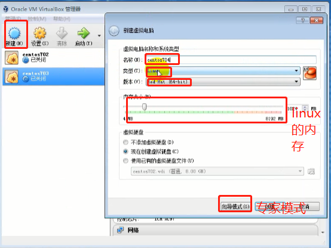

   2. 点击创建

   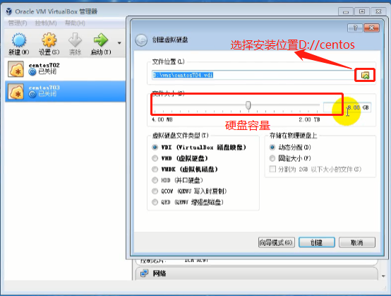

   3. 点击创建-->点击设置

   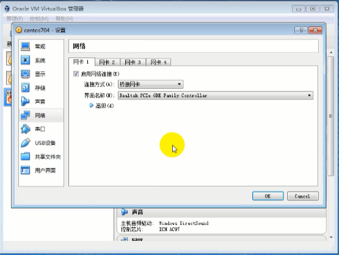

   4. 网络-->连接方式(桥接网卡),即可给虚拟机分配一个内网ip地址;

   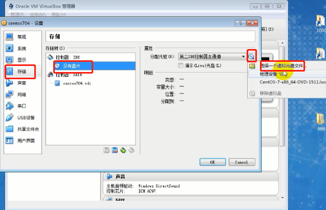

   5. 存储->没有盘片->选择一个虚拟光盘->选择CentOS-7-x86_64-DVD-1511.iso

   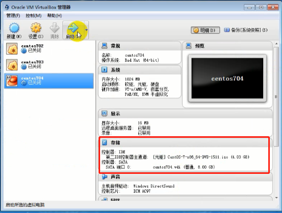

   6. 如图选择成功,点击启动

   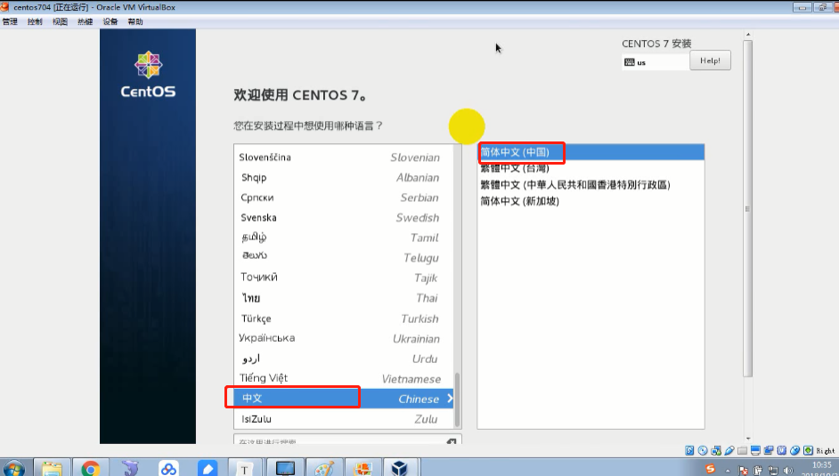

   7. 等待这个界面出现后点击如图选择语言

   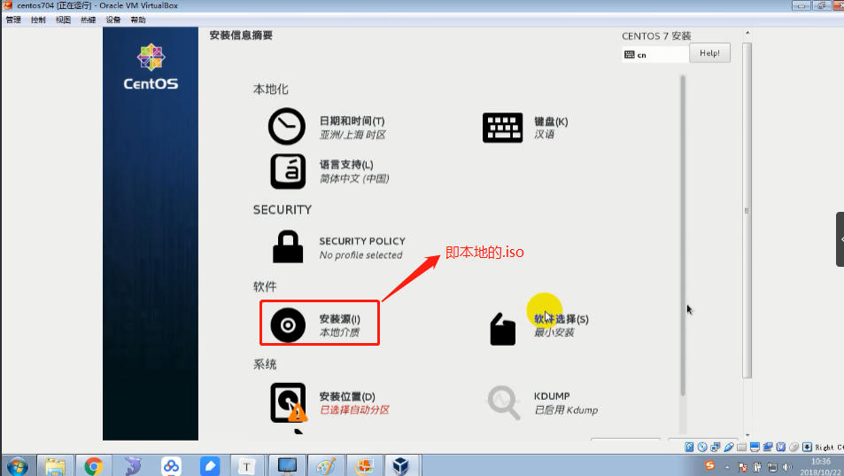

   8. 点击软件选择

   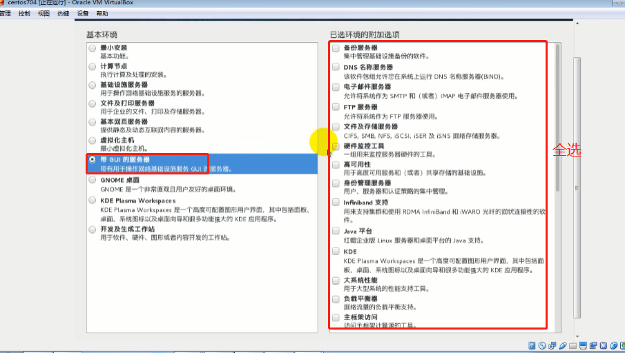

   9. 选择带gui的服务器(即带图形化界面的服务器)  -->完成

   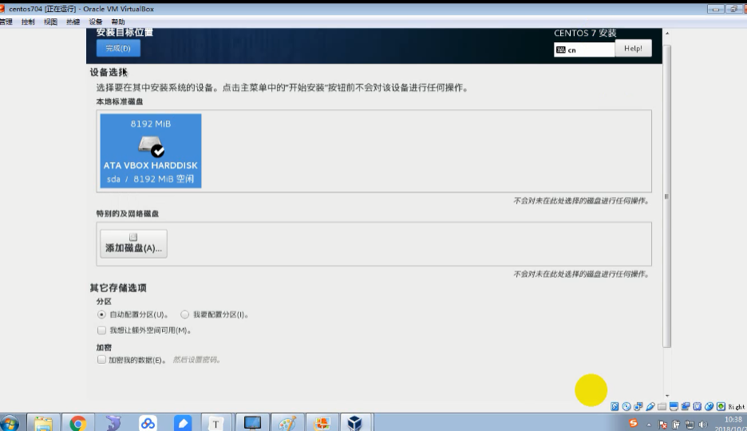

   10. 选择"安装位置"进入此界面,点击本地标准磁盘->点击完成

   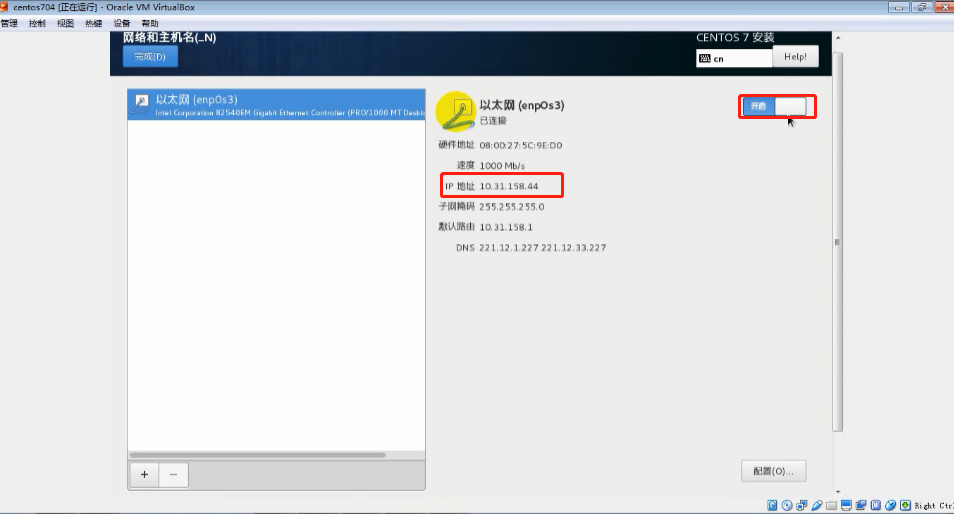

   11. 点击"网络与主机名"进入此界面,开启以太网,就会分配ip地址给此虚拟服务器

       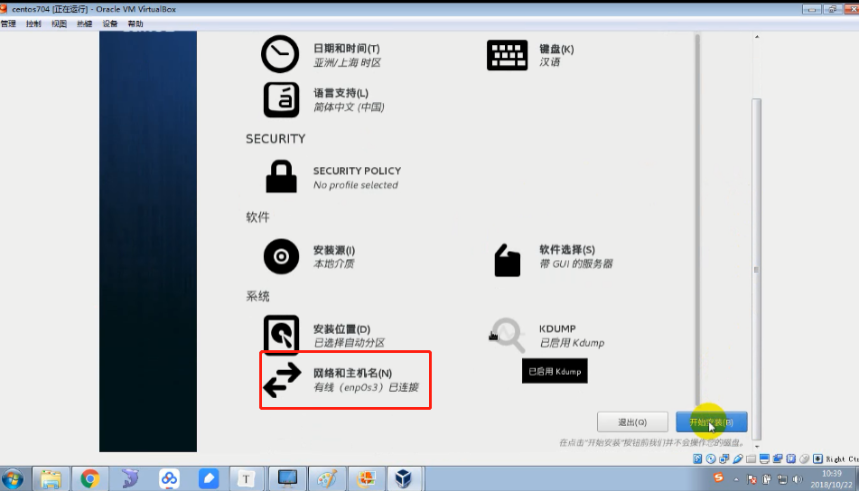

       12. 点击完成即可看到网络与主机名显示有线已连接
       13. 点击开始安装;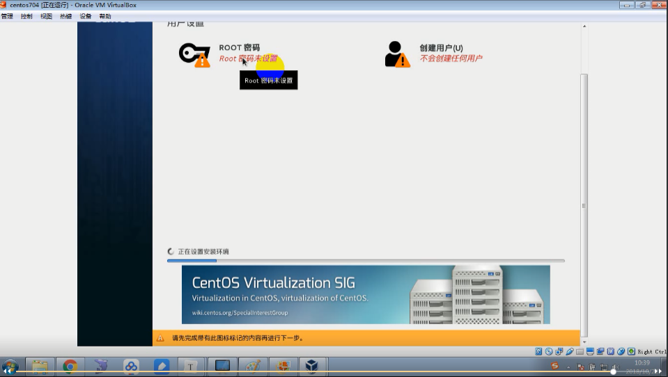
       14. 设置root密码:123
       15. 点击完成即可开始安装,大概要几个小时;
       16. 安装完成,提示重启,点击重启,直到出现如下界面

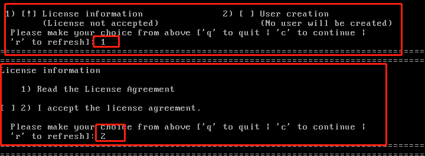

第一个选择 1(License information)   第二个选择2(I accept...)   然后q退出

然后 选择语言-->选择时区-->设置用户名(fangyan)-->设置密码(123)-->即可完成设置

下面界面直接x掉即可

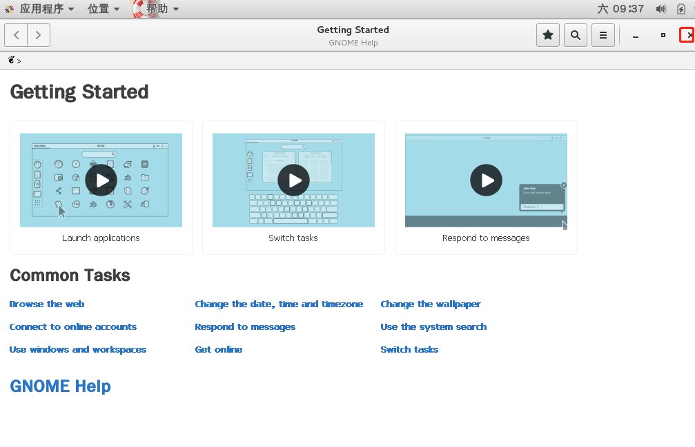

即可看到桌面界面

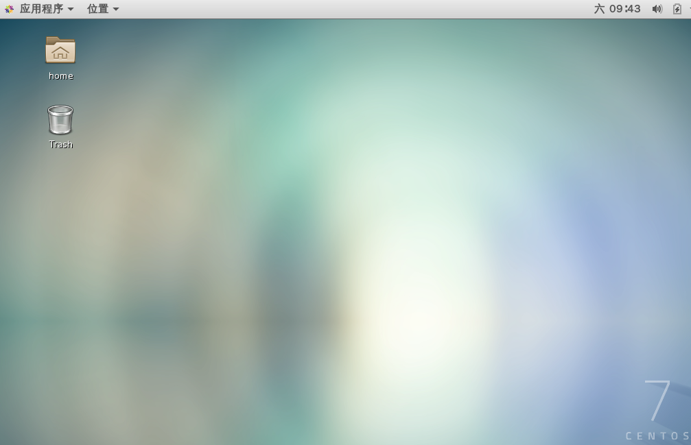

点击如下,即可看到ip地址

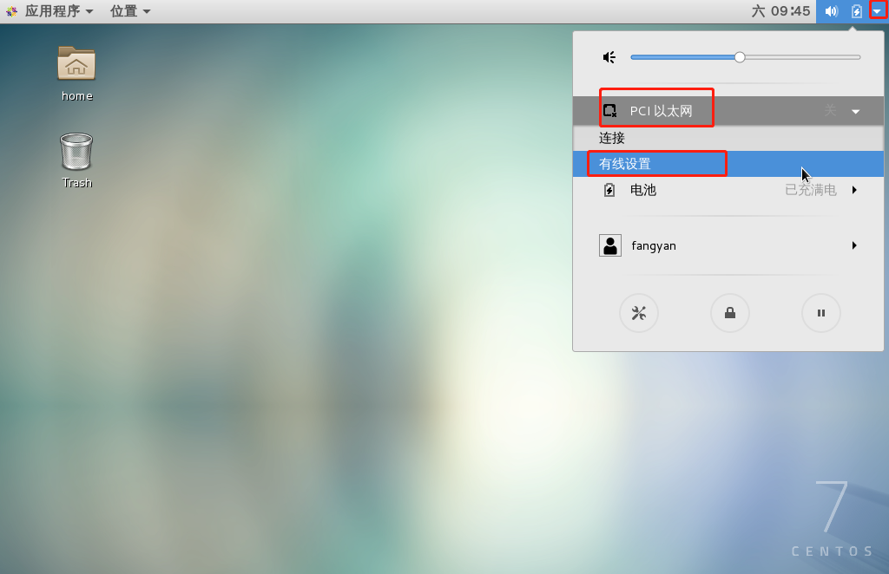

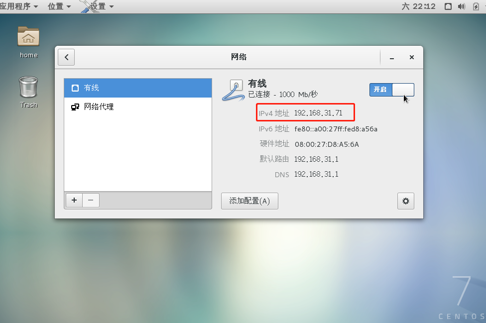

测试Windows与虚拟服务器能不能ping通

1)测试Windows到linux能否ping通

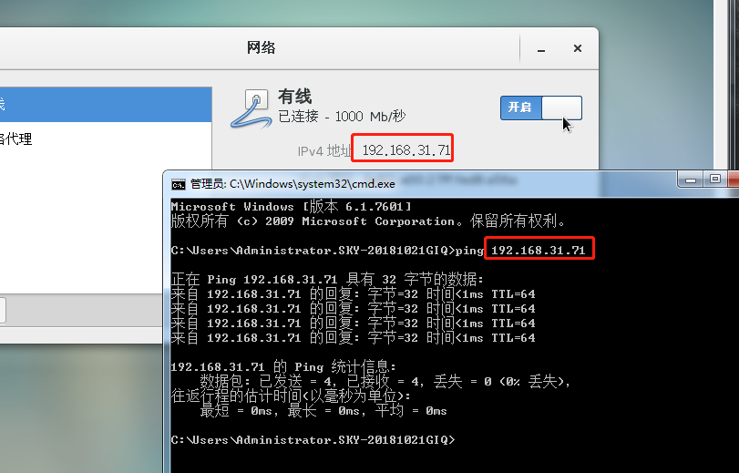

2)测试linux到Windows能否ping通

点击做上角"应用程序"->"打开终端"

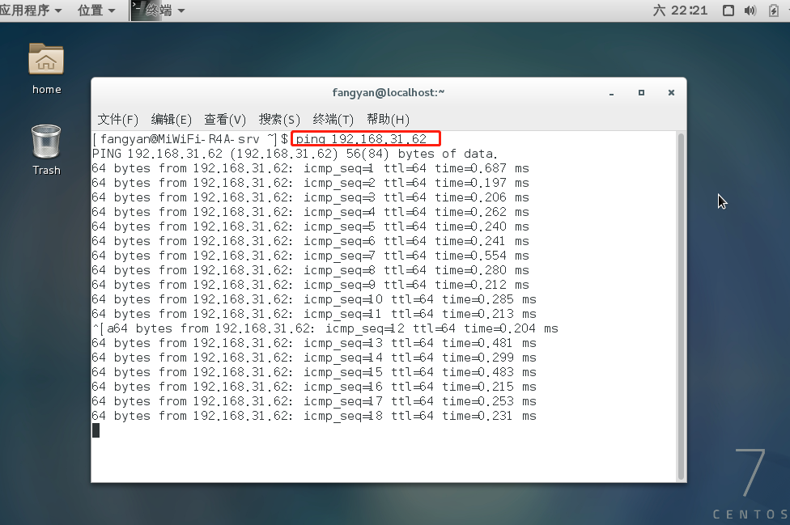

#### 4.根目录

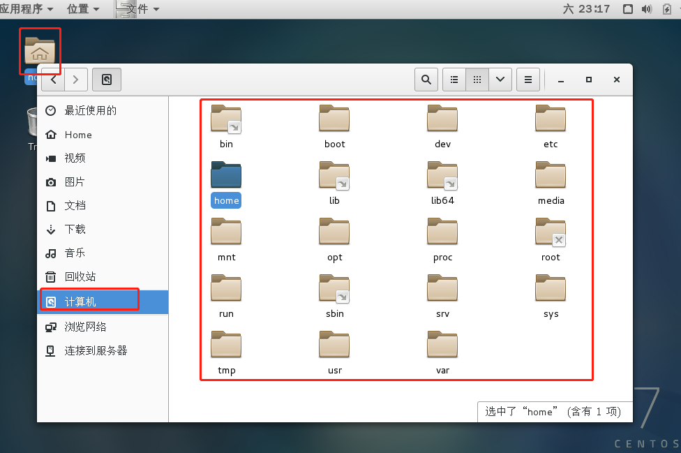

